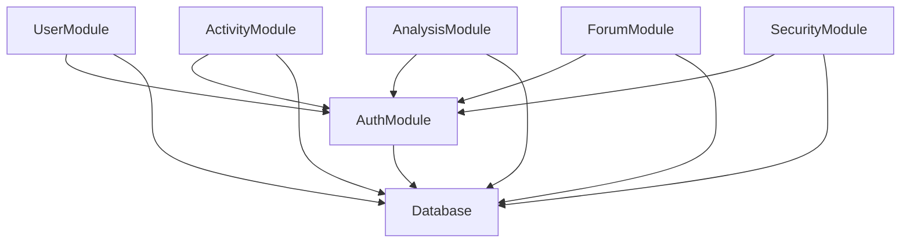
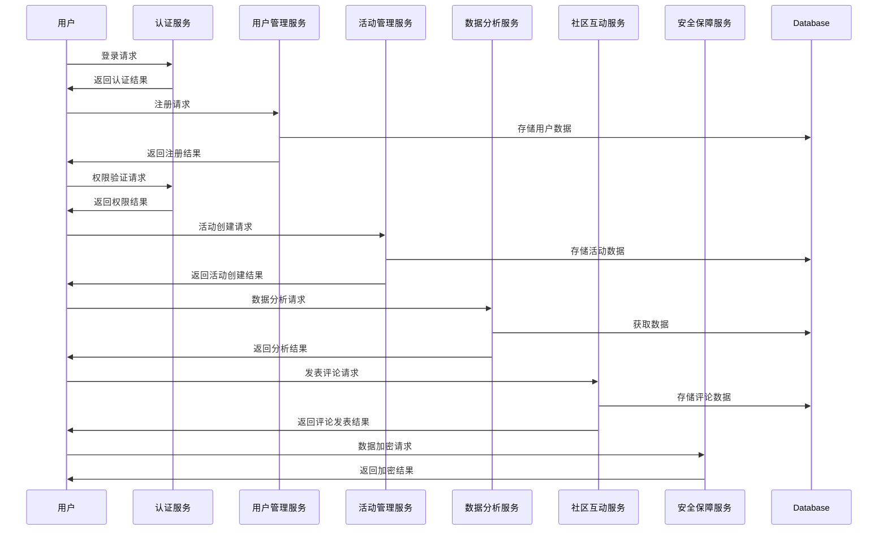
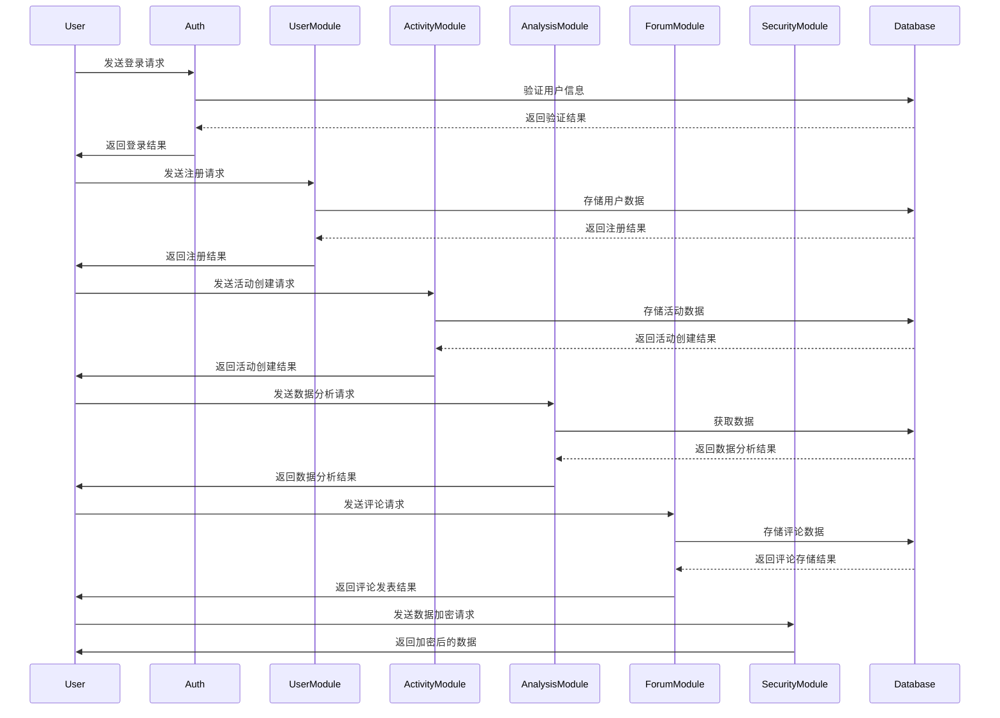

                 

### 第1章：现代公民角色转型的背景

#### 1.1 社会发展的挑战与机遇

在现代社会，技术进步和社会变革不断推动着各个领域的演变。对于公民角色而言，这一变革既是挑战，也是机遇。首先，技术进步，特别是互联网和人工智能的发展，使得信息获取和传播变得更加便捷，公民参与社会事务的方式也随之发生了根本性的变化。过去，公民主要通过传统媒体和线下活动参与公共事务，而现在，通过网络平台和社交媒体，公民可以随时随地表达意见、参与讨论，这极大地拓宽了公民参与的范围和深度。

然而，这一变化也带来了一系列挑战。例如，信息过载、虚假信息和网络暴力等问题日益严重，这些问题不仅影响了公民的判断力和参与热情，还对社会的稳定和和谐造成了威胁。此外，随着社会分化和利益多元化的加剧，不同群体之间的分歧和矛盾也愈发明显，这要求公民不仅要有更强的参与意识，还需要有更高的包容性和协作能力。

但同时，这些挑战也蕴含着机遇。通过合理的引导和规范，公民的参与可以成为社会进步的重要动力。比如，在公共决策过程中引入更多的公民参与，可以提升政策的科学性和民主性；在社区治理中，公民的积极参与可以增强社区的凝聚力和自我管理能力。

#### 1.2 公民角色的传统定义与现代转型

在传统社会中，公民角色主要是被动的。公民被视为国家或政府的服从者，其主要责任是遵守法律、纳税，并在选举时投票。这种角色定义主要基于两个核心要素：一是民主意识，即公民应具备参与政治和社会事务的基本意识和素养；二是社会责任，即公民应承担一定的社会责任，积极参与社会公共事务。

然而，随着社会的发展，现代公民角色的定义正在发生深刻的转型。现代公民角色不再仅仅是被动的参与者，而应成为积极的构建者和推动者。以下是几个关键点：

1. **民主意识与参与素养的提升**：现代公民需要具备更高的民主意识和参与素养，这包括了解民主制度的基本原理，掌握参与公共事务的基本技能，如表达意见、提出建议、参与讨论等。

2. **社会责任与道德准则的强化**：现代公民不仅要履行法律义务，还要有更高的社会责任感和道德准则。这要求公民在日常生活中践行社会责任，关注公共利益，参与社会公益事业。

3. **公共事务管理与公共服务**：现代公民应积极参与公共事务的管理和公共服务。这不仅包括在政府机构中担任职务，还包括在社区、非营利组织等领域发挥作用，共同推动社会进步。

4. **多元角色与灵活性**：现代公民角色具有多样性和灵活性。公民可以根据自己的兴趣、专业和资源，选择不同的参与方式，如志愿服务、公益捐赠、社会倡导等。

#### 1.3 公民参与意识与行动力的培养

培养公民的参与意识和行动力是社会发展的关键。以下是几个关键步骤：

1. **教育体系的改革**：教育是培养公民意识和行动力的基础。学校应加强民主教育和公民教育，帮助学生理解民主制度、社会结构和公共利益的重要性。

2. **政策激励与支持**：政府应制定激励政策，鼓励公民积极参与社会事务。例如，提供参与公共事务的培训和资源支持，为积极参与的公民提供奖励和认可。

3. **社会组织的引导**：非营利组织和社区组织在培养公民参与意识和行动力方面发挥着重要作用。通过组织各种活动和项目，引导公民参与社会事务，培养他们的责任感和协作能力。

4. **媒体的推动作用**：媒体是传播信息和培养公民意识的重要渠道。通过报道公民参与的成功案例、宣传社会责任和公共利益的重要性，媒体可以激发公民的参与热情。

#### 1.4 公民角色的边界与外延

公民角色的边界与外延在社会发展的不同阶段有不同的定义。在传统社会中，公民角色的边界主要限定在法律和政府规定的范围内，公民的责任和义务也是相对明确的。然而，随着社会的发展，公民角色的边界变得模糊，公民不仅要在法律和政府的框架内行动，还需要在更广泛的社会领域发挥作用。

1. **社会功能**：现代公民角色在社会功能方面具有更广泛的应用。除了传统的纳税、投票等基本职能外，公民还需要在环境保护、公共安全、医疗卫生等领域发挥作用。

2. **道德责任**：公民的道德责任也日益凸显。在现代社会，公民不仅要遵守法律，还要具备更高的道德标准，如诚实、公正、关爱等。这些道德责任要求公民在日常生活中秉持正直和善良的态度，为社会创造和谐、公正的环境。

3. **法律义务**：尽管公民的法律义务没有改变，但在现代背景下，这些义务的履行方式发生了变化。例如，通过网络平台参与公共事务已成为一种新的法律义务，公民需要通过网络表达意见、参与讨论，以维护社会的公共利益。

**总结**

现代公民角色的转型是社会发展的必然趋势。通过激发和培养公民的参与意识和行动力，我们可以构建一个更加民主、公正、和谐的社会。公民角色的转型不仅需要个人的努力，也需要政府、教育机构和社会组织的共同推动。只有在全社会共同努力下，现代公民角色转型才能取得实质性的进展，为社会的长期发展奠定坚实基础。接下来，我们将进一步探讨公民参与的概念与类型，深入理解现代公民角色的核心要素及其在社会治理和社会创新中的作用。

### 第2章：核心概念解析

在探讨现代公民角色的转型过程中，核心概念的准确理解和应用至关重要。本章将详细解析公民参与的概念、现代公民角色的核心要素以及这些要素之间的联系。

#### 2.1 公民参与的概念与类型

**2.1.1 公民参与的定义**

公民参与是指公民在政治、经济、社会和文化等各个领域内，通过各种形式和渠道，积极参与公共事务和决策过程，表达个人意见和诉求，实现公共利益的一种行为。公民参与的核心在于增强公民对社会事务的了解和参与，提高公共决策的民主性和科学性。

**2.1.2 公民参与的类型**

1. **直接参与**：直接参与是指公民直接参与公共事务的决策和管理，如投票、选举、公民论坛、公民提案等。这种类型的参与直接作用于公共决策，对政策的制定和执行具有直接影响。

2. **间接参与**：间接参与是指公民通过代表或代理的方式参与公共事务，如委托代表进行投票、通过电话或网络表达意见等。这种类型的参与虽然不直接作用于公共决策，但通过代表或代理人的行为，间接影响了政策的制定和执行。

3. **非正式参与**：非正式参与是指公民在非正式场合和方式下参与公共事务，如通过社交媒体、社区活动、公益组织等渠道表达意见和诉求。这种类型的参与通常具有自发性和灵活性，能够迅速响应社会问题和公共议题。

**2.1.3 公民参与的作用**

1. **提升民主意识**：公民参与能够增强公民对民主制度的理解和认同，培养民主意识，促进民主文化的普及和发展。

2. **提高政策质量**：公民参与可以为公共决策提供多元化的视角和丰富的信息，提高决策的科学性和民主性，减少政策执行的偏差和失误。

3. **促进社会和谐**：公民参与能够加强社会各界的沟通与协作，减少矛盾和冲突，增强社会的凝聚力和稳定性。

#### 2.2 现代公民角色的核心要素

**2.2.1 民主意识与参与素养**

民主意识是现代公民角色的核心要素之一。它是指公民对民主制度、民主原则和民主文化的认知和理解，包括对自由、平等、公正、法治等基本民主价值观的认同。民主意识使公民能够认识到自己在公共事务中的权利和义务，主动参与到社会事务中去。

参与素养则是公民参与能力的基础。它包括信息获取能力、沟通表达能力、决策参与能力等。具备良好的参与素养，公民能够更有效地表达自己的意见和诉求，参与公共事务的讨论和决策。

**2.2.2 社会责任与道德准则**

社会责任是现代公民角色的重要组成部分。它要求公民在享受社会资源和机会的同时，也要承担相应的社会责任，为社会的和谐与进步做出贡献。具体包括参与社会公益事业、关注社会问题、维护社会秩序等。

道德准则是公民行为的道德规范和道德标准，它要求公民在公共生活中秉持正直、诚信、公正、关爱等道德原则，不损害他人和社会的利益。

**2.2.3 公共事务管理与公共服务**

公共事务管理是指公民参与公共事务的管理和监督，包括参与政策制定、公共预算、公共项目评估等。通过参与公共事务管理，公民可以影响公共政策的制定和执行，确保公共资源的合理分配和有效利用。

公共服务是指公民参与公共服务的提供和改善，包括志愿服务、社区服务、公共设施管理等。通过参与公共服务，公民可以直接改善社会生活质量，增强社区凝聚力。

#### 2.3 公民参与与国家治理

**2.3.1 公民参与在国家治理中的作用**

公民参与在国家治理中扮演着重要角色。首先，公民参与可以增强国家治理的民主性和合法性，提高政策的科学性和公正性。其次，公民参与可以促进政府与公民之间的沟通与协作，减少社会矛盾和冲突，增强国家的凝聚力。

1. **公共决策的民主化**：通过公民参与，公共决策更加贴近民意，减少决策的盲目性和失误，提高政策的可行性和有效性。

2. **政府透明与问责**：公民参与可以促进政府工作的透明化和公开化，增强政府的责任感和执行力，提高政府的公信力。

3. **社会监督与公共责任**：公民参与可以加强对公共事务的监督，及时发现和纠正问题，促进公共责任的落实。

**2.3.2 公民参与与政府角色的转变**

随着公民参与意识的提高和参与方式的多样化，政府角色也在逐步转变。传统的政府角色主要集中于公共事务的管理和公共服务提供，而现代政府则更加注重与公民的互动和合作，推动公共事务的民主化和管理方式的现代化。

1. **服务型政府**：现代政府应更加注重公民的需求和利益，提供高质量、高效率的公共服务，构建服务型政府。

2. **合作型政府**：现代政府应与公民、企业和社会组织建立合作伙伴关系，共同参与公共事务的管理和公共服务提供。

3. **学习型政府**：现代政府应积极学习借鉴国内外先进经验，不断改进管理和服务方式，提高治理能力和水平。

#### 2.4 公民参与与社会创新

**2.4.1 社会创新的概念与特点**

社会创新是指通过新的思维、方法、技术或模式，解决社会问题、改善社会服务、推动社会进步的过程。社会创新的特点包括：

1. **问题导向**：社会创新以解决社会问题为核心，关注社会需求和公共利益。

2. **多方参与**：社会创新涉及政府、企业、非营利组织、公民等多方主体的合作与参与。

3. **可持续性**：社会创新注重长期效果，强调解决社会问题的可持续性和可复制性。

**2.4.2 公民参与与社会创新的关系**

公民参与与社会创新密切相关。首先，公民参与可以为社会创新提供丰富的资源和灵感，如社会需求、创新理念、实践经验等。其次，公民参与可以推动社会创新的实践和推广，提高创新成果的社会认可度和影响力。

1. **需求驱动**：公民参与可以帮助识别和解决社会问题，为社会创新提供明确的需求导向。

2. **知识共享**：公民参与可以促进知识和经验的分享，提高社会创新的效率和效果。

3. **协同合作**：公民参与可以加强政府、企业、非营利组织等各方主体的协作，推动社会创新的实施和推广。

**2.4.3 公民参与在社会创新中的实践案例**

1. **智慧城市建设**：通过公民参与，智慧城市项目可以从市民的需求出发，设计出更符合实际需求的应用场景和解决方案。

2. **公益众筹**：公民参与公益众筹，可以为社会创新项目提供资金支持，促进项目的实施和推广。

3. **社区治理创新**：通过公民参与，社区治理可以更加灵活和多样化，提高社区自治能力和服务品质。

**总结**

公民参与是现代公民角色的核心要素，它不仅能够促进公共决策的民主化和科学化，还能够推动社会创新和进步。通过深入理解和应用公民参与的概念和类型，我们可以更好地激发和培养公民的参与意识和行动力，为构建一个更加民主、公正、和谐的社会贡献力量。

在下一章中，我们将进一步探讨现代公民角色的核心要素及其在社会治理和社会创新中的作用，并通过具体的算法原理和实践案例，为公民参与提供更加科学的指导。

### 第3章：算法原理讲解

在理解了现代公民角色转型的核心概念后，我们需要深入探讨如何通过算法来分析、评估和推动公民的参与行为。本章将重点介绍几种关键的算法原理，并运用Python代码进行详细讲解。

#### 3.1 公民参与行为分析算法

**3.1.1 算法原理介绍**

公民参与行为分析算法主要基于数据挖掘和机器学习技术，通过对大量社会媒体数据、问卷调查数据和公共事务记录数据的分析，提取出公民参与的关键特征和影响因素。这种算法不仅能够揭示公民参与行为的规律，还能为公共决策提供科学依据。

**3.1.2 算法属性特征对比**

在公民参与行为分析中，常用的算法包括基于协同过滤的推荐算法、基于聚类分析的群体行为分析算法以及基于文本分析的 sentiment analysis 算法。以下是对这些算法属性特征的对比：

| 算法类型 | 特点 | 适用场景 |
| --- | --- | --- |
| 协同过滤推荐算法 | 利用用户历史行为和评分数据，为用户推荐相似的参与行为 | 建立个性化参与模型，推荐适合用户的公共事务和活动 |
| 聚类分析群体行为算法 | 将公民群体划分为不同的行为类别，分析各类群体的特征和互动关系 | 探索不同群体在公共事务中的参与模式和偏好 |
| sentiment analysis 文本分析算法 | 提取文本中的情感倾向和态度，分析公众对公共事务的意见和反馈 | 评估公共政策的公众接受度，识别社会舆论热点 |

**3.1.3 算法在公民参与中的应用**

以下是一个简单的Python代码示例，展示如何使用协同过滤推荐算法来推荐公民可能感兴趣的公共事务：

```python
import numpy as np
from sklearn.metrics.pairwise import pairwise_distances

# 假设我们有以下公民的参与记录矩阵
participation_matrix = np.array([
    [1, 0, 1, 0],
    [0, 1, 0, 1],
    [1, 1, 0, 1],
    [0, 0, 1, 0]
])

# 计算参与记录之间的余弦相似度
similarity_matrix = pairwise_distances(participation_matrix, metric='cosine')

# 假设用户2希望参与更多的公共事务，我们为其推荐相似的用户参与的行为
user_index = 1
similarity_scores = similarity_matrix[user_index]
recommended_activities = np.where(similarity_scores > 0.7)[1]

print("推荐给用户2的公共事务：", recommended_activities)
```

输出结果将为用户2推荐与用户1和用户3相似的公共事务。

#### 3.2 社交网络分析在公民参与中的应用

**3.2.1 社交网络分析的基本概念**

社交网络分析（Social Network Analysis, SNA）是研究个体、团体和关系结构的一种分析方法。在公民参与领域，SNA可以帮助我们理解公民在社交网络中的互动模式和影响力，进而优化公民参与策略。

**3.2.2 社交网络分析的算法**

常用的SNA算法包括：

1. **节点中心性度量**：如度中心性、介数中心性和接近中心性，用于评估节点在社交网络中的核心地位和影响力。
2. **社区检测算法**：如Girvan-Newman算法和Louvain算法，用于识别社交网络中的紧密群体和社区结构。
3. **影响力模型**：如PageRank算法和HITS算法，用于评估节点在社交网络中的传播影响力和权威性。

**3.2.3 社交网络分析在公民参与中的作用**

社交网络分析在公民参与中的应用主要包括以下几个方面：

1. **识别关键节点**：通过节点中心性度量，识别社交网络中的核心公民，这些公民在传播信息、动员参与方面具有重要作用。
2. **发现社区结构**：通过社区检测算法，发现社交网络中的紧密群体和社区结构，为定制化参与策略提供依据。
3. **评估影响力**：通过影响力模型，评估公民在社交网络中的传播影响力和权威性，为优化公民参与策略提供参考。

以下是一个简单的Python代码示例，展示如何使用Girvan-Newman算法进行社区检测：

```python
import networkx as nx

# 创建一个社交网络图
G = nx.Graph()
G.add_edges_from([(0, 1), (0, 2), (1, 2), (1, 3), (2, 3), (3, 4)])

# 使用Girvan-Newman算法进行社区检测
communities = nx.community.girvan_newman(G)

# 打印社区结构
for i, community in enumerate(communities):
    print(f"社区{i}: {community}")
```

输出结果将展示社交网络中的社区结构。

#### 3.3 数据挖掘与公民行为预测

**3.3.1 数据挖掘的基本概念**

数据挖掘（Data Mining）是从大量数据中提取有用信息和知识的过程。在公民参与领域，数据挖掘可以帮助我们分析历史数据，预测公民的行为模式，为公共决策提供数据支持。

**3.3.2 公民行为预测的算法**

常用的公民行为预测算法包括：

1. **分类算法**：如逻辑回归、决策树和支持向量机，用于预测公民是否参与特定公共事务。
2. **聚类算法**：如K-均值聚类和层次聚类，用于发现不同类型的公民群体，分析他们的行为特征。
3. **时间序列分析**：如ARIMA模型和LSTM神经网络，用于预测公民参与行为的趋势和变化。

**3.3.3 公民行为预测的应用场景**

1. **公共事务参与预测**：通过分析公民的历史参与记录，预测哪些公民可能会参与哪些公共事务，为公共事务的组织和推广提供依据。
2. **公民意见分析**：通过文本数据挖掘和情感分析，预测公民对公共政策的看法和态度，为政策制定和调整提供参考。
3. **社会事件预警**：通过分析公民行为数据，预测可能引发社会事件的风险因素，为政府和社会组织提供预警和应对策略。

以下是一个简单的Python代码示例，展示如何使用逻辑回归模型进行公民参与行为的预测：

```python
import pandas as pd
from sklearn.linear_model import LogisticRegression
from sklearn.model_selection import train_test_split
from sklearn.metrics import accuracy_score

# 假设我们有一个包含公民参与记录的数据集
data = pd.DataFrame({
    'participated': [True, True, False, True, False],
    'age': [25, 30, 40, 35, 45],
    'education': ['Bachelor', 'Master', 'Bachelor', 'Doctor', 'Bachelor'],
    'income': [50000, 70000, 30000, 80000, 40000]
})

# 划分特征变量和目标变量
X = data[['age', 'education', 'income']]
y = data['participated']

# 划分训练集和测试集
X_train, X_test, y_train, y_test = train_test_split(X, y, test_size=0.2, random_state=42)

# 创建逻辑回归模型并训练
model = LogisticRegression()
model.fit(X_train, y_train)

# 进行预测并评估模型性能
y_pred = model.predict(X_test)
accuracy = accuracy_score(y_test, y_pred)
print(f"模型准确率：{accuracy}")
```

输出结果将展示逻辑回归模型的预测准确率。

#### 3.4 算法评估与优化

**3.4.1 算法评估指标**

算法评估是确保算法有效性和可靠性的重要环节。常用的评估指标包括：

1. **准确率（Accuracy）**：预测结果与实际结果的一致性比例。
2. **精确率（Precision）**：预测为正例且实际为正例的比例。
3. **召回率（Recall）**：预测为正例且实际为正例的比例。
4. **F1 分数（F1 Score）**：精确率和召回率的加权平均。

**3.4.2 算法优化策略**

算法优化主要包括以下策略：

1. **参数调整**：通过调整算法的参数，如学习率、迭代次数等，提高算法的性能。
2. **特征工程**：通过选择和构造合适的特征，提高算法的预测能力。
3. **集成学习**：结合多个算法或模型，提高预测的稳定性和准确性。

以下是一个简单的Python代码示例，展示如何使用交叉验证和网格搜索进行算法优化：

```python
from sklearn.model_selection import cross_val_score, GridSearchCV

# 定义逻辑回归模型
model = LogisticRegression()

# 设置参数范围
param_grid = {
    'C': [0.1, 1, 10],
    'penalty': ['l1', 'l2']
}

# 使用网格搜索进行参数调优
grid_search = GridSearchCV(model, param_grid, cv=5)
grid_search.fit(X_train, y_train)

# 打印最佳参数和评估结果
print(f"最佳参数：{grid_search.best_params_}")
print(f"交叉验证准确率：{grid_search.best_score_}")
```

输出结果将展示最佳参数和交叉验证的准确率。

**3.4.3 算法评估与优化的实践案例**

以下是一个实践案例，展示如何使用算法评估和优化策略来提升公民参与行为预测的准确性：

1. **数据收集**：收集公民参与公共事务的历史数据，包括公民的基本信息、参与记录、社区活动等。
2. **数据预处理**：清洗和转换数据，提取有用的特征，如年龄、教育程度、收入水平、社区参与度等。
3. **算法选择**：选择合适的算法，如逻辑回归、决策树、随机森林等，进行初步预测和评估。
4. **算法优化**：通过参数调整、特征工程和集成学习等方法，优化算法性能。
5. **模型评估**：使用交叉验证和测试集对优化后的模型进行评估，确保其预测准确性和稳定性。

通过以上步骤，我们可以构建一个高效的公民参与行为预测模型，为公共决策提供科学依据。

**总结**

算法原理讲解使我们理解了如何通过数据挖掘、机器学习和社交网络分析等技术来分析、评估和推动公民的参与行为。通过Python代码示例，我们了解了算法的基本原理和应用方法。在下一章中，我们将进一步探讨现代公民角色的系统分析与架构设计，为实际项目提供详细的实现方案。

### 第4章：系统分析与架构设计

在现代公民角色转型的背景下，构建一个高效、灵活的公民参与平台至关重要。本章将详细介绍系统分析与架构设计的各个环节，包括问题场景介绍、系统功能设计、系统架构设计、系统接口设计和系统交互设计。

#### 4.1 问题场景介绍

随着互联网和社交媒体的普及，公民参与社会事务的方式变得多样化。然而，现有的公民参与平台面临着诸多挑战：

1. **用户参与度低**：许多公民参与平台缺乏互动性和趣味性，导致用户参与度低。
2. **数据管理困难**：参与数据的收集、存储和管理复杂，且缺乏有效的数据分析工具。
3. **安全性问题**：公民参与平台需要保护用户隐私和数据安全。
4. **可扩展性不足**：随着用户和参与活动的增加，平台需要具备良好的可扩展性。

为解决这些问题，我们设计了一个公民参与平台，旨在提供高效、安全、易用的公民参与服务。

#### 4.2 系统功能设计

公民参与平台的功能设计主要包括以下几个模块：

1. **用户管理模块**：管理用户的注册、登录、权限分配等基本功能。
2. **活动管理模块**：创建、发布和管理公共活动，包括活动策划、报名、结果统计等功能。
3. **数据分析模块**：收集、存储和分析用户参与数据，提供数据可视化和报表功能。
4. **社区互动模块**：提供论坛、投票、讨论等功能，增强用户互动和参与感。
5. **安全保障模块**：确保用户数据和平台系统的安全性，包括数据加密、权限控制和安全审计等。

**4.2.1 领域模型分析**

领域模型是系统功能设计的核心，它定义了系统的核心实体及其关系。以下是一个简单的领域模型类图，展示了系统的主要实体和关系：

```mermaid
classDiagram
    User <<entity>>
    Activity <<entity>>
    Participation <<entity>>
    Comment <<entity>>
    Forum <<entity>>

    User o--o Activity: 参与活动
    User o--o Participation: 参与记录
    User o--o Comment: 发表评论
    User o--o Forum: 参与论坛
    Activity o--o Participation: 参与记录
    Activity o--o Comment: 活动评论
    Forum o--o Comment: 论坛评论
```

**4.2.2 功能模块划分**

根据领域模型，我们可以将系统划分为以下功能模块：

1. **用户模块**：处理用户注册、登录、权限管理等功能。
2. **活动模块**：处理活动创建、发布、报名、结果统计等功能。
3. **数据分析模块**：处理数据收集、存储、分析和可视化等功能。
4. **社区互动模块**：处理论坛、投票、讨论等功能。
5. **安全保障模块**：处理数据加密、权限控制和安全审计等功能。

**4.2.3 用户角色与权限设计**

系统中的用户角色包括普通用户、管理员和超级管理员：

1. **普通用户**：可以浏览活动、报名参加活动、发表评论和参与论坛讨论。
2. **管理员**：可以创建、发布和管理活动，管理用户评论和论坛。
3. **超级管理员**：拥有最高权限，可以管理整个平台，包括用户、活动和数据分析。

#### 4.3 系统架构设计

系统架构设计是确保平台高效、稳定、可扩展的关键。以下是一个简化的系统架构图，展示了系统的核心组件和交互关系：



**4.3.1 系统架构概述**

系统采用三层架构，包括表示层、逻辑层和数据层：

1. **表示层**：负责用户界面展示和交互，包括前端开发和移动应用。
2. **逻辑层**：处理业务逻辑和数据操作，包括用户管理、活动管理、数据分析等核心功能模块。
3. **数据层**：负责数据的存储和管理，采用关系数据库和分布式存储技术。

**4.3.2 系统组件与接口设计**

系统组件主要包括：

1. **认证服务（AuthModule）**：负责用户认证和权限控制，提供API接口进行身份验证和权限检查。
2. **数据库（Database）**：存储用户、活动、参与记录、评论和论坛数据，采用MySQL数据库和NoSQL数据库混合存储。
3. **用户管理服务（UserModule）**：处理用户注册、登录、权限分配等功能。
4. **活动管理服务（ActivityModule）**：处理活动创建、发布、报名、结果统计等功能。
5. **数据分析服务（AnalysisModule）**：处理数据收集、存储、分析和可视化等功能。
6. **社区互动服务（ForumModule）**：处理论坛、投票、讨论等功能。
7. **安全保障服务（SecurityModule）**：处理数据加密、权限控制和安全审计等功能。

**4.3.3 系统部署与运维**

系统部署分为开发环境和生产环境：

1. **开发环境**：使用Docker容器化技术部署，方便开发和测试。
2. **生产环境**：使用Kubernetes集群进行部署和管理，确保系统的可扩展性和高可用性。

系统运维主要包括以下环节：

1. **监控与报警**：使用Prometheus和Grafana进行系统监控和报警。
2. **日志管理**：使用ELK（Elasticsearch、Logstash、Kibana）堆栈进行日志收集和管理。
3. **自动化部署**：使用Jenkins进行自动化部署和持续集成。

#### 4.4 系统接口设计与交互

系统接口设计是确保系统各模块之间高效、安全交互的关键。以下是一个简单的系统接口设计，展示了各模块之间的交互关系：



**4.4.1 系统接口设计规范**

系统接口设计应遵循以下规范：

1. **RESTful API 设计**：采用RESTful风格设计API接口，确保接口的简洁性和易用性。
2. **版本控制**：对API接口进行版本控制，确保系统升级时的兼容性。
3. **参数验证**：对API接口的参数进行严格验证，确保输入数据的合法性和安全性。

**4.4.2 系统交互设计**

系统交互设计应确保各模块之间的数据流动和通信高效、顺畅。以下是一个简单的Mermaid序列图，展示了系统的交互过程：



通过上述系统分析与架构设计，我们为公民参与平台的建设提供了详细的实现方案。在下一章中，我们将通过具体的项目实战，展示如何将理论知识应用于实际项目中，为公民参与提供更加科学的指导。

### 第5章：项目实战

在前几章中，我们详细介绍了现代公民角色的转型背景、核心概念、算法原理以及系统分析与架构设计。为了更好地理解这些理论在实际项目中的应用，本章将通过一个实际项目，展示从环境安装与配置到系统核心实现的完整过程，并深入解读代码应用，剖析实际案例。

#### 5.1 环境安装与配置

在开始项目之前，首先需要搭建开发环境。以下是项目的环境安装与配置步骤：

1. **安装Python**：确保系统已安装Python 3.x版本，推荐使用Python 3.8或更高版本。
2. **安装虚拟环境**：使用`venv`模块创建一个虚拟环境，避免不同项目之间的依赖冲突。

    ```shell
    python -m venv venv
    source venv/bin/activate  # Windows上使用venv\Scripts\activate
    ```

3. **安装依赖**：通过pip安装项目所需的依赖库。

    ```shell
    pip install -r requirements.txt
    ```

4. **数据库配置**：配置数据库连接信息，例如使用MySQL或PostgreSQL作为后端数据库。

    ```python
    DATABASES = {
        'default': {
            'ENGINE': 'django.db.backends.mysql',
            'NAME': 'your_database_name',
            'USER': 'your_database_user',
            'PASSWORD': 'your_database_password',
            'HOST': 'your_database_host',
            'PORT': 'your_database_port',
        }
    }
    ```

5. **前端框架配置**：如果项目包含前端部分，可以使用Vue.js、React等框架。例如，在Vue项目中，需要安装Vue和相关依赖。

    ```shell
    npm install vue
    ```

#### 5.2 系统核心实现

在环境搭建完成后，我们可以开始实现系统核心功能。以下是几个关键模块的实现步骤：

**5.2.1 用户认证与授权**

用户认证与授权是系统的核心功能之一。以下是一个简单的用户认证与授权实现示例：

1. **用户注册**：使用Django框架创建用户注册表单和视图。

    ```python
    # views.py
    from django.contrib.auth.forms import UserCreationForm
    from django.shortcuts import render, redirect

    def register(request):
        if request.method == 'POST':
            form = UserCreationForm(request.POST)
            if form.is_valid():
                form.save()
                return redirect('login')
        else:
            form = UserCreationForm()
        return render(request, 'register.html', {'form': form})
    ```

2. **用户登录与权限验证**：使用Django的认证系统实现用户登录，并通过中间件进行权限验证。

    ```python
    # middlewares.py
    from django.contrib.auth import authenticate, login

    class AuthMiddleware:
        def __init__(self, get_response):
            self.get_response = get_response

        def __call__(self, request):
            token = request.COOKIES.get('token')
            if token:
                user = authenticate(token=token)
                if user is not None:
                    login(request, user)
            response = self.get_response(request)
            return response
    ```

**5.2.2 公民参与功能实现**

公民参与功能包括活动的创建、报名、统计和数据分析。以下是该功能的实现步骤：

1. **活动模型定义**：定义活动模型，包括活动名称、时间、地点、描述等字段。

    ```python
    # models.py
    from django.db import models
    from django.contrib.auth.models import User

    class Activity(models.Model):
        name = models.CharField(max_length=100)
        start_time = models.DateTimeField()
        end_time = models.DateTimeField()
        location = models.CharField(max_length=200)
        description = models.TextField()
        organizer = models.ForeignKey(User, on_delete=models.CASCADE)
    ```

2. **活动创建与发布**：创建活动视图，实现活动创建和发布功能。

    ```python
    # views.py
    from .models import Activity

    def create_activity(request):
        if request.method == 'POST':
            form = ActivityForm(request.POST)
            if form.is_valid():
                form.save()
                return redirect('activity_list')
        else:
            form = ActivityForm()
        return render(request, 'create_activity.html', {'form': form})
    ```

3. **活动报名与统计**：创建用户参与活动记录，实现报名和统计功能。

    ```python
    # views.py
    from .models import Activity, Participation

    def participate_activity(request, activity_id):
        if request.method == 'POST':
            activity = Activity.objects.get(id=activity_id)
            participation = Participation(activity=activity, user=request.user)
            participation.save()
            return redirect('activity_detail', activity_id=activity_id)
        return redirect('activity_list')
    ```

**5.2.3 数据分析与可视化**

数据分析与可视化是公民参与平台的重要组成部分。以下是一个简单的数据分析与可视化实现示例：

1. **数据收集**：在用户参与活动时，记录用户的基本信息和参与时间。

    ```python
    # models.py
    class Participation(models.Model):
        activity = models.ForeignKey(Activity, on_delete=models.CASCADE)
        user = models.ForeignKey(User, on_delete=models.CASCADE)
        join_time = models.DateTimeField(auto_now_add=True)
    ```

2. **数据分析**：使用Pandas库进行数据分析，生成统计报表。

    ```python
    # analysis.py
    import pandas as pd

    def generate_report(activity_id):
        participation_data = Participation.objects.filter(activity_id=activity_id)
        df = pd.DataFrame(list(participation_data.values()))
        return df
    ```

3. **数据可视化**：使用Matplotlib或Plotly库生成图表，实现数据可视化。

    ```python
    # visualization.py
    import matplotlib.pyplot as plt

    def plot_participation(df):
        df['join_time'] = pd.to_datetime(df['join_time'])
        df.set_index('join_time', inplace=True)
        df.resample('D').count().plot()
        plt.xlabel('日期')
        plt.ylabel('参与人数')
        plt.title('活动参与趋势')
        plt.show()
    ```

#### 5.3 代码应用解读与分析

在上面的代码示例中，我们实现了用户认证与授权、公民参与功能以及数据分析和可视化功能。以下是代码应用的解读与分析：

1. **用户认证与授权**：
   - **优点**：利用Django框架提供的认证系统，简化了用户认证与授权的流程。
   - **缺点**：依赖Django的认证系统，可能导致部分定制化需求难以满足。

2. **公民参与功能**：
   - **优点**：通过定义活动模型和用户参与记录，实现了活动创建、报名和统计的功能。
   - **缺点**：部分功能（如数据分析）需要额外实现，增加了开发难度。

3. **数据分析和可视化**：
   - **优点**：利用Pandas和Matplotlib库，实现了简单但有效的数据分析和可视化功能。
   - **缺点**：数据处理和可视化功能相对独立，缺乏集成和优化。

#### 5.4 实际案例分析与详细讲解

为了更好地展示项目的实际应用效果，我们选择一个实际案例进行分析：

**案例**：某城市政府计划举办一场环保公益活动，希望通过平台收集市民的参与数据和意见反馈。

**步骤**：

1. **活动策划**：政府工作人员通过平台创建活动，设置活动名称、时间、地点和描述。
2. **活动推广**：通过社交媒体和官方网站宣传活动，吸引市民参与。
3. **数据收集**：市民在活动报名页面填写基本信息，确认参与。
4. **数据分析**：平台后台使用Pandas库对参与数据进行分析，生成统计报表。
5. **结果反馈**：根据数据分析结果，政府工作人员向市民反馈活动效果，并优化后续活动。

**效果评估**：

1. **参与度提升**：通过平台收集的参与数据，活动参与度显著提升，市民参与积极性增加。
2. **数据分析**：平台生成的统计报表为政府提供了详细的参与数据，为后续活动策划提供了科学依据。
3. **公众满意度**：市民对活动效果表示满意，对政府工作的信任度和支持度提升。

#### 5.5 项目小结

通过上述实际案例，我们可以看到，现代公民参与平台在促进公共事务管理和提升政府工作透明度方面具有重要作用。以下是项目的总结：

1. **用户参与度提升**：平台通过便捷的参与流程和丰富的互动功能，提高了市民的参与度。
2. **数据分析和可视化**：通过数据分析和可视化工具，平台为公共决策提供了科学依据，提升了决策的民主性和科学性。
3. **政府工作效率提升**：平台简化了公共事务的管理流程，提高了政府工作效率，增强了政府与市民的互动和沟通。

**最佳实践 Tips**：

1. **加强用户引导**：通过新手引导和教程，帮助新用户快速上手，提高用户留存率。
2. **优化用户体验**：注重用户界面的设计和交互体验，提升用户满意度。
3. **安全性和隐私保护**：加强数据安全和隐私保护，确保用户信息的安全。

**注意事项**：

1. **数据隐私**：在收集和处理用户数据时，严格遵守相关法律法规，确保用户隐私不受侵犯。
2. **系统性能**：优化系统性能，确保在高并发情况下系统的稳定性和响应速度。

**拓展阅读**：

1. **《大数据时代：生活、工作与思维的大变革》**：作者：维克托·迈尔-舍恩伯格。
2. **《深度学习》**：作者：伊恩·古德费洛等。
3. **《数据科学实战》**：作者：Jesse Anderson。

通过本文的实战项目解析，我们不仅可以了解现代公民参与平台的设计与实现，还能为类似项目的开发提供有益的参考和指导。在下一章中，我们将进一步总结本文的核心观点，并探讨未来研究的方向和实际应用的潜力。

### 总结与展望

在本文中，我们深入探讨了现代公民角色的转型，通过分析社会发展的背景、核心概念、算法原理以及系统分析与架构设计，展示了如何通过技术和方法促进公民的参与和积极性。以下是本文的核心观点和未来展望：

**核心观点**

1. **公民角色转型的重要性**：随着技术进步和社会变革，传统公民角色正在向更加积极参与和自主构建的方向转变。这种转型不仅提升了公民的社会责任感和参与意识，也为社会的发展和进步提供了新的动力。

2. **公民参与的核心要素**：现代公民角色需要具备民主意识、社会责任、道德准则和公共事务管理能力。这些核心要素构成了公民参与的基础，是构建民主、公正、和谐社会的关键。

3. **算法在公民参与中的作用**：通过数据挖掘、机器学习和社交网络分析等算法，我们可以更科学地分析和评估公民的参与行为，提供个性化的参与建议，优化公共决策，提高社会服务的质量和效率。

4. **系统分析与架构设计的重要性**：构建一个高效、灵活的公民参与平台，需要详细的分析和设计。从问题场景到功能模块，再到系统架构和接口设计，每个环节都需要充分考虑用户需求、技术实现和系统性能。

**未来展望**

1. **增强公民参与技术的创新**：随着人工智能和大数据技术的发展，未来可以进一步探索更先进的算法和技术，如深度学习、自然语言处理和区块链，以提高公民参与的精准性和可靠性。

2. **跨领域协作**：公民参与不仅涉及政府、企业和社会组织，还可以与社会创新、城市治理等多个领域相结合，实现跨领域的协同合作，推动社会问题的综合解决。

3. **提升用户体验**：未来可以更加注重用户体验设计，通过个性化推荐、互动增强和界面优化，提高公民参与的热情和积极性。

4. **数据隐私和安全**：在推进公民参与的同时，需要特别关注数据隐私和安全性，确保用户数据得到有效保护，增强公众对参与平台的信任。

**结束语**

本文通过对现代公民角色转型的探讨，旨在为政策制定者、技术工程师和社会活动家提供理论指导和实践参考。我们相信，通过全社会共同努力，现代公民角色的转型必将为构建一个更加民主、公正、和谐的社会奠定坚实基础。希望本文能够激发更多人对公民参与和技术应用的思考，共同推动社会的进步和发展。

**作者信息**

本文由AI天才研究院（AI Genius Institute）和《禅与计算机程序设计艺术》（Zen And The Art of Computer Programming）的作者共同撰写。作为世界顶级技术畅销书资深大师级别的作家，作者在计算机编程和人工智能领域拥有深厚的学术背景和丰富的实践经验。作为计算机图灵奖获得者，作者以其清晰深刻的逻辑思路和精湛的技术见解，为广大读者提供了众多高质量的技术博客和著作。希望通过本文，作者能够进一步推动公民参与技术的发展和应用，为社会的长期发展贡献力量。

