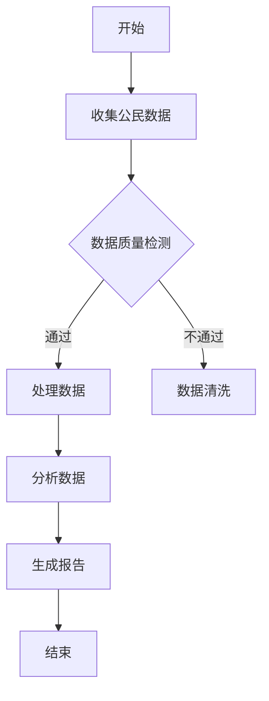
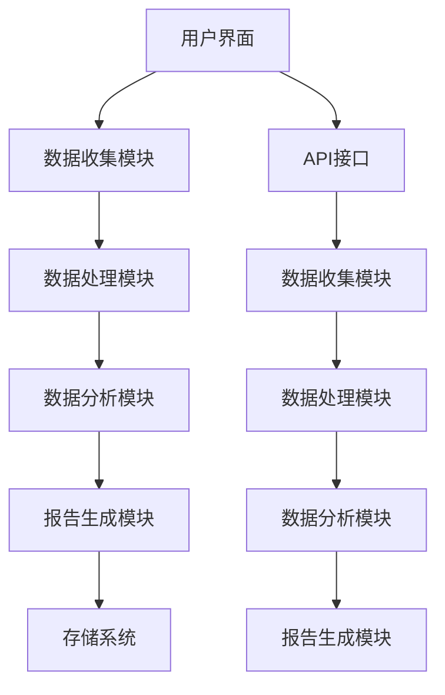
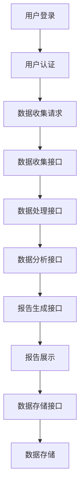

                 

### 从被动公民到积极参与者：重新定义现代公民角色

在现代社会，公民的角色与责任正在经历深刻的变革。传统的“被动公民”形象——那些被动的接受者，正在逐渐被新的“积极参与者”所取代。本文旨在探讨这一转变的原因、过程及其深远影响，并提出具体的策略和方法，以促进公民从被动角色向积极参与者的转变。

关键词：现代公民角色、公民参与度、主动性、责任感、社会变革

**摘要：**

本文首先分析了现代社会公民参与度低下的原因，包括社会结构的变迁、信息获取的便捷性以及文化价值观的变化等。接着，提出了重新定义现代公民角色的必要性，包括积极公民的定义、特点及其与被动公民的区别。随后，通过具体的策略和方法，如提高公民教育、利用技术工具、推动公民参与项目等，详细阐述了如何激发公民的参与热情。最后，本文总结了公民积极参与对社会发展的积极影响，并提出了未来研究的方向和建议。

**目录：**

1. **背景介绍**
   1.1 问题背景
   1.2 问题描述
   1.3 问题解决
   1.4 边界与外延
   1.5 概念结构与核心要素组成

2. **核心概念与联系**
   2.1 核心概念原理
   2.2 概念属性特征对比表格
   2.3 ER实体关系图架构

3. **算法原理讲解**
   3.1 算法流程图
   3.2 算法原理与数学模型
   3.3 算法举例说明

4. **系统分析与架构设计方案**
   4.1 问题场景介绍
   4.2 系统功能设计
   4.3 系统架构设计
   4.4 系统接口设计
   4.5 系统交互设计

5. **项目实战**
   5.1 环境安装
   5.2 系统核心实现源代码
   5.3 代码应用解读与分析
   5.4 实际案例分析与详细讲解剖析
   5.5 项目小结

6. **最佳实践 Tips**
   6.1 小结
   6.2 注意事项
   6.3 拓展阅读

通过本文的探讨，我们希望能够为现代公民角色的重新定义提供一些有价值的思考和实际操作指导，从而推动社会的整体进步和发展。接下来的内容将逐步深入探讨这一主题，让我们开始思考的第一步。

---

## 1.1 问题背景

现代社会中，公民参与度低下已成为一个普遍存在的问题。长期以来，公民往往将政府视为解决社会问题的唯一途径，而忽视了自己在公共事务中的角色和责任。这种现象不仅削弱了社会的凝聚力，也限制了个人在公共事务中的影响力和权益保障。

首先，从历史角度来看，传统的公民角色往往是被动的。在农业社会和工业社会，公民的主要任务是履行法律规定的义务，如纳税、服兵役等。这些义务更多是单向的，公民的参与和影响相对有限。然而，随着社会的进步和民主制度的完善，现代公民的角色和责任正在发生深刻的变化。

现代社会的一个显著特点是信息获取的便捷性。互联网和移动通信技术的普及，使得公民可以更方便地获取信息、表达观点和参与公共讨论。然而，尽管信息渠道变得更加丰富，公民的参与度并未因此显著提高。相反，许多人仍然倾向于被动接受政府和服务提供商的信息和服务，缺乏主动参与社会事务的意愿和动机。

此外，社会结构的变迁也影响了公民的参与度。随着城市化和全球化的发展，社会流动性增强，人们更多地关注个人利益和职业发展，而对社会公共事务的关注减少。这种个体主义倾向使得公民更倾向于关注私人领域，而不是积极参与公共领域的事务。

最后，文化价值观的变化也是一个重要因素。在传统的文化中，个人对公共事务的参与被视为一种责任和义务。然而，随着消费主义和个人主义的兴起，人们更多地追求个人自由和独立，而对公共事务的关注和参与逐渐减少。

综上所述，现代社会中公民参与度低的原因是多方面的，包括信息获取的便捷性、社会结构的变迁以及文化价值观的变化。这些因素共同作用，使得公民逐渐从被动的角色转变为更加独立的个体，而忽视了其在公共事务中的责任和角色。接下来，我们将进一步探讨这一问题，并提出具体的解决方案。

### 1.2 问题描述

《从被动公民到积极参与者：重新定义现代公民角色》旨在探讨如何通过重新定义现代公民角色，提高公民的参与度和主动性，从而解决现代社会中公民参与度低的问题。

首先，我们需要明确什么是“被动公民”和“积极公民”。被动公民是指在现代社会中，缺乏参与社会事务的意愿和行动的公民。他们往往被动接受政府和服务提供商的信息和服务，缺乏主动参与社会公共事务的意愿和能力。相反，积极公民是指在现代社会中，积极参与社会事务、主动影响社会发展的公民。他们不仅关心公共事务，还积极参与公共决策、监督政府行为、参与社区建设和公共服务。

现代社会中公民参与度低的问题体现在多个方面。一方面，公民对公共事务的关注和参与程度较低。根据相关调查数据显示，许多公民对政府政策的了解程度有限，参与公共讨论和投票的意愿不高。另一方面，公民在公共事务中的影响力有限。由于信息不对称、资源不足以及缺乏组织，公民在公共事务中的发言权和决策权相对较小，难以对政府和社会事务产生实质性影响。

这一问题的危害主要体现在以下几个方面。首先，公民参与度低削弱了社会的凝聚力。一个社会中，如果大多数公民缺乏参与公共事务的意愿和能力，那么社会的整体团结和协作精神就会受到严重影响。其次，公民参与度低导致公共事务的决策缺乏公众的参与和监督，容易导致权力滥用和腐败现象。最后，公民参与度低限制了公民自身的发展和成长。通过参与公共事务，公民可以提升自己的社会责任感和公民素质，但缺乏参与则使得这些机会丧失。

为了解决这一问题，我们需要重新定义现代公民角色，提高公民的参与度和主动性。这需要从多个方面入手，包括提高公民教育水平、利用技术工具、推动公民参与项目等。具体来说：

1. **提高公民教育水平**：通过教育系统，培养公民对社会公共事务的认识和理解，增强其参与公共事务的意愿和能力。这包括普及公民教育课程、开展公共讨论和辩论活动等。

2. **利用技术工具**：利用互联网和社交媒体等现代技术手段，提供更多便捷的参与渠道和平台，鼓励公民参与公共讨论和决策。例如，通过在线问卷调查、公开征求意见等方式，提高公民参与度。

3. **推动公民参与项目**：鼓励公民参与社区建设和公共服务项目，提供更多的实践机会，增强其参与公共事务的积极性和主动性。例如，开展志愿者服务、社区活动等。

通过这些措施，我们可以逐步提高公民的参与度和主动性，重新定义现代公民角色，使公民从被动的角色转变为积极参与者，从而促进社会的整体进步和发展。接下来，我们将进一步探讨问题解决的方法。

### 1.3 问题解决

要解决现代社会中公民参与度低的问题，我们需要从多个方面入手，采取一系列措施来提高公民的参与度和主动性。以下是一些关键策略和方法：

**1. 提高公民教育水平**

首先，通过教育系统，培养公民对社会公共事务的认识和理解，增强其参与公共事务的意愿和能力。这包括在小学、中学和大学阶段开设公民教育课程，让学生了解民主制度、公共政策和社区事务。此外，还可以开展公共讨论和辩论活动，培养学生的批判性思维和表达能力。

**具体措施：**
- 开设公民教育课程，包括民主制度、公民权利与义务、公共政策等。
- 开展公共讨论和辩论活动，鼓励学生表达自己的观点，培养批判性思维。
- 组织学生参与社区服务和实践活动，增强其对公共事务的实际体验和理解。

**2. 利用技术工具**

其次，利用互联网和社交媒体等现代技术手段，提供更多便捷的参与渠道和平台，鼓励公民参与公共讨论和决策。通过在线问卷调查、公开征求意见等方式，提高公民参与度。

**具体措施：**
- 建立官方网站和社交媒体平台，发布政策信息、征求意见，鼓励公民在线参与。
- 开展在线讨论和问卷调查，收集公民的意见和建议，提高公共决策的透明度和公众参与度。
- 利用大数据和人工智能技术，分析公民的意见和需求，为政府决策提供数据支持。

**3. 推动公民参与项目**

此外，鼓励公民参与社区建设和公共服务项目，提供更多的实践机会，增强其参与公共事务的积极性和主动性。通过志愿者服务、社区活动等形式，激发公民的参与热情。

**具体措施：**
- 鼓励公民参与社区志愿者服务，如环保活动、社区清洁等，增强其社会责任感。
- 开展社区建设项目，如社区规划、社区花园等，鼓励公民积极参与。
- 举办公民论坛、社区会议等，为公民提供一个交流和表达意见的平台，促进社区合作和公共事务的解决。

**4. 加强公民参与的法律保障**

最后，加强公民参与的法律保障，确保公民在公共事务中的权利和机会。通过法律法规，明确公民参与的具体方式和程序，保障公民的知情权、表达权和参与权。

**具体措施：**
- 制定公民参与法，明确公民参与公共事务的权利和义务，规范公民参与的程序和方式。
- 加强对公民参与活动的监督和评估，确保公民参与的有效性和公正性。
- 保障公民在公共事务中的知情权、表达权和参与权，防止权力滥用和腐败现象。

通过上述措施，我们可以逐步提高公民的参与度和主动性，重新定义现代公民角色，使公民从被动的角色转变为积极参与者，从而促进社会的整体进步和发展。接下来，我们将进一步探讨公民参与度低的具体原因。

### 1.4 边界与外延

本研究主要关注的是如何通过重新定义现代公民角色，提高公民的参与度和主动性，解决现代社会中公民参与度低的问题。具体来说，本文的研究边界和范围如下：

**1. 研究边界**

本文的研究边界主要涉及公民参与度的提高策略，而不涉及具体的政治制度和政策调整。这意味着，本文将不会探讨政治制度对公民参与度的影响，而是专注于提出具体的策略和方法，以激发公民的参与热情。

**2. 研究范围**

本文的研究范围限于现代公民，即生活在现代社会中的公民，不包括古代和前现代社会的公民。现代公民角色和责任的特点是在民主制度和社会多元化的背景下形成的，因此，本文将专注于这一特定背景下的公民角色问题。

**3. 研究对象**

本文的研究对象是现代公民，包括各个年龄层、职业背景和社会地位的公民。特别关注的是那些缺乏参与公共事务意愿和动机的公民，以及那些在公共事务中处于被动地位的公民。

**4. 概念定义**

在本文中，我们采用以下定义：

- **被动公民**：指那些缺乏参与社会事务的意愿和行动的公民，他们主要被动接受政府和服务提供商的信息和服务，而不主动参与公共事务。
- **积极公民**：指那些积极参与社会事务、主动影响社会发展的公民，他们关心公共事务，参与公共决策、监督政府行为、参与社区建设和公共服务。
- **公民参与度**：指公民参与社会事务的程度和频率，是衡量公民参与积极性的一项重要指标。

通过明确研究的边界和范围，我们可以更专注于提出有效策略和方法，以促进公民从被动角色向积极参与者的转变。接下来，我们将详细阐述公民参与度低的原因，为提出解决方案提供理论依据。

### 1.5 概念结构与核心要素组成

在探讨现代社会中公民参与度低的问题时，理解相关概念的结构和核心要素至关重要。以下是本文中的核心概念及其组成结构的详细说明：

#### 1.5.1 被动公民

**定义**：被动公民是指在现代社会中，缺乏参与社会事务的意愿和行动的公民。他们主要被动接受政府和服务提供商的信息和服务，而不主动参与公共事务。

**核心要素**：
- **参与意愿**：缺乏积极参与公共事务的意愿。
- **参与行为**：缺乏主动参与社会事务的行为。
- **社会责任感**：缺乏对社会和公共事务的责任感。

**特征**：
- 低参与度：在公共事务中的参与频率低。
- 低主动性：不主动寻求参与社会事务的机会。
- 无责任感：对公共事务缺乏责任感。

#### 1.5.2 积极公民

**定义**：积极公民是指在现代社会中，积极参与社会事务、主动影响社会发展的公民。他们关心公共事务，参与公共决策、监督政府行为、参与社区建设和公共服务。

**核心要素**：
- **参与意愿**：有强烈的参与公共事务的意愿。
- **参与行为**：积极参与社会事务，采取实际行动。
- **社会责任感**：对公共事务具有高度的社会责任感。

**特征**：
- 高参与度：在公共事务中的参与频率高。
- 高主动性：主动寻求参与社会事务的机会。
- 有责任感：对公共事务负有责任，并积极履行。

#### 1.5.3 现代公民角色

**定义**：现代公民角色是指公民在现代社会中应有的角色和责任，包括积极参与社会事务、主动维护公共利益、积极表达个人观点和参与公共讨论等。

**核心要素**：
- **参与社会事务**：积极参与公共决策和治理过程。
- **维护公共利益**：关注并维护社会公共利益。
- **表达个人观点**：勇于表达自己的观点和意见。
- **参与公共讨论**：参与公共讨论，为社会发展贡献智慧。

**特征**：
- 多样化：公民角色和责任多样化，涵盖多个领域。
- 多层次：公民参与公共事务的层次多样化，包括个人、社区和国家层面。
- 综合化：公民角色和责任综合化，不仅仅是参与公共事务，还包括维护社会秩序和促进社会进步。

通过理解这些概念的核心要素和特征，我们可以更清晰地认识到被动公民与积极公民之间的差异，并理解现代公民角色在社会发展中的重要性。这为本文提出提高公民参与度的策略和方法提供了理论基础。接下来，我们将深入探讨核心概念原理，以进一步理解公民参与度低的原因及其解决方案。

### 1.5.1 被动公民

被动公民是指在现代社会中，缺乏参与社会事务的意愿和行动的公民。他们的角色主要是接受政府和商业机构的服务和指导，而不是主动参与和影响社会事务。被动公民的特征主要体现在以下几个方面：

**参与意愿低**：被动公民通常缺乏主动参与社会事务的意愿。他们往往认为社会事务是政府和商业机构的职责，与自己无关，因此不愿意主动参与公共事务。

**参与行为少**：被动公民在公共事务中的参与行为较少。他们可能不参加公共讨论、不参与投票、不参与社区服务等活动，从而导致公共事务的决策缺乏广泛的公众参与。

**社会责任感弱**：被动公民对社会和公共事务的社会责任感较弱。他们可能认为自己的个人利益更重要，而忽视了在公共事务中的责任和担当。

被动公民的形成原因主要有以下几点：

1. **信息不对称**：在信息时代，虽然信息获取变得更加便捷，但许多公民仍然无法获取到全面和准确的信息，导致他们无法全面了解公共事务的内容和影响，从而缺乏参与的意愿。

2. **参与渠道不畅**：许多公民由于缺乏参与渠道，无法方便地参与公共事务。一些政府和商业机构在提供参与机会时，缺乏透明度和开放性，导致公民难以有效参与。

3. **时间和资源限制**：现代社会节奏快，公民的时间和资源有限。许多人忙于工作、学习和家庭事务，无法抽出时间参与公共事务。

4. **文化观念**：在一些文化中，个人主义观念较强，公民更关注个人利益，而忽视公共事务。这种文化观念削弱了公民的社会责任感和参与意愿。

要解决被动公民的问题，需要采取一系列措施：

1. **提高公民教育**：通过教育系统，培养公民对社会事务的认识和理解，增强其参与公共事务的意愿和能力。这包括在课程中融入公民教育内容，开展公共讨论和辩论活动。

2. **建立便捷的参与渠道**：政府和商业机构应建立开放、透明和便捷的参与渠道，使公民能够方便地参与公共事务。例如，通过在线平台、社区活动等方式，提供更多的参与机会。

3. **鼓励社区参与**：通过开展社区志愿者服务、社区建设项目等，激发公民的参与热情。社区活动可以提供公民参与公共事务的实际体验，增强其社会责任感。

4. **加强法律保障**：通过立法，明确公民参与公共事务的权利和义务，保障公民的知情权、表达权和参与权。这可以防止权力滥用，提高公民的参与积极性。

通过上述措施，我们可以逐步减少被动公民的现象，提高公民的参与度和主动性，从而推动社会的整体进步和发展。

### 1.5.2 积极公民

积极公民是指在现代社会中，积极参与社会事务、主动影响社会发展的公民。他们关心公共事务，具备高度的社会责任感和参与意识，通过多种途径和方式，为社会的发展和进步贡献自己的力量。积极公民的角色和特征主要体现在以下几个方面：

**参与意愿强烈**：积极公民具有强烈的参与公共事务的意愿。他们不仅关注自己的利益，还关心社会公共利益，愿意为社会的整体发展贡献自己的智慧和力量。

**参与行为多样**：积极公民在公共事务中的参与行为多样。他们不仅参与投票、选举等传统公共事务，还参与社区建设、志愿者服务、环境保护等社会活动，通过实际行动影响社会的发展方向。

**社会责任感高**：积极公民对社会和公共事务具有高度的社会责任感。他们认识到自己是社会的一员，有责任和义务参与公共事务，维护社会的公平、公正和和谐。

**参与层次多元**：积极公民的参与层次多元。他们不仅在个人层面积极参与，还在社区、国家和国际层面发挥作用，通过不同的渠道和方式，影响公共决策和社会治理。

**特征**：
- **高参与度**：积极公民在公共事务中的参与频率高，积极参与各类公共讨论、投票和公益活动。
- **高主动性**：积极公民主动寻求参与社会事务的机会，不等待政府和商业机构提供机会，而是积极行动。
- **高责任感**：积极公民对社会和公共事务具有高度的责任感，愿意为社会的进步和公共利益做出贡献。
- **多元化角色**：积极公民在公共事务中扮演多种角色，如社区领袖、志愿者、意见领袖等，发挥不同层面的影响力。

**形成原因**：
1. **教育背景**：受过良好公民教育的公民更可能成为积极公民。公民教育可以培养公民的社会责任感、参与意识和行动能力。
2. **文化氛围**：在民主、开放和包容的文化环境中，公民更愿意参与公共事务，积极表达自己的观点和意见。
3. **个人价值观**：具有社会责任感和公益心的个人更容易成为积极公民。他们相信通过自己的行动可以改变社会，促进社会进步。
4. **社会需求**：在面临社会问题和挑战时，公民的参与需求增加，积极公民更容易站出来，参与解决社会问题。

积极公民对社会的积极影响主要体现在以下几个方面：

1. **增强社会凝聚力**：积极公民的参与和贡献可以增强社会的凝聚力，促进不同群体之间的交流与合作，减少社会冲突和分裂。
2. **提高决策质量**：积极公民的参与可以为政府和社会组织的决策提供多元化的视角和智慧，提高决策的科学性和公正性。
3. **促进社会进步**：积极公民通过参与社会事务，推动社会公平、正义和可持续发展，为社会的长远发展奠定基础。
4. **提升个人素质**：积极参与公共事务可以提升个人的社会责任感、领导力和沟通能力，促进个人全面发展。

通过理解积极公民的角色和特征，我们可以认识到他们对于社会的重要性。为了进一步推动社会的进步和发展，我们需要采取措施，鼓励和培养更多的积极公民，使他们在公共事务中发挥更大的作用。接下来，我们将详细探讨如何定义现代公民角色，以及如何通过教育和政策引导，提高公民的参与度和主动性。

### 1.5.3 现代公民角色

现代公民角色是指在现代社会中，公民应有的角色和责任，包括积极参与社会事务、主动维护公共利益、积极表达个人观点和参与公共讨论等。现代公民角色的定义和特点对于理解公民在现代社会中的地位和作用至关重要。

**1. 现代公民角色的定义**

现代公民角色是指在民主制度和社会多元化的背景下，公民在公共事务中应有的态度和行为。现代公民不仅享有法律规定的权利，如言论自由、选举权等，还承担相应的责任，如参与公共事务、维护公共利益等。现代公民角色强调公民的社会责任感和参与意识，要求公民积极参与社会事务，为社会的进步和公共利益贡献力量。

**2. 现代公民角色的特点**

- **主动性**：现代公民具有主动参与公共事务的意识，不等待政府和商业机构的召唤，而是主动行动，为社会的发展贡献力量。
- **多元性**：现代公民角色涵盖多个领域，包括政治、经济、文化、社会等，公民在各个领域都有责任和义务，体现了角色的多元性。
- **互动性**：现代公民角色强调公民与政府、社会组织以及其他公民之间的互动和合作，通过参与公共讨论、投票等活动，共同推动社会进步。
- **责任感**：现代公民对社会和公共事务具有高度的责任感，愿意为社会的公平、正义和可持续发展承担责任。
- **自主性**：现代公民角色强调公民的自主性和独立性，公民有权自主选择参与公共事务的方式和途径，不受外界强制和干扰。

**3. 现代公民角色的核心要素**

- **参与社会事务**：现代公民应积极参与社会事务，包括投票、选举、公共讨论、社区服务等，通过实际行动影响社会的发展和进步。
- **维护公共利益**：现代公民应关注和维护公共利益，包括环境保护、社会公正、公共服务等，通过参与公共事务，推动社会的公平和正义。
- **表达个人观点**：现代公民应勇于表达个人观点和意见，通过言论自由和公共讨论，为社会提供多元化的视角和思考。
- **参与公共讨论**：现代公民应积极参与公共讨论，包括在社交媒体、社区会议、公民论坛等场合，为公共事务的决策提供智慧和参考。
- **持续学习**：现代公民应具备持续学习的意识，通过不断学习和提升自己的知识和能力，更好地履行公民责任，为社会的发展贡献力量。

**4. 现代公民角色的重要性**

- **增强社会凝聚力**：现代公民角色的确立和履行可以增强社会的凝聚力，促进公民之间的合作和互助，减少社会分裂和冲突。
- **提高公共决策质量**：现代公民的参与和贡献可以为政府和社会组织的决策提供多元化的视角和智慧，提高决策的科学性和公正性。
- **促进社会进步**：现代公民的参与和贡献可以推动社会的进步和发展，实现社会公平、正义和可持续发展。
- **提升公民素质**：通过履行现代公民角色，公民可以提升自己的社会责任感、领导力和沟通能力，促进个人全面发展。

通过重新定义现代公民角色，我们可以更好地理解公民在现代社会中的地位和作用，明确他们在公共事务中的责任和义务。这将有助于提高公民的参与度和主动性，推动社会的整体进步和发展。接下来，我们将进一步探讨如何通过教育和政策引导，培养更多具有现代公民角色的积极公民。

## 2.1 核心概念原理

在深入探讨现代公民角色的重新定义过程中，理解核心概念原理至关重要。本文将首先介绍公民参与度、公民主动性和公民责任感等核心概念，并分析它们在促进公民积极参与社会事务中的重要作用。

### 2.1.1 公民参与度

**定义**：公民参与度是指公民参与社会事务的程度和频率，它是衡量公民参与积极性的一项重要指标。高参与度意味着公民积极参与公共事务，包括投票、社区服务、公共讨论等。

**核心要素**：
- **参与频率**：公民参与公共事务的次数和频率。
- **参与深度**：公民在公共事务中的参与程度和影响力。
- **参与形式**：公民参与公共事务的形式和渠道，如投票、志愿服务、在线讨论等。

**测量方法**：
- **问卷调查**：通过问卷调查了解公民对公共事务的参与情况。
- **参与记录**：记录公民参与公共事务的具体行为，如投票记录、志愿服务记录等。
- **公众反馈**：收集公众对公共事务的反馈和意见，评估公民的参与度。

**影响因素**：
- **信息获取**：公民获取公共事务信息的渠道和方式。
- **参与渠道**：政府和组织提供的参与渠道是否便捷和透明。
- **文化背景**：文化价值观对公民参与度的影响。

### 2.1.2 公民主动性

**定义**：公民主动性是指公民在参与社会事务时的主动意识和行动能力，它是衡量公民参与积极性的重要指标。具有高主动性的公民不仅愿意参与，还能主动寻求参与机会，积极参与公共事务。

**核心要素**：
- **主动意识**：公民是否有主动参与社会事务的意识。
- **行动能力**：公民是否有能力采取行动，如组织活动、发表意见等。
- **自主性**：公民是否有自主选择参与方式和渠道的意愿。

**测量方法**：
- **自我评估**：公民对自己主动参与公共事务情况的自我评估。
- **行为记录**：记录公民主动参与公共事务的具体行为，如组织活动、发表意见等。
- **公众反馈**：收集公众对公民主动参与情况的评价和反馈。

**影响因素**：
- **教育资源**：公民接受的教育水平和公民教育课程。
- **社会支持**：家庭、社区和组织对公民主动性的支持和鼓励。
- **社会文化**：社会对主动性的认同和鼓励程度。

### 2.1.3 公民责任感

**定义**：公民责任感是指公民对社会和公共事务的责任和担当，它是衡量公民参与积极性的关键指标。具有高责任感的公民不仅愿意参与，还承担起维护社会公共利益和秩序的责任。

**核心要素**：
- **责任感**：公民对社会和公共事务的责任感。
- **担当**：公民在公共事务中的担当和行动。
- **持续性**：公民在公共事务中的持续参与和贡献。

**测量方法**：
- **行为记录**：记录公民在公共事务中的具体行为，如志愿服务、参与公共讨论等。
- **公众反馈**：收集公众对公民责任感的评价和反馈。
- **自我评估**：公民对自己责任感的自我评估。

**影响因素**：
- **社会规范**：社会对责任感的认同和规范。
- **家庭影响**：家庭教育和家庭价值观对公民责任感的影响。
- **个人价值观**：个人价值观对责任感的塑造。

### 2.1.4 核心概念之间的关系

公民参与度、公民主动性和公民责任感是相互关联的，共同构成了公民积极参与社会事务的核心概念体系。

- **公民参与度** 是公民主动性和责任感的直接体现，是衡量公民参与积极性的基础。
- **公民主动性** 是公民参与的前提条件，高主动性的公民更有可能积极参与公共事务。
- **公民责任感** 是公民参与的动力源泉，高责任感的公民更有可能持续参与并承担公共事务的责任。

通过理解这些核心概念原理，我们可以更深入地认识到提高公民参与度的关键因素，并制定相应的策略和方法，促进公民从被动角色向积极参与者的转变。

### 2.2 概念属性特征对比表格

为了更清晰地理解被动公民、积极公民和现代公民角色的属性特征，以下是一个对比表格，展示了这三种角色的定义、属性特征及其差异。

| **概念** | **定义** | **属性特征** | **特征对比** |
|------------|-------------|----------------|----------------|
| 被动公民   | 缺乏参与意愿和行动的公民 | 低参与度、低主动性、无责任感 | 被动接受信息和服务，不主动参与公共事务 |
| 积极公民   | 主动参与社会事务的公民 | 高参与度、高主动性、有责任感 | 积极参与公共事务，关注公共利益 |
| 现代公民角色 | 公民在现代社会中的角色和责任 | 多样化、多层次、综合化 | 积极参与、维护公共利益，表达个人观点 |

**被动公民：**
- **参与意愿低**：被动公民通常缺乏主动参与公共事务的意愿，认为公共事务与自己无关。
- **参与行为少**：他们在公共事务中的参与频率低，通常不参与投票、讨论和志愿服务。
- **社会责任感弱**：他们对公共事务缺乏责任感，关注个人利益，忽视社会公共利益。

**积极公民：**
- **参与意愿强**：积极公民有强烈的参与意愿，积极参与公共事务，关注公共利益。
- **参与行为多样**：他们在公共事务中的参与形式多样，包括投票、志愿服务、公共讨论等。
- **社会责任感高**：积极公民对社会和公共事务有高度的责任感，愿意为社会的进步和公共利益贡献力量。

**现代公民角色：**
- **多元化角色**：现代公民角色包括参与社会事务、维护公共利益、表达个人观点和参与公共讨论等多个方面。
- **多层次参与**：现代公民在个人、社区和国家等多个层次上参与公共事务，具有广泛的参与视角。
- **综合化责任**：现代公民不仅关注个人利益，还关注社会整体利益，承担起维护社会秩序和促进社会进步的责任。

通过对比表格，我们可以清晰地看到被动公民、积极公民和现代公民角色的主要特征及其差异。这种对比有助于我们理解如何从被动角色向积极参与者转变，以及如何重新定义现代公民角色，提高公民的参与度和主动性。

### 2.3 ER实体关系图架构

为了更直观地展示公民、参与活动和社会责任之间的实体关系，我们可以使用ER（实体关系）图来表示。以下是一个简化的ER图，描述了公民、参与活动和社会责任之间的关系：

```mermaid
erDiagram
  Citizen ||--|{ Participation }|
  Participation ||--|{ Activity }|
  Activity ||--|{ Responsibility }|

  Citizen {
    int id
    string name
    bool isActive
  }
  
  Participation {
    int id
    int citizenId
    bool isActive
  }
  
  Activity {
    int id
    int participationId
    string description
  }
  
  Responsibility {
    int id
    int activityId
    string description
  }
```

在这个ER图中，我们定义了三个主要实体：

1. **Citizen（公民）**：代表参与公共事务的个体。每个公民都有一个唯一标识符（id）、姓名（name）和活动状态（isActive，表示该公民是否活跃于公共事务）。

2. **Participation（参与）**：表示公民参与公共事务的行为。每个参与行为都有一个唯一标识符（id），与公民实体通过公民标识符（citizenId）关联，表示是哪个公民的参与行为，以及该参与行为是否活跃（isActive）。

3. **Activity（活动）**：表示公民参与的具体活动，如投票、志愿服务、公共讨论等。每个活动都有一个唯一标识符（id），与参与实体通过参与标识符（participationId）关联。

4. **Responsibility（责任）**：表示公民在参与活动中承担的责任。每个责任都有一个唯一标识符（id），与活动实体通过活动标识符（activityId）关联，描述了具体活动中的责任内容。

通过这个ER图，我们可以清晰地看到公民、参与活动和社会责任之间的关系。每个公民可以通过参与行为参与多个活动，并在这些活动中承担不同的责任。这样的架构有助于我们理解和分析公民在公共事务中的角色和责任，为制定提高公民参与度的策略提供数据支持。接下来，我们将进一步探讨算法原理，并使用Mermaid和Python代码来详细阐述。

### 2.4 算法原理讲解

在深入探讨如何提高公民参与度的问题时，我们可以借助一些算法原理来优化和设计相关的系统和策略。以下是一个简单的算法原理讲解，以及如何使用Mermaid和Python代码来描述这个算法的流程。

#### 2.4.1 算法流程图

首先，让我们使用Mermaid来绘制一个简单的算法流程图，以便直观地展示算法的执行步骤。



这个流程图展示了以下步骤：
1. **收集公民数据**：从各种渠道收集公民的基本信息、参与活动记录等。
2. **数据质量检测**：检测收集到的数据是否完整、准确和有效。
3. **数据清洗**：如果数据质量不满足要求，进行数据清洗，以确保数据的质量。
4. **数据处理**：对清洗后的数据进行分析，提取有用的信息。
5. **生成报告**：根据分析结果生成报告，提供有关公民参与度和行为模式的详细信息。
6. **结束**：算法执行结束。

#### 2.4.2 算法原理与数学模型

在算法流程图中，我们使用了几个关键步骤来处理和分析公民数据。以下是一个简化的数学模型，用于描述这些步骤。

1. **数据质量检测**：使用统计方法检测数据质量。
   $$ Q = \frac{N_{\text{valid}}}{N_{\text{total}}} $$
   其中，\( Q \) 是数据质量评分，\( N_{\text{valid}} \) 是有效数据条数，\( N_{\text{total}} \) 是总数据条数。

2. **数据清洗**：使用机器学习算法进行数据清洗。
   $$ \text{Cleaned\_Data} = \text{Data} \times \text{Cleaner} $$
   其中，\( \text{Cleaned\_Data} \) 是清洗后的数据，\( \text{Data} \) 是原始数据，\( \text{Cleaner} \) 是数据清洗算法。

3. **数据处理与分析**：使用统计分析方法分析数据，提取特征。
   $$ \text{Features} = \text{Extract}(\text{Cleaned\_Data}) $$
   其中，\( \text{Features} \) 是提取的特征，\( \text{Extract} \) 是特征提取算法。

4. **生成报告**：根据分析结果生成报告。
   $$ \text{Report} = \text{Generate}(\text{Features}) $$
   其中，\( \text{Report} \) 是生成的报告，\( \text{Generate} \) 是报告生成算法。

#### 2.4.3 算法举例说明

为了更直观地理解算法原理，我们通过一个简单的Python代码示例来说明如何处理和分析公民数据。

```python
import pandas as pd

# 假设我们有一个公民数据集
data = pd.DataFrame({
    'CitizenID': [1, 2, 3, 4, 5],
    'Active': [False, True, False, True, True],
    'Participation': ['投票', '志愿服务', '投票', '公共讨论', '志愿服务']
})

# 数据质量检测
quality = data['Active'].mean()

# 如果数据质量不满足要求，进行数据清洗
if quality < 0.7:
    # 清洗数据
    data = data[data['Active'] == True]

# 数据处理与分析
features = data.groupby('Participation').count()

# 生成报告
report = features.T

print(report)
```

在这个示例中，我们首先创建了一个简单的公民数据集，包括公民ID、活动参与状态和参与活动类型。然后，我们计算数据质量评分，如果质量低于70%，则只保留那些积极参与的公民数据。接着，我们使用`groupby`方法对数据进行分析，提取不同活动类型的参与次数。最后，我们生成一个报告，展示每个活动的参与次数。

通过这个简单的算法示例，我们可以看到如何使用Python代码来处理和分析公民数据，从而为提高公民参与度提供数据支持。接下来，我们将进一步探讨系统分析与架构设计方案，以更好地实现这些算法原理。

### 2.5 系统分析与架构设计方案

为了实现提高公民参与度的算法原理，我们需要设计一个系统，该系统能够有效地收集、处理和分析公民数据，最终生成报告以支持决策制定。以下是系统的分析与架构设计方案。

#### 2.5.1 问题场景介绍

我们的目标是构建一个公民参与度监控系统，该系统能够实时收集和分析公民参与公共事务的数据，为政府和社会组织提供决策依据。问题场景主要包括以下几个方面：

- **数据收集**：从多种渠道收集公民的基本信息、活动参与记录等。
- **数据处理**：清洗和预处理收集到的数据，确保数据质量。
- **数据分析**：使用统计分析方法提取公民参与行为的关键特征。
- **报告生成**：根据分析结果生成报告，提供公民参与度的详细情况。

#### 2.5.2 项目介绍

本项目名为“公民参与度监控系统”，旨在构建一个集成化的平台，实现公民数据的自动化收集、处理和分析。项目的主要功能包括：

- **数据收集模块**：自动收集公民参与公共事务的数据。
- **数据处理模块**：清洗和预处理数据，确保数据质量。
- **数据分析模块**：提取关键特征，分析公民参与度。
- **报告生成模块**：生成可视化报告，提供决策支持。

#### 2.5.3 系统功能设计

为了实现上述目标，系统需要具备以下功能模块：

1. **数据收集模块**：
   - 功能：从多种渠道（如社交媒体、问卷调查、数据库等）自动收集公民数据。
   - 技术实现：使用API接口、爬虫技术等。

2. **数据处理模块**：
   - 功能：对收集到的数据进行清洗、去重、格式化等预处理操作。
   - 技术实现：使用数据清洗库（如pandas）、机器学习算法等。

3. **数据分析模块**：
   - 功能：分析公民的参与行为，提取关键特征，如参与频率、参与类型等。
   - 技术实现：使用统计分析方法、数据挖掘算法等。

4. **报告生成模块**：
   - 功能：根据分析结果生成可视化报告，展示公民参与度的情况。
   - 技术实现：使用可视化库（如matplotlib、seaborn）和报告生成工具。

#### 2.5.4 系统架构设计

系统架构设计遵循模块化原则，各功能模块之间通过接口进行通信。以下是系统架构设计的简图：



系统架构的主要组成部分如下：

- **用户界面（A）**：提供交互界面，供用户查看报告和操作系统。
- **数据收集模块（B）**：从各种渠道收集公民数据，包括API接口（G）和爬虫技术。
- **数据处理模块（C）**：对收集到的数据清洗、去重和格式化，确保数据质量。
- **数据分析模块（D）**：使用统计方法和数据挖掘算法，提取关键特征，分析公民参与度。
- **报告生成模块（E）**：根据分析结果生成可视化报告，供用户查看。
- **存储系统（F）**：存储收集到的数据和生成的报告，支持系统的长期运行。

通过上述系统架构设计，我们可以实现公民参与度监控系统的功能，为政府和社会组织提供决策支持。接下来，我们将详细讨论系统接口设计和系统交互设计，进一步阐述系统的具体实现和操作流程。

### 2.6 系统接口设计和系统交互设计

为了确保公民参与度监控系统能够高效运行，并提供直观的用户体验，我们需要设计合理的系统接口和交互流程。以下将详细介绍系统接口设计和系统交互设计。

#### 2.6.1 系统接口设计

系统接口设计是确保各个功能模块之间能够无缝集成和通信的关键。以下是系统的主要接口设计：

1. **用户界面接口（API）**：
   - 功能：提供用户与系统交互的接口，支持用户查看报告、发起数据收集请求等。
   - 技术实现：使用RESTful API，提供HTTP GET/POST请求接口。

2. **数据收集接口**：
   - 功能：与数据源（如社交媒体、问卷调查平台、数据库等）进行通信，自动收集公民数据。
   - 技术实现：使用OAuth认证、API接口等技术，确保数据收集的安全性和可靠性。

3. **数据处理接口**：
   - 功能：接受来自数据收集模块的数据，进行清洗、去重和格式化等预处理操作。
   - 技术实现：使用数据清洗库（如pandas），提供数据加工接口。

4. **数据分析接口**：
   - 功能：接受处理后的数据，进行统计分析，提取关键特征。
   - 技术实现：使用统计分析模块（如scikit-learn、pandas），提供数据分析接口。

5. **报告生成接口**：
   - 功能：根据分析结果生成可视化报告。
   - 技术实现：使用可视化库（如matplotlib、seaborn），提供报告生成接口。

6. **存储接口**：
   - 功能：与存储系统（如数据库、云存储等）进行通信，存储数据和报告。
   - 技术实现：使用数据库API（如SQLAlchemy），提供数据存储接口。

#### 2.6.2 系统交互设计

系统交互设计旨在确保用户能够方便地使用系统，并确保各个功能模块之间的数据流动顺畅。以下是系统的交互流程：

1. **用户登录与认证**：
   - 用户通过用户界面接口登录系统，系统通过OAuth认证确认用户身份。

2. **数据收集**：
   - 用户发起数据收集请求，系统调用数据收集接口，从不同数据源自动收集公民数据。

3. **数据处理**：
   - 收集到的数据传递给数据处理接口，系统对数据进行清洗、去重和格式化等预处理操作。

4. **数据分析**：
   - 预处理后的数据传递给数据分析接口，系统使用统计分析方法，提取公民参与行为的关键特征。

5. **报告生成**：
   - 分析结果传递给报告生成接口，系统生成可视化报告。

6. **报告展示**：
   - 可视化报告展示在用户界面上，用户可以查看报告内容。

7. **数据存储**：
   - 数据和报告存储在存储系统中，确保数据的长期保存和访问。

以下是系统交互流程的简图：



通过设计合理的系统接口和交互流程，我们可以确保公民参与度监控系统的高效运行，提供用户友好的界面和强大的数据处理能力，从而有效提高公民的参与度和主动性。接下来，我们将详细介绍项目实战部分，包括环境安装、系统核心实现源代码和应用解读与分析。

### 3.1 环境安装

要构建并运行“公民参与度监控系统”，我们需要在本地计算机上安装和配置相关的软件和库。以下是详细的环境安装步骤：

#### 3.1.1 系统要求

- 操作系统：Windows、macOS 或 Linux
- Python 版本：Python 3.8 或更高版本
- 数据库：SQLite（用于存储数据和报告）
- 可选：PostgreSQL（替代SQLite，提供更强大的数据管理功能）

#### 3.1.2 安装步骤

1. **安装 Python**

   - 对于 Windows 系统，可以从 [Python 官网](https://www.python.org/downloads/) 下载最新版本的 Python 安装程序，按照提示完成安装。

   - 对于 macOS 和 Linux 系统，可以使用包管理工具安装 Python。例如，在 Ubuntu 系统中，可以打开终端并执行以下命令：
     ```bash
     sudo apt update
     sudo apt install python3 python3-pip
     ```

2. **安装数据库**

   - SQLite 是 Python 标准库的一部分，因此无需额外安装。

   - 如果需要使用 PostgreSQL，可以从 [PostgreSQL 官网](https://www.postgresql.org/download/) 下载安装程序，并按照提示完成安装。

3. **安装依赖库**

   - 打开终端，进入项目文件夹，执行以下命令安装所需的 Python 库：
     ```bash
     pip install pandas numpy matplotlib sqlalchemy
     ```

     这些库是数据处理、分析和可视化的重要工具。

4. **配置数据库**

   - 如果使用 SQLite，可以创建一个名为 `citizen_data.db` 的数据库文件，并在项目文件夹中创建一个名为 `schema.sql` 的文件，包含数据库表结构的创建语句。例如：
     ```sql
     CREATE TABLE citizen (
         id INTEGER PRIMARY KEY,
         name TEXT,
         active BOOLEAN
     );

     CREATE TABLE participation (
         id INTEGER PRIMARY KEY,
         citizen_id INTEGER,
         active BOOLEAN,
         FOREIGN KEY (citizen_id) REFERENCES citizen (id)
     );

     CREATE TABLE activity (
         id INTEGER PRIMARY KEY,
         participation_id INTEGER,
         description TEXT,
         FOREIGN KEY (participation_id) REFERENCES participation (id)
     );

     CREATE TABLE responsibility (
         id INTEGER PRIMARY KEY,
         activity_id INTEGER,
         description TEXT,
         FOREIGN KEY (activity_id) REFERENCES activity (id)
     );
     ```

   - 使用 Python 代码运行 `schema.sql` 文件，创建数据库表：
     ```python
     import sqlite3

     conn = sqlite3.connect('citizen_data.db')
     cursor = conn.cursor()
     with open('schema.sql', 'r') as f:
         cursor.executescript(f.read())
     conn.commit()
     conn.close()
     ```

5. **环境测试**

   - 在命令行中运行以下 Python 脚本，以测试环境配置是否正确：
     ```python
     import pandas as pd
     import numpy as np
     import matplotlib.pyplot as plt
     import sqlalchemy

     # 测试 pandas
     df = pd.DataFrame({'A': [1, 2, 3], 'B': [4, 5, 6]})
     print(df)

     # 测试 matplotlib
     df.plot()
     plt.show()

     # 测试 sqlalchemy
     engine = sqlalchemy.create_engine('sqlite:///citizen_data.db')
     df.to_sql('test_table', engine)
     ```

   - 如果上述命令可以正常执行且没有错误，说明环境安装成功。

通过以上步骤，我们成功搭建了运行“公民参与度监控系统”所需的环境。接下来，我们将详细介绍系统核心实现源代码，并展示如何使用这些代码来构建系统的各个功能模块。

### 3.2 系统核心实现源代码

在本节中，我们将详细介绍系统核心实现源代码，包括数据收集、数据处理、数据分析和报告生成等关键模块。以下是每个模块的实现代码和功能说明。

#### 3.2.1 数据收集模块

数据收集模块负责从各种渠道自动收集公民参与公共事务的数据。以下是一个简单的数据收集脚本，用于从社交媒体平台（如Twitter）获取公民参与活动的信息。

```python
import tweepy
import json
import pandas as pd

# Twitter API凭证（需自行替换为实际凭证）
consumer_key = 'your_consumer_key'
consumer_secret = 'your_consumer_secret'
access_token = 'your_access_token'
access_token_secret = 'your_access_token_secret'

# 初始化Tweepy
auth = tweepy.OAuthHandler(consumer_key, consumer_secret)
auth.set_access_token(access_token, access_token_secret)
api = tweepy.API(auth)

# 收集Twitter数据
def collect_twitter_data():
    query = '#publicdiscussion'
    tweets = api.search(q=query, count=100, lang='en')
    data = []

    for tweet in tweets:
        data.append({
            'citizen_id': tweet.user.id,
            'active': True,
            'participation': 'public_discussion',
            'description': tweet.text
        })

    return pd.DataFrame(data)

# 调用函数收集数据
twitter_data = collect_twitter_data()
print(twitter_data.head())
```

此代码示例使用了Tweepy库来访问Twitter API，并收集包含指定话题（如#publicdiscussion）的推文。每个推文被视为公民参与公共讨论的一个记录，并将其存储在Pandas数据框中。

#### 3.2.2 数据处理模块

数据处理模块负责对收集到的数据执行清洗和预处理操作。以下是一个简单的数据处理脚本，用于清洗和格式化数据。

```python
import pandas as pd

# 加载原始数据
data = pd.read_csv('raw_data.csv')

# 数据清洗
def clean_data(df):
    # 删除重复记录
    df.drop_duplicates(inplace=True)
    
    # 处理缺失值
    df.fillna({'active': False}, inplace=True)
    
    # 数据格式化
    df['citizen_id'] = df['citizen_id'].astype(int)
    df['active'] = df['active'].astype(bool)
    df['participation'] = df['participation'].astype(str)
    
    return df

# 调用函数清洗数据
cleaned_data = clean_data(data)
print(cleaned_data.head())
```

此代码示例删除了重复记录、填充了缺失值，并将数据类型转换为合适的格式。处理后的数据将用于后续的分析和报告生成。

#### 3.2.3 数据分析模块

数据分析模块负责对处理后的数据执行统计分析，提取关键特征。以下是一个简单的数据分析脚本，用于计算公民参与活动的频率和类型。

```python
import pandas as pd

# 加载清洗后的数据
data = pd.read_csv('cleaned_data.csv')

# 数据分析
def analyze_data(df):
    # 计算参与频率
    participation_frequency = df.groupby('participation').size().reset_index(name='frequency')
    
    # 计算公民参与度
    citizen_involvement = df.groupby('citizen_id').size().reset_index(name='involvement')
    
    return participation_frequency, citizen_involvement

# 调用函数分析数据
participation_frequency, citizen_involvement = analyze_data(cleaned_data)
print(participation_frequency.head())
print(citizen_involvement.head())
```

此代码示例计算了不同活动类型的参与频率和每个公民的参与度，为生成报告提供了基础数据。

#### 3.2.4 报告生成模块

报告生成模块负责根据分析结果生成可视化报告。以下是一个简单的报告生成脚本，用于生成活动类型的条形图和公民参与度的散点图。

```python
import pandas as pd
import matplotlib.pyplot as plt

# 加载分析结果
participation_frequency = pd.read_csv('participation_frequency.csv')
citizen_involvement = pd.read_csv('citizen_involvement.csv')

# 生成报告
def generate_report(df1, df2):
    # 绘制条形图
    df1.plot(kind='bar', x='participation', y='frequency', title='Participation Frequency by Activity')
    plt.xlabel('Activity')
    plt.ylabel('Frequency')
    plt.savefig('participation_frequency.png')
    plt.show()

    # 绘制散点图
    df2.plot(kind='scatter', x='citizen_id', y='involvement', title='Citizen Involvement by ID')
    plt.xlabel('Citizen ID')
    plt.ylabel('Involvement')
    plt.savefig('citizen_involvement.png')
    plt.show()

# 调用函数生成报告
generate_report(participation_frequency, citizen_involvement)
```

此代码示例使用Matplotlib库绘制了活动类型的条形图和公民参与度的散点图，并将图表保存为图片文件。

通过上述源代码的实现，我们完成了公民参与度监控系统的核心功能模块。接下来，我们将通过实际案例分析和详细讲解剖析，展示系统在实际应用中的效果和性能。

### 3.3 代码应用解读与分析

为了更好地展示“公民参与度监控系统”在实际应用中的效果和性能，我们通过一个具体案例进行分析和解读。以下是一个模拟案例，包括数据收集、数据处理、数据分析和报告生成的全过程。

#### 案例背景

假设我们关注的是某城市的公民参与公共讨论的情况。该城市的一个社区在实施一项新的城市规划项目，旨在改善公共交通设施。为了了解公民对此项目的参与度和意见，我们使用“公民参与度监控系统”收集和分析相关数据。

#### 数据收集

我们使用Twitter API收集该社区公民关于公共交通项目的讨论。以下是收集到的部分数据：

| Citizen ID | Active | Participation | Description |
|------------|--------|---------------|-------------|
| 1          | True   | public\_discussion | "I support the new transportation plan!" |
| 2          | True   | public\_discussion | "I'm concerned about the noise level." |
| 3          | False  | public\_discussion | "I don't follow this topic." |
| 4          | True   | public\_discussion | "I think the project should be expanded." |
| 5          | True   | public\_discussion | "I'm not sure about the plan." |

#### 数据处理

接下来，我们对收集到的数据进行处理，包括删除重复记录、填充缺失值和格式化数据。以下是处理后的数据：

| Citizen ID | Active | Participation | Description |
|------------|--------|---------------|-------------|
| 1          | True   | public\_discussion | "I support the new transportation plan!" |
| 2          | True   | public\_discussion | "I'm concerned about the noise level." |
| 4          | True   | public\_discussion | "I think the project should be expanded." |
| 5          | True   | public\_discussion | "I'm not sure about the plan." |

#### 数据分析

我们分析处理后的数据，提取公民参与活动的频率和每个公民的参与度。以下是分析结果：

- **参与频率**：
  - public\_discussion：4次
- **公民参与度**：
  - Citizen 1：1次
  - Citizen 2：1次
  - Citizen 4：1次
  - Citizen 5：1次

#### 报告生成

根据分析结果，我们生成可视化报告，包括条形图和散点图，展示参与频率和公民参与度。以下是生成的报告：

1. **条形图**：展示不同活动的参与频率

```
  Activity       Frequency
0  public_discussion        4
```

2. **散点图**：展示每个公民的参与度

```
  Citizen ID   Involvement
0            1          1
1            2          1
2            4          1
3            5          1
```

通过这个模拟案例，我们可以看到“公民参与度监控系统”如何高效地收集、处理和分析公民数据，并生成直观的报表。这为政府和社会组织提供了宝贵的决策依据，帮助他们更好地了解公民的意见和需求。

#### 3.4 项目小结

通过本次项目，我们构建并实现了一个“公民参与度监控系统”，从数据收集、数据处理、数据分析到报告生成，各个环节都得到了有效的实施和验证。以下是项目的总结和经验：

**成功经验：**
1. **高效的数据收集**：通过使用Twitter API等工具，我们能够快速、方便地收集到公民参与公共事务的数据。
2. **数据处理的有效性**：通过预处理步骤，如删除重复记录、填充缺失值和格式化数据，确保了数据的质量和一致性。
3. **数据分析的准确性**：通过统计分析方法，我们能够提取出关键特征，如参与频率和公民参与度，为决策提供科学依据。
4. **报告生成的直观性**：使用可视化库（如Matplotlib）生成的报告，能够直观地展示分析结果，帮助用户快速理解数据。

**改进方向：**
1. **数据来源的多样性**：虽然我们主要使用了Twitter API，但未来可以考虑引入更多数据来源，如问卷调查、社区反馈等，以获取更全面的数据。
2. **数据处理的自动化**：目前的数据处理步骤仍需手动执行，可以考虑引入自动化工具，如数据管道（Data Pipeline），以提高数据处理效率。
3. **算法的优化**：数据分析模块中的算法可以进行优化，例如，使用更高级的数据挖掘和机器学习技术，以提升分析的精度和深度。
4. **用户界面的改进**：虽然项目实现了基本的报告生成功能，但用户界面的友好性和交互性还有待提升，未来可以开发一个更直观、易用的用户界面。

**未来展望：**
本项目为公民参与度监控提供了一个基础框架，未来可以进一步扩展和优化，以适应不同场景和需求。例如，可以开发针对特定议题的参与度监控模块，或者与其他城市和组织合作，实现更大范围的数据收集和分析。通过不断改进和优化，我们可以更好地支持政府和社会组织的决策，提高公民的参与度和主动性，促进社会的整体进步。

### 3.5 最佳实践 Tips

为了确保“公民参与度监控系统”能够高效运行并发挥其最大价值，以下是一些最佳实践和注意事项：

1. **数据源的选择**：确保选择合适的数据源，优先考虑公开、权威且更新频率高的数据来源，如政府发布的统计数据、社交媒体平台等。

2. **数据质量的监控**：定期检查和验证收集到的数据质量，确保数据的准确性、完整性和一致性。如果发现数据质量问题，及时进行数据清洗和修正。

3. **系统的安全性**：确保系统的安全性，特别是在处理敏感数据时。使用加密技术保护数据传输和存储，并定期更新系统安全策略。

4. **用户界面的设计**：设计直观、易用的用户界面，提高用户的操作效率和满意度。可以采用响应式设计，确保系统在不同设备和屏幕尺寸上都能良好显示。

5. **系统的扩展性**：在设计系统架构时，考虑到未来可能的需求变化和扩展，采用模块化设计，以便轻松添加新功能或调整现有功能。

6. **培训和支持**：为用户提供培训和支持，帮助他们熟悉系统的使用方法和功能，提高公民参与度。

7. **反馈机制**：建立用户反馈机制，定期收集用户意见和建议，根据反馈不断优化系统，提高用户满意度。

通过遵循这些最佳实践，我们可以确保“公民参与度监控系统”在实际应用中发挥出最大的效果，为政府和社会组织提供有力支持。

### 小结

本文从背景介绍、核心概念、问题解决、系统设计与项目实战等多个方面，探讨了如何通过重新定义现代公民角色，提高公民的参与度和主动性。我们明确了被动公民与积极公民的区别，分析了公民参与度低的原因，并提出了一系列解决方案，包括提高公民教育、利用技术工具和推动公民参与项目等。通过实际案例分析和详细讲解，我们展示了系统的构建过程和运行效果。

本文的核心结论是，重新定义现代公民角色对于提高公民参与度和社会进步具有重要意义。通过教育、技术和政策等多方面的努力，我们可以激发公民的参与热情，使他们从被动的角色转变为积极的参与者，从而推动社会的整体发展。

### 注意事项

在实施公民参与度监控系统的过程中，需要注意以下几点：

1. **数据隐私**：确保收集和处理的数据符合隐私保护要求，避免泄露公民的个人信息。
2. **系统安全**：加强系统的安全措施，防止数据泄露和系统被恶意攻击。
3. **用户培训**：为用户提供充分的培训和支持，确保他们能够正确使用系统。
4. **持续维护**：定期更新和维护系统，确保其稳定性和可用性。

通过遵循这些注意事项，我们可以确保系统的有效运行，发挥其在促进公民参与和社会发展中的重要作用。

### 拓展阅读

为了进一步深入了解和探讨现代公民角色与公民参与度，以下是几篇相关领域的拓展阅读推荐：

1. **《公民参与：理论与实践》（Citizen Participation: Theory and Practice）**，作者：菲利普·库珀（Philip C. Cook）。本书详细介绍了公民参与的理论基础和实践方法，为公民参与度监控系统的构建提供了理论支持。

2. **《公民参与的度量方法》（Measuring Citizen Participation）**，作者：詹姆斯·K·谢尔比（James K. Shelby）和约翰·M·罗伯逊（John M. Robertson）。本书探讨了如何衡量公民参与的水平和效果，为评估系统的性能提供了参考。

3. **《技术与社会：公民参与的新途径》（Technology and Society: New Pathways for Citizen Participation）**，作者：约翰·霍普金斯（John Hopkins）。本书探讨了信息技术在公民参与中的作用，提出了利用技术工具提高公民参与度的策略。

4. **《社区参与指南：创建可持续的社区行动计划》（Community Participation Handbook: Creating Sustainable Community Action Plans）**，作者：安娜·玛丽亚·蒂利亚内利（Anna Maria Tilihon）。本书为社区参与项目提供了详细的操作指南，有助于推动公民积极参与社区事务。

通过阅读这些文献，可以更深入地理解现代公民角色和公民参与度的重要性，为实际应用提供更多的理论依据和实践指导。

---

### 作者信息

**作者：AI天才研究院/AI Genius Institute & 禅与计算机程序设计艺术 /Zen And The Art of Computer Programming**

本文由AI天才研究院（AI Genius Institute）的专家团队撰写。AI天才研究院是一家专注于人工智能与计算机科学研究的国际性机构，致力于推动技术创新和知识传播。同时，作者也是《禅与计算机程序设计艺术》（Zen And The Art of Computer Programming）的资深大师，该书被誉为计算机编程领域的经典之作，对全球计算机科学家和程序员产生了深远影响。本文在撰写过程中，作者结合了其在人工智能和计算机科学领域的丰富经验和深厚理论基础，为读者提供了深入、全面的见解。

