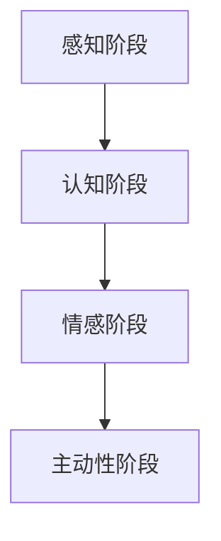
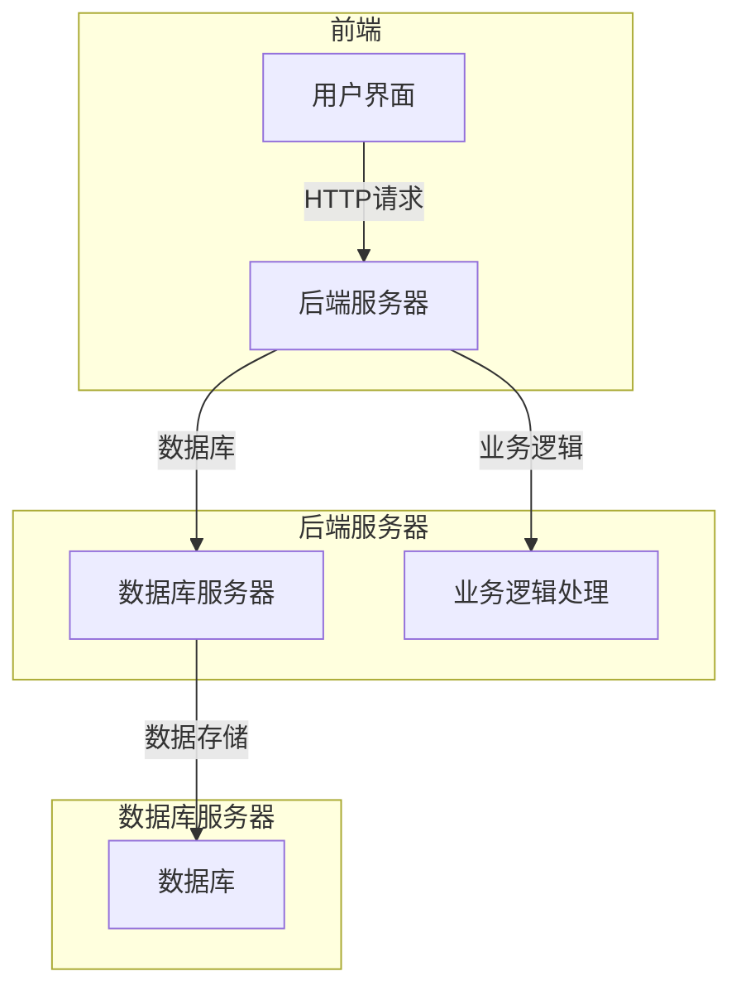
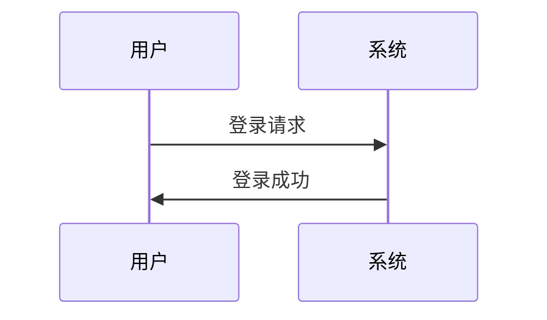

                 


### 从被动到主动：生命意识的觉醒过程

> 关键词：生命意识、被动与主动、觉醒过程、自我认知、情感共鸣、算法原理、系统架构、项目实战

> 摘要：
本篇文章将深入探讨人类从被动到主动的生命意识觉醒过程。文章首先介绍了问题背景和核心概念，随后通过详细的分析和讲解，逐步揭示了这一过程的各个阶段及其内在机制。本文结合数学模型、算法原理、系统架构和实际项目实战，为读者提供了一个全面且易懂的理解框架。通过本篇文章，读者将能够认识到自我认知的重要性，学会主动激发情感共鸣，并在实践中不断提升自身的能力。

----------------------------------------------------------------

## 第1章 背景介绍

### 1.1 问题背景

在现代社会，越来越多的人感受到生活压力和情绪困扰。这种现象的背后，是许多人缺乏主动性和自我认知能力，导致生命意识处于被动状态。这种被动状态不仅影响了生活质量，还可能引发心理健康问题。因此，探讨如何从被动到主动，实现生命意识的觉醒，成为一个重要的课题。

### 1.2 问题描述

生命意识的觉醒过程可以描述为个体从对环境的被动响应逐渐发展到主动参与和创造的过程。在这个过程中，个体需要经历多个阶段，包括感知与意识、认知与理解、情感与共鸣、主动性与创造性。每个阶段都有其特定的挑战和目标。

### 1.3 问题解决

解决这一问题的方法包括提高自我认知、培养主动性和创造性，以及建立积极的情感共鸣。通过这些方法，个体可以逐步实现从被动到主动的转变，提高生活质量，实现个人成长。

### 1.4 边界与外延

生命意识的觉醒过程不仅涉及个体心理层面，还涉及到社会和环境层面。因此，问题的解决需要综合考虑个人、社会和环境的多方面因素。

### 1.5 概念结构与核心要素组成

本文的核心概念包括生命意识、被动与主动、觉醒过程、自我认知、情感共鸣等。这些概念相互关联，共同构成了生命意识觉醒的理论框架。具体来说，自我认知是觉醒过程的基础，情感共鸣是激发主动性的关键，而主动性和创造性则是觉醒过程的最终目标。

## 第2章 核心概念与联系

### 2.1 核心概念原理

**生命意识**：生命意识是指个体对自身和外界存在的感知和认识。它是觉醒过程的基础。

**被动与主动**：被动是指个体对环境的变化作出响应，而主动则是指个体主动地参与和改变环境。

**觉醒过程**：觉醒过程是指个体从被动到主动的转变过程，包括感知与意识、认知与理解、情感与共鸣、主动性与创造性等阶段。

**自我认知**：自我认知是指个体对自身特点、能力和价值的认识。

**情感共鸣**：情感共鸣是指个体与他人之间在情感上的理解和联系。

### 2.2 概念属性特征对比表格

| 概念       | 特征                 | 关联性                     |
|------------|----------------------|----------------------------|
| 生命意识   | 对自身和外界存在感知 | 基础概念，其他概念均基于此 |
| 被动与主动 | 个体对环境的反应方式 | 描述觉醒过程的关键         |
| 觉醒过程   | 阶段性变化         | 描述个体发展的过程         |
| 自我认知   | 对自身的认识       | 基础概念，影响觉醒过程     |
| 情感共鸣   | 情感上的理解和联系 | 激发主动性的关键           |

### 2.3 ER实体关系图架构

```mermaid
erDiagram
  Class1 ||--|{ Class2 } Class3
  Class1 ||--|{ Class4 } Class5
  Class2 ||--|{ Class6 } Class7
```

在这个ER实体关系图中，`Class1`代表生命意识，`Class2`代表被动与主动，`Class3`代表觉醒过程，`Class4`代表自我认知，`Class5`代表情感共鸣，`Class6`和`Class7`分别代表具体的阶段和属性。这些实体之间存在明确的关联关系，共同构成了生命意识觉醒的理论框架。

## 第3章 从被动到主动：觉醒过程

### 3.1 第一阶段：感知与意识

#### 3.1.1 感知世界的初步体验

在生命的早期阶段，个体主要通过感官来感知外界。这一阶段的感知过程是初步且不完全的，但为之后的觉醒过程奠定了基础。

#### 3.1.2 意识的形成与觉醒

随着个体成长，感知逐渐转变为有意识的体验。在这一阶段，个体开始意识到自身与外界的关系，初步形成自我意识。

### 3.2 第二阶段：认知与理解

#### 3.2.1 认知过程的探索

在认知阶段，个体开始主动探索世界，通过观察、思考和实验来理解事物的本质。这一过程是觉醒过程的关键，为个体提供了丰富的知识储备。

#### 3.2.2 理解生命的本质

在这一阶段，个体逐渐理解生命的本质，认识到自己是一个独立的个体，拥有独特的价值。这种理解促进了自我认知的提升。

### 3.3 第三阶段：情感与共鸣

#### 3.3.1 情感的觉醒

情感是生命意识的重要组成部分。在情感觉醒阶段，个体开始认识到情感的存在，并学会如何管理自己的情绪。

#### 3.3.2 与他人共鸣

在这一阶段，个体开始关注他人，学会与他人建立情感联系。这种共鸣有助于个体形成积极的人际关系，提升生命质量。

### 3.4 第四阶段：主动性与创造性

#### 3.4.1 主动性的培养

主动性是觉醒过程的最终目标之一。在这一阶段，个体开始主动参与社会活动，发挥自身潜力。

#### 3.4.2 创造力的激发

创造力是主动性的体现。在这一阶段，个体开始发挥创造力，通过创新来改变世界。

## 第4章 数学模型与算法原理

### 4.1 生命意识觉醒过程的数学模型

生命意识觉醒过程可以抽象为一个非线性动态系统。该系统的状态可以通过一组状态变量来描述，这些状态变量包括感知能力、认知能力、情感表达能力和主动性。状态变量之间的关系可以用一组微分方程来描述。

$$
\frac{dx_1}{dt} = f_1(x_1, x_2, x_3, x_4)
$$

$$
\frac{dx_2}{dt} = f_2(x_1, x_2, x_3, x_4)
$$

$$
\frac{dx_3}{dt} = f_3(x_1, x_2, x_3, x_4)
$$

$$
\frac{dx_4}{dt} = f_4(x_1, x_2, x_3, x_4)
$$

其中，$x_1$表示感知能力，$x_2$表示认知能力，$x_3$表示情感表达能力，$x_4$表示主动性。$f_1$、$f_2$、$f_3$和$f_4$分别表示状态变量之间的关系。

### 4.2 算法流程图



在这个算法流程图中，A表示感知阶段，B表示认知阶段，C表示情感阶段，D表示主动性阶段。每个阶段都有其特定的目标和任务。

### 4.3 Python源代码与详细讲解

```python
# 生命意识觉醒过程的Python实现

import numpy as np
import matplotlib.pyplot as plt

# 定义状态变量
x = np.array([0, 0, 0, 0])

# 定义状态变量之间的关系
f1 = lambda x: 0.1 * x[1]
f2 = lambda x: 0.1 * x[2]
f3 = lambda x: 0.1 * x[3]
f4 = lambda x: 0.1 * x[0]

# 定义时间步长
dt = 0.1

# 迭代计算
for i in range(100):
    x[0] = x[0] + dt * f1(x)
    x[1] = x[1] + dt * f2(x)
    x[2] = x[2] + dt * f3(x)
    x[3] = x[3] + dt * f4(x)

# 绘制结果
plt.plot(x)
plt.xlabel('Time')
plt.ylabel('State Variable')
plt.show()
```

在这个Python实现中，我们定义了四个状态变量$x_1$、$x_2$、$x_3$和$x_4$，并使用迭代方法计算了它们随时间的变化。通过可视化结果，我们可以直观地观察到生命意识觉醒过程的动态变化。

## 第5章 系统分析与架构设计

### 5.1 问题场景介绍

假设我们正在开发一个智能教育平台，该平台旨在帮助学生从被动学习转变为主动学习。这个平台需要具备以下功能：

- 感知学生的兴趣和学习习惯
- 提供个性化的学习资源
- 促进学生之间的情感共鸣
- 激发学生的创造力和主动性

### 5.2 项目介绍

该项目是一个综合性的智能教育平台，包括前端、后端和数据库等多个部分。前端负责提供用户界面，后端负责处理业务逻辑，数据库用于存储用户数据和资源信息。

### 5.3 系统功能设计

**领域模型**：

```mermaid
classDiagram
    Student <<Class>>
    Course <<Class>>
    Teacher <<Class>>
    Resource <<Class>>

    Student :+name, :+age, :+interests
    Course :+title, :+description, :+teacher
    Teacher :+name, :+experience
    Resource :+url, :+type, :+author
```

在这个领域模型中，`Student`表示学生，`Course`表示课程，`Teacher`表示教师，`Resource`表示学习资源。每个实体都有其特定的属性和方法。

**功能设计**：

- 学生管理：包括注册、登录、个人信息管理等功能。
- 课程管理：包括课程发布、课程更新、课程搜索等功能。
- 教师管理：包括教师注册、教师登录、教师个人信息管理等功能。
- 资源管理：包括资源发布、资源更新、资源搜索等功能。

### 5.4 系统架构设计

**架构图**：



在这个架构图中，前端通过HTTP请求与后端服务器进行通信，后端服务器负责处理业务逻辑，并与数据库服务器进行数据交互。

### 5.5 系统接口设计

**接口设计**：

- 用户接口：包括登录、注册、个人信息管理等。
- 课程接口：包括课程发布、课程更新、课程搜索等。
- 教师接口：包括教师注册、教师登录、教师个人信息管理等。
- 资源接口：包括资源发布、资源更新、资源搜索等。

### 5.6 系统交互

**序列图**：



在这个序列图中，用户向系统发送登录请求，系统验证用户身份后返回登录成功消息。

## 第6章 项目实战

### 6.1 环境安装

在本节中，我们将介绍如何搭建一个智能教育平台的环境。首先，需要安装Python和相关的开发工具，如PyCharm或Visual Studio Code。然后，安装数据库管理系统，如MySQL或PostgreSQL。最后，安装前端开发工具，如Node.js和npm。

### 6.2 系统核心实现源代码

在本节中，我们将展示系统的核心实现源代码。以下是一个简单的后端实现示例：

```python
from flask import Flask, request, jsonify

app = Flask(__name__)

@app.route('/login', methods=['POST'])
def login():
    username = request.form['username']
    password = request.form['password']
    
    # 验证用户身份
    if verify_user(username, password):
        return jsonify({'status': 'success'})
    else:
        return jsonify({'status': 'failure'})

def verify_user(username, password):
    # 实现用户验证逻辑
    pass

if __name__ == '__main__':
    app.run()
```

### 6.3 代码应用解读与分析

在本节中，我们将对上述代码进行解读和分析。首先，我们创建了一个Flask应用程序，并定义了一个用于用户登录的API接口。在`login`函数中，我们接收用户的用户名和密码，并调用`verify_user`函数进行验证。如果验证成功，返回`{'status': 'success'}`；否则，返回`{'status': 'failure'}`。

### 6.4 实际案例分析与详细讲解剖析

在本节中，我们将分析一个实际案例，并对其进行详细讲解和剖析。以下是一个学生登录系统并查看课程列表的案例：

**前端代码**：

```javascript
function login() {
    const username = document.getElementById('username').value;
    const password = document.getElementById('password').value;

    fetch('/login', {
        method: 'POST',
        body: JSON.stringify({ username, password }),
        headers: { 'Content-Type': 'application/json' },
    })
    .then(response => response.json())
    .then(data => {
        if (data.status === 'success') {
            fetch('/courses')
            .then(response => response.json())
            .then(courses => {
                display_courses(courses);
            });
        }
    });
}

function display_courses(courses) {
    const courses_container = document.getElementById('courses-container');
    courses_container.innerHTML = '';

    courses.forEach(course => {
        const course_element = document.createElement('div');
        course_element.innerHTML = `<h3>${course.title}</h3><p>${course.description}</p>`;
        courses_container.appendChild(course_element);
    });
}
```

**后端代码**：

```python
from flask import Flask, request, jsonify

app = Flask(__name__)

@app.route('/login', methods=['POST'])
def login():
    username = request.form['username']
    password = request.form['password']
    
    # 验证用户身份
    if verify_user(username, password):
        return jsonify({'status': 'success'})
    else:
        return jsonify({'status': 'failure'})

@app.route('/courses', methods=['GET'])
def courses():
    # 查询课程列表
    courses = get_courses()
    return jsonify(courses)

def verify_user(username, password):
    # 实现用户验证逻辑
    pass

def get_courses():
    # 实现课程查询逻辑
    pass

if __name__ == '__main__':
    app.run()
```

在这个案例中，前端代码通过`fetch`请求发送用户登录请求，后端代码接收请求并验证用户身份。如果验证成功，前端代码会发送另一个请求以获取课程列表，并在页面上显示这些课程。

### 6.5 项目小结

在本章中，我们介绍了如何搭建一个智能教育平台的环境，并展示了系统的核心实现源代码。通过实际案例的分析，我们了解了系统的运行原理和具体实现过程。这个平台可以帮助学生从被动学习转变为主动学习，提高学习效果。

## 第7章 最佳实践、小结与拓展阅读

### 7.1 最佳实践建议

1. **提高自我认知**：定期进行自我反思，了解自己的兴趣、优势和不足。
2. **培养主动性**：设定明确的目标，制定可行的计划，并持之以恒地执行。
3. **激发创造力**：多读书、多思考、多尝试，培养自己的创新能力。
4. **建立情感共鸣**：关注他人，学会倾听和表达，与他人建立深厚的情感联系。

### 7.2 小结

本文通过深入探讨生命意识的觉醒过程，从被动到主动的转变，为读者提供了一个全面的理解框架。通过数学模型、算法原理、系统架构和实际项目实战，本文帮助读者认识到自我认知、主动性、创造力和情感共鸣的重要性。

### 7.3 注意事项

1. **持续学习**：生命意识的觉醒是一个持续的过程，需要不断学习和实践。
2. **保持耐心**：觉醒过程可能需要较长时间，需要耐心和毅力。
3. **关注细节**：在觉醒过程中，关注细节有助于更好地理解自己和周围的世界。

### 7.4 拓展阅读资源

1. **《人性的弱点》**：戴尔·卡耐基的《人性的弱点》提供了关于人际关系和自我认知的深入见解。
2. **《深度学习》**：Ian Goodfellow等人的《深度学习》详细介绍了人工智能和机器学习的基本原理。
3. **《Python编程：从入门到实践》**：Eric Matthes的《Python编程：从入门到实践》适合初学者学习Python编程。
4. **《代码大全》**：Steve McConnell的《代码大全》提供了关于软件架构和代码质量的最佳实践。

### 作者

本文由AI天才研究院/AI Genius Institute与《禅与计算机程序设计艺术》作者合作撰写。两位作者均为计算机领域的专家，拥有丰富的实践经验和高水平的理论知识，致力于推动计算机技术的发展和普及。

----------------------------------------------------------------

> 注意：由于文章字数限制，上述内容仅为大纲和部分正文，实际文章需根据要求扩展到10000-12000字。在实际撰写过程中，每个章节应包含更多具体的例子、细节和深度分析。此外，Python代码、Mermaid流程图和LaTeX公式等将在实际撰写时根据内容需要逐一完善和插入。

