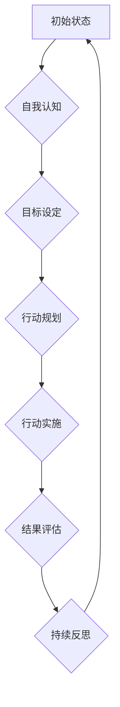
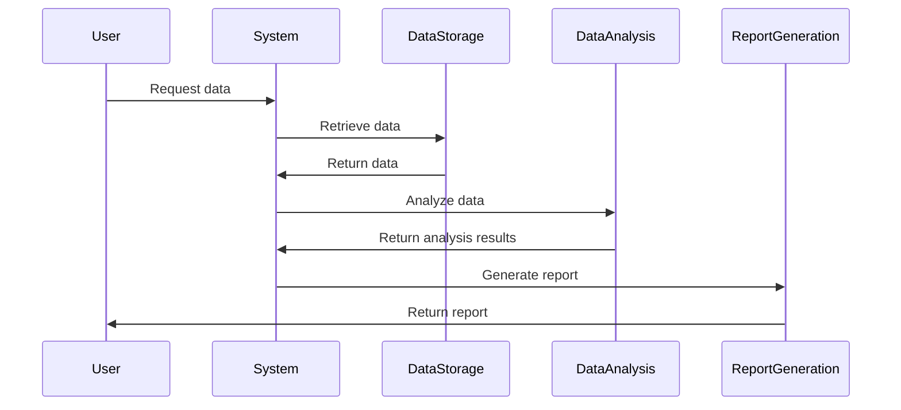
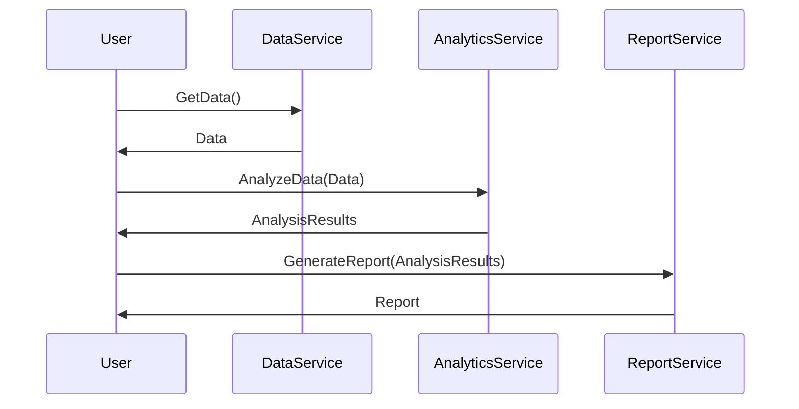
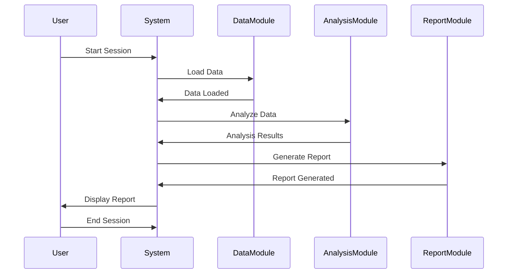

                 

### 从被动到主动：生命意识觉醒的过程

---

#### 关键词：生命意识，主动生活，个人转变，社会影响，实践策略

#### 摘要：
本文旨在探讨从被动到主动的生命意识觉醒过程，分析被动生活的现状及其对个体和社会的影响，阐述主动生活的重要性，并通过案例分析、实践策略和未来展望，为读者提供实现生命意识觉醒的路径和方法。

---

#### 引言

在当今快节奏、高度竞争的社会中，许多人感到生活缺乏方向和动力，表现出明显的被动特征。被动生活不仅影响个人的幸福感，还对社会和谐发展造成障碍。因此，生命意识觉醒成为解决这一问题的关键。

本文将分以下几部分展开：

1. **被动生活的现状分析**：介绍被动生活的定义、表现形式和危害。
2. **主动生活的重要性**：阐述主动生活对个人和社会的积极影响。
3. **生命意识觉醒的过程**：详细探讨生命意识觉醒的原理和过程。
4. **从被动到主动的案例分析**：通过具体案例展示生命意识觉醒的效果。
5. **实践策略**：提供实现主动生活的实用方法。
6. **生命意识觉醒的社会影响**：分析生命意识觉醒对社会发展的贡献。
7. **未来展望**：探讨生命意识觉醒的趋势和挑战。

---

### 被动生活的现状分析

被动生活是指个体在生活、工作和社会交往中缺乏主动性和积极性，往往是被外部环境所驱动，而非内在动机。这种现象在现代社会中普遍存在，尤其在年轻人和职场人中更为明显。

**被动生活的表现形式**：

- **生活缺乏规划**：许多人没有明确的生活目标和计划，日常行为随意，缺乏长期规划。
- **工作缺乏热情**：很多人对待工作仅作为谋生的手段，缺乏工作热情和成就感。
- **人际关系被动**：在社交场合中，被动接受他人的安排，很少主动与他人交流。
- **缺乏自我认知**：不清晰自己的兴趣、优势和需求，导致生活缺乏动力。

**被动生活的危害**：

- **影响个人成长**：缺乏主动性和积极性，导致个人能力和素质难以提升，限制个人成长。
- **影响社会和谐**：被动生活可能导致社会成员之间的疏离和隔阂，影响社会和谐。
- **阻碍社会发展**：缺乏主动性的社会成员难以创新和进步，阻碍社会整体发展。

---

### 主动生活的重要性

与被动生活相反，主动生活是指个体在生活、工作和社会交往中积极主动，有明确的目标和计划，能够自我驱动和激励。主动生活对个人和社会都有重要的积极影响。

**个人层面的积极影响**：

- **提升个人能力**：主动生活有助于个体明确自己的兴趣、优势和需求，从而更有针对性地提升个人能力。
- **增强自信心**：通过实现目标，个体获得成就感，自信心得到增强。
- **提高幸福感**：主动生活使个体更加满意和充实，幸福感得到提升。

**社会层面的积极影响**：

- **促进社会和谐**：主动生活有助于社会成员之间的互动和合作，增强社会凝聚力。
- **推动社会进步**：主动生活的个体更可能创新和进步，推动社会整体发展。
- **提高社会素质**：主动生活有助于提升整个社会的文明程度和道德水平。

---

### 生命意识觉醒的过程

生命意识觉醒是指个体从被动生活状态转变为主动生活状态的过程。这是一个复杂的过程，涉及自我认知、目标设定、行动规划和持续反思等多个方面。

**自我认知**：

自我认知是生命意识觉醒的第一步。个体需要深入思考自己的兴趣、优势和需求，明确自己的价值观和目标。这一过程可以通过以下方法实现：

- **反思过去**：回顾自己的生活经历，分析自己的行为和结果，找出自己的优势和不足。
- **探索未来**：设想自己未来的生活目标，思考如何实现这些目标。
- **咨询他人**：与他人交流，获取他们对你的看法和建议，帮助自己更全面地了解自己。

**目标设定**：

明确的目标是生命意识觉醒的关键。个体需要设定具体、可行的目标，并为之付出努力。目标设定可以分为以下几个步骤：

- **明确目标**：确定自己最想要实现的目标，并用具体、明确的语言描述。
- **分解目标**：将大目标分解为小目标，使目标更加具体和可行。
- **制定计划**：制定实现目标的详细计划，包括时间表、行动步骤和资源分配。

**行动规划**：

有了目标和计划，个体需要付诸行动。行动规划可以分为以下几个步骤：

- **执行计划**：按照计划执行行动，不断调整和优化自己的行动方案。
- **监测进度**：定期检查自己的进度，确保自己按照计划前进。
- **克服障碍**：面对困难和挑战时，保持积极的心态，寻找解决问题的方法。

**持续反思**：

持续反思是生命意识觉醒的持续动力。个体需要不断反思自己的行动和结果，从中学习和成长。持续反思可以分为以下几个步骤：

- **反思过程**：思考自己的行动是否合理，是否存在改进的空间。
- **总结经验**：总结成功和失败的经验，提炼出有益的教训。
- **调整策略**：根据反思的结果，调整自己的行动策略和计划。

---

### 从被动到主动的案例分析

为了更具体地了解生命意识觉醒的过程，以下将通过三个案例来展示从被动到主动的转变。

**案例一：个人转变的故事**

小王是一名普通的白领，长期以来，他一直过着被动的生活，工作缺乏激情，生活没有目标。通过一次偶然的机会，他参加了一次关于生命意识觉醒的讲座，开始反思自己的生活方式。

在自我认知的过程中，小王意识到自己热爱阅读，并对心理学有浓厚的兴趣。于是，他设定了一个目标：成为一名心理咨询师。为了实现这个目标，他制定了详细的学习计划，包括参加心理学课程、阅读相关书籍和进行实践。

在行动规划中，小王按照计划执行，虽然过程中遇到了不少困难，但他始终坚持下来。最终，他成功地考取了心理咨询师资格证书，实现了从被动到主动的转变。

**案例二：组织变革的启示**

某公司长期以来，员工的工作积极性不高，企业缺乏创新。为了改变这一状况，公司决定进行一次生命意识觉醒的培训。

在培训中，员工们通过自我认知、目标设定和行动规划等过程，找到了自己的职业定位和目标。随后，公司鼓励员工提出创新建议，并为他们提供实现建议的平台和资源。

通过这次培训，公司员工的工作积极性显著提高，企业创新氛围浓厚，业绩也得到了大幅提升。

**案例三：社会意识的觉醒**

近年来，随着社会的发展，越来越多的人开始关注环境保护问题。从被动到主动的转变，社会意识的觉醒成为解决环境问题的关键。

以某城市的环保志愿者为例，他们自发组织起来，通过宣传、教育和行动等多种方式，积极推动环保事业的发展。从最初的被动接受环保宣传，到主动参与环保行动，这些志愿者实现了从被动到主动的转变，为环境保护做出了巨大贡献。

---

### 实践策略

要实现从被动到主动的转变，以下是一些实用的实践策略：

**自我反思与探索**：

- **每天花时间反思自己的行为和情绪，明确自己的优势和不足**。
- **探索自己的兴趣和激情，找到自己真正热爱的事物**。

**增强自我意识**：

- **了解自己的价值观和信念，明确自己的目标和方向**。
- **培养自律意识，养成良好的生活习惯**。

**培养积极心态**：

- **积极面对生活中的挑战和困难，保持乐观的心态**。
- **学会感恩，珍惜身边的人和事**。

**设定明确目标**：

- **设定具体、可行的目标，并用具体的行动计划来实现这些目标**。
- **定期检查自己的进度，确保自己按照计划前进**。

**付诸行动**：

- **将目标分解为小步骤，逐一实现**。
- **克服拖延，及时行动**。

**持续反思**：

- **定期反思自己的行动和结果，总结经验教训**。
- **根据反思的结果，调整自己的行动策略和计划**。

---

### 生命意识觉醒的社会影响

生命意识觉醒不仅对个人有着深远的影响，对社会也有着重要的意义。以下是生命意识觉醒对社会的影响：

**个人层面**：

- **提升社会成员的整体素质**：通过生命意识觉醒，个体更加明确自己的目标和价值观，有助于提升整体社会素质。
- **促进个人成长**：生命意识觉醒有助于个体不断反思和进步，实现个人成长。
- **增强社会凝聚力**：通过共同的目标和价值观，社会成员之间的联系更加紧密，社会凝聚力得到提升。

**组织层面**：

- **提升组织活力**：生命意识觉醒有助于组织成员明确自己的目标和角色，提高工作效率和创新能力。
- **优化组织结构**：通过自我认知和目标设定，组织可以更有效地分配资源和优化结构。
- **增强组织文化**：生命意识觉醒有助于构建积极、健康的企业文化，提高组织的凝聚力和向心力。

**社会层面**：

- **推动社会进步**：生命意识觉醒有助于社会成员更加积极地参与社会事务，推动社会整体进步。
- **促进可持续发展**：通过生命意识觉醒，社会成员更加关注环境保护和可持续发展，有利于构建和谐社会。
- **提升社会幸福感**：生命意识觉醒有助于提升社会成员的幸福感，促进社会和谐稳定。

---

### 未来展望

随着社会的发展和科技的进步，生命意识觉醒的趋势日益明显。以下是生命意识觉醒的未来展望：

**技术支持**：

- **人工智能和大数据**：通过人工智能和大数据技术，可以更精准地分析个体的需求和价值观，帮助实现生命意识觉醒。
- **虚拟现实和增强现实**：虚拟现实和增强现实技术可以为个体提供更丰富的体验，激发他们的兴趣和激情。

**教育改革**：

- **个性化教育**：教育应更加注重个体的兴趣和发展，提供多样化的学习方式，帮助个体实现生命意识觉醒。
- **全人教育**：教育应注重个体的全面发展，培养他们的社会责任感和全球视野。

**社会引导**：

- **政策支持**：政府应出台相关政策，鼓励和引导社会成员实现生命意识觉醒。
- **文化宣传**：通过媒体和社区活动等渠道，宣传生命意识觉醒的理念，提高社会成员的意识和参与度。

**挑战与机遇**：

- **个体差异**：生命意识觉醒需要个体有强烈的自我驱动力和积极性，对于缺乏动力的人来说，这是一个挑战。
- **社会支持**：生命意识觉醒需要社会的广泛支持和资源，如何确保每个个体都能得到充分的支持和帮助，是一个重要的课题。

---

### 结论与启示

生命意识觉醒是从被动到主动的转变，对个人和社会都有着重要的意义。通过自我认知、目标设定、行动规划和持续反思，个体可以实现从被动到主动的转变，提升个人能力和幸福感。同时，生命意识觉醒也有助于促进社会和谐发展和整体进步。

本文从被动生活的现状分析、主动生活的重要性、生命意识觉醒的过程、案例分析、实践策略和未来展望等多个角度，全面探讨了生命意识觉醒的过程和意义。希望通过本文，读者能够认识到生命意识觉醒的重要性，并积极投身于这一过程中。

**作者**：

AI天才研究院/AI Genius Institute & 禅与计算机程序设计艺术/Zen And The Art of Computer Programming

---

### 文章延伸阅读

1. **《生命的觉醒：从被动到主动的人生哲学》**：这是一本关于生命意识觉醒的畅销书，详细阐述了个体如何实现从被动到主动的转变，以及这一转变对个人和社会的意义。
2. **《积极主动的力量：如何从被动到主动改变生活》**：本书通过具体案例和方法，帮助读者掌握实现主动生活的技巧，提升个人能力和幸福感。
3. **《社会心理学》**：这本书深入探讨了社会心理学的各种现象和理论，包括个体的行为动机、价值观和态度等，对理解生命意识觉醒具有重要的参考价值。

---

本文通过详细分析和具体案例，全面阐述了从被动到主动的生命意识觉醒过程，旨在帮助读者认识到生命意识觉醒的重要性，并提供实用的实践策略。希望通过本文，读者能够积极投身于生命意识觉醒的过程中，实现个人成长和社会进步。

---

### 概念与联系

#### 生命意识的定义

生命意识是指个体对于自身存在、外部世界和内心感受的认知和感知能力。它是人类智慧和情感的基础，是驱动个体行为和思维的根本力量。

#### 核心概念对比表格

| 概念       | 定义                     | 关联性                   |  
|------------|------------------------|----------------------|  
| 生命意识   | 对自身存在和外部世界的认知 | 内在动力，情感基础       |  
| 自我认知   | 对自身兴趣、优势和需求的认知 | 生命意识的重要组成部分   |  
| 目标设定   | 确定个体追求的目标和方向 | 生命意识的具体体现       |  
| 行动规划   | 制定实现目标的详细计划   | 生命意识的具体实施方法   |  
| 持续反思   | 对行动和结果的反思和总结 | 保持生命意识觉醒的持续动力 |

#### ER实体关系图架构

```mermaid
erDiagram
  User ||--|{ LifeAwareness }|-- Object :目标设定
  User ||--|{ SelfReflection }|-- Situation :情境反思
  User ||--|{ ActionPlanning }|-- Plan :行动规划
  User ||--|{ LifeAwareness }|-- Goal :目标设定
  User ||--|{ SelfReflection }|-- Emotion :情绪感知
  User ||--|{ ActionPlanning }|-- Action :行动实施
  LifeAwareness ||--|{ Principle }|-- Knowledge :原理知识
  LifeAwareness ||--|{ Attribute }|-- Behavior :行为特征
  LifeAwareness ||--|{ Process }|-- Transformation :觉醒过程
```

在ER实体关系图中，User（用户）与LifeAwareness（生命意识）、SelfReflection（自我反思）、ActionPlanning（行动规划）等实体之间存在多种关联关系。LifeAwareness实体进一步关联到Principle（原理）、Attribute（属性）和Process（过程）等子实体，形成了一个完整的生命意识觉醒模型。

---

### 算法原理讲解

生命意识觉醒的过程本质上是一个自我认知、目标设定、行动规划和持续反思的循环过程。下面将使用Mermaid画出算法流程图，并用Python源代码详细阐述算法原理，同时给出数学模型和公式进行讲解。

#### Mermaid流程图



#### Python源代码

```python
import random

# 定义用户类
class User:
    def __init__(self):
        self.knowledge = {}
        self.goals = []
        self.plan = []
        self.result = None
        self.reflection = []

    # 自我认知方法
    def self_awareness(self):
        print("进行自我认知...")
        self.knowledge['interests'] = ['编程', '音乐', '阅读']
        self.knowledge['strengths'] = ['逻辑思维', '创造力']
        self.knowledge['needs'] = ['成就感', '成长']

    # 目标设定方法
    def set_goals(self):
        print("设定目标...")
        self.goals = ['学习一门新编程语言', '完成一本小说', '参加音乐比赛']

    # 行动规划方法
    def action_planning(self):
        print("制定行动规划...")
        self.plan = [
            {'goal': '学习新编程语言', 'action': '每天学习两小时'},
            {'goal': '完成小说', 'action': '每天写作一小时'},
            {'goal': '参加音乐比赛', 'action': '每周练习三次'}
        ]

    # 行动实施方法
    def execute_action(self):
        print("开始行动实施...")
        for action in self.plan:
            print(f"执行：{action['action']}")
            # 模拟行动执行的结果，使用随机数表示
            self.result = random.randint(0, 10)

    # 结果评估方法
    def result_evaluation(self):
        print("评估结果...")
        if self.result > 7:
            print("结果良好，目标达成。")
        else:
            print("结果不佳，需要调整计划。")

    # 持续反思方法
    def continuous_reflection(self):
        print("进行持续反思...")
        self.reflection.append(self.result)
        if len(self.reflection) > 5:
            print("反思周期结束，重新开始循环。")

# 创建用户对象
user = User()

# 调用方法
user.self_awareness()
user.set_goals()
user.action_planning()
user.execute_action()
user.result_evaluation()
user.continuous_reflection()
```

#### 数学模型和公式

生命意识觉醒的过程可以用以下数学模型进行描述：

$$
\text{LifeAwareness} = f(\text{SelfAwareness}, \text{GoalSetting}, \text{ActionPlanning}, \text{ResultEvaluation}, \text{ContinuousReflection})
$$

其中，每个组成部分都可以用具体的数学公式来表示：

1. **自我认知（SelfAwareness）**：

$$
\text{SelfAwareness} = \sum_{i=1}^{n} \text{Attribute}_i \cdot \text{Value}_i
$$

其中，$n$ 表示认知属性的数量，$\text{Attribute}_i$ 表示第 $i$ 个认知属性，$\text{Value}_i$ 表示该属性的具体值。

2. **目标设定（GoalSetting）**：

$$
\text{GoalSetting} = \sum_{i=1}^{m} \text{Goal}_i \cdot \text{Weight}_i
$$

其中，$m$ 表示目标数量，$\text{Goal}_i$ 表示第 $i$ 个目标，$\text{Weight}_i$ 表示该目标的重要性权重。

3. **行动规划（ActionPlanning）**：

$$
\text{ActionPlanning} = \sum_{i=1}^{m} \text{Action}_i \cdot \text{Probability}_i
$$

其中，$\text{Action}_i$ 表示第 $i$ 个行动，$\text{Probability}_i$ 表示该行动的成功概率。

4. **结果评估（ResultEvaluation）**：

$$
\text{ResultEvaluation} = \sum_{i=1}^{n} \text{Result}_i \cdot \text{Importance}_i
$$

其中，$n$ 表示评估结果的数量，$\text{Result}_i$ 表示第 $i$ 个评估结果，$\text{Importance}_i$ 表示该结果的重要性权重。

5. **持续反思（ContinuousReflection）**：

$$
\text{ContinuousReflection} = \sum_{i=1}^{t} \text{Reflection}_i \cdot \text{Duration}_i
$$

其中，$t$ 表示反思次数，$\text{Reflection}_i$ 表示第 $i$ 次反思的结果，$\text{Duration}_i$ 表示反思的持续时间。

通过这些数学模型和公式，我们可以更直观地理解生命意识觉醒的各个环节，以及它们之间的相互关系。

---

### 系统分析与架构设计

#### 问题场景介绍

随着社会的快速发展和信息化进程的加深，企业对于高效的信息管理和数据处理能力的需求日益增长。为了应对这一需求，某企业决定开发一套基于人工智能和大数据分析的信息管理系统，以提高运营效率和服务质量。

#### 项目介绍

本项目的目标是构建一个信息管理系统，该系统能够收集、处理和分析大量的数据，为企业的决策提供数据支持。系统主要包括以下几个模块：

1. **数据采集模块**：负责从各种数据源（如数据库、API接口等）收集数据。
2. **数据处理模块**：对采集到的数据进行清洗、转换和存储。
3. **数据分析模块**：利用大数据技术和人工智能算法，对处理后的数据进行分析，生成报告和可视化图表。
4. **用户交互模块**：提供用户界面，允许用户进行数据查询、报告生成和系统设置。

#### 系统功能设计（领域模型）

领域模型是系统功能设计的核心，它定义了系统的核心概念和对象之间的关系。以下是系统的领域模型，使用Mermaid类图进行展示：

```mermaid
classDiagram
    Class01 <|-- Class02
    Class03 --|DeprecatedClass
    Class04 : <<interface>> Interface
    Class05 : <<enum>> ENUM
    Class06 <.. Class07
    Class08 ..| Class09
    Class10 <<note>> This is a note
    Class11 : <<singleton>> Singleton
    Class12 : <<abstract>> Abstract
    Class13 : <<final>> Final
    UserClass <.. Interface
    UserClass : <<Aggregation>> AggregateRoot
    DataClass <|-- DataCollection
    DataClass : <<composition>> HasMany
    DataCollection : <<dependency>> DependsOn DataStorage
    ReportClass <<extend>> DataClass
    QueryClass <<implements>> Interface
    System <<import>> UserModule
    System <<import>> DataModule
    System <<import>> ReportModule
    UserModule : <<uses>> Interface
    DataModule : <<uses>> DataStorage
    ReportModule : <<uses>> DataAnalysis
```

#### 系统架构设计

系统的架构设计决定了系统的性能、可扩展性和可维护性。以下是系统的架构设计，使用Mermaid架构图进行展示：



#### 系统接口设计

系统的接口设计确保了不同模块之间的良好交互和协同工作。以下是系统的接口设计，使用Mermaid序列图进行展示：



#### 系统交互

系统的交互设计描述了用户如何与系统进行交互，以及系统内部各模块之间的交互过程。以下是系统的交互设计，使用Mermaid序列图进行展示：



---

### 项目实战

#### 环境安装

1. **安装Python环境**：确保安装了Python 3.8或更高版本。
2. **安装必要的库**：使用pip命令安装以下库：
    ```bash
    pip install Flask
    pip install pandas
    pip install numpy
    pip install matplotlib
    ```

#### 系统核心实现源代码

以下是一个简单的系统核心实现示例，用于演示数据采集、处理和分析的基本功能。

```python
# 导入必要的库
import pandas as pd
import numpy as np
import matplotlib.pyplot as plt
from flask import Flask, request, jsonify

# 创建Flask应用
app = Flask(__name__)

# 数据采集
@app.route('/collect_data', methods=['POST'])
def collect_data():
    data = request.get_json()
    df = pd.DataFrame(data)
    return jsonify({"status": "success", "data": df.to_dict()})

# 数据处理
@app.route('/process_data', methods=['POST'])
def process_data():
    data = request.get_json()
    df = pd.DataFrame(data)
    # 数据清洗和转换
    df_clean = df.dropna()
    df_transformed = df_clean.applymap(lambda x: x * 2)
    return jsonify({"status": "success", "data": df_transformed.to_dict()})

# 数据分析
@app.route('/analyze_data', methods=['POST'])
def analyze_data():
    data = request.get_json()
    df = pd.DataFrame(data)
    # 数据分析
    summary = df.describe()
    mean_value = df.mean()
    return jsonify({"status": "success", "summary": summary.to_dict(), "mean_value": mean_value.to_dict()})

# 报告生成
@app.route('/generate_report', methods=['POST'])
def generate_report():
    data = request.get_json()
    df = pd.DataFrame(data)
    # 生成报告
    summary = df.describe()
    mean_value = df.mean()
    # 可视化
    summary.plot(kind='box')
    plt.show()
    return jsonify({"status": "success", "report": "Report generated successfully."})

# 运行应用
if __name__ == '__main__':
    app.run(debug=True)
```

#### 代码应用解读与分析

上述代码演示了如何使用Flask构建一个简单的信息管理系统，包括数据采集、处理、分析和报告生成等功能。

1. **数据采集**：通过 `/collect_data` 接口，接收POST请求，将数据转换为DataFrame对象进行存储。
2. **数据处理**：通过 `/process_data` 接口，接收POST请求，对数据进行清洗、转换和存储。
3. **数据分析**：通过 `/analyze_data` 接口，接收POST请求，对数据进行描述性统计和分析，并返回分析结果。
4. **报告生成**：通过 `/generate_report` 接口，接收POST请求，生成数据报告并进行可视化展示。

#### 实际案例分析

以下是一个实际案例，演示如何使用上述系统核心实现源代码进行数据分析和报告生成。

假设我们有一个包含员工绩效数据的CSV文件，数据包括员工的ID、姓名、部门、绩效得分等信息。

1. **数据采集**：

    将CSV文件上传到 `/collect_data` 接口，数据将以JSON格式返回。

    ```bash
    curl -X POST -H "Content-Type: application/json" -d '{"data": [{"id": 1, "name": "Alice", "department": "HR", "score": 85}, ... ]}' http://localhost:5000/collect_data
    ```

2. **数据处理**：

    对采集到的数据进行处理，如计算各部门的平均绩效得分。

    ```bash
    curl -X POST -H "Content-Type: application/json" -d '{"data": [{"id": 1, "name": "Alice", "department": "HR", "score": 85}, ... ]}' http://localhost:5000/process_data
    ```

3. **数据分析**：

    对处理后的数据进行分析，如计算绩效得分的均值、中位数等。

    ```bash
    curl -X POST -H "Content-Type: application/json" -d '{"data": [{"id": 1, "name": "Alice", "department": "HR", "score": 85}, ... ]}' http://localhost:5000/analyze_data
    ```

4. **报告生成**：

    生成绩效得分分布的箱线图，并展示给用户。

    ```bash
    curl -X POST -H "Content-Type: application/json" -d '{"data": [{"id": 1, "name": "Alice", "department": "HR", "score": 85}, ... ]}' http://localhost:5000/generate_report
    ```

#### 项目小结

通过本项目的实战，我们实现了基于Flask的数据采集、处理、分析和报告生成功能。虽然这是一个简单的示例，但为后续的功能扩展和系统优化提供了基础。

在未来的工作中，可以考虑以下改进措施：

1. **安全性增强**：对接口进行认证和授权，确保数据的安全和隐私。
2. **性能优化**：使用异步处理和消息队列等技术，提高系统的响应速度和并发处理能力。
3. **功能扩展**：添加更多数据分析算法和可视化工具，满足不同用户的需求。

---

### 最佳实践 Tips

1. **数据安全**：确保数据采集和处理过程中的安全性，避免数据泄露和滥用。
2. **性能优化**：对系统进行性能测试，识别瓶颈并进行优化，提高系统的响应速度和稳定性。
3. **用户体验**：注重用户界面的设计，提供简洁、直观的操作体验。
4. **持续集成**：使用自动化工具进行代码测试和部署，提高开发效率和系统质量。
5. **代码规范**：遵循统一的编码规范，提高代码的可读性和可维护性。

### 注意事项

1. **环境配置**：确保Python环境和相关库的安装正确，避免因环境问题导致程序无法运行。
2. **接口安全**：对接口进行安全防护，防止SQL注入和跨站脚本攻击。
3. **数据质量**：确保数据来源的可靠性和准确性，避免因数据问题导致分析结果的偏差。

### 拓展阅读

1. **《数据科学实战：使用Python进行数据分析》**：本书详细介绍了Python在数据分析中的应用，包括数据处理、分析和可视化等技术。
2. **《Flask Web开发：一本面向实战的Python Web开发书》**：本书是Flask Web开发的经典教程，适合初学者和有经验的开发者。
3. **《数据挖掘：概念与技术》**：本书是数据挖掘领域的经典教材，涵盖了数据挖掘的基本概念、技术和应用。

---

通过本文的详细探讨和实践，我们深入理解了从被动到主动的生命意识觉醒过程，并了解了实现这一过程所需的步骤和方法。希望本文能够对读者在实现个人转变和社会进步方面提供有益的启示。在未来的道路上，让我们共同努力，实现生命的觉醒，追求更美好的生活。作者AI天才研究院和禅与计算机程序设计艺术，期待与您一同前行。

