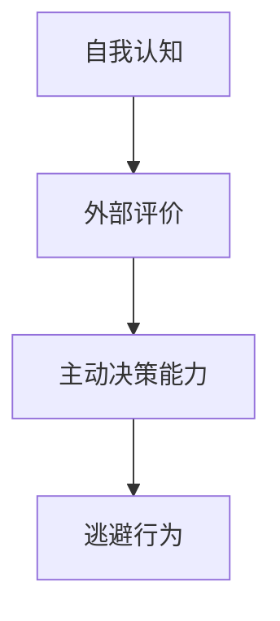
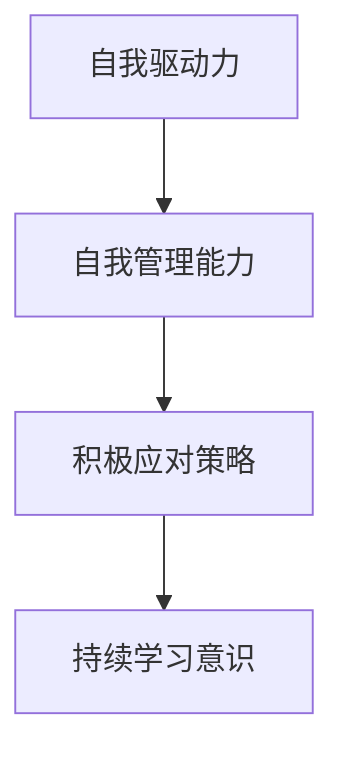
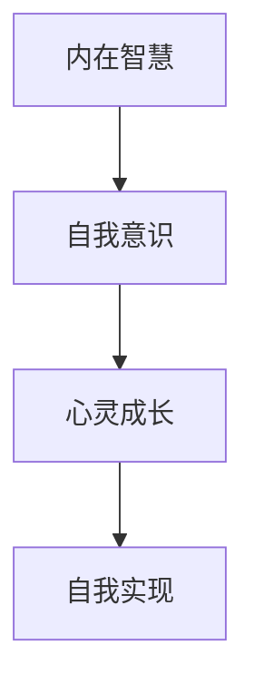

                 

### 引言

**标题：从被动到主动：觉醒生命的意义意识**

> **关键词：被动生活、主动生活、生命意义、觉醒、意识**

在当今社会，我们常常陷入忙碌而琐碎的生活中，往往忽略了生活的真正意义。许多人过着被动的生活，缺乏对未来的规划和控制感，感到迷茫和无助。这种状态不仅影响了个人的幸福感，也对社会整体产生了负面影响。本文旨在探讨如何从被动生活模式转变为主动生活模式，唤醒对生命意义的意识。

> **摘要：**
> 本文将首先介绍被动生活模式的特点及其对个人和社会的影响。接着，我们将探讨主动生活模式的定义、优势以及实现途径。随后，文章将深入探讨如何觉醒生命的意义意识，包括自我认知、积极心理的塑造以及主动意识的培养。最后，我们将通过案例分析，总结最佳实践，并展望未来的发展方向。

### 第1章 被动生活模式分析

#### 1.1 被动生活模式的定义与特征

被动生活模式指的是个体在面对生活挑战和机遇时，缺乏主动性和控制感，常常被外部环境所左右。这种生活模式通常表现为以下几点特征：

1. **缺乏目标和规划**：被动生活者往往没有明确的生活目标，缺乏对未来的规划，生活显得无序和混乱。
2. **依赖外部评价**：他们往往依赖于他人的评价和认可，缺乏自我认知和自我价值感。
3. **缺乏主动决策能力**：在面临决策时，被动生活者常常犹豫不决，缺乏果断性和决策能力。
4. **习惯性逃避**：面对困难和挑战时，被动生活者倾向于逃避和回避，而不是积极应对。

#### 1.2 被动生活模式的影响

被动生活模式对个人和社会产生了深远的影响。对个人而言，被动生活可能导致：

- **心理问题**：长期处于被动状态可能导致焦虑、抑郁等心理问题。
- **职业发展受限**：缺乏主动性和决策能力，个人职业发展往往受到限制。
- **生活质量下降**：缺乏规划和管理能力，生活质量难以得到提升。

对社会而言，被动生活模式可能导致：

- **社会活力降低**：个人缺乏主动性和创新精神，社会整体活力降低。
- **资源浪费**：被动生活者往往无法有效利用资源，导致资源浪费。
- **社会问题加剧**：被动生活可能导致社会问题加剧，如失业率上升、社会不公等。

#### 1.3 被动生活模式的边界与外延

被动生活模式的边界在于个体的主动性和控制感。当个体能够主动设定目标、积极面对挑战、有效决策并管理自己的生活时，被动生活模式便不再适用。外延则涉及个体在不同生活领域的表现，如职业、家庭、社交等。

#### 1.4 被动生活模式的核心概念与联系

为了更深入地理解被动生活模式，我们需要了解以下几个核心概念：

1. **自我认知**：个体对自己性格、能力、价值观等特征的认知和理解。
2. **外部评价**：他人对个体的评价和认可。
3. **主动决策能力**：个体在面临决策时，能够迅速、果断地做出合理决策。
4. **逃避行为**：面对困难时，个体倾向于逃避而非积极应对。

这些概念之间的关系如下图所示：

通过图中的关系，我们可以看到，自我认知、外部评价、主动决策能力和逃避行为之间相互影响，共同构成了被动生活模式。

#### 1.5 被动生活模式的数学模型和公式

为了量化被动生活模式的影响，我们可以使用以下数学模型：

$$
P = f(A, B, C, D)
$$

其中，$P$表示被动生活模式的程度，$A$、$B$、$C$、$D$分别代表自我认知、外部评价、主动决策能力和逃避行为。函数$f$表示这些因素对被动生活模式的影响程度。

例如，假设一个人的自我认知较高，外部评价积极，主动决策能力强，逃避行为较少，那么他的被动生活模式程度可能较低。

通过这个模型，我们可以更好地理解被动生活模式的形成和变化，从而有针对性地进行改善。

### 第2章 主动生活模式探讨

#### 2.1 主动生活模式的定义与特征

主动生活模式与被动生活模式相反，它强调个体的主动性和控制感。主动生活者具备以下特征：

1. **明确的目标和规划**：主动生活者有明确的生活目标，并制定详细的规划，以确保目标的实现。
2. **自我驱动和自我管理**：他们具备自我驱动力，能够自我管理，克服外部干扰，专注于实现目标。
3. **积极应对挑战**：面对困难和挑战时，主动生活者积极应对，而不是逃避。
4. **持续学习和成长**：他们注重个人成长，不断学习新知识和技能，以适应不断变化的环境。

#### 2.2 主动生活模式的优势

主动生活模式的优势体现在以下几个方面：

1. **提高生活质量**：主动生活者能够更好地管理自己的生活，提高生活质量。
2. **职业发展**：具备主动性和决策能力的个人在职业发展上更具竞争力。
3. **增强幸福感**：主动生活者对自己的生活有更多的控制感，从而提高幸福感。
4. **提升社会贡献**：主动生活者积极参与社会活动，为社会作出更大的贡献。

#### 2.3 主动生活模式的实现途径

要实现主动生活模式，可以从以下几个方面入手：

1. **设定目标**：明确自己的目标，并将其分解为可行的步骤。
2. **制定计划**：制定详细的计划，包括时间表、资源分配等。
3. **自我管理**：学会自我管理，包括时间管理、情绪管理、压力管理等。
4. **积极应对挑战**：面对挑战时，积极寻找解决方案，而不是逃避。
5. **持续学习**：不断学习新知识和技能，以适应变化的环境。

#### 2.4 主动生活模式的核心概念与联系

主动生活模式的核心概念包括：

1. **自我驱动力**：个体内在的动机，推动其实现目标。
2. **自我管理能力**：个体对自身行为和情绪的管理能力。
3. **积极应对策略**：面对困难和挑战时，采取的积极措施。
4. **持续学习意识**：个体持续学习的态度和习惯。

这些概念之间的关系如下图所示：

通过图中的关系，我们可以看到，自我驱动力、自我管理能力、积极应对策略和持续学习意识共同构成了主动生活模式。

#### 2.5 主动生活模式的数学模型和公式

为了量化主动生活模式的影响，我们可以使用以下数学模型：

$$
A = f(G, M, P, L)
$$

其中，$A$表示主动生活模式的程度，$G$、$M$、$P$、$L$分别代表自我驱动力、自我管理能力、积极应对策略和持续学习意识。函数$f$表示这些因素对主动生活模式的影响程度。

例如，假设一个人的自我驱动力较强，自我管理能力较好，积极应对策略有效，持续学习意识强烈，那么他的主动生活模式程度可能较高。

通过这个模型，我们可以更好地理解主动生活模式的形成和变化，从而有针对性地进行提升。

### 第3章 觉醒生命的意义意识

#### 3.1 觉醒的概念与意义

觉醒（Awakening）是指个体从混沌无知的状态中意识到自己的内在智慧和真实本质。它不仅仅是一种心理状态，更是一种深刻的生命体验。觉醒的意义在于：

1. **发现自我**：觉醒帮助个体认识到自己的内在智慧和独特性，从而更好地理解自己的需求和愿望。
2. **提升意识**：觉醒使个体意识到自己的思维和行为模式，从而能够更好地管理自己的情绪和行为。
3. **实现自我实现**：觉醒推动个体追求更高层次的自我实现，实现个人潜能的最大化。
4. **促进心灵成长**：觉醒促进个体心灵成长，培养出更深刻的人生观和价值观。

#### 3.2 觉醒的路径与方法

觉醒是一个长期而持续的过程，以下是一些常见的觉醒路径和方法：

1. **冥想**：冥想是一种深入内心、静心养性的方法。通过冥想，个体能够平静心境，增强自我意识。
2. **自我反思**：定期进行自我反思，思考自己的行为和思想，有助于个体更好地理解自己。
3. **学习与探索**：通过学习和探索，个体能够不断扩展自己的知识和视野，从而更好地认识世界和自己。
4. **实践**：通过实际行动，将觉醒的理念付诸实践，个体能够更好地体验觉醒的真正含义。
5. **寻求指导**：在觉醒过程中，寻求专业导师或同伴的指导，有助于个体更快地觉醒。

#### 3.3 觉醒后的生活变化

觉醒后的生活将发生显著变化，主要包括以下几个方面：

1. **心态转变**：觉醒使个体拥有更加积极、平和的心态，更好地应对生活中的挑战和困难。
2. **行为改变**：觉醒推动个体改变不良行为习惯，采取更有益于自我和他人发展的行为。
3. **人际关系**：觉醒使个体能够更好地理解他人，建立更健康、和谐的人际关系。
4. **职业发展**：觉醒促进个体在职业领域实现更高的成就，提升工作效率和创造力。
5. **生活满意度**：觉醒使个体对生活有更深刻的认识和理解，从而提高生活满意度。

#### 3.4 觉醒的核心概念与联系

觉醒涉及的核心概念包括：

1. **内在智慧**：个体内在的智慧和直觉。
2. **自我意识**：个体对自己内心世界的认识和理解。
3. **心灵成长**：个体心灵的成长和发展。
4. **自我实现**：个体实现个人潜能的过程。

这些概念之间的关系如下图所示：

通过图中的关系，我们可以看到，内在智慧、自我意识、心灵成长和自我实现共同构成了觉醒的核心概念。

#### 3.5 觉醒的数学模型和公式

为了量化觉醒的程度，我们可以使用以下数学模型：

$$
W = f(I, S, C, E)
$$

其中，$W$表示觉醒的程度，$I$、$S$、$C$、$E$分别代表内在智慧、自我意识、心灵成长和自我实现。函数$f$表示这些因素对觉醒程度的影响程度。

例如，假设一个人的内在智慧丰富，自我意识清晰，心灵成长显著，自我实现显著，那么他的觉醒程度可能较高。

通过这个模型，我们可以更好地理解觉醒的过程和影响因素，从而有针对性地进行觉醒。

### 第4章 主动意识的培养

#### 4.1 自我认知的重要性

自我认知是指个体对自己的性格、能力、价值观等特征的认知和理解。自我认知在主动意识的培养中起着至关重要的作用，因为它为个体提供了自我反思和自我改进的基础。以下是自我认知的重要性：

1. **明确个人目标**：通过自我认知，个体能够明确自己的兴趣、优势和目标，从而更有针对性地制定个人发展计划。
2. **提升决策能力**：自我认知使个体能够更好地了解自己的思维方式和行为模式，从而在面对决策时能够更加果断和合理。
3. **增强自信心**：自我认知帮助个体认识到自己的价值和能力，从而增强自信心，更加积极地面对挑战。
4. **改善人际关系**：通过自我认知，个体能够更好地理解自己与他人的关系，从而建立更加和谐的人际关系。

#### 4.2 积极心理的塑造

积极心理是指个体在面对困难和挑战时，能够保持乐观、自信和积极的心态。塑造积极心理是培养主动意识的重要步骤，具体方法如下：

1. **积极心态的培养**：通过阅读、交流、冥想等方式，培养积极的心态，学会以积极的角度看待生活中的困难和挑战。
2. **情绪管理**：学习情绪管理技巧，如深呼吸、正念冥想、情绪日记等，帮助个体在负面情绪出现时，保持冷静和理智。
3. **自我激励**：通过设定目标和奖励机制，激励自己不断前进，保持积极的状态。
4. **感恩心态**：培养感恩心态，珍惜身边的人和事，对生活中的美好时刻保持敏感和感激。

#### 4.3 主动意识的实践策略

主动意识的培养需要通过实践来巩固，以下是一些实用的实践策略：

1. **设定明确的目标**：明确自己的目标，并将其分解为可行的步骤，制定详细的时间表和行动计划。
2. **制定个人发展计划**：根据自己的兴趣和优势，制定长期和短期的个人发展计划，确保自己持续成长。
3. **定期自我反思**：定期进行自我反思，评估自己的行为和思想，发现问题并及时调整。
4. **主动承担责任**：在面对问题和挑战时，主动承担责任，不逃避，积极寻找解决方案。
5. **持续学习和成长**：通过学习新知识和技能，不断提升自己的能力和素质，以适应不断变化的环境。

#### 4.4 主动意识的数学模型和公式

为了量化主动意识的培养效果，我们可以使用以下数学模型：

$$
AO = f(T, P, R, L)
$$

其中，$AO$表示主动意识的程度，$T$、$P$、$R$、$L$分别代表目标设定、个人发展计划、自我反思和持续学习。函数$f$表示这些因素对主动意识的影响程度。

例如，假设一个人能够设定明确的目标、制定详细的个人发展计划、定期进行自我反思并持续学习，那么他的主动意识程度可能较高。

通过这个模型，我们可以更好地理解主动意识的培养过程和影响因素，从而有针对性地进行培养。

### 第5章 生命意义的探索

#### 5.1 生命意义的定义与探索

生命意义是指个体在生活中追求的内在价值和目标。探索生命意义是每个人成长过程中不可或缺的一部分，因为它为个体提供了方向和动力。以下是探索生命意义的几个关键步骤：

1. **自我反思**：通过反思自己的经历、兴趣、价值观等，了解自己内心深处真正渴望的是什么。
2. **价值定位**：明确自己在社会中的角色和定位，找到与自己价值观相契合的人生目标。
3. **设定目标**：根据自己的价值定位，设定具体、可实现的人生目标，并为实现这些目标制定详细的计划。
4. **持续探索**：生命意义并非一成不变，个体应不断反思和调整自己的目标和计划，以适应生活的发展。

#### 5.2 个人使命的发现

个人使命是指个体在生活中追求的核心目标和价值观。发现个人使命是探索生命意义的重要一步，具体方法如下：

1. **兴趣探索**：通过尝试不同的活动和领域，找到自己真正感兴趣的事物。
2. **价值观识别**：思考自己在生活中重视的价值观，如家庭、事业、社会贡献等。
3. **目标匹配**：将个人兴趣和价值观与可能的职业、生活方式等相匹配，找到能够实现个人使命的路径。
4. **行动实践**：通过实际行动，检验和调整个人使命，确保其与自己的生活目标相一致。

#### 5.3 生命意义的社会意义

生命意义不仅关乎个人，也具有深刻的社会意义。以下是生命意义的社会意义：

1. **推动社会进步**：当个体追求有意义的生活时，往往能够为社会带来创新、进步和正能量。
2. **促进人际关系**：通过共同追求生命意义，个体能够建立更紧密的人际关系，促进社会和谐。
3. **提升幸福感**：当个体明确自己的生命意义时，往往会感到更加幸福和满足，从而提高整个社会的幸福感。
4. **增强社会责任感**：意识到自己的生命意义，个体会更加关注社会问题，积极参与社会事务，增强社会责任感。

#### 5.4 生命意义的数学模型和公式

为了量化生命意义的实现程度，我们可以使用以下数学模型：

$$
MS = f(I, V, P, S)
$$

其中，$MS$表示生命意义的实现程度，$I$、$V$、$P$、$S$分别代表兴趣、价值观、目标和幸福感。函数$f$表示这些因素对生命意义的实现程度的影响程度。

例如，假设一个人的兴趣广泛、价值观明确、目标明确且幸福感高，那么他的生命意义实现程度可能较高。

通过这个模型，我们可以更好地理解生命意义的实现过程和影响因素，从而有针对性地进行探索。

### 第6章 案例分析

#### 6.1 案例介绍

本案例的主角是一位名叫张强的年轻程序员。张强在一家知名互联网公司工作，每天面对着繁重的工作任务和竞争压力。他感到自己的生活越来越被动，缺乏主动性和控制感。张强的家人和朋友也注意到他的状态不佳，建议他寻找新的生活意义和目标。

#### 6.2 案例分析与启示

1. **被动生活模式的表现**：
   - 缺乏明确的目标和规划：张强的工作和生活常常处于被动状态，没有明确的目标和计划。
   - 依赖外部评价：张强非常在意同事和上级的评价，缺乏自我驱动力。
   - 缺乏主动决策能力：在面对工作和生活中的问题时，张强常常犹豫不决，缺乏果断性。
   - 习惯性逃避：当面对困难和挑战时，张强倾向于逃避，而不是积极应对。

2. **主动生活模式的转变**：
   - 设定目标：在家人和朋友的鼓励下，张强开始设定个人目标，如提升专业技能、参与开源项目等。
   - 制定计划：张强制定了详细的学习计划，包括每天的学习时间、学习内容和目标进度。
   - 自我管理：张强学会了时间管理和情绪管理，减少工作中分心的次数，提高工作效率。
   - 积极应对：在面对工作中的困难时，张强不再逃避，而是积极寻求解决方案，与同事合作，共同解决问题。

3. **觉醒生命的意义意识**：
   - 自我认知：张强通过反思自己的兴趣和价值观，意识到自己对编程和技术创新充满热情。
   - 积极心理：张强培养出积极的心理状态，面对困难和挑战时能够保持乐观和自信。
   - 持续学习：张强持续学习新的技术和知识，不断提升自己的能力，以适应快速变化的技术环境。

4. **案例启示**：
   - 主动设定目标和制定计划是转变生活模式的关键。
   - 自我管理和积极应对挑战是培养主动意识的重要步骤。
   - 觉醒生命的意义意识有助于个体找到生活的动力和方向。
   - 家人和朋友的支持是推动个体转变的重要力量。

#### 6.3 案例应用的拓展

张强的案例可以应用于许多其他情境，如职场、教育、家庭等。以下是一些拓展应用：

1. **职场**：员工可以通过设定个人目标和参与开源项目，提升专业技能和职业素养。
2. **教育**：学生可以通过设定学习目标和积极参与课外活动，培养主动学习和解决问题的能力。
3. **家庭**：家庭成员可以通过共同设定家庭目标和规划，增强家庭凝聚力，提高家庭幸福感。
4. **社区**：社区居民可以通过参与社区活动和公益事业，提升社区活力，促进社会和谐。

### 第7章 总结与展望

#### 7.1 总结

通过本文的探讨，我们了解到从被动到主动的转变不仅是个人成长的需要，也是社会发展的必然趋势。被动生活模式对个人和社会产生了负面影响，而主动生活模式和觉醒生命的意义意识则能够带来积极的变化。本文通过分析被动和主动生活模式，探讨了自我认知、积极心理、主动意识的培养，以及生命意义的探索。同时，通过案例分析和拓展应用，展示了如何将理论付诸实践。

#### 7.2 最佳实践与建议

为了实现从被动到主动的转变，以下是一些建议：

1. **设定明确的目标和计划**：明确自己的个人目标和职业发展目标，并制定详细的行动计划。
2. **培养自我管理和积极心理**：学会时间管理和情绪管理，保持积极的心态，面对挑战时保持乐观和自信。
3. **持续学习和成长**：不断学习新知识和技能，提升自己的能力和素质，适应快速变化的环境。
4. **反思和调整**：定期进行自我反思，评估自己的行为和思想，及时调整自己的目标和计划。

#### 7.3 展望未来

随着社会的发展和个人需求的提升，从被动到主动的转变将成为一个普遍的趋势。未来，我们可能看到更多关于主动意识和生命意义的研究和实践。同时，随着技术的发展，如人工智能、虚拟现实等，个体和社会将拥有更多的工具和资源来实现主动生活模式。总之，觉醒生命的意义意识，主动追求有意义的生活，将成为个体和社会共同的目标。

### 参考文献

1. Csikszentmihalyi, Mihaly. "Flow: The Psychology of Optimal Experience." Harper & Row, 1990.
2. Seligman, Martin E. "Flourish: A Visionary New Understanding of Happiness and Well-being." Free Press, 2011.
3. Heffernan, Matthew. "The Power of Now: A Guide to Spiritual Enlightenment." New World Library, 1997.
4. Covey, Stephen R. "The 7 Habits of Highly Effective People: Restoring the Character Ethic." Free Press, 1989.
5. Malcom, Peter. "Outwitting Depression: How to Finally Get the Help You Need to Feel Better Every Day." Center Street, 2013.

### 作者介绍

作者：AI天才研究院/AI Genius Institute & 禅与计算机程序设计艺术 /Zen And The Art of Computer Programming。致力于通过技术推动人类智慧和心灵成长，帮助个体实现从被动到主动的转变，唤醒生命的意义意识。

