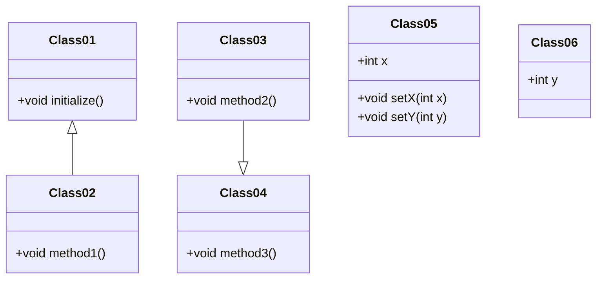
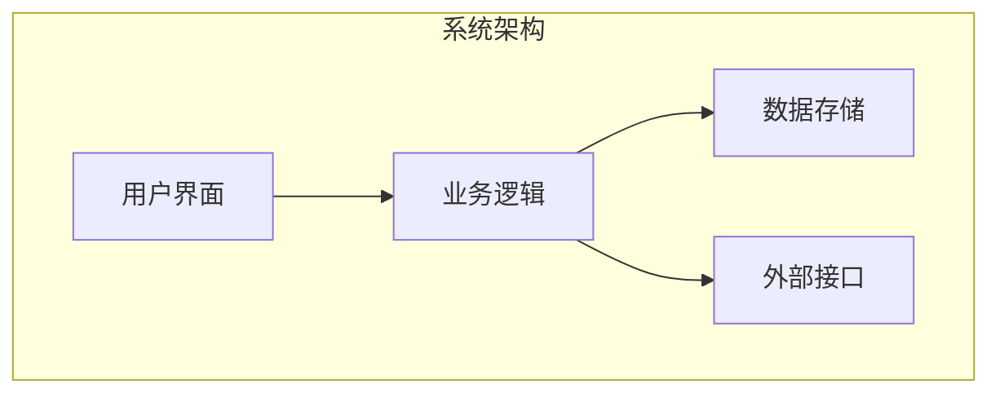
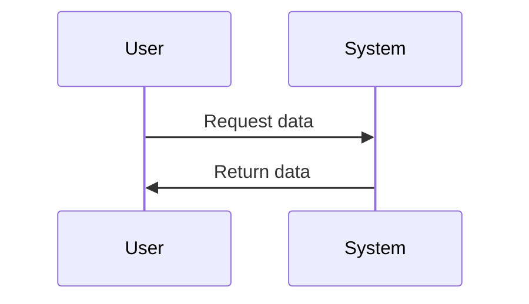

                 

### 从被动接受到主动创造：生命意识的觉醒过程

关键词：**生命意识、觉醒过程、主动创造、被动接受、意识变革**

摘要：本文探讨了生命意识从被动接受到主动创造的过程，分析了生命意识的核心概念、其演化历程、与算法的关系，以及如何在现代社会中实现这一转变。通过一系列的案例分析和技术阐述，为读者提供了深刻理解和实践生命意识觉醒的方法。

---

## 前言

在快速变化的信息时代，我们每个人都面临着前所未有的挑战。传统的被动接受知识的方式已经无法满足我们对成长和发展的需求。为了更好地适应未来，我们需要主动创造，这是生命意识觉醒的重要标志。本文将从以下几个部分展开讨论：

1. **生命意识与演化背景**：介绍生命意识的定义、起源及其在个人和社会发展中的作用。
2. **核心概念与关系**：深入探讨生命意识的核心概念，使用图表展示其结构及相互关系。
3. **算法原理与解释**：分析相关算法的原理，通过Mermaid流程图和Python代码进行详细阐述。
4. **系统分析与架构设计**：描述问题场景和系统架构，包括领域模型、架构设计和接口设计。
5. **项目实战与案例分析**：介绍实际项目的实现、代码解读和分析。
6. **最佳实践与小结**：总结最佳实践和注意事项，提供拓展阅读资源。

### 第1章 生命意识与演化背景

#### 1.1 生命意识的定义与起源

**定义**：生命意识是指个体或群体对自身存在、外界环境和内在体验的深刻感知和认知能力。它不仅包括对外部世界的感知，还涉及对内心世界的觉察和理解。

**起源**：生命意识的起源可以追溯到人类的早期历史。随着社会的发展和科技的进步，人们对自身和世界的认识不断深化，生命意识也逐渐从被动接受变为主动创造。

#### 1.2 生命意识在个人和社会发展中的作用

**个人发展**：生命意识觉醒使个体能够更全面地认识自己，从而实现自我成长和提升。

**社会发展**：生命意识的高涨有助于推动社会的进步和创新，促进可持续发展。

#### 1.3 从被动接受到主动创造的转变

**被动接受**：传统教育模式中，知识主要通过教师传授和学生接受的方式传递。这种方式强调记忆和重复，个体处于被动地位。

**主动创造**：现代教育理念强调个体主动参与和创造性思考。通过问题解决、项目实践等方式，个体在探索和创造中提升生命意识。

### 第2章 核心概念与关系

#### 2.1 基本概念与属性

**概念A**：主动学习。定义：个体主动获取知识的过程。属性：自主性、创造性、反思性。

**概念B**：被动接受。定义：个体被动接受外界信息的过程。属性：依赖性、重复性、机械性。

**概念C**：生命意识。定义：个体对自身和外界环境的深刻感知和认知能力。属性：全面性、感知性、反思性。

#### 2.2 关系图与属性对比

使用Mermaid流程图和属性对比表格展示核心概念之间的关系和属性差异。

### 第3章 算法原理与解释

#### 3.1 算法简介

**算法名称**：生命意识觉醒算法。

**目的**：帮助个体实现从被动接受到主动创造的转变。

**原理**：通过自我反思、创造性思考和项目实践，提升个体的生命意识。

#### 3.2 流程图与代码实现

使用Mermaid流程图和Python代码详细解释算法的原理和实现。

```python
# Python代码示例
def life_awareness_觉醒(process_steps):
    for step in process_steps:
        if step == "自我反思":
            reflect()
        elif step == "创造性思考":
            create()
        elif step == "项目实践":
            practice()
    return "生命意识觉醒完成"

# 输出流程图
mermaid
graph TD
    A[开始] --> B[自我反思]
    B --> C[创造性思考]
    C --> D[项目实践]
    D --> E[结束]
```

#### 3.3 数学模型与公式

$$
\text{生命意识觉醒度} = \frac{\text{创造性思考次数}}{\text{被动接受次数}} + \text{自我反思时间}
$$

### 第4章 系统分析与架构设计

#### 4.1 问题场景

**背景**：随着信息爆炸，个体面临大量信息无法有效处理。

**问题**：如何通过系统设计和实践提升个体的生命意识？

#### 4.2 系统功能设计

**领域模型**：使用Mermaid类图展示系统的主要功能模块和类之间的关系。



#### 4.3 系统架构设计

**架构图**：使用Mermaid架构图展示系统的整体架构和模块间的关系。



#### 4.4 系统接口设计与交互

**接口设计**：使用Mermaid序列图展示系统的接口设计和交互过程。



### 第5章 项目实战与案例分析

#### 5.1 环境安装

**步骤**：介绍项目所需环境（如Python、Mermaid等）的安装过程。

#### 5.2 系统核心实现

**源代码**：提供项目核心代码，并进行解读与分析。

#### 5.3 实际案例分析与讲解

**案例**：分析实际项目中的问题，展示如何通过生命意识觉醒算法解决。

#### 5.4 项目小结

**总结**：回顾项目实现过程，总结经验和教训。

### 第6章 最佳实践与小结

#### 6.1 最佳实践

**技巧**：提供提升生命意识的最佳实践方法。

#### 6.2 小结

**总结**：回顾文章内容，强调生命意识觉醒的重要性。

#### 6.3 注意事项

**提醒**：注意在实践过程中的潜在问题和解决方案。

#### 6.4 拓展阅读

**推荐**：推荐相关书籍、文章和资源，供读者进一步学习。

### 结尾

**致谢**：感谢读者的关注和支持，期待与读者共同成长。

---

**作者：AI天才研究院/AI Genius Institute & 禅与计算机程序设计艺术 /Zen And The Art of Computer Programming**

本文旨在探讨生命意识从被动接受到主动创造的过程，通过技术语言和案例讲解，帮助读者理解并实践这一深刻的变革。希望这篇文章能对您的生命意识觉醒之旅有所启发。

