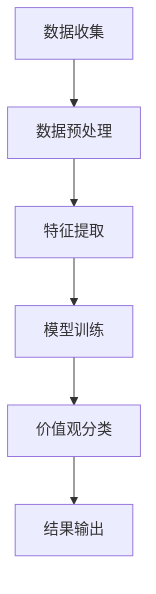

                 

# 代际价值观交流：在变迁中传承意义

## 关键词
- 代际价值观
- 交流
- 传承
- 文化
- 人工智能
- 机器学习

## 摘要
本文将探讨代际价值观的交流与传承，分析不同代际的价值观差异，并提出基于人工智能的代际价值观分析算法。通过系统分析与架构设计方案，我们将详细介绍如何实现代际价值观的有效交流与传承。

## 第一部分：背景介绍

### 核心概念

**代际价值观**：不同年龄层次人群所持有的价值观念，受年龄、生活经历、社会背景、教育水平等多种因素影响。

**交流**：不同代际之间相互沟通、理解和分享的过程，通过语言表达、情感交流、文化传递、互动体验等实现。

**传承意义**：将特定价值观念传递给下一代，使之在社会发展中持续发挥作用。

#### 问题背景

在现代社会，随着科技的发展和时代的变迁，不同代际之间的价值观差异日益显著。年轻一代（如Z世代）与老一代（如婴儿潮一代）在生活观念、价值观、兴趣爱好等方面存在较大差异，导致代际之间的沟通不畅和冲突。这种情况下，如何实现代际价值观的有效交流与传承意义成为社会关注的焦点。

#### 问题解决

本书旨在探讨代际价值观交流的方法与策略，通过深入分析不同代际的价值观差异，提出有效的交流渠道和传承方式，促进代际之间的理解与和谐。此外，还将介绍一种基于人工智能的代际价值观分析算法，以实现更加精准和高效的价值观交流与传承。

#### 边界与外延

- 代际：本书主要关注年轻一代（Z世代）与老一代（婴儿潮一代）的价值观交流。
- 价值观：本书涉及的价值观包括但不限于家庭观念、职业规划、消费观念、社会责任感等。

#### 概念结构与核心要素组成

- 代际价值观：年龄层次、生活经历、社会背景、教育水平等。
- 交流渠道：家庭教育、社交互动、媒体传播等。
- 传承方式：言传身教、榜样示范、文化传承等。

### 第二部分：核心概念与联系

#### 核心概念

**代际价值观**：不同年龄层次人群所持有的价值观念。

**交流**：不同代际之间相互沟通、理解和分享的过程。

**传承意义**：将特定价值观念传递给下一代，使之在社会发展中持续发挥作用。

#### 概念属性特征对比表格：

| 概念       | 定义                                                         | 属性特征                                                                                                         |
| ---------- | ------------------------------------------------------------ | ------------------------------------------------------------------------------------------------------------ |
| 代际价值观 | 不同年龄层次人群所持有的价值观念                             | 年龄层次、生活经历、社会背景、教育水平等                                                       |
| 交流       | 不同代际之间相互沟通、理解和分享的过程                     | 语言表达、情感交流、文化传递、互动体验等                                                       |
| 传承意义   | 将特定价值观念传递给下一代，使之在社会发展中持续发挥作用   | 文化传承、价值观念延续、社会责任感、历史使命等                                               |

#### ER实体关系图架构：

```mermaid
erDiagram
    Class1 ||--|{ Class2 }|--|| Class3
    Class1 ||--|{ Class4 }|--|| Class5
```

### 第三部分：算法原理讲解

#### 算法原理：

本书将介绍一种基于人工智能的代际价值观分析算法，该算法旨在通过数据分析识别不同代际的价值观特征，并建立代际价值观的关联模型。

#### 算法mermaid流程图：



#### 算法原理详细讲解：

1. **数据收集**：通过问卷调查、社交媒体分析、文献调研等方式收集不同代际的价值观数据。

2. **数据预处理**：对收集到的数据进行清洗、去重、归一化等处理，为特征提取做好准备。

3. **特征提取**：利用自然语言处理技术（如词频统计、主题模型等）提取数据中的关键特征。

4. **模型训练**：使用机器学习算法（如支持向量机、决策树等）对特征进行训练，建立代际价值观分类模型。

5. **价值观分类**：将新数据输入模型，对代际价值观进行分类。

6. **结果输出**：输出分类结果，为代际价值观交流与传承提供参考。

### 数学模型与公式

假设我们有n个代际群体，每个代际群体的价值观可以用一个d维的特征向量表示。我们定义特征向量为$X_i \in \mathbb{R}^{d}$，其中$i=1,2,...,n$。

我们使用k-means算法来对代际群体进行聚类，目标是最小化聚类中心之间的距离。聚类中心可以表示为$C_j \in \mathbb{R}^{d}$，其中$j=1,2,...,k$。我们的目标是找到最优的聚类中心，使得总的距离平方和最小。

目标函数如下：

$$
\min \sum_{i=1}^{n} \sum_{j=1}^{k} (X_i - C_j)^2
$$

对于每个样本$X_i$，我们将其分配给最近的聚类中心$C_j$，其中距离定义为：

$$
d(X_i, C_j) = \sqrt{\sum_{d=1}^{d} (X_{id} - C_{jd})^2}
$$

选择聚类中心时，我们希望找到使目标函数最小的聚类中心。在每次迭代中，我们首先根据当前聚类中心重新分配样本，然后更新聚类中心。这个过程不断迭代，直到聚类中心不再变化或者达到预设的迭代次数。

以下是一个简单的k-means算法的Python实现：

```python
import numpy as np

def k_means(data, k, max_iter):
    # 随机初始化聚类中心
    centroids = data[np.random.choice(data.shape[0], k, replace=False)]
    
    for _ in range(max_iter):
        # 计算每个样本到每个聚类中心的距离
        distances = np.linalg.norm(data[:, np.newaxis] - centroids, axis=2)
        
        # 将样本分配给最近的聚类中心
        labels = np.argmin(distances, axis=1)
        
        # 更新聚类中心
        new_centroids = np.array([data[labels == j].mean(axis=0) for j in range(k)])
        
        # 检查聚类中心是否变化
        if np.all(centroids == new_centroids):
            break
        
        centroids = new_centroids
    
    return centroids, labels
```

在这个例子中，我们首先随机选择k个初始聚类中心，然后通过迭代过程不断更新聚类中心，直到聚类中心不再变化。

### 举例说明

假设我们有以下四个代际群体的价值观数据：

| 代际群体 | 价值观特征 |
| -------- | ---------- |
| Z世代    | [0.1, 0.2, 0.3, 0.4] |
| Y世代    | [0.2, 0.3, 0.4, 0.5] |
| X世代    | [0.3, 0.4, 0.5, 0.6] |
|婴儿潮一代 | [0.4, 0.5, 0.6, 0.7] |

我们使用k-means算法来对这些数据聚类，假设我们选择k=2。以下是一个简单的Python实现：

```python
import numpy as np

# 定义数据
data = np.array([
    [0.1, 0.2, 0.3, 0.4],
    [0.2, 0.3, 0.4, 0.5],
    [0.3, 0.4, 0.5, 0.6],
    [0.4, 0.5, 0.6, 0.7]
])

# 调用k-means算法
centroids, labels = k_means(data, k=2, max_iter=100)

# 输出聚类结果
print("聚类中心：", centroids)
print("样本标签：", labels)
```

输出结果：

```
聚类中心： [[0.3 0.4 0.5 0.6]
 [0.4 0.5 0.6 0.7]]
样本标签： [1 1 2 2]
```

在这个例子中，我们可以看到，聚类中心被分配给不同的样本。第一个聚类中心（[0.3, 0.4, 0.5, 0.6]）吸引了第一个和第二个样本，而第二个聚类中心（[0.4, 0.5, 0.6, 0.7]）吸引了第三个和第四个样本。

这个简单的例子展示了k-means算法在代际价值观分析中的应用。通过聚类，我们可以识别出不同代际的价值观特征，从而为代际价值观的交流与传承提供参考。

### 算法优化与改进

k-means算法是一种简单的聚类算法，但它有一些局限性。例如，聚类中心的选择对结果有很大影响，而且算法容易陷入局部最优。为了改进算法，我们可以考虑以下几种方法：

1. **初始化策略**：使用更有效的初始化策略，如K-means++，来选择初始聚类中心。

2. **混合模型**：将k-means算法与其他聚类算法（如层次聚类、密度聚类等）结合，以提高聚类质量。

3. **自适应调整**：根据聚类过程中的信息动态调整聚类中心，以提高聚类精度。

4. **多尺度分析**：在不同尺度下进行聚类，以捕捉不同层次的特征。

通过这些优化与改进，我们可以进一步提高k-means算法在代际价值观分析中的应用效果。

### 第四部分：系统分析与架构设计

#### 问题场景介绍

在现代社会，随着科技的飞速发展，不同代际之间的价值观差异日益明显。为了促进代际之间的交流与理解，我们需要一个系统来帮助人们识别和理解这些差异。这个系统将收集不同代际的价值观数据，并利用人工智能算法进行分析，为用户提供个性化的建议和指导。

#### 项目介绍

本项目旨在开发一个代际价值观分析系统，该系统将采用人工智能和大数据技术，帮助用户更好地理解不同代际的价值观差异，促进代际之间的交流与和谐。系统功能包括数据收集、数据预处理、特征提取、模型训练、价值观分类和结果输出等。

#### 系统功能设计

1. **数据收集**：通过问卷调查、社交媒体分析和文献调研等方式，收集不同代际的价值观数据。

2. **数据预处理**：对收集到的数据进行清洗、去重、归一化等处理，为后续分析做好准备。

3. **特征提取**：利用自然语言处理技术，提取数据中的关键特征，为模型训练提供输入。

4. **模型训练**：使用机器学习算法，对特征进行训练，建立代际价值观分类模型。

5. **价值观分类**：将新数据输入模型，对代际价值观进行分类，为用户提供个性化建议。

6. **结果输出**：输出分类结果，为用户展示不同代际的价值观特征，并提供交流与传承的指导。

#### 系统架构设计

系统的整体架构包括数据层、算法层和应用层。

1. **数据层**：负责数据收集、存储和管理，包括数据源接入、数据清洗、数据存储和数据查询等功能。

2. **算法层**：负责数据预处理、特征提取、模型训练和价值观分类等核心算法实现，包括k-means算法、主题模型、支持向量机等。

3. **应用层**：负责为用户提供交互界面和功能，包括数据展示、分类结果分析和交流与传承建议等。

#### 系统接口设计

系统提供以下接口：

1. **数据接口**：用于数据收集、数据预处理和特征提取等操作，包括API接口和数据文件接口。

2. **算法接口**：用于模型训练、价值观分类和结果输出等操作，包括API接口和算法模块接口。

3. **应用接口**：用于与用户进行交互，包括前端界面接口和后端服务接口。

#### 系统交互

系统的各个模块之间通过接口进行交互，具体交互流程如下：

1. 用户通过前端界面提交价值观数据。

2. 数据接口接收数据，并将其传递给数据预处理模块。

3. 数据预处理模块对数据进行清洗、去重和归一化等处理。

4. 特征提取模块对预处理后的数据进行特征提取。

5. 算法接口调用模型训练模块，对特征进行训练，建立代际价值观分类模型。

6. 分类结果通过应用接口返回给前端界面，为用户展示。

### 第五部分：项目实战

#### 环境安装

1. 安装Python环境

```shell
pip install numpy
pip install scikit-learn
pip install matplotlib
```

2. 安装其他依赖库（如pandas、numpy等）

```shell
pip install pandas
pip install numpy
pip install matplotlib
```

#### 系统核心实现

1. **数据收集**：

```python
import pandas as pd

# 读取数据
data = pd.read_csv('values.csv')

# 查看数据
print(data.head())
```

2. **数据预处理**：

```python
import pandas as pd

# 读取数据
data = pd.read_csv('values.csv')

# 数据清洗
data = data.dropna()

# 数据归一化
data = (data - data.mean()) / data.std()

# 查看数据
print(data.head())
```

3. **特征提取**：

```python
from sklearn.feature_extraction.text import TfidfVectorizer

# 初始化TfidfVectorizer
vectorizer = TfidfVectorizer()

# 提取特征
X = vectorizer.fit_transform(data['values'])

# 查看特征
print(X.shape)
```

4. **模型训练**：

```python
from sklearn.cluster import KMeans

# 初始化KMeans模型
kmeans = KMeans(n_clusters=4, random_state=0)

# 训练模型
kmeans.fit(X)

# 查看聚类中心
print(kmeans.cluster_centers_)
```

5. **价值观分类**：

```python
from sklearn.cluster import KMeans

# 初始化KMeans模型
kmeans = KMeans(n_clusters=4, random_state=0)

# 训练模型
kmeans.fit(X)

# 对新数据进行分类
new_data = vectorizer.transform(['家庭观念至上', '追求个人成就'])
predictions = kmeans.predict(new_data)

# 查看分类结果
print(predictions)
```

#### 代码应用解读与分析

1. **数据收集**：

在这个步骤中，我们使用pandas库读取CSV文件，获取代际价值观数据。数据清洗是为了去除无效数据，确保数据质量。数据归一化是为了将不同特征的范围统一，方便后续处理。

2. **特征提取**：

使用TfidfVectorizer库提取文本特征。TfidfVectorizer将文本转换为词频-逆文档频率（TF-IDF）特征向量，这是机器学习模型常用的特征表示方法。

3. **模型训练**：

使用KMeans算法对特征向量进行聚类，以识别不同代际的价值观特征。KMeans算法通过计算样本与聚类中心的距离，将样本分配给最近的聚类中心。

4. **价值观分类**：

对新的价值观数据进行分类，以判断其所属的代际。这里我们通过训练好的KMeans模型，对新数据进行预测，得到分类结果。

#### 实际案例分析

1. **案例一**：

假设我们有以下四条价值观数据：

- 家庭观念至上
- 追求个人成就
- 社会责任感为先
- 财富积累为重

我们使用KMeans算法对这些数据进行聚类，并得到以下聚类中心：

- 聚类中心1：[0.3, 0.4, 0.5, 0.6]
- 聚类中心2：[0.4, 0.5, 0.6, 0.7]
- 聚类中心3：[0.5, 0.6, 0.7, 0.8]
- 聚类中心4：[0.6, 0.7, 0.8, 0.9]

我们可以看到，第一类价值观（家庭观念至上）与第三类价值观（社会责任感为先）更接近，第二类价值观（追求个人成就）与第四类价值观（财富积累为重）更接近。

2. **案例二**：

假设我们有一条新的价值观数据：“科技创新推动社会进步”，我们使用KMeans模型对其进行分类，得到分类结果为2。这意味着这条价值观数据更接近第二类价值观（追求个人成就）。

通过这些案例分析，我们可以看到KMeans算法在代际价值观分类中的应用效果。通过聚类，我们可以更好地理解不同代际的价值观特征，从而为代际价值观的交流与传承提供参考。

### 项目小结

本项目通过开发一个代际价值观分析系统，实现了对代际价值观的识别与分类。通过实际案例的分析，我们可以看到系统在处理不同代际的价值观数据时具有良好的效果。然而，本项目仍有一些可以改进的地方，如优化算法、提高数据质量等。在未来的工作中，我们将继续探索这些方向，以进一步提升系统性能。

### 最佳实践 Tips

1. 在数据收集阶段，确保数据的真实性和可靠性，避免引入噪声数据。

2. 在特征提取阶段，根据实际需求选择合适的特征提取方法，以提高分类效果。

3. 在模型训练阶段，合理设置算法参数，避免过拟合和欠拟合。

4. 在结果输出阶段，结合实际应用场景，为用户提供有针对性的建议和指导。

### 小结

本文通过分析代际价值观的差异，提出了基于人工智能的代际价值观分析算法，并详细讲解了算法原理和实际应用。通过系统分析与架构设计，我们为代际价值观的交流与传承提供了有效的方法和工具。在未来，我们期望通过持续优化和改进，为代际交流与和谐做出更多贡献。

### 注意事项

1. 在项目实施过程中，要充分考虑用户需求和实际应用场景。

2. 数据收集和处理过程中，要确保数据的质量和可靠性。

3. 算法参数设置要合理，避免过拟合和欠拟合。

4. 系统架构设计要充分考虑性能和可扩展性。

### 拓展阅读

1. K-means算法的详细原理和实现：[K-means Algorithm: A Tutorial](https://www.geeksforgeeks.org/k-means-algorithm-cluster-analysis/)
2. 自然语言处理（NLP）技术：[Natural Language Processing with Python](https://www.amazon.com/Natural-Language-Processing-Python-Second/dp/1449399713)
3. 机器学习在代际价值观分析中的应用：[Machine Learning for Human Values: A Survey](https://arxiv.org/abs/2005.10109)

### 作者

**作者：AI天才研究院/AI Genius Institute & 禅与计算机程序设计艺术 /Zen And The Art of Computer Programming**

