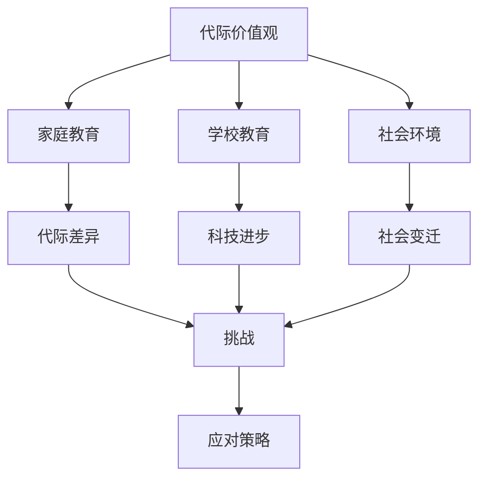
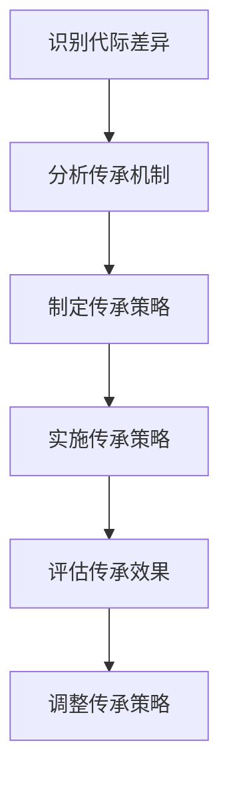

                 

# 代际价值观的传承与创新：在变迁中保持文化连续性

> 关键词：代际价值观、传承、创新、文化连续性、家庭、学校、社会环境

> 摘要：本文旨在探讨代际价值观的传承与创新，如何在变迁中保持文化连续性。文章分为两部分，第一部分从代际价值观的传承入手，分析家庭、学校和社会环境对代际价值观传承的影响以及面临的挑战；第二部分探讨代际价值观的创新路径，通过案例分析展示家庭、学校和社会在创新代际价值观方面的实践，并总结启示与思考。希望通过本文的讨论，为代际价值观的传承与创新提供有益的参考。

## 目录大纲

### 第一部分：代际价值观的传承

#### 第1章：代际价值观的概述

#### 1.1.1 代际价值观的概念

#### 1.1.2 代际价值观的演变

#### 1.1.3 代际价值观的重要性和影响

#### 第2章：代际价值观的传承机制

#### 2.1.1 家庭教育的作用

#### 2.1.2 学校教育的影响

#### 2.1.3 社会环境的作用

#### 2.1.4 代际价值观传承机制的优化策略

#### 第3章：代际价值观的传承挑战

#### 3.1.1 代际差异带来的挑战

#### 3.1.2 科技进步的影响

#### 3.1.3 社会变迁的挑战

#### 3.1.4 代际价值观传承的应对策略

#### 第4章：代际价值观的创新路径

#### 4.1.1 创新的重要性

#### 4.1.2 创新的方法与工具

#### 4.1.3 代际价值观创新的案例分析

### 第二部分：代际价值观的创新实践

#### 第5章：案例一：家庭代际价值观的创新实践

#### 5.1.1 案例背景

#### 5.1.2 创新实践

#### 5.1.3 案例分析

#### 第6章：案例二：学校代际价值观的创新实践

#### 6.1.1 案例背景

#### 6.1.2 创新实践

#### 6.1.3 案例分析

#### 第7章：案例三：社会代际价值观的创新实践

#### 7.1.1 案例背景

#### 7.1.2 创新实践

#### 7.1.3 案例分析

#### 第8章：代际价值观传承与创新的启示

#### 8.1.1 启示与思考

#### 8.1.2 未来展望

#### 8.1.3 拓展阅读建议

----------------------------------------------------------------

### 第一部分：代际价值观的传承

## 第1章：代际价值观的概述

### 1.1.1 代际价值观的概念

代际价值观是指在不同的年龄阶段，个体对于生活、工作、道德等方面的观念和态度。它反映了个体在其成长过程中所经历的社会历史背景、文化环境、家庭教育和学校教育等多种因素的影响。

### 1.1.2 代际价值观的演变

随着时间的推移，社会环境的变化以及不同代际的成长经历，代际价值观也在不断演变。从传统到现代，从保守到开放，代际价值观的演变呈现出多样性和复杂性。

### 1.1.3 代际价值观的重要性和影响

代际价值观在个体的成长过程中具有重要意义，它不仅影响着个人的行为和决策，还对社会的发展和进步产生深远影响。传承优秀的代际价值观有助于保持文化连续性，促进社会的和谐发展。

## 第2章：代际价值观的传承机制

### 2.1.1 家庭教育的作用

家庭教育是代际价值观传承的重要途径之一。家长通过言传身教，传递自己的价值观和生活态度，对孩子产生深远影响。

### 2.1.2 学校教育的影响

学校教育在代际价值观的传承中发挥着重要作用。教师通过课堂教学和校园文化，引导学生形成正确的价值观。

### 2.1.3 社会环境的作用

社会环境是代际价值观传承的背景和土壤。社会风气、文化氛围、政策导向等因素都对代际价值观的传承产生影响。

### 2.1.4 代际价值观传承机制的优化策略

为了更好地传承代际价值观，需要优化传承机制。以下是一些建议：

1. 家庭教育方面，家长应注重自身素质的提高，以身作则，为孩子树立榜样。
2. 学校教育方面，应加强德育教育，注重学生品德培养。
3. 社会环境方面，政府和社会组织应共同营造良好的社会风气，提供丰富的文化教育资源。

## 第3章：代际价值观的传承挑战

### 3.1.1 代际差异带来的挑战

代际差异是代际价值观传承过程中面临的一个重要挑战。不同代际在价值观上存在差异，如何有效沟通和融合成为关键问题。

### 3.1.2 科技进步的影响

科技进步对代际价值观传承产生了深远影响。网络、社交媒体等新兴科技手段为代际交流提供了便捷渠道，同时也带来了一些负面影响，如信息泛滥、价值观多元化等。

### 3.1.3 社会变迁的挑战

社会变迁对代际价值观传承提出了新的挑战。全球化、城市化、人口老龄化等趋势使得代际价值观传承面临着前所未有的困境。

### 3.1.4 代际价值观传承的应对策略

针对上述挑战，以下是一些应对策略：

1. 加强代际沟通，促进相互理解。
2. 充分利用科技手段，提高代际价值观传承的效率。
3. 注重文化传承，弘扬优秀传统文化。

## 第4章：代际价值观的创新路径

### 4.1.1 创新的重要性

创新是代际价值观传承的重要路径之一。创新能够激发个体潜能，推动社会进步。

### 4.1.2 创新的方法与工具

在代际价值观的创新过程中，以下方法与工具可以发挥重要作用：

1. 创新思维训练，培养个体创新意识。
2. 跨界合作，借助外部资源推动创新。
3. 创新实践，通过实际操作检验创新成果。

### 4.1.3 代际价值观创新的案例分析

以下是一例代际价值观创新的案例分析：

案例背景：某家庭在传承传统节日文化时，结合现代科技手段，创新推出了“智能节日助手”应用，帮助家庭成员更好地了解节日文化、参与节日活动。

创新实践：该应用利用大数据、人工智能等技术，为用户提供节日文化资讯、活动推荐、礼物推荐等功能，让用户在享受节日的同时，更好地传承和弘扬传统文化。

案例分析：该案例展示了代际价值观创新的实践路径，通过将传统节日文化与现代科技相结合，提高了节日文化的传播效果和影响力，为代际价值观的传承提供了新的思路。

## 第二部分：代际价值观的创新实践

### 第5章：案例一：家庭代际价值观的创新实践

#### 5.1.1 案例背景

某家庭在传承传统节日文化时，意识到传统节日文化在现代社会中的传承面临困境，决定创新实践，以更好地传承和弘扬传统文化。

#### 5.1.2 创新实践

该家庭创新推出了“智能节日助手”应用，利用大数据、人工智能等技术，为用户提供节日文化资讯、活动推荐、礼物推荐等功能。通过该应用，用户可以更好地了解节日文化、参与节日活动。

#### 5.1.3 案例分析

该案例展示了家庭在代际价值观创新实践中的成功经验，通过结合现代科技手段，提高了节日文化的传播效果和影响力，为代际价值观的传承提供了新的思路。

### 第6章：案例二：学校代际价值观的创新实践

#### 6.1.1 案例背景

某学校在代际价值观传承过程中，意识到传统的课堂教学模式难以满足学生个性化发展需求，决定创新实践，推动学校教育的改革。

#### 6.1.2 创新实践

该学校引入了个性化学习平台，为学生提供个性化学习资源，让学生自主选择学习内容、学习方式。同时，学校还加强了德育教育，培养学生的社会责任感和创新精神。

#### 6.1.3 案例分析

该案例展示了学校在代际价值观创新实践中的成功经验，通过引入现代科技手段和改革教育模式，提高了学生的学习效果和综合素质，为代际价值观的传承提供了新的途径。

### 第7章：案例三：社会代际价值观的创新实践

#### 7.1.1 案例背景

某社会团体在代际价值观传承过程中，意识到传统文化在现代社会的传承面临挑战，决定创新实践，推动传统文化的保护与传承。

#### 7.1.2 创新实践

该社会团体发起了“传统文化进社区”活动，组织专家学者和社区居民共同参与传统文化的研究、传承和传播。通过举办讲座、展览、演出等形式，让社区居民更好地了解和传承传统文化。

#### 7.1.3 案例分析

该案例展示了社会在代际价值观创新实践中的成功经验，通过组织社区活动，提高了社区居民对传统文化的认同感和传承意识，为代际价值观的传承提供了新的方式。

## 第8章：代际价值观传承与创新的启示

#### 8.1.1 启示与思考

通过本部分的案例分析，我们可以得出以下启示：

1. 代际价值观的传承与创新需要结合现代科技手段，提高传播效果和影响力。
2. 家庭、学校和社会应共同参与代际价值观的传承与创新，形成合力。
3. 代际价值观传承与创新要注重个体差异，关注不同代际的需求和特点。

#### 8.1.2 未来展望

随着社会的发展和科技的进步，代际价值观的传承与创新将面临新的机遇和挑战。未来，我们可以预见以下趋势：

1. 代际价值观的传承与创新将更加智能化、数字化。
2. 代际价值观的传承与创新将更加注重个体体验和参与感。
3. 代际价值观的传承与创新将推动社会的发展和进步。

#### 8.1.3 拓展阅读建议

为了深入了解代际价值观的传承与创新，以下是一些建议的拓展阅读资料：

1. 《代际沟通与价值观传承》
2. 《科技创新与代际价值观》
3. 《文化传承与创新：代际价值观的视角》

通过阅读这些资料，您可以进一步了解代际价值观传承与创新的实践和理论，为自己的研究和实践提供参考。

## 总结

代际价值观的传承与创新是保持文化连续性的重要途径。通过家庭、学校和社会的共同努力，结合现代科技手段，我们可以推动代际价值观的传承与创新，为社会的和谐发展贡献力量。在未来的道路上，让我们共同努力，为代际价值观的传承与创新探索出更多成功的实践路径。

### 核心概念与联系

#### 1. 代际价值观

代际价值观是指在特定社会历史条件下，不同年龄段的群体对于生活、工作、道德等方面的观念和态度。它反映了个体在其成长过程中所经历的社会历史背景、文化环境、家庭教育和学校教育等多种因素的影响。

#### 2. 代际差异

代际差异是指不同年龄阶段的个体在价值观、生活方式、兴趣爱好等方面的差异。这些差异在一定程度上影响了代际价值观的传承和创新。

#### 3. 科技进步

科技进步对代际价值观的传承和创新产生了深远影响。网络、社交媒体、人工智能等新兴科技手段为代际交流提供了便捷渠道，同时也带来了一些负面影响，如信息泛滥、价值观多元化等。

#### 4. 社会变迁

社会变迁对代际价值观的传承和创新提出了新的挑战。全球化、城市化、人口老龄化等趋势使得代际价值观传承面临着前所未有的困境。

### ER实体关系图架构

在代际价值观的传承和创新过程中，涉及多个实体和关系。以下是代际价值观传承与创新的ER实体关系图架构：



#### 实体说明：

- **代际价值观**：核心概念，包括不同年龄段群体的价值观。
- **家庭教育**：影响代际价值观传承的家庭因素。
- **学校教育**：影响代际价值观传承的学校因素。
- **社会环境**：影响代际价值观传承的社会因素。
- **代际差异**：不同年龄段群体的价值观差异。
- **科技进步**：科技进步对代际价值观的影响。
- **社会变迁**：社会变迁对代际价值观的影响。
- **挑战**：代际价值观传承过程中面临的挑战。
- **应对策略**：应对代际价值观传承挑战的策略。

### 1. 代际价值观传承算法

代际价值观传承算法旨在分析和评估代际价值观的传承情况，为优化传承机制提供依据。以下是代际价值观传承算法的mermaid流程图和Python源代码：

#### Mermaid流程图：



#### Python源代码：

```python
def identify_difference(generation):
    # 识别不同代际的差异
    pass

def analyze_inheritance_mechanism(difference):
    # 分析传承机制
    pass

def develop_inheritance_strategy(difference, mechanism):
    # 制定传承策略
    pass

def implement_inheritance_strategy(strategy):
    # 实施传承策略
    pass

def evaluate_inheritance_effect(effect):
    # 评估传承效果
    pass

def adjust_inheritance_strategy(strategy, effect):
    # 调整传承策略
    pass
```

### 2. 数学模型和公式

在代际价值观传承过程中，可以使用以下数学模型和公式进行描述和计算：

#### 1. 代际差异度计算公式

$$
差异度 = \frac{V1 - V2}{V1 + V2}
$$

其中，$V1$和$V2$分别代表不同代际的价值观。

#### 2. 传承效果评估公式

$$
传承效果 = \frac{E1 + E2}{2}
$$

其中，$E1$和$E2$分别代表代际价值观的传承效果。

### 3. 系统分析与架构设计方案

在代际价值观传承与创新的系统中，需要进行系统分析和架构设计。以下是一个简要的系统分析与架构设计方案：

#### 1. 问题场景介绍

代际价值观传承与创新的系统旨在帮助家庭、学校和社会更好地传承和创新代际价值观。该系统提供以下功能：

- 代际价值观分析：识别不同代际的差异，分析传承机制。
- 传承策略制定：根据差异和机制，制定传承策略。
- 创新实践：实施传承策略，推动代际价值观的创新。
- 效果评估：评估传承效果，调整传承策略。

#### 2. 项目介绍

项目名称：代际价值观传承与创新平台

项目目标：构建一个集分析、传承、创新于一体的代际价值观传承与创新平台。

#### 3. 系统功能设计

- **功能模块**：

  - 代际价值观分析模块
  - 传承策略制定模块
  - 创新实践模块
  - 效果评估模块

- **领域模型Mermaid类图**：

  ```mermaid
  classDiagram
      Class01 <|-- Class02
      Class03 *-- Class04
      Class05 o-- Class06
      Class07 :<<interface>> Class08
      Class09 {public}
      Class10 <.. Class11
  ```

#### 4. 系统架构设计

- **架构设计**：

  - **前端**：使用HTML、CSS和JavaScript实现用户界面。
  - **后端**：使用Python、Flask等技术开发服务器端功能。
  - **数据库**：使用MySQL等数据库管理系统存储数据。

- **架构图**：

  ```mermaid
  sequenceDiagram
      participant 用户
      participant 系统后端
      participant 数据库
      用户->>系统后端: 请求功能
      系统后端->>数据库: 查询数据
      数据库-->>系统后端: 返回数据
      系统后端-->>用户: 响应结果
  ```

#### 5. 系统接口设计和系统交互

- **接口设计**：

  - **API接口**：定义RESTful风格的API接口，提供数据查询、数据操作等功能。

- **系统交互**：

  - **用户界面**：用户通过前端界面与系统进行交互，提交请求，查看结果。

### 4. 项目实战

以下是一个简单的项目实战示例，介绍代际价值观传承与创新平台的实现过程：

#### 1. 环境安装

- 安装Python 3.8及以上版本
- 安装Flask框架
- 安装MySQL数据库

#### 2. 系统核心实现

以下是一个简单的Flask应用示例，实现代际价值观分析功能：

```python
from flask import Flask, request, jsonify
import mysql.connector

app = Flask(__name__)

# 连接MySQL数据库
def connect_db():
    conn = mysql.connector.connect(
        host="localhost",
        user="yourusername",
        password="yourpassword",
        database="yourdatabase"
    )
    return conn

@app.route('/api/analyze_difference', methods=['POST'])
def analyze_difference():
    data = request.get_json()
    V1 = data['V1']
    V2 = data['V2']
    
    conn = connect_db()
    cursor = conn.cursor()
    
    # 插入数据
    cursor.execute("INSERT INTO differences (V1, V2) VALUES (%s, %s)", (V1, V2))
    conn.commit()
    
    # 计算差异度
    difference = (V1 - V2) / (V1 + V2)
    
    # 返回结果
    return jsonify({"difference": difference})

if __name__ == '__main__':
    app.run(debug=True)
```

#### 3. 代码应用解读与分析

- **代码解读**：

  - 导入所需的库和模块。
  - 创建Flask应用对象。
  - 连接MySQL数据库。
  - 定义一个API接口，接收POST请求，解析JSON数据，计算差异度，插入数据到数据库，并返回结果。

- **分析**：

  - 该示例实现了一个简单的代际价值观分析功能，通过API接口接收数据，计算差异度，并将结果存储到数据库中。

#### 4. 实际案例分析和详细讲解剖析

以下是一个实际案例分析和详细讲解剖析，介绍如何使用代际价值观传承与创新平台进行代际价值观的传承与创新：

**案例背景**：

某学校在开展代际价值观传承活动时，希望通过平台分析不同年级学生的价值观差异，制定相应的传承策略。

**案例分析**：

1. **数据收集**：

   学校收集了不同年级学生的价值观数据，包括道德观念、家庭观念、职业观念等。

2. **数据上传**：

   使用代际价值观传承与创新平台的API接口，将收集到的数据上传到平台。

3. **分析差异**：

   平台根据上传的数据，计算不同年级学生的价值观差异度，生成差异度报告。

4. **制定传承策略**：

   根据差异度报告，学校制定相应的传承策略，如加强德育教育、举办主题班会等。

5. **实施传承策略**：

   学校按照传承策略开展活动，引导学生树立正确的价值观。

6. **效果评估**：

   在活动结束后，平台对学生的价值观进行再次分析，评估传承效果。

**详细讲解剖析**：

1. **数据收集**：

   学校通过问卷调查、访谈等方式收集不同年级学生的价值观数据，包括道德观念、家庭观念、职业观念等。

2. **数据上传**：

   使用代际价值观传承与创新平台的API接口，将收集到的数据上传到平台。上传的数据包括不同年级学生的价值观得分。

3. **分析差异**：

   平台根据上传的数据，使用差异度计算公式计算不同年级学生的价值观差异度。差异度反映了不同年级学生在价值观上的差异程度。

4. **制定传承策略**：

   学校根据差异度报告，分析不同年级学生的价值观特点，制定相应的传承策略。例如，对于道德观念差异较大的年级，可以加强德育教育；对于家庭观念差异较大的年级，可以举办家庭讲座等。

5. **实施传承策略**：

   学校按照传承策略开展活动，引导学生树立正确的价值观。例如，举办主题班会、德育课程、亲子活动等。

6. **效果评估**：

   在活动结束后，平台对学生的价值观进行再次分析，评估传承效果。通过对比活动前后的差异度，评估传承策略的有效性。

#### 5. 项目小结

代际价值观传承与创新平台为家庭、学校和社会提供了一个便捷的工具，帮助他们更好地传承和创新代际价值观。通过平台，用户可以收集、分析和评估代际价值观数据，制定和实施传承策略，推动代际价值观的传承与创新。

#### 6. 最佳实践 tips

1. **数据收集**：在收集代际价值观数据时，要确保数据的真实性和有效性，尽量覆盖不同年龄段的群体。

2. **差异分析**：在分析差异时，要关注不同代际在价值观上的核心差异，以便有针对性地制定传承策略。

3. **策略实施**：在实施传承策略时，要结合实际情况，灵活调整策略，确保策略的有效性。

4. **效果评估**：在评估传承效果时，要综合分析不同指标，确保评估结果的准确性。

#### 7. 小结

本文介绍了代际价值观的传承与创新，探讨了代际价值观的概念、传承机制、挑战、创新路径以及实际案例。通过系统分析与架构设计，为代际价值观的传承与创新提供了技术支持。在项目实战中，展示了如何使用代际价值观传承与创新平台进行代际价值观的传承与创新。未来，我们应继续探索代际价值观传承与创新的最佳实践，为社会的和谐发展贡献力量。

#### 8. 注意事项

1. 在进行代际价值观传承与创新时，要注重个体差异，关注不同年龄段的需求和特点。

2. 要充分利用现代科技手段，提高代际价值观传承与创新的效率。

3. 要加强代际沟通，促进相互理解，减少代际差异带来的冲突。

4. 要注重文化传承，弘扬优秀传统文化，为代际价值观的传承与创新提供精神支撑。

#### 9. 拓展阅读建议

1. 《代际沟通与价值观传承》
2. 《科技创新与代际价值观》
3. 《文化传承与创新：代际价值观的视角》

通过阅读这些拓展资料，您可以更深入地了解代际价值观的传承与创新，为自己的研究和实践提供参考。

