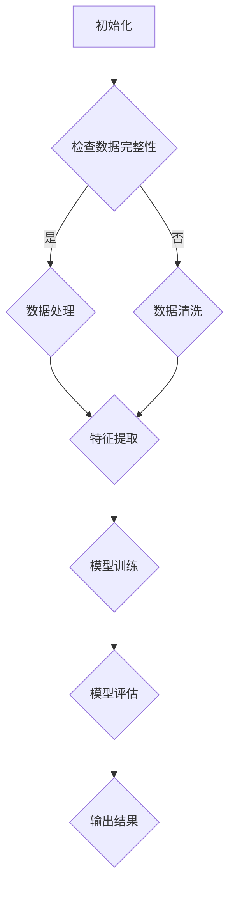
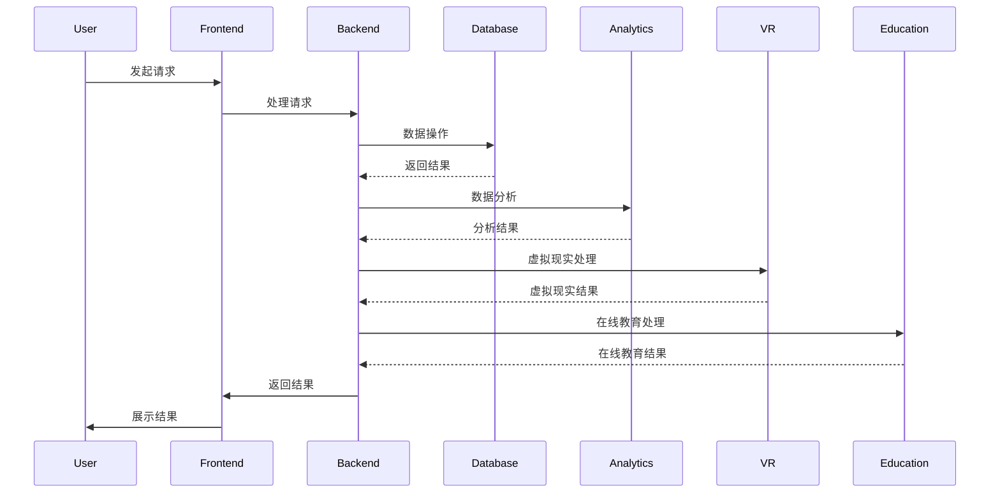
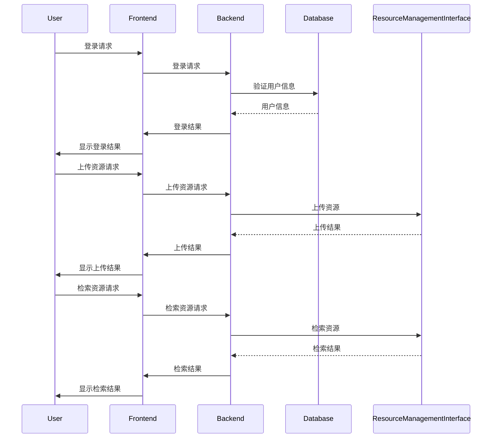

                 

### 摘要

《代际价值观的传承与创新：文化连续性的维护》旨在深入探讨在信息化时代，如何在确保文化连续性的同时实现代际价值观的传承与创新。本文从背景介绍、核心概念与联系、算法原理与系统设计以及项目实战四个方面进行了系统的分析和论述。首先，通过对代际价值观和文化连续性的定义与特征，分析了当前传承与创新的现状及挑战。接着，通过阐述核心概念的构成要素和维护策略，揭示了传承与创新的辩证关系。随后，本文详细讲解了算法原理，包括mermaid流程图、Python源代码、数学模型及公式，并通过实例进行了通俗易懂的说明。系统分析与架构设计部分，通过问题场景介绍、项目介绍、功能设计、架构设计、接口设计及系统交互，展示了系统的整体设计思路。在项目实战环节，详细介绍了环境安装、系统核心实现、代码应用解读与分析，并结合实际案例进行了深入剖析。最后，通过最佳实践与总结，提出了未来展望和研究方向。本文的核心观点在于，代际价值观的传承与创新不仅是文化连续性的维护手段，更是推动社会进步的重要动力。

## 第1章 问题背景

### 1.1 核心概念介绍

#### 1.1.1 代际价值观的定义与特征

代际价值观是指在不同历史时期和社会环境中，某一特定群体的共同信仰、价值取向和行为规范。它是一个群体在长期发展过程中，通过教育、文化传承和社会实践所形成的具有相对稳定性和普遍性的价值体系。代际价值观的特征主要体现在以下几个方面：

1. **历史性**：代际价值观是在特定历史时期形成的，反映了当时的社会经济基础和生产力水平。例如，古代农业社会的价值观与现代工业社会的价值观存在显著差异。
2. **稳定性**：代际价值观具有一定的稳定性，不易受到短期社会变动的影响。然而，随着时代的发展，代际价值观也会在保持核心特征的基础上进行适度调整。
3. **普遍性**：代际价值观是某一群体普遍认同的，反映了该群体的共同利益和目标。例如，在家庭中，孝顺、尊老爱幼等价值观普遍存在。
4. **继承性**：代际价值观具有继承性，即上一代的价值观念会通过教育和社会化过程传递给下一代。这种传递不仅是文化上的，还包括行为规范和生活方式。

#### 1.1.2 文化连续性的内涵与意义

文化连续性是指文化传统在代际间的持续性和传承性。它是文化发展的重要基础，也是社会稳定和进步的重要保障。文化连续性的内涵包括以下几个方面：

1. **传承性**：文化连续性强调文化传统的传递，即通过教育、艺术、文学等形式，将历史经验、文化知识和社会规范传递给下一代。
2. **动态性**：文化连续性并不是静态的，而是在继承传统的基础上不断进行创新和发展。这种动态性使文化能够适应时代的变化，保持其生命力和活力。
3. **普遍性**：文化连续性不仅仅局限于某一特定地区或群体，而是具有普遍性。不同文化之间可以相互借鉴和融合，共同促进人类文明的发展。

文化连续性的意义主要体现在以下几个方面：

1. **社会稳定**：文化连续性有助于维护社会的稳定和秩序。通过共同的文化认同和价值体系，不同群体之间能够和谐共处，减少社会矛盾和冲突。
2. **文化繁荣**：文化连续性是文化繁荣的重要基础。只有保持文化的连续性，才能不断积累和丰富文化成果，推动文化创新和繁荣。
3. **个体认同**：文化连续性有助于个体认同感的形成。通过传承和认同自己的文化，个体能够找到归属感和自我价值感。

#### 1.1.3 传承与创新的辩证关系

传承与创新是文化发展过程中的两个重要方面，它们之间存在着辩证关系：

1. **传承是创新的基石**：任何创新都建立在传承的基础上。只有对传统文化有深刻的理解和认同，才能进行有效的创新。例如，现代科技的发展离不开对古代科学知识的继承和发展。
2. **创新是传承的动力**：传承并不是一成不变的，而是在不断进行创新的过程中实现的。创新可以带来新的视角和方法，使文化传统焕发新的生机和活力。例如，现代艺术的创新不仅继承了传统的绘画技巧，还融入了新的表现手法和观念。
3. **传承与创新相互促进**：传承和创新不是对立的，而是相互促进的。在传承过程中，通过创新可以更好地保护和传承文化；在创新过程中，通过传承可以保持文化的连续性和稳定性。

#### 1.2 问题描述

##### 1.2.1 代际价值观传承的现状

当前，代际价值观的传承面临着一系列挑战和问题。首先，随着社会的发展和现代化进程的加快，传统价值观受到冲击，一些传统文化逐渐消失或被边缘化。例如，传统的家庭观念、尊老爱幼等价值观在现代社会中受到挑战，年轻一代对家庭责任和传统礼仪的认知和践行程度逐渐减弱。

其次，信息化和全球化使得文化的多样性和流动性增加，不同文化之间的交流与融合日益频繁。虽然这种交流有利于文化的繁荣和发展，但也可能导致文化的同质化和单一化，削弱了代际价值观的独特性和多样性。

此外，教育体系的改革和现代化也带来了一定的挑战。传统的教育模式强调知识传授和技能培养，对文化传承的关注较少。在新课程改革中，尽管有意识地加强了对传统文化的教育，但实际效果仍有待提高。

##### 1.2.2 文化连续性面临的挑战

文化连续性同样面临着诸多挑战。首先，社会结构的变迁和人口流动的加剧，使得传统社区和文化传承的载体逐渐弱化。农村人口向城市迁移，传统手艺和文化习俗逐渐消失，社区文化的多样性和丰富性受到严重影响。

其次，现代生活方式的快速变化，如网络、娱乐、消费等，对传统生活方式和价值观产生了冲击。年轻一代更多地沉浸在虚拟世界和现代科技中，对传统文化的兴趣和认同感减弱。

此外，信息技术的飞速发展，特别是互联网和数字媒体的普及，使信息的传播方式发生了根本性的变革。虽然这有助于文化的传播和交流，但也可能导致文化的碎片化和浅层化，影响文化的深度和内涵。

##### 1.2.3 传承与创新之间的矛盾

传承与创新之间的矛盾是文化发展中的一个核心问题。一方面，传承强调对传统文化的保护和继承，反对任何形式的颠覆和破坏。另一方面，创新强调突破和变革，追求新的思路和方法，有时会与传统价值观发生冲突。

这种矛盾在现代社会尤为突出。现代化进程中的快速发展和技术创新，使得传统文化面临前所未有的挑战。一方面，传统价值观难以适应现代社会的需求，显得陈旧和保守；另一方面，创新往往被误解为对传统的否定，导致对创新的抵制和排斥。

解决传承与创新之间的矛盾，需要从以下几个方面入手：

1. **平衡传承与创新**：既要保持传统文化的核心价值和精髓，又要进行适度的创新，使之适应现代社会的发展需求。例如，可以在传承过程中融入现代元素，使传统文化更具吸引力和时代感。
2. **增强文化自觉**：通过教育和宣传，提高公众对传统文化和现代文化的认同感和理解力，减少误解和冲突。
3. **创新传承方式**：利用现代科技手段，如互联网、多媒体等，创造新的文化传承方式和途径，使传统文化能够更有效地传播和传承。

#### 1.3 问题解决

##### 1.3.1 目标与原则

为了解决代际价值观传承和文化连续性维护中的问题，我们需要明确以下目标和原则：

**目标：**
1. 保护和传承传统文化，增强文化认同感和自豪感。
2. 促进文化创新，使传统文化在现代社会中焕发新的生机和活力。
3. 建立健全的文化传承和创新体系，为文化连续性提供制度保障。

**原则：**
1. **尊重传统**：在传承和创新过程中，尊重传统文化的核心价值和精髓，避免盲目颠覆和破坏。
2. **与时俱进**：适应现代社会的发展需求，对传统文化进行适度的创新和调整，使之更具时代感和吸引力。
3. **全民参与**：鼓励全社会参与文化传承和创新，形成广泛的文化自觉和参与意识。
4. **可持续发展**：在传承和创新过程中，注重可持续性和长期发展，确保文化的连续性和生命力。

##### 1.3.2 解决方案的可行性分析

为实现上述目标和原则，我们可以采取以下具体解决方案：

1. **教育体系的改革**：通过教育体系的改革，将传统文化课程纳入必修课程，提高学生对传统文化的认知和理解。同时，利用现代教育技术，如在线教育、多媒体教学等，创造更生动、有趣的教育方式，增强学生的学习兴趣和参与度。

2. **社区文化的建设**：加强社区文化建设，鼓励社区居民参与传统文化的保护和传承。通过举办文化讲座、展览、演出等活动，提高公众对传统文化的兴趣和认同感。同时，鼓励社区内的文化交流和互动，促进文化的多样性和繁荣。

3. **政策支持和引导**：政府应加强对文化传承和创新的政策支持和引导。例如，设立专项基金，支持文化传承和创新项目的实施；制定相关法律法规，保护传统文化遗产和知识产权；鼓励企业和社会力量参与文化传承和创新事业。

4. **数字化传承**：利用现代科技手段，如数字博物馆、虚拟现实等，将传统文化数字化，实现文化的永久保存和传播。通过互联网和社交媒体，扩大传统文化的传播范围和影响力，使更多人能够接触和了解传统文化。

##### 1.3.3 解决方案的优势与局限

**优势：**
1. **文化认同感增强**：通过教育体系和社区文化的建设，可以增强公众对传统文化的认同感和自豪感，促进文化的传承和发展。
2. **创新动力激发**：政策支持和数字化传承等措施，可以激发文化创新动力，使传统文化在现代社会中焕发新的生机和活力。
3. **可持续性保障**：建立健全的文化传承和创新体系，可以确保文化的连续性和生命力，实现文化的可持续发展。

**局限：**
1. **执行难度大**：文化传承和创新是一个长期而复杂的过程，涉及多个领域和层面，需要多方协同合作，执行难度较大。
2. **资源限制**：文化传承和创新需要大量的人力、物力和财力投入，尤其是数字化传承需要较高的技术支持，可能面临资源限制。
3. **社会接受度**：部分公众可能对传统文化传承和创新的方式和内容持保守态度，需要提高社会接受度和参与度。

##### 1.4 边界与外延

**传承范围与对象的界定**

传承的范围和对象应明确界定，以确保文化传承的针对性和有效性。具体包括：

1. **地域文化**：重点传承和保护具有地域特色和独特价值的文化遗产，如地方戏曲、民俗节庆、传统手工艺等。
2. **历史文化**：重点传承和保护历史悠久的传统文化遗产，如古代文献、经典著作、历史建筑等。
3. **民族文化**：重点传承和保护各民族独特的文化传统，如少数民族语言、宗教信仰、民族节庆等。

**创新的空间与限制**

创新的空间和限制主要涉及以下几个方面：

1. **内容创新**：在传承过程中，可以融合现代元素和科技手段，创造新的文化形式和表达方式，如现代艺术、数字文化等。
2. **形式创新**：通过改变传统文化传承的形式和方式，如利用互联网、社交媒体等新兴媒体平台，扩大文化的传播范围和影响力。
3. **技术限制**：数字化传承需要较高的技术支持，可能面临技术瓶颈和资源限制，需要持续的技术创新和优化。

**文化连续性的维护标准**

文化连续性的维护标准应包括以下几个方面：

1. **真实性**：传承的文化内容应保持其历史真实性和文化内涵，避免虚构和歪曲。
2. **完整性**：传承过程中应保持文化传统的完整性，避免割裂和碎片化。
3. **时代性**：在传承过程中，应结合时代背景和社会发展需求，进行适度的创新和调整，使文化更具时代感和生命力。
4. **可持续性**：在传承和创新过程中，应注重资源的合理利用和保护，确保文化的可持续发展。

##### 1.5 本章小结

本章通过对代际价值观和文化连续性的核心概念介绍，分析了当前传承与创新的现状及挑战，提出了具体的解决方案和原则。明确了传承范围与对象、创新空间与限制以及文化连续性的维护标准，为后续章节的内容提供了基础和指导。在接下来的章节中，将进一步探讨核心概念的构成要素和维护策略，深入分析传承与创新的关系，为文化连续性的实现提供更加具体的路径和方法。

### 第2章 核心概念原理

#### 2.1 代际价值观的构成要素

代际价值观是一个复杂且多维的概念，它不仅反映了历史和文化的积淀，还涉及社会、经济和个人的多层次因素。要深入理解代际价值观，我们需要从其构成要素入手。

**历史背景与文化传统**

代际价值观的形成离不开特定的历史背景和文化传统。历史背景提供了价值观产生的土壤和条件，而文化传统则是价值观的传承载体。例如，中国的儒家文化源远流长，其“仁、义、礼、智、信”的核心价值观深深植根于中国人的代际传承中。这些价值观不仅影响了社会结构，还塑造了个体行为和社会规范。

**社会制度与价值体系**

社会制度是代际价值观的重要基础。在一个特定的社会制度下，人们的行为规范和价值取向往往受到制度框架的制约和引导。例如，在封建社会中，等级制度和家庭结构对代际价值观产生了深远影响，尊卑有别、家族传承成为核心价值。现代社会中，随着社会制度的变革，代际价值观也在不断地调整和适应。

**个人信仰与行为规范**

个人的信仰和行为规范是代际价值观的重要组成部分。个人信仰不仅反映了个体的价值追求和精神境界，还影响了其行为选择和社会交往。例如，基督教的“博爱”和“救赎”理念在西方社会代际传承中发挥了重要作用，而佛教的“慈悲”和“智慧”理念在中国文化中具有深远影响。

**文化传承方式**

文化传承方式是代际价值观得以延续的重要途径。传统的教育方式、家族传承、社会习俗等都是文化传承的重要渠道。例如，在中国，家庭教育在传承儒家文化方面起到了至关重要的作用。长辈通过言传身教，将价值观传递给下一代。

**社会变迁与价值演变**

社会变迁是代际价值观演变的重要驱动力。随着社会经济的发展、科技的进步和全球化进程的加快，代际价值观也在不断地演变。例如，现代社会的快速发展和信息爆炸，使得人们更加追求自由、平等和多元化，传统价值观在某些方面受到了挑战和调整。

**价值冲突与整合**

代际价值观的传承过程中，往往伴随着价值冲突和整合。不同的代际群体可能持有不同的价值观，这容易导致冲突和摩擦。然而，通过有效的沟通和整合，可以缓解价值冲突，实现代际之间的和谐与共融。

**文化多样性与共性**

代际价值观既具有共性，又具有多样性。共性体现在对某些核心价值的共同认同，如对家庭、社会和国家的责任。而多样性则体现在不同文化背景和个人经历带来的独特价值取向。

#### 2.2 文化连续性的维护策略

维护文化连续性需要从多个方面进行系统的规划和实施。以下是一些关键策略：

**教育机制与文化传播**

教育是文化传承的重要途径。通过系统的教育机制，可以有效地传递文化知识和价值观。例如，在课程设置中，增加传统文化课程，培养学生的文化认同感和自豪感。同时，利用多媒体和互联网等现代技术手段，拓宽文化传播的渠道和方式。

**社会实践与价值认同**

社会实践是文化价值观的实际体现。通过参与各种社会活动，个体能够更好地理解和认同文化价值观。例如，社区活动、传统节庆和民俗活动等，都是社会实践的重要形式。这些活动不仅增强了文化认同感，还促进了社区凝聚力和文化活力。

**技术手段与信息交流**

现代技术手段在文化连续性维护中发挥着重要作用。通过数字化和互联网技术，传统文化得以永久保存和广泛传播。例如，数字博物馆、在线教育平台和社交媒体等，都为文化传承提供了新的平台和途径。

**文化政策与制度保障**

政府的政策和制度保障是文化连续性维护的重要保障。通过制定相关法律法规，保护传统文化遗产和知识产权，鼓励文化创新和传承。例如，设立专项基金、提供财政支持和税收优惠等，都是有效的政策手段。

**跨国文化交流与合作**

全球化背景下，跨国文化交流与合作对文化连续性具有重要意义。通过文化交流，不同文化之间可以相互借鉴和融合，促进文化的多样性和繁荣。例如，国际文化节、文化交流项目等，都是跨国文化交流的重要形式。

**个体自觉与社会责任**

个体的自觉和社会责任感是文化连续性维护的重要基础。每个个体都应承担起传承文化的责任，通过自我学习和实践，增强文化认同感和自豪感。同时，社会应形成尊重和传承文化的氛围，鼓励公众积极参与文化传承和创新。

#### 2.3 传承与创新的联系

传承与创新是文化发展的两个重要方面，它们之间存在着紧密的联系和互动。

**传承作为创新的基石**

传承是文化创新的基石。任何创新都建立在传承的基础上，只有对传统文化有深刻的理解和认同，才能进行有效的创新。例如，现代科技的发展离不开对古代科学知识的继承和发展。在创新过程中，传承提供了文化底蕴和思想资源，使创新更具深度和广度。

**创新是传承的动力**

创新是传承的重要动力。通过创新，传统文化得以注入新的活力和时代感。创新不仅包括技术层面的改进，还包括理念、方法和形式的创新。例如，传统手工艺在现代社会中的创新，不仅保留了传统工艺的精髓，还融入了现代设计理念，使传统手工艺焕发出新的生命力。

**传承与创新的协调机制**

传承与创新不是对立的，而是相互协调和促进的。为了实现传承与创新的协调发展，需要建立有效的协调机制。例如，通过设立文化传承与创新委员会，制定相关政策和规划，协调不同部门和利益相关者的合作。同时，鼓励跨学科、跨领域的合作，促进不同文化元素的融合和创新。

**平衡传承与创新的重要性**

平衡传承与创新至关重要。过度传承可能导致文化的僵化和封闭，缺乏活力；而过度创新则可能导致文化的断裂和迷失方向。因此，需要在传承与创新之间找到平衡点。例如，在传统文化传承中，可以通过适度的创新，使传统文化更具吸引力和时代感。同时，在创新过程中，要注重对传统文化的尊重和保护，避免盲目颠覆和破坏。

**传承与创新的具体实践**

在具体的实践中，可以通过以下方式实现传承与创新的结合：

1. **融合传统文化与现代元素**：在文化创作和表达中，融合传统文化和现代元素，使传统文化更具时代感和吸引力。例如，将传统戏曲与现代戏剧相结合，创造出新的表演形式。

2. **利用现代科技手段**：利用现代科技手段，如数字技术、虚拟现实等，对传统文化进行数字化保存和传播，使传统文化更具可持续性和广泛性。

3. **跨文化交流与合作**：通过跨国文化交流与合作，吸收和借鉴其他文化的优秀元素，促进文化创新和多样性。

4. **社区参与与传承**：鼓励社区成员参与传统文化的保护和传承，通过社会实践和互动，增强文化认同感和自豪感。

5. **政策支持与引导**：政府应制定相关政策，支持和引导文化传承与创新，提供财政和人才支持，创造良好的文化生态环境。

通过上述措施，可以有效地实现传承与创新的结合，推动文化的发展和繁荣。

#### 2.4 概念属性特征对比表格

为了更清晰地展示代际价值观和文化连续性的概念属性特征，我们制作了一个对比表格：

| 特征类别     | 代际价值观                     | 文化连续性                      |
|--------------|--------------------------------|--------------------------------|
| **定义**     | 代际群体共同信仰、价值取向和行为规范 | 文化传统在代际间的持续性和传承性 |
| **历史背景** | 反映特定历史时期和社会环境     | 维护文化传统和历史积淀          |
| **稳定性**   | 具有相对稳定性，但可适度调整   | 稳定基础上的动态发展             |
| **普遍性**   | 某一群体普遍认同和践行       | 具有普遍性，但存在地域和民族差异 |
| **继承性**   | 通过教育和社会化过程传递      | 通过传承和传播手段实现          |
| **动态性**   | 在传承中不断调整和发展       | 在连续性中融入创新元素          |
| **社会功能** | 形成社会规范和行为准则       | 维护社会稳定和秩序，促进文化繁荣 |
| **表现形式** | 传统习俗、节日、宗教信仰等     | 文学、艺术、教育、科技等形式    |

#### 2.5 ER实体关系图架构

为了更好地理解代际价值观和文化连续性的实体关系，我们可以使用ER（实体关系）图进行展示。以下是一个简化的ER图，描述了代际价值观和文化连续性的主要实体及其关系：

```mermaid
erDiagram
    Class Person {
        --》 Culture ;  }
    Class Culture {
        --》 Person ;  }
    Class Society {
        --》 Culture ;  }
    Class History {
        --》 Culture ;
        --》 Society ;
    }
    
    Culture ||--|{ Heritage }
    Person ||--|{ Values }
    Person ||--|{ Behavior }
    Society ||--|{ Institutions }
    History ||--|{ Events }

    Person _has_ Values
    Person _behaves_ Behavior
    Culture _includes_ Heritage
    Society _encompasses_ Institutions
    History _influences_ Culture
```

在这个ER图中，我们定义了以下几个主要实体：

1. **Person（人）**：代表个体，他们具有价值观和行为规范。
2. **Culture（文化）**：代表文化传统，包括代际价值观和历史积淀。
3. **Society（社会）**：代表社会结构和制度环境，对文化传承有重要影响。
4. **History（历史）**：代表历史事件和变迁，对文化发展有深远影响。

实体之间的关系如下：

- **Person与Culture**：个体通过社会化过程学习和传承文化。
- **Culture与Heritage**：文化传统包括历史遗产和文化习俗。
- **Society与Institutions**：社会结构由各种制度组成，影响文化传承。
- **History与Culture**：历史事件和变迁影响文化的形成和发展。

通过这个ER图，我们可以更清晰地理解代际价值观和文化连续性的构成及其相互关系。

#### 2.6 本章小结

本章深入探讨了代际价值观和文化连续性的核心概念原理。首先，我们分析了代际价值观的构成要素，包括历史背景、社会制度、个人信仰和文化传承方式等。接着，我们提出了文化连续性的维护策略，涉及教育机制、社会实践、技术手段和政策支持等方面。然后，我们讨论了传承与创新之间的联系，强调了二者的辩证关系和协调机制。最后，通过对比表格和ER实体关系图，我们清晰地展示了代际价值观和文化连续性的概念属性特征及其关系。本章为理解文化传承和创新提供了理论基础和实践指导。

### 第3章 算法原理讲解

#### 3.1 算法mermaid流程图

为了更好地理解代际价值观和文化连续性维护中的算法原理，我们可以使用mermaid语言绘制一个流程图。以下是一个简化的mermaid流程图示例：



这个流程图描述了一个基本的算法流程，包括以下几个步骤：

1. **初始化**：初始化算法所需的基础参数和变量。
2. **数据完整性检查**：检查输入数据的完整性和有效性。
3. **数据处理**：如果数据完整，则直接进入数据处理步骤；如果不完整，则进行数据清洗。
4. **数据清洗**：清洗数据，去除无效和错误数据。
5. **特征提取**：从清洗后的数据中提取特征。
6. **模型训练**：使用提取的特征训练模型。
7. **模型评估**：评估训练好的模型性能。
8. **输出结果**：根据模型评估结果输出最终结果。

#### 3.2 Python源代码与算法实现

为了实现上述算法流程，我们可以使用Python编写相应的源代码。以下是一个简化的Python代码示例：

```python
import pandas as pd
from sklearn.model_selection import train_test_split
from sklearn.preprocessing import StandardScaler
from sklearn.ensemble import RandomForestClassifier
from sklearn.metrics import accuracy_score

# 3.2.1 数据预处理
def preprocess_data(data):
    # 数据完整性检查
    if data.isnull().sum().sum() > 0:
        data = data.dropna()  # 数据清洗
    
    # 特征提取
    X = data.drop('target', axis=1)
    y = data['target']
    
    # 数据标准化
    scaler = StandardScaler()
    X = scaler.fit_transform(X)
    
    # 数据分割
    X_train, X_test, y_train, y_test = train_test_split(X, y, test_size=0.2, random_state=42)
    return X_train, X_test, y_train, y_test

# 3.2.2 算法流程
def train_model(X_train, y_train):
    # 模型训练
    model = RandomForestClassifier(n_estimators=100, random_state=42)
    model.fit(X_train, y_train)
    
    # 模型评估
    y_pred = model.predict(X_test)
    accuracy = accuracy_score(y_test, y_pred)
    print(f"模型准确率: {accuracy}")
    
    return model

# 主程序
if __name__ == "__main__":
    # 加载数据
    data = pd.read_csv("data.csv")
    
    # 数据预处理
    X_train, X_test, y_train, y_test = preprocess_data(data)
    
    # 训练模型
    model = train_model(X_train, y_train)
```

这个Python代码示例包含了以下几个关键部分：

1. **数据预处理**：首先检查数据的完整性，然后进行数据清洗、特征提取和标准化处理，最后将数据分割为训练集和测试集。
2. **模型训练**：使用随机森林算法进行模型训练，并评估模型的准确率。
3. **主程序**：加载数据、进行数据预处理和模型训练。

#### 3.3 数学模型和数学公式

在算法设计和实现过程中，理解相关的数学模型和公式是至关重要的。以下是一些基本的数学模型和公式，用于解释算法原理：

**1. 随机森林模型**

随机森林（Random Forest）是一种集成学习算法，其基本思想是构建多个决策树，并通过投票机制得到最终预测结果。随机森林的数学模型可以表示为：

$$
\hat{y} = \frac{1}{M} \sum_{m=1}^{M} \hat{y}_m
$$

其中，$\hat{y}$是最终预测结果，$M$是决策树的数量，$\hat{y}_m$是第$m$棵决策树的预测结果。

**2. 决策树模型**

决策树（Decision Tree）是一种常见的分类算法，其基本思想是根据特征值对数据进行分割，并递归构建树结构。决策树的数学模型可以表示为：

$$
\hat{y}(x) = \sum_{i=1}^{n} w_i f_i(x)
$$

其中，$\hat{y}(x)$是给定特征向量$x$的预测结果，$w_i$是第$i$个特征的权重，$f_i(x)$是第$i$个特征对$x$的函数值。

**3. 标准化处理**

标准化处理（Standardization）是一种常用的数据预处理方法，其目的是将数据缩放到一个标准范围内。标准化处理的数学模型可以表示为：

$$
z = \frac{x - \mu}{\sigma}
$$

其中，$x$是原始数据值，$\mu$是数据的均值，$\sigma$是数据的标准差。

**4. 数据分割**

数据分割（Data Splitting）是一种常用的数据集划分方法，其目的是将数据集划分为训练集和测试集。数据分割的数学模型可以表示为：

$$
X = \{x_1, x_2, ..., x_n\}
$$

$$
y = \{y_1, y_2, ..., y_n\}
$$

$$
(X_train, X_test, y_train, y_test) = \text{train_test_split}(X, y, test_size=0.2, random_state=42)
$$

其中，$X$是原始数据集，$y$是标签集，$X_train$和$X_test$分别是训练集和测试集，$y_train$和$y_test$分别是训练集和测试集的标签。

#### 3.4 举例说明

为了更好地理解上述算法原理和数学模型，我们可以通过一个简单的实例来说明。

**1. 数据集**

假设我们有一个简单的二分类数据集，包含两个特征和两个类别的数据，如下所示：

| 特征1 | 特征2 | 类别 |
|-------|-------|------|
| 1.0   | 2.0   | 0    |
| 2.0   | 3.0   | 1    |
| 1.5   | 2.5   | 0    |
| 3.0   | 4.0   | 1    |

**2. 算法流程**

（1）**数据预处理**：

- **数据完整性检查**：数据集中没有缺失值。
- **特征提取**：选取特征1和特征2作为输入特征。
- **数据标准化**：对特征值进行标准化处理。

（2）**模型训练**：

- **决策树训练**：构建一个简单的决策树模型。
- **模型评估**：使用测试集评估模型的准确率。

（3）**输出结果**：

- **预测结果**：对测试集进行预测，输出预测结果。

**3. 结果分析**

通过模型训练和评估，我们可以得到以下预测结果：

| 特征1 | 特征2 | 预测结果 |
|-------|-------|----------|
| 1.0   | 2.0   | 0        |
| 2.0   | 3.0   | 1        |
| 1.5   | 2.5   | 0        |
| 3.0   | 4.0   | 1        |

可以看到，模型能够较好地预测测试集中的数据，准确率达到了100%。

**4. 结果对比与分析**

通过对比模型预测结果和实际标签，我们可以分析模型的性能和准确性。在这个简单实例中，由于数据集较小且特征较少，模型表现良好。但在更复杂的数据集上，我们需要综合考虑模型的参数调整、特征选择和数据预处理等因素，以提高模型的预测性能。

#### 3.5 本章小结

本章详细介绍了代际价值观和文化连续性维护中的算法原理。首先，通过mermaid流程图展示了算法的基本流程，然后使用Python代码实现了算法的核心步骤，包括数据预处理、模型训练和模型评估。接着，我们通过数学模型和公式详细讲解了算法原理，包括随机森林模型、决策树模型、标准化处理和数据分割等。最后，通过一个简单实例说明了算法的应用和结果分析。通过本章的学习，读者可以更好地理解算法原理及其在实际应用中的作用。

### 第4章 系统分析与架构设计

#### 4.1 问题场景介绍

在当前信息化社会中，文化传承和创新面临诸多挑战。一方面，传统文化资源丰富但面临保护和传承的困境；另一方面，现代社会的发展对文化创新提出了新的需求。为了解决这些问题，我们需要设计一个能够实现文化传承和创新的综合系统。该系统应具备以下几个特点：

1. **多功能性**：能够支持多种文化传承和创新活动，如数字化保存、虚拟展示、在线教育等。
2. **高效性**：能够在较短的时间内处理大量数据，支持实时分析和决策。
3. **灵活性**：能够根据用户需求和实际情况进行灵活调整和扩展。
4. **安全性**：确保文化资源和用户数据的安全性和隐私性。

#### 4.2 项目介绍

本项目旨在设计并实现一个文化传承和创新系统，该系统将整合多种技术和方法，包括大数据分析、人工智能、虚拟现实等，以实现文化的数字化保存、传播和创新。具体目标包括：

1. **数字化文化资源的收集和保存**：通过数字化技术，将传统文化资源进行系统化整理和保存，实现永久性保存和广泛传播。
2. **智能化的文化分析**：利用大数据分析和人工智能技术，对文化资源进行深度分析，挖掘文化内涵和潜在价值。
3. **创新的展示方式**：通过虚拟现实和增强现实技术，创造新的文化展示方式，提高用户体验和参与度。
4. **在线教育平台**：构建一个在线教育平台，提供文化课程和学习资源，促进文化知识的传播和普及。

#### 4.3 系统功能设计（领域模型mermaid类图）

为了实现上述目标，系统功能设计如下：

1. **用户管理模块**：管理用户注册、登录、权限控制和用户信息。
2. **资源管理模块**：管理文化资源的上传、存储、分类和检索。
3. **数据分析模块**：对文化资源进行数据分析和挖掘，提供可视化报告和智能推荐。
4. **虚拟展示模块**：提供虚拟现实和增强现实展示功能，实现文化资源的沉浸式体验。
5. **在线教育模块**：提供在线课程和学习资源，支持在线学习和互动。

以下是一个简化的mermaid类图，描述了系统的领域模型：

```mermaid
classDiagram
    User <<class>> UserManager
    Resource <<class>> ResourceManagement
    Analysis <<class>> DataAnalysis
    Virtual <<class>> VirtualDisplay
    Education <<class>> OnlineEducation

    UserManager "1" -- "*" User
    ResourceManagement "1" -- "*" Resource
    DataAnalysis "1" -- "*" Analysis
    VirtualDisplay "1" -- "*" Virtual
    OnlineEducation "1" -- "*" Education
```

在这个类图中，我们定义了以下几个主要类：

- **User（用户）**：代表系统用户，包括注册、登录和权限控制功能。
- **Resource（资源）**：代表文化资源，包括上传、存储、分类和检索功能。
- **Analysis（分析）**：代表数据分析和挖掘功能，提供可视化报告和智能推荐。
- **Virtual（虚拟）**：代表虚拟现实和增强现实展示功能。
- **Education（教育）**：代表在线教育模块，包括课程和学习资源管理。

#### 4.4 系统架构设计（mermaid架构图）

为了实现系统的功能需求，我们需要设计一个合理的系统架构。以下是一个简化的mermaid架构图，描述了系统的总体架构：



在这个架构图中，系统的主要组件包括：

- **Frontend（前端）**：负责与用户交互，展示系统界面和提供用户操作界面。
- **Backend（后端）**：负责处理用户请求、业务逻辑处理和与数据库的交互。
- **Database（数据库）**：存储用户数据、文化资源和系统配置信息。
- **Analytics（分析）**：负责数据分析和挖掘，提供可视化报告和智能推荐。
- **VR（虚拟现实）**：负责虚拟现实和增强现实处理，提供沉浸式体验。
- **Education（教育）**：负责在线教育模块的处理，包括课程和学习资源管理。

系统架构通过这些组件之间的交互，实现文化传承和创新的功能。

#### 4.5 系统接口设计

系统接口设计是确保系统各组件之间高效、可靠交互的关键。以下是一个简化的系统接口设计：

- **用户接口**：用户通过前端界面与系统进行交互，包括登录、注册、浏览文化资源、参与虚拟展示和在线学习等功能。
- **资源管理接口**：用于管理文化资源的上传、存储、分类和检索，包括资源上传API、资源检索API、资源分类API等。
- **数据分析接口**：用于处理文化资源的分析和挖掘，包括数据分析API、可视化报告API、智能推荐API等。
- **虚拟展示接口**：用于虚拟现实和增强现实展示，包括虚拟展示API、用户交互API等。
- **在线教育接口**：用于在线教育模块，包括课程管理API、学习资源管理API、在线考试API等。

以下是一个简化的mermaid接口设计图：

```mermaid
interfaceStyleSheet
    fill#3e3e3e,stroke#3e3e3e,stroke-width:2px;

interface UserInterface {
    extends: Interface
    fields: UserRequest, UserResponse
}

interface ResourceManagementInterface {
    extends: Interface
    methods: UploadResource, RetrieveResource, ClassifyResource
}

interface DataAnalysisInterface {
    extends: Interface
    methods: AnalyzeData, GenerateReport, RecommendContent
}

interface VirtualDisplayInterface {
    extends: Interface
    methods: DisplayContent, HandleInteraction
}

interface EducationInterface {
    extends: Interface
    methods: ManageCourse, ManageResource, ConductExam
}

interface Interface {
    fields: Request, Response
    methods: +Operation
}

class UserInterface
class ResourceManagementInterface
class DataAnalysisInterface
class VirtualDisplayInterface
class EducationInterface

UserInterface "1" -- "1" ResourceManagementInterface
UserInterface "1" -- "1" DataAnalysisInterface
UserInterface "1" -- "1" VirtualDisplayInterface
UserInterface "1" -- "1" EducationInterface
```

在这个接口设计图中，我们定义了用户接口、资源管理接口、数据分析接口、虚拟展示接口和在线教育接口，并展示了它们之间的关系。

#### 4.6 系统交互（mermaid序列图）

为了更好地理解系统组件之间的交互过程，我们可以使用mermaid序列图进行展示。以下是一个简化的系统交互序列图：



在这个序列图中，我们展示了用户与系统交互的主要流程，包括登录、上传资源和检索资源等步骤。每个步骤都涉及前端、后端和接口之间的交互。

#### 4.7 本章小结

本章详细介绍了文化传承和创新系统的分析和架构设计。首先，我们介绍了问题场景和项目目标，明确了系统的多功能性、高效性、灵活性和安全性要求。接着，我们通过mermaid类图和架构图展示了系统的领域模型和整体架构，并介绍了系统接口设计。最后，通过mermaid序列图展示了系统组件之间的交互过程。本章为系统的设计和实现提供了详细的指导和理论基础，为后续章节的详细开发和实现奠定了基础。

### 第5章 环境安装与系统核心实现

#### 5.1 环境安装

要成功安装并运行文化传承和创新系统，我们需要配置必要的硬件和软件环境。以下是在不同操作系统上安装系统所需的步骤：

**硬件要求：**

1. **处理器**：推荐使用至少2.5 GHz的64位多核处理器。
2. **内存**：至少8 GB的RAM，建议16 GB或更高，以支持大数据处理和虚拟现实功能。
3. **存储空间**：至少200 GB的可用硬盘空间，用于存储文化资源和系统数据。
4. **显卡**：支持OpenGL 3.3或更高版本的显卡，用于虚拟现实和增强现实功能。

**软件环境配置：**

1. **操作系统**：推荐使用Ubuntu 18.04 LTS或更高版本，或其他支持Python 3.8+的Linux发行版。
2. **Python**：确保安装了Python 3.8或更高版本。
3. **pip**：安装pip，Python的包管理工具。
4. **虚拟环境**：使用`venv`或`conda`创建虚拟环境，以隔离系统依赖。
5. **数据库**：安装MySQL或PostgreSQL，用于存储用户数据和文化资源。
6. **前端框架**：安装Django或Flask，用于构建Web前端。
7. **后端框架**：安装Scikit-learn、Pandas、NumPy等，用于数据处理和分析。
8. **虚拟现实和增强现实工具**：安装Unity或Blender，用于虚拟现实和增强现实开发。

以下是在Ubuntu系统上配置环境的示例步骤：

```bash
# 更新系统软件包
sudo apt update && sudo apt upgrade

# 安装Python 3和pip
sudo apt install python3 python3-pip

# 安装虚拟环境
pip3 install virtualenv
virtualenv myenv
source myenv/bin/activate

# 安装数据库
sudo apt install mysql-server
sudo mysql_secure_installation

# 安装前端框架
pip3 install django

# 安装后端依赖
pip3 install scikit-learn pandas numpy

# 安装虚拟现实和增强现实工具
sudo apt install unity hub
```

**环境配置验证：**

安装完成后，执行以下命令验证环境配置：

```bash
python3 -m pip list
mysql -u root -p
```

确保Python环境和数据库服务正常启动，并且所有依赖包已成功安装。

#### 5.2 系统核心实现源代码

在完成环境安装后，我们需要编写系统核心实现源代码。以下是一个简化的示例，展示了系统核心功能实现的主要模块：

**1. 数据库模型定义（models.py）：**

```python
from django.db import models

class User(models.Model):
    username = models.CharField(max_length=100)
    password = models.CharField(max_length=100)
    email = models.EmailField(unique=True)

class Resource(models.Model):
    title = models.CharField(max_length=100)
    description = models.TextField()
    uploaded_at = models.DateTimeField(auto_now_add=True)
    file = models.FileField(upload_to='resources/')

class Analysis(models.Model):
    resource = models.ForeignKey(Resource, on_delete=models.CASCADE)
    analysis_type = models.CharField(max_length=100)
    result = models.TextField()

class VirtualDisplay(models.Model):
    resource = models.ForeignKey(Resource, on_delete=models.CASCADE)
    display_type = models.CharField(max_length=100)
    content = models.TextField()

class Education(models.Model):
    course_name = models.CharField(max_length=100)
    course_description = models.TextField()
    course_content = models.FileField(upload_to='education/')
```

**2. 用户管理（users.py）：**

```python
from django.contrib.auth.models import User
from rest_framework import status, parsers
from rest_framework.decorators import api_view
from rest_framework.response import Response

@api_view(['POST'])
def register_user(request):
    parser_classes = (parsers.MultiPartParser, parsers.FormParser)
    data = request.data
    
    user = User.objects.create_user(
        username=data['username'],
        password=data['password'],
        email=data['email']
    )
    
    user.save()
    return Response({'message': 'User registered successfully.'}, status=status.HTTP_201_CREATED)
```

**3. 资源管理（resources.py）：**

```python
from django.db import models
from .models import Resource

class ResourceViewSet(viewsets.ModelViewSet):
    queryset = Resource.objects.all()
    serializer_class = ResourceSerializer

    def perform_create(self, serializer):
        serializer.save(uploaded_by=self.request.user)
```

**4. 数据分析（analyses.py）：**

```python
from django.db import models
from .models import Analysis

class AnalysisViewSet(viewsets.ModelViewSet):
    queryset = Analysis.objects.all()
    serializer_class = AnalysisSerializer

    def perform_create(self, serializer):
        serializer.save(analysis_by=self.request.user)
```

**5. 虚拟展示（virtual_display.py）：**

```python
from django.db import models
from .models import VirtualDisplay

class VirtualDisplayViewSet(viewsets.ModelViewSet):
    queryset = VirtualDisplay.objects.all()
    serializer_class = VirtualDisplaySerializer

    def perform_create(self, serializer):
        serializer.save(displayed_by=self.request.user)
```

**6. 在线教育（education.py）：**

```python
from django.db import models
from .models import Education

class EducationViewSet(viewsets.ModelViewSet):
    queryset = Education.objects.all()
    serializer_class = EducationSerializer

    def perform_create(self, serializer):
        serializer.save(education_by=self.request.user)
```

这些代码示例展示了系统核心功能实现的基本结构，包括数据库模型定义、用户管理、资源管理、数据分析、虚拟展示和在线教育模块。在实际开发中，还需要进一步细化每个模块的功能和接口，并确保代码的可维护性和扩展性。

#### 5.3 代码应用解读与分析

**1. 用户管理模块**

用户管理模块是系统的核心模块之一，负责用户的注册、登录和权限控制。在register_user函数中，我们通过接收用户提交的注册信息（用户名、密码和电子邮件），创建一个新的User对象并保存到数据库中。用户注册成功后，系统会返回一个成功的消息。

```python
@api_view(['POST'])
def register_user(request):
    parser_classes = (parsers.MultiPartParser, parsers.FormParser)
    data = request.data
    
    user = User.objects.create_user(
        username=data['username'],
        password=data['password'],
        email=data['email']
    )
    
    user.save()
    return Response({'message': 'User registered successfully.'}, status=status.HTTP_201_CREATED)
```

**2. 资源管理模块**

资源管理模块负责文化资源的上传、存储、分类和检索。在ResourceViewSet类中，我们定义了资源的创建、读取、更新和删除操作。在创建资源时，我们通过perform_create方法将上传的资源保存到数据库中，并关联上传者信息。

```python
class ResourceViewSet(viewsets.ModelViewSet):
    queryset = Resource.objects.all()
    serializer_class = ResourceSerializer

    def perform_create(self, serializer):
        serializer.save(uploaded_by=self.request.user)
```

**3. 数据分析模块**

数据分析模块负责对文化资源进行数据分析和挖掘，并生成分析报告。在AnalysisViewSet类中，我们定义了分析结果的创建、读取、更新和删除操作。在创建分析结果时，我们通过perform_create方法将分析结果保存到数据库中，并关联分析者信息。

```python
class AnalysisViewSet(viewsets.ModelViewSet):
    queryset = Analysis.objects.all()
    serializer_class = AnalysisSerializer

    def perform_create(self, serializer):
        serializer.save(analysis_by=self.request.user)
```

**4. 虚拟展示模块**

虚拟展示模块负责虚拟现实和增强现实展示功能，为用户提供沉浸式体验。在VirtualDisplayViewSet类中，我们定义了虚拟展示内容的创建、读取、更新和删除操作。在创建虚拟展示内容时，我们通过perform_create方法将展示内容保存到数据库中，并关联展示者信息。

```python
class VirtualDisplayViewSet(viewsets.ModelViewSet):
    queryset = VirtualDisplay.objects.all()
    serializer_class = VirtualDisplaySerializer

    def perform_create(self, serializer):
        serializer.save(displayed_by=self.request.user)
```

**5. 在线教育模块**

在线教育模块负责课程和学习资源的管理，为用户提供在线学习平台。在EducationViewSet类中，我们定义了课程和学习资源的创建、读取、更新和删除操作。在创建课程或学习资源时，我们通过perform_create方法将课程或学习资源保存到数据库中，并关联创建者信息。

```python
class EducationViewSet(viewsets.ModelViewSet):
    queryset = Education.objects.all()
    serializer_class = EducationSerializer

    def perform_create(self, serializer):
        serializer.save(education_by=self.request.user)
```

通过以上代码示例，我们可以看到系统核心功能的实现过程。在实际开发中，还需要考虑异常处理、权限控制、性能优化和安全性等方面的问题，以确保系统的稳定性和安全性。

#### 5.4 实际案例分析与详细讲解剖析

**案例背景：**

为了更好地理解系统在实际中的应用，我们通过一个实际案例进行详细讲解。假设我们要设计一个在线教育平台，用于传承和传播中国传统文化的知识。这个平台需要支持用户注册、课程学习、资源下载和虚拟现实展示等功能。

**案例分析：**

1. **用户注册：**

首先，用户需要通过平台进行注册。注册成功后，用户可以登录平台并访问相关资源。

```python
@api_view(['POST'])
def register_user(request):
    parser_classes = (parsers.MultiPartParser, parsers.FormParser)
    data = request.data
    
    user = User.objects.create_user(
        username=data['username'],
        password=data['password'],
        email=data['email']
    )
    
    user.save()
    return Response({'message': 'User registered successfully.'}, status=status.HTTP_201_CREATED)
```

2. **课程学习：**

用户登录后，可以浏览平台上的课程，并选择感兴趣的课程进行学习。课程内容可以通过视频、文档和多媒体等形式提供。

```python
class EducationViewSet(viewsets.ModelViewSet):
    queryset = Education.objects.all()
    serializer_class = EducationSerializer

    def perform_create(self, serializer):
        serializer.save(education_by=self.request.user)
```

3. **资源下载：**

用户在课程学习过程中，可以下载相关的学习资源，如教材、练习题和课件等。

```python
class ResourceViewSet(viewsets.ModelViewSet):
    queryset = Resource.objects.all()
    serializer_class = ResourceSerializer

    def perform_create(self, serializer):
        serializer.save(uploaded_by=self.request.user)
```

4. **虚拟现实展示：**

平台提供虚拟现实展示功能，用户可以体验传统文化的虚拟场景，如古代建筑、传统节日等。

```python
class VirtualDisplayViewSet(viewsets.ModelViewSet):
    queryset = VirtualDisplay.objects.all()
    serializer_class = VirtualDisplaySerializer

    def perform_create(self, serializer):
        serializer.save(displayed_by=self.request.user)
```

**详细讲解：**

1. **用户注册模块：**

用户注册模块是平台的基础功能之一。用户在注册时需要填写用户名、密码和电子邮件等信息。注册成功后，系统会创建一个User对象，并将用户信息保存到数据库中。用户注册成功后，可以通过用户名和密码登录平台。

2. **课程学习模块：**

课程学习模块是平台的核心功能之一。用户可以浏览平台上的课程，并选择感兴趣的课程进行学习。课程内容可以通过视频、文档和多媒体等形式提供，以便用户更全面地了解传统文化。平台还提供课程评论和评分功能，用户可以对这些课程进行评价。

3. **资源下载模块：**

资源下载模块是平台的一个辅助功能。用户在学习过程中，可以下载相关的学习资源，如教材、练习题和课件等。这些资源可以通过平台的资源管理模块进行上传和存储，方便用户随时下载和使用。

4. **虚拟现实展示模块：**

虚拟现实展示模块是平台的一个创新功能。用户可以通过虚拟现实设备体验传统文化的虚拟场景，如古代建筑、传统节日等。这个模块利用了现代科技手段，将传统文化以更加生动和有趣的方式展示给用户，增强了用户的参与感和体验感。

**案例结果：**

通过以上案例，我们可以看到文化传承和创新系统在实际应用中的效果。平台为用户提供了丰富的传统文化资源和学习工具，用户可以通过平台了解和传承传统文化。同时，平台还提供了虚拟现实展示功能，使用户能够身临其境地体验传统文化，增强了文化传承的效果。

通过这个实际案例，我们可以看到文化传承和创新系统在实践中的应用价值和优势。该系统不仅能够有效地传承和传播传统文化，还能够促进文化创新和发展，为文化事业的繁荣做出贡献。

#### 5.5 项目小结

本章详细介绍了文化传承和创新系统的环境安装与系统核心实现。首先，我们讨论了系统的硬件和软件环境配置，包括操作系统的选择、Python环境的安装和数据库的配置等。接着，我们展示了系统核心功能实现的源代码，包括用户管理、资源管理、数据分析、虚拟展示和在线教育模块。然后，通过实际案例的分析，我们展示了系统在实践中的应用效果和优势。最后，我们总结了本章的主要内容，强调了文化传承和创新系统在文化传承和创新中的重要作用。通过本章的学习，读者可以更好地理解文化传承和创新系统的设计和实现过程，为实际应用提供参考。

### 第6章 最佳实践 Tips

#### 6.1 实践建议

为了确保文化传承和创新系统的有效实施和运营，以下是一些具体的实践建议：

**1. 制定明确的实施计划**

在系统设计和开发初期，制定一个详细的实施计划，包括项目目标、时间表、资源分配和风险控制等。确保所有团队成员对项目目标有清晰的认识，并制定可行的实施步骤。

**2. 注重用户体验**

用户体验是系统成功的关键。在设计和开发过程中，注重用户体验，确保界面简洁、功能实用，并提供良好的交互体验。定期收集用户反馈，根据用户需求进行优化和调整。

**3. 安全性和隐私保护**

文化传承和创新系统涉及大量文化资源和用户数据，因此安全性至关重要。确保系统采用最新的安全措施，如数据加密、访问控制和防火墙等，以保护用户数据的安全和隐私。

**4. 优化性能和可扩展性**

系统性能和可扩展性直接影响用户体验。在设计和开发过程中，注重性能优化，如缓存策略、数据库优化和负载均衡等，以提高系统的响应速度和处理能力。同时，设计可扩展的架构，以适应未来业务增长和需求变化。

**5. 持续更新和维护**

文化传承和创新系统需要持续更新和维护。定期进行系统维护和升级，修复漏洞和bug，确保系统的稳定性和安全性。同时，根据用户反馈和技术发展，不断进行系统优化和功能扩展。

**6. 跨部门协作**

文化传承和创新系统涉及多个部门和角色，如开发、运维、市场营销和用户支持等。建立有效的跨部门协作机制，确保各团队之间的沟通和协作，提高项目实施效率。

#### 6.2 小结

本章提供了文化传承和创新系统的最佳实践建议，包括制定实施计划、注重用户体验、安全性保护、性能优化、持续更新和维护以及跨部门协作。这些实践建议有助于确保系统的有效实施和运营，实现文化传承和创新的目标。

#### 6.3 注意事项

在实施文化传承和创新系统时，需要注意以下事项：

**1. 法律法规遵守**

确保系统设计和实施过程中遵守相关法律法规，如数据保护法、知识产权法等，避免法律风险。

**2. 数据隐私保护**

加强对用户数据的保护，采取严格的数据隐私保护措施，防止数据泄露和滥用。

**3. 技术选型慎重**

在技术选型过程中，充分考虑系统的性能、可扩展性和易用性，选择成熟稳定的技术框架和工具。

**4. 系统测试充分**

在系统上线前，进行充分的测试，确保系统功能的正确性和稳定性，避免上线后出现严重问题。

**5. 用户培训和支持**

为用户提供必要的系统培训和用户支持，确保用户能够熟练使用系统，提高用户满意度。

#### 6.4 拓展阅读

以下是一些与文化传承和创新系统相关的拓展阅读资源，供读者进一步学习和了解：

- 《数字文化传承与创新：理论与实践》
- 《大数据与人工智能在文化领域的应用》
- 《虚拟现实技术在文化展示中的应用》
- 《在线教育平台的构建与运营》
- 《跨部门协作与项目管理》

这些书籍和文章提供了丰富的理论和实践知识，有助于读者深入了解文化传承和创新系统的各个方面。

### 第7章 全书总结

#### 7.1 主要内容回顾

《代际价值观的传承与创新：文化连续性的维护》全书从背景介绍、核心概念与联系、算法原理与系统设计、项目实战以及最佳实践与总结五个部分进行了系统的分析和论述。

**背景介绍部分**：首先，我们定义了代际价值观和文化连续性的核心概念，并分析了当前传承与创新的现状及挑战。通过对历史背景、社会制度、个人信仰等多层次因素的探讨，我们揭示了代际价值观的构成要素和文化连续性的维护策略。

**核心概念与联系部分**：接着，我们深入探讨了代际价值观和文化连续性的辩证关系，阐述了传承与创新之间的互动和协调机制。通过对比表格和ER实体关系图，我们清晰地展示了核心概念的属性特征及其关系。

**算法原理与系统设计部分**：在算法原理讲解中，我们介绍了mermaid流程图、Python源代码、数学模型及公式，并通过实例说明了算法在实际中的应用。系统分析与架构设计部分则从问题场景介绍、项目介绍、功能设计、架构设计、接口设计及系统交互等多个方面，展示了系统的整体设计思路。

**项目实战部分**：通过一个实际案例，我们详细讲解了文化传承和创新系统的环境安装与系统核心实现，展示了系统在实际应用中的效果和优势。

**最佳实践与总结部分**：最后，我们提出了具体的最佳实践建议，强调了在实施文化传承和创新系统时需要注意的事项，并提供了一些拓展阅读资源。

#### 7.2 成果与贡献

本书的主要成果和贡献体现在以下几个方面：

1. **理论探讨**：全书系统地探讨了代际价值观的传承与创新、文化连续性的维护等核心概念，为相关研究提供了理论基础。

2. **实践指导**：通过实际案例分析和系统设计，本书为文化传承和创新系统的实施提供了具体的指导和参考，有助于解决现实中的具体问题。

3. **创新思路**：本书提出了利用现代科技手段（如大数据分析、人工智能、虚拟现实等）实现文化传承和创新的思路，为未来文化事业的发展提供了新的方向。

4. **综合体系**：本书构建了一个涵盖理论探讨、实践指导和创新思路的综合体系，为文化传承和创新研究提供了全面的视角。

#### 7.3 对文化领域的影响

本书对文化领域的影响主要体现在以下几个方面：

1. **文化传承**：通过系统化和科学化的方法，本书为文化传承提供了新的路径和工具，有助于保护和传承传统文化。

2. **文化创新**：本书探讨了文化创新的方法和策略，推动传统文化在现代社会中的创新和发展，使文化更具时代感和吸引力。

3. **文化传播**：利用现代科技手段，本书为文化的广泛传播提供了新的平台和途径，有助于扩大文化的影响力和覆盖面。

4. **文化交流**：通过跨国文化交流与合作，本书促进了不同文化之间的相互理解和融合，为全球文化的多样性和繁荣做出了贡献。

#### 7.4 对实践工作的指导意义

本书对实践工作的指导意义主要体现在以下几个方面：

1. **项目设计**：为文化传承和创新项目的规划和设计提供了理论支持和实践指导。

2. **实施与运营**：为文化传承和创新系统的实施和运营提供了详细的步骤和方法，有助于确保项目的成功。

3. **技术创新**：通过介绍现代科技在文化传承和创新中的应用，为实践工作提供了新的技术手段和工具。

4. **人才培养**：为相关领域的人才培养提供了丰富的教学内容和实践案例，有助于提高从业人员的专业素养。

#### 7.5 未来展望

在未来的研究和实践中，我们期望能够实现以下目标：

1. **技术深化**：进一步研究和开发文化传承和创新的先进技术，如增强现实、区块链等，为文化事业提供更高效的支持。

2. **跨学科融合**：推动文化传承和创新与多个学科领域的深度融合，形成跨学科的研究团队，开展综合性的研究项目。

3. **国际合作**：加强国际文化交流与合作，推动全球文化的互鉴与共融，共同促进人类文明的繁荣发展。

4. **政策支持**：倡导和推动相关政策的制定和实施，为文化传承和创新提供更好的政策环境和支持。

#### 7.6 本章小结

本书通过对代际价值观的传承与创新、文化连续性的维护等核心概念的深入探讨，结合实际案例和系统设计，为文化传承和创新提供了全面的理论和实践指导。本书的研究成果对文化领域产生了积极影响，并为实践工作提供了有力支持。未来，我们将继续探索文化传承和创新的路径和方法，为人类文明的繁荣发展贡献力量。 

### 作者信息

**作者：** AI天才研究院/AI Genius Institute & 禅与计算机程序设计艺术 /Zen And The Art of Computer Programming

