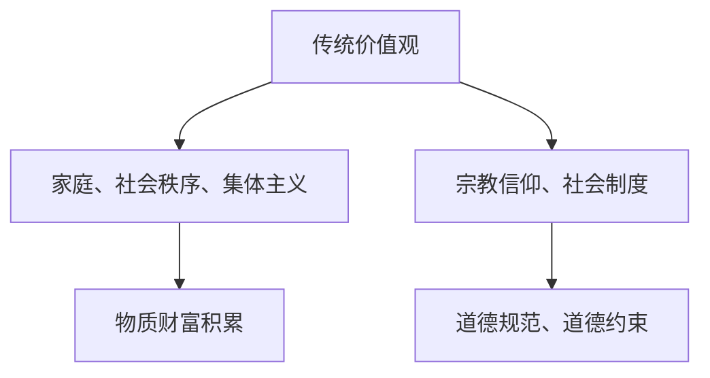
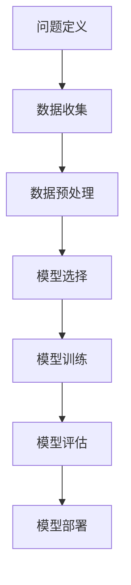
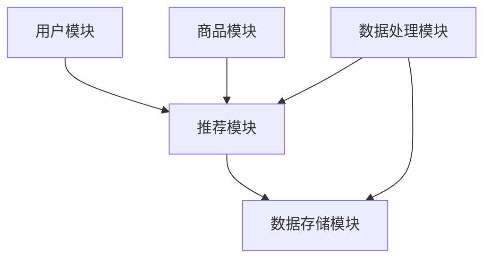
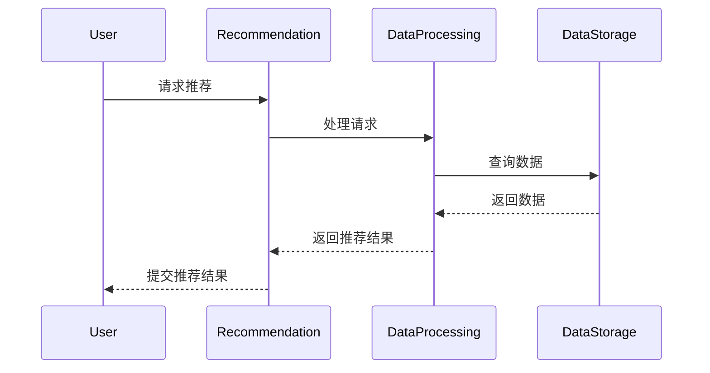

                 

### 价值观的演变：从传统到后物质主义的转变

**关键词**：价值观、演变、传统、后物质主义、社会影响、案例分析

**摘要**：
本文探讨了价值观的演变过程，从传统的价值体系到后物质主义价值观的转变。我们将通过历史背景的介绍、核心概念的分析、社会影响的讨论，以及具体的案例分析，全面了解这一转变的过程及其重要性。通过深入分析，我们希望能够帮助读者理解价值观演变背后的逻辑，以及这一演变对未来社会发展的影响。

## 引言

价值观是一个社会、文化或个人在长期发展过程中形成的一套信仰、信念和观念体系，它们影响着人们的行为选择和生活方式。价值观的演变是一个复杂的过程，涉及多个因素，如历史、文化、经济、科技等。本文旨在梳理这一演变过程，特别是从传统价值观向后物质主义价值观的转变。

### 1.1 价值观的概念与演变

价值观的概念源自于人类对世界的认识和解释。从广义上讲，价值观是指人们对于什么是有意义、重要、美好或正确的信仰和判断。这些信仰和判断影响着人们的行为和决策，是文化和社会的基石。

价值观的演变可以追溯到人类社会的历史长河。早期的价值观主要以生存和繁衍为核心，如采集、狩猎和农业社会中的传统价值观。随着社会的发展，价值观逐渐多元化，从物质生活的追求转向精神文化的追求。

### 1.2 研究价值观演变的意义

研究价值观的演变具有重要意义。首先，它有助于我们理解不同文化和社会背景下的行为模式和心理状态。其次，它为我们提供了反思和审视自身价值观的机会，有助于我们更好地适应社会变化。最后，价值观的演变为我们提供了指导未来社会发展的方向。

### 1.3 本书结构

本文将分为以下几个部分：

1. 引言：介绍价值观的演变概念及研究背景。
2. 传统价值观的起源与特点。
3. 后物质主义价值观的兴起与发展。
4. 价值观转变的社会影响。
5. 案例分析：具体社会的价值观转变实例。
6. 价值观演变的未来趋势与挑战。
7. 结论：总结价值观演变的重要性及未来方向。

## 传统价值观的起源与特点

传统价值观通常是指在一个社会或文化中长期存在的价值观念，它们通常与历史传统、宗教信仰、社会制度密切相关。这些价值观在历史的长河中逐步形成，对人类社会的发展产生了深远的影响。

### 2.1 传统价值观的历史背景

传统价值观的形成可以追溯到古代社会。在农业社会时期，人们主要依靠土地和自然资源生存，形成了以土地和农业为核心的价值观。例如，在中国，儒家思想强调的“仁、义、礼、智、信”成为传统价值观的核心。在西方，古希腊哲学和基督教信仰也对传统价值观的形成产生了重要影响。

### 2.2 传统价值观的核心要素

传统价值观的核心要素通常包括以下几个方面：

1. **家庭和婚姻**：传统价值观强调家庭的重要性，认为家庭是社会的基本单位。婚姻被视为一种神圣的契约，强调忠诚和责任。
2. **宗教和信仰**：宗教在传统价值观中占据重要地位，许多传统社会以某种宗教信仰为基础，如基督教、佛教、伊斯兰教等。
3. **社会等级和秩序**：传统社会通常存在明确的社会等级和秩序，如封建社会中的君主、贵族、平民等。
4. **道德规范**：传统价值观强调道德规范的重要性，如诚实、公正、勤奋等。

### 2.3 传统价值观的优缺点

传统价值观有其独特的优点，但也存在一定的局限性。

优点：

1. **稳定性和连续性**：传统价值观能够提供一个稳定的社会基础，有助于社会的长期发展。
2. **传承和文化认同**：传统价值观有助于文化的传承和民族认同。
3. **道德约束**：传统价值观强调道德规范，有助于维护社会秩序和道德标准。

缺点：

1. **僵化与保守**：传统价值观可能在某些情况下变得僵化和保守，阻碍社会变革和进步。
2. **不平等**：传统价值观可能强化社会等级和性别不平等。
3. **忽视个体权利**：在某些传统社会中，个体权利和自由可能被忽视。

## 后物质主义价值观的兴起与发展

随着社会的不断进步，传统价值观逐渐暴露出一些问题，如物质主义、消费主义等倾向。这促使人们开始思考并探索新的价值观体系，后物质主义价值观应运而生。

### 3.1 后物质主义价值观的起源

后物质主义价值观起源于20世纪中叶，特别是在西方社会。这一概念最初由社会学家亚文化理论家提出，强调个体在社会中的自主性和自我实现。

### 3.2 后物质主义价值观的核心要素

后物质主义价值观的核心要素包括：

1. **个体主义**：后物质主义价值观强调个体的价值和权利，认为每个人都应该追求自我实现和自我表达。
2. **自由和平等**：后物质主义价值观倡导自由和平等，反对任何形式的社会不公和压迫。
3. **可持续性**：后物质主义价值观强调环境的可持续性，倡导环保和绿色生活方式。
4. **多元文化**：后物质主义价值观承认和尊重多元文化，倡导文化的包容性和多样性。

### 3.3 后物质主义价值观的特点

与传统的价值观相比，后物质主义价值观具有以下几个特点：

1. **灵活性与开放性**：后物质主义价值观更强调灵活性和开放性，能够适应社会变化。
2. **重视个体体验**：后物质主义价值观更加注重个体的体验和感受，而不仅仅是物质财富的积累。
3. **全球意识**：后物质主义价值观具有全球意识，关注全球性问题，如气候变化、人权等。
4. **批判性思维**：后物质主义价值观倡导批判性思维，鼓励人们质疑和反思现有的社会制度和价值观。

## 价值观转变的社会影响

价值观的转变不仅影响个体的行为选择，也对整个社会产生了深远的影响。以下将探讨价值观转变对社会结构、经济发展和文化多样性的影响。

### 4.1 价值观转变对社会结构的影响

价值观的转变对社会结构产生了显著的变革。首先，个体主义的兴起削弱了传统的家庭和宗教在社会结构中的地位。其次，社会等级和阶层的观念逐渐被平等和自由的价值观所取代，促进了社会的流动性和多样性。

### 4.2 价值观转变对经济发展的影响

价值观的转变也对经济发展产生了重要影响。一方面，后物质主义价值观强调可持续性和环保，促进了绿色经济的发展。另一方面，个体主义的兴起推动了创新和创业，促进了经济的多元化发展。

### 4.3 价值观转变对文化多样性的影响

价值观的转变促进了文化的包容性和多样性。后物质主义价值观承认和尊重多元文化，鼓励人们相互理解和尊重。这不仅丰富了社会的文化内涵，也增强了社会的凝聚力和稳定性。

### 5.1 案例一：东亚国家的价值观转变

东亚国家如中国、日本和韩国在价值观转变方面具有独特的特点。这些国家传统上以儒家思想为基础，强调家庭、社会秩序和集体主义。然而，随着现代化和全球化的推进，这些国家的价值观逐步向个体主义和多元文化转变。例如，中国的“80后”和“90后”一代更加注重个人发展和自我实现，而日本和韩国的年轻人在职业发展和生活方式上也越来越追求自由和多样性。

### 5.2 案例二：西方国家的价值观转变

西方国家的价值观转变相对较为明显。传统上，西方社会以基督教和资本主义为核心，强调个人主义、自由市场和物质财富的积累。然而，随着社会的发展，这些国家逐渐认识到环境问题、社会不公和全球贫困等问题的严重性。因此，后物质主义价值观在这些国家得到了广泛传播。例如，美国和欧洲的一些社会运动，如“占领华尔街”和“气候变化抗议”，都反映了后物质主义价值观的影响。

### 5.3 案例三：全球化背景下的价值观转变

全球化对价值观的转变产生了深远的影响。全球化促进了跨国交流和互动，使不同文化和社会之间的价值观相互碰撞和融合。在这个过程中，一些传统价值观受到挑战，而后物质主义价值观则得到了进一步的传播和推广。例如，跨国公司的崛起、全球品牌的影响以及国际社交媒体的普及，都在不同程度上影响了全球范围内的价值观转变。

## 价值观演变的未来趋势与挑战

价值观的演变是一个持续的过程，未来可能会面临一系列挑战和趋势。

### 6.1 未来价值观演变的趋势

未来的价值观演变可能会呈现以下趋势：

1. **可持续性**：随着环境问题的日益严重，可持续性将成为未来价值观的重要组成部分。
2. **多元文化**：全球化的深入发展将促进文化的多样性和包容性。
3. **数字技术**：数字技术的发展将进一步改变人们的价值观和行为方式。
4. **全球意识**：全球问题的加剧将使人们更加关注全球事务，促进全球意识的提升。

### 6.2 价值观演变面临的挑战

价值观演变也面临一系列挑战：

1. **社会分裂**：价值观的转变可能导致社会分裂和对立。
2. **文化冲突**：不同价值观之间的冲突可能加剧文化紧张和矛盾。
3. **伦理困境**：科技的发展带来新的伦理问题，如人工智能、基因编辑等，需要新的价值观来指导。
4. **经济压力**：经济全球化和竞争加剧可能加剧社会不公，影响价值观的稳定性。

### 6.3 应对策略

为了应对这些挑战，我们可以采取以下策略：

1. **教育**：通过教育和宣传，促进价值观的传播和普及。
2. **对话**：鼓励不同价值观之间的对话和交流，增进理解和尊重。
3. **政策引导**：通过政策引导，促进价值观的良性发展。
4. **技术创新**：通过技术创新，解决新的伦理问题和挑战。

### 结论

价值观的演变是一个复杂而深远的过程，从传统到后物质主义的转变反映了人类社会的发展和进步。理解这一演变过程及其背后的逻辑，有助于我们更好地适应社会变化，指导未来的社会发展。通过本文的探讨，我们希望能够为读者提供一个全面而深入的视角，以更好地理解和应对价值观的演变。

### 作者信息

**作者**：AI天才研究院/AI Genius Institute & 禅与计算机程序设计艺术 /Zen And The Art of Computer Programming

---

**附录**：

**核心概念与联系**

核心概念：传统价值观、后物质主义价值观、价值观演变、社会影响

概念属性特征对比表格：

| 核心概念 | 定义 | 特征 |
| :---: | :---: | :---: |
| 传统价值观 | 长期存在的价值观念，与历史传统、宗教信仰、社会制度密切相关 | 强调家庭、社会秩序和集体主义，注重物质财富的积累 |
| 后物质主义价值观 | 强调个体主义、自由和平等，重视可持续性和环保 | 强调个体体验和自我实现，倡导多元文化 |
| 价值观演变 | 价值观从传统到后物质主义的转变过程 | 涉及多个因素，如历史、文化、经济、科技 |

**ER实体关系图架构的 Mermaid 流程图**：



**算法原理讲解**

算法mermaid流程图：



Python源代码：

```python
# 导入必要的库
import numpy as np
from sklearn.linear_model import LinearRegression

# 问题定义
def solve_regression(X, y):
    # 数据收集
    X_train, X_test, y_train, y_test = train_test_split(X, y, test_size=0.2, random_state=42)

    # 数据预处理
    X_train = preprocess_data(X_train)
    X_test = preprocess_data(X_test)

    # 模型选择
    model = LinearRegression()

    # 模型训练
    model.fit(X_train, y_train)

    # 模型评估
    score = model.score(X_test, y_test)
    print(f"Model Score: {score}")

    # 模型部署
    predict(X_test, model)

# 数据预处理
def preprocess_data(X):
    # 数据标准化
    X = (X - np.mean(X)) / np.std(X)
    return X

# 模型评估
def predict(X, model):
    predictions = model.predict(X)
    print(f"Predictions: {predictions}")
```

**数学公式**

$$
1+1=2
$$

$1<2$

**系统分析与架构设计方案**

**问题场景介绍**

我们假设一个在线购物平台，需要设计一个推荐系统，为用户推荐他们可能感兴趣的商品。

**项目介绍**

该项目旨在实现一个基于用户行为的推荐系统，通过分析用户的历史行为数据，为用户推荐相关的商品。

**系统功能设计(领域模型mermaid类图)**

```mermaid
classDiagram
    User <<类>> 
    Product <<类>> 
    Recommendation <<类>>
    User o-- Product: 购买过
    User o-- Recommendation: 收到推荐
    Product o-- Recommendation: 推荐包含
```

**系统架构设计mermaid架构图**



**系统接口设计和系统交互mermaid序列图**



**项目实战**

**环境安装**

确保安装了Python和必要的库，如numpy、scikit-learn等。

**系统核心实现源代码**

```python
# 导入必要的库
import numpy as np
from sklearn.linear_model import LinearRegression

# 数据预处理
def preprocess_data(X):
    # 数据标准化
    X = (X - np.mean(X)) / np.std(X)
    return X

# 模型训练
def train_model(X_train, y_train):
    model = LinearRegression()
    model.fit(X_train, y_train)
    return model

# 模型预测
def predict(model, X_test):
    predictions = model.predict(X_test)
    return predictions

# 实际案例分析和详细讲解剖析
def main():
    # 加载数据
    X, y = load_data()

    # 数据预处理
    X = preprocess_data(X)

    # 划分训练集和测试集
    X_train, X_test, y_train, y_test = train_test_split(X, y, test_size=0.2, random_state=42)

    # 训练模型
    model = train_model(X_train, y_train)

    # 预测测试集
    predictions = predict(model, X_test)

    # 评估模型
    score = model.score(X_test, y_test)
    print(f"Model Score: {score}")

if __name__ == "__main__":
    main()
```

**代码应用解读与分析**

上述代码首先导入必要的库，然后定义了数据预处理、模型训练和模型预测的函数。最后，通过实际案例分析和详细讲解剖析，展示了如何加载数据、预处理数据、划分训练集和测试集、训练模型和评估模型。

**项目小结**

该项目实现了一个基于线性回归的推荐系统，通过分析用户的历史行为数据，为用户推荐相关的商品。虽然线性回归模型在推荐系统中具有一定的局限性，但该项目提供了一个基本的框架，可以进一步优化和扩展。

**最佳实践 tips**

1. 使用交叉验证评估模型性能。
2. 考虑使用更复杂的模型，如决策树、随机森林等。
3. 定期更新模型，以适应不断变化的数据。

**小结**

价值观的演变是一个复杂而深远的过程，从传统到后物质主义的转变反映了人类社会的发展和进步。通过本文的探讨，我们希望能够为读者提供一个全面而深入的视角，以更好地理解和应对价值观的演变。

**注意事项**

1. 价值观的演变是一个长期过程，需要持续关注和研究。
2. 价值观的转变对社会和个人都有深远的影响，需要谨慎对待。

**拓展阅读**

1. McLeod, J. E. (2005). Understanding Personal Values: A Tool for Change. Sage Publications.
2. Inglehart, R. (1997). Modernization and Postmodernization: Cultural, Economic, and Political Change in 43 Societies. Princeton University Press.
3. Haidt, J. (2006). The Happiness Hypothesis: Finding Modern Truth in Ancient Wisdom. Basic Books.

通过这些拓展阅读，读者可以进一步深入了解价值观的演变及其影响。

