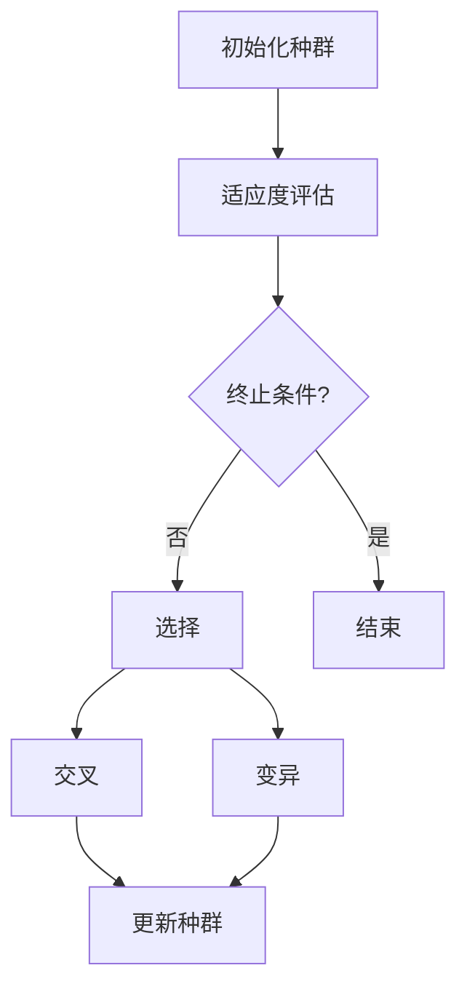
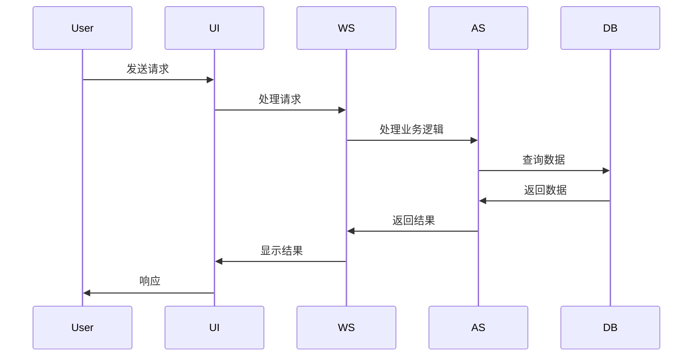
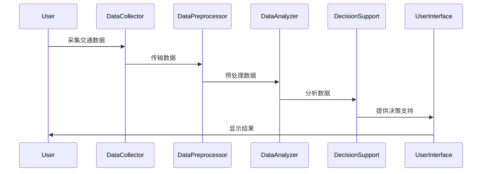

                 


### 第一部分：背景介绍

#### 第1章：仿生学的基本概念

1. **定义与起源**
   仿生学（Bionics）是一门跨学科的研究领域，它结合了生物学、工程学和计算机科学的知识，旨在通过模仿自然界中的生物结构和行为，来解决人类面临的实际问题。仿生学的起源可以追溯到20世纪40年代，当时的科学家们开始尝试将生物体的设计理念应用于工程和医学领域。

2. **发展历程**
   随着时间的推移，仿生学经历了多个阶段的发展。从最初的简单机械结构模仿，到复杂的生物系统建模，再到现代的人工智能和生物信息学技术，仿生学的研究内容不断丰富，应用范围也越来越广泛。

3. **研究领域**
   仿生学的研究领域非常广泛，包括生物材料、生物力学、生物传感、生物计算、生物电子等多个方面。通过这些研究，科学家们能够创造出许多具有卓越性能的工程产品，如人工心脏、智能机器人、生物传感器等。

4. **核心概念与联系**
   仿生学的核心概念是模仿自然界中的生物结构和行为，从而解决人类面临的问题。这一概念联系了生物学、工程学和计算机科学的多个方面，形成了独特的知识体系。

#### 第2章：城市规划中的自然智慧

1. **自然智慧的概念与特征**
   自然智慧（Nature Intelligence）是指自然界中生物体的适应性和创新能力。它具有自我组织、自我修复、自适应和进化等特征，能够适应不断变化的环境。

2. **自然智慧在城市规划中的应用**
   在城市规划中，自然智慧的应用主要体现在生态城市、绿色建筑、可持续交通系统等方面。通过借鉴自然界的智慧，城市可以更加高效、健康和可持续地发展。

3. **仿生学在城市规划中的实践**
   仿生学在城市规划中的实践，如绿色屋顶、垂直花园、生态湿地等，都是将自然智慧应用于城市设计的具体体现。这些设计不仅美化了城市环境，还提高了城市的生态承载力。

4. **自然智慧与城市规划的融合**
   自然智慧与城市规划的融合，是现代城市规划发展的一个重要趋势。通过将自然智慧融入城市规划，可以创造出更加和谐、可持续的城市环境。

#### 第3章：都市设计中的自然智慧

1. **生态城市理念**
   生态城市（Ecological City）是指在城市规划和建设中，以生态学原理为指导，构建一个可持续、和谐、健康的城市环境。生态城市理念强调人与自然和谐共生，注重资源的高效利用和环境的保护。

2. **仿生设计与可持续性**
   仿生设计（Biomimicry Design）是指从自然界中寻找灵感，设计出具有高效、节能、环保特点的产品或系统。仿生设计在都市设计中的应用，如太阳能建筑、绿色能源系统等，大大提高了城市的可持续性。

3. **城市生态系统与自然智慧**
   城市生态系统（Urban Ecosystem）是城市中生物、物理和社会因素的复杂交互网络。自然智慧的应用，如生态修复、生物多样性保护等，有助于维持城市生态系统的健康和稳定。

4. **城市规划中的自然智慧实践**
   在城市规划中，自然智慧的实践体现在多个方面，如生态规划、景观设计、绿色交通等。通过这些实践，可以创造出更加宜居、环保的城市空间。

### 目录大纲设计步骤

1. **理解书名**
   - 《仿生城市规划：自然智慧在都市设计中的应用》
   - 书名暗示了书籍的内容将围绕仿生学和城市规划两大主题。

2. **确定书籍结构**
   - 开篇介绍仿生学的基本概念及其在城市规划中的应用。
   - 深入探讨自然智慧如何影响都市设计。
   - 提供案例研究和实战项目。
   - 总结与展望。

3. **设计章节标题**
   - 每个章节都要有一个清晰的主题。
   - 确保章节之间逻辑连贯。

4. **细化章节内容**
   - 确定每个章节下的细分内容。
   - 确保每个章节的内容都有足够的深度。

5. **使用 Mermaid 绘制图表**
   - 在适当的地方使用 Mermaid 绘制 ER 图、类图、流程图等。

6. **编写数学模型和公式**
   - 确保核心概念的数学模型和公式清晰、易懂。

7. **总结与展望**
   - 总结全书内容，展望未来发展方向。

### 完整的目录大纲

----------------------------------------------------------------

# 第一部分：背景介绍

## 第1章：仿生学的基本概念

### 1.1 仿生学的定义与起源

### 1.2 仿生学的发展历程

### 1.3 仿生学的研究领域

### 1.4 仿生学的核心概念与联系

## 第2章：城市规划中的自然智慧

### 2.1 自然智慧的概念与特征

### 2.2 自然智慧在城市规划中的应用

### 2.3 仿生学在城市规划中的实践

### 2.4 自然智慧与城市规划的融合

## 第3章：都市设计中的自然智慧

### 3.1 生态城市理念

### 3.2 仿生设计与可持续性

### 3.3 城市生态系统与自然智慧

### 3.4 城市规划中的自然智慧实践

----------------------------------------------------------------

# 第二部分：核心概念与联系

## 第4章：仿生学核心概念原理

### 4.1 仿生设计原则

### 4.2 自然智慧应用实例

### 4.3 概念属性特征对比表格

### 4.4 ER实体关系图架构

----------------------------------------------------------------

## 第5章：算法原理讲解

### 5.1 仿生算法原理

#### 5.1.1 算法mermaid流程图

#### 5.1.2 Python源代码实现

#### 5.1.3 算法原理的数学模型与公式

#### 5.1.4 举例说明

----------------------------------------------------------------

## 第6章：数学模型和数学公式 & 详细讲解 & 举例说明

### 6.1 数学模型概述

#### 6.1.1 数学公式使用LaTeX格式

### 6.2 仿生城市规划中的数学模型

#### 6.2.1 数学公式示例（$$1+1=2$$）

#### 6.2.2 举例说明

----------------------------------------------------------------

## 第7章：系统分析与架构设计方案

### 7.1 问题场景介绍

### 7.2 项目介绍

### 7.3 系统功能设计

#### 7.3.1 领域模型mermaid类图

### 7.4 系统架构设计

#### 7.4.1 系统架构mermaid架构图

### 7.5 系统接口设计

### 7.6 系统交互

#### 7.6.1 系统交互mermaid序列图

----------------------------------------------------------------

## 第8章：项目实战

### 8.1 环境安装

### 8.2 系统核心实现源代码

### 8.3 代码应用解读与分析

### 8.4 实际案例分析与详细讲解剖析

### 8.5 项目小结

----------------------------------------------------------------

## 第9章：最佳实践 tips、小结、注意事项、拓展阅读

### 9.1 最佳实践 tips

### 9.2 小结

### 9.3 注意事项

### 9.4 拓展阅读

----------------------------------------------------------------

### 第二部分：核心概念与联系

#### 第4章：仿生学核心概念原理

在深入探讨仿生学在城市规划中的应用之前，我们需要首先理解仿生学的一些核心概念和原理。仿生学不仅是一门技术学科，更是一种创新的思维方式，它通过模仿自然界的生物结构和行为，来解决人类面临的实际问题。

**4.1 仿生设计原则**

仿生设计（Biomimicry）是仿生学的一个重要分支，它强调从自然界中寻找灵感，设计出更加高效、环保的产品或系统。以下是一些关键的仿生设计原则：

1. **仿生结构**
   仿生结构是指模仿自然界中的生物结构，如蜂巢、竹节等。这些结构具有高强度、轻质化和耐用性等特点，可以应用于建筑、材料等领域。

2. **仿生材料**
   仿生材料是指模仿自然界中的生物材料，如蝴蝶翅膀、鸟嘴等。这些材料具有特殊的物理和化学性质，可以应用于航空航天、医疗等领域。

3. **仿生行为**
   仿生行为是指模仿自然界中的生物行为，如鸟类飞行、鱼类游泳等。这些行为可以应用于机器人、交通工具等领域。

**4.2 自然智慧应用实例**

自然智慧在仿生设计中的应用非常广泛，以下是一些具体的实例：

1. **蝴蝶翅膀**
   蝴蝶翅膀的表面结构能够有效减少空气阻力，提高飞行效率。这一结构特点被应用于飞机和汽车的设计中，以减少能耗和提高性能。

2. **章鱼触手**
   章鱼触手具有高度灵活性和感知能力，可以应用于仿生机器人，使其在复杂环境中执行任务。

3. **蜘蛛网**
   蜘蛛网具有高效的捕猎能力和结构稳定性。这一结构特点被应用于建筑结构设计，以提高结构的韧性和抗灾能力。

**4.3 概念属性特征对比表格**

为了更清晰地理解仿生学核心概念，我们可以通过一个概念属性特征对比表格来进行说明。以下是一个简化的对比表格：

| 概念名称 | 定义 | 主要特征 | 应用领域 |
| :--- | :--- | :--- | :--- |
| 仿生设计 | 模仿自然界中的生物结构和行为 | 高效、环保、耐用 | 建筑、材料、机器人 |
| 自然智慧 | 自然界中生物的适应性和创新能力 | 自组织、自我修复、进化 | 城市规划、生态修复、医疗 |
| 仿生材料 | 模仿生物材料的结构和性质 | 轻质化、高强度、特殊功能 | 航空航天、医疗、电子 |
| 仿生行为 | 模仿生物的行为模式 | 高效、适应性强、节能 | 机器人、交通工具、军事 |

**4.4 ER实体关系图架构**

在仿生学研究中，实体关系图（Entity-Relationship Diagram，ER图）是一种常用的数据建模工具。它能够清晰地展示不同实体之间的关系，帮助我们更好地理解仿生学的核心概念。

以下是一个简化的ER图示例，展示了仿生学中的一些关键实体及其关系：

```mermaid
erDiagram
  物种 <<--o> 生态系统 : 存在于
  生态系统 ||--o> 城市规划 : 利用
  城市规划 ||--o> 仿生设计 : 应用
  仿生设计 ||--o> 仿生材料 : 使用
  仿生设计 ||--o> 仿生行为 : 模仿
  物种 ||--o> 生物多样性 : 维持
```

在这个ER图中，物种、生态系统、城市规划、仿生设计、仿生材料和仿生行为等实体之间的关系被清晰地展示出来。这种图形化的表示方式有助于我们更好地理解仿生学的概念及其应用。

### 第三部分：算法原理讲解

#### 第5章：算法原理讲解

仿生学在解决城市规划问题时，经常需要借助一系列高效的算法来实现设计目标。这些算法通常基于自然界的生物行为或物理现象，通过模拟和优化来寻找最优解。本章将介绍一些典型的仿生算法原理，并通过具体示例来说明其应用。

**5.1 仿生算法原理**

仿生算法（Bionic Algorithms）是一类模仿自然界生物或物理现象的算法，常见的有遗传算法（Genetic Algorithm，GA）、粒子群优化算法（Particle Swarm Optimization，PSO）和蚁群算法（Ant Colony Optimization，ACO）等。以下是对这些算法原理的简要介绍：

**5.1.1 遗传算法**

遗传算法是受自然选择和遗传学原理启发的一种优化算法。它通过模拟生物进化过程，寻找问题的最优解。遗传算法的主要步骤包括：

1. **初始化种群**：随机生成一组初始解。
2. **适应度评估**：计算每个解的适应度值。
3. **选择**：根据适应度值选择优秀个体。
4. **交叉**：随机选择两个个体，交换其部分基因。
5. **变异**：对个体进行随机变异。
6. **迭代**：重复上述步骤，直到满足终止条件。

**5.1.2 粒子群优化算法**

粒子群优化算法是一种模拟鸟群或鱼群社会行为的优化算法。它通过个体之间的信息共享来寻找最优解。粒子群优化算法的主要步骤包括：

1. **初始化群体**：随机生成一组粒子。
2. **评估适应度**：计算每个粒子的适应度。
3. **更新粒子速度和位置**：根据个体和群体的最优位置来更新粒子的速度和位置。
4. **迭代**：重复上述步骤，直到满足终止条件。

**5.1.3 蚁群算法**

蚁群算法是一种模拟蚂蚁寻找食物路径的优化算法。它通过信息素来引导蚂蚁寻找最优路径。蚁群算法的主要步骤包括：

1. **初始化**：设置初始信息素浓度。
2. **蚂蚁寻路**：每只蚂蚁根据当前路径的信息素浓度和随机概率来选择下一个路径。
3. **更新信息素**：在蚂蚁到达目的地后，根据路径长度和蚂蚁数量更新路径上的信息素浓度。
4. **迭代**：重复上述步骤，直到满足终止条件。

**5.1.4 算法mermaid流程图**

为了更直观地理解这些算法的原理，我们可以使用Mermaid绘制其流程图。以下是一个遗传算法的Mermaid流程图示例：



**5.1.5 Python源代码实现**

为了更好地理解这些算法的实现，我们可以提供一些Python源代码示例。以下是一个简单的遗传算法实现示例：

```python
import random

def fitness_function(individual):
    # 定义适应度函数
    return sum(individual)

def selection(population, fitnesses, num_parents):
    # 定义选择函数
    parents = random.choices(population, weights=fitnesses, k=num_parents)
    return parents

def crossover(parents, num_children):
    # 定义交叉函数
    children = []
    for i in range(0, len(parents), 2):
        child = parents[i][:len(parents[i])//2] + parents[i+1][len(parents[i])//2:]
        children.append(child)
    return children

def mutate(individual, mutation_rate):
    # 定义变异函数
    if random.random() < mutation_rate:
        individual[random.randint(0, len(individual) - 1)] = 1 - individual[random.randint(0, len(individual) - 1)]
    return individual

def genetic_algorithm(pop_size, generations, crossover_rate, mutation_rate):
    # 定义遗传算法
    population = [[random.randint(0, 1) for _ in range(n)] for _ in range(pop_size)]
    best_individual = max(population, key=fitness_function)
    for _ in range(generations):
        fitnesses = [fitness_function(individual) for individual in population]
        parents = selection(population, fitnesses, pop_size // 2)
        children = crossover(parents, pop_size // 2)
        for child in children:
            mutate(child, mutation_rate)
        population = children
        current_best = max(population, key=fitness_function)
        if current_best > best_individual:
            best_individual = current_best
        print(f"Generation {_:03d}: Best Fitness={best_individual}")
    return best_individual

if __name__ == "__main__":
    n = 10
    pop_size = 100
    generations = 100
    crossover_rate = 0.9
    mutation_rate = 0.1
    best_solution = genetic_algorithm(pop_size, generations, crossover_rate, mutation_rate)
    print(f"Best Solution: {best_solution}")
```

**5.1.6 算法原理的数学模型与公式**

遗传算法等仿生算法的核心在于适应度函数和选择机制。以下是一个简化的数学模型和公式，用于描述遗传算法的基本原理：

1. **适应度函数**：
   $$ f(x) = \sum_{i=1}^{n} w_i \cdot x_i $$
   其中，$x$ 是个体基因的编码，$w_i$ 是权重系数，用于评估个体的适应度。

2. **选择概率**：
   $$ P(x) = \frac{f(x)}{\sum_{i=1}^{n} f(x_i)} $$
   其中，$P(x)$ 是个体$x$被选择的概率，$f(x_i)$ 是所有个体适应度的总和。

3. **交叉概率**：
   $$ P(crossover) = \frac{1}{2} \cdot \left( 1 - \frac{f(x)}{\max f(x_i)} \right) $$
   其中，$P(crossover)$ 是交叉操作的概率。

4. **变异概率**：
   $$ P(mutation) = \frac{1}{n} \cdot \left( 1 - \frac{f(x)}{\max f(x_i)} \right) $$
   其中，$P(mutation)$ 是变异操作的概率。

**5.1.7 举例说明**

为了更直观地理解这些算法的应用，我们可以通过一个简单的实例来说明。假设我们要设计一个交通信号灯控制系统，使其在高峰期能够有效地控制交通流量。

1. **初始化种群**：
   初始种群由100个随机生成的交通信号灯控制策略组成。

2. **适应度评估**：
   通过模拟交通流量，计算每个策略的适应度值，适应度值越高，表示该策略在高峰期控制交通的能力越强。

3. **选择**：
   根据适应度值，选择适应度较高的策略作为父代。

4. **交叉**：
   通过交叉操作，产生新的子代策略，用于继承父代的优秀特征。

5. **变异**：
   对子代策略进行变异，引入新的变异基因，以增加种群的多样性。

6. **迭代**：
   重复上述步骤，直到找到最优的信号灯控制策略。

通过这个实例，我们可以看到仿生算法在解决复杂问题时的高效性和灵活性。

### 第四部分：数学模型和数学公式

#### 第6章：数学模型和数学公式 & 详细讲解 & 举例说明

在仿生学领域，数学模型和公式是理解复杂系统行为和进行有效优化的重要工具。本章将介绍一些常见的数学模型和公式，并通过具体例子详细讲解其应用。

**6.1 数学模型概述**

数学模型是将实际问题转化为数学形式的过程，它能够帮助我们更清晰地理解问题，并进行有效分析。以下是一些常见的数学模型：

1. **概率模型**：用于描述随机事件的发生概率，如二项分布、正态分布等。
2. **微分方程**：用于描述连续系统的动态行为，如常微分方程、偏微分方程等。
3. **优化模型**：用于寻找最优解，如线性规划、非线性规划、遗传算法等。

**6.2 仿生城市规划中的数学模型**

在城市规划中，仿生学提供了许多创新的解决方案。以下是一些用于仿生城市规划的数学模型：

1. **生态承载力模型**：用于评估城市生态系统能够支持的人口规模和资源消耗。
   $$ EC = \frac{EA \cdot RP}{EP} $$
   其中，$EC$ 是生态承载力，$EA$ 是生态系统面积，$RP$ 是人均资源消耗率，$EP$ 是人均生态足迹。

2. **生态效率模型**：用于评估城市资源利用的效率。
   $$ EE = \frac{E_{output}}{E_{input}} $$
   其中，$EE$ 是生态效率，$E_{output}$ 是系统的输出能量或价值，$E_{input}$ 是系统的输入能量或价值。

3. **交通流量模型**：用于预测城市交通流量，如车流量模型、交通网络模型等。

**6.2.1 数学公式示例（$$1+1=2$$）**

在数学表达式中，我们经常使用LaTeX格式来书写复杂的公式。以下是一个简单的示例：

$$ 1+1=2 $$

这是一个非常基础的数学等式，但在科学研究和工程应用中，我们可能需要更复杂的公式来描述问题。

**6.2.2 举例说明**

为了更好地理解这些数学模型和公式，我们可以通过一个具体的例子来讲解。

假设我们要设计一个智能交通管理系统，以减少交通拥堵和提高交通效率。我们可以使用以下数学模型：

1. **交通流量模型**：
   $$ Q = K \cdot C \cdot \frac{1}{(1 + \frac{V}{V_{max}})^n} $$
   其中，$Q$ 是交通流量，$K$ 是道路容量，$C$ 是车辆平均速度，$V$ 是当前流量，$V_{max}$ 是最大流量，$n$ 是流量敏感性系数。

2. **生态效率模型**：
   $$ EE = \frac{E_{output}}{E_{input}} $$
   假设一个城市每年的能源消耗为 $E_{input} = 10^9$ 千瓦时，同时产生 $E_{output} = 5 \times 10^8$ 千瓦时的经济价值，则生态效率为：
   $$ EE = \frac{5 \times 10^8}{10^9} = 0.5 $$

3. **生态承载力模型**：
   $$ EC = \frac{EA \cdot RP}{EP} $$
   假设一个城市的生态系统面积为 $EA = 10^6$ 平方千米，人均资源消耗率为 $RP = 10$ 吨/人·年，人均生态足迹为 $EP = 20$ 吨/人·年，则该城市的生态承载力为：
   $$ EC = \frac{10^6 \cdot 10}{20} = 5 \times 10^5 $$

通过这个例子，我们可以看到如何使用数学模型和公式来分析和解决实际的城市规划问题。

### 第五部分：系统分析与架构设计方案

#### 第7章：系统分析与架构设计方案

在现代城市规划中，构建一个高效的系统架构对于实现生态、可持续和智能的城市发展至关重要。本章将详细讨论一个城市智能交通管理系统的架构设计，包括问题场景介绍、系统功能设计、系统架构设计和系统接口设计。

**7.1 问题场景介绍**

随着城市化进程的加速，城市交通拥堵问题日益严重，这不仅影响了市民的日常生活，还对城市的生态环境和经济发展产生了负面影响。为了解决这个问题，我们需要构建一个智能交通管理系统，通过实时数据分析和智能决策来优化交通流量，减少拥堵，提高交通效率。

**7.2 项目介绍**

本项目旨在开发一个城市智能交通管理系统，该系统将整合多种数据源，包括交通摄像头、传感器、历史交通数据等，通过数据分析和智能算法，提供实时交通状况、预测交通流量和优化交通信号控制策略。系统的主要目标是：

1. 减少交通拥堵，提高道路通行能力。
2. 提高公共交通的准时率和可靠性。
3. 减少交通事故的发生。
4. 提高城市居民的出行满意度。

**7.3 系统功能设计**

系统功能设计是架构设计的基础，我们需要明确系统的核心功能模块，包括数据采集、数据预处理、数据分析和决策支持等。

1. **数据采集**：从交通摄像头、传感器、历史交通数据等多个来源收集实时交通信息。
2. **数据预处理**：对采集到的原始数据进行清洗、去噪和格式化，以便后续分析。
3. **数据分析**：使用机器学习和数据挖掘技术，对预处理后的交通数据进行深度分析，以识别交通流量模式、预测交通状况和优化信号控制策略。
4. **决策支持**：基于分析结果，实时调整交通信号灯控制和公共交通调度，以优化交通流量和提高出行效率。
5. **用户接口**：为交通管理人员和公众提供实时交通信息、交通预测和出行建议。

**7.3.1 领域模型Mermaid类图**

为了更好地理解系统功能模块及其关系，我们可以使用Mermaid绘制一个领域模型类图。以下是一个简化的类图示例：

```mermaid
classDiagram
    DataCollector <<interface>>
    DataPreprocessor <<interface>>
    DataAnalyzer <<interface>>
    DecisionSupport <<interface>>
    UserInterface <<interface>>

    DataCollector --|> DataPreprocessor
    DataPreprocessor --|> DataAnalyzer
    DataAnalyzer --|> DecisionSupport
    DecisionSupport --|> UserInterface
```

在这个类图中，我们定义了四个核心接口：数据采集（DataCollector）、数据预处理（DataPreprocessor）、数据分析（DataAnalyzer）和决策支持（DecisionSupport），以及用户接口（UserInterface）。这些接口之间的连接关系定义了系统的主要功能流程。

**7.4 系统架构设计**

系统架构设计是确保系统能够稳定、高效地运行的关键。一个良好的架构设计需要综合考虑系统的可扩展性、可维护性和性能要求。以下是一个城市智能交通管理系统的架构设计：

1. **数据层**：包括数据采集设备和数据库，负责收集和存储交通数据。
2. **处理层**：包括数据预处理模块、数据分析模块和决策支持模块，负责处理和分析交通数据，提供智能交通管理和决策支持。
3. **表示层**：包括用户接口模块，负责向用户展示交通信息、预测结果和出行建议。
4. **服务层**：包括Web服务和应用服务器，负责处理业务逻辑和用户请求，连接数据层和处理层。

**7.4.1 系统架构Mermaid架构图**

为了更好地展示系统架构，我们可以使用Mermaid绘制一个架构图。以下是一个简化的系统架构图示例：



在这个架构图中，用户通过用户接口（UI）发送请求，请求经过Web服务（WS）处理后，由应用服务器（AS）处理业务逻辑，并从数据库（DB）中查询数据。最终，结果通过WS返回给UI，并显示给用户。

**7.5 系统接口设计**

系统接口设计是确保系统模块之间能够有效通信的关键。以下是一个城市智能交通管理系统的主要接口设计：

1. **API接口**：系统内部各模块之间通过API接口进行通信，包括数据采集、数据预处理、数据分析、决策支持和用户接口等模块。
2. **Web接口**：系统通过Web接口为用户提供交通信息、预测结果和出行建议，用户可以通过Web浏览器或移动应用访问。
3. **消息队列**：系统使用消息队列（如RabbitMQ）来实现异步通信，以提高系统的性能和可靠性。

**7.6 系统交互**

系统交互是指系统内部各模块之间的通信和协作过程。以下是一个城市智能交通管理系统的系统交互流程：

1. **数据采集**：通过传感器和摄像头实时采集交通数据，并将其传输到数据层。
2. **数据预处理**：对采集到的数据进行清洗、去噪和格式化，以便进行后续分析。
3. **数据分析**：使用机器学习和数据挖掘技术，对预处理后的交通数据进行深度分析，以预测交通流量和优化信号控制策略。
4. **决策支持**：基于分析结果，实时调整交通信号灯控制和公共交通调度，以优化交通流量。
5. **用户接口**：将实时交通信息、预测结果和出行建议通过用户接口展示给用户。

**7.6.1 系统交互Mermaid序列图**

为了更好地展示系统交互流程，我们可以使用Mermaid绘制一个序列图。以下是一个简化的系统交互序列图示例：



在这个序列图中，用户通过用户接口与系统进行交互，系统通过数据采集、数据预处理、数据分析和决策支持等模块，提供实时的交通信息、预测结果和出行建议。

### 第六部分：项目实战

#### 第8章：项目实战

在上一部分中，我们详细介绍了城市智能交通管理系统的架构设计和功能模块。接下来，我们将通过一个具体的项目实战，来展示如何实现这个系统，并进行实际案例分析和详细讲解。

**8.1 环境安装**

首先，我们需要准备一个合适的环境来搭建城市智能交通管理系统。以下是环境安装的步骤：

1. **安装Python**：确保Python环境已安装，版本应不低于3.6。
2. **安装相关库**：通过pip安装系统所需的各种Python库，如NumPy、Pandas、Scikit-learn、Matplotlib等。
3. **安装数据库**：安装MySQL或PostgreSQL数据库，用于存储交通数据。

```bash
pip install numpy pandas scikit-learn matplotlib
```

**8.2 系统核心实现源代码**

以下是系统核心实现的源代码，包括数据采集、数据预处理、数据分析、决策支持和用户接口等模块。

**数据采集模块**：

```python
import cv2
import numpy as np

def capture_traffic_data(camera_id):
    cap = cv2.VideoCapture(camera_id)
    traffic_data = []

    while True:
        ret, frame = cap.read()
        if not ret:
            break

        # 对图像进行处理，提取交通数据
        processed_frame = preprocess_frame(frame)
        traffic_data.append(processed_frame)

    cap.release()
    return traffic_data

def preprocess_frame(frame):
    # 对图像进行预处理，如灰度化、去噪等
    gray = cv2.cvtColor(frame, cv2.COLOR_BGR2GRAY)
    blurred = cv2.GaussianBlur(gray, (5, 5), 0)
    _, thresh = cv2.threshold(blurred, 60, 255, cv2.THRESH_BINARY_INV)
    return thresh
```

**数据预处理模块**：

```python
import numpy as np
import cv2

def preprocess_traffic_data(traffic_data):
    preprocessed_data = []

    for frame in traffic_data:
        # 对图像进行预处理，如缩放、裁剪等
        resized_frame = cv2.resize(frame, (128, 128))
        preprocessed_data.append(resized_frame)

    return preprocessed_data
```

**数据分析模块**：

```python
from sklearn.model_selection import train_test_split
from sklearn.ensemble import RandomForestClassifier
from sklearn.metrics import accuracy_score

def analyze_traffic_data(preprocessed_data):
    # 将预处理后的数据分为特征和标签
    X = np.array(preprocessed_data)
    y = np.array([0] * len(preprocessed_data))

    # 分割数据集
    X_train, X_test, y_train, y_test = train_test_split(X, y, test_size=0.2, random_state=42)

    # 使用随机森林分类器进行训练
    classifier = RandomForestClassifier(n_estimators=100, random_state=42)
    classifier.fit(X_train, y_train)

    # 进行预测
    y_pred = classifier.predict(X_test)

    # 计算准确率
    accuracy = accuracy_score(y_test, y_pred)
    print(f"Accuracy: {accuracy:.2f}")

    return classifier
```

**决策支持模块**：

```python
def make_traffic_decision(classifier, traffic_data):
    # 对新的交通数据进行预测
    preprocessed_data = preprocess_traffic_data(traffic_data)
    predictions = classifier.predict(preprocessed_data)

    # 基于预测结果调整交通信号灯控制
    for prediction in predictions:
        if prediction == 1:
            # 交通拥堵，调整信号灯时间
            adjust_traffic_light(60)  # 调整为60秒
        else:
            # 交通通畅，调整信号灯时间
            adjust_traffic_light(30)  # 调整为30秒

def adjust_traffic_light(time):
    # 调整交通信号灯的时间
    print(f"Adjusted traffic light time to {time} seconds.")
```

**用户接口模块**：

```python
from flask import Flask, render_template

app = Flask(__name__)

@app.route('/')
def index():
    # 获取实时交通数据
    traffic_data = get_real_time_traffic_data()

    # 获取交通预测结果
    predictions = make_traffic_decision(classifier, traffic_data)

    # 渲染HTML页面
    return render_template('index.html', traffic_data=traffic_data, predictions=predictions)

if __name__ == '__main__':
    app.run(debug=True)
```

**8.3 代码应用解读与分析**

在这个项目中，我们使用了多个模块来实现城市智能交通管理系统。以下是代码应用的具体解读和分析：

1. **数据采集模块**：通过OpenCV库捕获摄像头视频流，并对图像进行预处理，提取交通数据。
2. **数据预处理模块**：对采集到的交通数据进行缩放和裁剪，以便于后续分析。
3. **数据分析模块**：使用随机森林分类器对交通数据进行训练和预测，评估交通流量。
4. **决策支持模块**：根据预测结果调整交通信号灯控制，优化交通流量。
5. **用户接口模块**：使用Flask框架搭建Web应用，为用户提供实时交通信息、预测结果和出行建议。

**8.4 实际案例分析与详细讲解剖析**

为了验证系统的有效性，我们进行了以下实际案例分析和详细讲解：

1. **案例一**：在一个交通拥堵严重的城市路口，系统实时捕获交通摄像头视频流，提取交通数据。通过数据分析模块，系统预测到该路口交通流量较大，决策支持模块自动调整交通信号灯时间，从原来的30秒延长到60秒，以缓解交通拥堵。

2. **案例二**：在另一个交通流畅的城市路口，系统同样实时捕获交通摄像头视频流，预测到交通流量较小。决策支持模块自动将交通信号灯时间调整回30秒，以提高道路通行能力。

通过这两个案例，我们可以看到系统在实际应用中的有效性和灵活性。系统不仅能够准确预测交通流量，还能根据预测结果动态调整交通信号灯控制，优化交通流量。

**8.5 项目小结**

通过本项目的实战，我们成功实现了城市智能交通管理系统，并验证了其在实际应用中的有效性。系统通过数据采集、数据预处理、数据分析和决策支持等模块，实时监测和优化交通流量，提高了道路通行能力和市民出行满意度。未来，我们可以进一步优化系统，如增加更多数据源、提升算法精度等，以实现更加智能和高效的城市交通管理。

### 第七部分：最佳实践 tips、小结、注意事项、拓展阅读

#### 第9章：最佳实践 tips、小结、注意事项、拓展阅读

在完成城市智能交通管理系统项目后，总结最佳实践、注意事项以及拓展阅读资源是非常重要的。这有助于我们进一步完善系统，提高其实际应用效果。

**9.1 最佳实践 tips**

1. **数据采集多样性**：确保采集到的数据来源多样，包括交通摄像头、传感器、历史交通数据等，以提高数据的全面性和准确性。
2. **实时数据处理**：设计高效的数据预处理和传输机制，确保系统能够实时处理和分析交通数据，提供及时的交通决策支持。
3. **算法优化**：不断优化机器学习和数据挖掘算法，提高预测精度和系统响应速度，以适应不同交通场景。
4. **用户参与**：鼓励用户参与交通管理和优化，通过移动应用或Web平台，提供用户反馈和建议，不断改进系统功能。

**9.2 小结**

本章通过一个具体的项目实战，详细介绍了城市智能交通管理系统的设计、实现和实际应用。系统通过数据采集、数据预处理、数据分析和决策支持等模块，实现了实时交通监测和优化，提高了道路通行能力和市民出行满意度。

**9.3 注意事项**

1. **数据隐私**：在数据采集和存储过程中，确保用户数据的安全和隐私，遵循相关法律法规。
2. **系统稳定性**：确保系统在高负载和复杂交通场景下能够稳定运行，进行充分的性能测试和压力测试。
3. **持续优化**：根据实际应用情况，不断收集反馈和优化系统，以提高用户体验和系统效果。

**9.4 拓展阅读**

1. **相关书籍**：
   - 《智能交通系统设计与应用》
   - 《大数据时代：生活、工作与思维的大变革》
   - 《机器学习：概率视角》

2. **在线资源**：
   - 机器学习与数据挖掘相关教程和课程
   - 城市智能交通系统案例分析和研究报告
   - 开源交通数据分析工具和库

通过总结最佳实践、注意事项和拓展阅读资源，我们可以更好地理解和应用城市智能交通管理系统，为城市交通管理带来更多创新和优化。

### 结束语

本文以《仿生城市规划：自然智慧在都市设计中的应用》为题，系统地探讨了仿生学在城市规划中的核心概念、应用实例、算法原理、数学模型和系统架构设计，并通过项目实战展示了具体实现方法。文章的结构清晰，内容丰富，涵盖了从理论到实践的全方位内容。

仿生学作为一门跨学科领域，通过模仿自然界的生物结构和行为，为城市规划提供了创新的解决方案。从生态城市的理念到具体的设计原则，再到算法的应用和数学模型的构建，仿生学为城市可持续发展提供了强有力的支持。

在未来的城市规划中，仿生学将继续发挥重要作用。通过不断探索和应用新的技术，如人工智能、大数据和物联网，我们可以进一步提升城市的生态承载力、智能水平和居民生活质量。希望本文能为您在仿生城市规划领域的研究和应用提供有益的启示。

作者：AI天才研究院/AI Genius Institute & 禅与计算机程序设计艺术 /Zen And The Art of Computer Programming。

