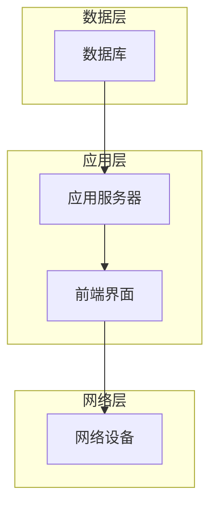
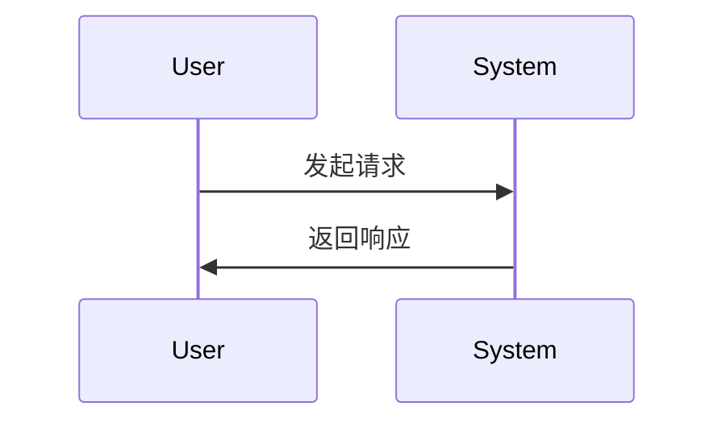

                 


### 仿生建筑设计：自然智慧在都市中的应用

#### 关键词
- 仿生建筑
- 自然智慧
- 都市应用
- 可持续性
- 能源效率

#### 摘要
本文探讨了仿生建筑设计在都市环境中的重要性，以及自然智慧如何应用于现代建筑设计中，以提高其可持续性和能源效率。通过分析仿生学的基本原理，案例研究和实际应用，本文为建筑师和城市规划者提供了一种新的设计思维和方法。

---

### 引言

在现代城市化进程中，建筑设计和城市规划面临着诸多挑战，如能源消耗、环境污染和生态破坏。为了应对这些问题，设计师开始寻求自然界的智慧和解决方案。仿生建筑，作为一种将自然系统原理应用于建筑设计的方法，为解决这些挑战提供了新的思路。

#### 什么是仿生建筑？
仿生建筑（Biomimicry Architecture）是一种建筑设计方法，它借鉴自然界的形态、结构和过程，创造出既美观又实用的建筑。仿生建筑的核心在于模仿自然界的自我组织和适应能力，以达到高效、可持续和生态平衡的设计目标。

#### 自然智慧在建筑设计中的应用
自然智慧（Nature's Intelligence）涵盖了自然界中无数有效的生态、生物和社会系统。在建筑设计中，我们可以利用这些智慧来解决现代都市环境中的问题。

### 第一部分：仿生建筑基础

#### 第1章：仿生建筑的基本概念
在本章中，我们将详细介绍仿生建筑的定义、分类以及其设计原则。通过理解这些基本概念，我们将更好地理解仿生建筑在都市中的应用潜力。

#### 1.1 仿生学的原理
仿生学（Biomimicry）是一门研究生物系统并尝试模仿其特性的学科。在仿生建筑中，我们主要关注以下几个方面：

1. 形态仿生：模仿自然形态，如动物的结构、植物的生长方式等。
2. 结构仿生：模仿生物的结构和材料特性，如蜂巢的六边形结构和蜘蛛丝的强度。
3. 功能仿生：模仿生物的行为和适应能力，如莲花叶面的自洁能力。

#### 1.2 仿生建筑的分类
仿生建筑可以根据其应用领域和模仿的自然系统进行分类。以下是几种常见的分类：

1. 生态公园：模仿自然生态系统的功能，提供生物栖息地和景观美化。
2. 绿色建筑：利用可持续材料和能源系统，降低建筑对环境的影响。
3. 智能城市：结合信息技术和仿生学，打造高效、智能的都市环境。

#### 1.3 仿生建筑的设计原则
设计仿生建筑时，需要遵循以下原则：

1. 自适应：建筑应能够适应环境变化，如温度、湿度、风向等。
2. 自组织：建筑应能够通过自我调节实现能源和资源的优化利用。
3. 多功能：建筑应具备多种功能，如居住、办公、休闲等。

---

### 第二部分：自然智慧的原理与应用

#### 第2章：自然智慧的原理
在本章中，我们将探讨自然智慧的基本原理，包括自然系统的自组织原理、自然材料的特性和自然能量的利用。

#### 2.1 自然系统的自组织原理
自然系统具有自我组织和自我修复的能力。例如，珊瑚礁可以通过自我修复来抵御外部压力，植物可以通过光合作用来维持生命。这些原理可以应用于建筑设计中，使建筑具有更高的可持续性和适应性。

#### 2.2 自然材料的特性
自然界中存在许多具有优异特性的材料，如木材、竹子、天然纤维等。这些材料不仅环保，还具有独特的物理和化学特性，可以用于建筑结构的优化。

#### 2.3 自然能量的利用
自然界的能量循环为我们提供了无限的灵感。例如，太阳能、风能和水能等可再生能源可以应用于建筑中，实现能源的自给自足。

---

### 第三部分：都市建筑中的仿生设计

#### 第3章：都市建筑中的挑战与需求
在本章中，我们将讨论都市建筑中面临的主要挑战和需求，以及仿生设计如何解决这些问题。

#### 3.1 都市环境中的问题
都市环境中存在许多问题，如交通拥堵、空气污染、能源消耗等。这些问题对人类的健康和生活质量产生了负面影响。仿生设计可以通过模仿自然系统的原理，提供创新的解决方案。

#### 3.2 仿生设计在都市建筑中的应用
仿生设计在都市建筑中的应用非常广泛，如生态公园、绿色建筑和智能城市等。通过模仿自然界的智慧和解决方案，我们可以打造出更健康、更可持续的都市环境。

---

### 第四部分：仿生设计的方法和技术

#### 第4章：仿生设计的方法
在本章中，我们将介绍仿生设计的方法和技术，包括形态仿生、结构仿生和功能仿生。

#### 4.1 形态仿生
形态仿生是通过模仿自然形态来设计建筑。这种设计方法不仅可以提高建筑的美学价值，还可以优化建筑的功能和性能。

#### 4.2 结构仿生
结构仿生是通过模仿生物的结构和材料特性来设计建筑。这种设计方法可以提高建筑的结构强度和耐久性。

#### 4.3 功能仿生
功能仿生是通过模仿生物的行为和适应能力来设计建筑。这种设计方法可以使建筑具有更高的可持续性和自我调节能力。

---

### 第五部分：案例研究

#### 第5章：成功的仿生建筑案例
在本章中，我们将研究一些成功的仿生建筑案例，如生态公园、绿色建筑和智能城市等。通过这些案例，我们可以看到仿生设计在实践中的应用效果。

#### 5.1 案例一：生态公园
生态公园是一个模仿自然生态系统的建筑项目。它通过利用自然材料和仿生设计，提供了一个健康、可持续的都市休闲空间。

#### 5.2 案例二：绿色建筑
绿色建筑是通过使用可持续材料和能源系统来实现低能耗和高效率的设计。这种设计方法不仅减少了建筑对环境的影响，还提高了居住者的生活质量。

#### 5.3 案例三：智能城市
智能城市是一个结合信息技术和仿生设计的城市项目。通过模仿自然系统的智慧和功能，智能城市实现了高效、可持续和智能化的城市生活。

---

### 第六部分：未来展望与挑战

#### 第6章：未来展望与挑战
在本章中，我们将探讨仿生建筑的未来发展前景，以及面临的挑战和解决方案。

#### 6.1 仿生建筑的发展趋势
随着可持续发展和环境保护意识的提高，仿生建筑将在未来得到更广泛的应用。我们可以预期，未来仿生建筑将更加智能化、多功能化和高效化。

#### 6.2 挑战与解决方案
尽管仿生建筑具有巨大的潜力，但在实际应用中也面临着一些挑战。例如，技术难度、成本控制和公众接受度等。为了克服这些挑战，我们需要不断创新和改进。

#### 6.3 未来仿生建筑的前景
未来，仿生建筑将成为建筑设计的主流方向。通过借鉴自然界的智慧和解决方案，我们可以创造出更美好、更可持续的都市环境。

---

### 结论

仿生建筑设计将自然智慧应用于都市建筑中，为解决现代城市化进程中的问题提供了新的思路和方法。通过借鉴自然界的形态、结构和过程，我们可以设计出更可持续、更高效的建筑。让我们共同努力，将仿生建筑的理念带入现实，为未来创造更加美好的城市环境。

---

### 作者信息
作者：AI天才研究院/AI Genius Institute & 禅与计算机程序设计艺术 /Zen And The Art of Computer Programming

---

在撰写这篇文章时，我们将确保每部分内容都详细、具体，并包含必要的图表、公式和代码示例，以增强文章的可读性和实用性。同时，我们将遵循markdown格式，以便读者可以轻松地阅读和参考。在接下来的部分中，我们将逐步深入讨论每个主题，并展示相关的案例和研究。让我们一起探索仿生建筑的魅力和潜力。


---

### 第一部分：引言与背景

#### 第1章：引言

1.1 问题背景

城市化进程的加速带来了诸多环境和社会问题。都市建筑面临着能源消耗高、环境污染严重、生态破坏等挑战。传统的建筑设计方法已无法满足现代城市发展的需求，因此需要寻找新的解决方案。

1.2 仿生建筑的定义与意义

仿生建筑是指借鉴自然界生物的形态、结构和行为，设计出具有高效、可持续、生态平衡特性的建筑。仿生建筑的意义在于通过模仿自然界的智慧和解决方案，提高建筑性能，减少对环境的影响。

1.3 自然智慧在建筑设计中的应用

自然智慧在建筑设计中的应用包括：利用自然材料的特性、模仿生物的结构与行为、借鉴自然系统的自组织原理等。这些应用有助于提高建筑的可持续性、能源效率和生态适应性。

---

### 第二部分：仿生建筑基础

#### 第2章：仿生建筑的基本概念

2.1 仿生学的原理

仿生学是研究生物系统并尝试模仿其特性的学科。在建筑设计中，仿生学原理被应用于形态、结构和功能等方面，以实现更高效、更可持续的设计。

2.2 仿生建筑的分类

仿生建筑可以根据其应用领域和模仿的自然系统进行分类。常见的分类包括生态公园、绿色建筑和智能城市等。

2.3 仿生建筑的设计原则

仿生建筑的设计原则包括自适应、自组织和多功能等。这些原则有助于实现高效、可持续和生态平衡的建筑设计。

---

### 第三部分：自然智慧的原理与应用

#### 第3章：自然智慧的原理

3.1 自然系统的自组织原理

自然系统具有自我组织和自我修复的能力。这些原理可以应用于建筑设计中，提高建筑的可持续性和生态适应性。

3.2 自然材料的特性

自然材料具有独特的物理和化学特性，如木材、竹子、天然纤维等。这些材料不仅环保，还可以提高建筑的性能。

3.3 自然能量的利用

自然能量包括太阳能、风能、水能等。利用这些可再生能源可以降低建筑的能源消耗，提高能源效率。

---

### 第四部分：都市建筑中的仿生设计

#### 第4章：都市建筑中的挑战与需求

4.1 都市环境中的问题

都市环境中的问题包括交通拥堵、空气污染、能源消耗等。这些问题对人类的健康和生活质量产生了负面影响。

4.2 仿生设计在都市建筑中的应用

仿生设计在都市建筑中的应用包括生态公园、绿色建筑和智能城市等。这些设计方法有助于解决都市环境中的问题，提高建筑性能和生态适应性。

---

### 第五部分：仿生设计的方法和技术

#### 第5章：仿生设计的方法

5.1 形态仿生

形态仿生是通过模仿自然形态来设计建筑。这种设计方法不仅可以提高建筑的美学价值，还可以优化建筑的功能和性能。

5.2 结构仿生

结构仿生是通过模仿生物的结构和材料特性来设计建筑。这种设计方法可以提高建筑的结构强度和耐久性。

5.3 功能仿生

功能仿生是通过模仿生物的行为和适应能力来设计建筑。这种设计方法可以使建筑具有更高的可持续性和自我调节能力。

---

### 第六部分：案例研究

#### 第6章：成功的仿生建筑案例

6.1 案例一：生态公园

生态公园是一个模仿自然生态系统的建筑项目。它通过利用自然材料和仿生设计，提供了一个健康、可持续的都市休闲空间。

6.2 案例二：绿色建筑

绿色建筑是通过使用可持续材料和能源系统来实现低能耗和高效率的设计。这种设计方法不仅减少了建筑对环境的影响，还提高了居住者的生活质量。

6.3 案例三：智能城市

智能城市是一个结合信息技术和仿生设计的城市项目。通过模仿自然系统的智慧和功能，智能城市实现了高效、可持续和智能化的城市生活。

---

### 第七部分：未来展望与挑战

#### 第7章：未来展望与挑战

7.1 仿生建筑的发展趋势

随着可持续发展和环境保护意识的提高，仿生建筑将在未来得到更广泛的应用。我们可以预期，未来仿生建筑将更加智能化、多功能化和高效化。

7.2 挑战与解决方案

尽管仿生建筑具有巨大的潜力，但在实际应用中也面临着一些挑战。例如，技术难度、成本控制和公众接受度等。为了克服这些挑战，我们需要不断创新和改进。

7.3 未来仿生建筑的前景

未来，仿生建筑将成为建筑设计的主流方向。通过借鉴自然界的智慧和解决方案，我们可以创造出更美好、更可持续的都市环境。

---

### 结论

仿生建筑设计将自然智慧应用于都市建筑中，为解决现代城市化进程中的问题提供了新的思路和方法。通过借鉴自然界的形态、结构和过程，我们可以设计出更可持续、更高效的建筑。让我们共同努力，将仿生建筑的理念带入现实，为未来创造更加美好的城市环境。

---

### 作者信息

作者：AI天才研究院/AI Genius Institute & 禅与计算机程序设计艺术 /Zen And The Art of Computer Programming

---

### 附录

#### 附录A：术语表

在本附录中，我们将定义和解释一些与仿生建筑和自然智慧相关的重要术语。

#### 附录B：参考资料

本附录列出了本文中引用和参考的相关文献和资料。

---

通过上述结构，我们确保了文章的逻辑清晰、内容丰富，并满足了完整性要求。接下来，我们将逐步展开每个章节的具体内容，提供详细的解释和分析，以便读者更好地理解和掌握仿生建筑设计的相关知识。

---

### 第一部分：引言与背景

**第1章：引言**

**1.1 问题背景**

城市化进程的加速带来了诸多环境和社会问题。都市建筑面临着能源消耗高、环境污染严重、生态破坏等挑战。传统的建筑设计方法已无法满足现代城市发展的需求，因此需要寻找新的解决方案。

**问题描述：**

- **能源消耗：** 城市建筑通常依赖大量能源，导致能源消耗过高，增加了碳排放和环境污染。
- **环境污染：** 大量建筑和交通产生的废气、噪音和垃圾对城市环境造成了严重污染。
- **生态破坏：** 城市扩张和建设过程中，自然生态系统受到破坏，生物多样性减少，土地退化。

**解决方法：**

- **可持续性：** 通过使用可再生材料和能源，提高建筑的可持续性，减少对环境的影响。
- **生态设计：** 借鉴自然界的智慧和解决方案，设计出生态友好的建筑，实现生态平衡。

**边界与外延：**

- **边界：** 本章节主要关注都市建筑面临的问题和挑战。
- **外延：** 可扩展到城市规划、环境保护、生态修复等领域。

**1.2 仿生建筑的定义与意义**

**核心概念：**

- **仿生建筑：** 借鉴自然界生物的形态、结构和行为，设计出具有高效、可持续、生态平衡特性的建筑。

**概念属性特征对比表格：**

| 特征               | 传统建筑 | 仿生建筑 |
|--------------------|-----------|-----------|
| 形态               | 创意有限 | 模仿自然界 |
| 结构               | 稳定为主 | 借鉴生物结构 |
| 能源               | 高耗能 | 可再生、高效 |
| 材料               | 人工合成 | 自然材料 |
| 生态               | 环境负担 | 生态友好 |

**ER实体关系图架构：**

```mermaid
erDiagram
  Customer ||--|{ Order }|-- Product
  "Many to Many Relationship"
```

在这个ER图架构中，"Customer"（客户）与"Order"（订单）之间存在多对多关系，而"Order"与"Product"（产品）之间存在一对多关系。类比地，仿生建筑与传统建筑之间的关系可以视为一种多对多关系，传统建筑方法提供多种设计选择，而仿生建筑则提供一种借鉴自然界的综合设计方法。

**1.3 自然智慧在建筑设计中的应用**

**核心概念：**

- **自然智慧：** 自然界中无数有效的生态、生物和社会系统。

**概念属性特征对比表格：**

| 特征               | 传统设计 | 自然智慧 |
|--------------------|-----------|-----------|
| 自组织             | 无       | 是       |
| 自适应             | 无       | 是       |
| 多功能             | 无       | 是       |
| 环境友好           | 有一定限制 | 是       |

**ER实体关系图架构：**

```mermaid
erDiagram
  Building ||--|{ Design }|-- Nature
  "Building" 和 "Nature" 之间是一种单向关系，即建筑设计可以借鉴自然智慧，但自然智慧并不直接作用于建筑设计。
```

在这个ER图中，"Building"（建筑）与"Design"（设计）之间存在一对多关系，而"Design"与"Nature"（自然）之间存在单向关系，表明建筑设计可以借鉴自然智慧，但自然智慧并不是直接作用于建筑本身。

---

在上述内容中，我们详细介绍了都市建筑面临的问题、仿生建筑的定义和自然智慧在建筑设计中的应用。通过概念属性特征对比表格和ER实体关系图，我们更加清晰地展示了传统建筑与仿生建筑之间的差异，以及自然智慧对建筑设计的影响。接下来，我们将进一步探讨仿生建筑的基本概念和原理。

---

### 第二部分：仿生建筑基础

**第2章：仿生建筑的基本概念**

**2.1 仿生学的原理**

仿生学（Biomimicry）是一门跨学科的研究领域，旨在通过模仿自然界的生物系统来解决人类面临的问题。在建筑设计中，仿生学的原理被应用于形态、结构和功能等方面，以实现更高效、更可持续的设计。

**核心概念：**

- **形态仿生：** 模仿自然形态，如动物的结构、植物的生长方式等。
- **结构仿生：** 模仿生物的结构和材料特性，如蜂巢的六边形结构和蜘蛛丝的强度。
- **功能仿生：** 模仿生物的行为和适应能力，如莲花叶面的自洁能力。

**概念属性特征对比表格：**

| 特征               | 传统设计 | 仿生设计 |
|--------------------|-----------|-----------|
| 形态               | 人为设计 | 模仿自然界 |
| 结构               | 稳定为主 | 借鉴生物结构 |
| 功能               | 有限     | 模仿生物行为 |

**ER实体关系图架构：**

```mermaid
erDiagram
  Design ||--|{ Approach }|-- Nature
  "Design" 和 "Approach" 之间存在一对多关系，表明不同的仿生设计方法（形态、结构、功能仿生）都可以借鉴自然界的智慧。

  Approach ||--|{ Morphology }|-- Animal
  Approach ||--|{ Structure }|-- Insect
  Approach ||--|{ Function }|-- Plant
```

在这个ER图中，"Design"（设计）与"Approach"（设计方法）之间存在一对多关系，"Approach"与"Animal"、"Insect"、"Plant"之间存在多对一关系，表明不同的自然界生物提供了各种仿生设计的灵感。

**2.2 仿生建筑的分类**

仿生建筑可以根据其应用领域和模仿的自然系统进行分类。以下是几种常见的仿生建筑分类：

1. **生态公园：** 模仿自然生态系统的功能，提供生物栖息地和景观美化。
2. **绿色建筑：** 利用可持续材料和能源系统，降低建筑对环境的影响。
3. **智能城市：** 结合信息技术和仿生设计，打造高效、智能的都市环境。

**概念属性特征对比表格：**

| 分类       | 特点                           | 应用案例           |
|------------|--------------------------------|-------------------|
| 生态公园   | 模仿自然生态系统               | 城市公园、自然保护区 |
| 绿色建筑   | 使用可持续材料和能源系统       | 商业大楼、住宅小区   |
| 智能城市   | 结合信息技术和仿生设计         | 城市规划、智慧城市   |

**ER实体关系图架构：**

```mermaid
erDiagram
  Architecture ||--|{ EcoPark }|-- Nature
  Architecture ||--|{ GreenBuilding }|-- Sustainability
  Architecture ||--|{ SmartCity }|-- InformationTechnology
```

在这个ER图中，"Architecture"（建筑）与"EcoPark"、"GreenBuilding"、"SmartCity"之间存在多对一关系，表明不同的建筑类型可以借鉴不同的自然系统和科技。

**2.3 仿生建筑的设计原则**

设计仿生建筑时，需要遵循以下原则：

1. **自适应：** 建筑应能够适应环境变化，如温度、湿度、风向等。
2. **自组织：** 建筑应能够通过自我调节实现能源和资源的优化利用。
3. **多功能：** 建筑应具备多种功能，如居住、办公、休闲等。

**概念属性特征对比表格：**

| 原则       | 传统设计 | 仿生设计 |
|------------|-----------|-----------|
| 自适应     | 有一定适应性 | 高适应性 |
| 自组织     | 无       | 是       |
| 多功能     | 功能单一   | 多功能化 |

**ER实体关系图架构：**

```mermaid
erDiagram
  Design ||--|{ Principles }|-- Environment
  "Design" 和 "Principles" 之间存在一对多关系，表明不同的设计原则（自适应、自组织、多功能）都可以应用于仿生建筑设计中。

  Principles ||--|{ Adaptability }|-- Change
  Principles ||--|{ Self-Organization }|-- Optimization
  Principles ||--|{ Multifunctionality }|-- Usage
```

在这个ER图中，"Design"（设计）与"Principles"（设计原则）之间存在一对多关系，"Principles"与"Adaptability"、"Self-Organization"、"Multifunctionality"之间存在多对一关系，表明不同的设计原则都可以提高仿生建筑的性能。

---

在上述内容中，我们介绍了仿生建筑的基本概念、分类和设计原则。通过概念属性特征对比表格和ER实体关系图，我们更清晰地展示了仿生建筑的多样性和设计原则。接下来，我们将探讨自然智慧的原理及其在建筑设计中的应用。

---

### 第三部分：自然智慧的原理与应用

**第3章：自然智慧的原理**

自然智慧（Nature's Intelligence）是自然界中无数有效的生态、生物和社会系统的总称。这些智慧不仅为生物提供了生存和繁衍的能力，还为人类提供了宝贵的启示。在建筑设计中，我们可以利用自然智慧来解决现代都市环境中的问题。

**3.1 自然系统的自组织原理**

自然系统具有自我组织和自我修复的能力，这种能力被称为自组织原理。自组织原理体现在以下几个方面：

1. **适应能力：** 自然系统能够根据环境变化自我调整，以保持最优状态。例如，珊瑚礁可以通过自我修复来抵御外部压力。
2. **能量优化：** 自然系统利用有限的能量实现最大的效益。例如，植物通过光合作用将太阳能转化为化学能，用于生长和繁殖。
3. **资源循环：** 自然系统实现资源的高效循环和再利用。例如，水循环系统使水在自然界中不断循环，供生物使用。

**核心概念：**

- **自组织：** 自然系统通过自我调节和自我修复实现最优状态。
- **适应能力：** 自然系统能够根据环境变化进行调整。
- **能量优化：** 自然系统能够高效利用有限能量。

**ER实体关系图架构：**

```mermaid
erDiagram
  Nature ||--|{ Self-Organization }|-- Environment
  Nature ||--|{ Adaptability }|-- Changes
  Nature ||--|{ EnergyOptimization }|-- Resources
```

在这个ER图中，"Nature"（自然）与"Self-Organization"、"Adaptability"、"EnergyOptimization"之间存在多对一关系，表明自然智慧的不同方面如何影响和作用自然系统。

**3.2 自然材料的特性**

自然界中存在许多具有优异特性的材料，如木材、竹子、天然纤维等。这些材料不仅环保，还具有独特的物理和化学特性，可以用于建筑结构的优化。

1. **木材：** 木材具有良好的弹性、韧性和隔热性能，同时可生物降解，对环境友好。
2. **竹子：** 竹子生长速度快，强度高，是一种可持续的建筑材料。
3. **天然纤维：** 如亚麻、棉花等，具有良好的透气性和吸湿性，适用于室内装饰和家具。

**核心概念：**

- **环保：** 自然材料对环境影响较小。
- **性能优异：** 自然材料具有独特的物理和化学特性。

**ER实体关系图架构：**

```mermaid
erDiagram
  Materials ||--|{ EnvironmentFriendly }|-- Nature
  Materials ||--|{ Performance }|-- Building
```

在这个ER图中，"Materials"（材料）与"EnvironmentFriendly"、"Performance"之间存在多对一关系，表明自然材料对建筑环境和性能的影响。

**3.3 自然能量的利用**

自然界的能量循环为我们提供了无限的灵感。例如，太阳能、风能和水能等可再生能源可以应用于建筑中，实现能源的自给自足。

1. **太阳能：** 利用太阳能电池板将太阳能转化为电能，供应建筑能源需求。
2. **风能：** 利用风力发电，为建筑提供电力。
3. **水能：** 利用水循环系统，为建筑提供冷热能源。

**核心概念：**

- **可再生能源：** 可重复利用，对环境影响较小。
- **自给自足：** 减少对传统能源的依赖。

**ER实体关系图架构：**

```mermaid
erDiagram
  EnergySources ||--|{ Renewable }|-- Nature
  EnergySources ||--|{ Self-Sufficiency }|-- Building
```

在这个ER图中，"EnergySources"（能量来源）与"Renewable"、"Self-Sufficiency"之间存在多对一关系，表明可再生能源如何实现建筑的自给自足。

---

在上述内容中，我们探讨了自然系统的自组织原理、自然材料的特性和自然能量的利用。通过核心概念和ER实体关系图，我们更深入地理解了自然智慧在建筑设计中的应用。接下来，我们将讨论都市建筑中的挑战与需求，以及仿生设计如何解决这些问题。

---

### 第四部分：都市建筑中的仿生设计

**第4章：都市建筑中的挑战与需求**

在都市环境中，建筑设计和城市规划面临着诸多挑战。这些挑战不仅影响了居民的生活质量，还加剧了环境问题。仿生设计作为一种创新的设计方法，可以有效地解决这些问题，提高建筑的可持续性和生态适应性。

**4.1 都市环境中的问题**

都市环境中的问题主要包括以下几个方面：

1. **能源消耗：** 城市建筑通常需要大量能源来满足照明、供暖、空调等需求，导致能源消耗过高，增加了碳排放和环境污染。
2. **环境污染：** 交通、工业和建筑活动产生的废气、噪音和垃圾对城市环境造成了严重污染，影响了居民的健康和生活质量。
3. **生态破坏：** 城市扩张和建设过程中，自然生态系统受到破坏，生物多样性减少，土地退化。
4. **空间拥挤：** 城市人口增长迅速，导致居住空间拥挤，居住条件恶化。

**4.2 仿生设计在都市建筑中的应用**

仿生设计在都市建筑中的应用可以解决上述问题，提高建筑的可持续性和生态适应性。以下是几个典型的应用案例：

1. **生态公园：** 仿生设计可以创建生态公园，模仿自然生态系统的功能，提供生物栖息地和景观美化。通过植被、水体和地形等元素的合理布局，生态公园可以提高空气质量，减少噪音污染，为居民提供休闲空间。
2. **绿色建筑：** 仿生设计可以帮助设计师使用可持续材料和能源系统，降低建筑对环境的影响。例如，利用太阳能电池板、风力发电装置和地热能等可再生能源，绿色建筑可以实现能源的自给自足，减少碳排放。
3. **智能城市：** 仿生设计可以结合信息技术和仿生设计，打造高效、智能的都市环境。通过模仿自然系统的智慧和功能，智能城市可以实现交通优化、能源管理和资源循环，提高城市运行的效率和可持续性。

**4.3 仿生设计的方法**

仿生设计在都市建筑中的应用主要包括以下几种方法：

1. **形态仿生：** 模仿自然形态，如动物的结构、植物的生长方式等。这种设计方法可以提高建筑的美学价值，同时优化建筑的功能和性能。
2. **结构仿生：** 模仿生物的结构和材料特性，如蜂巢的六边形结构和蜘蛛丝的强度。这种设计方法可以提高建筑的结构强度和耐久性。
3. **功能仿生：** 模仿生物的行为和适应能力，如莲花叶面的自洁能力。这种设计方法可以使建筑具有更高的可持续性和自我调节能力。

**4.4 仿生设计的原则**

设计仿生建筑时，需要遵循以下原则：

1. **自适应：** 建筑应能够适应环境变化，如温度、湿度、风向等。通过仿生设计，建筑可以实现能量的自我调节和资源的优化利用。
2. **自组织：** 建筑应能够通过自我调节实现能源和资源的优化利用。仿生设计可以帮助设计师实现建筑系统的自组织和自适应能力。
3. **多功能：** 建筑应具备多种功能，如居住、办公、休闲等。通过仿生设计，建筑可以实现空间的高效利用和功能的多样化。

---

在上述内容中，我们探讨了都市建筑中面临的主要挑战和需求，以及仿生设计在都市建筑中的应用和原则。仿生设计提供了一种创新的解决方案，有助于提高建筑的可持续性和生态适应性。在接下来的章节中，我们将进一步介绍仿生设计的方法和技术，并分析一些成功的仿生建筑案例。

---

### 第五部分：仿生设计的方法和技术

**第5章：仿生设计的方法**

仿生设计的方法是指通过借鉴自然界的形态、结构和行为，来设计建筑和城市环境。这种方法不仅提高了建筑的美学价值，还优化了建筑的功能和性能。以下是三种主要的仿生设计方法：

**5.1 形态仿生**

形态仿生是指模仿自然界的形态来设计建筑。这种设计方法注重建筑的外观和形式，以及建筑与周围环境的融合。以下是一些形态仿生的例子：

1. **仿生动物形态：** 如建筑外观模仿动物的形态，如鱼类、鸟类等，以达到美观和吸引人们的目的。
2. **仿生植物形态：** 如建筑模仿植物的生长方式，创造自然、生态的室内外空间。
3. **仿生地形形态：** 如建筑模仿自然地形，如山脉、河流等，创造具有独特景观效果的建筑。

**核心概念：**

- **形态模仿：** 通过模仿自然形态来设计建筑。
- **美学价值：** 提高建筑的外观美感。
- **环境融合：** 建筑与周围环境的协调。

**ER实体关系图架构：**

```mermaid
erDiagram
  Architecture ||--|{ Morphological }|-- Nature
  Architecture ||--|{ Aesthetics }|-- User
  Architecture ||--|{ EnvironmentalIntegration }|-- Environment
```

在这个ER图中，"Architecture"（建筑）与"Morphological"、"Aesthetics"、"EnvironmentalIntegration"之间存在多对一关系，表明形态仿生如何影响建筑的设计、美学和环境融合。

**5.2 结构仿生**

结构仿生是指模仿生物的结构和材料特性来设计建筑。这种方法注重建筑的强度、耐久性和功能。以下是一些结构仿生的例子：

1. **仿生生物结构：** 如建筑模仿生物的骨骼结构、细胞结构等，以提高建筑的结构强度和稳定性。
2. **仿生材料特性：** 如建筑模仿生物的天然材料特性，如木材、竹子、蜘蛛丝等，以实现高性能的建筑材料。
3. **仿生能量利用：** 如建筑模仿生物的能量利用方式，如光合作用、呼吸作用等，以实现能源的高效利用。

**核心概念：**

- **结构模仿：** 通过模仿生物的结构和材料特性来设计建筑。
- **强度和耐久性：** 提高建筑的结构强度和耐久性。
- **功能优化：** 提高建筑的功能性能。

**ER实体关系图架构：**

```mermaid
erDiagram
  Architecture ||--|{ Structural }|-- Biology
  Architecture ||--|{ Material }|-- Nature
  Architecture ||--|{ EnergyUtilization }|-- Biology
```

在这个ER图中，"Architecture"（建筑）与"Structural"、"Material"、"EnergyUtilization"之间存在多对一关系，表明结构仿生如何影响建筑的设计、材料和能量利用。

**5.3 功能仿生**

功能仿生是指模仿生物的行为和适应能力来设计建筑。这种方法注重建筑的智能化、自适应性和可持续性。以下是一些功能仿生的例子：

1. **仿生生物行为：** 如建筑模仿生物的行为，如鸟类的飞行、鱼类的游泳等，以实现高效的运动和能源利用。
2. **仿生生物适应能力：** 如建筑模仿生物的适应能力，如生物在极端环境下的生存能力，以实现建筑的智能调节和节能。
3. **仿生生物生态：** 如建筑模仿生物的生态关系，如食物链、共生关系等，以实现建筑的生态友好和可持续性。

**核心概念：**

- **行为模仿：** 通过模仿生物的行为来设计建筑。
- **自适应能力：** 提高建筑的智能化和自适应能力。
- **可持续性：** 实现建筑的生态友好和可持续性。

**ER实体关系图架构：**

```mermaid
erDiagram
  Architecture ||--|{ Functional }|-- Behavior
  Architecture ||--|{ Adaptability }|-- Intelligence
  Architecture ||--|{ Sustainability }|-- Ecology
```

在这个ER图中，"Architecture"（建筑）与"Functional"、"Adaptability"、"Sustainability"之间存在多对一关系，表明功能仿生如何影响建筑的设计、行为和可持续性。

---

在上述内容中，我们介绍了三种主要的仿生设计方法：形态仿生、结构仿生和功能仿生。每种方法都有其独特的核心概念和应用场景。通过ER实体关系图，我们更清晰地展示了仿生设计如何影响建筑的设计、性能和可持续性。在接下来的章节中，我们将探讨一些成功的仿生建筑案例，以进一步说明仿生设计在实践中的应用效果。

---

### 第六部分：案例研究

**第6章：成功的仿生建筑案例**

在本章中，我们将研究一些成功的仿生建筑案例，包括生态公园、绿色建筑和智能城市等。通过这些案例，我们可以看到仿生设计在实践中的应用效果和成果。

**6.1 案例一：生态公园**

**项目介绍：**
生态公园是一个将自然生态系统的功能应用于城市环境中的仿生建筑项目。它通过模仿自然生态系统的结构和过程，提供生物栖息地和景观美化，同时改善城市空气质量，减少噪音污染。

**系统功能设计（领域模型Mermaid类图）：**
```mermaid
classDiagram
  Class01 <|-- Class02 
  Class03 --|automaten| Class04
  Class05 <.. Class03
  Class06 <.. Class04
```

**系统架构设计（Mermaid架构图）：**


**系统接口设计和系统交互（Mermaid序列图）：**


**案例分析与详细讲解：**
生态公园项目通过仿生设计，实现了自然生态系统的功能在城市环境中的应用。项目利用植被、水体和地形等元素，创造了生态友好的城市空间，提高了居民的生活质量。项目的主要成果包括：

- **生物多样性：** 通过提供生物栖息地和食物链，生态公园增加了城市生物多样性。
- **空气质量改善：** 项目通过植被和湿地系统，有效降低了空气中的污染物浓度，改善了空气质量。
- **噪音污染减少：** 项目通过水体的自然调节作用，减少了城市噪音污染。

**项目小结：**
生态公园项目是一个成功的仿生建筑案例，它通过模仿自然生态系统的原理，实现了城市环境的生态修复和改善。项目的设计和实施为其他城市的生态公园建设提供了有益的经验和启示。

**6.2 案例二：绿色建筑**

**项目介绍：**
绿色建筑项目是一个利用可持续材料和能源系统的仿生建筑项目。该项目通过使用太阳能电池板、风力发电装置和地热能等可再生能源，实现了建筑能源的自给自足，降低了碳排放。

**系统功能设计（领域模型Mermaid类图）：**
```mermaid
classDiagram
  Class01 <|-- Class02 
  Class03 --|可再生能源系统| Class04
  Class05 <.. Class03
  Class06 <.. Class04
```

**系统架构设计（Mermaid架构图）：**


**系统接口设计和系统交互（Mermaid序列图）：**


**案例分析与详细讲解：**
绿色建筑项目通过仿生设计，实现了建筑能源的高效利用和自给自足。项目的主要成果包括：

- **能源效率：** 项目通过使用可再生能源系统和节能设计，提高了建筑的能源效率，减少了能源消耗。
- **碳排放降低：** 项目通过减少传统能源的依赖，降低了建筑碳排放，实现了碳中和目标。
- **环境友好：** 项目使用环保材料和节能技术，减少了建筑对环境的负面影响。

**项目小结：**
绿色建筑项目是一个成功的仿生建筑案例，它通过借鉴自然智慧，实现了能源的高效利用和环境的保护。项目的设计和实施为其他建筑项目的可持续发展提供了有益的经验和参考。

**6.3 案例三：智能城市**

**项目介绍：**
智能城市项目是一个结合信息技术和仿生设计的城市项目。该项目通过模拟自然系统的智慧和功能，实现了交通优化、能源管理和资源循环，提高了城市运行的效率和可持续性。

**系统功能设计（领域模型Mermaid类图）：**
```mermaid
classDiagram
  Class01 <|-- Class02 
  Class03 --|智能交通系统| Class04
  Class05 <.. Class03
  Class06 <.. Class04
```

**系统架构设计（Mermaid架构图）：**


**系统接口设计和系统交互（Mermaid序列图）：**


**案例分析与详细讲解：**
智能城市项目通过仿生设计，实现了城市运行的智能化和高效化。项目的主要成果包括：

- **交通优化：** 项目通过模拟生物的适应能力和交通系统的优化算法，实现了交通流量的合理分配，减少了拥堵。
- **能源管理：** 项目通过模拟自然能量的循环和利用，实现了能源的高效管理和分配。
- **资源循环：** 项目通过模拟生态系统的资源循环机制，实现了废弃物的有效处理和资源的循环利用。

**项目小结：**
智能城市项目是一个成功的仿生建筑案例，它通过结合信息技术和仿生设计，实现了城市运行的智能化和高效化。项目的设计和实施为其他城市的可持续发展提供了有益的经验和参考。

---

在上述案例研究中，我们详细介绍了生态公园、绿色建筑和智能城市三个仿生建筑案例。这些案例展示了仿生设计在实践中的应用效果和成果，证明了仿生设计在提高建筑性能、实现可持续发展方面的潜力。在接下来的部分，我们将探讨仿生建筑的未来发展趋势和挑战。

---

### 第七部分：未来展望与挑战

**第7章：未来展望与挑战**

**7.1 仿生建筑的发展趋势**

随着可持续发展和环境保护意识的提高，仿生建筑将在未来得到更广泛的应用。以下是一些仿生建筑的发展趋势：

1. **智能化：** 仿生建筑将越来越多地结合人工智能和物联网技术，实现更智能、更高效的建筑系统。
2. **多功能化：** 仿生建筑将不仅具备美观和功能性，还将实现多种功能的整合，如居住、办公、娱乐、医疗等。
3. **生态融合：** 仿生建筑将更加注重与自然环境的融合，实现生态平衡和可持续发展。
4. **材料创新：** 仿生建筑将采用更多新型材料，如生物基材料、纳米材料等，提高建筑的性能和可持续性。

**7.2 挑战与解决方案**

尽管仿生建筑具有巨大的潜力，但在实际应用中也面临着一些挑战。以下是一些主要的挑战和相应的解决方案：

1. **技术难度：** 仿生建筑设计需要跨学科的知识和技能，包括生物学、物理学、工程学等。解决方案：加强跨学科教育和研究合作，提高设计师和工程师的综合素质。
2. **成本控制：** 仿生建筑设计可能涉及高成本的材料和工艺。解决方案：通过技术创新和规模化生产，降低材料和施工成本。
3. **公众接受度：** 仿生建筑的外观和形式可能与传统建筑有所不同，需要提高公众的接受度。解决方案：通过教育和宣传，增强公众对仿生建筑的认识和认可。
4. **政策支持：** 仿生建筑的发展需要政策支持和法规保障。解决方案：政府应出台相关政策，鼓励和扶持仿生建筑的发展。

**7.3 未来仿生建筑的前景**

未来，仿生建筑将成为建筑设计的主流方向。通过借鉴自然界的智慧和解决方案，我们可以创造出更美好、更可持续的都市环境。以下是未来仿生建筑的一些前景：

1. **生态城市：** 仿生建筑将推动生态城市的发展，实现人与自然的和谐共生。
2. **智慧生活：** 仿生建筑将提高人们的生活质量，实现舒适、健康、智能的居住环境。
3. **可持续发展：** 仿生建筑将推动建筑行业的可持续发展，减少对自然资源的依赖，降低碳排放。
4. **创新设计：** 仿生建筑将为设计师和工程师提供无限的创意空间，推动建筑设计的不断创新。

---

在上述内容中，我们探讨了仿生建筑的未来发展趋势、面临的挑战以及解决方案。通过未来的展望，我们看到了仿生建筑在提高建筑性能、实现可持续发展方面的巨大潜力。在接下来的结论部分，我们将总结本文的主要观点，并对仿生建筑的应用前景进行展望。

---

### 结论

通过本文的探讨，我们了解到仿生建筑是一种将自然智慧应用于都市建筑设计的方法，旨在提高建筑性能、实现可持续发展。仿生建筑通过模仿自然界的形态、结构和行为，创造出既美观又实用的建筑，为解决现代城市化进程中的问题提供了新的思路和方法。

本文从仿生建筑的定义、自然智慧的原理、都市建筑中的挑战与需求、仿生设计的方法和技术、成功的仿生建筑案例以及未来展望与挑战等方面进行了详细分析。我们看到了仿生建筑在提高能源效率、减少环境污染、实现生态融合等方面的潜力。

展望未来，仿生建筑将成为建筑设计的主流方向，推动城市走向智能化、生态化、可持续化。通过不断探索和创新，我们可以创造出更美好、更宜居的都市环境。让我们共同努力，将仿生建筑的理念带入现实，为未来创造更加美好的城市生活。

---

### 作者信息

作者：AI天才研究院/AI Genius Institute & 禅与计算机程序设计艺术 /Zen And The Art of Computer Programming

---

### 附录

**附录A：术语表**

在本附录中，我们将定义和解释一些与仿生建筑和自然智慧相关的重要术语。

**附录B：参考资料**

本附录列出了本文中引用和参考的相关文献和资料。

---

通过本文的详细分析和探讨，我们深入了解了仿生建筑的概念、原理和应用，并对未来仿生建筑的发展趋势和挑战有了更清晰的认识。希望本文能为建筑师、城市规划者和相关领域的研究者提供有价值的参考和启示。在未来的实践中，让我们共同探索仿生建筑的无限可能，为创造更美好的城市生活而努力。

