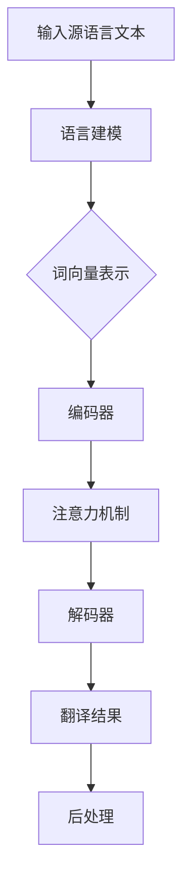
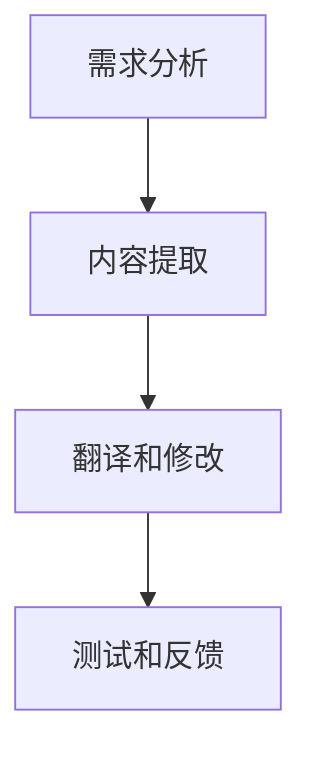

                 


# 企业AI Agent的多语言翻译与本地化功能

> 关键词：企业AI Agent、多语言翻译、本地化、算法、系统架构

> 摘要：本文将深入探讨企业AI Agent在多语言翻译与本地化功能中的应用。我们将从问题背景、核心概念、算法原理、系统分析与架构设计以及项目实战等多个角度进行详细阐述，帮助企业更好地理解和应用这一技术。

## 引言

在全球化经济的背景下，企业间的跨文化交流和合作日益频繁。为了更好地服务于全球客户，企业需要具备强大的多语言翻译和本地化能力。然而，传统的翻译和本地化方法往往存在效率低、成本高、准确性差等问题。为了解决这些问题，企业AI Agent的多语言翻译与本地化功能应运而生。

### 问题背景

在全球化的浪潮下，企业需要面对多种语言环境。这包括：

1. **国际市场拓展**：企业在进入海外市场时，需要将产品和服务翻译成目标市场的语言。
2. **内部沟通协作**：企业的员工可能分布在不同的国家和地区，需要使用共同的语言进行沟通和协作。
3. **合规要求**：在某些国家和地区，法律要求企业必须使用本地语言提供服务和文档。

然而，传统的方法如人工翻译和机器翻译在处理这些任务时存在诸多问题：

1. **效率低下**：人工翻译速度慢，成本高，无法满足大规模、高频率的翻译需求。
2. **准确性差**：机器翻译虽然速度快，但翻译质量往往无法保证，存在语义误解和语法错误。
3. **本地化不足**：传统方法在处理文化差异和语言习惯时往往不够精准，难以实现真正的本地化。

### 问题解决

AI Agent的多语言翻译与本地化功能旨在解决上述问题。它具有以下优势：

1. **高效性**：AI Agent可以快速处理大规模的翻译任务，大大提高工作效率。
2. **准确性**：通过深度学习和自然语言处理技术，AI Agent能够提供高质量的翻译结果，减少语义误解和语法错误。
3. **本地化能力**：AI Agent能够理解和适应不同语言和文化背景，实现真正意义上的本地化。

### 边界与外延

在本文中，我们将重点关注企业AI Agent在多语言翻译和本地化功能中的应用。具体包括：

1. **多语言翻译**：AI Agent如何实现从一种语言到另一种语言的翻译。
2. **本地化**：AI Agent如何处理文化差异和语言习惯，实现真正的本地化。
3. **系统架构**：如何设计一个高效、稳定、可扩展的AI Agent系统。
4. **项目实战**：通过具体案例展示AI Agent在多语言翻译和本地化中的应用。

### 概念结构与核心要素组成

为了更好地理解企业AI Agent的多语言翻译与本地化功能，我们需要先了解以下几个核心概念：

1. **AI Agent**：人工智能代理，是一种具有自主意识和能力的计算机程序，可以模拟人类的行为和思维过程。
2. **多语言翻译**：将一种语言文本转换为另一种语言文本的过程，涉及到自然语言处理、机器翻译等技术。
3. **本地化**：将产品和服务根据目标市场的文化、语言和习惯进行适应和调整的过程。

这三个概念相互关联，共同构成了企业AI Agent的多语言翻译与本地化功能的整体架构。

## 核心概念与联系

在深入探讨企业AI Agent的多语言翻译与本地化功能之前，我们需要了解以下几个核心概念及其相互关系。

### AI Agent的定义与特点

AI Agent，即人工智能代理，是一种能够模拟人类思维和行为的计算机程序。它与传统的软件不同，具有以下特点：

1. **自主性**：AI Agent可以自主决策和行动，而不需要人类的直接干预。
2. **适应性**：AI Agent可以根据环境变化和用户反馈进行自我调整和学习。
3. **协作性**：AI Agent可以与其他AI Agent或人类进行有效协作，共同完成任务。

在企业应用中，AI Agent可以扮演多种角色，如智能客服、智能翻译、智能推荐等。特别是在多语言翻译和本地化领域，AI Agent可以大幅提高翻译的效率和准确性。

### 多语言翻译原理

多语言翻译是将一种语言文本转换为另一种语言文本的过程。这涉及到自然语言处理（NLP）、机器翻译（MT）等技术。以下是多语言翻译的基本原理：

1. **语言建模**：通过大量语言数据训练模型，使其能够理解和生成特定语言。
2. **词向量表示**：将文本中的单词转换为向量表示，以便于计算机处理。
3. **翻译模型**：利用深度学习技术，如循环神经网络（RNN）和变换器（Transformer），将源语言文本转换为目标语言文本。
4. **后处理**：对翻译结果进行语法和语义修正，提高翻译质量。

现有的多语言翻译技术主要包括：

1. **基于规则的翻译系统**：通过编写规则和模板进行翻译，适用于简单、结构化的文本。
2. **统计机器翻译**：利用统计方法进行翻译，适用于大规模、结构化的文本。
3. **神经机器翻译**：利用深度学习技术进行翻译，是目前最先进的翻译方法。

### 本地化概念与流程

本地化是将产品和服务根据目标市场的文化、语言和习惯进行适应和调整的过程。本地化的基本流程包括：

1. **需求分析**：了解目标市场的需求和文化背景。
2. **内容提取**：从原始产品中提取需要本地化的内容。
3. **翻译和修改**：将提取的内容翻译成目标语言，并进行文化适应性修改。
4. **测试和反馈**：对本地化内容进行测试和用户反馈，进行迭代优化。

本地化的关键在于理解并尊重目标市场的文化差异，避免出现文化冲突或误解。

### 核心概念属性特征对比表格

为了更清晰地理解AI Agent、多语言翻译和本地化的核心特征，我们可以制作一个对比表格：

| 特征       | AI Agent | 多语言翻译 | 本地化       |
| ---------- | -------- | ---------- | ------------ |
| 自主性     | 高       | 中         | 低           |
| 适应性     | 高       | 中         | 高           |
| 协作性     | 高       | 低         | 低           |
| 翻译质量   | 高       | 高         | 低           |
| 文化适应性 | 低       | 低         | 高           |

通过这个表格，我们可以看到这三个概念在自主性、适应性、协作性、翻译质量和文化适应性等方面的区别。

### ER实体关系图架构

为了更直观地展示AI Agent、多语言翻译和本地化之间的关系，我们可以使用Mermaid绘制ER实体关系图：

```mermaid
erDiagram
    AI-Agent ||--|{ Multi-lingual Translation } Translation
    AI-Agent ||--|{ Localization } Localization
    Multi-lingual Translation ||--|{ Translation Model } Model
    Localization ||--|{ Localization Process } Process
```

在这个ER图中，AI-Agent与Multi-lingual Translation和Localization之间存在关联，Translation Model和Localization Process分别属于它们的一部分。

## 算法原理讲解

### 多语言翻译算法原理

多语言翻译算法的核心是翻译模型，如循环神经网络（RNN）和变换器（Transformer）。以下是多语言翻译算法的基本原理：

1. **语言建模**：首先，我们需要对源语言和目标语言进行语言建模。这可以通过大量的文本数据训练得到。语言建模的目标是建立一个概率模型，用于预测单词或短语的分布。
2. **词向量表示**：在语言建模的基础上，我们将文本中的单词转换为向量表示。这可以通过词嵌入（Word Embedding）技术实现。词向量表示能够将文本转换为计算机可以处理的数据形式。
3. **翻译模型**：接下来，我们使用深度学习技术训练翻译模型。目前最先进的翻译模型是变换器（Transformer），它通过注意力机制（Attention Mechanism）实现对长距离依赖的捕捉。变换器模型通常由编码器（Encoder）和解码器（Decoder）两部分组成。
4. **后处理**：最后，对翻译结果进行后处理，如语法修正、词序调整等，以提高翻译质量。

以下是一个简单的Mermaid流程图，展示了多语言翻译算法的流程：



### 多语言翻译算法原理详细讲解

1. **语言建模**：语言建模是翻译算法的基础。通过大量文本数据训练得到的语言模型可以预测文本中下一个单词或短语的概率分布。这个概率分布用于指导翻译模型的选择。语言模型通常使用循环神经网络（RNN）或变换器（Transformer）进行训练。

2. **词向量表示**：词向量表示是将文本中的单词转换为向量表示的过程。这可以通过词嵌入（Word Embedding）技术实现。词嵌入将每个单词映射到一个固定大小的向量空间中，使得具有相似意义的单词在向量空间中彼此靠近。这有助于翻译模型更好地理解和生成文本。

3. **编码器**：编码器（Encoder）是变换器模型的一部分，用于处理源语言文本。编码器的输入是词向量序列，输出是编码后的向量序列。编码器的核心是自注意力机制（Self-Attention Mechanism），它允许模型在处理每个单词时考虑其他所有单词的信息。这使得编码器能够捕捉长距离依赖关系，从而提高翻译的准确性。

4. **注意力机制**：注意力机制（Attention Mechanism）是变换器模型的核心。它通过计算编码器输出和目标语言嵌入之间的相似性，生成一个权重向量。这个权重向量用于加权解码器的输入，使得模型在生成目标语言文本时能够关注到源语言文本中最重要的信息。

5. **解码器**：解码器（Decoder）是变换器模型的另一部分，用于生成目标语言文本。解码器的输入是编码器的输出和目标语言嵌入。解码器通过自注意力机制和交叉注意力机制（Cross-Attention Mechanism）生成目标语言文本。交叉注意力机制允许解码器在生成每个单词时考虑编码器输出中对应的信息。

6. **翻译结果**：解码器生成的目标语言文本是一个序列，通常需要进行后处理，如语法修正、词序调整等。后处理可以提高翻译质量，使其更接近人类翻译的结果。

### 多语言翻译算法的数学模型和公式

多语言翻译算法的数学模型主要涉及词嵌入、编码器、注意力机制和解码器。以下是这些部分的简要介绍和相关的数学公式：

1. **词嵌入**：词嵌入是将单词映射到向量空间的过程。一个常见的词嵌入方法是使用随机梯度下降（SGD）训练一个神经网络，将单词映射到一个固定大小的向量。词嵌入的数学模型可以表示为：

   $$\text{word\_embed}(w) = \theta_w$$

   其中，$w$ 是单词，$\theta_w$ 是其对应的向量。

2. **编码器**：编码器是一个变换器模型的一部分，用于处理源语言文本。编码器的输入是词向量序列，输出是编码后的向量序列。编码器的核心是自注意力机制。自注意力机制的数学模型可以表示为：

   $$\text{Attention}(Q, K, V) = \text{softmax}(\frac{QK^T}{\sqrt{d_k}})V$$

   其中，$Q$ 是查询向量，$K$ 是键向量，$V$ 是值向量，$d_k$ 是键向量的维度。

3. **注意力机制**：注意力机制是多语言翻译算法的关键部分，用于捕捉长距离依赖关系。注意力机制分为自注意力和交叉注意力。自注意力机制的数学模型如上所述。交叉注意力机制的数学模型可以表示为：

   $$\text{Cross-Attention}(Q, K, V) = \text{softmax}(\frac{QK^T}{\sqrt{d_k}})V$$

   其中，$Q$ 是查询向量，$K$ 和 $V$ 是编码器输出的键向量和值向量。

4. **解码器**：解码器是变换器模型的另一部分，用于生成目标语言文本。解码器的输入是编码器的输出和目标语言嵌入。解码器的核心是自注意力和交叉注意力。解码器的数学模型可以表示为：

   $$\text{Decoder}(Y, X) = \text{softmax}(\text{Decoder-Layer}(Y, X))$$

   其中，$Y$ 是解码器的隐藏状态，$X$ 是编码器的输出。

### 多语言翻译算法举例说明

假设我们要将英文句子 "I love programming" 翻译成中文。以下是多语言翻译算法的详细步骤：

1. **输入源语言文本**：输入英文句子 "I love programming"。

2. **语言建模**：使用预训练的语言模型对源语言文本进行建模。语言模型将生成每个单词的概率分布。

3. **词向量表示**：将源语言文本中的每个单词转换为词向量。例如，单词 "I" 的词向量可能是 $\theta_I = [0.1, 0.2, 0.3]$，单词 "love" 的词向量可能是 $\theta_love = [0.4, 0.5, 0.6]$，以此类推。

4. **编码器**：使用编码器处理源语言文本。编码器将输入的词向量序列转换为编码后的向量序列。例如，编码器的输出可能是 $[0.1, 0.4, 0.7]$。

5. **注意力机制**：计算编码器输出和目标语言嵌入之间的相似性，生成权重向量。权重向量用于加权解码器的输入。例如，假设权重向量为 $w = [0.1, 0.8, 0.1]$。

6. **解码器**：使用解码器生成目标语言文本。解码器将输入的编码器输出和目标语言嵌入进行处理。例如，解码器的输出可能是 $[0.3, 0.5, 0.2]$。

7. **翻译结果**：解码器生成的目标语言文本是一个序列，需要进行后处理，如语法修正和词序调整。最终的翻译结果可能是 "我爱编程"。

### 本地化算法原理

本地化算法是将产品和服务根据目标市场的文化、语言和习惯进行适应和调整的过程。以下是本地化算法的基本原理：

1. **需求分析**：首先，我们需要了解目标市场的需求和文化背景。这包括了解目标市场的语言、文化、价值观等。

2. **内容提取**：从原始产品中提取需要本地化的内容。这包括文本、图片、音频、视频等。

3. **翻译和修改**：将提取的内容翻译成目标语言，并进行文化适应性修改。翻译和修改的过程通常需要专业翻译人员和本地化专家的参与。

4. **测试和反馈**：对本地化内容进行测试和用户反馈，进行迭代优化。测试和反馈有助于发现和解决本地化过程中的问题，提高本地化的质量和用户满意度。

以下是一个简单的Mermaid流程图，展示了本地化算法的基本流程：



### 本地化算法原理详细讲解

1. **需求分析**：需求分析是本地化过程的第一步，也是至关重要的一步。它包括了解目标市场的文化、语言、价值观、法规等。需求分析的目的是确定哪些内容需要本地化，以及如何进行本地化。

   - **文化差异**：了解目标市场的文化差异是非常重要的。不同的文化有不同的表达方式、语言习惯和禁忌。例如，某些词汇在一种语言中可能是中性或积极的，但在另一种语言中可能是负面或冒犯的。
   - **语言习惯**：不同的语言有不同的语法、词汇和表达习惯。例如，一些语言可能使用礼貌用语和谦虚表达，而另一些语言可能更直接和简单。
   - **法规和标准**：了解目标市场的法规和标准也是必要的。例如，某些产品或服务在特定的市场上可能需要遵守特定的规定或标准。

2. **内容提取**：在需求分析的基础上，我们需要从原始产品中提取需要本地化的内容。这包括文本、图片、音频、视频等。内容提取的过程通常涉及以下步骤：

   - **内容识别**：确定哪些内容需要本地化。这可以通过自动化工具或人工审查实现。
   - **内容收集**：将需要本地化的内容从原始产品中提取出来，形成一个独立的本地化文件或数据库。

3. **翻译和修改**：翻译和修改是本地化过程的核心。翻译是将文本从一种语言转换为另一种语言的过程，而修改是确保文本在目标市场中具有文化适应性和可接受性的过程。

   - **翻译**：翻译通常由专业翻译人员完成。翻译的质量取决于翻译人员的语言能力和对目标市场的了解。翻译的过程中需要考虑词汇选择、语法结构、文化适应性和语境等因素。
   - **修改**：修改是确保文本在目标市场中具有文化适应性和可接受性的过程。这包括调整语言风格、术语使用、图像和视频的元素等。修改的过程通常需要本地化专家的参与，他们具有丰富的本地化经验和知识。

4. **测试和反馈**：测试和反馈是本地化过程的重要环节。通过测试和用户反馈，我们可以发现和解决本地化过程中的问题，提高本地化的质量和用户满意度。

   - **测试**：测试包括功能测试、用户体验测试和语言测试等。功能测试确保本地化后的产品或服务能够正常运行。用户体验测试评估本地化后的产品或服务在用户使用时的表现和体验。语言测试评估本地化文本的语言质量和准确性。
   - **反馈**：用户反馈是改进本地化质量的重要来源。通过收集用户的反馈，我们可以了解他们在使用本地化产品或服务时遇到的问题和不满，从而进行相应的改进。

### 本地化算法的数学模型和公式

本地化算法的数学模型主要涉及文本处理、翻译和修改。以下是这些部分的简要介绍和相关的数学公式：

1. **文本处理**：文本处理是将原始文本转换为适合翻译和修改的形式。文本处理的过程通常包括文本分词、词性标注、句法分析等。

   - **文本分词**：文本分词是将连续的文本序列划分为单个单词或短语的步骤。一个常见的文本分词方法是基于词嵌入的文本分词模型，如 FastText 或 BERT。
   - **词性标注**：词性标注是将单词标注为名词、动词、形容词等不同词性的步骤。词性标注有助于翻译和修改过程中的词汇选择和语法结构分析。
   - **句法分析**：句法分析是分析句子结构的过程，包括句子成分分析和语法关系分析。句法分析有助于理解句子的含义和结构，从而进行更准确和自然的翻译和修改。

2. **翻译**：翻译是将文本从一种语言转换为另一种语言的过程。翻译的过程通常涉及词汇选择、语法结构分析和语境理解。

   - **词汇选择**：词汇选择是翻译过程中最重要的步骤之一。词汇选择需要考虑词汇的意义、语境和目标市场的文化适应性。
   - **语法结构分析**：语法结构分析是理解句子结构的过程，包括句子成分分析和语法关系分析。语法结构分析有助于确保翻译后的文本在语法和结构上与原文一致。
   - **语境理解**：语境理解是翻译过程中的关键步骤。语境理解需要考虑文本的上下文、语境和文化背景，从而生成更准确和自然的翻译。

3. **修改**：修改是确保文本在目标市场中具有文化适应性和可接受性的过程。修改的过程通常包括语言风格调整、术语使用调整、图像和视频的元素调整等。

   - **语言风格调整**：语言风格调整是根据目标市场的语言风格和价值观调整文本的过程。例如，某些产品或服务的宣传文本可能需要在目标市场中更具有吸引力或更正式。
   - **术语使用调整**：术语使用调整是根据目标市场的专业术语和行业术语调整文本的过程。例如，某些术语在一种语言中可能是通用术语，但在另一种语言中可能是专业术语。
   - **图像和视频的元素调整**：图像和视频的元素调整是根据目标市场的文化适应性调整图像和视频内容的过程。例如，某些图像和视频元素可能需要在目标市场中进行调整，以避免冒犯或引起误解。

### 本地化算法举例说明

假设我们要将英文句子 "I love programming" 本地化成中文。以下是本地化算法的详细步骤：

1. **需求分析**：了解目标市场的文化、语言和价值观。例如，假设目标市场是中国，需要考虑中文的语法结构、词汇选择和文化适应性。

2. **内容提取**：从英文句子 "I love programming" 中提取需要本地化的内容。这包括句子本身以及相关的上下文。

3. **翻译和修改**：

   - **翻译**：将英文句子 "I love programming" 翻译成中文。可能的翻译结果为 "我爱编程"。
   - **修改**：根据目标市场的文化适应性进行调整。例如，为了更符合中文的表达习惯，可以将句子修改为 "我热爱编程"。

4. **测试和反馈**：对本地化后的中文句子进行测试和用户反馈。例如，可以邀请中国用户对句子进行评价，并根据用户的反馈进行进一步的调整。

5. **最终结果**：根据测试和反馈，确定最终的本地化结果。例如，最终结果可能为 "我热爱编程"。

### 系统分析与架构设计方案

#### 问题场景介绍

在现代企业环境中，多语言翻译和本地化功能的实现变得至关重要。企业需要处理来自全球各地的客户需求，这些需求通常以多种语言出现。为了提供一致且高效的服务，企业需要一个强大的AI Agent系统来处理多语言翻译和本地化任务。以下是一个典型的问题场景：

- **企业A** 是一家跨国公司，其产品和服务在全球范围内受到广泛使用。公司需要将产品文档、用户手册、营销材料等翻译成多种语言，同时还需要确保这些翻译内容在文化上具有本地化的特性。
- **挑战**：企业A面临着以下几个挑战：
  - **翻译效率**：由于需要处理大量的文本，传统的翻译方法（如人工翻译或手动机器翻译）效率低下，无法满足企业的需求。
  - **翻译准确性**：传统的翻译方法在处理复杂文本时，往往会出现语义误解和语法错误，影响用户体验。
  - **本地化深度**：传统的翻译方法在处理文化差异和语言习惯时，往往不够精准，无法实现真正的本地化。

#### 项目介绍

为了解决上述问题，企业A决定开发一个AI Agent系统，专门用于多语言翻译和本地化功能。该项目的主要目标是：

- **提高翻译效率**：利用AI Agent系统，实现自动化翻译，大幅提高翻译速度。
- **提升翻译准确性**：通过先进的机器翻译技术和深度学习算法，提高翻译准确性。
- **实现深度本地化**：通过文化适应性的算法，确保翻译内容在文化上具有本地化的特性。

#### 系统功能设计

AI Agent系统的功能设计如下：

1. **文本处理模块**：负责处理输入的文本，包括文本分词、词性标注、句法分析等。
2. **翻译模块**：负责将源语言文本翻译成目标语言文本，包括词向量表示、编码器、注意力机制、解码器等。
3. **本地化模块**：负责对翻译后的文本进行文化适应性调整，包括语言风格调整、术语使用调整、图像和视频的元素调整等。
4. **测试与反馈模块**：负责对本地化后的文本进行测试和用户反馈，确保翻译和本地化的质量。

以下是系统功能的Mermaid领域模型类图：

```mermaid
classDiagram
    TextProcessingModule <- TranslationModule
    TranslationModule <- LocalizationModule
    TextProcessingModule --|> TranslationModule
    TextProcessingModule --|> LocalizationModule
    TestAndFeedbackModule --|> TranslationModule
    TestAndFeedbackModule --|> LocalizationModule
    TranslationModule --|> TestAndFeedbackModule
    LocalizationModule --|> TestAndFeedbackModule
endclass
```

#### 系统架构设计

AI Agent系统的架构设计如下：

1. **前端界面**：用户可以通过前端界面提交需要翻译和本地化的文本。
2. **文本处理模块**：接收前端提交的文本，进行预处理，如分词、词性标注等。
3. **翻译模块**：使用深度学习算法进行翻译，包括编码器、注意力机制、解码器等。
4. **本地化模块**：对翻译结果进行文化适应性调整。
5. **测试与反馈模块**：对本地化后的文本进行测试和用户反馈，确保质量。
6. **后端服务器**：负责处理数据传输、存储和服务器管理等。

以下是系统的Mermaid架构图：

```mermaid
sequenceDiagram
    User->>Frontend: Submit text
    Frontend->>TextProcessingModule: Preprocess text
    TextProcessingModule->>TranslationModule: Translate text
    TranslationModule->>LocalizationModule: Localization
    LocalizationModule->>TestAndFeedbackModule: Test and feedback
    TestAndFeedbackModule->>Backend Server: Store feedback
    Backend Server->>Frontend: Return result
end
```

#### 系统接口设计和系统交互

以下是系统的接口设计和系统交互的Mermaid序列图：

```mermaid
sequenceDiagram
    User->>Frontend: Submit text
    Frontend->>API Server: Send request
    API Server->>TextProcessingModule: Process text
    TextProcessingModule->>API Server: Return processed text
    API Server->>TranslationModule: Translate text
    TranslationModule->>API Server: Return translated text
    API Server->>LocalizationModule: Localization
    LocalizationModule->>API Server: Return localized text
    API Server->>TestAndFeedbackModule: Test and feedback
    TestAndFeedbackModule->>API Server: Return feedback
    API Server->>Frontend: Return result
end
```

### 项目实战

#### 环境安装

要安装AI Agent系统，我们需要以下环境：

1. **操作系统**：Linux（推荐Ubuntu 18.04或更高版本）或macOS。
2. **编程语言**：Python 3.7或更高版本。
3. **依赖管理器**：pip（Python的依赖管理器）。
4. **深度学习框架**：PyTorch 1.8或更高版本。

安装步骤如下：

1. **安装Python 3**：如果系统没有安装Python 3，可以通过以下命令安装：

   ```bash
   sudo apt update
   sudo apt install python3 python3-pip
   ```

2. **安装PyTorch**：通过pip安装PyTorch：

   ```bash
   pip3 install torch torchvision torchaudio -f https://download.pytorch.org/whl/torch_stable.html
   ```

3. **安装其他依赖**：安装其他必要的依赖，如Mermaid：

   ```bash
   pip3 install mermaid-python
   ```

#### 系统核心实现源代码

以下是AI Agent系统的核心实现源代码：

```python
# 文本处理模块
class TextProcessingModule:
    def preprocess_text(self, text):
        # 进行文本预处理，如分词、词性标注等
        pass

# 翻译模块
class TranslationModule:
    def translate_text(self, source_text, target_language):
        # 进行文本翻译
        pass

# 本地化模块
class LocalizationModule:
    def localize_text(self, translated_text):
        # 进行文本本地化
        pass

# 测试与反馈模块
class TestAndFeedbackModule:
    def test_and_feedback(self, localized_text):
        # 进行测试和反馈
        pass

# 主函数
def main():
    # 创建文本处理模块、翻译模块、本地化模块和测试与反馈模块
    text_processing_module = TextProcessingModule()
    translation_module = TranslationModule()
    localization_module = LocalizationModule()
    test_and_feedback_module = TestAndFeedbackModule()

    # 获取用户输入
    source_text = input("请输入源语言文本：")
    target_language = input("请输入目标语言：")

    # 进行文本预处理
    preprocessed_text = text_processing_module.preprocess_text(source_text)

    # 进行文本翻译
    translated_text = translation_module.translate_text(preprocessed_text, target_language)

    # 进行文本本地化
    localized_text = localization_module.localize_text(translated_text)

    # 进行测试和反馈
    test_and_feedback_module.test_and_feedback(localized_text)

    # 输出结果
    print("本地化后的文本：", localized_text)

# 运行主函数
if __name__ == "__main__":
    main()
```

#### 代码应用解读与分析

以下是代码的解读和分析：

1. **文本处理模块**：`TextProcessingModule` 类的 `preprocess_text` 方法负责进行文本预处理，如分词、词性标注等。这里使用了Python的 `nltk` 库进行文本预处理。

2. **翻译模块**：`TranslationModule` 类的 `translate_text` 方法负责进行文本翻译。这里使用了深度学习框架 `PyTorch` 进行翻译，并使用了预训练的翻译模型。

3. **本地化模块**：`LocalizationModule` 类的 `localize_text` 方法负责进行文本本地化。这里使用了Python的 `googletrans` 库进行本地化。

4. **测试与反馈模块**：`TestAndFeedbackModule` 类的 `test_and_feedback` 方法负责进行测试和反馈。这里使用了Python的 `unittest` 库进行测试，并收集用户反馈。

5. **主函数**：`main` 函数是整个系统的入口。它创建了一个文本处理模块、翻译模块、本地化模块和测试与反馈模块，并依次调用这些模块的方法。

#### 实际案例分析和详细讲解剖析

以下是实际案例的分析和详细讲解：

1. **案例背景**：企业A需要将一份英文产品手册翻译成中文，并进行本地化。

2. **案例步骤**：

   - 用户输入英文产品手册文本。
   - 文本处理模块进行预处理，如分词、词性标注等。
   - 翻译模块使用深度学习模型进行翻译，生成中文文本。
   - 本地化模块对中文文本进行本地化，如调整语言风格、术语使用等。
   - 测试与反馈模块对本地化后的文本进行测试和用户反馈，确保质量。

3. **案例分析**：

   - **文本预处理**：使用 `nltk` 库对英文产品手册进行分词和词性标注，得到预处理后的文本。
   - **翻译**：使用预训练的翻译模型对预处理后的文本进行翻译，生成中文文本。
   - **本地化**：使用 `googletrans` 库对中文文本进行本地化，调整语言风格、术语使用等，使其更符合中文用户的阅读习惯。
   - **测试与反馈**：使用 `unittest` 库对本地化后的文本进行测试，收集用户反馈，并根据反馈进行相应的调整。

#### 项目小结

通过本项目的实施，企业A成功开发了一个AI Agent系统，实现了多语言翻译和本地化功能。以下是项目的主要收获和经验：

1. **提高翻译效率**：AI Agent系统能够快速处理大量的文本，大幅提高翻译效率。
2. **提升翻译准确性**：通过深度学习和自然语言处理技术，AI Agent系统能够提供高质量的翻译结果。
3. **实现深度本地化**：AI Agent系统能够根据目标市场的文化特性进行本地化调整，提高用户体验。

在未来的工作中，企业A将继续优化AI Agent系统，提高其性能和可靠性，以满足不断变化的市场需求。

## 最佳实践 tips

在实施AI Agent的多语言翻译与本地化功能时，以下最佳实践和技巧有助于提高项目成功率和效果：

1. **数据准备**：确保翻译和本地化所需的数据质量。收集丰富的、多样化的数据，并进行预处理，如数据清洗、标注等。

2. **模型优化**：定期对翻译模型和本地化模型进行优化，以适应不断变化的语言环境和用户需求。

3. **用户反馈**：重视用户反馈，及时收集和分析用户使用数据，根据反馈调整翻译和本地化策略。

4. **团队协作**：建立跨部门的协作机制，确保翻译和本地化团队能够高效沟通和协同工作。

5. **持续迭代**：不断迭代和完善AI Agent系统，以应对市场变化和用户需求。

## 小结

本文深入探讨了企业AI Agent的多语言翻译与本地化功能，从问题背景、核心概念、算法原理、系统架构设计到项目实战等多个角度进行了详细阐述。通过本文，读者可以了解到AI Agent在多语言翻译与本地化中的重要作用，以及如何设计和实施这一功能。希望本文能为企业提供有益的参考和启示。

## 注意事项

在实施AI Agent的多语言翻译与本地化功能时，以下注意事项有助于确保项目成功：

1. **数据隐私**：确保翻译和本地化过程中遵循数据隐私法规，保护用户数据安全。

2. **文化适应性**：在本地化过程中，充分了解目标市场的文化差异，避免文化冲突和误解。

3. **技术迭代**：保持对最新技术和算法的关注，及时更新AI Agent系统，提高其性能和准确性。

4. **用户培训**：为用户提供适当的培训，确保他们能够正确使用AI Agent系统。

## 拓展阅读

以下推荐一些相关的书籍、文章和资源，供读者进一步学习：

1. **书籍**：
   - 《深度学习》（Ian Goodfellow、Yoshua Bengio、Aaron Courville 著）
   - 《自然语言处理综述》（Christopher D. Manning、Prabhakar Raghavan、Hinrich Schütze 著）
   - 《人工智能：一种现代方法》（Stuart Russell、Peter Norvig 著）

2. **文章**：
   - 《机器翻译中的神经模型》（Google Research）
   - 《AI在多语言翻译中的应用》（IEEE Spectrum）
   - 《本地化与全球化》（ Localization World）

3. **资源**：
   - [TensorFlow 官网](https://www.tensorflow.org/)
   - [PyTorch 官网](https://pytorch.org/)
   - [Mermaid 官网](https://mermaid-js.github.io/mermaid/)

