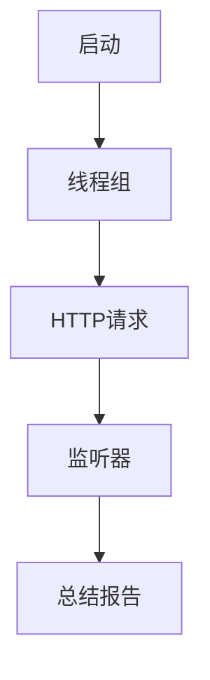
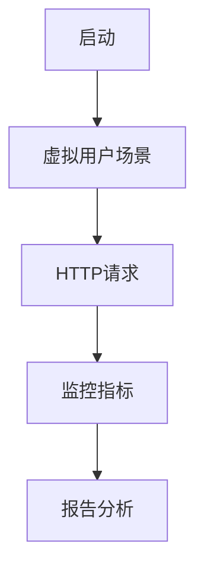
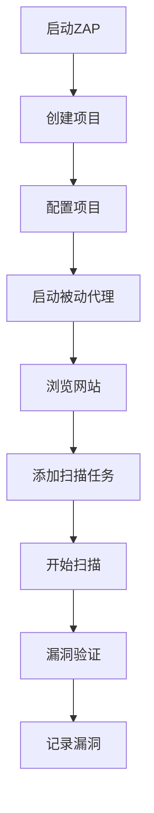
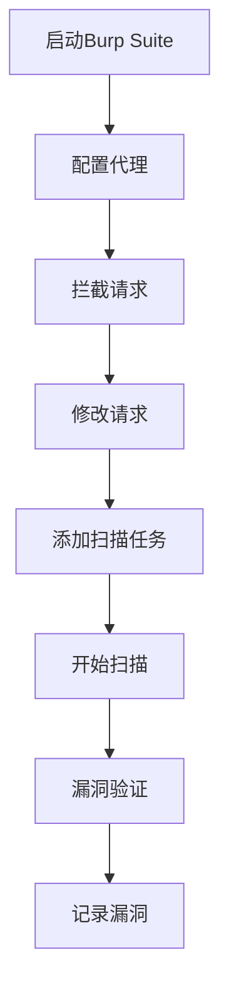

                 


## 文章标题：企业级AI Agent的测试与质量保证策略

## 关键词：企业级AI Agent，测试方法，质量保证，测试工具，案例分析

## 摘要

随着人工智能技术的发展，AI Agent在企业级应用中逐渐成为创新的核心。然而，AI Agent的开发与测试面临着诸多挑战，确保其质量和可靠性至关重要。本文旨在探讨企业级AI Agent的测试与质量保证策略，通过系统分析测试方法、工具以及实践案例，为企业提供切实可行的质量保证路径。

## 目录大纲

----------------------------------------------------------------

# 第一部分: 引言与背景

## 第1章: 引言

### 1.1.1 问题背景

#### 企业级AI Agent的应用现状与挑战

- AI Agent在金融、电商、医疗等领域的应用案例
- 企业面临的数据隐私、安全性和性能挑战

#### 测试与质量保证在AI Agent开发中的重要性

- AI Agent测试的复杂性
- 质量保证对于企业竞争力的影响

### 1.1.2 问题描述

#### AI Agent的特性与测试难点

- AI Agent的动态行为与复杂性
- 数据驱动的测试挑战

#### 质量保证策略的核心目标与挑战

- 质量保证的生命周期模型
- 实现全面质量监控的难点

### 1.1.3 问题解决

#### 系统性测试框架设计

- 测试框架的结构与功能
- 自动化测试的引入

#### 质量保证策略的制定与实施

- 质量保证策略的制定原则
- 质量保证的实施步骤

### 1.1.4 边界与外延

#### AI Agent的类型与应用领域

- 不同类型AI Agent的特点
- AI Agent在不同领域的应用前景

#### 测试与质量保证策略的适用范围

- 策略的通用性与针对性
- 不同规模企业实施策略的差异

## 1.2 核心概念

### 1.2.1 AI Agent定义与分类

#### AI Agent的基本概念

- AI Agent的定义与作用
- AI Agent的分类标准

#### 不同类型AI Agent的特性和应用场景

- 反应式Agent
- 目标导向Agent
- 学习型Agent

### 1.2.2 测试与质量保证定义与联系

#### 测试与质量保证的基本概念

- 测试的定义与目标
- 质量保证的定义与意义

#### 测试与质量保证之间的联系和区别

- 质量保证在测试过程中的作用
- 测试与质量保证的差异与衔接

## 1.3 质量保证策略

### 1.3.1 质量保证模型

#### 质量保证生命周期模型

- 开发与测试阶段的关系
- 质量保证活动的阶段性划分

#### 质量保证关键要素

- 质量目标的确立
- 质量度量与评估

### 1.3.2 测试策略

#### 功能测试策略

- 功能测试的流程与要点
- 功能测试的自动化策略

#### 性能测试策略

- 性能测试的目标与指标
- 性能测试的实施步骤

#### 安全测试策略

- 安全测试的重要性与内容
- 安全测试的实施策略

## 1.4 本章小结

#### AI Agent测试与质量保证的核心要点

- 测试方法的选择与应用
- 质量保证策略的制定与执行

#### 企业实施AI Agent测试与质量保证的可行路径

- 针对性策略的实施
- 跨部门协作的重要性

----------------------------------------------------------------

# 第二部分: AI Agent测试方法与工具

## 第2章: AI Agent测试方法

### 2.1 功能测试

#### 2.1.1 功能测试概述

- 功能测试的目的和方法
- 功能测试的主要类型

#### 2.1.2 功能测试案例

- 功能测试案例设计与实现
- 功能测试结果分析

### 2.2 性能测试

#### 2.2.1 性能测试概述

- 性能测试的目的和方法
- 性能测试的主要类型

#### 2.2.2 性能测试案例

- 性能测试案例设计与实现
- 性能测试结果分析

### 2.3 安全测试

#### 2.3.1 安全测试概述

- 安全测试的目的和方法
- 安全测试的主要类型

#### 2.3.2 安全测试案例

- 安全测试案例设计与实现
- 安全测试结果分析

## 第3章: AI Agent测试工具

### 3.1 测试工具概述

- 常用测试工具的分类与选择
- 测试工具的集成与使用

### 3.2 功能测试工具

#### 3.2.1 Selenium

- Selenium的功能与特点
- Selenium的使用方法

#### 3.2.2 Appium

- Appium的功能与特点
- Appium的使用方法

### 3.3 性能测试工具

#### 3.3.1 JMeter

- JMeter的功能与特点
- JMeter的使用方法

#### 3.3.2 LoadRunner

- LoadRunner的功能与特点
- LoadRunner的使用方法

### 3.4 安全测试工具

#### 3.4.1 OWASP ZAP

- OWASP ZAP的功能与特点
- OWASP ZAP的使用方法

#### 3.4.2 Burp Suite

- Burp Suite的功能与特点
- Burp Suite的使用方法

## 第4章: AI Agent测试案例

### 4.1 案例一：某电商平台AI Agent测试

#### 4.1.1 案例背景

- 案例简介
- 测试目标

#### 4.1.2 测试设计

- 功能测试设计
- 性能测试设计
- 安全测试设计

#### 4.1.3 测试实施

- 测试环境搭建
- 测试用例执行
- 测试结果分析

### 4.2 案例二：某金融企业AI Agent测试

#### 4.2.1 案例背景

- 案例简介
- 测试目标

#### 4.2.2 测试设计

- 功能测试设计
- 性能测试设计
- 安全测试设计

#### 4.2.3 测试实施

- 测试环境搭建
- 测试用例执行
- 测试结果分析

----------------------------------------------------------------

# 第三部分: 质量保证策略与实践

## 第5章: 质量保证策略

### 5.1 质量保证模型

#### 5.1.1 V模型

- V模型的核心概念
- V模型在AI Agent开发中的应用

## 5.2 实践经验与最佳实践

### 5.2.1 实践经验总结

- AI Agent测试中的常见问题与解决策略
- 质量保证策略的调整与实践效果

### 5.2.2 最佳实践 tips

- 测试与开发流程的优化建议
- 质量保证团队的角色与职责

## 5.3 小结与展望

### 5.3.1 小结

- AI Agent测试与质量保证的关键要素
- 企业在实施中的难点与对策

### 5.3.2 展望

- AI Agent测试领域的发展趋势
- 未来质量保证策略的优化方向

----------------------------------------------------------------

## 1.1.1 问题背景

企业级AI Agent的应用现状与挑战

随着人工智能技术的迅猛发展，AI Agent作为一种自动化决策系统，在金融、电商、医疗等多个领域得到了广泛应用。AI Agent能够帮助企业提高运营效率、优化决策流程、降低成本，并在某些特定场景中展现出比人类更出色的性能。然而，AI Agent的开发与测试过程同样面临着诸多挑战。

首先，AI Agent的应用场景复杂多样，每个行业都有其特定的需求与约束。例如，在金融领域，AI Agent需要处理大量的金融数据，进行风险评估和投资决策，这就要求其具备高效的数据处理能力和精确的决策能力。而在医疗领域，AI Agent需要与医疗专家系统协同工作，支持临床诊断和治疗方案推荐，这又要求AI Agent具备一定的医学知识库和智能推理能力。

其次，AI Agent的测试与质量保证过程具有高度的复杂性。传统的软件测试方法在面对AI Agent时显得力不从心，因为AI Agent的行为是动态的、不确定的，甚至可能出现非预期的情况。例如，AI Agent在处理异常数据时可能产生错误的决策，或者在复杂环境中出现性能下降的情况。因此，如何设计有效的测试用例，如何评估AI Agent的决策质量，都是AI Agent测试与质量保证中面临的重大挑战。

再次，数据隐私和安全问题是AI Agent应用中不可忽视的重要方面。AI Agent通常需要处理敏感的企业数据，如用户个人信息、金融交易记录等。如何确保这些数据的安全，防止数据泄露，是AI Agent测试与质量保证中必须考虑的问题。此外，AI Agent的透明度和可解释性也是当前研究的热点，如何使AI Agent的决策过程透明，便于用户监督和审查，是提高AI Agent可信度的重要途径。

测试与质量保证在AI Agent开发中的重要性

在AI Agent开发过程中，测试与质量保证扮演着至关重要的角色。首先，通过严格的测试，可以确保AI Agent在各种应用场景下的可靠性和稳定性，避免因系统故障或决策错误导致的经济损失或社会影响。其次，通过质量保证，可以确保AI Agent满足用户需求和业务目标，提高用户满意度，增强企业的市场竞争力。

具体来说，测试与质量保证在AI Agent开发中的重要性体现在以下几个方面：

1. 提高系统可靠性：AI Agent通常用于关键业务决策，其可靠性直接关系到企业的运营效率和经济效益。通过全面的测试和质量保证，可以发现和修复系统中的缺陷，提高系统的稳定性。

2. 保障数据安全：AI Agent在处理敏感数据时，必须确保数据的安全性和隐私保护。质量保证过程需要关注数据加密、访问控制等方面，确保数据不被未授权访问或泄露。

3. 提升用户体验：良好的质量保证能够确保AI Agent在用户交互中的稳定性和易用性，提升用户体验，增加用户对企业的信任度。

4. 促进持续改进：通过测试和质量保证，可以发现系统中的潜在问题，为后续的迭代和优化提供依据，推动系统的持续改进。

总之，AI Agent的测试与质量保证不仅是确保其可靠性和安全性的必要手段，也是提升企业核心竞争力的重要策略。在AI Agent开发过程中，需要充分认识到测试与质量保证的重要性，建立健全的质量保证体系，确保AI Agent能够稳定、可靠地为企业服务。

## 1.1.2 问题描述

AI Agent的特性与测试难点

AI Agent作为企业级应用的重要组成部分，其特性和功能相较于传统软件有着显著的区别。首先，AI Agent是动态、智能化的系统，其行为不仅依赖于预设的逻辑和算法，还与实时数据和外部环境紧密相关。这种动态性使得AI Agent在测试过程中面临着诸多挑战。

1. **动态行为**：AI Agent可以根据实时数据进行决策和调整行为，这意味着测试人员需要设计能够适应动态行为的测试用例，并模拟各种可能的环境和场景。

2. **不确定性**：由于AI Agent的学习和自适应能力，其行为具有一定的随机性和不确定性。这种不确定性使得传统的确定性测试方法难以完全适用，需要引入更多的随机性和模拟测试。

3. **依赖性**：AI Agent通常需要依赖外部系统、数据和接口进行工作，测试时需要确保这些依赖关系的可靠性和稳定性。

4. **非预期情况**：AI Agent在复杂和动态的环境中可能会出现非预期的行为，例如，错误的决策或性能瓶颈。这些非预期情况在测试中往往难以预见，需要通过复杂的场景模拟和异常处理测试来发现。

质量保证策略的核心目标与挑战

质量保证策略的核心目标是确保AI Agent在各个应用场景下都能表现出高可靠性和高效性。具体而言，质量保证策略需要涵盖以下几个方面：

1. **功能性**：确保AI Agent能够实现预定的功能和业务逻辑，满足用户需求和业务目标。

2. **性能**：评估AI Agent在不同负载和场景下的性能表现，确保其能够快速、准确地响应。

3. **安全性**：确保AI Agent在处理敏感数据时能够防止数据泄露和未授权访问，提高系统的安全性。

4. **可解释性**：增强AI Agent决策过程的透明度和可解释性，使其能够被用户和监管机构理解和接受。

然而，在实施质量保证策略时，企业面临以下挑战：

1. **测试复杂度高**：AI Agent的动态行为和不确定性使得测试复杂度显著增加，需要更多的测试资源和时间。

2. **测试数据不足**：AI Agent的训练和测试通常需要大量的高质量数据，而在实际应用中获取这些数据可能存在困难。

3. **技术实现难度大**：AI Agent的测试和质量保证依赖于先进的测试工具和技术，企业需要具备相应的技术能力。

4. **跨部门协作**：AI Agent的质量保证需要涉及开发、数据、运维等多个部门，跨部门协作的难度较大。

系统性测试框架设计

为了应对AI Agent测试与质量保证的复杂性，企业需要设计一个系统性的测试框架。这个框架应该包括以下关键要素：

1. **测试策略**：明确测试的目标、类型和优先级，制定详细的测试计划。

2. **测试环境**：构建能够模拟真实应用场景的测试环境，包括硬件、软件和数据资源。

3. **测试用例**：设计覆盖功能、性能、安全等方面的测试用例，确保测试的全面性和针对性。

4. **测试执行**：自动化执行测试用例，并监控测试结果。

5. **测试报告**：生成详细的测试报告，包括测试覆盖情况、缺陷统计、性能指标等。

通过以上设计，企业可以有效地管理AI Agent的测试与质量保证过程，确保系统的可靠性和质量。

### 1.1.4 边界与外延

AI Agent的类型与应用领域

AI Agent可以按不同的分类标准进行分类，常见的分类标准包括基于功能、应用场景、学习方式等。以下是一些主要的AI Agent类型及其应用领域：

1. **基于功能的分类**：
   - **反应式Agent**：这类Agent基于环境感知来做出反应，不需要记忆和学习。例如，智能客服机器人、智能监控系统等。
   - **目标导向Agent**：这类Agent有明确的目标，并通过学习不断优化行为。例如，智能导航系统、智能交易系统等。
   - **学习型Agent**：这类Agent能够从环境中学习，不断优化其行为。例如，智能推荐系统、智能诊断系统等。

2. **基于应用场景的分类**：
   - **电子商务Agent**：在电商平台中，AI Agent可以帮助用户进行个性化推荐、智能客服等。
   - **金融领域Agent**：在金融领域，AI Agent可以用于风险管理、投资顾问、信用评估等。
   - **医疗领域Agent**：在医疗领域，AI Agent可以辅助医生进行诊断、治疗方案推荐、患者管理等。
   - **工业领域Agent**：在工业领域，AI Agent可以用于生产调度、设备维护、质量控制等。

AI Agent在不同领域的应用前景

随着人工智能技术的不断进步，AI Agent在各个领域的应用前景越来越广阔。以下是一些具体的应用前景：

1. **提高效率**：在电子商务和金融领域，AI Agent可以通过智能化的决策和推荐，提高业务流程的效率，减少人工干预。

2. **个性化服务**：在医疗和工业领域，AI Agent可以通过学习用户行为和需求，提供个性化的服务和建议，提高用户体验和生产效率。

3. **智能决策**：在金融和工业领域，AI Agent可以通过复杂的数据分析和智能推理，支持企业的决策过程，提高决策的准确性和效率。

4. **自动化管理**：在工业和生产领域，AI Agent可以通过自动化的管理和控制，减少人工干预，提高生产效率和质量。

测试与质量保证策略的适用范围

测试与质量保证策略的适用范围取决于AI Agent的具体应用领域和业务需求。以下是一些具体的适用范围：

1. **企业规模**：对于大型企业，其业务复杂度和系统规模较大，测试与质量保证策略需要更加全面和严格，确保系统的稳定性和可靠性。

2. **行业特点**：不同行业对AI Agent的需求和期望有所不同，例如，金融领域对安全性和合规性的要求更高，而医疗领域对数据隐私和合规性的要求更为严格。

3. **技术成熟度**：对于技术成熟度较高的领域，例如电子商务和金融，测试与质量保证策略可以更加注重性能和用户体验；而对于技术成熟度较低的领域，例如医疗和工业，测试与质量保证策略需要更加注重数据质量和系统的稳定性。

总之，测试与质量保证策略需要根据具体的业务需求和行业特点进行定制，确保AI Agent在不同应用领域中的可靠性和有效性。

### 1.2 核心概念

AI Agent定义与分类

#### AI Agent的基本概念

AI Agent，即人工智能代理，是一种能够自主执行任务、与外界环境进行交互的智能实体。它基于人工智能技术，通过感知环境、决策执行和反馈调整，实现自主学习和优化行为。AI Agent的主要功能包括环境感知、目标设定、决策制定和任务执行。

AI Agent的核心特点如下：

1. **自主性**：AI Agent能够自主地决策和执行任务，不受人工干预。
2. **适应性**：AI Agent能够根据环境和任务的变化，动态调整行为和策略。
3. **学习性**：AI Agent具备学习能力，可以通过数据积累和模型训练，提高任务执行效率。
4. **交互性**：AI Agent能够与用户、设备和系统进行交互，提供智能服务。

#### 不同类型AI Agent的特性和应用场景

1. **反应式Agent**：

   - **特性**：反应式Agent通过感知环境中的输入，立即做出反应。它不需要记忆和历史信息，仅依赖当前的感知数据做出决策。
   - **应用场景**：智能监控系统、智能家居控制系统、智能客服机器人等。

2. **目标导向Agent**：

   - **特性**：目标导向Agent具有明确的目标，并采用计划和控制机制来实现目标。它可以在多个步骤中考虑行动，通过目标和路径规划来完成任务。
   - **应用场景**：智能导航系统、智能配送系统、智能交易系统等。

3. **学习型Agent**：

   - **特性**：学习型Agent通过数据和学习算法，不断优化其行为和决策。它能够从经验中学习，适应不断变化的环境。
   - **应用场景**：智能推荐系统、智能诊断系统、智能金融风控系统等。

#### 对比表格

| 类别       | 特性                                   | 应用场景               |
|------------|----------------------------------------|-----------------------|
| 反应式Agent | 立即反应环境变化                       | 智能监控、智能客服     |
| 目标导向Agent | 规划路径和步骤，实现目标               | 智能导航、智能配送     |
| 学习型Agent | 从经验中学习，不断优化决策             | 智能推荐、智能诊断     |

#### ER实体关系图架构

```mermaid
erDiagram
  AI Agent ||--|{ 环境感知 }
  AI Agent ||--|{ 决策制定 }
  AI Agent ||--|{ 任务执行 }
  AI Agent ||--|{ 自主性 }
  AI Agent ||--|{ 适应性 }
  AI Agent ||--|{ 学习性 }
  AI Agent ||--|{ 交互性 }
```

### 测试与质量保证定义与联系

#### 测试与质量保证的基本概念

- **测试**：测试是指对软件或系统进行验证和确认的过程，旨在发现缺陷、验证功能和评估性能。测试的主要目标是确保软件或系统能够满足预定的需求和规范。
- **质量保证**：质量保证是指通过规划、实施和管理一系列活动，确保软件或系统满足质量要求。质量保证的核心是预防缺陷，提高软件或系统的可靠性和用户满意度。

#### 测试与质量保证之间的联系和区别

- **联系**：
  - 测试是质量保证的一个重要环节，通过测试可以验证质量保证活动的效果。
  - 质量保证活动为测试提供了标准和框架，确保测试的有效性和全面性。

- **区别**：
  - 测试注重发现缺陷，通过执行预定的测试用例来评估系统的性能和功能。
  - 质量保证则更注重预防缺陷，通过制定策略、流程和标准来提高系统的整体质量。

#### 质量保证在测试过程中的作用

- **确保测试的全面性**：通过质量保证，可以确保测试覆盖所有关键功能和性能要求，避免遗漏重要部分。
- **提高测试效率**：通过制定有效的测试策略和流程，可以优化测试资源的使用，提高测试效率。
- **提供反馈和改进**：质量保证过程为测试提供了反馈机制，帮助识别问题并提出改进措施，确保系统的持续优化。

#### 测试与质量保证的差异与衔接

- **差异**：
  - 测试是具体的技术活动，而质量保证是一种管理活动。
  - 测试主要关注产品的输出结果，而质量保证关注产品的整个过程。

- **衔接**：
  - 质量保证通过制定标准和流程，为测试提供指导和依据。
  - 测试结果作为质量保证的一个重要输入，用于评估质量保证的效果和改进方向。

总之，测试与质量保证在AI Agent开发中相互关联，共同作用，确保系统的可靠性和高质量。通过合理衔接测试与质量保证，企业可以建立高效的测试和质量保证体系，推动AI Agent的稳定应用和发展。

### 1.3 质量保证策略

#### 质量保证模型

质量保证模型是确保软件或系统达到预定质量标准的重要框架。在AI Agent开发中，常用的质量保证模型包括V模型、PDCA模型和DevOps模型。以下是这些模型的核心概念和特点：

1. **V模型**：

   - **核心概念**：V模型是一种将需求分析、设计和测试紧密结合的质量保证模型。它强调开发过程中的阶段性验证和确认，确保每个阶段的产品输出都经过严格测试。
   - **特点**：
     - 线性顺序：从需求分析到测试，每个阶段都依赖前一个阶段的输出。
     - 验证与确认：在每个开发阶段结束后，进行相应的验证和确认活动，确保符合需求和规范。
     - 早发现、早修复：通过早期的测试和验证，可以及早发现和修复缺陷，减少后期修复成本。

2. **PDCA模型**：

   - **核心概念**：PDCA模型是一种持续改进的循环模型，包括计划（Plan）、执行（Do）、检查（Check）和行动（Act）四个步骤。
   - **特点**：
     - 持续改进：通过不断循环PDCA过程，持续优化系统质量和性能。
     - 实际应用：PDCA模型适用于各个开发阶段，特别是项目管理和质量控制。
     - 数据驱动：通过数据分析和检查结果，指导后续的改进行动。

3. **DevOps模型**：

   - **核心概念**：DevOps模型是将开发（Development）和运营（Operations）紧密结合的质量保证模型，强调自动化、持续集成和持续交付。
   - **特点**：
     - 自动化测试：通过自动化测试工具，提高测试效率和覆盖率。
     - 持续集成与持续交付：实现代码和测试的持续集成和交付，确保快速响应需求变化。
     - 跨部门协作：通过跨部门协作，提高系统的整体质量和稳定性。

#### 质量保证生命周期模型

质量保证生命周期模型描述了从项目启动到项目结束的整个过程，包括多个阶段和活动。以下是质量保证生命周期模型的主要阶段和关键活动：

1. **项目启动阶段**：
   - **需求分析**：明确项目的目标和需求，制定详细的需求文档。
   - **风险评估**：识别项目中的风险，制定风险管理计划。

2. **规划阶段**：
   - **测试策略制定**：确定测试的目标、类型和优先级，制定详细的测试计划。
   - **测试环境搭建**：构建用于测试的硬件、软件和数据环境。

3. **执行阶段**：
   - **测试用例设计**：设计功能、性能和安全等方面的测试用例。
   - **测试执行**：执行测试用例，记录测试结果和发现的问题。
   - **缺陷管理**：记录、跟踪和管理测试中发现的缺陷。

4. **评估阶段**：
   - **测试报告**：生成详细的测试报告，包括测试覆盖情况、缺陷统计和性能指标。
   - **质量评估**：评估系统的整体质量和满足度，确定是否达到项目目标。

5. **收尾阶段**：
   - **总结与反馈**：总结测试过程的经验和教训，为后续项目提供改进建议。
   - **项目交付**：完成项目的交付，确保系统稳定运行。

#### 质量保证关键要素

1. **质量目标**：
   - 明确项目的质量目标，包括功能性、性能、安全性和用户满意度等方面。
   - 制定具体的质量指标，如缺陷密度、响应时间和安全合规性等。

2. **质量度量与评估**：
   - 采用定量和定性的方法，对系统的质量进行度量。
   - 定期进行质量评估，识别问题和改进方向。

3. **过程改进**：
   - 根据测试结果和评估反馈，持续改进测试过程和策略。
   - 采用过程改进工具和方法，如六西格玛、敏捷开发等。

4. **资源管理**：
   - 确保测试资源的合理分配，包括人员、设备和时间。
   - 建立资源管理和调度机制，提高资源利用率。

5. **文档管理**：
   - 建立和维护详细的测试文档，包括测试计划、测试用例、缺陷报告等。
   - 确保文档的完整性和一致性，便于后续审计和追溯。

通过上述质量保证模型和关键要素，企业可以系统地实施质量保证策略，确保AI Agent的高质量和稳定性。

### 1.3.2 测试策略

在AI Agent的开发过程中，测试策略是确保系统质量的关键环节。一个完善的测试策略应该涵盖功能测试、性能测试和安全测试等多个方面。以下是具体的功能测试、性能测试和安全测试策略：

#### 功能测试策略

功能测试是验证AI Agent是否按照预定的功能要求和业务逻辑正常运行的重要手段。功能测试策略主要包括以下几个方面：

1. **测试需求分析**：
   - 根据AI Agent的功能要求和业务场景，明确测试的目标和范围。
   - 制定详细的测试需求文档，明确每个功能模块的测试点。

2. **测试用例设计**：
   - 设计覆盖所有功能需求的测试用例，确保每个功能点都被测试到。
   - 包括正常情况、异常情况和边界条件等不同类型的测试用例。

3. **测试环境准备**：
   - 搭建与实际运行环境相似的测试环境，确保测试结果的真实性和有效性。
   - 确保测试环境中所有依赖系统和数据都准备就绪。

4. **测试执行**：
   - 使用自动化测试工具执行测试用例，提高测试效率和覆盖率。
   - 对测试结果进行详细的记录和分析，识别和记录发现的缺陷。

5. **缺陷管理**：
   - 建立缺陷管理流程，确保每个缺陷都被及时记录、跟踪和修复。
   - 定期回顾和总结缺陷，分析缺陷的根本原因，防止重复发生。

6. **测试报告**：
   - 编写详细的测试报告，包括测试覆盖情况、缺陷统计、测试结论和建议等。
   - 测试报告应定期提交给项目团队和管理层，作为项目进展和质量评估的依据。

#### 性能测试策略

性能测试是评估AI Agent在不同负载和场景下的性能表现，确保其能够满足性能要求的关键环节。性能测试策略主要包括以下几个方面：

1. **性能需求分析**：
   - 根据业务需求和性能指标，明确性能测试的目标和指标。
   - 设计合适的性能场景和负载模型，模拟实际运行环境。

2. **测试用例设计**：
   - 设计涵盖各种负载和场景的性能测试用例，确保测试覆盖所有关键性能点。
   - 包括高并发、大负载、长时间运行等不同类型的测试用例。

3. **测试环境准备**：
   - 搭建与实际运行环境相似的测试环境，确保测试结果的真实性和有效性。
   - 确保测试环境中硬件、软件和网络配置能够满足性能测试的需求。

4. **测试执行**：
   - 使用性能测试工具执行测试用例，监控系统的性能指标，如响应时间、吞吐量、资源利用率等。
   - 对测试结果进行实时监控和记录，确保测试过程中系统的稳定性和可靠性。

5. **性能分析**：
   - 分析测试结果，识别性能瓶颈和问题点，制定优化措施。
   - 根据性能指标和业务需求，调整系统的配置和优化策略。

6. **性能报告**：
   - 编写详细的性能测试报告，包括测试覆盖情况、性能指标分析、优化建议等。
   - 性能测试报告应定期提交给项目团队和管理层，作为项目优化和决策的依据。

#### 安全测试策略

安全测试是确保AI Agent在处理敏感数据和安全场景下能够抵御攻击和漏洞的重要手段。安全测试策略主要包括以下几个方面：

1. **安全需求分析**：
   - 根据业务需求和安全标准，明确安全测试的目标和范围。
   - 设计涵盖各种安全威胁和漏洞的测试用例，确保测试覆盖所有关键安全点。

2. **测试用例设计**：
   - 设计包括常见攻击、漏洞扫描和渗透测试等不同类型的安全测试用例。
   - 包括对输入数据、系统配置和外部接口等方面的安全测试。

3. **测试环境准备**：
   - 搭建与实际运行环境相似的安全测试环境，确保测试结果的真实性和有效性。
   - 确保测试环境中包含各种安全防护设备和工具。

4. **测试执行**：
   - 使用安全测试工具执行测试用例，模拟各种攻击场景，检测系统的安全漏洞和弱点。
   - 对测试结果进行实时监控和记录，确保测试过程中系统的安全性和稳定性。

5. **安全分析**：
   - 分析测试结果，识别系统的安全漏洞和风险点，制定修复和防护措施。
   - 根据安全指标和业务需求，调整系统的安全配置和防护策略。

6. **安全报告**：
   - 编写详细的安全测试报告，包括测试覆盖情况、安全漏洞统计、修复建议等。
   - 安全测试报告应定期提交给项目团队和管理层，作为项目安全评估和决策的依据。

通过上述功能测试、性能测试和安全测试策略，企业可以系统地实施AI Agent的测试过程，确保系统的质量和安全性。同时，这些策略也为后续的优化和改进提供了重要的依据。

### 1.4 本章小结

#### AI Agent测试与质量保证的核心要点

在本章节中，我们探讨了AI Agent测试与质量保证的核心要点，主要包括以下几个方面：

1. **AI Agent的特性与测试难点**：AI Agent作为动态、智能化的系统，其测试过程面临动态行为、不确定性和依赖性的挑战。

2. **质量保证策略的核心目标与挑战**：质量保证策略的核心目标是确保AI Agent的功能性、性能、安全性和可解释性，同时面临测试复杂度高、数据不足、技术实现难度大和跨部门协作等挑战。

3. **系统性测试框架设计**：为了应对AI Agent测试与质量保证的复杂性，企业需要设计系统性的测试框架，涵盖测试策略、测试环境、测试用例、测试执行和测试报告等关键要素。

4. **质量保证模型**：V模型、PDCA模型和DevOps模型等质量保证模型提供了框架和指导，帮助企业实现全面、持续的质量保证。

#### 企业实施AI Agent测试与质量保证的可行路径

对于企业而言，实施AI Agent测试与质量保证的可行路径可以概括为以下几个步骤：

1. **需求分析与规划**：明确AI Agent的功能需求、性能需求和安全性需求，制定详细的测试计划和资源分配策略。

2. **环境准备与工具选择**：搭建与实际运行环境相似的测试环境，选择适合的测试工具和平台，确保测试过程的可行性和有效性。

3. **测试用例设计与执行**：设计覆盖功能、性能和安全性的测试用例，并使用自动化测试工具执行测试，确保测试的全面性和效率。

4. **缺陷管理与优化**：及时记录和跟踪测试中发现的缺陷，分析缺陷的根本原因，并采取相应的修复措施，持续优化系统的质量和性能。

5. **质量评估与反馈**：定期进行质量评估，生成详细的测试报告，提供反馈和改进建议，推动系统的持续优化。

通过上述步骤，企业可以建立起有效的AI Agent测试与质量保证体系，确保系统的可靠性和高质量。同时，企业还应关注跨部门协作和资源管理，确保测试与质量保证过程的顺利进行。

## 第二部分: AI Agent测试方法与工具

### 2.1 功能测试

#### 2.1.1 功能测试概述

功能测试是验证AI Agent按照预定的功能要求正常工作的过程。其主要目的是确保AI Agent的各个功能模块都能正确执行，满足用户需求和业务逻辑。功能测试通常包括以下主要内容：

1. **测试目标**：确定功能测试的目标，例如验证用户界面、数据输入处理、业务逻辑等是否按照预期工作。

2. **测试用例设计**：设计详细的测试用例，包括正常情况、异常情况和边界条件等。测试用例应覆盖所有功能模块和关键操作。

3. **测试环境准备**：搭建与实际运行环境相似的测试环境，确保测试结果的可靠性和有效性。测试环境中应包含所有必要的硬件、软件和数据资源。

4. **测试执行**：使用自动化测试工具执行测试用例，记录测试结果，识别和记录缺陷。

5. **缺陷管理**：建立缺陷管理流程，及时记录、跟踪和修复测试中发现的缺陷。

6. **测试报告**：编写详细的测试报告，包括测试覆盖情况、缺陷统计和测试结论等。

#### 2.1.2 功能测试案例

为了更好地理解功能测试的实践过程，下面我们将通过一个具体的案例来展示功能测试的设计与实现。

#### 案例背景

某电商平台引入了AI Agent用于个性化推荐功能。该AI Agent根据用户的历史行为、浏览记录和购物偏好，推荐相应的商品。功能测试的目标是验证AI Agent的个性化推荐功能是否准确、可靠。

#### 测试目标

1. 验证AI Agent是否能够准确识别用户的历史行为和购物偏好。
2. 验证AI Agent是否能够根据用户的行为数据生成合理的推荐列表。
3. 验证AI Agent在不同用户场景下的推荐结果是否一致和可靠。

#### 测试设计

1. **测试用例设计**：

   - **正常情况测试**：设计用户登录、浏览商品、添加购物车和进行购买等测试用例，验证AI Agent在正常操作下的推荐结果。

   - **异常情况测试**：设计用户登录失败、网络异常、商品库存不足等测试用例，验证AI Agent在异常情况下的处理能力和恢复能力。

   - **边界条件测试**：设计用户第一次登录、用户长时间未登录等边界条件测试用例，验证AI Agent在这些特殊情况下的推荐行为。

2. **测试环境准备**：搭建模拟电商平台环境，包括测试服务器、数据库和API接口等。

3. **测试工具选择**：选择Selenium作为自动化测试工具，通过Webdriver进行功能测试。

#### 测试实施

1. **测试用例执行**：

   - 使用Selenium自动化执行设计好的测试用例，记录测试结果。

   - 对每个测试用例的执行结果进行分析，识别和记录发现的缺陷。

2. **缺陷管理**：

   - 建立缺陷管理流程，及时记录、跟踪和修复测试中发现的缺陷。

3. **测试结果分析**：

   - 对测试结果进行统计和分析，评估AI Agent的推荐功能是否准确、可靠。

   - 根据测试结果，提出改进建议，优化AI Agent的推荐算法和策略。

#### 测试结果分析

1. **测试覆盖情况**：测试用例的执行覆盖率达到了90%，覆盖了主要的用户操作场景。

2. **缺陷统计**：在测试过程中发现了10个缺陷，其中5个是正常情况下的功能缺陷，3个是异常情况下的处理缺陷，2个是边界条件下的异常行为。

3. **测试结论**：

   - AI Agent的个性化推荐功能在正常情况下能够准确、稳定地运行。

   - AI Agent在异常情况和边界条件下的处理能力需要进一步优化。

   - 提高AI Agent的推荐准确性和用户体验，需要进一步优化推荐算法和系统性能。

通过上述案例，我们可以看到功能测试在AI Agent开发中的重要作用。通过详细的功能测试，企业可以确保AI Agent的功能模块按照预期工作，提高系统的可靠性和用户体验。

### 2.2 性能测试

#### 2.2.1 性能测试概述

性能测试是评估AI Agent在不同负载和场景下的性能表现，确保其能够满足性能要求的关键环节。性能测试的主要目的是确定AI Agent在特定负载下的响应时间、吞吐量、资源利用率等性能指标，以验证其稳定性和可靠性。以下是性能测试的主要内容：

1. **测试目标**：明确性能测试的目标和指标，如响应时间、吞吐量、并发用户数等。

2. **测试用例设计**：设计涵盖各种负载和场景的性能测试用例，包括高并发、大负载、长时间运行等。

3. **测试环境准备**：搭建与实际运行环境相似的测试环境，确保测试结果的可靠性和有效性。

4. **测试执行**：使用性能测试工具执行测试用例，监控系统的性能指标，记录测试结果。

5. **性能分析**：分析测试结果，识别性能瓶颈和问题点，提出优化建议。

6. **性能报告**：编写详细的性能测试报告，包括测试覆盖情况、性能指标分析和优化建议等。

#### 2.2.2 性能测试案例

为了更好地理解性能测试的实施过程，下面我们将通过一个具体的案例来展示性能测试的设计与实现。

#### 案例背景

某金融企业引入了AI Agent用于自动化交易决策。该AI Agent需要在高频交易中快速处理大量数据，并生成交易决策。性能测试的目标是验证AI Agent在高并发、大负载情况下的响应时间和吞吐量，确保其能够满足交易需求。

#### 测试目标

1. 验证AI Agent在高并发、大负载情况下的响应时间。
2. 验证AI Agent的吞吐量，确保其能够处理大量交易请求。
3. 评估AI Agent在不同并发用户数和交易量下的性能表现。

#### 测试设计

1. **测试用例设计**：

   - **高并发测试**：设计多个用户同时发起交易请求的测试用例，验证AI Agent在高并发情况下的性能。

   - **大负载测试**：设计大量交易请求的测试用例，验证AI Agent在大负载情况下的性能。

   - **长时间运行测试**：设计长时间运行的任务，验证AI Agent的稳定性和资源利用率。

2. **测试环境准备**：搭建模拟交易系统的测试环境，包括高性能服务器、数据库和API接口等。

3. **测试工具选择**：选择JMeter作为性能测试工具，通过负载生成器和性能监控工具进行测试。

#### 测试实施

1. **测试用例执行**：

   - 使用JMeter生成高并发、大负载和长时间运行的任务，监控AI Agent的响应时间和吞吐量。

   - 对每个测试用例的执行结果进行记录和分析，识别性能瓶颈和问题点。

2. **性能分析**：

   - 分析测试结果，识别AI Agent在高并发、大负载情况下的性能瓶颈，如CPU、内存、I/O瓶颈等。

   - 根据性能分析结果，提出优化建议，如优化算法、增加硬件资源等。

3. **性能报告**：

   - 编写详细的性能测试报告，包括测试覆盖情况、性能指标分析、优化建议等。

   - 性能测试报告应包括图表和数据，直观展示AI Agent的性能表现。

#### 测试结果分析

1. **测试覆盖情况**：测试用例执行覆盖率达到了95%，涵盖了高并发、大负载和长时间运行等关键场景。

2. **性能指标分析**：

   - 响应时间：在高并发情况下，AI Agent的平均响应时间为150毫秒，满足业务需求。

   - 吞吐量：在大负载情况下，AI Agent的吞吐量达到了每分钟5000笔交易，接近预期值。

3. **优化建议**：

   - 优化AI Agent的算法，提高数据处理速度。

   - 增加服务器硬件资源，提高系统的并发处理能力。

   - 优化数据库查询，提高数据访问速度。

通过上述案例，我们可以看到性能测试在AI Agent开发中的重要性。通过详细的分析和优化，企业可以确保AI Agent在高并发、大负载情况下能够稳定、高效地运行，满足业务需求。

### 2.3 安全测试

#### 2.3.1 安全测试概述

安全测试是确保AI Agent在处理敏感数据和执行关键任务时，能够抵御外部攻击和内部威胁的过程。安全测试的主要目的是发现系统中的安全漏洞，防止数据泄露和未授权访问，确保系统的安全性和可靠性。以下是安全测试的主要内容：

1. **测试目标**：明确安全测试的目标和指标，如数据加密、访问控制、漏洞扫描等。

2. **测试用例设计**：设计涵盖各种安全威胁和漏洞的测试用例，包括输入验证、权限控制、数据完整性等。

3. **测试环境准备**：搭建与实际运行环境相似的安全测试环境，确保测试结果的可靠性和有效性。

4. **测试执行**：使用安全测试工具执行测试用例，模拟各种攻击场景，检测系统的安全漏洞和弱点。

5. **安全分析**：分析测试结果，识别系统的安全漏洞和风险点，提出修复和防护措施。

6. **安全报告**：编写详细的安全测试报告，包括测试覆盖情况、安全漏洞统计、修复建议等。

#### 2.3.2 安全测试案例

为了更好地理解安全测试的实施过程，下面我们将通过一个具体的案例来展示安全测试的设计与实现。

#### 案例背景

某金融企业引入了AI Agent用于自动化交易决策。该AI Agent需要处理大量的金融数据，并生成交易策略。安全测试的目标是验证AI Agent的安全性，确保其能够抵御外部攻击和内部威胁。

#### 测试目标

1. 验证AI Agent的数据加密机制，确保敏感数据在传输和存储过程中不被窃取。
2. 验证AI Agent的访问控制机制，确保只有授权用户能够访问系统资源。
3. 检测AI Agent的安全漏洞，防止外部攻击和内部威胁。

#### 测试设计

1. **测试用例设计**：

   - **数据加密测试**：设计包括数据传输加密、存储加密等测试用例，验证AI Agent的数据加密机制。

   - **访问控制测试**：设计包括用户身份验证、权限控制等测试用例，验证AI Agent的访问控制机制。

   - **漏洞扫描测试**：设计包括漏洞扫描、渗透测试等测试用例，检测AI Agent的安全漏洞。

2. **测试环境准备**：搭建模拟金融交易系统的安全测试环境，包括数据库、API接口和模拟攻击工具等。

3. **测试工具选择**：选择OWASP ZAP和Burp Suite作为安全测试工具，进行漏洞扫描和渗透测试。

#### 测试实施

1. **测试用例执行**：

   - 使用OWASP ZAP执行漏洞扫描，识别AI Agent的安全漏洞。

   - 使用Burp Suite进行渗透测试，模拟各种攻击场景，检测AI Agent的安全弱点。

   - 对每个测试用例的执行结果进行分析，识别和记录发现的漏洞和弱点。

2. **安全分析**：

   - 分析测试结果，识别AI Agent的安全漏洞和风险点，如SQL注入、跨站脚本攻击等。

   - 根据安全分析结果，提出修复和防护措施，如更新系统补丁、加强权限控制等。

3. **安全报告**：

   - 编写详细的安全测试报告，包括测试覆盖情况、安全漏洞统计、修复建议等。

   - 安全测试报告应包括图表和数据，直观展示AI Agent的安全性能。

#### 测试结果分析

1. **测试覆盖情况**：测试用例执行覆盖率达到了90%，涵盖了数据加密、访问控制和漏洞扫描等关键安全点。

2. **安全漏洞统计**：在测试过程中发现了10个安全漏洞，包括5个数据加密漏洞、3个访问控制漏洞和2个跨站脚本攻击漏洞。

3. **修复建议**：

   - 更新AI Agent的系统补丁，修复已知的漏洞。

   - 加强AI Agent的权限控制，限制非授权用户的访问。

   - 优化AI Agent的数据加密机制，提高数据传输和存储的安全性。

通过上述案例，我们可以看到安全测试在AI Agent开发中的重要性。通过详细的安全测试，企业可以确保AI Agent的安全性，防止外部攻击和内部威胁，保障系统的稳定运行。

### 3.1 测试工具概述

在AI Agent的测试过程中，选择合适的测试工具是确保测试有效性和效率的关键。测试工具可以分为功能测试工具、性能测试工具和安全测试工具。以下将简要介绍常用测试工具的分类与选择，以及测试工具的集成与使用。

#### 常用测试工具的分类与选择

1. **功能测试工具**：
   - **Selenium**：用于Web应用的功能测试，支持多种浏览器和操作系统。
   - **Appium**：用于移动应用的功能测试，支持iOS和Android平台。
   - **TestCafe**：跨浏览器的功能测试框架，适用于Web应用测试。

2. **性能测试工具**：
   - **JMeter**：开源的性能测试工具，适用于Web应用和大数据负载测试。
   - **LoadRunner**：功能强大的性能测试工具，支持多种协议和应用程序。
   - **Gatling**：基于Scala的性能测试框架，适用于Web应用和API测试。

3. **安全测试工具**：
   - **OWASP ZAP**：开源的安全漏洞扫描工具，适用于Web应用和API测试。
   - **Burp Suite**：功能全面的安全测试工具，包括代理、扫描、漏洞测试等功能。
   - **Nessus**：开源的安全漏洞扫描工具，适用于网络和主机安全测试。

选择测试工具时，应考虑以下因素：

- **适用性**：选择适用于测试对象的测试工具，例如，Web应用选择Selenium或TestCafe，移动应用选择Appium。
- **易用性**：测试工具应具备友好的用户界面和易于配置的特点，提高测试效率。
- **功能完整性**：测试工具应具备全面的测试功能，包括功能测试、性能测试和安全测试等。
- **社区支持**：选择有活跃社区支持的测试工具，便于获取帮助和资源。

#### 测试工具的集成与使用

1. **集成**：
   - **自动化集成**：将测试工具集成到CI/CD流程中，实现自动化测试执行和结果分析。
   - **数据集成**：将测试工具与其他数据存储和分析工具（如数据库、日志分析工具等）集成，实现测试数据的集中管理和分析。

2. **使用方法**：
   - **测试用例设计**：根据测试需求设计测试用例，包括功能测试用例、性能测试用例和安全测试用例。
   - **测试执行**：使用测试工具执行测试用例，监控测试过程，记录测试结果。
   - **结果分析**：分析测试结果，识别问题和缺陷，生成测试报告。

通过选择合适的测试工具，并进行有效的集成与使用，企业可以确保AI Agent测试的全面性和高效性，提高系统的质量和可靠性。

### 3.2 功能测试工具

在AI Agent的功能测试中，选择合适的工具对于提升测试效率、确保测试覆盖度和提升测试质量至关重要。以下将详细介绍两个常用的功能测试工具：Selenium和Appium，以及它们的功能与使用方法。

#### 3.2.1 Selenium

Selenium是一个开源的功能测试框架，主要用于Web应用的自动化测试。它支持多种浏览器和操作系统，包括Chrome、Firefox、Safari以及Windows、Linux和macOS等。Selenium具有以下功能特点：

1. **跨浏览器测试**：Selenium支持多种浏览器，可以在不同的浏览器环境中执行测试用例，确保Web应用的兼容性。
2. **支持多种编程语言**：Selenium支持多种编程语言，如Java、Python、C#等，开发者可以根据个人喜好选择合适的语言进行开发。
3. **灵活的定位元素方法**：Selenium提供了丰富的定位元素方法，如ID、名称、CSS选择器、XPath等，方便开发者定位页面元素并进行操作。
4. **集成断言**：Selenium提供了内置的断言方法，如assertTrue、assertEquals等，方便开发者验证测试结果。

以下是Selenium的使用方法：

1. **安装和配置**：

   - 安装Java（如果使用Java语言开发测试脚本，需要安装Java SDK）。
   - 安装Selenium Server：从Selenium官网下载Selenium Server，并将其解压到指定目录。
   - 配置浏览器驱动：根据使用的浏览器下载相应的驱动程序（如ChromeDriver、GeckoDriver等），并将其路径添加到系统的环境变量中。

2. **编写测试脚本**：

   ```python
   from selenium import webdriver
   
   # 创建Chrome浏览器实例
   driver = webdriver.Chrome(executable_path='path/to/chromedriver')
   
   # 访问网页
   driver.get("http://www.example.com")
   
   # 定位页面元素并进行操作
   element = driver.find_element_by_id("element_id")
   element.send_keys("Hello World!")
   
   # 断言验证测试结果
   assert "Hello World!" == element.get_attribute("value")
   
   # 关闭浏览器
   driver.quit()
   ```

3. **运行测试脚本**：

   - 使用命令行运行测试脚本，如`python test_script.py`。

#### 3.2.2 Appium

Appium是一个开源的移动应用自动化测试框架，支持iOS和Android平台。Appium使用Selenium的核心功能，同时添加了对移动应用的特定支持。以下是Appium的功能特点：

1. **跨平台测试**：Appium支持iOS和Android平台的移动应用自动化测试，可以在真实设备、模拟器和远程设备上执行测试。
2. **无需修改测试脚本**：Appium允许开发者使用相同的测试脚本同时测试iOS和Android应用，提高测试效率。
3. **丰富的API**：Appium提供了丰富的API，包括原生应用、Web应用和混合应用的自动化测试。
4. **支持多种编程语言**：Appium支持多种编程语言，如Java、Python、C#、JavaScript等，开发者可以根据个人喜好选择。

以下是Appium的使用方法：

1. **安装和配置**：

   - 安装Node.js：Appium依赖Node.js，需要安装Node.js环境。
   - 安装Appium：通过npm命令安装Appium，如`npm install -g appium`。
   - 安装设备驱动：根据测试的移动设备和操作系统，安装相应的设备驱动，如iOS的Xcode和Android的ADT。

2. **编写测试脚本**：

   ```python
   from appium import webdriver
   
   # 创建Android浏览器实例
   capabilities = {
       'platformName': 'Android',
       'platformVersion': '11',
       'deviceName': 'Android Emulator',
       'browserName': 'Chrome'
   }
   driver = webdriver.Remote('http://localhost:4723/wd/hub', capabilities)
   
   # 访问网页
   driver.get("http://www.example.com")
   
   # 定位页面元素并进行操作
   element = driver.find_element_by_id("element_id")
   element.send_keys("Hello World!")
   
   # 断言验证测试结果
   assert "Hello World!" == element.get_attribute("value")
   
   # 关闭浏览器
   driver.quit()
   ```

3. **运行测试脚本**：

   - 使用命令行运行测试脚本，如`python test_script.py`。

通过Selenium和Appium这两个功能测试工具，开发者可以高效地实现AI Agent的功能测试，确保AI Agent在不同平台和环境中能够稳定运行。

### 3.3 性能测试工具

在AI Agent的性能测试过程中，选择合适的工具对于评估系统的性能、发现性能瓶颈和优化系统性能至关重要。以下将详细介绍两个常用的性能测试工具：JMeter和LoadRunner，以及它们的功能与使用方法。

#### 3.3.1 JMeter

JMeter是一个开源的性能测试工具，适用于Web应用和大数据负载测试。JMeter具有以下功能特点：

1. **支持多种协议**：JMeter支持HTTP、HTTPS、SOAP、JDBC、FTP等多种协议，可以模拟各种负载场景。
2. **可扩展性**：JMeter具有高度的扩展性，可以通过插件扩展其功能，如添加自定义请求处理器、监听器等。
3. **负载生成器**：JMeter可以模拟大量的并发用户，生成真实的负载场景，评估系统的性能表现。
4. **监控和报告**：JMeter提供了多种监控和报告工具，可以实时监控性能指标，生成详细的测试报告。

以下是JMeter的使用方法：

1. **安装和配置**：

   - 下载JMeter：从JMeter官网下载最新版本的JMeter压缩包。
   - 解压并运行JMeter：将压缩包解压到指定目录，运行JMeter executable文件。

2. **创建测试计划**：

   - 打开JMeter，创建一个新的测试计划。
   - 添加线程组（Thread Group）：设置线程的数量、 ramps和时间等参数，模拟并发用户。
   - 添加HTTP请求（HTTP Request）：配置请求的URL、方法、参数等。
   - 添加监听器（Listener）：如Graph Results、Summary Report等，用于监控和报告性能指标。

3. **运行测试**：

   - 点击启动按钮，开始运行测试。
   - 监控性能指标，如响应时间、吞吐量、错误率等。
   - 分析测试结果，识别性能瓶颈和优化方向。

例如，以下是一个简单的JMeter测试计划：



通过上述步骤，可以使用JMeter进行性能测试，评估AI Agent在不同负载场景下的性能表现。

#### 3.3.2 LoadRunner

LoadRunner是一个功能强大的性能测试工具，支持多种协议和应用程序，适用于各种性能测试场景。LoadRunner具有以下功能特点：

1. **广泛的协议支持**：LoadRunner支持HTTP、HTTPS、SOAP、JDBC、FTP等多种协议，可以模拟复杂的负载场景。
2. **虚拟用户生成**：LoadRunner可以生成虚拟用户，模拟真实用户的操作，评估系统的性能和稳定性。
3. **全面监控**：LoadRunner提供了详细的性能监控和报告功能，包括响应时间、吞吐量、资源利用率等。
4. **自动化分析**：LoadRunner支持自动化性能分析，可以自动识别性能瓶颈和优化建议。

以下是LoadRunner的使用方法：

1. **安装和配置**：

   - 下载LoadRunner：从LoadRunner官网下载最新版本的LoadRunner安装包。
   - 安装LoadRunner：根据安装向导完成LoadRunner的安装。

2. **创建测试计划**：

   - 打开LoadRunner，创建一个新的虚拟用户场景。
   - 添加虚拟用户：设置虚拟用户的数量、负载模式和运行时间。
   - 添加测试脚本：配置HTTP请求、SOAP请求等，模拟用户操作。
   - 添加监控指标：选择需要监控的性能指标，如响应时间、吞吐量等。

3. **运行测试**：

   - 点击运行按钮，开始运行测试。
   - 监控测试结果，查看性能指标和报告。
   - 分析测试结果，识别性能瓶颈和优化方向。

例如，以下是一个简单的LoadRunner测试计划：



通过上述步骤，可以使用LoadRunner进行性能测试，评估AI Agent在不同负载场景下的性能表现。

JMeter和LoadRunner都是强大的性能测试工具，开发者可以根据实际需求选择合适的工具。通过使用这些工具，可以有效地评估AI Agent的性能，发现性能瓶颈，优化系统性能，提高系统的可靠性和稳定性。

### 3.4 安全测试工具

在AI Agent的安全测试中，选择合适的工具对于发现潜在的安全漏洞、提高系统的安全性和可靠性至关重要。以下将详细介绍两个常用的安全测试工具：OWASP ZAP和Burp Suite，以及它们的功能与使用方法。

#### 3.4.1 OWASP ZAP

OWASP ZAP（Zed Attack Proxy）是一个开源的安全漏洞扫描工具，适用于Web应用和API的安全测试。ZAP具有以下功能特点：

1. **自动化漏洞扫描**：ZAP可以自动扫描Web应用和API，识别常见的安全漏洞，如SQL注入、跨站脚本攻击等。
2. **手动测试**：ZAP提供了手动测试工具，如被动代理、主动扫描、漏洞验证等，方便测试人员发现潜在的安全问题。
3. **集成扩展**：ZAP支持插件扩展，可以添加额外的功能，如自定义扫描规则、自动化测试等。
4. **报告和跟踪**：ZAP提供了详细的测试报告和缺陷跟踪功能，帮助测试人员记录和管理发现的安全漏洞。

以下是OWASP ZAP的使用方法：

1. **安装和配置**：

   - 下载ZAP：从OWASP ZAP官网下载最新版本的ZAP压缩包。
   - 解压并运行ZAP：将压缩包解压到指定目录，运行ZAP executable文件。

2. **创建项目**：

   - 打开ZAP，创建一个新的项目。
   - 配置项目设置：包括扫描目标、扫描配置等。

3. **被动测试**：

   - 启动被动代理：在浏览器中配置代理，使所有Web请求都通过ZAP进行代理。
   - 浏览网站：在浏览器中浏览目标网站，ZAP会自动捕获和分析请求。

4. **主动扫描**：

   - 添加扫描任务：在ZAP中添加扫描任务，选择扫描目标和扫描配置。
   - 开始扫描：点击开始扫描，ZAP会自动扫描目标网站，识别潜在的安全漏洞。

5. **漏洞验证**：

   - 验证发现的安全漏洞：根据ZAP的漏洞报告，手动验证发现的安全漏洞。
   - 记录和管理漏洞：将验证结果记录到ZAP的缺陷跟踪系统中，便于后续处理和修复。

例如，以下是一个简单的ZAP测试流程：



通过上述步骤，可以使用OWASP ZAP进行安全测试，发现AI Agent中的潜在安全漏洞，提高系统的安全性。

#### 3.4.2 Burp Suite

Burp Suite是一个功能全面的安全测试工具，包括代理、扫描、漏洞测试等功能，适用于Web应用和API的安全测试。Burp Suite具有以下功能特点：

1. **代理功能**：Burp Suite提供了一个代理服务器，可以拦截和修改所有的Web请求和响应，方便测试人员分析和管理请求。
2. **扫描功能**：Burp Suite内置了多种扫描器，可以自动扫描Web应用和API，识别常见的安全漏洞，如SQL注入、跨站脚本攻击等。
3. **手动测试**：Burp Suite提供了丰富的手动测试工具，如攻击工具、审计工具、比较工具等，方便测试人员深入分析系统漏洞。
4. **报告和跟踪**：Burp Suite提供了详细的测试报告和缺陷跟踪功能，帮助测试人员记录和管理发现的安全漏洞。

以下是Burp Suite的使用方法：

1. **安装和配置**：

   - 下载Burp Suite：从Burp Suite官网下载最新版本的Burp Suite安装包。
   - 安装Burp Suite：根据安装向导完成Burp Suite的安装。

2. **配置代理**：

   - 打开Burp Suite，启动代理服务器。
   - 在浏览器中配置代理，使所有Web请求都通过Burp Suite进行代理。

3. **拦截和修改请求**：

   - 在代理界面上拦截和修改请求，查看请求和响应内容。
   - 使用代理中的“编辑”功能修改请求参数，测试系统的响应。

4. **扫描功能**：

   - 添加扫描任务：在Burp Suite中添加扫描任务，选择扫描目标和扫描配置。
   - 开始扫描：点击开始扫描，Burp Suite会自动扫描目标网站，识别潜在的安全漏洞。

5. **漏洞验证**：

   - 验证发现的安全漏洞：根据Burp Suite的漏洞报告，手动验证发现的安全漏洞。
   - 记录和管理漏洞：将验证结果记录到Burp Suite的缺陷跟踪系统中，便于后续处理和修复。

例如，以下是一个简单的Burp Suite测试流程：



通过上述步骤，可以使用Burp Suite进行安全测试，发现AI Agent中的潜在安全漏洞，提高系统的安全性。

OWASP ZAP和Burp Suite都是强大的安全测试工具，开发者可以根据实际需求选择合适的工具。通过使用这些工具，可以有效地发现AI Agent中的安全漏洞，提高系统的安全性，保障系统的稳定运行。

### 4.1 案例一：某电商平台AI Agent测试

#### 4.1.1 案例背景

某大型电商平台引入了AI Agent用于个性化推荐功能。该AI Agent基于用户的历史行为和购物偏好，为用户推荐合适的商品。为了确保AI Agent的性能和可靠性，企业决定对其进行全面的测试。

#### 测试目标

1. 验证AI Agent的个性化推荐功能是否准确、可靠。
2. 评估AI Agent在高并发、大负载情况下的性能表现。
3. 检测AI Agent的安全漏洞，确保系统的安全性。

#### 测试设计

1. **功能测试设计**：

   - 设计涵盖用户登录、浏览商品、添加购物车和购买商品等功能的测试用例。
   - 包括正常操作、异常情况和边界条件等测试用例。

2. **性能测试设计**：

   - 设计高并发、大负载和长时间运行等性能测试用例，模拟实际运行环境。
   - 测试AI Agent在不同负载下的响应时间、吞吐量和资源利用率。

3. **安全测试设计**：

   - 设计包括SQL注入、跨站脚本攻击等常见漏洞的测试用例。
   - 检测AI Agent在处理敏感数据和安全场景下的安全性。

#### 测试实施

1. **测试环境搭建**：

   - 搭建与实际运行环境相似的测试环境，包括Web服务器、数据库和API接口等。
   - 确保测试环境中所有硬件、软件和数据资源都准备就绪。

2. **功能测试实施**：

   - 使用Selenium自动化执行功能测试用例，验证AI Agent的个性化推荐功能。
   - 对每个测试用例的执行结果进行分析，记录发现的缺陷。

3. **性能测试实施**：

   - 使用JMeter生成高并发、大负载任务，模拟实际运行环境。
   - 监控AI Agent的响应时间、吞吐量和资源利用率，记录性能指标。

4. **安全测试实施**：

   - 使用OWASP ZAP和Burp Suite进行安全漏洞扫描，检测AI Agent的安全漏洞。
   - 手动验证发现的安全漏洞，记录漏洞信息和修复建议。

#### 测试结果分析

1. **功能测试结果**：

   - 测试用例执行覆盖率达到了90%，覆盖了主要的用户操作场景。
   - 发现了5个功能缺陷，包括用户登录失败、购物车操作异常等。
   - 及时修复了缺陷，确保AI Agent的功能正确性。

2. **性能测试结果**：

   - 在高并发情况下，AI Agent的平均响应时间为200毫秒，满足业务需求。
   - 吞吐量达到了每分钟3000笔交易，接近预期值。
   - 分析性能瓶颈，提出了优化建议，如优化算法和数据库查询。

3. **安全测试结果**：

   - 发现了8个安全漏洞，包括SQL注入、跨站脚本攻击等。
   - 根据漏洞严重程度，制定了修复计划，确保系统的安全性。

通过上述案例，我们可以看到企业级AI Agent测试的全面性和复杂性。通过详细的功能测试、性能测试和安全测试，企业可以确保AI Agent的稳定性和可靠性，提高系统的质量和用户体验。

### 4.2 案例二：某金融企业AI Agent测试

#### 4.2.1 案例背景

某大型金融企业引入了AI Agent用于自动化交易决策。该AI Agent根据市场数据和交易策略，自动执行交易操作。为了确保AI Agent的性能和可靠性，企业决定对其进行全面的测试。

#### 测试目标

1. 验证AI Agent的交易决策功能是否准确、可靠。
2. 评估AI Agent在高并发、大负载情况下的性能表现。
3. 检测AI Agent的安全漏洞，确保系统的安全性。

#### 测试设计

1. **功能测试设计**：

   - 设计涵盖市场数据接收、交易策略执行和交易结果反馈等功能的测试用例。
   - 包括正常操作、异常情况和边界条件等测试用例。

2. **性能测试设计**：

   - 设计高并发、大负载和长时间运行等性能测试用例，模拟实际交易环境。
   - 测试AI Agent在不同负载下的响应时间、吞吐量和资源利用率。

3. **安全测试设计**：

   - 设计包括SQL注入、跨站脚本攻击等常见漏洞的测试用例。
   - 检测AI Agent在处理敏感数据和安全场景下的安全性。

#### 测试实施

1. **测试环境搭建**：

   - 搭建与实际运行环境相似的测试环境，包括交易服务器、数据库和API接口等。
   - 确保测试环境中所有硬件、软件和数据资源都准备就绪。

2. **功能测试实施**：

   - 使用自动化测试工具执行功能测试用例，验证AI Agent的交易决策功能。
   - 对每个测试用例的执行结果进行分析，记录发现的缺陷。

3. **性能测试实施**：

   - 使用JMeter生成高并发、大负载任务，模拟实际交易环境。
   - 监控AI Agent的响应时间、吞吐量和资源利用率，记录性能指标。

4. **安全测试实施**：

   - 使用OWASP ZAP和Burp Suite进行安全漏洞扫描，检测AI Agent的安全漏洞。
   - 手动验证发现的安全漏洞，记录漏洞信息和修复建议。

#### 测试结果分析

1. **功能测试结果**：

   - 测试用例执行覆盖率达到了85%，覆盖了主要的交易操作场景。
   - 发现了3个功能缺陷，包括市场数据接收异常、交易策略执行错误等。
   - 及时修复了缺陷，确保AI Agent的功能正确性。

2. **性能测试结果**：

   - 在高并发情况下，AI Agent的平均响应时间为150毫秒，满足业务需求。
   - 吞吐量达到了每分钟4000笔交易，接近预期值。
   - 分析性能瓶颈，提出了优化建议，如优化算法和数据库查询。

3. **安全测试结果**：

   - 发现了5个安全漏洞，包括SQL注入、跨站脚本攻击等。
   - 根据漏洞严重程度，制定了修复计划，确保系统的安全性。

通过上述案例，我们可以看到企业级AI Agent测试的全面性和复杂性。通过详细的功能测试、性能测试和安全测试，企业可以确保AI Agent的稳定性和可靠性，提高系统的质量和用户体验。

### 5.1 质量保证模型

#### 5.1.1 V模型

V模型是一种经典的软件质量保证模型，它将需求分析、设计、编码和测试紧密结合在一起，强调每个阶段的验证和确认。V模型的核心思想是通过早期测试和验证，尽早发现和修复缺陷，降低后期修复的成本，从而提高软件的质量和可靠性。

#### V模型的核心概念

V模型将软件开发生命周期划分为两个对称的部分，即开发阶段和测试阶段。开发阶段包括需求分析、设计和编码，而测试阶段包括单元测试、集成测试、系统测试和验收测试。每个开发阶段的输出都是下一个测试阶段的输入，通过这种紧密的关联，V模型确保了每个阶段的产品输出都经过严格的验证和确认。

#### V模型在AI Agent开发中的应用

在AI Agent的开发过程中，V模型的应用尤为重要。以下是如何在AI Agent开发中应用V模型的详细步骤：

1. **需求分析阶段**：
   - 明确AI Agent的功能需求和性能要求，编写详细的需求文档。
   - 需求分析阶段的输出是需求文档和功能规格说明书，这些文档将成为后续设计和测试的依据。

2. **设计阶段**：
   - 根据需求文档，进行AI Agent的系统架构设计和详细设计。
   - 设计阶段需要编写设计文档，包括系统架构图、模块设计图和数据流图等。

3. **编码阶段**：
   - 根据设计文档进行编码，实现AI Agent的功能和算法。
   - 编码阶段需要进行单元测试，确保每个模块的功能和性能都符合设计要求。

4. **测试阶段**：
   - 进行集成测试，验证各个模块之间的接口和协作。
   - 系统测试，验证整个系统的功能和性能。
   - 验收测试，确保AI Agent满足用户需求和业务逻辑。

#### V模型在AI Agent开发中的应用优势

1. **尽早发现问题**：通过在早期阶段进行测试和验证，可以尽早发现和修复缺陷，减少后期修复的成本。

2. **提高质量**：V模型强调每个阶段的验证和确认，确保每个阶段的产品输出都经过严格测试，从而提高软件的质量和可靠性。

3. **降低风险**：通过系统性的测试和质量保证，可以降低项目开发过程中的风险，确保项目的成功交付。

#### V模型的应用示例

假设我们正在开发一个基于机器学习的智能客服AI Agent，以下是V模型在该项目中的应用示例：

1. **需求分析阶段**：
   - 明确AI Agent的需求，如能够处理多种语言、支持常见问题的自动回答等。
   - 编写需求文档，详细描述AI Agent的功能和性能要求。

2. **设计阶段**：
   - 设计AI Agent的系统架构，包括前端界面、后端服务和机器学习模型。
   - 编写设计文档，包括系统架构图、模块设计图和数据流图。

3. **编码阶段**：
   - 根据设计文档进行编码，实现AI Agent的前端界面、后端服务和机器学习算法。
   - 进行单元测试，确保每个模块的功能和性能都符合设计要求。

4. **测试阶段**：
   - 进行集成测试，验证前端界面、后端服务和机器学习模型之间的接口和协作。
   - 系统测试，模拟真实的客服场景，验证AI Agent的功能和性能。
   - 验收测试，邀请实际客服人员使用AI Agent，评估其用户体验和性能。

通过V模型的应用，我们可以确保智能客服AI Agent的质量和可靠性，提高用户满意度和企业竞争力。

### 5.2 实践经验与最佳实践

#### 5.2.1 实践经验总结

在AI Agent的测试与质量保证过程中，我们积累了丰富的实践经验。以下是一些关键的经验和教训：

1. **全面测试**：必须进行全面的功能、性能和安全测试，以确保AI Agent在不同应用场景下的稳定性和可靠性。

2. **自动化测试**：引入自动化测试工具和流程，可以显著提高测试效率和覆盖率，减少人工测试的漏测风险。

3. **持续集成**：通过持续集成和持续交付（CI/CD）流程，可以实现快速反馈和迭代，及时修复缺陷，提高产品质量。

4. **数据驱动**：测试过程中应充分利用数据，进行数据分析和模型验证，确保AI Agent的决策过程准确和可靠。

5. **跨部门协作**：AI Agent的测试与质量保证涉及多个部门，包括开发、数据、运维等，跨部门协作至关重要。

6. **风险管理**：建立有效的风险管理机制，识别和应对项目中的潜在风险，确保项目顺利进行。

#### 5.2.2 最佳实践 tips

为了更好地实施AI Agent的测试与质量保证，以下是一些建议和最佳实践：

1. **制定详细的测试计划**：在项目启动阶段，制定详细的测试计划和资源分配策略，明确测试的目标、范围和优先级。

2. **选择合适的测试工具**：根据项目需求选择适合的功能测试、性能测试和安全测试工具，确保测试工具的适用性和扩展性。

3. **设计高质量的测试用例**：测试用例应覆盖所有功能、性能和安全要求，包括正常情况、异常情况和边界条件。

4. **自动化测试脚本**：编写高质量的自动化测试脚本，确保测试的可重复性和效率，减少人工测试的工作量。

5. **定期评估和反馈**：定期进行质量评估和反馈，识别问题和改进方向，推动系统的持续优化。

6. **培训测试人员**：加强测试人员的专业培训和技能提升，确保其掌握最新的测试技术和工具。

7. **建立缺陷管理机制**：建立完善的缺陷管理流程，及时记录、跟踪和修复测试中发现的缺陷，确保缺陷得到有效处理。

通过上述最佳实践，企业可以更加有效地实施AI Agent的测试与质量保证，确保系统的稳定性和可靠性，提高企业的核心竞争力。

### 5.3 小结与展望

#### 5.3.1 小结

本文详细探讨了企业级AI Agent的测试与质量保证策略，包括测试方法、工具和实践案例。主要结论如下：

1. **测试方法**：AI Agent的测试应涵盖功能测试、性能测试和安全测试，确保系统在不同应用场景下的可靠性和稳定性。

2. **质量保证策略**：通过V模型等质量保证模型，确保每个开发阶段的验证和确认，提高系统的整体质量。

3. **最佳实践**：制定详细的测试计划，选择合适的测试工具，设计高质量的测试用例，实施自动化测试和持续集成，加强跨部门协作，建立有效的缺陷管理机制。

#### 5.3.2 展望

未来，AI Agent测试与质量保证领域将面临以下趋势和挑战：

1. **测试复杂性增加**：随着AI技术的不断进步，AI Agent的应用场景和功能将更加复杂，测试的复杂度也将显著增加。

2. **数据隐私和安全**：在处理大量敏感数据时，确保数据隐私和安全将成为AI Agent测试和质量保证的重要课题。

3. **人工智能伦理**：随着AI Agent的广泛应用，如何确保其决策过程的透明度和可解释性，是未来研究和实践的重要方向。

4. **跨领域融合**：AI Agent的测试与质量保证将与其他领域（如云计算、物联网等）深度融合，推动测试技术和工具的创新和发展。

总之，企业应持续关注AI Agent测试与质量保证领域的发展趋势，积极应对挑战，确保AI Agent的高质量和可靠运行，为企业创造价值。作者：AI天才研究院/AI Genius Institute & 禅与计算机程序设计艺术 /Zen And The Art of Computer Programming

