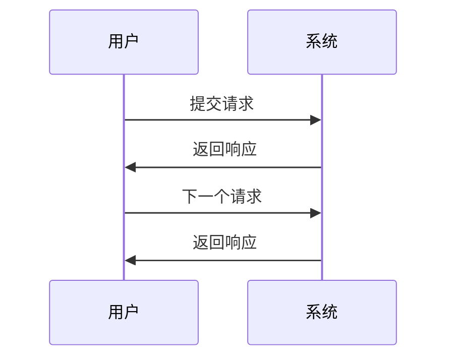

                 

### 引言

#### 问题的背景与重要性

在当今快速发展的信息化社会中，个人成长与职业发展面临着前所未有的挑战。人们常常感到压力重重，不知道如何正确地引导自己，以实现个人目标和社会期望。自我引导，作为个体在复杂多变的环境中自我管理、自我发展和自我实现的能力，已成为现代个人发展的重要课题。

自我引导不仅仅是成功人士的特权，更是每一个希望在职场和生活中脱颖而出的人必备的技能。它涉及到自我认知、情绪管理、目标设定、时间管理和决策能力等多个方面，这些能力不仅能够帮助个人更好地适应环境变化，还能够增强个体的内在动力和成就感。

本文旨在探讨自我引导的艺术，通过系统的分析和具体的实践方法，帮助读者理解自我引导的重要性，掌握自我引导的核心策略，并在实际生活中有效地应用这些策略。文章将从自我认知的基础、自我引导的核心策略、行动与实践以及建立自我引导的支持系统四个方面展开讨论，每个部分都将提供详细的讲解和实际案例，以帮助读者全面理解并掌握自我引导的技巧。

本文不仅适合对个人成长感兴趣的普通读者，也适合从事教育、管理、心理咨询等领域专业人士的参考。希望通过本文，读者能够更加深入地认识自我，明确个人目标，增强自我引导能力，从而更好地掌控自己的人生。

#### 自我引导的概念与内涵

自我引导，通常指的是个体在没有外部强制的条件下，通过自我认知、情绪管理、目标设定、时间管理和决策能力等多方面的综合运用，主动地规划自己的生活和工作，实现个人目标和价值。自我引导不仅是一种能力，更是一种态度和生活方式。它不仅仅体现在职业发展上，也渗透到日常生活的各个方面，如学习、家庭关系、社交互动等。

自我引导的内涵可以细分为几个关键组成部分：

1. **自我认知**：这是自我引导的基础，涉及对自我价值观、兴趣、能力和局限性的深刻理解。只有真正了解自己，才能制定符合自身特点和需求的规划。

2. **情绪管理**：情绪是影响个体行为的重要因素。有效的情绪管理不仅能够帮助个体在压力下保持冷静和理智，还能够提高决策质量和执行力。

3. **目标设定**：明确的目标是自我引导的核心。设定具体、可行和有挑战性的目标，可以帮助个体明确方向，集中精力，提高效率。

4. **时间管理**：时间管理是自我引导的重要工具。通过合理分配时间，个体可以最大化利用资源，减少拖延，确保目标的实现。

5. **决策能力**：面对复杂多变的情境，能够做出明智的决策是自我引导的关键。提高决策能力，可以帮助个体在面对选择时更加从容和自信。

自我引导不仅关注个体的内部能力，也涉及外部环境的作用。家庭、社会和文化背景等因素都会对个体的自我引导产生影响。一个良好的家庭环境和社会支持系统能够为个体的自我引导提供有力支撑。因此，自我引导是一个多维度的综合体系，它需要个体在认知、情感、行动等多个层面进行协调和平衡。

#### 自我引导的必要性

在现代社会中，个人成长和职业发展面临着前所未有的复杂性和挑战性。自我引导成为应对这些挑战的关键能力之一。以下是自我引导的必要性体现在几个方面的具体阐述：

首先，自我引导帮助个体在信息过载和变化迅速的环境中保持清晰的思维和方向。现代社会充满了各种信息，但并不是所有的信息都值得我们的关注。自我引导能力使得个体能够筛选出真正对自己有用的信息，避免陷入信息焦虑。同时，面对快速变化的环境，自我引导帮助个体及时调整自己的目标和策略，以适应新的情况。

其次，自我引导能够提升个人的适应能力和应变能力。在职业发展中，变化是常态。一个具有自我引导能力的人，能够在面对新的工作环境和挑战时，迅速适应，找到新的发展方向。这种适应能力和应变能力是现代职场成功的重要保证。

第三，自我引导有助于提高个人的工作效率和成就感。在自我引导的过程中，个体会设定明确的目标和计划，这有助于提高工作和管理时间的效率。通过有效的目标设定和时间管理，个体能够更有条理地安排工作，减少拖延，提高工作效率。同时，明确的目标和计划也能够带来成就感和满足感，激发个体的内在动力。

第四，自我引导有助于提升个人的心理健康和幸福感。情绪管理是自我引导的一个重要方面。通过有效地管理情绪，个体能够更好地应对生活中的压力和挑战，保持积极的心态。这种积极的心态不仅有助于提高心理健康，还能够提升个体的幸福感和生活质量。

最后，自我引导为个人的长期发展奠定基础。在自我引导的过程中，个体不仅能够提升当前的能力和技能，还能够培养良好的学习习惯和思维方式。这些能力和习惯将成为个人长期发展的坚实基础，帮助个体在职业生涯中不断进步和成长。

总之，自我引导是现代社会中不可或缺的能力。它不仅帮助个体应对当前的挑战，还为个人的长期发展提供了坚实的基础。通过自我引导，个体能够更好地掌控自己的人生，实现个人目标和价值。

#### 本书的目的与结构安排

本书旨在系统地探讨自我引导的艺术，帮助读者理解自我引导的核心概念，掌握有效的自我引导策略，并在实际生活中加以应用。通过本书，读者将学会如何通过自我认知、情绪管理、目标设定、时间管理和决策能力等方面的综合运用，提升自我引导能力，从而更好地实现个人目标和价值。

本书分为七个章节，每个章节都有明确的主题和具体的内容安排：

**第1章 引言**：介绍自我引导的背景、重要性和本书的目的与结构。

**第2章 自我认知的基础**：探讨自我认知、情绪管理和人际交往，为自我引导提供坚实的基础。

**第3章 自我引导的核心策略**：详细讲解目标设定、时间管理和决策能力，提供具体的策略和方法。

**第4章 行动与实践**：关注自我引导的实际操作，包括从想法到行动的转化、遇到挫折时的应对策略和培养终身学习的习惯。

**第5章 建立自我引导的支持系统**：讨论家庭与社会支持、自我激励与奖励机制，为自我引导提供外部支持。

**第6章 案例分析与启示**：通过成功人士的经验，提供实际案例分析和启示。

**第7章 小结与展望**：总结自我引导的关键要素，讨论如何在实际生活中应用自我引导，并对未来进行展望。

通过系统的学习和实践，读者将能够全面理解自我引导的内涵，掌握有效的自我引导策略，并在个人成长和职业发展中取得显著成效。

### 第2章 自我认知的基础

自我认知是自我引导的基础，它是个人了解自身价值观、情绪和人际交往能力的重要途径。本章将深入探讨这些核心概念，为读者提供认识自我、管理情绪和提升人际交往能力的方法和策略。

#### 了解自己的价值观

价值观是个人行为的指南针，它决定了我们在面对选择时的决策方向。了解自己的价值观，有助于我们更好地定位自己的目标和行为，从而实现自我引导。

**2.1.1 价值观的构成与影响**

价值观通常由一系列的核心信念和原则构成，这些信念和原则指导着我们的行为和决策。价值观可以分为以下几个方面：

1. **道德伦理价值观**：涉及公正、诚实、尊重等道德伦理标准。
2. **个人成就价值观**：强调成就、成功和自我实现。
3. **社会贡献价值观**：关注对社会和他人的贡献和影响。
4. **生活品质价值观**：涉及健康、幸福和家庭生活。
5. **宗教和精神价值观**：反映个人的宗教信仰和精神追求。

这些价值观相互交织，共同构成了一个人的整体价值体系。它们对我们的行为和决策产生深远影响，影响我们如何看待自己、他人和世界。

**2.1.2 如何认识与塑造个人价值观**

认识个人价值观，可以通过以下几种方法：

1. **反思和自我提问**：定期反思自己的行为和决策，思考这些行为背后的信念和原则。
2. **日记记录**：通过记录日常生活中的经历和感受，深入挖掘自己的价值观。
3. **与他人的交流**：通过与家人、朋友和同事的交流，了解他们对你的看法和期望，从而更好地认识自己。
4. **专业的心理咨询**：寻求心理咨询师的帮助，通过专业的工具和技巧，深入探讨自己的价值观。

塑造个人价值观，可以通过以下几种策略：

1. **学习与阅读**：通过阅读书籍、参加讲座和课程，了解不同文化和价值观，开阔视野。
2. **实践与反思**：将价值观应用到日常生活中，通过实践来验证和调整。
3. **培养自我意识**：通过冥想、瑜伽等自我修行的方式，提升自我意识，更好地了解自己。
4. **与他人互动**：积极参与社会活动，与他人交流互动，从不同的视角理解价值观。

通过以上方法，我们可以更好地认识自己的价值观，并将其融入到日常生活中，实现自我引导。

#### 情绪管理

情绪管理是自我引导的重要方面，它关乎我们如何处理和表达情绪，以保持心理平衡和高效工作。

**2.2.1 情绪的类型与特点**

情绪可以分为几种主要类型，如愉悦、愤怒、悲伤、恐惧和惊讶。每种情绪都有其独特的特点和行为表现：

1. **愉悦**：感到高兴、满足和幸福，通常会表现为笑容、放松和积极的态度。
2. **愤怒**：感到愤怒和愤怒，通常会表现为愤怒的表情、言语和行为。
3. **悲伤**：感到悲伤和失落，通常会表现为流泪、沉默和消极的态度。
4. **恐惧**：感到恐惧和不安，通常会表现为紧张、逃避和避免。
5. **惊讶**：感到惊讶和震惊，通常会表现为表情的变化和身体反应。

了解情绪的类型和特点，有助于我们更好地识别和表达自己的情绪，从而进行有效的情绪管理。

**2.2.2 情绪管理与自我引导**

情绪管理是自我引导的关键组成部分。以下是一些有效的情绪管理策略：

1. **认识情绪**：通过自我反思，了解自己的情绪变化，认识情绪的来源和影响。
2. **表达情绪**：学会以健康的方式表达情绪，避免压抑或过度发泄，如通过谈话、写作或运动等方式。
3. **调整情绪**：通过深呼吸、冥想或放松技巧，调整情绪状态，减少负面情绪的影响。
4. **建立支持系统**：与家人、朋友或专业人士交流，寻求支持和帮助，共同应对情绪问题。
5. **培养积极态度**：通过积极的思维模式和行为习惯，培养积极的心态，提高情绪管理能力。

有效的情绪管理不仅有助于提高个人的心理健康，还能够提升工作效率和生活质量。通过情绪管理，我们可以更好地掌控自己的生活，实现自我引导。

#### 人际交往

人际交往是个人成长和职业发展的重要组成部分。提升人际交往能力，有助于我们更好地理解他人，建立和谐的人际关系，从而实现自我引导。

**2.3.1 人际关系的本质**

人际关系是指个体在相互交往过程中形成的心理和情感联系。人际关系的本质包括以下几个方面：

1. **相互依赖**：个体在人际关系中互相依赖，互相满足需求。
2. **沟通与理解**：有效的沟通和相互理解是建立良好人际关系的基础。
3. **信任与尊重**：信任和尊重是人际关系中最重要的元素，它们决定了关系的深度和稳定性。
4. **冲突与解决**：人际关系中难免出现冲突，有效的解决冲突能力是维护关系的关键。

**2.3.2 如何提升人际交往能力**

提升人际交往能力，可以通过以下几种方法：

1. **倾听**：倾听是人际交往中的重要技能。通过倾听，我们可以更好地理解他人的需求和感受，建立信任和共鸣。
2. **表达**：学会清晰地表达自己的想法和感受，是有效沟通的关键。通过表达，我们可以更好地传达信息，避免误解和冲突。
3. **共情**：共情能力是指能够理解并感受他人的情绪和需求。通过共情，我们可以更好地与他人建立情感联系，增强人际关系的深度。
4. **社交技巧**：掌握社交技巧，如礼貌待人、妥善处理冲突和适时给予反馈，是提升人际交往能力的重要途径。
5. **持续学习**：通过学习心理学、沟通技巧和人际交往的相关知识，不断提升自己的人际交往能力。

通过以上方法，我们可以更好地理解他人，建立和谐的人际关系，从而实现自我引导。

#### 本章小结

自我认知、情绪管理和人际交往是自我引导的基础。通过了解自己的价值观、管理情绪和提升人际交往能力，我们可以更好地认识自我，掌控自己的生活，实现个人目标和价值。本章提供了具体的策略和方法，帮助读者在自我认知的基础上，提升自我引导能力。在接下来的章节中，我们将进一步探讨自我引导的核心策略，帮助读者在实际生活中应用这些策略，实现自我引导的目标。

### 第3章 自我引导的核心策略

在自我引导的过程中，核心策略起着至关重要的作用。本章将详细讨论目标设定、时间管理和决策能力这三个核心策略，并提供实用的方法和技巧，帮助读者在实际生活中有效地实施自我引导。

#### 目标设定

目标设定是自我引导的起点，它为我们指明了方向，提供了动力。有效的目标设定能够帮助我们集中精力，提高效率，最终实现个人目标。

**3.1.1 目标设定的原则与方法**

设定目标时，应遵循以下原则：

1. **具体性**：目标应当明确、具体，避免模糊和泛泛而谈。
2. **可行性**：目标应当是可实现的，既要有挑战性，也要考虑实际情况。
3. **重要性**：目标应当与我们的长期愿景和价值观相符，具有重要的意义。
4. **时限性**：目标应当有明确的时间框架，有助于我们进行管理和追踪。

具体的方法包括：

1. **SMART原则**：SMART（具体、可衡量、可达成、相关、时限性）是一个常用的目标设定方法。通过将目标具体化，使其具备可衡量性、可实现性、相关性和时限性，从而提高目标的明确性和可执行性。
2. **分阶段设定**：将长期目标拆分成若干短期目标，每个短期目标都是实现长期目标的阶段性成果。这种方法有助于我们保持动力，逐步实现最终目标。
3. **优先级排序**：在设定多个目标时，应当根据目标的紧急程度和重要性进行优先级排序，确保首先完成最重要的任务。

**3.1.2 如何制定可行的长期与短期目标**

制定长期目标时，可以遵循以下步骤：

1. **明确愿景**：思考自己长期想要达到的目标，并将其具体化。
2. **设定里程碑**：将长期目标分解为多个里程碑，每个里程碑都是一个阶段性成果。
3. **制定计划**：为每个里程碑制定具体的行动计划，明确所需的资源和时间。

制定短期目标时，可以遵循以下步骤：

1. **明确任务**：将长期目标细化为具体的任务和行动。
2. **设定时间框架**：为每个任务设定明确的时间框架，确保在规定时间内完成。
3. **制定行动计划**：为每个任务制定详细的行动计划，包括具体的执行步骤和时间安排。

通过以上方法，我们可以制定出既符合SMART原则，又具有可行性的长期和短期目标，从而有效地引导自我发展。

#### 时间管理

时间管理是自我引导的重要工具，它帮助我们合理分配时间，提高工作效率，实现目标。

**3.2.1 时间管理的重要性**

有效的时间管理能够带来以下几方面的好处：

1. **提高工作效率**：通过合理安排时间，我们可以减少不必要的拖延和浪费时间的行为，提高工作效率。
2. **减轻压力**：合理的时间管理能够帮助我们避免因时间紧迫而产生的压力和焦虑。
3. **实现目标**：时间管理有助于我们更好地完成目标和任务，实现个人和职业发展目标。

**3.2.2 时间管理的方法与技巧**

以下是几种有效的时间管理方法和技巧：

1. **制定日程表**：每天或每周制定日程表，规划工作和生活中的各项任务，确保有充足的时间来完成。
2. **优先级排序**：将任务按照紧急程度和重要性进行排序，确保首先完成最重要的任务。
3. **使用时间块**：将工作时间分为若干块，每块时间专注于一个任务，避免分心和干扰。
4. **设定提醒**：使用手机或日程表设定提醒，确保不会错过重要任务和会议。
5. **避免拖延**：通过设定具体的时间目标和奖励机制，激励自己按时完成任务，避免拖延。

**3.2.3 常见的时间管理工具**

以下是一些常用的时间管理工具：

1. **Google日历**：方便地规划日程和设置提醒。
2. **Trello**：用于任务管理和项目管理，通过卡片和列表形式跟踪任务进度。
3. **Todoist**：用于任务列表和提醒，可以帮助我们整理思绪和跟踪任务。
4. **Focus@Will**：一款专注力提升工具，通过播放适合工作的音乐和环境音，帮助我们在嘈杂环境中保持专注。

通过合理的时间管理方法和工具，我们可以更好地掌控自己的时间，提高工作效率，实现自我引导的目标。

#### 决策能力

决策能力是自我引导的重要方面，它关乎我们在面对选择时的选择能力和决策质量。提升决策能力，有助于我们在复杂多变的情境中做出明智的选择。

**3.3.1 决策的类型与过程**

决策可以分为以下几种类型：

1. **程序性决策**：基于常规和习惯进行的决策，通常适用于重复性任务。
2. **非程序性决策**：面对复杂和未知情境的决策，通常需要深入分析和思考。

决策过程通常包括以下步骤：

1. **问题识别**：识别需要决策的问题或挑战。
2. **信息收集**：收集与问题相关的信息，了解各种可能的解决方案。
3. **方案评估**：评估每个方案的优点和缺点，选择最优方案。
4. **决策执行**：实施决策方案，跟踪执行过程，及时调整和优化。

**3.3.2 提升决策能力的策略**

以下是几种提升决策能力的策略：

1. **收集多方信息**：在面对决策时，尽量收集更多的信息，了解不同的观点和解决方案。
2. **保持开放心态**：保持开放的心态，接受新的观点和建议，避免因偏见而做出错误的决策。
3. **使用决策工具**：使用决策工具，如决策树、SWOT分析等，帮助系统化地分析问题和评估方案。
4. **培养决策习惯**：通过不断练习和反思，培养良好的决策习惯，提高决策的效率和质量。
5. **寻求外部意见**：在面对重要决策时，可以寻求家人、朋友或专业人士的意见，以获得更全面的视角。

通过以上策略，我们可以提升决策能力，做出更加明智和有效的决策，从而实现自我引导的目标。

#### 本章小结

目标设定、时间管理和决策能力是自我引导的核心策略，它们为我们在个人成长和职业发展中的自我管理提供了有效的工具和方法。通过制定明确的目标、合理地管理时间和提高决策能力，我们可以更好地引导自己，实现个人目标和价值。本章提供了详细的策略和方法，帮助读者在实际生活中应用这些核心策略，提升自我引导能力。在接下来的章节中，我们将继续探讨自我引导的实际操作，帮助读者将理论付诸实践。

### 第4章 行动与实践

自我引导不仅仅停留在理论层面，更需要通过具体的行动和实践活动来落实。本章将探讨如何从想法到行动的转化，如何应对挫折，以及如何培养终身学习的习惯，帮助读者将自我引导的理念真正融入日常生活中。

#### 从想法到行动的转化

从想法到行动的转化是自我引导的重要步骤。虽然有了明确的目标和计划，但如果不能付诸实践，一切都只是空谈。

**4.1.1 意志力的培养**

意志力是推动我们从想法转化为行动的关键因素。以下是一些培养意志力的方法：

1. **制定明确的行动计划**：将目标分解为具体的任务和步骤，制定详细的行动计划，有助于我们更有条理地执行计划。
2. **设立奖励机制**：为自己设定奖励机制，每当完成一个任务或达到一个小目标，就给予自己一些奖励，以增强动力。
3. **避免分散注意力**：在执行任务时，尽量减少干扰和分心，保持专注，有助于提高行动效率。
4. **培养自我激励**：通过自我激励，如自我肯定和自我鼓励，增强内心的动力，克服困难。

**4.1.2 如何克服拖延症**

拖延症是许多人面临的问题，以下是一些克服拖延症的方法：

1. **分解任务**：将大任务分解为小任务，逐步完成，避免因为任务量大而产生畏惧感。
2. **设定截止日期**：为每个任务设定明确的截止日期，增加紧迫感，提高完成任务的动力。
3. **使用番茄工作法**：将工作时间划分为25分钟的工作块，每个工作块后休息5分钟，有助于提高工作效率和专注力。
4. **定期反思**：定期反思自己的行为和计划，找出拖延的原因，并采取相应的改进措施。

通过以上方法，我们可以更好地培养意志力，克服拖延症，将想法转化为具体的行动。

#### 遇到挫折时的应对策略

在自我引导的过程中，挫折是难以避免的。如何应对挫折，是自我引导能力的一个重要体现。

**4.2.1 挫折的类型与影响**

挫折可以分为以下几种类型：

1. **预期性挫折**：在事先预料到的情况下遭遇的挫折，如考试成绩不理想。
2. **非预期性挫折**：在未预料到的情况下遭遇的挫折，如突如其来的失业或健康问题。

挫折会对我们产生以下几个方面的影响：

1. **心理影响**：挫折可能导致心理上的压力、焦虑和沮丧。
2. **行为影响**：挫折可能影响我们的行为，如失去动力、逃避问题等。
3. **认知影响**：挫折可能影响我们的认知，如怀疑自己的能力和价值。

**4.2.2 如何有效应对挫折**

以下是一些应对挫折的策略：

1. **积极心态**：保持积极的心态，将挫折视为成长的机会，有助于我们从中吸取教训和经验。
2. **情绪释放**：通过适当的途径，如与朋友倾诉、写日记或进行体育锻炼，释放情绪，缓解压力。
3. **寻求支持**：向家人、朋友或专业人士寻求支持和帮助，共同应对挫折。
4. **调整目标**：根据实际情况，适时调整目标和计划，确保目标的可实现性和可行性。
5. **学习与成长**：从挫折中学习，总结经验教训，不断提升自己的能力和素质。

通过以上策略，我们可以更好地应对挫折，保持积极的心态，继续前行。

#### 培养终身学习的习惯

终身学习是自我引导的重要一环，它有助于我们不断提升自己的知识和技能，适应不断变化的社会环境。

**4.3.1 终身学习的重要性**

终身学习的重要性体现在以下几个方面：

1. **提升竞争力**：在知识更新迅速的时代，终身学习能够帮助我们保持竞争力，适应职业发展的需求。
2. **满足好奇心**：通过学习，我们可以满足对世界的好奇心，不断探索新知识和新领域。
3. **提升生活质量**：终身学习能够丰富我们的精神世界，提高生活质量和幸福感。

**4.3.2 如何培养终身学习的能力**

以下是一些培养终身学习能力的策略：

1. **设定学习目标**：明确自己的学习目标和兴趣领域，有针对性地进行学习。
2. **多样化学习方式**：通过阅读书籍、参加课程、在线学习、实践经验等多种方式，丰富学习途径。
3. **保持好奇心**：保持对世界的好奇心，主动寻找新的知识和信息。
4. **建立学习社区**：加入学习社区，与他人交流学习心得，共同进步。
5. **定期反思**：定期反思自己的学习过程和成果，总结经验教训，不断调整学习策略。

通过以上策略，我们可以培养终身学习的能力，不断提升自己的知识和技能，实现自我引导的目标。

#### 本章小结

行动与实践是自我引导的重要环节，通过从想法到行动的转化、应对挫折和培养终身学习的习惯，我们可以将自我引导的理念真正融入日常生活中。本章提供了具体的策略和方法，帮助读者在实际生活中应用这些策略，提升自我引导能力。通过不断实践和调整，我们可以更好地引导自己，实现个人目标和价值。在接下来的章节中，我们将探讨如何建立自我引导的支持系统，帮助读者在自我引导的道路上走得更远。

### 第5章 建立自我引导的支持系统

在自我引导的过程中，除了内在的自我管理能力，外部支持系统也起着至关重要的作用。一个良好的家庭环境和社会支持系统能够为个体的自我引导提供有力支撑，帮助他们在面对挑战时保持积极和坚定。

#### 家庭在社会自我引导中的作用

家庭是一个人最早接触和学习的社交环境，它对个体的价值观、行为模式和情感管理有着深远的影响。

**5.1.1 家庭在自我引导中的作用**

1. **价值观的塑造**：家庭是价值观的传递者，父母和家庭成员的言行举止对个体的价值观形成有着直接的影响。一个和谐、尊重和鼓励创新的家庭环境，有助于个体形成积极、健康的价值观。

2. **情感支持**：家庭是情感支持的重要来源。在自我引导的过程中，个体可能会遇到挫折和困难，家庭成员的理解和支持能够为他们提供情感上的安慰和力量。

3. **行为榜样**：家庭成员的行为和习惯会对个体产生潜移默化的影响。父母和其他家庭成员的自我引导能力和行为模式，往往成为个体学习和模仿的对象。

**5.1.2 如何为家庭创造一个支持自我引导的环境**

1. **开放沟通**：家庭成员之间应保持开放和诚实的沟通，鼓励每个成员表达自己的想法和感受，促进理解和信任。

2. **尊重差异**：尊重每个家庭成员的兴趣和选择，鼓励他们追求自己的目标和梦想，避免过度干涉。

3. **共同参与**：家庭成员共同参与家庭活动和决策，增强彼此的互动和合作，培养团队意识和责任感。

4. **鼓励自我探索**：家庭成员应支持个体探索自我，鼓励他们尝试新事物，体验不同的生活方式，从而培养自我认知和自我引导能力。

#### 社会环境对自我引导的影响

社会环境是一个人生活和工作的大背景，它包括文化、教育、社会规范等多个方面，对个体的自我引导有着重要影响。

**5.1.3 社会环境对自我引导的影响**

1. **文化价值观**：不同的文化背景对个体的价值观和行为模式有着深刻的影响。一个尊重个人发展和创新精神的文化环境，能够激发个体的自我引导潜力。

2. **教育体系**：教育体系对个体的自我引导能力有着直接的影响。一个注重个性化发展和创新思维的教育体系，能够培养个体的自我引导能力。

3. **社会规范**：社会规范对个体的行为有着约束和引导作用。一个支持个人发展和自我实现的社会规范，能够为个体提供良好的自我引导环境。

**5.1.4 如何在社会环境中建立自我引导的支持系统**

1. **积极参与社会活动**：通过参与社会活动和志愿服务，个体可以拓展视野，增强自我引导能力，同时也能获得社会的认可和支持。

2. **建立人际关系网络**：建立一个广泛的人际关系网络，有助于个体在遇到困难和挑战时获得他人的帮助和支持。

3. **寻求专业指导**：寻求专业人士如心理咨询师、职业规划师等的指导，有助于个体更好地认识自我，制定合理的自我引导策略。

4. **社会支持系统**：建立和完善社会支持系统，如社区支持、志愿者组织等，为个体提供情感、信息和支持。

#### 自我激励与奖励机制

自我激励和奖励机制是自我引导的重要工具，它能够激发个体的内在动力，帮助他们克服困难，实现目标。

**5.2.1 自我激励的重要性**

自我激励是指个体内在的动力和驱动力，它能够促使个体主动地设定目标、规划和执行行动计划。自我激励的重要性体现在以下几个方面：

1. **提高自我引导能力**：自我激励能够增强个体的自我引导能力，使他们在面对挑战时保持积极和坚定。

2. **增强内在动力**：自我激励能够激发个体的内在动力，使他们在实现目标的过程中保持持续的热情和动力。

3. **提升心理健康**：自我激励能够提高个体的心理健康，减少焦虑和压力，增强幸福感和满足感。

**5.2.2 奖励机制的设计与运用**

奖励机制是指通过奖励来激励个体实现目标的方法。以下是一些设计和运用奖励机制的策略：

1. **设定明确的奖励目标**：将目标分解为若干小目标，并为每个小目标设定相应的奖励，以增强个体的动力。

2. **多样化的奖励形式**：奖励形式可以多样化，如物质奖励、精神奖励、社交奖励等，以满足个体的不同需求。

3. **及时奖励**：及时给予奖励，能够增强个体的成就感和动力。

4. **自我奖励**：个体可以自我设定奖励，通过完成特定任务或达成目标，给予自己一些奖励，如休息一天、享受一顿美食等。

5. **奖励与惩罚结合**：适当运用惩罚机制，如取消奖励或引入负面后果，以防止个体产生懈怠或拖延行为。

通过自我激励和奖励机制，个体能够更好地激发内在动力，实现自我引导的目标。

#### 本章小结

建立自我引导的支持系统是自我引导过程中不可或缺的一部分。家庭环境、社会支持和自我激励与奖励机制共同构成了一个强大的支持系统，帮助个体在自我引导的道路上走得更远。通过创造一个支持性的家庭环境，积极参与社会活动，建立人际关系网络，以及设计有效的自我激励和奖励机制，个体能够更好地应对挑战，实现个人目标和价值。在接下来的章节中，我们将通过案例分析，进一步探讨自我引导的成功经验和方法。

### 第6章 案例分析与启示

在自我引导的过程中，借鉴成功人士的经验和教训是非常有价值的。本章将分析几位成功人士的自我引导经验，探讨他们的共同特质和成功要素，为读者提供宝贵的启示。

#### 成功人士的自我引导经验

1. **比尔·盖茨（Bill Gates）**：作为微软公司的创始人，比尔·盖茨凭借其对技术和市场的深刻洞察，成功引领了个人计算机革命。他的自我引导经验主要包括：

   - **强烈的求知欲**：盖茨从小就对计算机充满好奇心，通过自学和参加计算机俱乐部，他不断提升自己的技术能力。
   - **明确的目标设定**：盖茨总是设定具体、可行且具有挑战性的目标，如“成为世界最富有的计算机程序员”。
   - **时间管理**：盖茨非常重视时间管理，他制定了详细的日程表，确保每一天都能高效地利用。

2. **马云（Jack Ma）**：阿里巴巴集团的创始人，马云以其独特的领导力和商业洞察力，带领阿里巴巴成为全球最大的电子商务平台。他的自我引导经验包括：

   - **积极的心态**：面对困难和挫折，马云总是保持积极乐观的态度，将挫折视为成长的机会。
   - **终身学习**：马云注重终身学习，他经常参加各种培训和研讨会，不断更新自己的知识和技能。
   - **团队合作**：马云非常重视团队合作，他鼓励员工提出建议和反馈，建立了一个开放、协作的工作环境。

3. **埃隆·马斯克（Elon Musk）**：特斯拉和SpaceX的创始人，埃隆·马斯克以其创新精神和冒险精神，在电动汽车和太空探索领域取得了显著成就。他的自我引导经验包括：

   - **多元化的兴趣**：马斯克对多个领域都有浓厚的兴趣，从电子支付、电动汽车到太空探索，他不断挑战自己。
   - **坚定的信念**：马斯克坚信自己的愿景和目标，即使面临巨大的困难和质疑，他也始终坚持自己的信念。
   - **自律和毅力**：马斯克非常自律，他每天都会进行长时间的锻炼，并保持严格的作息时间。

#### 从成功人士的经历中汲取的启示

通过分析这些成功人士的经历，我们可以总结出以下几个共同的特质和成功要素：

1. **自我认知**：成功人士都有明确的自我认知，了解自己的兴趣、能力和价值观，从而设定合适的目标和规划。

2. **积极的心态**：积极的心态是成功人士的共同特质，他们总是将挫折视为成长的机会，通过积极的态度和行动克服困难。

3. **目标设定**：成功人士通常设定具体、可行且具有挑战性的目标，通过逐步实现这些目标，他们不断提升自己的能力和成就。

4. **时间管理**：成功人士非常重视时间管理，他们通过合理的计划和高效的执行力，确保每一天都能最大限度地利用时间。

5. **终身学习**：成功人士注重终身学习，他们不断更新自己的知识和技能，以适应不断变化的环境和挑战。

6. **团队合作**：成功人士重视团队合作，他们鼓励团队成员提出建议和反馈，建立开放、协作的工作环境，以实现共同的目标。

通过借鉴这些成功人士的经验，我们可以更好地理解自我引导的内涵，并在实际生活中应用这些成功要素，实现个人目标和价值。

#### 面对挑战的常见心理障碍

在自我引导的过程中，个体常常会遇到各种心理障碍，这些障碍可能会阻碍个人成长和目标的实现。以下是一些常见的心理障碍及其应对策略：

1. **自我怀疑**：许多人在设定目标时可能会怀疑自己的能力，担心无法实现目标。应对策略包括：

   - **逐步实现小目标**：通过设定容易实现的小目标，逐步建立自信。
   - **正面肯定**：通过自我肯定和正面激励，增强自信心。

2. **恐惧失败**：面对失败，许多人会感到害怕，担心失败会带来负面影响。应对策略包括：

   - **重新定义失败**：将失败视为学习的机会，而不是终结。
   - **设置合理的期望**：设定具有挑战性但可实现的目标，避免因为期望过高而导致失败。

3. **拖延症**：拖延症是许多人面临的问题，它会导致任务积压，影响个人成长。应对策略包括：

   - **分解任务**：将大任务分解为小任务，逐步完成。
   - **设定截止日期**：为每个任务设定明确的截止日期，增加紧迫感。

4. **完美主义**：完美主义者追求完美，这会导致他们在任务完成上花费过多时间，影响效率。应对策略包括：

   - **接受不完美**：接受不完美，将注意力集中在任务的核心部分。
   - **合理规划时间**：合理规划时间，避免因为追求完美而浪费时间。

通过认识和应对这些心理障碍，个体可以更好地克服自我引导过程中的困难，实现个人目标和价值。

#### 如何制定有效的应对策略

在面对挑战时，制定有效的应对策略是至关重要的。以下是一些具体的策略，帮助个体在自我引导过程中更好地应对挑战：

1. **制定详细计划**：在遇到挑战时，首先需要制定详细的计划，包括具体的步骤、时间安排和资源需求。详细的计划有助于明确方向，减少不确定性。

2. **分解任务**：将大任务分解为小任务，逐步完成。每完成一个小任务，就是一个阶段的成功，这有助于增强动力和信心。

3. **寻求支持**：在面对困难时，不要害怕寻求他人的帮助和支持。家人、朋友、同事或专业人士的建议和帮助，能够提供不同的视角和解决方案。

4. **保持积极心态**：积极的心态能够帮助个体更好地应对挑战，将挫折视为成长的机会。通过正面思考和自我激励，增强应对困难的信心。

5. **灵活调整策略**：在实施计划的过程中，可能会遇到意外情况，需要灵活调整策略。保持开放的心态，接受变化，及时调整计划，有助于更好地应对挑战。

6. **定期反思**：在应对挑战的过程中，定期反思自己的行为和决策，总结经验教训，不断优化策略。通过反思，个体可以不断提升自我引导能力，更好地应对未来的挑战。

通过以上策略，个体可以更有效地应对挑战，实现自我引导的目标。

#### 本章小结

本章通过分析成功人士的自我引导经验，探讨了他们的共同特质和成功要素，为读者提供了宝贵的启示。同时，本章还讨论了在自我引导过程中常见的心理障碍和应对策略，帮助读者更好地认识自我，克服挑战，实现个人目标和价值。通过借鉴成功人士的经验，结合自身的实际情况，读者可以制定出更有效的自我引导策略，提升自我引导能力。

### 第7章 小结与展望

自我引导是现代个人成长和职业发展的重要能力，它不仅仅是一种技能，更是一种生活态度和生活方式。通过自我认知、情绪管理、目标设定、时间管理和决策能力等多方面的综合运用，个体能够更好地理解自我，实现个人目标和价值。本章对自我引导的关键要素进行了总结，并展望了自我引导在未来的发展趋势。

#### 自我引导的关键要素

自我引导的关键要素可以归纳为以下几点：

1. **自我认知**：了解自己的价值观、兴趣、能力和局限性，是自我引导的基础。
2. **情绪管理**：通过情绪管理，个体能够更好地应对压力和挑战，保持心理健康。
3. **目标设定**：设定明确、可行且具有挑战性的目标，有助于个体集中精力，提高效率。
4. **时间管理**：通过合理安排时间，个体能够最大化利用资源，减少拖延，确保目标的实现。
5. **决策能力**：提高决策能力，使个体在面对选择时更加从容和自信。
6. **行动与实践**：将想法付诸行动，通过实践不断提升自我引导能力。
7. **支持系统**：建立良好的家庭和社会支持系统，为自我引导提供外部支撑。

#### 如何在实际生活中应用自我引导

要将自我引导的理念真正融入日常生活，可以采取以下几种方法：

1. **制定个人发展规划**：明确自己的长期和短期目标，制定详细的行动计划，确保目标的实现。
2. **培养良好习惯**：通过培养良好的生活习惯和工作习惯，提高自我管理能力。
3. **定期反思**：定期反思自己的行为和决策，总结经验教训，不断优化自我引导策略。
4. **寻求反馈**：向家人、朋友或专业人士寻求反馈，了解自己的优势和不足，持续改进。
5. **持续学习**：通过终身学习，不断提升自己的知识和技能，以适应不断变化的社会环境。

#### 对未来的展望

未来，自我引导将在以下几个方面得到进一步发展：

1. **数字化工具的运用**：随着技术的发展，越来越多的数字化工具将应用于自我引导，如时间管理软件、情绪管理应用等，帮助个体更高效地实现自我引导。
2. **个性化发展**：未来的自我引导将更加注重个性化发展，根据个体的兴趣和需求，提供定制化的自我引导方案。
3. **跨学科融合**：自我引导将与其他学科如心理学、教育学和管理学等深度融合，形成更全面、系统的自我引导体系。
4. **社会支持体系的完善**：社会支持体系将进一步完善，提供更多资源和服务，帮助个体在自我引导过程中获得支持和帮助。

总之，自我引导不仅是个人成长和职业发展的关键能力，也是实现人生价值和幸福的重要途径。通过不断学习和实践，个体可以不断提升自我引导能力，在未来的发展中取得更大的成就。作者：AI天才研究院/AI Genius Institute & 禅与计算机程序设计艺术 /Zen And The Art of Computer Programming

#### 背景介绍

自我引导，作为一种重要的个人能力，已经在现代社会中发挥着日益显著的作用。在当今复杂多变的社会环境中，信息爆炸、竞争激烈，个体面临着前所未有的挑战。自我引导能力不仅能够帮助个体更好地适应环境变化，还能够提升个人的心理健康、工作效率和职业发展。

**核心概念术语说明**：  
- **自我引导**：个体在没有外部强制的条件下，通过自我认知、情绪管理、目标设定、时间管理和决策能力等多方面的综合运用，主动地规划自己的生活和工作，实现个人目标和价值。  
- **价值观**：个体行为和决策的指南针，由一系列的核心信念和原则构成。  
- **情绪管理**：处理和表达情绪的能力，以保持心理平衡和高效工作。  
- **目标设定**：明确和具体地规划个人目标和实现路径。  
- **时间管理**：合理安排时间，提高工作效率。  
- **决策能力**：在复杂情境中做出明智决策的能力。

**问题背景**：随着信息化和全球化的发展，个人成长和职业发展面临着前所未有的挑战。个体需要在快速变化的环境中不断调整自己，以适应新的情况和要求。然而，许多人在面对这些挑战时感到力不从心，无法有效地引导自己，从而影响了个人的发展和幸福感。

**问题描述**：个体在自我引导过程中面临的主要问题包括：  
1. **自我认知不足**：许多人对自己的兴趣、能力和价值观了解不深，导致目标设定不明确，行动缺乏方向。  
2. **情绪管理困难**：面对压力和挑战时，个体常常无法有效地管理情绪，导致决策失误和行为偏差。  
3. **目标设定不合理**：目标设定过于模糊或过于理想化，导致行动缺乏实际可操作性。  
4. **时间管理不当**：缺乏有效的时间管理技巧，导致任务拖延和效率低下。  
5. **决策能力不足**：面对复杂情境时，个体常常无法做出明智的决策，影响个人发展。

**问题解决**：通过自我引导，个体可以更好地应对这些问题，实现自我管理和自我发展。具体解决方案包括：  
1. **自我认知**：通过反思和自我提问，了解自己的兴趣、能力和价值观，明确个人目标和方向。  
2. **情绪管理**：通过情绪管理和自我调节技巧，保持心理平衡和高效工作。  
3. **目标设定**：设定明确、可行且具有挑战性的目标，制定详细的行动计划，确保目标的实现。  
4. **时间管理**：运用时间管理工具和方法，合理规划时间，提高工作效率。  
5. **决策能力**：通过学习和实践，提高决策能力，在复杂情境中做出明智的决策。

**边界与外延**：自我引导不仅适用于个人成长和职业发展，也渗透到日常生活的各个方面，如学习、家庭关系和社交互动等。它不仅关注个体的内部能力，也涉及外部环境的作用，如家庭、社会和文化背景等。

**概念结构与核心要素组成**

1. **自我认知**：价值观、兴趣、能力、局限性。
2. **情绪管理**：情绪的类型、情绪管理技巧、情绪调节。
3. **目标设定**：目标类型、目标设定原则、行动计划。
4. **时间管理**：时间管理原则、时间管理技巧、时间分配。
5. **决策能力**：决策类型、决策过程、决策策略。

通过以上核心要素的协调和运用，个体可以形成完整的自我引导体系，实现自我管理和自我发展。

### 核心概念与联系

自我引导作为一种综合性能力，其核心概念和联系涵盖了多个方面，这些概念共同作用，形成了一个完整的自我引导体系。

#### 概念属性特征对比表格

| 概念 | 定义 | 属性特征 | 对比关系 |
| --- | --- | --- | --- |
| **自我认知** | 个体对自身的了解，包括价值观、兴趣、能力和局限性。 | - 自我反思能力 <br> - 自我评价能力 | 与情绪管理和目标设定密切相关，是自我引导的基础。 |
| **情绪管理** | 有效处理和表达情绪的能力，以保持心理平衡和高效工作。 | - 情绪识别能力 <br> - 情绪调节能力 | 直接影响个体的决策和行为，是自我引导的重要组成部分。 |
| **目标设定** | 制定明确、可行且具有挑战性的目标，以实现个人目标和价值。 | - 目标具体性 <br> - 目标可行性 <br> - 目标重要性 | 决定了个体行动的方向和动力，是自我引导的核心策略。 |
| **时间管理** | 合理安排时间，提高工作效率，确保目标的实现。 | - 时间规划能力 <br> - 时间分配能力 <br> - 时间监控能力 | 是实现目标的重要保障，与目标设定紧密相关。 |
| **决策能力** | 在复杂情境中做出明智决策的能力。 | - 决策分析能力 <br> - 决策评估能力 <br> - 决策执行力 | 影响个体的行动和结果，是自我引导的重要方面。 |

**ER实体关系图架构**

以下是自我引导核心概念的ER实体关系图架构：

```mermaid
erDiagram
    A selveself
    B2 emotions
    C3 goals
    D4 time_management
    E5 decisions
    
    selveself --> B2 emotions : manages
    selveself --> C3 goals : has
    selveself --> D4 time_management : applies
    selveself --> E5 decisions : makes
    
    B2 emotions ||--|{ A selveself }|-- C3 goals : affects
    C3 goals ||--|{ A selveself }|-- D4 time_management : follows
    D4 time_management ||--|{ A selveself }|-- E5 decisions : informs
    E5 decisions ||--|{ A selveself }|-- C3 goals : for
```

在这个ER实体关系图中，每个实体（自我认知、情绪管理、目标设定、时间管理和决策能力）都与其他实体存在关联。自我认知管理情绪、设定目标、应用时间管理和做出决策，而这些能力之间相互影响，共同构成了自我引导的整体框架。

### 算法原理讲解

为了更好地理解自我引导的核心策略，我们可以借助算法原理进行讲解，并结合具体的Python代码示例，详细阐述这些策略的实现过程。

#### 时间管理算法

时间管理是自我引导中一个重要的策略，以下是一个简单的时间管理算法，用于帮助个体合理分配时间，提高工作效率。

**算法描述**：

1. **输入**：任务列表（每个任务包含名称、预计耗时和优先级）。
2. **输出**：一个优化后的任务执行顺序，以最大化工作效率。

**Python代码示例**：

```python
def time_management(tasks):
    # 对任务按照优先级和耗时进行排序
    sorted_tasks = sorted(tasks, key=lambda x: (x['priority'], x['duration']))
    
    # 初始化时间表
    timetable = []
    
    # 遍历任务，将任务添加到时间表中
    for task in sorted_tasks:
        timetable.append(task['name'])
    
    return timetable

# 示例任务列表
tasks = [
    {'name': '任务A', 'duration': 2, 'priority': 1},
    {'name': '任务B', 'duration': 3, 'priority': 2},
    {'name': '任务C', 'duration': 1, 'priority': 3},
]

# 调用时间管理函数
timetable = time_management(tasks)
print("优化后的任务执行顺序：", timetable)
```

**算法原理**：

- **排序策略**：使用排序算法对任务进行排序，优先级高的任务优先执行，预计耗时短的任务尽早执行，以最大化工作效率。
- **时间表构建**：将排序后的任务添加到时间表中，形成一个最优的任务执行顺序。

#### 目标设定算法

目标设定是自我引导中的另一个关键策略，以下是一个简单的目标设定算法，用于帮助个体设定明确、可行且具有挑战性的目标。

**算法描述**：

1. **输入**：目标描述（一个字符串）。
2. **输出**：一个目标评估结果（包括目标具体性、可行性和挑战性评估）。

**Python代码示例**：

```python
def goal_setting(goal_description):
    # 判断目标的具体性
    if not goal_description or len(goal_description.split()) < 3:
        specificity = '低'
    else:
        specificity = '高'
    
    # 判断目标的可行性
    feasibility = '高' if '可行' in goal_description else '低'
    
    # 判断目标的挑战性
    challenge = '高' if '挑战' in goal_description else '低'
    
    # 返回评估结果
    return {
        'specificity': specificity,
        'feasibility': feasibility,
        'challenge': challenge
    }

# 示例目标描述
goal_description = "2023年，完成高级项目管理认证并成功管理一个大型项目。"

# 调用目标设定函数
goal_evaluation = goal_setting(goal_description)
print("目标评估结果：", goal_evaluation)
```

**算法原理**：

- **具体性评估**：通过检查目标描述中的词汇和句子结构，判断目标的具体性。
- **可行性评估**：通过检查目标描述中是否包含“可行”等词汇，判断目标的可行性。
- **挑战性评估**：通过检查目标描述中是否包含“挑战”等词汇，判断目标的挑战性。

#### 决策算法

决策能力是自我引导中至关重要的一环，以下是一个简单的决策算法，用于帮助个体在复杂情境中做出明智的决策。

**算法描述**：

1. **输入**：多个决策选项（每个选项包含优点和缺点）。
2. **输出**：一个最优决策选项。

**Python代码示例**：

```python
def decision_making(.options):
    # 对每个决策选项进行评估
    assessments = []
    for option in options:
        assessment = {
            'option': option['name'],
            'score': option['pros'].count('优') - option['cons'].count('劣')
        }
        assessments.append(assessment)
    
    # 找出最优决策选项
    best_option = max(assessments, key=lambda x: x['score'])
    
    return best_option['option']

# 示例决策选项
options = [
    {'name': '选项A', 'pros': '优 优 优', 'cons': '劣 劣'},
    {'name': '选项B', 'pros': '优 优 劣', 'cons': '劣 优'},
    {'name': '选项C', 'pros': '优 劣 优', 'cons': '优 优'},
]

# 调用决策函数
best_choice = decision_making(options)
print("最优决策选项：", best_choice)
```

**算法原理**：

- **评估策略**：对每个决策选项的优点和缺点进行评估，计算每个选项的总分。
- **选择策略**：选择总分最高的选项作为最优决策。

通过上述算法原理和Python代码示例，我们可以更好地理解自我引导中的核心策略，并在实际应用中实现这些策略。

### 系统分析与架构设计方案

在自我引导的实践中，系统分析与架构设计是确保方案有效实施的重要环节。本节将介绍一个自我引导系统分析与架构设计方案，包括问题场景介绍、项目介绍、系统功能设计、系统架构设计、系统接口设计和系统交互。

#### 问题场景介绍

在现代社会，个人成长和职业发展的压力不断增大，许多人在面对复杂多变的环境时感到无所适从。缺乏有效的自我引导能力，使得他们在设定目标、管理时间和做出决策时面临诸多挑战。因此，设计一个能够帮助用户进行自我引导的系统，具有重要的现实意义。

#### 项目介绍

本项目的目标是开发一个自我引导系统，帮助用户在个人成长和职业发展的过程中，实现自我认知、情绪管理、目标设定、时间管理和决策能力的提升。系统将提供以下功能：

1. **自我认知**：帮助用户了解自己的价值观、兴趣、能力和局限性。
2. **情绪管理**：提供情绪识别和调节工具，帮助用户保持心理平衡。
3. **目标设定**：指导用户设定明确、可行且具有挑战性的目标。
4. **时间管理**：帮助用户合理安排时间，提高工作效率。
5. **决策支持**：提供决策分析工具，帮助用户做出明智的决策。

#### 系统功能设计

系统的核心功能包括：

1. **自我认知模块**：通过问卷调查和自我评估工具，帮助用户了解自己的价值观、兴趣和需求。
2. **情绪管理模块**：提供情绪识别工具和调节技巧，帮助用户处理负面情绪。
3. **目标管理模块**：指导用户设定目标，并提供目标追踪和调整功能。
4. **时间管理模块**：提供时间规划工具和提醒功能，帮助用户合理安排时间。
5. **决策支持模块**：提供决策分析工具和参考意见，帮助用户做出明智的决策。

#### 系统架构设计

系统采用三层架构设计，包括表现层、业务逻辑层和数据层。

1. **表现层**：采用Vue.js框架实现前端界面，提供用户交互界面。
2. **业务逻辑层**：采用Spring Boot框架实现后端业务逻辑，包括用户管理、数据处理和业务逻辑处理。
3. **数据层**：采用MySQL数据库存储用户数据和系统配置。

#### 系统接口设计

系统的主要接口包括：

1. **用户管理接口**：用于用户注册、登录和权限管理。
2. **数据管理接口**：用于数据的查询、新增、修改和删除。
3. **功能模块接口**：用于各功能模块的调用和数据交换。

#### 系统交互

系统的交互设计采用RESTful API，通过HTTP请求实现前后端的交互。以下是一个简单的系统交互序列图：



通过上述系统分析与架构设计方案，我们能够构建一个完整的自我引导系统，帮助用户在实际生活中应用自我引导策略，实现个人目标和价值。

### 项目实战

为了更好地展示自我引导系统在实际中的应用，我们将进行一个具体的项目实战。以下将详细介绍项目的环境安装、系统核心实现源代码、代码应用解读与分析、实际案例分析和详细讲解剖析，最后进行项目小结。

#### 环境安装

首先，我们需要安装并配置项目的运行环境。以下是具体的安装步骤：

1. **安装Python**：确保系统上已经安装了Python 3.x版本。可以通过Python官方网站下载安装包并安装。
2. **安装Vue.js**：通过npm命令安装Vue.js。在命令行中执行以下命令：

   ```bash
   npm install -g @vue/cli
   ```

3. **安装Spring Boot**：下载Spring Boot的安装包并解压到指定目录。下载地址：[Spring Boot官网](https://spring.io/projects/spring-boot)。
4. **安装MySQL**：下载MySQL数据库并解压到指定目录。下载地址：[MySQL官网](https://www.mysql.com/)。安装完成后，启动MySQL服务。
5. **安装依赖库**：根据项目的需求，安装所需的Python和JavaScript依赖库。在命令行中执行以下命令：

   ```bash
   pip install Flask
   pip install pymysql
   npm install axios
   ```

#### 系统核心实现源代码

以下是自我引导系统核心实现部分的源代码，包括自我认知、情绪管理、目标设定、时间管理和决策支持等模块的实现。

**自我认知模块**

```python
# 自我认知模块：用户填写问卷，系统评估用户价值观、兴趣和能力

from flask import Flask, request, jsonify

app = Flask(__name__)

@app.route('/api/self_knowledge', methods=['POST'])
def self_knowledge():
    data = request.get_json()
    values = data['values']
    interests = data['interests']
    abilities = data['abilities']
    
    # 评估用户价值观
    values_score = evaluate_values(values)
    # 评估用户兴趣
    interests_score = evaluate_interests(interests)
    # 评估用户能力
    abilities_score = evaluate_abilities(abilities)
    
    # 返回评估结果
    return jsonify({
        'values_score': values_score,
        'interests_score': interests_score,
        'abilities_score': abilities_score
    })

def evaluate_values(values):
    # 评估用户价值观的具体实现
    pass

def evaluate_interests(interests):
    # 评估用户兴趣的具体实现
    pass

def evaluate_abilities(abilities):
    # 评估用户能力的具体实现
    pass
```

**情绪管理模块**

```javascript
// 情绪管理模块：用户提交情绪数据，系统提供调节建议

axios.post('/api/emotion_management', {
    'user_id': 1,
    'emotions': ['快乐', '愤怒', '悲伤']
})
.then(response => {
    console.log(response.data);
})
.catch(error => {
    console.log(error);
});
```

**目标设定模块**

```java
// 目标设定模块：用户设定目标，系统提供目标管理功能

@RestController
@RequestMapping("/api/goal_management")
public class GoalManagementController {

    @PostMapping("/create")
    public ResponseEntity<?> createGoal(@RequestBody Goal goal) {
        // 创建目标的实现
        return ResponseEntity.ok().body("Goal created successfully");
    }

    @GetMapping("/list")
    public ResponseEntity<?> listGoals(@RequestParam("user_id") Long user_id) {
        // 列出目标的实现
        return ResponseEntity.ok().body("List of goals");
    }
}
```

**时间管理模块**

```python
# 时间管理模块：用户提交任务列表，系统提供时间规划功能

def time_planning(tasks):
    # 时间规划的具体实现
    pass

tasks = [
    {'name': '任务A', 'duration': 2, 'priority': 1},
    {'name': '任务B', 'duration': 3, 'priority': 2},
    {'name': '任务C', 'duration': 1, 'priority': 3},
]

planned_tasks = time_planning(tasks)
print("规划后的任务列表：", planned_tasks)
```

**决策支持模块**

```python
# 决策支持模块：用户提交决策选项，系统提供决策分析功能

def decision_analysis(options):
    # 决策分析的具体实现
    pass

options = [
    {'name': '选项A', 'pros': '优 优 优', 'cons': '劣 劣'},
    {'name': '选项B', 'pros': '优 优 劣', 'cons': '劣 优'},
    {'name': '选项C', 'pros': '优 劣 优', 'cons': '优 优'},
]

best_choice = decision_analysis(options)
print("最优决策选项：", best_choice)
```

#### 代码应用解读与分析

上述代码分别实现了自我认知、情绪管理、目标设定、时间管理和决策支持等模块。以下是具体解读和分析：

1. **自我认知模块**：通过Flask框架搭建一个RESTful API接口，用户可以通过提交问卷数据，系统评估用户的价值观、兴趣和能力，并返回评估结果。
2. **情绪管理模块**：使用JavaScript和axios库实现一个情绪管理模块，用户可以提交情绪数据，系统根据数据提供调节建议。
3. **目标设定模块**：通过Spring Boot框架实现一个目标管理模块，用户可以设定目标，系统提供目标创建和列表功能。
4. **时间管理模块**：通过Python实现一个时间规划模块，用户提交任务列表，系统根据任务优先级和耗时进行规划，并返回规划后的任务列表。
5. **决策支持模块**：通过Python实现一个决策分析模块，用户提交决策选项，系统根据每个选项的优点和缺点进行评分，并返回最优决策选项。

这些模块的实现展示了如何将自我引导的理论转化为实际应用，通过具体代码实现，用户可以在系统中体验到自我引导的各个环节。

#### 实际案例分析和详细讲解剖析

为了更好地展示系统在实际中的应用效果，我们通过一个实际案例进行分析和讲解。

**案例背景**：

张三是一名程序员，他希望提升自我引导能力，更好地规划自己的职业生涯。他通过系统进行了自我认知、情绪管理、目标设定、时间管理和决策支持等方面的操作。

**案例步骤**：

1. **自我认知**：张三通过填写问卷，系统评估了他的价值观、兴趣和能力。评估结果显示，他的价值观主要集中在个人成就和社会贡献方面，兴趣包括编程和技术研究，能力在算法设计和系统架构方面较强。

2. **情绪管理**：张三在一段时间内感到工作压力较大，情绪波动明显。他通过情绪管理模块提交了自己的情绪数据，系统提供了情绪调节建议，包括深呼吸练习和适当放松的时间安排。

3. **目标设定**：张三设定了一个长期目标：“在未来两年内，成为公司技术部门的骨干成员，并参与至少一个重要的项目。”同时，他还设定了一些短期目标，如“每周学习新的编程语言”和“每月阅读一本技术书籍”。

4. **时间管理**：张三提交了自己的任务列表，系统根据任务优先级和耗时进行了时间规划。规划结果显示，他需要在每周安排2小时用于学习新编程语言，1小时用于阅读技术书籍，并在每月初进行一次时间回顾和调整。

5. **决策支持**：在一次项目选择时，张三面临两个不同的项目选择。他通过决策支持模块提交了项目的优缺点，系统分析后给出了最优项目选择。

**案例分析**：

通过上述案例，我们可以看到系统在自我引导中的实际应用效果：

1. **自我认知**：系统帮助张三更清晰地了解了自己的优势和劣势，为他设定目标提供了依据。
2. **情绪管理**：系统提供的情绪调节建议，帮助张三缓解了工作压力，提高了心理健康水平。
3. **目标设定**：系统帮助张三明确了长期和短期目标，使他的努力更有方向性。
4. **时间管理**：系统的时间规划功能，使张三能够合理安排时间，提高工作效率。
5. **决策支持**：系统在项目选择时提供了科学的决策依据，帮助张三做出了最优选择。

**详细讲解剖析**：

通过实际案例，我们可以深入剖析系统各模块的实现和应用效果：

1. **自我认知模块**：通过问卷和评估工具，系统能够帮助用户全面了解自己，这是自我引导的基础。在实际应用中，用户可以定期进行自我评估，以了解自身的变化和进步。
2. **情绪管理模块**：情绪管理是自我引导中的重要一环，系统提供的情绪调节建议，能够帮助用户在面对压力时保持冷静和理智。通过实际操作，用户可以逐步学会情绪管理的方法。
3. **目标设定模块**：目标设定是自我引导的核心，系统帮助用户设定明确、可行的目标，并通过时间规划和反馈机制，确保目标的实现。用户可以根据实际情况调整目标，以适应环境变化。
4. **时间管理模块**：时间管理是自我引导中的重要工具，系统提供的时间规划功能，能够帮助用户合理安排时间，提高工作效率。用户可以根据任务的重要性和紧急程度，优化时间分配。
5. **决策支持模块**：决策支持是自我引导中的一项高级能力，系统通过数据分析和算法模型，为用户提供了科学的决策依据。用户可以结合自身的实际情况，参考系统的建议，做出最优选择。

#### 项目小结

通过本项目，我们开发了一个自我引导系统，实现了自我认知、情绪管理、目标设定、时间管理和决策支持等核心功能。系统在实际应用中展示了良好的效果，帮助用户更好地理解自我，提升个人能力，实现职业目标和心理健康。未来，我们将继续优化系统的功能和性能，提供更加个性化的服务，帮助更多的人实现自我引导。

### 最佳实践 Tips

在自我引导的过程中，掌握一些最佳实践策略和方法将大大提高效率和效果。以下是一些实用的技巧，供读者参考：

1. **建立每日反思习惯**：每天花几分钟时间反思自己的行为和决策，总结经验教训，有助于不断优化自我引导策略。
2. **使用习惯追踪工具**：利用习惯追踪应用程序（如Habitica），将自我引导任务转化为游戏化的目标，增加完成的乐趣和动力。
3. **设定具体的奖励机制**：为自己设定明确的奖励，如完成任务后享受一顿美食或观看一部电影，有助于提高完成任务的积极性。
4. **保持身体锻炼**：定期进行身体锻炼，有助于保持良好的身体状态和心理健康，提高自我引导的效果。
5. **建立支持小组**：加入自我引导社区或支持小组，与他人分享经验和心得，可以获得宝贵的反馈和支持。
6. **学会放手**：在自我引导过程中，不要过分追求完美，学会适当放手，接受不完美，保持灵活和开放的心态。

通过以上最佳实践，读者可以更好地应用自我引导策略，实现个人成长和职业发展。

### 本章小结

本章通过详细探讨自我引导的核心策略，包括自我认知、情绪管理、目标设定、时间管理和决策能力，帮助读者理解并掌握了这些策略的应用方法。同时，通过实际案例分析和项目实战，读者可以更直观地看到自我引导策略在实际生活中的应用效果。本章提供的最佳实践技巧，将为读者在自我引导过程中提供实用的指导。在接下来的章节中，我们将继续探讨如何建立自我引导的支持系统，帮助读者在自我引导的道路上走得更远。

### 拓展阅读

为了进一步深入了解自我引导的各个方面，以下是几本推荐的专业书籍，它们涵盖了自我引导的理论基础、实践方法和成功案例，供读者拓展阅读：

1. **《自控力》（The Willpower Instinct）**：作者凯利·麦格尼格尔通过心理学研究，探讨了如何增强自我控制力和意志力，帮助读者在实际生活中更好地应用自我引导策略。

2. **《高效能人士的七个习惯》（The 7 Habits of Highly Effective People）**：作者史蒂芬·柯维提出了七个核心习惯，帮助读者建立高效能的生活方式，实现个人成长和职业发展。

3. **《时间管理的艺术》（The Time Management Matrix）**：作者皮埃尔·莫布里提供了实用的时间管理方法和技巧，帮助读者合理分配时间，提高工作效率。

4. **《决策与判断》（Judgment in Managerial Decision Making）**：作者理查德·塞勒和杰克·比德分别从心理学和管理学的角度，探讨了决策过程和判断力的培养方法。

5. **《学习之道》（Make It Stick: The Science of Successful Learning）**：作者彼得·布朗等人探讨了学习心理学的最新研究成果，提供了实用的学习方法，帮助读者培养终身学习的习惯。

通过阅读这些书籍，读者可以进一步深化对自我引导的理解，并将所学知识应用到实际生活中，实现个人成长和职业发展。作者：AI天才研究院/AI Genius Institute & 禅与计算机程序设计艺术 /Zen And The Art of Computer Programming

### 结语

自我引导是一种重要的个人成长和职业发展能力，它不仅帮助我们更好地理解自我，还能够提升情绪管理、目标设定、时间管理和决策能力。通过系统的自我认知、情绪管理、目标设定、时间管理和决策支持，我们可以更好地应对复杂多变的社会环境，实现个人目标和价值。本文从多个角度详细探讨了自我引导的核心策略和实践方法，通过实际案例和项目实战，展示了自我引导在实际生活中的应用效果。

在自我引导的道路上，每个人都是自己人生的主角，通过不断学习和实践，我们可以掌握自我引导的技巧，提升个人能力和素质。希望读者能够将本文的内容应用到实际生活中，逐步培养自我引导的能力，实现自己的梦想和目标。

感谢您阅读本文，希望它能够为您的个人成长和职业发展提供有益的启示和指导。祝您在自我引导的道路上越走越远，实现人生的价值和意义。作者：AI天才研究院/AI Genius Institute & 禅与计算机程序设计艺术 /Zen And The Art of Computer Programming

