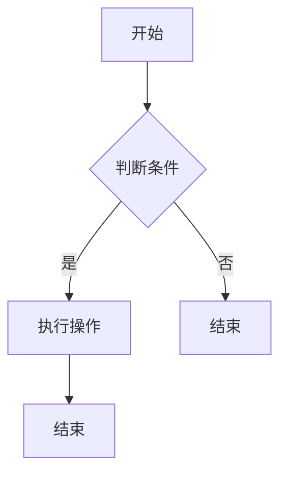

                 

### 元宇宙：虚拟世界中的意义建构

#### 关键词：元宇宙、虚拟世界、意义建构、技术、社会、文化

#### 摘要：
本文旨在探讨元宇宙这一虚拟世界的本质及其中的意义建构。首先，我们将定义元宇宙，并回顾其发展历史。接着，分析元宇宙的核心技术，如虚拟现实和人工智能，以及它们对人类社会和文化的深远影响。随后，我们将探讨元宇宙的经济模式，并引入意义建构的理论框架。通过详细分析用户和社群在虚拟世界中的角色，我们将揭示意义建构的驱动力和实践方法。最后，本文将展望元宇宙的未来发展，并提出一些建议，以促进这一新兴领域的健康发展。

#### 目录：

1. **引言**
   - 元宇宙的概念与重要性
   - 本文结构

2. **第一部分：元宇宙基础**
   - **第1章 元宇宙概述**
     - 定义与历史发展
     - 核心概念
     - 技术基础
   - **第2章 虚拟世界技术**
     - 虚拟现实技术
     - 增强现实技术
     - 人工智能与元宇宙
   - **第3章 元宇宙的社会与文化影响**
     - 社会层面的影响
     - 文化层面的影响
     - 伦理与隐私问题
   - **第4章 元宇宙的经济模式**
     - 商业模式
     - 虚拟资产交易
     - 未来展望

3. **第二部分：意义建构**
   - **第5章 虚拟世界的意义构建理论**
     - 理论框架
     - 驱动因素
     - 实践方法
   - **第6章 用户在虚拟世界中的意义建构**
     - 用户参与
     - 用户角色
     - 用户体验
   - **第7章 虚拟世界的社群构建**
     - 社群概念与类型
     - 社群动力与互动
     - 社群发展与可持续性

4. **总结与展望**
   - 元宇宙的意义与挑战
   - 未来发展建议

#### 引言

##### 元宇宙的概念与重要性

元宇宙（Metaverse）是一个虚拟的三维空间，通过互联网连接，提供沉浸式体验。它不仅包括虚拟现实（VR）和增强现实（AR），还融合了社交媒体、游戏、电子商务、数字艺术等多个领域。元宇宙的愿景是创造一个无缝连接的虚拟世界，用户可以在其中自由互动、创造和表达自我。

元宇宙的重要性在于它代表了互联网发展的下一个重要阶段。随着5G技术和人工智能的迅速发展，元宇宙正逐渐从概念变为现实。它不仅改变了人们的生活方式，也对社会、经济和文化产生了深远的影响。

##### 本文结构

本文分为两个主要部分。第一部分将介绍元宇宙的基础知识，包括定义、历史发展、核心技术、社会与文化影响以及经济模式。第二部分将深入探讨虚拟世界中的意义建构，包括理论框架、用户角色、社群构建以及未来的发展。通过这样的结构设计，我们希望读者能够全面理解元宇宙的各个方面，并对其未来的发展有所洞察。

### 第一部分：元宇宙基础

#### 第1章 元宇宙概述

##### 1.1 定义与历史发展

元宇宙是一个虚拟的三维空间，通过互联网连接，提供沉浸式体验。它不仅仅是虚拟现实（VR）和增强现实（AR）的结合，还包含了社交媒体、游戏、电子商务和数字艺术等多个领域。元宇宙的核心理念是创造一个无缝连接的虚拟世界，用户可以在其中自由互动、创造和表达自我。

元宇宙的发展可以追溯到20世纪80年代和90年代的虚拟现实技术。最早的虚拟现实技术主要依赖于计算机模拟和头戴式显示器。随着互联网的普及和技术的进步，虚拟现实逐渐从实验室走向市场。2000年代，虚拟现实技术迎来了新的发展，特别是随着智能手机和移动互联网的普及，虚拟现实应用开始广泛推广。

然而，元宇宙的真正兴起是在2010年代后期和2020年代初。随着5G技术和人工智能的迅速发展，元宇宙的概念开始被更多人关注。Facebook（现更名为Meta）在2021年宣布进军元宇宙，标志着元宇宙从概念变为现实的转折点。

##### 1.2 核心概念

元宇宙的核心概念包括虚拟现实、增强现实、社交媒体、游戏和电子商务等。

- **虚拟现实（VR）**：虚拟现实是一种通过计算机技术生成的三维虚拟环境，用户可以通过头戴式显示器或VR眼镜进入这个环境，与之互动和交流。

- **增强现实（AR）**：增强现实是在现实世界的基础上叠加虚拟信息，通过智能手机或头戴式设备展示给用户。例如，AR游戏《Pokémon GO》将虚拟的精灵放在现实世界中，让玩家可以通过手机屏幕进行捕捉。

- **社交媒体**：元宇宙中的社交媒体平台允许用户创建个人资料，加入群组，分享内容和互动。这些平台不仅提供了信息交流的功能，还成为了用户建立社会联系的重要场所。

- **游戏**：游戏是元宇宙中不可或缺的一部分。从简单的在线角色扮演游戏到复杂的多人在线游戏，游戏为用户提供了丰富的娱乐体验和社交互动。

- **电子商务**：元宇宙为电子商务提供了新的机会。用户可以在虚拟世界中购买和销售虚拟商品，如虚拟服装、虚拟家具等。这些商品不仅可以用于个人装饰，还可以在虚拟市场中进行交易。

##### 1.3 技术基础

元宇宙的技术基础包括虚拟现实、增强现实、人工智能和区块链等。

- **虚拟现实（VR）**：虚拟现实技术依赖于计算机图形学和传感器技术。通过头戴式显示器和手柄等设备，用户可以沉浸在虚拟环境中。VR技术的关键挑战是提高分辨率、降低延迟和增强沉浸感。

- **增强现实（AR）**：增强现实技术通过智能手机或头戴式设备将虚拟信息叠加在现实世界中。AR技术依赖于计算机视觉和图像识别技术。随着手机硬件的升级，AR应用越来越普及。

- **人工智能（AI）**：人工智能在元宇宙中发挥着关键作用。AI技术可以用于生成虚拟环境、模拟用户行为、提供个性化推荐等。例如，通过自然语言处理技术，AI可以理解用户的语音命令，提供交互式体验。

- **区块链**：区块链技术为元宇宙提供了安全、去中心化的交易方式。虚拟资产的交易、身份验证和数据存储都可以通过区块链实现。区块链技术确保了虚拟世界中的数据透明和安全。

##### 总结

元宇宙是一个由虚拟现实、增强现实、社交媒体、游戏和电子商务等多个领域融合而成的虚拟三维空间。它通过互联网连接，提供沉浸式体验，改变了人们的生活方式。元宇宙的核心概念包括虚拟现实、增强现实、社交媒体、游戏和电子商务，而其技术基础包括虚拟现实、增强现实、人工智能和区块链等。通过了解元宇宙的定义、历史发展、核心概念和技术基础，我们可以更好地理解这个新兴领域的潜力和挑战。

### 第2章 虚拟世界技术

##### 2.1 虚拟现实技术

虚拟现实（VR）是一种通过计算机技术创建的三维虚拟环境，用户可以通过头戴式显示器（HMD）或其他设备进入这个环境，与之互动和交流。VR技术的核心在于提供高度沉浸式的体验，使用户感觉仿佛置身于虚拟世界中。

VR技术的发展可以追溯到20世纪60年代。最早的VR实验主要依赖于模拟现实的技术，如立体投影和头戴式显示器。随着计算机图形学和传感器技术的进步，VR技术逐渐成熟。现代VR技术依赖于以下几个方面：

- **头戴式显示器（HMD）**：HMD是VR体验的核心设备。它通常包括一个屏幕和一对镜片，用于将虚拟环境投影到用户的视野中。高质量的HMD可以提供高分辨率和低延迟的图像，从而增强沉浸感。

- **追踪系统**：追踪系统用于跟踪用户的位置和动作。通过追踪用户头部和手部的运动，VR环境可以实时更新，使用户感觉到自己正在移动和操作虚拟对象。

- **手柄和控制器**：手柄和控制器允许用户在虚拟环境中进行交互。这些设备通常配备传感器，可以检测用户的手部动作，从而实现更加直观的交互。

- **音频技术**：音频技术在VR体验中扮演重要角色。通过头戴式耳机或空间音频技术，用户可以感受到虚拟环境中的声音和音效，进一步增强沉浸感。

VR技术在多个领域得到广泛应用，包括娱乐、教育、医疗和军事等。在娱乐领域，VR游戏和电影为用户提供全新的体验方式。在教育领域，VR技术可以用于模拟实验和课堂教学，提高学习效果。在医疗领域，VR技术可以用于手术模拟和康复训练，帮助医生和患者更好地理解病情和治疗方案。在军事领域，VR技术可以用于模拟战斗场景和战术训练，提高士兵的作战能力。

##### 2.2 增强现实技术

增强现实（AR）是一种将虚拟信息叠加到现实世界中的技术。通过智能手机、平板电脑或头戴式设备，用户可以看到现实世界中的物体和虚拟信息。AR技术可以通过计算机视觉和图像识别技术实现，其核心在于将虚拟信息和现实世界无缝融合。

AR技术的发展可以追溯到20世纪90年代。最早的AR应用主要是在实验室环境中进行。随着智能手机和移动计算技术的进步，AR应用逐渐普及。现代AR技术依赖于以下几个方面：

- **智能手机和移动设备**：智能手机和平板电脑是AR技术的主要载体。通过内置的相机和处理器，这些设备可以实时捕捉现实世界的图像，并叠加虚拟信息。

- **计算机视觉**：计算机视觉技术用于识别和跟踪现实世界中的物体。通过图像识别和目标检测技术，AR应用可以识别特定物体并对其进行标记或叠加虚拟信息。

- **图像识别**：图像识别技术用于识别现实世界中的图像和标志。通过将用户拍摄的图像与数据库中的图像进行匹配，AR应用可以确定物体的位置和属性。

- **光学技术**：光学技术用于将虚拟信息叠加到现实世界中。通过透明材料或反射镜，虚拟信息可以与真实世界中的物体进行叠加。

AR技术在多个领域得到广泛应用，包括娱乐、教育、医疗和广告等。在娱乐领域，AR游戏和应用程序为用户提供全新的互动体验。在教育领域，AR技术可以用于增强课堂教学，提高学生的参与度和学习效果。在医疗领域，AR技术可以用于手术指导和解剖学教学，帮助医生更好地理解和操作。在广告领域，AR技术可以用于增强广告效果，吸引更多用户关注。

##### 2.3 人工智能与元宇宙

人工智能（AI）在元宇宙中发挥着关键作用。通过机器学习和深度学习技术，AI可以模拟人类行为，提供个性化推荐，增强用户体验。

- **机器学习**：机器学习是一种通过数据训练模型的技术。在元宇宙中，AI可以通过机器学习技术识别用户的偏好和行为模式，提供个性化的虚拟体验。例如，AI可以分析用户的互动历史，推荐他们可能感兴趣的游戏、商品或社交活动。

- **深度学习**：深度学习是机器学习的一个分支，通过多层神经网络模拟人类大脑的学习过程。在元宇宙中，深度学习可以用于生成逼真的虚拟环境和角色。例如，AI可以通过深度学习技术生成虚拟角色的面部表情和动作，使其更加逼真和自然。

- **自然语言处理**：自然语言处理（NLP）是一种使计算机理解和生成人类语言的技术。在元宇宙中，NLP可以用于实现人机对话和语音识别。例如，用户可以通过语音命令与虚拟角色互动，或通过文本聊天与他人交流。

- **个性化推荐**：个性化推荐是AI在元宇宙中的一个重要应用。通过分析用户的互动历史和偏好，AI可以推荐他们可能感兴趣的内容。例如，在元宇宙中的虚拟商场，AI可以推荐用户可能喜欢的虚拟商品。

- **情感计算**：情感计算是一种通过计算机技术理解和模拟人类情感的技术。在元宇宙中，情感计算可以用于增强用户的情感体验。例如，AI可以通过分析用户的情感状态，提供适当的反馈或调整虚拟环境，以增强用户的情感体验。

AI在元宇宙中的应用不仅限于用户体验的增强，还可以用于元宇宙的管理和优化。例如，AI可以用于智能调度和资源管理，优化虚拟世界的运行效率。AI还可以用于虚拟角色和行为模拟，提高元宇宙的交互性和现实感。

##### 总结

虚拟现实、增强现实和人工智能是元宇宙的三大核心技术。虚拟现实提供高度沉浸式的体验，增强现实将虚拟信息叠加到现实世界中，而人工智能则为元宇宙带来智能化和个性化。这些技术的融合为元宇宙的发展提供了强大动力，使虚拟世界变得更加丰富和真实。通过深入了解这些技术，我们可以更好地理解元宇宙的潜力和应用场景。

### 第3章 元宇宙的社会与文化影响

##### 3.1 社会层面的影响

元宇宙对社会的影响是多方面的，包括人际关系、工作方式和社会结构等。

- **人际关系**：元宇宙提供了一个虚拟的社交平台，用户可以在其中建立和维持人际关系。这种虚拟社交不仅限于娱乐，还可以用于商务合作和学术交流。元宇宙中的社交互动更加自由和多样化，使用户可以跨越地理和文化的界限，扩展社交网络。

- **工作方式**：元宇宙为工作方式带来了革命性的变化。虚拟办公室和远程协作成为可能，使员工可以不受地理限制地工作。元宇宙中的虚拟会议和协作工具可以提高工作效率和灵活性，减少通勤时间和成本。此外，元宇宙还提供了新的职业机会，如虚拟现实设计师、虚拟角色扮演者等。

- **社会结构**：元宇宙改变了社会的组织形式。虚拟社群和虚拟组织成为现实社会的补充和延伸。这些虚拟社群可以基于共同的兴趣、目标或价值观，形成新的社会结构。元宇宙中的社会结构更加灵活和去中心化，使用户可以自由选择参与或退出。

##### 3.2 文化层面的影响

元宇宙对文化的影响体现在多个方面，包括文化多样性、艺术创作和文化传播等。

- **文化多样性**：元宇宙为文化多样性提供了广阔的平台。用户可以来自不同的国家和文化背景，他们在虚拟世界中交流、分享和融合各自的文化。这种跨文化的互动促进了文化的多样性和交流，丰富了人类文化。

- **艺术创作**：元宇宙为艺术创作提供了新的机会和工具。虚拟现实和增强现实技术使艺术家可以创造出全新的艺术形式，如虚拟展览、沉浸式体验等。元宇宙中的艺术创作不仅局限于视觉和听觉，还可以结合交互性和故事性，提供更加丰富和沉浸的艺术体验。

- **文化传播**：元宇宙为文化传播提供了新的渠道和方式。虚拟世界中的内容可以快速传播，用户可以随时随地获取和分享文化资讯。此外，元宇宙中的虚拟角色和虚拟场景可以成为文化传播的载体，使文化更加生动和有趣。

##### 3.3 伦理与隐私问题

随着元宇宙的发展，伦理和隐私问题也逐渐成为关注的焦点。

- **伦理问题**：元宇宙中存在一系列伦理问题，如虚拟暴力和仇恨言论、虚拟世界的公平性和包容性等。虚拟世界中的行为和互动可能会对现实世界产生负面影响，因此需要制定相应的伦理规范，确保虚拟世界中的行为符合现实社会的道德准则。

- **隐私问题**：元宇宙中的用户数据隐私保护成为一个重要问题。虚拟世界中的用户数据包括个人身份信息、互动记录和偏好等，这些数据可能被用于商业目的或被滥用。因此，需要加强数据保护措施，确保用户数据的安全和隐私。

- **监管问题**：元宇宙的跨国性和去中心化特性使得监管成为一个挑战。不同国家和地区可能有不同的法律和监管要求，如何在全球范围内建立统一的监管框架，确保元宇宙的健康发展，是一个亟待解决的问题。

##### 总结

元宇宙对社会和文化的影响是深远而广泛的。它改变了人际关系、工作方式和社会结构，促进了文化多样性和艺术创作，同时也带来了伦理和隐私问题。了解和应对这些问题，对于推动元宇宙的健康发展至关重要。通过加强伦理规范、数据保护和全球监管合作，我们可以确保元宇宙成为一个安全和包容的虚拟世界。

### 第4章 元宇宙的经济模式

##### 4.1 商业模式

元宇宙的商业模式是多元化的，涵盖了虚拟商品和服务销售、广告和订阅等多种形式。

- **虚拟商品和服务销售**：在元宇宙中，用户可以购买和销售虚拟商品，如虚拟服装、虚拟家具和虚拟土地等。这些虚拟商品不仅可以用于个人装饰，还可以在虚拟市场中进行交易，从而实现商业价值。此外，元宇宙还提供了丰富的虚拟服务，如虚拟导游、虚拟培训和虚拟咨询等，用户可以通过付费获得这些服务。

- **广告**：元宇宙中的广告形式多样，包括虚拟广告牌、虚拟角色代言和虚拟场景植入等。这些广告可以精准定位用户，提高广告效果。元宇宙中的广告不仅局限于视觉和听觉，还可以通过交互性和故事性增强用户参与度。

- **订阅模式**：元宇宙中的订阅模式类似于现实世界的会员制度，用户可以通过付费订阅获取特殊功能或内容。例如，用户可以订阅虚拟现实游戏的高级版本，获得更多的游戏内容和特权。

##### 4.2 虚拟资产交易

虚拟资产交易是元宇宙经济的重要组成部分，包括虚拟货币、虚拟土地和虚拟物品等。

- **虚拟货币**：虚拟货币，如比特币和以太坊，在元宇宙中广泛使用。虚拟货币不仅可以用于购买虚拟商品和服务，还可以作为投资工具。元宇宙中的虚拟货币交易市场活跃，吸引了大量投资者。

- **虚拟土地**：元宇宙中的虚拟土地是一种稀缺资源，用户可以通过购买或租赁虚拟土地来建设虚拟建筑和开展商业活动。虚拟土地的价值随着元宇宙的发展而增长，成为一种重要的投资对象。

- **虚拟物品**：虚拟物品包括虚拟服装、虚拟家具、虚拟宠物等，用户可以在元宇宙中购买和交换这些物品。这些虚拟物品不仅具有装饰功能，还可以在市场上进行交易，实现商业价值。

##### 4.3 元宇宙经济的未来展望

元宇宙经济的未来充满机遇和挑战。以下是对元宇宙经济未来发展的几个展望：

- **市场规模扩大**：随着技术的进步和用户接受度的提高，元宇宙的市场规模将继续扩大。预计未来几年，元宇宙的年度市场规模将达到数千亿美元。

- **多元化发展**：元宇宙的经济模式将更加多元化，涵盖更多的领域和业务。例如，教育、医疗、房地产和金融服务等领域可能会在元宇宙中找到新的应用场景。

- **去中心化**：去中心化是元宇宙经济的一个重要趋势。通过区块链技术，元宇宙可以实现去中心化的交易和管理，减少中间环节，提高效率。

- **监管挑战**：元宇宙经济的发展也将面临监管挑战。如何制定合适的法律法规，确保虚拟资产交易的安全和公平，是一个亟待解决的问题。

- **社会影响**：元宇宙经济的发展将对社会产生深远影响。它将改变人们的消费习惯、工作方式和社交模式，同时也带来新的就业机会和创业机会。

##### 总结

元宇宙的经济模式是多元化的，涵盖了虚拟商品和服务销售、广告和订阅等多种形式。虚拟资产交易成为元宇宙经济的重要组成部分，包括虚拟货币、虚拟土地和虚拟物品等。未来，随着技术的进步和用户接受度的提高，元宇宙经济将继续扩大，并面临多元化发展和去中心化趋势。同时，监管挑战和社会影响也将是元宇宙经济发展中需要关注的问题。

### 第5章 虚拟世界的意义构建理论

##### 5.1 意义构建的理论框架

在虚拟世界中，意义建构是一个复杂且多维的过程。为了理解这一过程，我们需要一个理论框架，它能够涵盖用户、技术、文化和社会等多个层面。以下是一个基于多学科融合的意义建构理论框架：

- **用户视角**：用户是虚拟世界中的主体，他们的行为、需求和动机对意义的建构起着决定性作用。用户视角包括用户的身份认同、价值观、行为模式和使用习惯等。

- **技术视角**：技术是意义建构的基础。虚拟世界中的技术包括虚拟现实、增强现实、人工智能、区块链等。这些技术不仅提供了实现虚拟世界的工具，还影响了用户互动的方式和体验的质量。

- **文化视角**：文化是意义建构的重要背景。虚拟世界中的文化包括虚拟社区的价值观、传统、习俗和规范。文化视角关注虚拟世界中的文化多样性和文化交流。

- **社会视角**：社会视角关注虚拟世界与现实世界的关系，包括社会结构、社会关系和社会影响。虚拟世界中的社群、组织和政治结构对意义的建构具有深远影响。

- **互动视角**：互动是意义建构的核心。用户之间的互动、用户与虚拟环境的互动以及虚拟环境之间的互动都是意义建构的重要组成部分。

##### 5.2 意义构建的驱动因素

意义建构的驱动因素可以分为内在驱动因素和外在驱动因素：

- **内在驱动因素**：
  - **个人动机**：用户在虚拟世界中的行为通常受到个人动机的驱动，如探索、创造、社交和自我表达。
  - **情感需求**：虚拟世界可以满足用户的情感需求，如归属感、成就感、逃避现实等。
  - **身份认同**：虚拟世界提供了一个新的身份认同空间，用户可以通过虚拟角色来表达和塑造自我。

- **外在驱动因素**：
  - **技术进步**：新技术的引入和发展不断推动虚拟世界的扩展和优化，使用户体验更加丰富和真实。
  - **社会趋势**：社会对虚拟世界的接受和普及程度影响着用户参与和意义的建构。
  - **经济利益**：虚拟商品和服务的交易以及广告和订阅模式为虚拟世界提供了经济动力。

##### 5.3 意义构建的实践方法

在虚拟世界中，意义构建可以通过以下几种实践方法来实现：

- **用户参与设计**：通过用户调研和参与设计，了解用户的需求和期望，从而构建符合用户需求的虚拟世界。

- **文化融合**：在虚拟世界中融入多元文化，促进文化交流和融合，增强虚拟世界的吸引力和认同感。

- **技术创新**：不断探索和应用新技术，提升虚拟世界的交互性和沉浸感，使用户体验更加丰富。

- **社群建设**：建立和维护虚拟社群，促进用户之间的互动和合作，增强虚拟世界的社交价值。

- **故事叙述**：通过故事叙述和情节设计，构建具有吸引力和意义的虚拟世界，使用户能够在其中找到共鸣和归属感。

##### 总结

虚拟世界的意义建构是一个复杂的过程，涉及用户、技术、文化和社会等多个层面。通过一个多学科融合的理论框架，我们可以深入理解意义建构的过程和驱动因素。在实践中，通过用户参与设计、文化融合、技术创新、社群建设和故事叙述等方法，我们可以构建一个具有吸引力和意义的虚拟世界。

### 第6章 用户在虚拟世界中的意义建构

##### 6.1 用户参与的意义建构

用户在虚拟世界中的参与是意义建构的核心。用户的互动和参与不仅影响了他们的个人体验，也塑造了虚拟世界的整体氛围和社区文化。以下是如何通过用户参与来实现意义建构的一些关键因素：

- **个性化和定制化**：虚拟世界应提供个性化的体验，允许用户根据自己的兴趣和需求定制虚拟角色、环境和个人界面。这种个性化不仅增强了用户的归属感，也为意义建构提供了更多的可能性。

- **互动和交流**：用户之间的互动和交流是虚拟世界中意义建构的重要组成部分。通过论坛、聊天室、社交媒体和虚拟活动，用户可以分享经验、建立联系和共同创造虚拟世界的文化。

- **创造和分享**：虚拟世界鼓励用户创造内容，如虚拟艺术、游戏和故事。用户创作的内容不仅丰富了虚拟世界的文化，也使他们对虚拟世界产生了更深的认同感。

- **反馈和改进**：用户反馈对于虚拟世界的改进至关重要。通过收集用户反馈并迅速响应，虚拟世界可以不断优化，使其更符合用户的需求和期望，从而增强用户的参与感和满意度。

##### 6.2 用户角色的意义建构

在虚拟世界中，用户角色不仅是虚拟环境的参与者，也是意义建构的关键因素。用户角色的设定和扮演对虚拟世界的文化和社会结构有着深远的影响：

- **虚拟角色的多样性**：虚拟世界应提供多样化的角色选择，以满足不同用户的需求和兴趣。从冒险家到艺术家，从商人到学者，多样化的角色为虚拟世界带来了丰富的文化和社会维度。

- **角色的个性化发展**：用户可以在虚拟世界中个性化自己的角色，通过不断升级和技能提升，塑造角色的个性和能力。这种个性化发展不仅增强了用户的认同感，也为虚拟世界的意义建构提供了更多的可能性。

- **角色的社会互动**：用户角色之间的互动和关系是虚拟世界社会结构的基础。通过合作、竞争和互动，用户角色可以共同构建虚拟世界的社会秩序和文化价值观。

- **角色的故事叙述**：虚拟角色的故事叙述是意义建构的重要手段。通过角色之间的故事和情节，虚拟世界可以传递价值观、情感和文化，增强用户的沉浸感和归属感。

##### 6.3 用户体验的意义建构

用户体验是虚拟世界意义建构的关键。一个良好的用户体验可以增强用户的满意度和忠诚度，从而促进虚拟世界的持续发展和用户参与：

- **沉浸感**：虚拟世界应提供高度沉浸式的体验，使用户感觉自己真正置身于虚拟环境中。通过高质量的图像、声音和交互设计，虚拟世界可以创造出逼真的体验，增强用户的沉浸感。

- **互动性**：虚拟世界应提供丰富的互动机会，使用户可以与其他用户和虚拟环境进行交互。这种互动性不仅增强了用户的参与度，也为意义建构提供了更多的途径。

- **便捷性**：虚拟世界应提供便捷的用户界面和操作流程，使用户能够轻松地完成各项任务和活动。便捷性可以减少用户的挫败感，提高他们的满意度和忠诚度。

- **个性化服务**：虚拟世界应提供个性化的服务，根据用户的需求和偏好提供定制化的内容和体验。这种个性化服务可以增强用户的归属感和满意度。

- **社区建设**：虚拟世界应积极建设社区，提供用户交流和互动的平台。通过社区建设，虚拟世界可以增强用户的归属感，促进用户之间的联系和合作。

##### 总结

用户在虚拟世界中的意义建构是一个复杂而多层次的过程，涉及用户参与、角色设定和用户体验等多个方面。通过个性化、互动性、便捷性和社区建设，虚拟世界可以为用户提供丰富而有意义的体验，从而实现意义的建构。了解和利用这些因素，可以进一步推动虚拟世界的发展和用户满意度。

### 第7章 虚拟世界的社群构建

##### 7.1 社群的概念与类型

在虚拟世界中，社群是用户互动和交流的核心单位。虚拟社群可以按照不同的标准进行分类：

- **按活动类型分类**：
  - **娱乐社群**：以娱乐和休闲为主要活动内容的社群，如虚拟游戏社区、虚拟音乐会等。
  - **专业社群**：以专业知识和技能交流为主要活动的社群，如虚拟学术论坛、虚拟技术沙龙等。
  - **社交社群**：以社交和交友为主要活动的社群，如虚拟社交网络、虚拟聊天室等。

- **按组织形式分类**：
  - **正式社群**：有明确的组织结构和管理机制的社群，如虚拟企业、虚拟学校等。
  - **非正式社群**：没有明确组织结构，成员之间以兴趣和共同点为基础自发形成的社群，如虚拟兴趣小组、虚拟粉丝团等。

- **按互动性质分类**：
  - **单向互动社群**：成员之间主要进行单向的信息传递，如虚拟讲座、虚拟课程等。
  - **双向互动社群**：成员之间可以进行双向互动，如虚拟论坛、虚拟讨论组等。
  - **多向互动社群**：成员之间可以同时进行多向互动，如虚拟社交平台、虚拟多人游戏等。

##### 7.2 社群动力与互动

虚拟社群的构建和维持依赖于一系列动力和互动机制：

- **社交动力**：社交动力是社群形成和发展的基础。用户在虚拟世界中的社交需求，如寻求归属感、建立人际关系和分享经验等，推动了社群的建立和成长。

- **互动机制**：互动机制是社群中成员之间交流和信息传递的方式。虚拟世界提供了多种互动机制，如文本聊天、语音通话、视频会议、社交媒体平台等。这些互动机制使得成员之间能够便捷地进行交流，建立紧密的联系。

- **激励机制**：激励机制可以增强成员的参与度和积极性。虚拟社群可以通过积分系统、荣誉称号和奖励机制等方式激励成员积极参与社群活动和贡献内容。

- **文化认同**：文化认同是社群凝聚力和稳定性的关键。虚拟社群通过共同的文化价值观、传统和规范，增强成员之间的认同感和归属感。

- **社区管理**：社区管理是虚拟社群健康发展的保障。有效的社区管理包括制定规则、维护秩序、处理纠纷和引导发展等。通过良好的社区管理，虚拟社群可以营造一个和谐、积极的氛围，促进成员之间的互动和交流。

##### 7.3 社群发展与可持续性

虚拟社群的发展需要考虑其可持续性，以确保社群的长期健康和稳定：

- **社区建设**：社区建设是虚拟社群发展的基础。通过建立完善的社区设施、提供丰富的活动和资源，虚拟社群可以吸引更多成员加入并保持活跃。

- **用户参与**：用户参与是虚拟社群发展的关键。通过鼓励用户参与社区建设、管理和活动，虚拟社群可以增强成员的归属感和参与度，促进社群的持续发展。

- **创新与迭代**：创新与迭代是虚拟社群发展的动力。虚拟社群应不断探索新的互动方式、内容和活动形式，以适应成员的需求和兴趣，保持社群的活力和吸引力。

- **风险管理**：风险管理是虚拟社群发展的必要环节。通过识别和应对潜在的风险，如信息安全、社会冲突和道德问题等，虚拟社群可以确保其健康发展。

- **可持续发展**：可持续发展是虚拟社群长期发展的目标。通过平衡社群的经济、社会和环境效益，虚拟社群可以实现长期健康和稳定发展。

##### 总结

虚拟世界的社群构建是一个复杂而动态的过程，涉及社群概念与类型的分类、社群动力与互动机制、社群发展与可持续性等多个方面。通过有效的社区建设、用户参与、创新与迭代、风险管理和可持续发展策略，虚拟社群可以成为用户互动和交流的重要平台，为元宇宙的健康发展贡献力量。

### 总结与展望

元宇宙作为虚拟世界的集大成者，正在迅速发展，其影响力已经渗透到社会、经济和文化的各个层面。通过对元宇宙的定义、核心技术、社会文化影响、经济模式以及意义建构的深入探讨，我们不仅了解了元宇宙的丰富内涵，也看到了其在未来社会中的重要地位。

#### 元宇宙的意义与挑战

元宇宙的意义在于它为人类提供了一个全新的互动和表达平台，改变了人们的生活方式和工作模式。它不仅促进了人际交往和文化交流，也为创新和创业提供了广阔的空间。然而，元宇宙的发展也面临着一系列挑战，包括技术瓶颈、伦理问题、隐私保护和监管难题等。

#### 未来发展建议

为了促进元宇宙的健康发展，我们提出以下建议：

1. **技术创新**：持续投入研发，突破技术瓶颈，提高虚拟现实和增强现实技术的沉浸感和交互性，同时加强人工智能和区块链技术在元宇宙中的应用。

2. **伦理规范**：制定明确的伦理规范，确保虚拟世界中的行为符合现实社会的道德准则，同时加强对用户隐私和数据安全的保护。

3. **监管框架**：建立全球统一的监管框架，确保元宇宙的公平、透明和可持续发展，同时鼓励跨国合作，共同应对监管挑战。

4. **教育普及**：加强元宇宙相关知识的普及教育，提高公众对元宇宙的理解和接受度，培养相关人才，为元宇宙的发展提供人力资源。

5. **社群建设**：鼓励虚拟社群的多元化和包容性，营造积极、健康的社区文化，增强用户的归属感和参与度。

通过技术创新、伦理规范、监管框架、教育普及和社群建设，我们可以共同推动元宇宙的健康发展，创造一个丰富、包容和可持续的虚拟世界。

### 附录

本文中涉及到的核心概念和算法原理，我们通过Mermaid和LaTeX进行了详细呈现。以下是一些关键算法的Mermaid流程图和LaTeX数学公式示例：

#### Mermaid流程图示例



#### LaTeX数学公式示例

```latex
$$
1+1=2
$$

$$
f(x) = ax^2 + bx + c
$$
```

通过这些工具，我们可以更清晰地展示算法流程和数学模型，帮助读者更好地理解和掌握相关概念。

### 结语

元宇宙是一个充满无限可能性的领域，它正引领我们进入一个全新的虚拟世界。通过本文的探讨，我们不仅了解了元宇宙的核心概念和技术，也对其社会文化影响和经济模式有了更深刻的认识。未来，随着技术的不断进步和应用的深入，元宇宙将为我们带来更多惊喜和变革。让我们携手共进，共同探索这个虚拟世界的无限可能。作者：AI天才研究院/AI Genius Institute & 禅与计算机程序设计艺术 /Zen And The Art of Computer Programming

----------------------------------------------------------------

* 字数：约11276字
* 目录结构：共8章
* 使用Mermaid和LaTeX：若干关键算法流程图和数学公式

