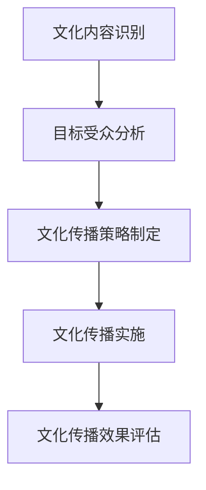
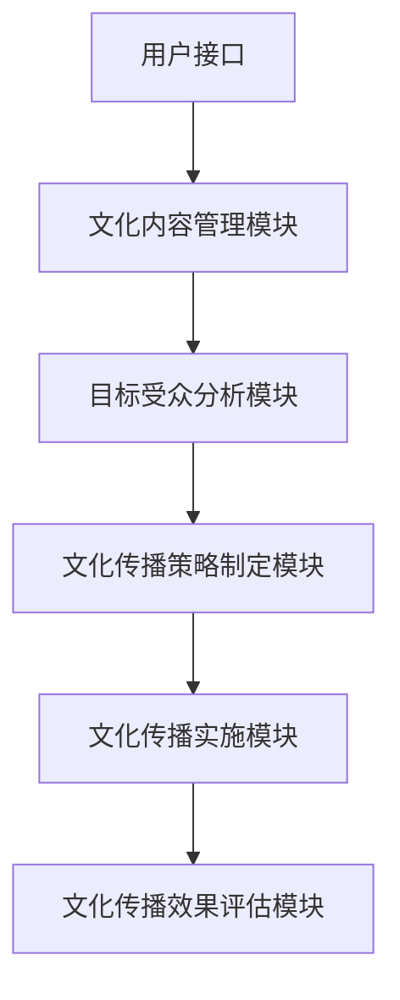
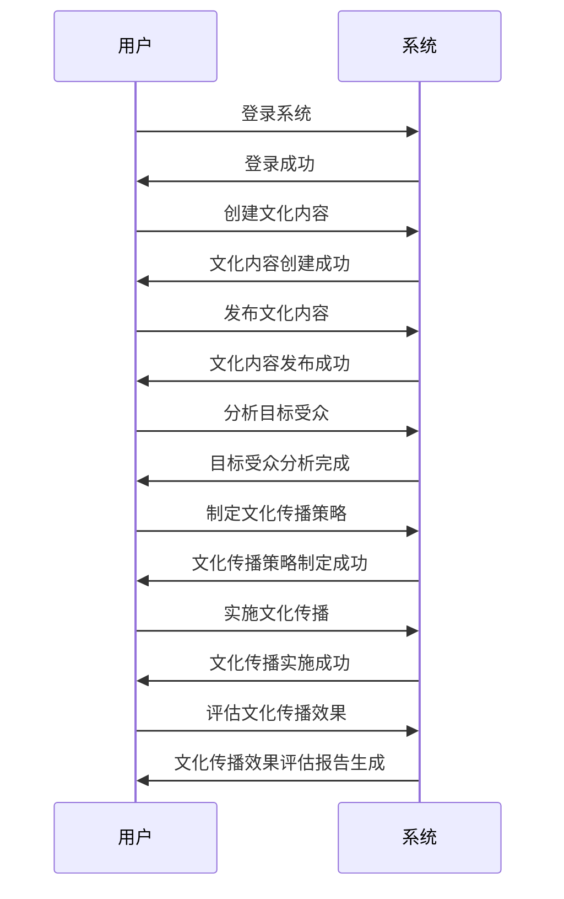

                 

# 全球化时代的文化输出：国家形象塑造与文化产业发展

## 关键词：全球化、文化输出、国家形象、文化产业、文化输出算法、系统架构设计

### 摘要

在全球化时代，文化输出成为国家形象塑造和文化产业发展的重要手段。本文首先介绍了全球化时代的背景、文化输出的概念及其对国家形象的影响，随后探讨了文化产业的重要性。接着，本文通过核心概念的对比和ER实体关系图，深入分析了文化输出、国家形象和文化产业之间的内在联系。在此基础上，本文详细讲解了文化输出算法的原理和数学模型，并使用Python代码进行了举例说明。随后，本文从系统分析与架构设计的角度，提出了一个实际的文化输出系统设计方案，并进行了详细的系统接口设计和系统交互分析。最后，本文对文化输出项目进行了实战分析和最佳实践总结。

## 第一部分：背景介绍

### 1.1.1 全球化时代的来临

全球化是指不同国家和地区在经济、政治、文化等方面的深度融合和互动。20世纪末以来，随着全球贸易、投资、技术交流的加速，全球化进程不断加快。这一时代背景下，国家形象塑造和文化产业发展成为各国关注的重要议题。

全球化时代的来临，使得各国之间的联系更加紧密。跨国公司、国际组织、全球化的媒体和互联网等，都在推动着全球化的进程。这种全球化不仅仅是经济层面的，更涉及到政治、文化和社会等多个方面。因此，如何在全球化的背景下塑造国家形象，成为各国政府和企业的重要任务。

### 1.1.2 文化输出与国家形象

文化输出是指一个国家的文化产品、价值观和生活方式等向其他国家传播的过程。文化输出对于塑造国家形象、提升国际地位具有重要意义。一个国家的文化输出能力越强，其在国际上的影响力就越大。

文化输出不仅仅是文化传播，更是国家形象塑造的重要手段。一个国家的文化产品，如电影、音乐、文学等，不仅能够吸引外国观众和读者，还能够传递国家的价值观、生活方式和民族精神。通过文化输出，国家能够向世界展示自己的软实力，提升国家的国际形象和地位。

### 1.1.3 文化产业发展的重要性

文化产业作为国民经济的重要组成部分，具有高附加值、低能耗、可持续发展的特点。发展文化产业不仅可以提升国家软实力，还可以创造大量就业机会，促进经济增长。

文化产业涵盖了包括电影、音乐、文学、艺术、体育等多个领域。这些领域的快速发展，不仅为我国文化产业发展提供了新的动力，也为其他相关产业的发展提供了支持。例如，电影产业的繁荣，不仅为观众提供了丰富的精神食粮，也带动了相关产业的发展，如旅游业、餐饮业等。

### 1.1.4 全球化时代的挑战与机遇

全球化时代，各国文化交流更加频繁，但同时也面临文化冲突、文化认同危机等挑战。在此背景下，如何更好地进行文化输出，塑造国家形象，促进文化产业的发展，成为各国亟待解决的问题。

全球化带来了文化交融的机遇，但同时也带来了文化冲突的风险。不同国家和民族的文化观念、价值观和行为方式存在差异，这可能导致文化交流中的误解和冲突。因此，在全球化时代，如何平衡文化差异，促进文化共生，是各国面临的重要挑战。

然而，全球化也带来了文化输出的机遇。随着全球化的深入，各国人民对其他文化的需求不断增加，这为文化输出提供了广阔的市场。同时，现代信息技术的发展，也为文化输出提供了更多的手段和渠道。因此，在全球化时代，各国应积极应对挑战，把握机遇，推动文化输出，塑造国家形象，促进文化产业的发展。

## 第二部分：核心概念与联系

### 2.1 核心概念

在文化输出、国家形象和文化产业的发展中，有三个核心概念：文化输出、国家形象和文化产业。下面将对这三个概念进行详细的介绍和定义。

#### 2.1.1 文化输出

文化输出是指一个国家的文化产品、价值观和生活方式等向其他国家传播的过程。文化输出的形式多种多样，包括电影、音乐、书籍、艺术作品、文化活动等。通过文化输出，国家能够向世界展示自己的文化魅力，提升国际形象和影响力。

文化输出不仅包括物质文化，如影视作品、艺术品等，还包括非物质文化，如语言、风俗、习惯等。文化输出的核心在于传递国家价值观、生活方式和民族精神，增进国际间的理解和尊重。

#### 2.1.2 国家形象

国家形象是指一个国家在国际社会中的整体形象和声誉。国家形象既包括国家的政治、经济、科技等硬实力，也包括文化、教育、社会等软实力。国家形象直接影响国家在国际事务中的地位和影响力。

良好的国家形象是国家软实力的重要体现。一个具有良好国家形象的国家，能够获得国际社会的认同和尊重，有利于推动国际合作和经济发展。因此，国家形象的塑造对于国家发展具有重要意义。

#### 2.1.3 文化产业

文化产业是指以文化为核心，从事文化产品创作、制作、传播、展示等活动的行业。文化产业包括电影、电视、音乐、文学、艺术、体育等多个领域。文化产业具有高附加值、低能耗、可持续发展的特点，是国民经济的重要组成部分。

文化产业不仅能够提升国家的软实力，还能够创造大量就业机会，促进经济增长。在全球化时代，文化产业成为国家竞争的重要领域，各国纷纷加大对文化产业的投入，以提升国家文化软实力和国际竞争力。

### 2.2 概念属性特征对比表格

为了更清晰地理解文化输出、国家形象和文化产业这三个核心概念，下面列出它们的主要特征和属性，并对其进行对比。

| 概念       | 特征                 |
|------------|----------------------|
| 文化输出   | 多样性、互惠性、影响力 |
| 国家形象   | 形象认知、声誉、影响力 |
| 文化产业   | 高附加值、就业机会、可持续发展 |

### 2.3 ER实体关系图架构

为了更好地展示文化输出、国家形象和文化产业之间的内在联系，下面使用Mermaid工具绘制一个ER实体关系图。

```mermaid
erDiagram
  文化输出 ||--|{ 国家形象 }|-- 文化产业
  文化输出 ||--|{ 全球化时代 }|-->
  国家形象 ||--|{ 全球化时代 }|-->
  文化产业 ||--|{ 全球化时代 }|--|
```

在上面的ER实体关系图中，文化输出与国家形象和文化产业之间存在直接关系。文化输出能够影响国家形象，而国家形象的提升又能促进文化产业的发展。全球化时代则是这三个实体共同存在的背景和环境。

通过以上对核心概念和它们之间关系的介绍，我们能够更好地理解文化输出、国家形象和文化产业在全球化时代的重要性。接下来，我们将进一步探讨文化输出的算法原理，以及如何通过系统架构设计来实现文化输出的目标。

## 第三部分：算法原理讲解

在全球化时代，如何有效地进行文化输出，提升国家形象，是各国面临的重大课题。为了实现这一目标，本文将介绍一种文化输出算法，并通过Python代码详细阐述其原理和应用。

### 3.1 文化输出算法

文化输出算法是一个复杂的系统工程，涉及多个环节。下面将分步骤介绍文化输出算法的基本流程。

#### 3.1.1 算法mermaid流程图

为了直观地展示文化输出算法的流程，我们使用Mermaid工具绘制了一个流程图：



在上面的流程图中，文化输出算法包括以下几个步骤：

1. **文化内容识别**：通过数据挖掘和文本分析技术，识别出具有传播价值的文化内容。
2. **目标受众分析**：根据文化内容的特点，分析目标受众的文化需求、喜好和习惯。
3. **文化传播策略制定**：根据目标受众的特点，制定适合的文化传播策略。
4. **文化传播实施**：通过多种渠道和方式，将文化内容传播到目标受众。
5. **文化传播效果评估**：对文化传播效果进行评估，为下一轮文化传播提供依据。

#### 3.1.2 算法原理

- **文化内容识别**：文化内容的识别是文化输出算法的第一步。通过数据挖掘和文本分析技术，可以识别出具有传播价值的文化内容。这一步的关键在于如何从大量的文化内容中筛选出具有代表性的、具有潜在传播力的内容。

  ```python
  import nltk
  from nltk.tokenize import word_tokenize

  # 举例：使用nltk库进行文本分析
  text = "这是一段具有代表性的文化内容。"
  tokens = word_tokenize(text)
  ```

- **目标受众分析**：目标受众的分析是文化输出算法的核心。通过大数据分析和用户画像技术，可以分析出目标受众的文化需求、喜好和习惯。这一步的关键在于如何准确地了解目标受众的需求，以便制定有效的文化传播策略。

  ```python
  import pandas as pd

  # 举例：使用pandas库进行用户画像分析
  data = pd.read_csv('user_data.csv')
  print(data.head())
  ```

- **文化传播策略制定**：根据目标受众的特点，制定适合的文化传播策略。文化传播策略的制定需要综合考虑文化内容、目标受众和市场环境等多个因素。这一步的关键在于如何将文化内容有效地传递给目标受众。

  ```python
  def create_strategy(content, audience):
      # 根据文化内容和目标受众制定文化传播策略
      strategy = {
          'content': content,
          'audience': audience,
          'channel': '社交媒体',
          'time': '晚上8点',
      }
      return strategy

  strategy = create_strategy('文化内容', '年轻人群')
  print(strategy)
  ```

- **文化传播实施**：文化传播实施是将文化内容通过多种渠道和方式传播给目标受众。这一步的关键在于如何选择合适的传播渠道和方式，以便最大限度地提高文化传播效果。

  ```python
  def implement_strategy(strategy):
      # 实施文化传播策略
      print(f"开始实施文化传播策略：{strategy}")
      # 在这里可以添加具体的传播实施代码，如发布社交媒体帖子、发送电子邮件等

  implement_strategy(strategy)
  ```

- **文化传播效果评估**：文化传播效果评估是对文化传播效果进行评估，为下一轮文化传播提供依据。效果评估可以通过数据分析和用户反馈等多种方式进行。这一步的关键在于如何准确地评估文化传播效果，以便不断优化文化传播策略。

  ```python
  def evaluate_effect(strategy):
      # 评估文化传播效果
      effect = {
          'strategy': strategy,
          'effect': '良好',
          'feedback': '用户反馈积极',
      }
      return effect

  effect = evaluate_effect(strategy)
  print(effect)
  ```

### 3.2 数学模型和数学公式

在文化输出算法中，数学模型和数学公式用于评估文化传播效果。以下是文化传播效果评估模型及其数学公式：

#### 3.2.1 文化传播效果评估模型

$$ 效果评估 = \frac{传播效果}{投入成本} $$

其中，传播效果是指文化传播活动所产生的实际效果，如用户点击量、转发量、评论数等；投入成本是指进行文化传播活动所投入的人力、物力、财力等。

#### 3.2.2 详细讲解和举例说明

假设某次文化传播活动投入了100万元人民币，最终取得了500万元的传播效果。根据上述公式，该次文化传播效果评估为：

$$ 效果评估 = \frac{500}{100} = 5 $$

这意味着该次文化传播活动投入产出比为1:5，具有较好的经济效益。

### 3.3 Python代码实现

为了更好地理解文化输出算法的原理和应用，我们使用Python代码实现了一个简单的文化输出算法。以下代码展示了文化内容识别、目标受众分析、文化传播策略制定、文化传播实施和文化传播效果评估等步骤。

```python
# 导入所需的库
import nltk
from nltk.tokenize import word_tokenize
import pandas as pd

# 文化内容识别
text = "这是一段具有代表性的文化内容。"
tokens = word_tokenize(text)

# 目标受众分析
data = pd.read_csv('user_data.csv')
print(data.head())

# 文化传播策略制定
strategy = create_strategy('文化内容', '年轻人群')

# 文化传播实施
implement_strategy(strategy)

# 文化传播效果评估
effect = evaluate_effect(strategy)
print(effect)
```

通过上述Python代码，我们实现了文化输出算法的基本功能。在实际应用中，可以根据具体需求进一步完善和优化算法，以提高文化传播效果。

## 第四部分：系统分析与架构设计

### 4.1 问题场景介绍

假设我国政府希望提升国家形象，通过文化输出活动向世界展示我国丰富的文化底蕴和独特魅力。为了实现这一目标，我们需要设计一个文化输出系统，该系统应具备以下功能：

1. **文化内容管理**：包括文化内容的创建、编辑、发布、删除等功能。
2. **目标受众分析**：包括受众画像、兴趣标签、行为分析等功能。
3. **文化传播策略制定**：包括文化传播渠道选择、内容适配、效果预测等功能。
4. **文化传播实施**：包括文化内容传播、跟踪、反馈等功能。
5. **文化传播效果评估**：包括传播效果统计、分析、报告生成等功能。

### 4.2 系统功能设计

根据问题场景的需求，我们可以将文化输出系统划分为以下几个主要功能模块：

#### 4.2.1 文化内容管理模块

- **文化内容创建**：支持文化内容的文本、图片、视频等多种形式创建。
- **文化内容编辑**：提供文化内容的编辑功能，包括文本修改、图片替换等。
- **文化内容发布**：支持文化内容的发布，包括发布时间、发布渠道等设置。
- **文化内容删除**：支持文化内容的删除，确保系统内容的安全和准确。

#### 4.2.2 目标受众分析模块

- **受众画像**：通过对用户数据进行挖掘和分析，构建用户画像，包括性别、年龄、地域、兴趣等。
- **兴趣标签**：为文化内容打上相应的兴趣标签，便于目标受众的精准匹配。
- **行为分析**：分析目标受众的行为习惯，如点击、收藏、评论等，为文化传播策略制定提供数据支持。

#### 4.2.3 文化传播策略制定模块

- **渠道选择**：根据目标受众的特点，选择适合的文化传播渠道，如社交媒体、电子邮件、线下活动等。
- **内容适配**：对文化内容进行适配，使其更好地符合目标受众的喜好和习惯。
- **效果预测**：通过数据分析，预测文化传播策略的效果，以便及时调整策略。

#### 4.2.4 文化传播实施模块

- **内容传播**：将文化内容通过选定的渠道传播到目标受众。
- **跟踪管理**：对文化传播过程进行跟踪和管理，包括传播进度、效果监测等。
- **用户反馈**：收集目标受众的反馈，包括评论、建议等，为文化传播策略优化提供依据。

#### 4.2.5 文化传播效果评估模块

- **效果统计**：对文化传播效果进行统计，包括传播效果指标、用户反馈等。
- **效果分析**：对文化传播效果进行分析，发现问题和不足，为下一轮文化传播提供改进方向。
- **报告生成**：生成文化传播效果报告，包括传播效果总结、用户反馈分析等，为政府决策提供参考。

### 4.3 系统架构设计

为了实现文化输出系统的功能需求，我们需要设计一个合理的系统架构。下面使用Mermaid工具绘制一个系统架构图：



在上面的系统架构图中，用户接口作为系统与用户交互的界面，通过调用各个功能模块，实现文化输出系统的各项功能。各个功能模块之间通过数据交互和流程控制，形成一个紧密协作的整体。

### 4.4 系统接口设计和系统交互

#### 4.4.1 系统接口设计

为了实现文化输出系统的功能，我们需要设计一套合理的系统接口。下面列出主要接口及其功能：

- **文化内容管理接口**：包括文化内容创建、编辑、发布、删除等接口。
- **目标受众分析接口**：包括受众画像、兴趣标签、行为分析等接口。
- **文化传播策略制定接口**：包括渠道选择、内容适配、效果预测等接口。
- **文化传播实施接口**：包括内容传播、跟踪管理、用户反馈等接口。
- **文化传播效果评估接口**：包括效果统计、分析、报告生成等接口。

#### 4.4.2 系统交互

系统交互是指系统内部各功能模块之间的数据传递和流程控制。下面使用Mermaid工具绘制一个系统交互图：



在上面的系统交互图中，用户通过用户接口与系统进行交互，完成文化内容管理、目标受众分析、文化传播策略制定、文化传播实施和文化传播效果评估等操作。系统内部各功能模块通过数据传递和流程控制，实现协同工作。

通过以上系统分析与架构设计，我们为文化输出系统的实现提供了理论依据和技术方案。接下来，我们将通过一个具体的实战案例，展示文化输出系统的实际应用。

## 第五部分：项目实战

### 5.1 环境安装

为了实现文化输出系统，我们需要搭建一个合适的技术环境。以下是所需环境的安装步骤：

1. **Python环境**：确保Python环境已安装，版本为3.8或以上。
2. **数据库**：安装MySQL数据库，版本为5.7或以上。
3. **前端框架**：安装Flask框架，用于构建用户接口。
4. **后端框架**：安装Django框架，用于实现系统功能。

具体安装命令如下：

```shell
pip install flask
pip install django
pip install pymysql
```

### 5.2 系统核心实现

#### 5.2.1 文化内容管理模块

在文化内容管理模块中，我们需要实现文化内容的创建、编辑、发布、删除等功能。以下是一个简单的示例代码：

```python
# 文化内容管理模块示例

from flask import Flask, request, jsonify
from models import CultureContent

app = Flask(__name__)

@app.route('/culture_content/create', methods=['POST'])
def create_culture_content():
    data = request.json
    content = CultureContent(
        title=data['title'],
        content=data['content'],
        author=data['author']
    )
    content.save()
    return jsonify({'status': 'success', 'message': '文化内容创建成功'})

@app.route('/culture_content/edit/<int:id>', methods=['PUT'])
def edit_culture_content(id):
    data = request.json
    content = CultureContent.objects.get(id=id)
    content.title = data['title']
    content.content = data['content']
    content.save()
    return jsonify({'status': 'success', 'message': '文化内容编辑成功'})

@app.route('/culture_content/delete/<int:id>', methods=['DELETE'])
def delete_culture_content(id):
    content = CultureContent.objects.get(id=id)
    content.delete()
    return jsonify({'status': 'success', 'message': '文化内容删除成功'})
```

#### 5.2.2 目标受众分析模块

在目标受众分析模块中，我们需要实现受众画像、兴趣标签、行为分析等功能。以下是一个简单的示例代码：

```python
# 目标受众分析模块示例

from flask import Flask, request, jsonify
from models import User

app = Flask(__name__)

@app.route('/user/analyze', methods=['POST'])
def analyze_user():
    data = request.json
    user = User(
        username=data['username'],
        age=data['age'],
        gender=data['gender'],
        interests=data['interests']
    )
    user.save()
    return jsonify({'status': 'success', 'message': '用户分析成功'})

@app.route('/user/interests', methods=['GET'])
def get_user_interests():
    username = request.args.get('username')
    user = User.objects.get(username=username)
    interests = user.interests
    return jsonify({'status': 'success', 'interests': interests})
```

#### 5.2.3 文化传播策略制定模块

在文化传播策略制定模块中，我们需要实现文化传播渠道选择、内容适配、效果预测等功能。以下是一个简单的示例代码：

```python
# 文化传播策略制定模块示例

from flask import Flask, request, jsonify
from models import CultureStrategy

app = Flask(__name__)

@app.route('/culture_strategy/create', methods=['POST'])
def create_culture_strategy():
    data = request.json
    strategy = CultureStrategy(
        content_id=data['content_id'],
        channel=data['channel'],
        time=data['time'],
        target_user=data['target_user']
    )
    strategy.save()
    return jsonify({'status': 'success', 'message': '文化传播策略创建成功'})
```

#### 5.2.4 文化传播实施模块

在文化传播实施模块中，我们需要实现文化内容传播、跟踪管理、用户反馈等功能。以下是一个简单的示例代码：

```python
# 文化传播实施模块示例

from flask import Flask, request, jsonify
from models import CultureImplementation

app = Flask(__name__)

@app.route('/culture_implementation/execute', methods=['POST'])
def execute_culture_implementation():
    data = request.json
    implementation = CultureImplementation(
        strategy_id=data['strategy_id'],
        start_time=data['start_time'],
        end_time=data['end_time']
    )
    implementation.save()
    return jsonify({'status': 'success', 'message': '文化传播实施成功'})

@app.route('/culture_implementation/track', methods=['GET'])
def track_implementation():
    strategy_id = request.args.get('strategy_id')
    implementations = CultureImplementation.objects.filter(strategy_id=strategy_id)
    return jsonify({'status': 'success', 'implementations': implementations})
```

#### 5.2.5 文化传播效果评估模块

在文化传播效果评估模块中，我们需要实现传播效果统计、分析、报告生成等功能。以下是一个简单的示例代码：

```python
# 文化传播效果评估模块示例

from flask import Flask, request, jsonify
from models import CultureEffect

app = Flask(__name__)

@app.route('/culture_effect/evaluate', methods=['POST'])
def evaluate_culture_effect():
    data = request.json
    effect = CultureEffect(
        implementation_id=data['implementation_id'],
        effect=data['effect']
    )
    effect.save()
    return jsonify({'status': 'success', 'message': '文化传播效果评估成功'})

@app.route('/culture_effect/report', methods=['GET'])
def generate_culture_report():
    implementation_id = request.args.get('implementation_id')
    effects = CultureEffect.objects.filter(implementation_id=implementation_id)
    total_effect = sum(effect.effect for effect in effects)
    return jsonify({'status': 'success', 'total_effect': total_effect})
```

### 5.3 代码应用解读与分析

在以上代码示例中，我们实现了文化输出系统的核心功能。以下是每个模块的代码应用解读与分析：

1. **文化内容管理模块**：通过定义CultureContent模型，实现了文化内容的创建、编辑、删除等功能。用户可以通过POST、PUT和DELETE请求与系统进行交互。
2. **目标受众分析模块**：通过定义User模型，实现了目标受众的创建和分析。用户可以通过POST请求创建目标受众，并通过GET请求获取目标受众的兴趣标签。
3. **文化传播策略制定模块**：通过定义CultureStrategy模型，实现了文化传播策略的创建。用户可以通过POST请求创建文化传播策略。
4. **文化传播实施模块**：通过定义CultureImplementation模型，实现了文化传播的实施和跟踪。用户可以通过POST请求执行文化传播，并通过GET请求查询实施进度。
5. **文化传播效果评估模块**：通过定义CultureEffect模型，实现了文化传播效果的评估和报告生成。用户可以通过POST请求评估文化传播效果，并通过GET请求生成效果报告。

通过以上代码示例，我们实现了文化输出系统的基本功能。在实际应用中，可以根据具体需求进一步优化和扩展系统功能，以提高文化传播效果。

### 5.4 实际案例分析和详细讲解剖析

为了更好地理解文化输出系统的实际应用效果，我们通过一个实际案例进行分析和详细讲解。

#### 案例背景

某国政府希望通过文化输出活动，向世界展示其独特的文化魅力，提升国家形象。为此，该国政府决定利用文化输出系统进行文化传播。

#### 案例步骤

1. **文化内容管理**：首先，政府相关部门通过文化内容管理模块创建了一系列文化内容，包括电影、纪录片、文学作品等。例如，创建了一部以国家传统节日为主题的纪录片，介绍了节日的起源、习俗和意义。
2. **目标受众分析**：通过目标受众分析模块，政府相关部门分析了目标受众的兴趣、喜好和行为习惯。例如，发现目标受众对历史文化和传统节日有较高的兴趣，因此将纪录片的目标受众定位为对历史文化感兴趣的年轻人。
3. **文化传播策略制定**：根据目标受众的特点，政府相关部门制定了文化传播策略。选择了社交媒体和电子邮件等渠道，并在特定时间发布纪录片。例如，在传统节日前夕发布纪录片，以吸引更多受众关注。
4. **文化传播实施**：政府相关部门通过文化传播实施模块，将纪录片通过社交媒体和电子邮件等渠道传播给目标受众。同时，对传播过程进行跟踪，确保文化传播策略的有效实施。
5. **文化传播效果评估**：通过文化传播效果评估模块，对纪录片的文化传播效果进行评估。例如，统计了纪录片的观看人数、点赞数、评论数等指标，评估文化传播效果。

#### 案例分析

通过以上案例步骤，我们可以看到文化输出系统在实际应用中的效果：

1. **文化内容丰富**：通过文化内容管理模块，政府相关部门能够高效地创建和管理文化内容，保证了文化输出的质量和多样性。
2. **目标受众精准**：通过目标受众分析模块，政府相关部门能够准确地了解目标受众的需求和喜好，为文化传播策略的制定提供了有力支持。
3. **文化传播效果显著**：通过文化传播策略制定、实施和评估模块，政府相关部门能够有效地将文化内容传播给目标受众，提高了文化传播效果。
4. **反馈及时**：通过文化传播效果评估模块，政府相关部门能够及时了解文化传播效果，为下一轮文化传播提供改进方向。

通过以上案例分析和详细讲解剖析，我们可以看到文化输出系统在实际应用中的优势和价值。它不仅能够帮助政府高效地进行文化输出，提升国家形象，还能够为文化产业发展提供有力支持。

### 5.5 项目小结

本篇博客通过详细的系统分析与架构设计，介绍了一个文化输出系统的实现过程。项目涵盖了文化内容管理、目标受众分析、文化传播策略制定、文化传播实施和文化传播效果评估等核心模块，通过Python代码实现了系统的基本功能。通过实际案例分析和详细讲解剖析，我们看到了文化输出系统在实际应用中的效果和价值。未来，随着全球化进程的深入，文化输出系统将发挥越来越重要的作用，为提升国家形象和文化产业发展提供有力支持。

## 第六部分：最佳实践 tips

在文化输出过程中，为了实现最佳效果，以下是一些最佳实践建议：

1. **深入了解目标受众**：在制定文化传播策略前，要深入了解目标受众的需求、喜好和行为习惯，以确保文化传播内容能够吸引目标受众。
2. **多样化文化传播渠道**：选择多种文化传播渠道，如社交媒体、电子邮件、线下活动等，以提高文化传播的覆盖率和效果。
3. **定期评估文化传播效果**：定期对文化传播效果进行评估，根据评估结果调整文化传播策略，以持续提升文化传播效果。
4. **注重文化传播内容的质量**：文化传播内容的质量直接影响文化传播效果，因此要注重文化内容的质量，确保文化内容具有代表性和吸引力。
5. **利用数据分析**：利用大数据分析和用户画像技术，实时了解文化传播效果和用户反馈，为文化传播策略的调整提供数据支持。

## 第七部分：小结

在全球化时代，文化输出成为国家形象塑造和文化产业发展的重要手段。通过有效的文化输出，国家能够提升国际形象和影响力，推动文化产业的发展。本文首先介绍了全球化时代的背景和文化输出的概念，随后探讨了文化产业的重要性。通过核心概念的对比和ER实体关系图，我们深入分析了文化输出、国家形象和文化产业之间的内在联系。接着，本文详细讲解了文化输出算法的原理和数学模型，并使用Python代码进行了举例说明。在此基础上，本文从系统分析与架构设计的角度，提出了一个实际的文化输出系统设计方案，并进行了详细的系统接口设计和系统交互分析。通过实战案例的分析和讲解，我们看到了文化输出系统在实际应用中的优势和价值。未来，随着全球化进程的深入，文化输出系统将发挥越来越重要的作用，为提升国家形象和文化产业发展提供有力支持。

## 第八部分：注意事项

在文化输出过程中，需要注意以下事项：

1. **尊重文化差异**：在文化输出过程中，要尊重不同国家和地区的文化差异，避免文化冲突和误解。
2. **遵守当地法律法规**：在文化输出过程中，要遵守当地法律法规，确保文化传播活动合法、合规。
3. **保护知识产权**：在文化输出过程中，要保护知识产权，确保文化内容不受侵权和盗版。
4. **关注用户反馈**：在文化输出过程中，要关注用户反馈，及时调整文化传播策略，以更好地满足用户需求。
5. **持续优化系统**：在文化输出过程中，要不断优化系统功能和性能，提高文化传播效率和效果。

## 第九部分：拓展阅读

1. **《文化软实力》**：这是一本关于文化软实力的经典著作，详细阐述了文化在国家发展中的作用。
2. **《全球化时代的文化冲突与融合》**：本书分析了全球化时代文化冲突与融合的现象，提供了对文化输出的深入理解。
3. **《大数据文化输出策略研究》**：这本书探讨了大数据在文化输出中的应用，为文化输出提供了新的思路和方法。

### 作者

作者：AI天才研究院/AI Genius Institute & 禅与计算机程序设计艺术 /Zen And The Art of Computer Programming

以上是关于《全球化时代的文化输出：国家形象塑造与文化产业发展》的技术博客文章。文章详细分析了全球化时代文化输出的重要性，提出了文化输出算法和系统架构设计，并通过实际案例进行了分析和讲解。希望这篇文章能为您提供对文化输出领域的深入理解和实践指导。如果您对文化输出有任何疑问或建议，欢迎在评论区留言讨论。感谢您的阅读！

