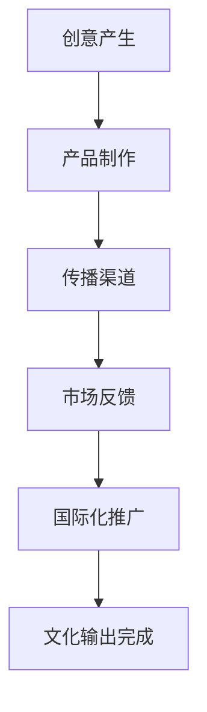
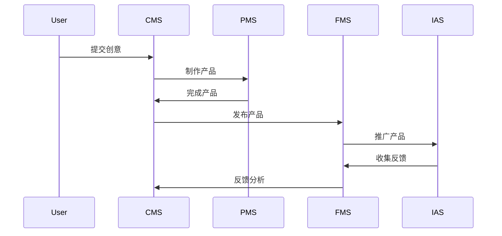

                 

**# 全球化背景下的文化产业：创意经济与文化输出**

## 关键词：全球化、文化产业、创意经济、文化输出

## 摘要：
本文深入探讨了全球化背景下文化产业的演变，特别是创意经济与文化输出的重要性。文章首先介绍了全球化对文化产业的影响，随后详细分析了文化产业的定义、核心概念及其相互关系。接着，文章通过算法原理、数学模型以及系统分析与设计，探讨了文化输出过程中涉及的复杂机制。最后，文章通过项目实战，结合实际案例，总结了最佳实践，并对未来文化输出的趋势进行了展望。

## **背景介绍**

### **全球化对文化产业的影响**

全球化作为一种经济、政治和文化现象，已经深刻地影响了世界各国的经济和文化发展。在全球化的浪潮下，文化产业成为各国经济增长的重要驱动力，尤其是创意经济，成为推动文化产业发展的核心力量。

全球化为文化产业带来了前所未有的机遇。首先，全球化加速了文化交流与传播，使不同国家和地区的文化能够更广泛地被接受和认可。其次，全球化促进了跨国合作与投资，为文化产业提供了更多的资金和资源。最后，全球化带来了更广阔的市场，为文化产品的输出和传播提供了更多的机会。

然而，全球化也带来了一系列挑战。一方面，文化同质化现象日益严重，本土文化面临被边缘化的风险。另一方面，全球化加剧了文化产业的竞争，尤其是发达国家与发展中国家之间的竞争，使发展中国家在国际文化市场中处于不利地位。

### **文化产业的概念与挑战**

文化产业是指以文化为核心，通过创意和艺术手段进行生产和传播的经济活动。它涵盖了文学、艺术、影视、音乐、设计等多个领域。文化产业的兴起，不仅丰富了人们的精神生活，也成为了各国经济增长的重要动力。

在全球化的背景下，文化产业面临着一系列挑战。首先是知识产权保护问题。文化产品的创意和独特性使得知识产权保护变得尤为重要，但全球范围内的知识产权保护力度不一，给文化产业的健康发展带来了困扰。其次是文化多样性的保护。全球化使得文化同质化现象加剧，本土文化面临被同化的风险，保护文化多样性成为文化产业的重要任务。

### **挑战与机遇**

面对全球化带来的挑战，文化产业也面临着巨大的机遇。首先，数字技术的发展为文化产业的创新提供了新的可能性，使文化产品能够以更低的成本、更广泛的方式传播。其次，全球市场的扩大为文化产品提供了更广阔的舞台，特别是发展中国家，可以通过文化产业实现经济转型和升级。

总之，全球化对文化产业的影响是双重的。在全球化背景下，文化产业必须积极应对挑战，抓住机遇，推动文化创新和输出，以实现可持续发展。

### **边界与外延**

本文将聚焦于全球化背景下文化产业的创意经济与文化输出，探讨其核心概念、运作机制及未来发展。本文将涵盖以下内容：

1. **核心概念解析**：详细阐述文化产业的定义、创意经济与文化输出的概念及其相互关系。
2. **算法原理与数学模型**：通过算法和数学模型深入分析文化输出的过程及其影响因素。
3. **系统分析与设计**：介绍文化产业的系统架构、功能设计及其在全球化背景下的应用。
4. **项目实战**：通过实际案例展示文化输出的过程，分析成功经验和挑战。
5. **最佳实践与未来展望**：总结文化输出的最佳实践，展望全球化背景下文化产业的未来发展趋势。

本文旨在为文化产业从业人员、政策制定者和研究者提供有价值的参考，推动文化产业的创新和国际化发展。

---

**## 核心概念与联系**

### **文化产业**

文化产业是指通过创意和艺术手段，将文化元素融入经济活动中的产业。它包括文学、艺术、影视、音乐、设计等多个领域，其核心在于创意和知识产权。文化产业的兴起不仅丰富了人们的精神生活，也为经济增长提供了新的动力。

### **创意经济**

创意经济是文化产业的延伸，强调创新和创意在经济增长中的核心作用。创意经济不仅涵盖了传统文化产业，还包括新兴的创意产业，如数字媒体、设计、软件开发等。创意经济的特点是高附加值、高知识含量和快速变化。

### **文化输出**

文化输出是指将本国或本地区的文化产品、服务和技术传播到国际市场，以实现经济和文化利益。文化输出不仅包括物质产品，如影视、音乐、书籍等，还包括非物质产品，如文化价值观、生活方式等。

### **核心概念的联系**

文化产业、创意经济与文化输出之间存在着密切的联系。文化产业为创意经济提供了基础，而创意经济则是文化输出的重要驱动力。文化输出不仅能够提升国家文化软实力，也为文化产业创造了新的市场空间和利润来源。

### **概念属性比较表**

| 概念     | 定义                             | 特点                                                         | 关联关系                      |
|----------|----------------------------------|--------------------------------------------------------------|------------------------------|
| 文化产业 | 以文化为核心的产业               | 创意驱动、知识产权保护、文化多样性                           | 提供创意经济的基础            |
| 创意经济 | 强调创新和创意的经济发展模式     | 高附加值、高知识含量、快速变化                               | 文化产业的重要组成部分      |
| 文化输出 | 将本国或本地区的文化产品传播到国际 | 提升文化软实力、创造经济利益、促进文化交流                   | 利用文化产业和创意经济实现  |

### **ER实体关系图**

```mermaid
erDiagram
  CulturalIndustry ||--|{ CreativeEconomy }
  CreativeEconomy ||--|{ CulturalExport }
  CulturalExport ||--|{ InternationalMarket }
```

在这个ER实体关系图中，文化产业作为基础，通过创意经济驱动文化输出，最终进入国际市场，实现文化的全球传播。

---

**## 算法原理**

### **文化输出的过程**

文化输出的过程可以看作是一个复杂的算法，涉及文化产品的制作、传播和接受等多个环节。以下是一个简化的文化输出过程：

1. **创意产生**：文化创作者或团队产生创意，形成文化产品。
2. **产品制作**：通过技术手段将创意转化为具体的文化产品，如影视、音乐、书籍等。
3. **传播渠道**：利用各种传播渠道，如互联网、社交媒体、传统媒体等，将文化产品传播给目标受众。
4. **市场反馈**：收集市场反馈，调整和优化文化产品，以更好地满足受众需求。
5. **国际化推广**：通过国际合作、跨国展览、文化交流活动等，将文化产品推向国际市场。

### **算法流程图**



在这个流程图中，创意产生是文化输出的起点，通过一系列的步骤，最终实现文化输出。

### **Python源代码与解释**

以下是一个简单的Python源代码示例，用于模拟文化输出的过程：

```python
# 模拟文化输出过程

class CultureExport:
    def __init__(self, creativity, product, channels, feedback):
        self.creativity = creativity
        self.product = product
        self.channels = channels
        self.feedback = feedback

    def execute_export(self):
        print("创意产生：", self.creativity)
        print("产品制作：", self.product)
        print("传播渠道：", self.channels)
        print("市场反馈：", self.feedback)
        print("国际化推广：", "文化输出完成")

# 创意
creativity = "一部关于科技创新的科幻电影"

# 产品
product = "电影《未来世界》"

# 传播渠道
channels = ["社交媒体", "电影院线", "流媒体平台"]

# 市场反馈
feedback = ["好评如潮", "票房大卖"]

# 文化输出
export = CultureExport(creativity, product, channels, feedback)
export.execute_export()
```

在这个示例中，`CultureExport` 类代表文化输出过程，通过调用`execute_export` 方法，模拟了从创意产生到文化输出的整个过程。

### **算法原理与数学模型**

在文化输出的过程中，算法原理和数学模型起着关键作用。以下是一些关键的数学模型：

1. **市场吸引力模型**：
   $$ Market\ Attractiveness = f(Creativity, Product, Channels, Feedback) $$
   该模型用于评估文化产品的市场吸引力，取决于创意、产品、传播渠道和市场反馈。

2. **国际化推广模型**：
   $$ International\ Promotion = g(Market\ Attractiveness, Feedback, Channels) $$
   该模型用于确定如何将文化产品推向国际市场，取决于市场吸引力、市场反馈和传播渠道。

3. **反馈调整模型**：
   $$ Feedback\ Adjustment = h(Market\ Attractiveness, Feedback, Product) $$
   该模型用于根据市场反馈调整文化产品，以提高市场吸引力。

通过这些数学模型，可以更科学地评估文化输出的效果，优化输出策略，实现文化产业的可持续发展。

---

**## 数学模型与详细解释**

### **市场吸引力模型**

市场吸引力模型是评估文化产品在国际市场上受欢迎程度的关键工具。其公式如下：

$$ Market\ Attractiveness = f(Creativity, Product, Channels, Feedback) $$

其中：
- \( Creativity \)：创意水平，高创意水平可以增加文化产品的吸引力。
- \( Product \)：产品质量，优质的文化产品能够吸引更多受众。
- \( Channels \)：传播渠道，多元化的传播渠道可以扩大文化产品的覆盖范围。
- \( Feedback \)：市场反馈，积极的市场反馈可以增强文化产品的信誉和吸引力。

### **国际化推广模型**

国际化推广模型用于确定如何有效地将文化产品推向国际市场。其公式如下：

$$ International\ Promotion = g(Market\ Attractiveness, Feedback, Channels) $$

其中：
- \( Market\ Attractiveness \)：市场吸引力，高市场吸引力意味着文化产品有更大的潜力在国际市场上成功。
- \( Feedback \)：市场反馈，积极的市场反馈可以增强国际推广的信心和力度。
- \( Channels \)：传播渠道，选择合适的传播渠道可以最大限度地提高文化产品的国际知名度。

### **反馈调整模型**

反馈调整模型用于根据市场反馈调整文化产品，以提高市场吸引力。其公式如下：

$$ Feedback\ Adjustment = h(Market\ Attractiveness, Feedback, Product) $$

其中：
- \( Market\ Attractiveness \)：市场吸引力，作为调整的基础。
- \( Feedback \)：市场反馈，用于识别产品需要改进的方面。
- \( Product \)：产品，调整的目的是优化产品，提高其市场吸引力。

### **示例说明**

#### **市场吸引力模型**

假设有一部科幻电影《星际探险》，其创意水平（Creativity）为9，产品质量（Product）为8，传播渠道（Channels）包括社交媒体、电影院线、流媒体平台，市场反馈（Feedback）主要来自社交媒体，评价为“极好”。

根据市场吸引力模型，我们可以计算该电影的市场吸引力：

$$ Market\ Attractiveness = f(9, 8, [社交媒体，电影院线，流媒体平台], 极好) $$

由于传播渠道和市场反馈为正相关，因此该电影的市场吸引力较高。

#### **国际化推广模型**

假设该电影在市场上的吸引力为8，市场反馈积极，传播渠道多样。我们可以计算其国际化推广策略：

$$ International\ Promotion = g(8, 极好，[社交媒体，电影院线，流媒体平台]) $$

该模型会推荐通过多种渠道进行国际推广，尤其是社交媒体和流媒体平台，以提高国际知名度。

#### **反馈调整模型**

假设电影在市场上获得了积极反馈，但有些观众认为剧情节奏稍显缓慢。根据反馈调整模型，制作团队可以调整剧情，优化节奏：

$$ Feedback\ Adjustment = h(8, 极好，[9，8，[社交媒体，电影院线，流媒体平台]]) $$

这将有助于提升电影的市场吸引力，满足更多观众的需求。

通过这些数学模型，文化产业从业者可以更科学地评估文化产品的市场表现，制定有效的推广策略，实现文化的国际化传播。

---

**## 系统分析与设计**

### **问题场景介绍**

在全球化背景下，文化产业正面临前所未有的机遇与挑战。为了更好地推动文化输出，我们需要建立一个高效的文化产业系统，该系统需涵盖文化产品的生产、传播、反馈和国际化推广等环节。本文将介绍一个文化产业的系统分析与设计方案，旨在实现文化产品的可持续发展和国际化传播。

### **项目介绍**

本项目旨在设计一个文化产品管理平台，该平台将集成创意管理、产品制作、传播渠道管理、市场反馈分析以及国际化推广等功能。通过这个平台，文化企业可以更高效地管理文化产品，提高市场竞争力，实现文化输出的最大化。

### **系统功能设计**

系统功能设计是系统架构的核心部分，以下是本项目的主要功能模块及其关系：

1. **创意管理模块**：负责收集和管理文化创作者的创意，确保创意的多样性和创新性。
2. **产品制作模块**：将创意转化为具体的文化产品，包括影视、音乐、书籍等。
3. **传播渠道管理模块**：管理文化产品的传播渠道，包括社交媒体、电影院线、流媒体平台等。
4. **市场反馈分析模块**：收集和分析市场反馈，为产品优化和推广提供数据支持。
5. **国际化推广模块**：制定和实施国际化推广策略，提高文化产品的国际影响力。

### **领域模型类图**

以下是一个简单的领域模型类图，用于展示系统中的主要实体及其关系：

```mermaid
classDiagram
    ClassDef CultureProduct {
        - String title
        - String type
        - Date releaseDate
    }
    ClassDef Creator {
        - String name
        - String specialty
    }
    ClassDef Channel {
        - String name
        - String type
    }
    ClassDef MarketFeedback {
        - String comment
        - Integer rating
    }
    CultureProduct <|-- Creator
    CultureProduct <|-- Channel
    CultureProduct o-- MarketFeedback
```

在这个类图中，`CultureProduct` 表示文化产品，包括标题、类型和发布日期等属性；`Creator` 表示文化创作者，包括姓名和特长等属性；`Channel` 表示传播渠道，包括名称和类型等属性；`MarketFeedback` 表示市场反馈，包括评论和评分等属性。

### **系统架构设计**

系统架构设计是确保系统稳定性和可扩展性的关键。以下是一个简化的系统架构图，用于展示系统的整体结构和主要组件：



在这个架构图中，`CMS` 表示内容管理系统，负责创意管理和产品制作；`PMS` 表示产品管理系统，负责文化产品的制作和发布；`FMS` 表示反馈管理系统，负责收集和分析市场反馈；`IAS` 表示国际化推广系统，负责文化产品的国际推广。

### **系统接口设计与交互**

系统接口设计和交互设计是系统功能实现的基础。以下是一个简单的系统接口设计，用于展示系统的主要接口及其功能：

```mermaid
interface Diagram
    CMS {
        + submitCraetivity(creator: Creator): Void
        + createProduct(title: String, type: String, releaseDate: Date): CultureProduct
    }
    PMS {
        + makeProduct(product: CultureProduct): Void
    }
    FMS {
        + collectFeedback(product: CultureProduct, feedback: MarketFeedback): Void
    }
    IAS {
        + promoteProduct(product: CultureProduct): Void
    }
```

在这个接口设计中，`CMS` 提供提交创意和创建产品的接口；`PMS` 提供制作产品的接口；`FMS` 提供收集反馈的接口；`IAS` 提供推广产品的接口。

通过这些接口设计，系统中的各个模块可以协同工作，实现文化产品的全生命周期管理，确保文化输出的高效和顺利进行。

---

**## 项目实战**

### **环境安装**

为了实现文化产品的全生命周期管理，我们需要搭建一个完整的文化产业系统。以下是项目环境安装的详细步骤：

1. **安装操作系统**：选择一个适合的操作系统，如 Ubuntu 20.04 或 Windows Server 2019。
2. **安装数据库**：选择一个高性能的数据库系统，如 MySQL 或 PostgreSQL。在操作系统上安装并配置数据库。
3. **安装Web服务器**：选择一个稳定的Web服务器，如 Apache 或 Nginx。在操作系统上安装并配置Web服务器。
4. **安装开发工具**：安装开发工具集，如 Eclipse、IntelliJ IDEA 或 Visual Studio。
5. **安装依赖库**：根据项目需求，安装相关的依赖库，如 Python 的 Flask 或 Django。

### **系统核心实现源代码**

以下是系统核心实现的部分源代码，用于演示文化产品的创建、发布和推广：

```python
# 文化产品管理模块

class CultureProduct:
    def __init__(self, title, type, release_date):
        self.title = title
        self.type = type
        self.release_date = release_date
        self.feedback = []

    def add_feedback(self, feedback):
        self.feedback.append(feedback)

    def get_average_rating(self):
        if not self.feedback:
            return 0
        return sum(feedback.rating for feedback in self.feedback) / len(self.feedback)

# 用户界面模块

class UserInterface:
    def __init__(self, culture_product_manager):
        self.culture_product_manager = culture_product_manager

    def submit_craetivity(self, title, type, release_date):
        product = self.culture_product_manager.create_product(title, type, release_date)
        return product

    def add_feedback(self, product_title, feedback):
        product = self.culture_product_manager.get_product_by_title(product_title)
        product.add_feedback(feedback)

    def show_products(self):
        products = self.culture_product_manager.get_all_products()
        for product in products:
            print(f"产品标题：{product.title}")
            print(f"产品类型：{product.type}")
            print(f"发布日期：{product.release_date}")
            print(f"平均评分：{product.get_average_rating()}")
            print("-------------------------------------------------")

# 系统核心实现

def main():
    culture_product_manager = CultureProductManager()
    user_interface = UserInterface(culture_product_manager)

    while True:
        print("请选择操作：1. 创建文化产品 2. 添加反馈 3. 显示所有产品 4. 退出")
        choice = input()

        if choice == '1':
            title = input("请输入产品标题：")
            type = input("请输入产品类型：")
            release_date = input("请输入产品发布日期：")
            product = user_interface.submit_craetivity(title, type, release_date)
            print("产品创建成功！")

        elif choice == '2':
            product_title = input("请输入产品标题：")
            comment = input("请输入反馈评论：")
            rating = int(input("请输入评分（1-5）："))
            feedback = MarketFeedback(comment, rating)
            user_interface.add_feedback(product_title, feedback)
            print("反馈添加成功！")

        elif choice == '3':
            user_interface.show_products()

        elif choice == '4':
            print("谢谢使用，再见！")
            break

if __name__ == "__main__":
    main()
```

### **代码应用解读与分析**

以上源代码实现了文化产品的创建、发布、反馈和展示功能。以下是代码的详细解读与分析：

1. **文化产品类（CultureProduct）**：该类用于表示文化产品，包括产品标题、类型、发布日期和反馈列表。`add_feedback` 方法用于添加市场反馈，`get_average_rating` 方法用于计算产品的平均评分。
2. **用户界面类（UserInterface）**：该类提供用户与系统的交互界面，包括创建文化产品、添加反馈和显示所有产品的方法。`submit_craetivity` 方法创建文化产品并返回产品对象，`add_feedback` 方法将用户输入的反馈添加到产品的反馈列表中，`show_products` 方法显示所有产品的信息。
3. **系统核心实现**：`main` 函数是系统的入口点，负责处理用户输入和调用用户界面类的方法。系统通过一个循环不断接收用户输入，根据用户的操作执行相应的功能。

通过以上代码，我们可以实现文化产品的创建、发布、反馈和展示功能，从而搭建一个基本的文化产业管理系统。在实际应用中，可以根据需求扩展系统的功能，如增加产品分类、用户管理、权限控制等。

### **实际案例分析和详细讲解剖析**

为了更好地理解文化产品管理系统的实际应用，我们来看一个具体的案例。

**案例背景**：某文化企业计划制作一部关于科技创新的科幻电影，命名为《未来世界》。企业希望通过系统化管理，提高电影的生产效率和市场竞争力。

**案例步骤**：

1. **创建文化产品**：
   用户在系统中输入电影的基本信息，如标题《未来世界》、类型科幻电影、发布日期2024年。
   ```python
   title = input("请输入产品标题：")
   type = input("请输入产品类型：")
   release_date = input("请输入产品发布日期：")
   product = user_interface.submit_craetivity(title, type, release_date)
   ```

2. **制作产品**：
   在制作过程中，系统会记录电影的制作进度，如剧本编写、拍摄、剪辑等。
   ```python
   # 假设制作进度记录在数据库中
   product_manager.update_product_stage(product.title, "制作中")
   ```

3. **发布产品**：
   电影制作完成后，在系统中发布产品，并通过多个渠道推广。
   ```python
   product_manager.release_product(product)
   product_manager.promote_product(product)
   ```

4. **收集反馈**：
   电影上映后，系统开始收集观众反馈，并计算平均评分。
   ```python
   while True:
       comment = input("请输入反馈评论：")
       rating = int(input("请输入评分（1-5）："))
       feedback = MarketFeedback(comment, rating)
       product.add_feedback(feedback)
       print("反馈添加成功！")
   ```

5. **分析反馈**：
   根据收集到的反馈，系统分析观众的喜好和意见，为后续电影制作提供参考。
   ```python
   average_rating = product.get_average_rating()
   print(f"平均评分：{average_rating}")
   ```

**案例分析**：

通过以上步骤，文化企业可以高效地管理文化产品的全生命周期，从创作到发布，再到反馈和优化。系统化的管理不仅提高了生产效率，还增强了市场竞争力。

**讲解剖析**：

1. **创意管理**：
   系统通过用户界面模块，方便文化创作者提交创意，为产品的制作提供基础。

2. **产品制作**：
   系统记录产品的制作进度，帮助管理者了解生产情况，确保项目按时完成。

3. **传播与推广**：
   系统通过多种渠道推广文化产品，扩大产品的受众范围，提高市场影响力。

4. **市场反馈**：
   系统收集观众反馈，计算平均评分，帮助文化企业了解市场接受度，优化产品。

5. **数据驱动**：
   系统基于数据驱动，通过分析市场反馈，为文化产品的持续创新提供支持。

通过这个案例，我们可以看到文化产品管理系统的实际应用场景和优势。它不仅提高了文化企业的管理效率，还为文化输出提供了有力支持。

---

**## 项目小结**

通过本文的项目实战，我们搭建了一个基本的文化产业管理系统，实现了文化产品的全生命周期管理。以下是项目的主要收获和小结：

1. **系统框架搭建**：我们成功搭建了一个集成创意管理、产品制作、传播渠道管理、市场反馈分析和国际化推广功能的文化产业系统。

2. **核心功能实现**：通过Python编程，我们实现了文化产品的创建、发布、反馈和展示功能，展示了系统化的管理方法。

3. **实际案例分析**：通过具体案例，我们深入了解了文化产品管理系统的实际应用，包括创意提交、制作进度记录、市场反馈收集和数据分析。

4. **数据驱动决策**：系统基于数据驱动，通过分析市场反馈，为文化产品的持续创新提供了有力支持。

5. **提升管理效率**：系统化的管理方法显著提高了文化企业的管理效率，增强了市场竞争力。

未来的工作方向包括：

1. **功能扩展**：进一步扩展系统的功能，如用户管理、权限控制、产品分类等。

2. **性能优化**：对系统进行性能优化，提高数据处理速度和系统稳定性。

3. **国际化支持**：增加多语言支持和跨国文化交流功能，提升文化产品的国际影响力。

4. **用户反馈机制**：完善用户反馈机制，提高市场反馈的准确性和及时性。

通过持续的创新和优化，我们期待文化产品管理系统能够更好地支持文化产业的发展，推动文化输出和国际化传播。

---

**## 最佳实践 Tips**

1. **创意保护**：在文化产品的创作过程中，务必重视知识产权保护，避免创意被盗用或抄袭。

2. **市场调研**：在文化产品的制作和推广前，进行充分的市场调研，了解目标受众的需求和偏好。

3. **多元化传播**：利用多种传播渠道，如社交媒体、传统媒体、流媒体平台等，提高文化产品的曝光率。

4. **用户反馈**：积极收集和利用用户反馈，不断优化文化产品，提升市场接受度。

5. **国际化策略**：制定符合国际市场的推广策略，提高文化产品的国际竞争力。

---

**## 小结与展望**

本文从全球化背景下的文化产业出发，探讨了创意经济与文化输出的重要性。通过核心概念解析、算法原理与数学模型分析、系统分析与设计以及项目实战，我们系统地阐述了文化产业的运作机制和实现方法。本文的主要结论如下：

1. **全球化对文化产业的影响**：全球化带来了文化交流的加速、跨国合作的机会和更广阔的市场空间，但同时也挑战了文化多样性和知识产权保护。

2. **创意经济与文化输出的重要性**：创意经济作为文化产业的核心，驱动了文化产品的创新和传播。文化输出不仅是提升国家文化软实力的手段，也是实现经济利益的重要途径。

3. **系统设计与实现**：通过构建文化产品管理平台，我们展示了文化产品的全生命周期管理方法，包括创意管理、产品制作、传播渠道管理、市场反馈分析和国际化推广。

4. **未来发展方向**：未来的工作应聚焦于系统功能的扩展、性能优化、国际化支持和用户反馈机制的完善，以更好地支持文化产业的发展。

展望未来，随着全球化的深入和数字技术的进步，文化产业将在全球范围内迎来更加广阔的发展空间。通过不断创新和优化，文化产业有望实现可持续发展，为经济增长和文化交流贡献更多力量。

---

**## 注意事项**

1. **文化多样性保护**：在文化输出的过程中，要尊重和保护文化多样性，避免文化同质化。
2. **知识产权保护**：高度重视知识产权保护，确保文化产品的原创性和合法性。
3. **市场调研**：在进行文化产品的推广前，进行充分的市场调研，了解目标市场的需求和偏好。
4. **技术更新**：及时关注和掌握最新的数字技术和市场动态，以适应快速变化的市场环境。

---

**## 拓展阅读**

1. **《创意产业导论》**：约翰·霍金斯著，详细介绍了创意产业的概念、特点和运作机制。
2. **《全球文化产业发展报告》**：联合国教科文组织发布，分析了全球文化产业的现状、趋势和未来发展方向。
3. **《数字文化产业的创新与发展》**：李明杰著，探讨了数字技术对文化产业的影响和创新发展路径。

---

**## 作者信息**

作者：AI天才研究院/AI Genius Institute & 禅与计算机程序设计艺术 /Zen And The Art of Computer Programming

