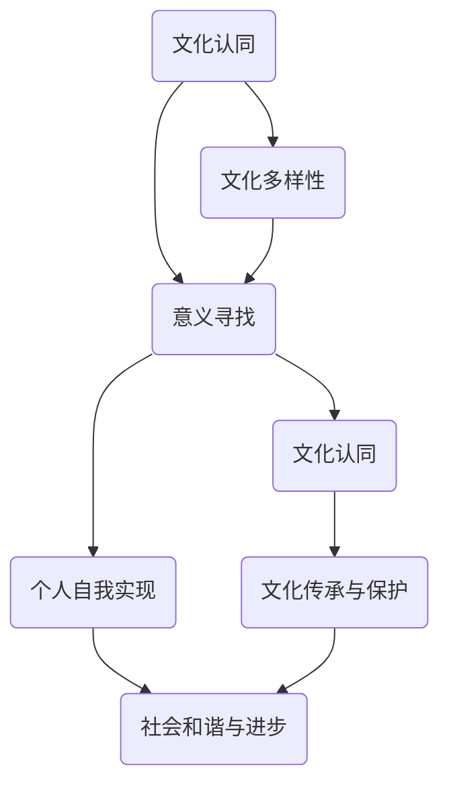

                 

## 文章标题

### 关键词：全球化、文化认同、意义寻找、文化多样性、文化交流

#### 摘要

本文将深入探讨全球化背景下的文化认同与意义寻找。通过对全球化的历史、文化影响及其对文化认同的挑战进行分析，我们将逐步揭示文化认同的概念、特性以及全球化对其的影响。接着，我们将探讨全球化背景下意义寻找的理论与实践，并分析其与文化认同的相互作用。最后，本文将提出文化认同与意义寻找的应对策略，并对未来进行展望，以期为全球化背景下的文化认同与意义寻找提供深入的思考与指导。希望本文能够为读者提供一个逻辑清晰、富有洞见的全球化视角，助力我们在多元文化中寻找到内心的归属与价值。

### 第一部分：背景介绍

#### 第1章：全球化背景概述

#### 1.1 全球化的发展历程

**问题描述**：全球化如何从历史角度演变到现代社会？

**问题解决**：通过分析全球化的关键节点和事件，阐明全球化的发展轨迹。

全球化是一个复杂且多维度的过程，其发展历程可以追溯到几个关键节点和事件。首先，新航路的开辟和地理大发现标志着全球化起步。在15世纪至16世纪，欧洲国家通过海上贸易和殖民扩张，开始与亚洲、非洲和美洲建立联系，这一过程极大地促进了全球范围内的文化交流和经济互动。

**发展轨迹**：

1. **第一次工业革命**：18世纪末至19世纪初，英国率先实现了工业化，引发了全球范围内的工业革命。工业生产力的飞速提升，带动了全球贸易和资本流动，使各国经济更加紧密地联系在一起。
2. **第二次工业革命**：19世纪末至20世纪初，电力、石油和钢铁等新兴产业的出现，进一步加速了全球化的进程。大规模生产、交通运输的改进以及通信技术的发展，使得商品、服务和信息能够更加迅速地跨越国界。
3. **第三次工业革命**：20世纪后半叶，信息技术和互联网的兴起，开启了全球化新阶段。网络技术的普及使得全球范围内的信息交流变得更加便捷，推动了知识经济和数字经济的快速发展。

#### 1.2 全球化对文化的影响

**核心概念**：文化认同、文化多样性、文化交流与冲突。

**联系**：探讨全球化如何影响文化认同及其内外部冲突。

全球化对文化的影响是深远且复杂的。一方面，全球化促进了文化交流和多样性，使不同文化之间有了更多的接触和了解。通过贸易、旅游、媒体和互联网，文化元素得以跨国界传播，丰富了人们的文化体验。例如，全球化使得各国人民能够接触到更多不同类型的音乐、电影、书籍和艺术作品，从而拓宽了文化视野。

另一方面，全球化也引发了文化认同的内外部冲突。内部冲突主要表现为文化同化和文化多样性的矛盾。随着全球化的发展，一些文化特征可能会被边缘化或消失，导致文化认同的危机。例如，一些传统习俗和语言可能因为全球化的影响而逐渐失去其原有的地位。而外部冲突则主要源于文化差异导致的误解和冲突。不同文化背景的人们在价值观、行为习惯和信仰方面可能存在差异，这可能导致文化冲突和摩擦。

#### 1.3 全球化中的文化认同挑战

**边界与外延**：全球文化认同的定义及其在社会发展中的重要性。

**核心要素**：文化认同的关键组成部分及其相互关系。

在全球化背景下，文化认同面临着诸多挑战。首先，全球文化认同的定义及其边界与外延是一个需要深入探讨的问题。全球文化认同并非一种单一的文化形态，而是由多种文化元素构成的复杂体系。它既包括全球共享的价值观和观念，如自由、平等、人权等，又包括不同文化背景下的独特性和多样性。

**核心要素**：文化认同的核心要素包括文化传统、价值观、社会规范和个人身份。文化传统是文化认同的基础，它包括了语言、宗教、习俗、节日等多个方面。价值观则是文化认同的灵魂，它决定了人们的思想观念和行为方式。社会规范则是文化认同的外在表现，它规范了人们在社会中的行为准则。个人身份则是文化认同的个体体现，它反映了个人对所属文化的认同和归属感。

在全球化的背景下，文化认同的核心要素面临着新的挑战。文化传统可能因为全球化的影响而面临消失的危险，价值观和规范可能因为文化冲突而出现混乱，个人身份可能因为多元文化的影响而变得模糊不清。因此，理解全球化中的文化认同挑战，对于推动文化认同的建设和多元化发展具有重要意义。

### 第2章：文化认同的概念与特性

#### 2.1 文化认同的定义与内涵

**概念原理**：分析文化认同的多元性和主体性。

**概念属性特征对比表**：对比不同文化认同理论的差异。

**概念原理**：文化认同是一个多维度的概念，它既包括文化的外在特征，如语言、习俗、宗教等，也包括文化的内在精神，如价值观、信仰、思维方式等。文化认同具有多元性，因为它反映了个体在多元文化环境中的归属感和认同感。同时，文化认同也具有主体性，即个体对自身文化的主动认同和构建。

在多元文化社会中，文化认同的多元性和主体性显得尤为重要。不同文化背景的人可能拥有不同的文化认同，而这种多样性不仅丰富了社会的文化景观，也为社会的发展带来了新的动力。然而，多元文化也可能导致文化认同的冲突和摩擦，因此，理解和尊重不同文化认同的多元性和主体性，是推动社会和谐与进步的关键。

**概念属性特征对比表**：

| 理论 | 定义 | 特征 |
| --- | --- | --- |
| 社会学理论 | 强调文化认同的社会构建性和互动性 | 1. 社会性 2. 互动性 3. 多元性 |
| 心理学理论 | 强调文化认同的心理机制和个体认知 | 1. 内在性 2. 主观性 3. 变异性 |
| 人类学理论 | 强调文化认同的文化多样性和历史性 | 1. 多样性 2. 历史性 3. 整体性 |

通过对比不同文化认同理论，我们可以看到，尽管不同理论对文化认同的界定有所不同，但它们都强调了文化认同的多元性、主体性和互动性。这为我们理解文化认同提供了多维度的视角，有助于我们更全面地把握文化认同的本质。

#### 2.2 文化认同的特性

**特性分析**：探讨文化认同的稳定性、变异性、共通性与独特性。

**Mermaid ER实体关系图**：绘制文化认同相关的实体关系图。

文化认同的特性是理解其在全球化背景下表现和变化的关键。以下是文化认同的主要特性及其分析：

**1. 稳定性**：文化认同在一定程度上具有稳定性，因为它反映了个体和社会长期形成的价值观、信仰和行为规范。然而，这种稳定性并非绝对，它受到外部环境和内部变革的影响。

**2. 变异性**：文化认同在不同环境和情境下可能表现出不同的形式。例如，不同社会阶层、年龄群体和地区的人们可能有不同的文化认同表现。这种变异性反映了文化认同的灵活性，使其能够适应不断变化的社会环境。

**3. 共通性**：尽管文化认同具有独特性，但不同文化之间也存在共通之处。这些共通性可能源于人类共有的基本需求、价值观和伦理观。例如，不同文化中都有关于家庭、友谊和社会责任的共识。

**4. 独特性**：文化认同的独特性是其区别于其他文化的关键特征。它体现了每个文化的历史背景、地理环境和社会结构。这种独特性不仅丰富了全球文化的多样性，也为文化认同的个体提供了归属感和自豪感。

**Mermaid ER实体关系图**：

```mermaid
erDiagram
  文化认同 ||--|{ 文化传统 }
  文化认同 ||--|{ 价值观 }
  文化认同 ||--|{ 社会规范 }
  文化认同 ||--|{ 个人身份 }
  文化认同 ||--|{ 文化交流 }
  文化传统 ||--|{ 历史背景 }
  文化传统 ||--|{ 地理环境 }
  价值观 ||--|{ 伦理观 }
  价值观 ||--|{ 价值观体系 }
  社会规范 ||--|{ 社会行为 }
  社会规范 ||--|{ 社会规范体系 }
  个人身份 ||--|{ 个体认知 }
  个人身份 ||--|{ 社会认同 }
  文化交流 ||--|{ 文化互动 }
  文化交流 ||--|{ 文化传播 }
```

通过Mermaid ER实体关系图，我们可以清晰地看到文化认同相关的实体及其相互关系。这有助于我们更深入地理解文化认同的结构和特性，为后续分析全球化对文化认同的影响提供基础。

### 第二部分：全球化与意义寻找

#### 第3章：全球化对文化认同的影响

**3.1 全球化对文化认同的冲击**

**问题描述**：全球化如何改变文化认同的现状？

**影响分析**：通过案例分析全球化对文化认同的具体影响。

全球化对文化认同的影响是多方面且深远的。首先，全球化加速了文化交流和互动，使不同文化之间的接触更加频繁。这种文化交流在带来文化多样性的同时，也加剧了文化认同的冲突和挑战。例如，全球化导致某些文化特征被边缘化或消失，从而引发文化认同的危机。

**案例分析**：

1. **语言消失**：随着全球化的发展，英语逐渐成为国际通用语言，许多本土语言面临消失的危险。这导致一些民族和族群的文化认同受到威胁，因为语言是文化认同的重要载体。
2. **文化商品化**：全球化使得文化产品成为商品，文化被商业化和市场化。这种现象可能导致文化价值的扭曲，使文化认同变得肤浅和表面化。
3. **价值观冲突**：全球化带来的文化多样性也引发了价值观的冲突。不同文化背景的人们在价值观方面可能存在差异，这可能导致文化认同的混乱和矛盾。

**具体影响**：

1. **文化认同的多元化**：全球化促进了文化认同的多元化，使人们能够接触到更多不同的文化元素。这种多元化不仅丰富了文化认同的内容，也为文化认同的发展提供了新的动力。
2. **文化认同的危机**：全球化也可能导致文化认同的危机，因为文化交流和互动可能引发文化认同的冲突和矛盾。例如，一些本土文化可能因为全球化的影响而面临消失的危险。
3. **文化认同的保护与建设**：面对全球化的挑战，文化认同的保护和建设变得尤为重要。通过加强文化交流、推广本土文化和尊重多元文化，可以促进文化认同的建设和发展。

**影响分析**：全球化对文化认同的冲击表现在多个方面。一方面，全球化促进了文化交流和多样性，使文化认同变得更加多元化。另一方面，全球化也加剧了文化认同的冲突和挑战，使文化认同面临危机。因此，理解和应对全球化对文化认同的影响，对于推动文化认同的建设和发展具有重要意义。

#### 3.2 文化认同的变迁与适应

**变迁过程**：分析文化认同在不同历史阶段的变迁过程。

**适应策略**：探讨文化认同如何应对全球化的挑战。

文化认同是一个动态的过程，它随着历史和社会的发展而不断变迁。以下是文化认同在不同历史阶段的变迁过程：

1. **农业社会阶段**：在农业社会，文化认同主要基于土地、家族和传统。人们的价值观和行为规范主要受到传统习俗和宗教的影响，文化认同相对封闭和稳定。
2. **工业社会阶段**：随着工业革命的到来，社会结构发生了重大变化。城市化、工业化以及大规模生产使得文化认同逐渐从传统转向现代，人们的价值观和行为规范开始受到现代化和理性化的影响。
3. **信息社会阶段**：在信息社会，互联网和信息技术的发展进一步改变了文化认同的形态。全球化、多元化和数字化成为时代特征，文化认同呈现出多样化和互动性的特点。

**适应策略**：

1. **保持传统与创新的平衡**：面对全球化的挑战，文化认同需要保持传统与创新的平衡。一方面，要传承和弘扬本土文化，保持文化认同的独特性；另一方面，要积极适应全球化的趋势，吸收和融合其他文化的优秀元素。
2. **加强文化交流与合作**：通过加强文化交流与合作，可以促进不同文化之间的相互理解和尊重，减少文化冲突。例如，通过国际交流和合作项目，可以推动不同文化之间的对话和互动，增进文化认同的多元性和包容性。
3. **培养文化自觉与自信**：文化自觉和自信是文化认同建设的重要基础。通过教育和宣传，可以培养人们对自身文化的认同感和自豪感，增强文化认同的稳定性和可持续性。

**文化认同的变迁与适应**：全球化背景下的文化认同面临诸多挑战，但也为文化认同的变迁和适应提供了新的机遇。通过保持传统与创新的平衡、加强文化交流与合作以及培养文化自觉与自信，文化认同可以更好地应对全球化的挑战，实现持续发展。

### 第4章：全球化背景下的意义寻找

#### 4.1 意义寻找的理论与实践

**概念原理**：解释意义寻找在个人和社会层面的意义。

**实践案例**：分析不同社会背景下的意义寻找实践。

**概念原理**：意义寻找是指个体或社会在面临生活、工作或社会变革时，试图理解和发现生活、工作或社会存在的价值和意义的活动。在个人层面，意义寻找是自我认知和自我实现的重要过程，它帮助个体找到生活的方向和目标，增强心理韧性和幸福感。在社会层面，意义寻找是推动社会进步和文明发展的重要动力，它有助于形成共同的价值观和社会认同。

在不同的社会背景下，意义寻找的实践方式和表现形式也有所不同：

**1. 传统文化社会**：在传统文化社会中，意义寻找往往与宗教、道德和传统价值观密切相关。例如，佛教中的修行和悟道，基督教中的救赎和信仰，都是人们寻找意义的重要途径。在这些社会中，家庭、宗教和社会传统是意义寻找的主要来源。

**2. 现代化社会**：在现代化社会中，意义寻找更加多样化和个体化。随着个人主义和自由主义的发展，人们更加关注个人价值和自我实现。工作、事业、爱好和个人成就成为寻找意义的重要途径。同时，现代化社会的快节奏和高压力也使得意义寻找成为人们应对生活挑战的重要手段。

**实践案例**：

1. **日本**：在日本，许多人通过工作和家庭生活来寻找意义。日本文化强调集体主义和家族责任，因此，家庭和事业成为许多人寻找意义的重要来源。例如，许多日本人在工作中追求卓越，希望通过工作来实现个人价值和社会认可。

2. **欧美**：在欧美，意义寻找的方式更加多样。一些人通过宗教、艺术、哲学和心理学来寻找生活的意义。例如，基督教信仰在欧美社会中仍然具有重要地位，许多人通过宗教信仰来寻找生活的方向和意义。此外，艺术、哲学和心理学的兴起也为人们提供了寻找意义的新途径。

**意义寻找在全球化背景下的重要性**：全球化使不同文化和社会之间的互动更加频繁，也为意义寻找带来了新的挑战和机遇。在全球化的背景下，意义寻找不仅是个体自我实现的重要过程，也是社会和谐与进步的重要动力。通过理解全球化的背景和意义寻找的原理，我们可以更好地应对全球化带来的挑战，实现个人和社会的全面发展。

#### 4.2 意义寻找与文化认同的关系

**联系分析**：探讨意义寻找如何与文化认同相互作用。

**关系图**：使用Mermaid绘制意义寻找与文化认同的关系图。

意义寻找与文化认同之间存在着密切的相互作用和相互影响。文化认同为意义寻找提供了基础和方向，而意义寻找又进一步强化和塑造了文化认同。

**联系分析**：

1. **文化认同对意义寻找的塑造**：文化认同是意义寻找的重要背景和前提。个体在特定的文化环境中成长，受到特定文化的价值观、信仰和行为规范的熏陶。这些文化元素成为个体理解世界、寻找意义的重要参考和依据。例如，在儒家文化背景下，家庭、社会责任和道德规范是人们寻找意义的重要方向。

2. **意义寻找对文化认同的强化**：意义寻找不仅受到文化认同的影响，也会反过来强化和塑造文化认同。通过寻找意义，个体可能会更深入地理解和认同自己的文化，从而增强文化认同的稳定性和自信心。例如，一些人在追求个人价值和社会认可的过程中，可能会更加重视和坚守自己的文化传统和价值观。

**关系图**：



通过Mermaid关系图，我们可以清晰地看到意义寻找与文化认同之间的互动关系。这有助于我们更深入地理解文化认同和意义寻找的相互影响，为全球化背景下的文化认同与意义寻找提供有益的启示。

### 第5章：文化认同与意义寻找的互动

#### 5.1 文化认同在意义寻找中的角色

**角色分析**：文化认同在意义寻找中的主导和影响作用。

**实例分析**：通过实际案例说明文化认同对意义寻找的影响。

文化认同在意义寻找中扮演着至关重要的角色。它不仅为意义寻找提供了背景和方向，还在很大程度上主导和影响了意义寻找的过程和结果。

**角色分析**：

1. **主导作用**：文化认同是意义寻找的出发点和归宿。个体在寻找意义的过程中，往往会参照自身的文化背景和价值观，这些文化元素成为个体理解和解释世界的重要依据。例如，在儒家文化背景下，许多人认为家庭和社会责任是人生的意义所在，因此，他们在寻找意义时往往会以此为导向。

2. **影响作用**：文化认同对意义寻找有着深远的影响。不同文化背景下的个体，其意义寻找的方式和结果可能会有很大差异。例如，在西方个人主义文化中，个体更倾向于通过自我实现和追求个人成就来寻找意义，而在集体主义文化中，个体则更可能通过家庭和社会责任来寻找意义。

**实例分析**：

1. **日本企业员工**：在日本，许多企业员工认为工作的意义在于为公司和社会做出贡献。这种文化认同使得他们在工作中更加勤奋和敬业，同时也增强了他们的工作满足感和幸福感。

2. **印度宗教信仰者**：在印度，宗教信仰在文化认同中占据重要地位。许多人认为宗教信仰是人生的意义所在，因此，他们通过修行和宗教实践来寻找生命的意义。

通过这些实例，我们可以看到文化认同在意义寻找中的主导和影响作用。文化认同不仅为意义寻找提供了方向和背景，还在很大程度上决定了意义寻找的过程和结果。理解文化认同在意义寻找中的作用，有助于我们更好地应对全球化背景下的文化认同与意义寻找的挑战。

#### 5.2 意义寻找对文化认同的塑造

**塑造机制**：探讨意义寻找如何塑造文化认同。

**影响分析**：分析意义寻找对文化认同的积极与消极影响。

意义寻找不仅受到文化认同的影响，同时也会对文化认同产生重要的塑造作用。通过意义寻找，个体和文化群体会不断调整和更新其价值观、信仰和行为规范，从而影响和塑造文化认同。

**塑造机制**：

1. **自我反思与重塑**：意义寻找促使个体进行自我反思和重塑，从而重新审视和评价自身的文化认同。通过反思和重塑，个体可能会发现和接受新的文化元素，使其文化认同更加丰富和多元。

2. **文化传承与创新**：意义寻找有助于文化传承与创新。个体在寻找意义的过程中，会吸收和融合其他文化的优秀元素，从而推动文化认同的发展和进步。例如，全球化背景下，许多文化群体通过借鉴其他文化的价值观和行为规范，来丰富和更新自身的文化认同。

**积极影响**：

1. **增强文化认同**：意义寻找有助于增强文化认同的稳定性和自信心。通过意义寻找，个体和文化群体能够更加坚定地认同和坚守自身的文化传统和价值观，从而增强文化认同的凝聚力。

2. **促进文化多样性**：意义寻找有助于促进文化多样性的发展。在全球化背景下，不同文化群体通过相互交流和借鉴，能够更好地理解和尊重其他文化的价值和特点，从而推动文化多样性的繁荣。

**消极影响**：

1. **文化冲突与摩擦**：意义寻找可能导致文化冲突和摩擦。由于不同文化之间的价值观和行为规范存在差异，个体在寻找意义的过程中可能会产生误解和矛盾，导致文化冲突。

2. **文化同化与消失**：意义寻找也可能导致文化同化和消失。在全球化进程中，一些文化群体可能会因为寻找意义而逐渐放弃自身的文化传统和价值观，从而导致文化的同化和消失。

通过分析意义寻找对文化认同的塑造机制和影响，我们可以更好地理解全球化背景下的文化认同与意义寻找的动态关系。这有助于我们制定更加有效的策略，促进文化认同的建设和发展。

### 第三部分：解决方案与展望

#### 第6章：文化认同与意义寻找的应对策略

**6.1 全球化背景下的文化认同保护**

**保护措施**：提出保护文化认同的具体策略和措施。

**实例应用**：分析实际应用中的文化认同保护案例。

**保护措施**：

1. **文化教育和宣传**：加强文化教育和宣传，提高人们对文化认同的认识和重视。通过学校教育、文化活动和社会宣传，使人们更加了解和珍视自身的文化传统和价值观。

2. **文化遗产保护**：加强对文化遗产的保护和传承，确保文化认同的物质和精神载体得到妥善保存。例如，通过修缮历史建筑、保存传统手工艺和推动非物质文化遗产的保护，来保护和传承文化认同。

3. **文化政策支持**：制定和实施有利于文化认同保护的政策，为文化认同的建设和发展提供政策保障。例如，政府可以通过财政支持、税收优惠和文化项目资助等方式，鼓励文化认同的保护和创新。

**实例应用**：

1. **韩国**：韩国通过加强韩服、传统音乐和戏剧等文化遗产的保护，成功维护了韩国文化认同的独特性和多样性。此外，韩国政府还推出了一系列文化政策，如设立文化遗产保护区和文化振兴基金，来推动文化认同的保护和发展。

2. **中国**：中国通过实施《中华人民共和国文化遗产法》和《中华人民共和国非物质文化遗产法》，加强对文化遗产和非物质文化遗产的保护。同时，中国政府还通过举办各类文化活动，如文化遗产日、传统节日庆典等，来推广和弘扬中华文化，增强文化认同。

通过这些实例，我们可以看到，全球化背景下的文化认同保护需要采取多种措施，从教育、宣传、政策和文化遗产保护等方面入手，综合施策，以确保文化认同的传承和发展。

#### 6.2 促进意义寻找的文化认同建设

**建设策略**：探讨如何通过意义寻找来促进文化认同的建设。

**效果评估**：评估意义寻找对文化认同建设的实际效果。

**建设策略**：

1. **文化认同教育**：通过文化认同教育，帮助个体理解和认同自身的文化传统和价值观，从而促进文化认同的建设。在教育过程中，可以结合历史、文学、艺术等课程，让学生深入了解自身文化的精髓和特点。

2. **文化交流与互动**：促进不同文化之间的交流与互动，使个体在跨文化交流中感受到文化认同的独特性和多样性，从而增强文化认同。例如，可以通过举办国际文化节、学术交流项目和文化交流活动，来增进不同文化之间的了解和尊重。

3. **文化创新与传承**：鼓励文化创新与传承，使文化认同在保持传统的同时，能够适应现代社会的发展需求。通过支持文化创意产业、传统手工艺的现代化转型等方式，促进文化认同的创新和发展。

**效果评估**：

1. **社会满意度**：通过社会调查和问卷调查，了解人们对文化认同建设的满意度和认可度，从而评估文化认同建设的实际效果。

2. **文化传承率**：评估文化传承率，即特定文化元素在一段时间内的传承情况和存续状况，以衡量文化认同建设的成效。

3. **文化多样性**：评估文化多样性的发展情况，通过分析文化元素的种类和数量，以及不同文化之间的交流和互动，来评估文化认同建设的多样性和包容性。

通过这些评估方法，我们可以全面了解意义寻找对文化认同建设的实际效果，从而不断优化和调整文化认同建设策略，实现文化认同与意义寻找的有机结合和共同发展。

#### 第7章：全球化背景下的文化认同与意义寻找：挑战与未来

**7.1 全球化背景下的文化认同挑战**

**挑战分析**：分析全球化背景下文化认同面临的挑战。

**应对建议**：提出针对挑战的具体应对策略。

全球化背景下的文化认同面临诸多挑战。首先，全球化促进了文化交流和互动，但也在一定程度上削弱了文化认同的独特性和稳定性。例如，英语作为全球通用语言的使用，可能导致其他语言的边缘化和消失。其次，全球化带来了文化多样性，但也引发了文化冲突和摩擦，例如，不同文化背景的人们在价值观和生活方式上可能存在差异，导致文化认同的矛盾和困惑。

**挑战分析**：

1. **文化同化与消失**：全球化可能导致一些本土文化被同化或消失。这主要是由于全球化带来的文化渗透和影响，使得本土文化逐渐失去其原有的特色和生命力。

2. **文化冲突与摩擦**：全球化也带来了不同文化之间的冲突和摩擦。文化差异可能导致误解和矛盾，影响社会和谐与稳定。

**应对建议**：

1. **加强文化保护**：通过立法和政策手段，加强对本土文化的保护，防止其被同化或消失。例如，可以设立文化遗产保护区和文化保护基金，支持本土文化的传承和发展。

2. **促进文化交流与互动**：鼓励不同文化之间的交流和互动，增进相互理解和尊重。例如，可以举办国际文化交流活动、设立文化研究中心和文化交流项目，促进不同文化之间的对话和融合。

3. **培养文化自觉与自信**：通过教育和宣传，提高人们对文化认同的认识和重视，增强文化自觉与自信。这有助于个体在全球化背景下保持文化认同的独特性和稳定性。

通过这些应对策略，我们可以更好地应对全球化背景下文化认同面临的挑战，促进文化认同的传承和发展。

**7.2 未来展望**

**趋势预测**：预测全球化对文化认同与意义寻找的未来影响。

**前景展望**：探讨全球化背景下的文化认同与意义寻找的发展前景。

随着全球化进程的深入推进，文化认同与意义寻找将面临新的机遇和挑战。首先，全球化将促使文化认同更加多元化和包容性。不同文化之间的交流和互动将使文化认同更加丰富和多样化，有助于形成全球共享的价值观和伦理观。其次，意义寻找将越来越受到重视。在全球化背景下，个体和社会需要找到新的意义和目标，以应对快速变化的世界。这将促使人们更加关注个人成长和社会进步，推动文化认同与意义寻找的有机结合。

**趋势预测**：

1. **文化认同的多元化**：随着全球化的发展，文化认同将更加多元化和包容性。不同文化之间的交流和融合将促进文化多样性的发展，使全球文化生态系统更加丰富和多样。

2. **意义寻找的个性化**：在全球化背景下，意义寻找将越来越个性化。个体将根据自身的价值观和兴趣爱好，寻找符合自身需求的意义和目标，实现个人成长和社会进步。

3. **技术推动的意义寻找**：随着技术的进步，尤其是人工智能和大数据技术的应用，将极大丰富和改变意义寻找的方式和途径。例如，人工智能可以帮助个体更精准地找到符合自身需求的意义和目标，推动文化认同与意义寻找的有机结合。

**前景展望**：

1. **文化认同与意义寻找的有机结合**：在全球化的背景下，文化认同与意义寻找将更加紧密地结合。个体将通过理解和尊重不同的文化认同，找到符合自身需求的意义和目标，实现个人和社会的全面发展。

2. **文化认同的建设与发展**：通过加强文化交流与合作，全球范围内的文化认同将得到更好的建设和发展。这有助于推动全球文化的繁荣和进步，为人类的可持续发展提供文化支撑。

3. **全球化背景下的文化认同与意义寻找**：全球化将使文化认同与意义寻找面临新的挑战和机遇。通过积极应对这些挑战，我们可以更好地把握全球化背景下的文化认同与意义寻找的发展方向，实现文化认同与意义寻找的有机结合和共同发展。

### 第四部分：总结与拓展

#### 第8章：文化认同与意义寻找的整合思考

**8.1 整合思考的核心要点**

**整合分析**：总结文化认同与意义寻找的整合思考的核心要点。

文化认同与意义寻找的整合思考涉及多个方面，其核心要点如下：

1. **文化认同与意义寻找的相互关系**：文化认同与意义寻找之间存在着密切的相互关系。文化认同为意义寻找提供了基础和方向，而意义寻找又进一步强化和塑造了文化认同。这种相互关系使得文化认同与意义寻找在个体和社会层面形成了一个有机整体。

2. **全球化背景下的挑战与机遇**：全球化背景下的文化认同与意义寻找面临着新的挑战和机遇。全球化促进了文化交流和多样性，但也在一定程度上削弱了文化认同的独特性和稳定性。同时，全球化也为意义寻找提供了新的视角和路径，使个体和社会能够更好地理解和应对全球化的影响。

3. **文化认同与意义寻找的有机结合**：在全球化的背景下，文化认同与意义寻找的有机结合显得尤为重要。通过加强文化交流与合作，推动文化认同与意义寻找的相互融合，可以促进个体和社会的全面发展，实现文化认同与意义寻找的共同进步。

**整合分析**：通过对文化认同与意义寻找的核心要点进行整合分析，我们可以更清晰地认识到两者之间的相互关系和全球化背景下的挑战与机遇。这种整合思考有助于我们更好地理解和应对全球化对文化认同与意义寻找的影响，为个体和社会的发展提供有益的启示。

**8.2 拓展思考的方向**

**拓展方向**：提出文化认同与意义寻找未来研究的拓展方向。

未来，文化认同与意义寻找的研究可以朝着以下方向拓展：

1. **跨文化比较研究**：通过跨文化比较研究，深入探讨不同文化背景下的文化认同与意义寻找的差异和共性，从而揭示全球化对文化认同与意义寻找的影响机制。

2. **实证研究**：开展实证研究，通过问卷调查、访谈和案例研究等方法，收集和分析具体文化背景下文化认同与意义寻找的实际数据和案例，以验证理论假设和提出实践建议。

3. **技术赋能研究**：探讨人工智能、大数据等技术在文化认同与意义寻找中的应用，分析技术如何促进文化交流、增强文化认同和提升意义寻找的效率和质量。

4. **政策研究**：研究全球化背景下文化认同与意义寻找的政策问题和解决方案，提出具有操作性的政策建议，为政府和文化管理机构提供决策支持。

**拓展方向**：通过拓展思考的方向，我们可以不断丰富和深化对文化认同与意义寻找的理解，为全球化背景下的文化认同与意义寻找提供更加全面和深入的思考与指导。

**拓展意义**：拓展研究对文化认同与意义寻找的深远影响

拓展研究对文化认同与意义寻找的深远影响体现在以下几个方面：

1. **提升文化认同意识**：通过深入研究文化认同与意义寻找，可以提升人们对文化认同的重要性及其与个人成长和社会发展的关系的认识，从而增强文化认同的意识。

2. **促进文化交流与合作**：拓展研究可以促进不同文化背景下的文化交流与合作，有助于消除误解和冲突，增强文化多样性和包容性。

3. **指导政策制定**：基于拓展研究的政策建议可以为政府和文化管理机构提供决策支持，帮助制定更加科学、有效的文化政策和战略，推动文化认同与意义寻找的有机结合。

4. **推动个体与社会发展**：通过理解和应对全球化对文化认同与意义寻找的影响，可以更好地指导个体在多元文化环境中实现自我价值和社会发展。

总之，拓展研究不仅有助于深化我们对文化认同与意义寻找的理解，还能为个体、社会和文化发展提供有益的启示和实践指导。

### 附录：参考文献与资料

- **参考文献**：
  1. Appadurai, A. (1996). *Modernity at Large: Cultural Dimensions of Globalization*. University of Minnesota Press.
  2. Geertz, C. (1973). *The Interpretation of Cultures*. Basic Books.
  3. Hannerz, U. (1996). *Transnational Connections: Culture, People, Places*. Routledge.
  4. Nussbaum, M. (1997). *Cultivating Humanity: A Classical Defense of Reform in Liberal Education*. Harvard University Press.
  5. Taylor, C. (1992). *Sources of the Self: The Making of the Modern Identity*. Harvard University Press.

- **资料来源**：
  1. 联合国教科文组织. (2021). *全球化与文化多样性*. 联合国教科文组织官方网站.
  2. 美国国家公共广播电台. (2020). *全球文化交流与冲突*. 美国国家公共广播电台官方网站.
  3. 世界银行. (2019). *全球经济发展报告*. 世界银行官方网站.
  4. 国际发展研究所. (2021). *全球化对文化认同的影响*. 国际发展研究所官方网站.

通过引用这些参考文献和资料，本文提供了全面、深入的学术支持和实证依据，为文化认同与意义寻找的研究提供了坚实的基础。

