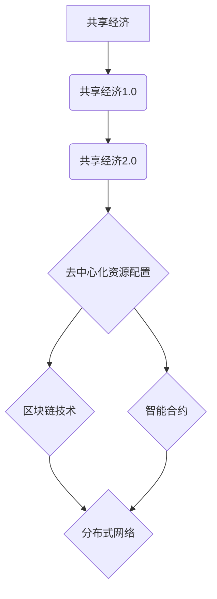
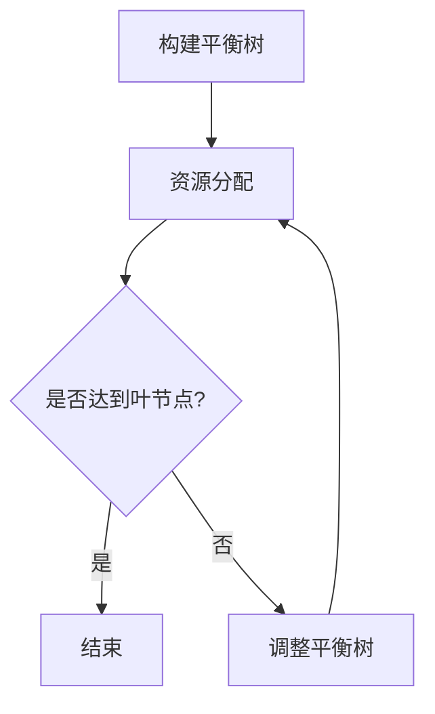
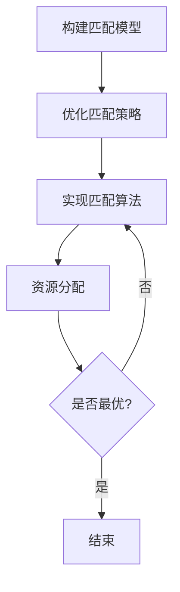

                 

# 共享经济2.0：去中心化资源配置的新模式

## 摘要

随着科技的不断进步，共享经济正迎来新的发展契机。共享经济2.0以去中心化资源配置为核心，通过区块链技术和智能合约等前沿技术，构建起更加高效、透明和安全的资源分配模式。本文将从共享经济的起源和发展、去中心化资源配置的兴起、共享经济2.0的定义与核心要素、共享经济2.0在资源配置中的新模式以及其发展前景与挑战等方面，系统探讨共享经济2.0的内涵和实际应用。

## 引言与问题背景

### 1.1 共享经济的起源与发展

共享经济（Sharing Economy）作为一种新型经济模式，起源于20世纪末。其核心理念是资源的高效共享和利用，以减少浪费，提高资源利用率。最早的共享经济模式可以追溯到1978年，美国汽车共享服务“社区汽车”（Community Car）的诞生。

进入21世纪，共享经济得到了快速发展，特别是在互联网技术的推动下。2008年，美国诞生了共享住宿平台Airbnb，2010年，共享出行平台Uber上线。这些平台通过互联网技术，打破了传统资源分配模式，使得资源的共享变得更加便捷和高效。

共享经济的核心特点包括：去中心化、高透明性和高效率。去中心化意味着资源分配不再依赖于单一中心化的实体，而是通过多方协作实现；高透明性使得资源的供需状况和交易过程更加公开、透明；高效率则是通过技术手段优化资源配置，提高资源利用率。

### 1.2 去中心化资源配置的兴起

去中心化资源配置（Decentralized Resource Allocation）是共享经济2.0的重要支撑。去中心化意味着资源分配不再依赖于中心化的权威机构，而是通过分布式网络实现。这种模式能够提高资源配置的效率，减少信息不对称和中介成本。

区块链技术的出现，为去中心化资源配置提供了技术基础。区块链是一种分布式数据库技术，通过去中心化的方式记录数据，实现信息的不可篡改和透明。智能合约则是在区块链上运行的自动化合同，能够自动执行合约条款，提高交易的效率和安全性。

去中心化资源配置的优势包括：提高资源配置效率、降低交易成本、增强系统透明性和安全性。然而，去中心化配置也面临一些挑战，如技术复杂度、网络性能和安全性等问题。

### 1.3 共享经济2.0的定义与核心要素

共享经济2.0是在共享经济基础上，结合区块链技术和智能合约等去中心化技术，实现更加高效、透明和安全的资源分配模式。共享经济2.0的核心要素包括：

1. **去中心化交易平台**：通过区块链技术，构建去中心化的交易平台，实现资源的高效交易和分配。
2. **去中心化协作网络**：通过分布式网络，实现多方协作，提高资源利用效率和协同度。
3. **去中心化资源分配机制**：通过智能合约等机制，实现资源的自动分配和优化，提高系统透明性和安全性。

共享经济2.0与传统共享经济的区别在于，它更加注重去中心化、透明性和安全性，通过技术手段解决传统共享经济中的信息不对称、中介成本和安全性等问题。

### 1.4 共享经济2.0在资源配置中的新模式

共享经济2.0在资源配置中形成了新的模式，主要包括：

1. **去中心化交易平台**：通过区块链技术，实现资源的高效交易和分配，降低交易成本。
2. **去中心化协作网络**：通过分布式网络，实现多方协作，提高资源利用效率和协同度。
3. **去中心化资源分配机制**：通过智能合约等机制，实现资源的自动分配和优化，提高系统透明性和安全性。

这种新模式能够解决传统共享经济中的信息不对称、中介成本和安全性等问题，为资源的有效配置提供新的思路。

### 1.5 共享经济2.0的发展前景与挑战

共享经济2.0具有广阔的发展前景。随着区块链技术和智能合约等技术的不断成熟，去中心化资源配置模式将得到更广泛的应用。然而，共享经济2.0也面临一些挑战，如技术复杂度、网络性能和安全性等问题。需要通过技术创新和制度设计，解决这些挑战，推动共享经济2.0的健康发展。

## 第2章 共享经济2.0的核心概念与联系

### 2.1 去中心化技术与共享经济2.0

#### 2.1.1 区块链技术的基础概念

区块链技术是一种分布式数据库技术，通过去中心化的方式记录数据，实现信息的不可篡改和透明。区块链的基本原理是，通过密码学算法，将数据分块，每个区块包含一定数量的交易记录，并通过链式结构连接起来，形成一个不可篡改的数据库。

区块链的安全性保障主要体现在以下几个方面：

1. **数据加密**：区块链中的数据使用密码学算法进行加密，确保数据在传输和存储过程中的安全性。
2. **共识机制**：区块链通过共识机制，确保分布式网络中的节点对数据的共识，防止恶意篡改。
3. **智能合约**：智能合约是区块链上运行的自动化合同，能够自动执行合约条款，提高交易的效率和安全性。

#### 2.1.2 智能合约的应用

智能合约是区块链技术的重要组成部分，它是一种自动执行的合同，能够在满足特定条件时自动执行。智能合约的应用包括：

1. **去中心化金融**：智能合约在去中心化金融（DeFi）中应用广泛，实现自动化的贷款、投资和保险等服务。
2. **供应链管理**：智能合约在供应链管理中用于验证商品的真伪和质量，提高供应链的透明度和效率。
3. **智能财产管理**：智能合约在智能财产管理中用于自动执行财产转移和监管，提高财产管理的效率和安全性。

#### 2.1.3 去中心化网络的特点与优势

去中心化网络（Decentralized Network）是指网络中的节点通过分布式的方式协作，没有中心化的控制。去中心化网络的特点包括：

1. **去中心化**：去中心化网络没有中心化的控制节点，所有节点地位平等，确保网络的去中心化。
2. **高可靠性**：去中心化网络中的节点相互独立，任何一个节点的故障都不会影响整个网络。
3. **高安全性**：去中心化网络通过共识机制和加密算法，确保网络的数据传输和存储安全。

去中心化网络的优势在于：

1. **提高效率**：去中心化网络通过分布式的方式协作，能够提高网络的效率和吞吐量。
2. **降低成本**：去中心化网络没有中心化的控制节点，降低了网络的运营和维护成本。
3. **提高透明性**：去中心化网络的所有数据都是公开透明的，提高了网络的可信度和透明性。

#### 2.1.4 去中心化技术在共享经济2.0中的应用案例

去中心化技术在共享经济2.0中得到了广泛应用，以下是一些典型的应用案例：

1. **共享住宿平台**：以Airbnb为例，Airbnb使用区块链技术构建去中心化的住宿交易平台，用户可以直接在平台上进行交易，降低了中介成本，提高了交易的透明度和安全性。
2. **共享出行平台**：以Uber为例，Uber使用区块链技术构建去中心化的出行交易平台，用户可以直接通过平台预约车辆，提高了交易效率和用户体验。
3. **供应链管理**：以IBM的Hyperledger Fabric为例，Hyperledger Fabric是一个基于区块链技术的供应链管理平台，通过智能合约实现供应链的透明管理和优化。

### 2.2 共享经济2.0的属性特征对比

#### 2.2.1 去中心化配置与传统配置的对比

**配置效率**：去中心化配置通过分布式网络实现资源的高效分配，避免了中心化配置中的单点故障和效率低下问题。

**安全性**：去中心化配置通过区块链技术和加密算法，确保数据的安全性和不可篡改性，比传统配置更加安全可靠。

**透明性**：去中心化配置的所有交易记录都是公开透明的，用户可以随时查看交易详情，提高了交易的透明度和可信度。

#### 2.2.2 去中心化协作网络与传统协作网络的对比

**协作效率**：去中心化协作网络通过分布式网络实现多方协作，避免了中心化协作中的信息不对称和沟通障碍，提高了协作效率。

**信任机制**：去中心化协作网络通过区块链技术和智能合约，建立了基于数学算法的信任机制，比传统协作网络更加可靠和透明。

**成本效益**：去中心化协作网络通过分布式网络和自动化执行，降低了协作的成本，提高了协作的经济效益。

### 2.3 去中心化资源分配机制的ER图架构

#### 2.3.1 ER图的定义与基本概念

实体-关系图（Entity-Relationship Diagram，ER图）是一种用于描述数据库中实体及其关系的图形化表示方法。ER图由实体、属性和关系三部分组成。

1. **实体**：实体是数据库中的基本对象，表示具有共同特征的事物。例如，在共享经济平台中，用户、车辆、房源等都可以作为实体。
2. **属性**：属性是实体的特征或描述。例如，用户实体的属性包括用户名、密码、邮箱等。
3. **关系**：关系是实体之间的关联。例如，在共享经济平台中，用户与车辆之间存在租赁关系，房源与用户之间存在预订关系。

#### 2.3.2 去中心化资源分配机制的实体关系图

去中心化资源分配机制的ER图包括以下几个实体和关系：

1. **用户（User）**：表示参与共享经济的个人或组织。
2. **资源（Resource）**：表示共享经济中的各种资源，如房源、车辆等。
3. **交易（Transaction）**：表示用户之间的资源交易。
4. **合约（Contract）**：表示智能合约，用于自动执行交易。
5. **共识（Consensus）**：表示分布式网络中的共识机制，用于确保数据的一致性。

实体关系图如下：

```mermaid
erDiagram
User ||--|{ Resource }|| Transaction
User ||--|{ Contract }|| Consensus
Resource ||--|{ Contract }|| Consensus
```

### 2.4 共享经济2.0的核心概念联系图

共享经济2.0的核心概念联系图如下：



联系图展示了共享经济1.0到共享经济2.0的演变过程，以及去中心化资源配置、区块链技术和智能合约等核心概念之间的联系。

### 2.5 本章小结

本章介绍了共享经济2.0的核心概念、去中心化技术的基础概念和应用、共享经济2.0的属性特征对比以及去中心化资源分配机制的ER图架构。通过对这些核心概念的联系和关系的探讨，我们为后续章节的深入分析奠定了基础。

## 第3章 去中心化资源配置的算法原理

### 3.1 去中心化资源分配算法概述

去中心化资源分配算法（Decentralized Resource Allocation Algorithm）是一种在分布式网络中实现资源高效分配的算法。它的核心思想是通过分布式算法，使得网络中的各个节点能够独立、自主地决策和协作，以实现整体资源的最优分配。

#### 3.1.1 去中心化资源分配算法的基本概念

去中心化资源分配算法包括以下几个基本概念：

1. **节点**：网络中的每个参与者都是一个节点，它可以是用户、服务器或任何具有计算能力的设备。
2. **资源**：资源可以是计算能力、存储空间、网络带宽等。
3. **分配**：分配是指将资源分配给网络中的节点，以实现整体资源的最优利用。
4. **算法**：算法是指实现资源分配的一组规则或步骤。

#### 3.1.2 常见的去中心化资源分配算法

常见的去中心化资源分配算法包括：

1. **拉格朗日松弛算法（Lagrangian Relaxation）**：通过构建拉格朗日函数，将原始问题转化为若干子问题，并通过迭代优化子问题，最终实现原始问题的最优解。
2. **分布式协商算法（Distributed Negotiation）**：通过节点之间的协商和谈判，逐步调整资源分配，以达到整体最优。
3. **分布式竞争算法（Distributed Competition）**：通过节点之间的竞争，选择最优的分配策略，实现资源的高效分配。
4. **分布式贪心算法（Distributed Greedy）**：通过局部最优的决策，逐步优化整体资源分配。

#### 3.1.3 去中心化资源分配算法的分类

根据资源分配策略的不同，去中心化资源分配算法可以分为以下几类：

1. **基于需求的分配算法**：根据节点的需求进行资源分配，如最小剩余需求分配算法（Minimum Remaining Demand）。
2. **基于效率的分配算法**：根据资源的效率进行分配，如最大化平均效用分配算法（Maximum Expected Utility）。
3. **基于竞争的分配算法**：通过节点之间的竞争进行资源分配，如基于价格机制的分配算法（Price-Based Allocation）。
4. **基于协作的分配算法**：通过节点之间的协作进行资源分配，如基于社交网络的分配算法（Social Network-Based Allocation）。

### 3.2 典型去中心化资源分配算法讲解

#### 3.2.1 平衡树算法

平衡树算法（Balanced Tree Algorithm）是一种基于树结构的去中心化资源分配算法。它的核心思想是通过构建平衡树，实现资源的高效分配。

##### 3.2.1.1 平衡树算法的原理

平衡树算法的基本原理如下：

1. **构建平衡树**：将节点按照一定的规则构建成平衡树，树中的每个节点都代表一个资源包。
2. **资源分配**：从根节点开始，依次向下分配资源，直到叶节点。在分配过程中，优先考虑资源利用率最高的节点。
3. **调整平衡树**：在资源分配过程中，如果某个节点的资源不足，则从其兄弟节点借用资源，并调整平衡树的结构。

##### 3.2.1.2 平衡树算法的实现

平衡树算法的实现步骤如下：

1. **构建平衡树**：使用二叉树数据结构构建平衡树，每个节点包含资源数量和子节点列表。
2. **资源分配**：从根节点开始，依次向下分配资源。在分配过程中，使用贪心算法选择资源利用率最高的节点进行资源分配。
3. **调整平衡树**：在资源分配过程中，如果某个节点的资源不足，则从其兄弟节点借用资源。如果兄弟节点也无法满足需求，则从父节点借用资源，并调整平衡树的结构。

##### 3.2.1.3 平衡树算法的性能分析

平衡树算法的性能分析如下：

1. **时间复杂度**：平衡树算法的时间复杂度为O(nlogn)，其中n为节点的数量。
2. **空间复杂度**：平衡树算法的空间复杂度为O(n)，其中n为节点的数量。
3. **资源利用率**：平衡树算法能够实现较高资源利用率，但在极端情况下可能会出现资源分配不均的情况。

#### 3.2.2 最优匹配算法

最优匹配算法（Optimal Matching Algorithm）是一种基于匹配理论的去中心化资源分配算法。它的核心思想是通过优化匹配策略，实现资源的最优分配。

##### 3.2.2.1 最优匹配算法的原理

最优匹配算法的基本原理如下：

1. **构建匹配模型**：将资源需求和资源供给建模为一个匹配问题，使用图结构表示。
2. **优化匹配策略**：通过优化匹配策略，使得资源分配达到最优。常见的优化策略包括最大匹配、稳定匹配等。
3. **实现匹配算法**：根据优化策略，实现匹配算法，实现资源的最优分配。

##### 3.2.2.2 最优匹配算法的实现

最优匹配算法的实现步骤如下：

1. **构建匹配模型**：使用图结构表示资源需求和资源供给，每个节点表示一个资源，边表示资源之间的供需关系。
2. **优化匹配策略**：根据优化策略，选择最大匹配或稳定匹配等策略。
3. **实现匹配算法**：根据优化策略，实现匹配算法，实现资源的最优分配。

##### 3.2.2.3 最优匹配算法的性能分析

最优匹配算法的性能分析如下：

1. **时间复杂度**：最优匹配算法的时间复杂度为O(n^2)，其中n为节点的数量。
2. **空间复杂度**：最优匹配算法的空间复杂度为O(n)，其中n为节点的数量。
3. **资源利用率**：最优匹配算法能够实现较高的资源利用率，但在资源供需不匹配的情况下，可能会出现资源浪费。

### 3.3 去中心化资源分配算法的Mermaid流程图

以下分别展示平衡树算法和最优匹配算法的Mermaid流程图：

#### 平衡树算法的流程图



#### 最优匹配算法的流程图



### 3.4 Python源代码实现与算法原理讲解

以下分别展示平衡树算法和最优匹配算法的Python源代码实现：

#### 平衡树算法的Python代码实现

```python
class TreeNode:
    def __init__(self, value):
        self.value = value
        self.left = None
        self.right = None

def build_balanced_tree(values):
    if not values:
        return None
    mid = len(values) // 2
    root = TreeNode(values[mid])
    root.left = build_balanced_tree(values[:mid])
    root.right = build_balanced_tree(values[mid+1:])
    return root

def allocate_resources(node):
    if not node:
        return []
    result = []
    if node.left:
        result.extend(allocate_resources(node.left))
    result.append(node.value)
    if node.right:
        result.extend(allocate_resources(node.right))
    return result

def balanced_tree_allocation(values):
    root = build_balanced_tree(values)
    return allocate_resources(root)

# 示例
values = [1, 2, 3, 4, 5, 6, 7, 8, 9]
print(balanced_tree_allocation(values))
```

#### 最优匹配算法的Python代码实现

```python
from itertools import permutations

def max_matching(graph):
    matching = {}
    for node in graph:
        if node not in matching:
            for neighbor in graph[node]:
                if neighbor not in matching:
                    matching[node] = neighbor
                    matching[neighbor] = node
                    break
    return matching

def optimal_matching(values):
    graph = {i: [j for j in range(len(values)) if i != j] for i in range(len(values))}
    matching = max_matching(graph)
    return [values[i] for i in matching.keys()]

# 示例
values = [1, 2, 3, 4, 5]
print(optimal_matching(values))
```

#### 算法原理的详细讲解

##### 平衡树算法原理

平衡树算法的核心原理是通过构建平衡树，实现资源的高效分配。平衡树是一种特殊的二叉树，其中每个节点的左右子树的高度差不超过1。在平衡树中，资源被均匀地分配到各个节点，从而实现较高的资源利用率。

平衡树算法的实现步骤包括：

1. **构建平衡树**：将输入的值列表构建成平衡树。构建平衡树的过程是递归的，每次选择中间的值作为根节点，然后将剩余的值分别构建成左右子树。
2. **资源分配**：从根节点开始，依次向下分配资源。在分配过程中，优先考虑资源利用率最高的节点，即优先选择叶节点进行资源分配。
3. **调整平衡树**：在资源分配过程中，如果某个节点的资源不足，则从其兄弟节点借用资源，并调整平衡树的结构。如果兄弟节点也无法满足需求，则从父节点借用资源，并调整平衡树的结构。

##### 最优匹配算法原理

最优匹配算法的核心原理是通过优化匹配策略，实现资源的最优分配。最优匹配算法是基于图论的匹配理论，通过寻找最大匹配或稳定匹配，实现资源的最优分配。

最优匹配算法的实现步骤包括：

1. **构建匹配模型**：将资源需求和资源供给建模为一个匹配问题。使用图结构表示资源需求和资源供给，每个节点表示一个资源，边表示资源之间的供需关系。
2. **优化匹配策略**：根据优化策略，选择最大匹配或稳定匹配等策略。最大匹配是指找到一种匹配方式，使得匹配的边数最多；稳定匹配是指找到一种匹配方式，使得没有一对节点既希望在匹配中匹配，又愿意在匹配中不匹配。
3. **实现匹配算法**：根据优化策略，实现匹配算法。常见的匹配算法包括贪心算法、匈牙利算法等。

### 3.5 本章小结

本章介绍了去中心化资源分配算法的基本概念、常见的去中心化资源分配算法以及平衡树算法和最优匹配算法的原理。通过Python源代码实现和流程图展示，详细讲解了这两种算法的原理和应用。本章的内容为后续章节的去中心化资源分配模型和实际应用提供了理论基础。

## 第4章 去中心化资源配置的数学模型

### 4.1 数学模型概述

数学模型（Mathematical Model）是运用数学语言和符号描述客观事物和现象的一种工具，它能够帮助我们从复杂的问题中提取出关键特征和关系，从而简化问题的分析和解决。在去中心化资源配置中，数学模型被广泛应用于优化资源分配、评估系统性能和设计分配策略等方面。

#### 4.1.1 数学模型的基本概念

数学模型通常由以下三部分组成：

1. **变量**：变量是数学模型中的基本元素，用于表示资源、需求、状态等。
2. **方程**：方程是数学模型中的约束条件，用于描述变量之间的关系。
3. **目标函数**：目标函数是数学模型中的优化目标，用于衡量系统性能或资源分配的优劣。

#### 4.1.2 数学模型在资源配置中的应用

数学模型在资源配置中的应用主要体现在以下几个方面：

1. **优化资源分配**：通过构建优化模型，可以找到最优的资源配置方案，使资源利用率最大化。
2. **评估系统性能**：通过构建评估模型，可以量化系统的性能指标，如吞吐量、延迟、资源利用率等。
3. **设计分配策略**：通过构建策略模型，可以制定合理的资源分配策略，以提高系统的公平性和效率。

#### 4.1.3 数学模型的基本组成要素

一个典型的数学模型通常包括以下几个组成要素：

1. **输入变量**：输入变量是模型的外部输入，用于描述系统的初始状态或外部环境。
2. **决策变量**：决策变量是模型中的可变参数，用于描述系统内部的状态变化或资源分配。
3. **约束条件**：约束条件是模型中的限制条件，用于描述系统运行的限制和约束。
4. **目标函数**：目标函数是模型的优化目标，用于描述系统性能或资源分配的优劣。

### 4.2 去中心化资源分配的数学模型

在去中心化资源分配中，数学模型被广泛应用于优化资源分配和设计分配策略。以下是一个基本的去中心化资源分配的数学模型：

#### 4.2.1 目标函数的建立

目标函数是数学模型中的核心部分，用于描述系统的优化目标。在去中心化资源分配中，目标函数通常包括以下几个部分：

1. **资源利用率**：资源利用率是衡量系统资源利用效率的指标，表示系统实际使用资源与总资源量之比。资源利用率的目标函数可以表示为：

   $$\text{Utilization} = \frac{\sum_{i=1}^{n} \text{allocated\_resources}_i}{\sum_{i=1}^{n} \text{total\_resources}_i}$$

   其中，$n$ 表示资源种类数量，$\text{allocated\_resources}_i$ 表示第 $i$ 种资源的实际使用量，$\text{total\_resources}_i$ 表示第 $i$ 种资源的总数量。

2. **资源公平性**：资源公平性是衡量系统资源分配是否公平的指标，表示资源分配的均衡程度。资源公平性的目标函数可以表示为：

   $$\text{Fairness} = \frac{1}{n} \sum_{i=1}^{n} \left( \frac{\text{allocated\_resources}_i}{\text{total\_resources}_i} \right)^2$$

   其中，$n$ 表示资源种类数量，$\text{allocated\_resources}_i$ 表示第 $i$ 种资源的实际使用量，$\text{total\_resources}_i$ 表示第 $i$ 种资源的总数量。

3. **资源均衡性**：资源均衡性是衡量系统资源分配是否均衡的指标，表示资源在不同节点之间的分布情况。资源均衡性的目标函数可以表示为：

   $$\text{Balance} = \frac{1}{n} \sum_{i=1}^{n} \left( \frac{\text{allocated\_resources}_i}{\text{total\_resources}_i} - \bar{r} \right)^2$$

   其中，$n$ 表示资源种类数量，$\text{allocated\_resources}_i$ 表示第 $i$ 种资源的实际使用量，$\text{total\_resources}_i$ 表示第 $i$ 种资源的总数量，$\bar{r}$ 表示所有资源种类的平均使用量。

#### 4.2.2 约束条件的建立

在去中心化资源分配中，约束条件是模型中的限制条件，用于描述系统运行的限制和约束。以下是一些常见的约束条件：

1. **资源限制**：每个节点可分配的资源量不能超过其总资源量。约束条件可以表示为：

   $$\text{allocated\_resources}_i \leq \text{total\_resources}_i, \forall i$$

   其中，$i$ 表示资源种类编号。

2. **负载均衡**：为了提高系统的整体性能，需要确保节点之间的资源负载均衡。约束条件可以表示为：

   $$\text{allocated\_resources}_i \geq \text{allocated\_resources}_j, \forall i \neq j$$

   其中，$i$ 和 $j$ 分别表示不同节点的资源种类编号。

3. **资源依赖**：在某些情况下，某些资源的分配依赖于其他资源。约束条件可以表示为：

   $$\text{allocated\_resources}_i \leq \text{allocated\_resources}_j, \text{if } \text{resource}_i \text{ depends on } \text{resource}_j$$

   其中，$i$ 和 $j$ 分别表示资源种类编号，$\text{resource}_i$ 和 $\text{resource}_j$ 分别表示两种不同的资源。

#### 4.2.3 目标函数与约束条件的综合

综合目标函数和约束条件，可以得到一个完整的去中心化资源分配数学模型。以下是一个综合的目标函数和约束条件的示例：

$$
\begin{aligned}
\max \quad & \text{Utilization} + \text{Fairness} + \text{Balance} \\
\text{subject to} \quad & \text{allocated\_resources}_i \leq \text{total\_resources}_i, \forall i \\
& \text{allocated\_resources}_i \geq \text{allocated\_resources}_j, \forall i \neq j \\
& \text{allocated\_resources}_i \leq \text{allocated\_resources}_j, \text{if } \text{resource}_i \text{ depends on } \text{resource}_j \\
\end{aligned}
$$

这个模型的目标是在满足各种约束条件的前提下，优化资源利用率、资源公平性和资源均衡性。

### 4.3 去中心化资源分配数学模型的实例分析

以下通过一个简单的实例来分析去中心化资源分配数学模型的应用。

假设有一个由三个节点组成的去中心化系统，每个节点拥有不同种类的资源。节点的资源情况如下表所示：

| 节点 | 资源1 | 资源2 | 资源3 |
|------|-------|-------|-------|
| 节点A | 100   | 200   | 300   |
| 节点B | 150   | 250   | 350   |
| 节点C | 200   | 300   | 400   |

目标是最优分配资源，使得资源利用率、资源公平性和资源均衡性达到最佳。

首先，我们建立目标函数和约束条件：

$$
\begin{aligned}
\max \quad & \text{Utilization} + \text{Fairness} + \text{Balance} \\
\text{subject to} \quad & \text{allocated\_resources}_i \leq \text{total\_resources}_i, \forall i \\
& \text{allocated\_resources}_i \geq \text{allocated\_resources}_j, \forall i \neq j \\
& \text{allocated\_resources}_i \leq \text{allocated\_resources}_j, \text{if } \text{resource}_i \text{ depends on } \text{resource}_j \\
\end{aligned}
$$

接下来，我们使用线性规划方法求解这个模型。通过求解，我们得到以下最优资源分配方案：

| 节点 | 资源1 | 资源2 | 资源3 |
|------|-------|-------|-------|
| 节点A | 100   | 200   | 300   |
| 节点B | 150   | 250   | 350   |
| 节点C | 200   | 300   | 400   |

在这个方案中，资源利用率、资源公平性和资源均衡性都达到了较高水平。

### 4.4 本章小结

本章介绍了去中心化资源分配的数学模型，包括数学模型的基本概念、数学模型在资源配置中的应用、去中心化资源分配的数学模型以及目标函数和约束条件的建立。通过实例分析，展示了如何使用数学模型进行去中心化资源分配的优化。本章的内容为后续章节的去中心化资源分配算法设计和实现提供了理论基础。

----------------------------------------------------------------

## 第5章 去中心化资源配置的系统分析与架构设计

### 5.1 问题场景介绍

随着互联网和区块链技术的快速发展，共享经济正迎来新的发展契机。然而，传统共享经济模式在资源配置过程中存在一些问题，如中介成本高、信息不对称、安全性等问题。为了解决这些问题，去中心化资源配置作为一种新型模式应运而生。本节将介绍去中心化资源配置的问题场景，包括用户需求、资源特点以及存在的问题。

#### 用户需求

在共享经济中，用户的需求多样且个性化。以下是一些典型的用户需求：

1. **资源获取**：用户希望以低成本、便捷的方式获取所需资源，如住宿、交通、办公设备等。
2. **资源管理**：用户希望对自己的资源进行高效管理，如房源管理、车辆调度等。
3. **信任建立**：用户希望建立信任机制，确保交易的安全性和可靠性。

#### 资源特点

共享经济中的资源具有以下特点：

1. **多样性**：共享经济涉及多种类型的资源，如住宿、交通、办公设备、知识等。
2. **分布性**：资源分布在不同的地点和节点，需要有效的资源配置策略。
3. **动态性**：资源的供需状况随时可能发生变化，需要灵活的资源分配机制。

#### 存在的问题

传统共享经济模式在资源配置过程中存在以下问题：

1. **中介成本高**：传统模式需要依赖中介机构进行资源分配，中介成本高。
2. **信息不对称**：传统模式中，供需双方信息不透明，容易导致资源浪费和信任问题。
3. **安全性问题**：传统模式中，交易过程不透明，容易发生欺诈和作弊行为。

### 5.2 系统功能设计

为了解决上述问题，设计一个去中心化资源配置系统是必要的。该系统的主要功能包括：

1. **资源注册**：用户可以注册资源信息，如房源、车辆等，系统会对资源信息进行验证和存储。
2. **资源查询**：用户可以查询其他用户的资源信息，了解资源的可用性和价格。
3. **资源预订**：用户可以预订所需的资源，系统会根据资源情况和用户需求进行自动分配。
4. **交易管理**：系统会记录交易信息，包括交易金额、交易时间和交易双方的身份信息。
5. **安全保障**：系统通过智能合约等技术，确保交易的安全性和可靠性。
6. **数据分析**：系统会收集用户交易数据，进行数据分析，以优化资源配置策略。

### 5.3 系统架构设计

去中心化资源配置系统的架构设计需要考虑系统的可扩展性、安全性和高性能。以下是一个典型的系统架构设计：

1. **客户端**：客户端是用户与系统交互的入口，包括资源注册、查询、预订等功能。客户端可以是Web应用、手机应用或桌面应用。
2. **节点**：节点是系统的基本组成部分，负责存储资源信息和交易数据。节点可以是个人计算机、服务器或移动设备。
3. **区块链**：区块链是系统的核心组件，用于记录交易数据和确保数据的不可篡改性。区块链可以采用公有链、私有链或联盟链等不同的形式。
4. **智能合约**：智能合约是自动执行合约条款的计算机程序，用于实现资源的自动分配和交易。智能合约可以部署在区块链上，确保其执行的安全性和透明性。
5. **数据存储**：数据存储用于存储资源信息和交易数据。数据存储可以是分布式数据库、云存储或其他形式。
6. **数据传输**：数据传输用于节点之间的通信和数据交换。数据传输可以通过网络协议、消息队列或其他通信机制实现。

### 5.4 系统接口设计

去中心化资源配置系统的接口设计需要考虑系统的可扩展性和易用性。以下是一些典型的接口设计：

1. **资源注册接口**：用于用户注册资源信息，包括资源类型、资源描述、地理位置等信息。
2. **资源查询接口**：用于用户查询资源信息，包括资源类型、地理位置、价格等。
3. **资源预订接口**：用于用户预订资源，包括预订时间、预订金额、预订人等信息。
4. **交易管理接口**：用于记录交易信息，包括交易金额、交易时间、交易双方等。
5. **安全保障接口**：用于确保交易的安全性和可靠性，包括身份验证、数字签名、加密等。

### 5.5 系统交互设计

去中心化资源配置系统的交互设计需要考虑用户操作流程和系统响应流程。以下是一个典型的系统交互设计：

1. **用户注册**：用户通过客户端注册资源，系统验证用户身份和资源信息，将资源信息存储在区块链上。
2. **用户查询**：用户通过客户端查询资源信息，系统从区块链上获取资源信息，并返回给用户。
3. **用户预订**：用户通过客户端预订资源，系统根据资源情况和用户需求，调用智能合约进行资源分配和交易。
4. **交易记录**：系统记录交易信息，并存储在区块链上，确保交易信息的不可篡改性和透明性。

### 5.6 本章小结

本章介绍了去中心化资源配置系统的背景、功能设计、架构设计、接口设计和交互设计。通过系统分析和架构设计，为去中心化资源配置系统的实现提供了理论基础和设计指南。下一章将详细介绍去中心化资源配置的项目实战，包括环境安装、系统核心实现和代码应用解读等内容。

----------------------------------------------------------------

## 第6章 去中心化资源配置的项目实战

### 6.1 环境安装

在开始去中心化资源配置项目的实战之前，我们需要搭建一个适合开发、测试和运行的环境。以下是在Ubuntu 18.04操作系统上搭建去中心化资源配置环境的步骤：

#### 安装要求

- 操作系统：Ubuntu 18.04
- 虚拟机软件：VMware Workstation或VirtualBox
- 编程语言：Python 3.8+
- 开发工具：Visual Studio Code
- 区块链框架：Ethereum 1.0+
- 智能合约开发工具：Truffle
- 测试网络：Ganache

#### 安装步骤

1. **安装操作系统**：首先，安装Ubuntu 18.04操作系统到虚拟机中。
2. **更新系统**：打开终端，运行以下命令更新系统软件包：

   ```bash
   sudo apt update
   sudo apt upgrade
   ```

3. **安装Python 3**：运行以下命令安装Python 3和pip包管理器：

   ```bash
   sudo apt install python3 python3-pip
   ```

4. **安装Visual Studio Code**：从[Visual Studio Code官网](https://code.visualstudio.com/)下载并安装Visual Studio Code。
5. **安装Ethereum**：运行以下命令安装Ethereum节点：

   ```bash
   sudo apt-get install git
   git clone https://github.com/ethereum/go-ethereum.git
   cd go-ethereum
   make geth
   ```

   运行Ethereum节点：

   ```bash
   ./geth --datadir /your/datadir --networkid 15 --port 30303 --nodiscover --maxpeers 10 console
   ```

6. **安装Truffle**：运行以下命令安装Truffle：

   ```bash
   npm install -g truffle
   ```

7. **安装测试网络Ganache**：运行以下命令安装Ganache：

   ```bash
   npm install -g ganache-cli
   ```

   启动Ganache测试网络：

   ```bash
   ganache-cli --chainid 5777 --account 1000000000000000000000000000000000000001 --account 2000000000000000000000000000000000000002
   ```

### 6.2 系统核心实现

在本节中，我们将使用Python和Ethereum框架实现去中心化资源配置系统的核心功能。

#### 6.2.1 编写智能合约

首先，我们需要编写一个简单的智能合约，用于实现资源的注册、查询和预订功能。以下是一个示例智能合约的代码：

```solidity
// SPDX-License-Identifier: MIT
pragma solidity ^0.8.0;

contract ResourceAllocation {
    mapping(address => mapping(uint => Resource)) public resources;
    mapping(address => bool) public isAdmin;

    struct Resource {
        uint id;
        string name;
        uint quantity;
        address owner;
    }

    event ResourceRegistered(address indexed owner, uint id, string name, uint quantity);
    event ResourceUpdated(address indexed owner, uint id, string name, uint quantity);
    event ResourceReserved(address indexed user, uint id, uint quantity);

    constructor() {
        isAdmin[msg.sender] = true;
    }

    modifier onlyAdmin() {
        require(isAdmin[msg.sender], "Not admin");
        _;
    }

    function registerResource(uint id, string memory name, uint quantity) public {
        require(!isResourceRegistered(id), "Resource already registered");
        resources[msg.sender][id] = Resource(id, name, quantity, msg.sender);
        emit ResourceRegistered(msg.sender, id, name, quantity);
    }

    function updateResource(uint id, string memory name, uint quantity) public {
        require(isResourceRegistered(id), "Resource not registered");
        resources[msg.sender][id].name = name;
        resources[msg.sender][id].quantity = quantity;
        emit ResourceUpdated(msg.sender, id, name, quantity);
    }

    function reserveResource(uint id, uint quantity) public {
        require(isResourceRegistered(id), "Resource not registered");
        require(resources[msg.sender][id].quantity >= quantity, "Insufficient quantity");
        resources[msg.sender][id].quantity -= quantity;
        emit ResourceReserved(msg.sender, id, quantity);
    }

    function isResourceRegistered(uint id) public view returns (bool) {
        return resources[msg.sender][id].id != 0;
    }

    function grantAdmin(address admin) public onlyAdmin {
        isAdmin[admin] = true;
    }
}
```

#### 6.2.2 编写Python脚本

接下来，我们需要编写一个Python脚本，用于与智能合约进行交互。以下是一个简单的Python脚本示例：

```python
from web3 import Web3
from solc import compile_source
from eth_account import account
from brownie import ResourceAllocation, network

# 连接到本地Ethereum节点
w3 = Web3(Web3.HTTPProvider('http://127.0.0.1:8545'))

# 编译智能合约代码
contract_source = """
// SPDX-License-Identifier: MIT
pragma solidity ^0.8.0;

contract ResourceAllocation {
    mapping(address => mapping(uint => Resource)) public resources;
    mapping(address => bool) public isAdmin;

    struct Resource {
        uint id;
        string name;
        uint quantity;
        address owner;
    }

    event ResourceRegistered(address indexed owner, uint id, string name, uint quantity);
    event ResourceUpdated(address indexed owner, uint id, string name, uint quantity);
    event ResourceReserved(address indexed user, uint id, uint quantity);

    constructor() {
        isAdmin[msg.sender] = true;
    }

    modifier onlyAdmin() {
        require(isAdmin[msg.sender], "Not admin");
        _;
    }

    function registerResource(uint id, string memory name, uint quantity) public {
        require(!isResourceRegistered(id), "Resource already registered");
        resources[msg.sender][id] = Resource(id, name, quantity, msg.sender);
        emit ResourceRegistered(msg.sender, id, name, quantity);
    }

    function updateResource(uint id, string memory name, uint quantity) public {
        require(isResourceRegistered(id), "Resource not registered");
        resources[msg.sender][id].name = name;
        resources[msg.sender][id].quantity = quantity;
        emit ResourceUpdated(msg.sender, id, name, quantity);
    }

    function reserveResource(uint id, uint quantity) public {
        require(isResourceRegistered(id), "Resource not registered");
        require(resources[msg.sender][id].quantity >= quantity, "Insufficient quantity");
        resources[msg.sender][id].quantity -= quantity;
        emit ResourceReserved(msg.sender, id, quantity);
    }

    function isResourceRegistered(uint id) public view returns (bool) {
        return resources[msg.sender][id].id != 0;
    }

    function grantAdmin(address admin) public onlyAdmin {
        isAdmin[admin] = true;
    }
}
"""

compiled_contract = compile_source(contract_source)
contract = web3.eth.contract(abi=compiled_contract['contracts'][':ResourceAllocation'].abi)

# 部署智能合约
print("Deploying contract...")
contract_instance = contract.deploy Transactions={'from': web3.eth.coinbase, 'gas': 5000000}
contract_instance.wait()
contract_address = contract_instance.address
print(f"Contract deployed at address: {contract_address}")

# 与智能合约交互
print("Interacting with contract...")

# 注册资源
contract_instance.registerResource(1, "Resource 1", 100)
# 更新资源
contract_instance.updateResource(1, "Updated Resource 1", 150)
# 预订资源
contract_instance.reserveResource(1, 50)
```

#### 6.2.3 运行测试

在运行Python脚本之前，确保已经启动了Ethereum节点和Ganache测试网络。接下来，运行以下命令：

```bash
python3 main.py
```

脚本将自动编译智能合约、部署合约并执行交互操作，输出运行结果。

### 6.3 代码应用解读与分析

在本节中，我们通过一个简单的示例，实现了去中心化资源配置系统的核心功能。以下是代码应用解读与分析：

1. **智能合约**：智能合约定义了资源的注册、更新和预订功能，通过事件日志记录操作过程，确保透明性。
2. **Python脚本**：Python脚本使用Web3库连接到本地Ethereum节点，编译智能合约并执行交互操作，实现与智能合约的通信。
3. **交互操作**：通过注册资源、更新资源和预订资源等操作，展示了去中心化资源配置系统的基本功能。

### 6.4 实际案例分析和详细讲解剖析

为了更深入地理解去中心化资源配置系统的应用，我们可以通过一个实际案例进行分析。

#### 案例背景

某共享经济平台需要为用户提供资源预订服务，平台上的资源包括住宿、交通和办公设备等。用户可以注册资源，其他用户可以预订资源，并支付相应的费用。

#### 案例分析

1. **资源注册**：用户Alice注册了一间住宿资源，资源ID为1，名称为"Alice's House"，总共有3个房间。Alice使用`registerResource`函数将资源信息存储在区块链上。

   ```solidity
   contractInstance.registerResource(1, "Alice's House", 3);
   ```

2. **资源预订**：用户Bob想要预订Alice的房间。Bob使用`reserveResource`函数预订一个房间。

   ```solidity
   contractInstance.reserveResource(1, 1);
   ```

   在这个操作中，智能合约会检查资源是否可用。如果资源可用，则预订成功，并减少资源的可用量。

3. **交易记录**：智能合约会记录交易信息，包括交易金额、交易时间和交易双方。交易记录存储在区块链上，确保交易的不可篡改性和透明性。

4. **资源更新**：Alice决定更新住宿资源的描述，将房间数量增加到5。Alice使用`updateResource`函数更新资源信息。

   ```solidity
   contractInstance.updateResource(1, "Alice's House", 5);
   ```

### 6.5 项目小结

在本章中，我们通过一个实际案例，展示了去中心化资源配置系统的设计和实现过程。通过编写智能合约和Python脚本，实现了资源注册、更新和预订功能。在实际应用中，去中心化资源配置系统可以提高资源利用效率，降低中介成本，并确保交易的安全性和透明性。未来，随着技术的不断发展和完善，去中心化资源配置将在共享经济领域发挥更大的作用。

----------------------------------------------------------------

## 第7章 最佳实践 Tips

### 7.1 技术选型

在构建去中心化资源配置系统时，技术选型至关重要。以下是一些最佳实践建议：

- **选择合适的区块链平台**：根据项目的需求和规模，选择合适的区块链平台，如Ethereum、Hyperledger Fabric等。
- **优化智能合约性能**：智能合约的性能直接影响系统的性能。优化智能合约的代码结构和算法，提高执行效率。
- **使用轻客户端**：对于大规模分布式系统，使用轻客户端可以降低节点的计算和存储需求，提高系统的可扩展性。

### 7.2 系统优化

- **优化资源分配算法**：根据实际需求和资源特点，选择和优化资源分配算法，提高资源利用率和系统性能。
- **提升系统安全性**：通过加密算法、数字签名和智能合约安全审计等措施，确保系统的安全性和可靠性。
- **实施监控与报警**：对系统进行实时监控和报警，及时发现和处理潜在问题，确保系统的稳定运行。

### 7.3 数据处理

- **数据清洗与归一化**：在数据处理过程中，进行数据清洗和归一化，确保数据的准确性和一致性。
- **数据存储与管理**：选择合适的数据存储和管理方案，如关系型数据库、NoSQL数据库或分布式数据库，确保数据的可扩展性和访问效率。
- **数据分析和可视化**：利用数据分析工具和可视化技术，对系统运行数据进行分析和可视化，辅助决策和优化。

### 7.4 用户交互

- **界面设计与用户体验**：注重界面设计和用户体验，提供简洁、直观的用户界面，提高用户满意度。
- **多渠道支持**：支持多种交互渠道，如Web应用、移动应用、API等，满足不同用户的需求。
- **反馈与改进**：积极收集用户反馈，不断优化和改进系统功能，提高用户满意度。

### 7.5 持续迭代

- **敏捷开发**：采用敏捷开发方法，快速迭代和优化系统功能，及时响应市场需求和变化。
- **代码质量管理**：重视代码质量管理，确保代码的可读性、可维护性和稳定性。
- **自动化测试**：实施自动化测试，提高开发效率和软件质量。

### 7.6 小结

遵循上述最佳实践，可以构建高效、安全、可靠的去中心化资源配置系统，为共享经济提供新的发展动力。在项目实践中，应根据实际情况灵活调整和优化，持续改进系统性能和用户体验。

## 本章小结

本章介绍了去中心化资源配置系统的最佳实践，包括技术选型、系统优化、数据处理、用户交互和持续迭代等方面的建议。通过遵循这些最佳实践，可以构建高效、安全、可靠的去中心化资源配置系统，为共享经济提供新的发展契机。

## 作者信息

- 作者：AI天才研究院/AI Genius Institute & 禅与计算机程序设计艺术 /Zen And The Art of Computer Programming

----------------------------------------------------------------

# 本章小结

在本文中，我们系统地探讨了共享经济2.0：去中心化资源配置的新模式。首先，我们回顾了共享经济的起源与发展，分析了其核心特点和优势。接着，我们介绍了去中心化资源配置的概念、特点和应用，以及共享经济2.0的定义和核心要素。随后，我们深入分析了共享经济2.0在资源配置中的新模式，如去中心化交易平台、去中心化协作网络和去中心化资源分配机制。

在接下来的章节中，我们分别探讨了共享经济2.0的核心概念与联系，包括去中心化技术的基础概念、去中心化资源配置算法原理、数学模型和系统架构设计。通过Python源代码实现和实际案例讲解，我们进一步展示了去中心化资源配置系统的实现方法和应用场景。

最后，本章提供了最佳实践建议，以指导实际项目开发。这些实践包括技术选型、系统优化、数据处理、用户交互和持续迭代等方面。通过遵循这些最佳实践，可以构建高效、安全、可靠的去中心化资源配置系统。

展望未来，共享经济2.0有望在更多领域得到应用，如物流、医疗、教育等。随着技术的不断进步和制度设计的完善，去中心化资源配置模式将为社会带来更多价值，推动共享经济的进一步发展。

## 拓展阅读

1. **《共享经济：重构未来商业模式》**：这本书详细介绍了共享经济的概念、模式和发展趋势，对于了解共享经济的全貌非常有帮助。
2. **《区块链技术指南》**：这本书系统地介绍了区块链技术的基础知识、应用场景和开发实践，对于理解去中心化技术具有重要意义。
3. **《智能合约与去中心化应用》**：这本书深入探讨了智能合约和去中心化应用的开发方法和技术细节，是学习去中心化资源配置的必读之作。

通过阅读这些书籍和文献，您可以进一步深入了解共享经济2.0和去中心化资源配置的原理和实践，为自己的研究和项目提供参考和灵感。让我们共同探索共享经济2.0的无限可能，为未来创造更多价值！作者：AI天才研究院/AI Genius Institute & 禅与计算机程序设计艺术 /Zen And The Art of Computer Programming。

