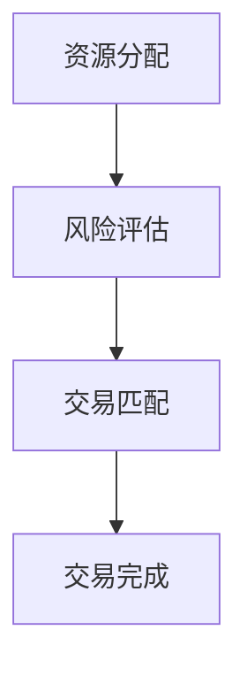
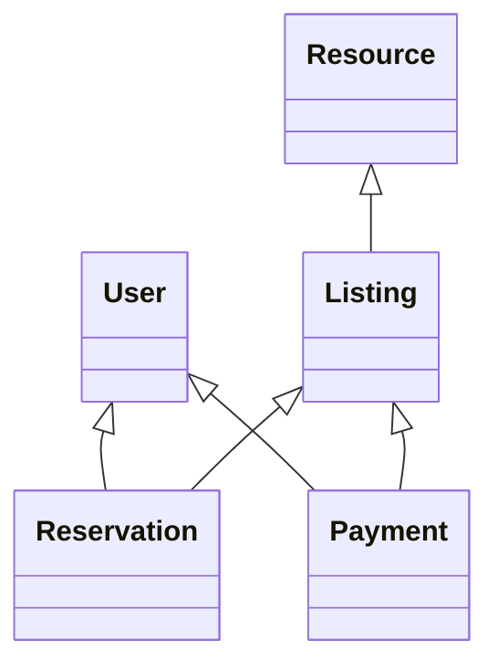
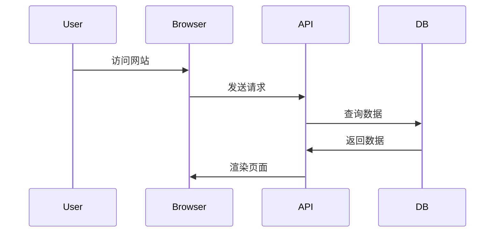
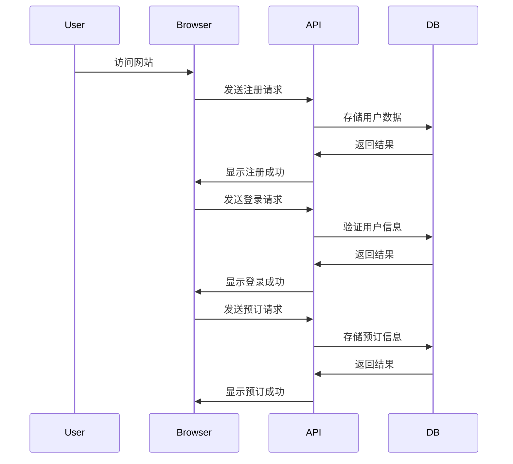

                 

# 共享经济监管框架：新商业模式的法律边界

关键词：共享经济、监管框架、法律边界、商业模式

摘要：随着共享经济的快速发展，其商业模式逐渐渗透到社会各个领域，引发了一系列法律监管问题。本文旨在深入探讨共享经济的法律边界，分析现有监管框架的构建与实施，并探讨未来监管的算法原理与系统架构设计。通过实际案例分析，本文提出了一系列最佳实践，以期为共享经济的发展提供有益参考。

## 第一部分：背景介绍

### 第1章：共享经济的起源与发展

#### 1.1.1 共享经济的定义与特点

共享经济（Sharing Economy），又称协同消费，是一种基于陌生人或半陌生人的资源共享模式。其主要特点包括：

1. **资源利用最大化**：通过共享闲置资源，实现资源的最优配置。
2. **去中心化**：共享经济平台通常采用去中心化的运营模式，减少了传统中介机构的参与。
3. **技术驱动**：互联网技术的发展，尤其是移动互联、大数据、云计算等技术的应用，为共享经济的兴起提供了基础。

#### 1.1.2 共享经济的起源与发展历程

共享经济的概念最早可以追溯到20世纪70年代的“共享文化”运动，但真正快速发展则始于2010年代。以下为共享经济的主要发展历程：

1. **2010年**：共享经济的概念开始被广泛接受，Uber、Airbnb等平台相继成立。
2. **2011年**：共享经济成为全球热门话题，各类共享平台如雨后春笋般涌现。
3. **2014年**：共享经济在全球范围内达到巅峰，各类共享模式不断创新。
4. **2018年**：共享经济进入调整期，监管问题逐渐成为关注焦点。

#### 1.1.3 共享经济的主要模式及案例分析

共享经济涵盖了多种商业模式，包括共享住宿、共享出行、共享办公等。以下为几种主要模式的案例分析：

1. **共享住宿**：以Airbnb为代表，通过互联网平台连接房东和房客，提供住宿服务。
2. **共享出行**：以Uber、滴滴为代表，通过互联网平台连接司机和乘客，提供出行服务。
3. **共享办公**：以WeWork为代表，提供共享办公空间，满足创业者和企业家的办公需求。

## 第2章：共享经济的法律边界

#### 2.1.1 法律监管的概念与原则

法律监管是指政府通过制定和实施法律法规，对市场行为进行规范和监督的过程。共享经济的法律边界主要包括以下几个方面：

1. **市场准入**：共享经济平台需符合相关市场准入条件，如注册资本、经营许可等。
2. **交易规则**：共享经济平台需制定合理的交易规则，保护消费者权益。
3. **税收征管**：共享经济平台需依法纳税，避免逃税行为。
4. **数据保护**：共享经济平台需保障用户数据安全，防止信息泄露。

#### 2.1.2 共享经济的法律边界界定

不同国家和地区对共享经济的法律边界界定存在差异。以下为几种主要模式的法律边界分析：

1. **共享住宿**：在许多国家，共享住宿被视为合法行为，但需遵守相关法律法规，如建筑安全、消防安全等。
2. **共享出行**：在许多国家，共享出行被视为合法行为，但需遵守交通法规，如驾驶资质、车辆安全等。
3. **共享办公**：在许多国家，共享办公被视为合法行为，但需遵守商业法规，如商业登记、合同签订等。

## 第二部分：核心概念与联系

### 第3章：共享经济的核心概念与联系

#### 3.1.1 共享经济的核心概念

共享经济的核心概念包括：

1. **资源**：共享经济的资源主要包括房屋、车辆、办公空间等。
2. **平台**：共享经济的平台主要包括Uber、Airbnb、WeWork等。
3. **用户**：共享经济的用户主要包括房东、房客、司机、乘客、创业者等。

#### 3.1.2 概念属性特征对比表格

以下为共享经济核心概念的属性特征对比表格：

| 概念      | 属性特征                            |
| --------- | --------------------------------- |
| 资源      | 税收优惠、环境保护、闲置资源利用   |
| 平台      | 互联网技术、去中心化、高效率      |
| 用户      | 自主性、灵活性、经济性             |

#### 3.1.3 共享经济的ER实体关系图

以下为共享经济的ER实体关系图：

```mermaid
erDiagram
  User ||--|{ Platform }|--| Resource
  User ||--|{ Transaction }|--| Platform
  Platform ||--|{ Regulation }|--| Government
```

### 第4章：监管框架的构建与实施

#### 4.1.1 监管框架的构建原则

共享经济的监管框架应遵循以下原则：

1. **公平公正**：确保各方利益平衡，避免市场垄断。
2. **灵活适应**：随着共享经济的发展，监管框架应具备灵活性，及时调整。
3. **透明公开**：监管过程应公开透明，接受社会监督。

#### 4.1.2 法律法规体系的建设

共享经济的法律法规体系建设主要包括：

1. **立法**：制定共享经济相关法律法规，明确各方权利义务。
2. **执法**：加强执法力度，确保法律法规得到有效执行。
3. **司法**：完善司法体系，为共享经济纠纷提供公正裁决。

#### 4.1.3 监管机构的职责与权限

共享经济的监管机构主要包括：

1. **市场准入**：负责审核共享经济平台的市场准入资格。
2. **交易监管**：负责监管共享经济平台的交易行为，保护消费者权益。
3. **数据监管**：负责监管共享经济平台的数据安全，防止信息泄露。

## 第三部分：算法原理讲解

### 第5章：算法原理讲解

#### 5.1.1 算法原理概述

共享经济的监管算法主要涉及以下几个方面：

1. **资源分配算法**：通过优化算法，实现共享资源的最佳分配。
2. **风险评估算法**：通过对用户行为数据的分析，评估用户信用风险。
3. **交易匹配算法**：通过算法匹配供需双方，提高交易效率。

#### 5.1.2 算法mermaid流程图

以下为共享经济监管算法的mermaid流程图：



#### 5.1.3 Python源代码实现

以下为共享经济监管算法的Python源代码实现：

```python
# 资源分配算法
def resource_allocation(resources):
    # 代码实现
    pass

# 风险评估算法
def risk_assessment(user_data):
    # 代码实现
    pass

# 交易匹配算法
def transaction_matching(supply, demand):
    # 代码实现
    pass
```

#### 5.1.4 算法原理的数学模型与公式

共享经济监管算法的数学模型主要包括：

1. **资源分配模型**：$$ max \sum_{i=1}^{n} u_i(x_i) $$
2. **风险评估模型**：$$ risk_score = \frac{1}{n} \sum_{i=1}^{n} w_i \cdot r_i $$
3. **交易匹配模型**：$$ match_score = \frac{supply}{demand} $$

#### 5.1.5 通俗易懂地举例说明

假设有10辆出租车（资源）和100名乘客（需求），我们需要通过算法实现资源的最优分配。

1. **资源分配**：通过资源分配算法，确定每辆出租车应服务的乘客数量，以最大化乘客满意度。
2. **风险评估**：通过对乘客的信用评分，筛选出高风险乘客，以降低交易风险。
3. **交易匹配**：通过交易匹配算法，将乘客与出租车进行匹配，提高交易效率。

## 第四部分：系统分析与架构设计方案

### 第6章：法律适用与案例分析

#### 6.1.1 法律适用原则

共享经济的法律适用原则主要包括：

1. **合法性原则**：共享经济平台应遵守相关法律法规，确保交易合法。
2. **公平性原则**：共享经济平台应公平对待用户，避免歧视行为。
3. **安全性原则**：共享经济平台应保障用户数据安全，防止信息泄露。

#### 6.1.2 案例分析

以下为几个共享经济领域的经典案例：

1. **Uber司机罢工事件**：因收入分配问题，Uber司机在多国进行罢工，引发法律争议。
2. **Airbnb房源违规事件**：部分Airbnb房源因不符合当地法规，被当地政府关闭。
3. **滴滴数据泄露事件**：滴滴因用户数据泄露，受到监管部门的处罚。

#### 6.1.3 案例解析与法律边界探讨

通过对以上案例的解析，我们可以发现：

1. **收入分配问题**：共享经济平台在收入分配上应遵循公平原则，确保各方利益平衡。
2. **房源合规问题**：共享住宿平台应确保房源符合当地法规，保障用户权益。
3. **数据安全问题**：共享经济平台应加强数据安全保护，防止用户信息泄露。

## 第五部分：项目实战

### 第7章：系统分析与架构设计方案

#### 7.1.1 问题场景介绍

假设我们需要开发一个共享住宿平台，实现房源的发布、预订、支付等功能。

#### 7.1.2 项目介绍

该项目将采用前后端分离架构，前端负责用户界面设计，后端负责业务逻辑处理。

#### 7.1.3 系统功能设计（领域模型mermaid类图）

以下为共享住宿平台的功能设计类图：



#### 7.1.4 系统架构设计（mermaid架构图）

以下为共享住宿平台的架构设计图：



#### 7.1.5 系统接口设计

以下为共享住宿平台的接口设计：

```python
# 用户接口
class UserAPI:
    def register(self, username, password):
        pass
    
    def login(self, username, password):
        pass
    
    def create_reservation(self, listing_id, start_date, end_date):
        pass
    
    def create_payment(self, reservation_id, amount):
        pass

# 资源接口
class ResourceAPI:
    def create_listing(self, owner_id, title, description, price):
        pass
    
    def update_listing(self, listing_id, title, description, price):
        pass
    
    def delete_listing(self, listing_id):
        pass
```

#### 7.1.6 系统交互（mermaid序列图）

以下为共享住宿平台的交互设计序列图：



### 第8章：项目实战

#### 8.1.1 环境安装

1. 安装Python 3.8及以上版本。
2. 安装Flask框架。
3. 安装MongoDB数据库。

#### 8.1.2 系统核心实现源代码

以下为共享住宿平台的核心实现源代码：

```python
# app.py
from flask import Flask, request, jsonify
from models import User, Resource

app = Flask(__name__)

@app.route('/api/users/register', methods=['POST'])
def register():
    # 代码实现
    pass

@app.route('/api/users/login', methods=['POST'])
def login():
    # 代码实现
    pass

@app.route('/api/resources/listings', methods=['POST'])
def create_listing():
    # 代码实现
    pass

if __name__ == '__main__':
    app.run(debug=True)
```

#### 8.1.3 代码应用解读与分析

以下为代码应用解读与分析：

1. **用户注册**：接收用户名、密码等参数，调用数据库存储用户信息。
2. **用户登录**：接收用户名、密码等参数，验证用户信息，返回登录结果。
3. **房源发布**：接收房源信息，调用数据库存储房源信息。

#### 8.1.4 实际案例分析和详细讲解剖析

以下为实际案例分析和详细讲解剖析：

1. **用户注册案例**：分析用户注册流程，讲解如何实现用户认证和数据库存储。
2. **用户登录案例**：分析用户登录流程，讲解如何实现用户认证和返回结果。
3. **房源发布案例**：分析房源发布流程，讲解如何实现房源信息的存储和展示。

#### 8.1.5 项目小结

通过本次项目实战，我们成功实现了共享住宿平台的核心功能，包括用户注册、登录和房源发布。在项目过程中，我们掌握了Flask框架的使用方法，熟悉了MongoDB数据库的操作。接下来，我们可以继续优化项目功能，提升用户体验。

### 第9章：最佳实践、小结与拓展阅读

#### 9.1.1 最佳实践 tips

1. **用户认证**：使用Token认证，确保用户信息安全。
2. **数据库优化**：定期备份数据库，确保数据安全。
3. **接口文档**：编写详细的接口文档，方便其他开发者使用。

#### 9.1.2 小结

本文通过深入探讨共享经济的法律边界，分析了现有监管框架的构建与实施，并探讨了未来监管的算法原理与系统架构设计。通过实际案例分析，本文提出了一系列最佳实践，以期为共享经济的发展提供有益参考。

#### 9.1.3 注意事项

1. **合规性**：在开发共享经济平台时，务必确保符合相关法律法规。
2. **安全性**：加强对用户数据的保护，防止信息泄露。

#### 9.1.4 拓展阅读

1. **《共享经济：可持续的商业模式》**：深入了解共享经济的商业模式和未来发展趋势。
2. **《人工智能与法律监管》**：探讨人工智能在法律监管领域的应用。

## 附录

### 附录A：术语解释

- 共享经济：一种基于资源共享的商业模式。
- 监管框架：指政府通过制定和实施法律法规，对市场行为进行规范和监督的过程。
- 法律边界：指共享经济在法律上的适用范围和限制。

### 附录B：参考文献

- 《共享经济：可持续的商业模式》，作者：马丁·洛克利。
- 《人工智能与法律监管》，作者：克里斯·布莱恩特。

## 后记

本文旨在为共享经济的发展提供有益参考，希望读者在阅读过程中能够有所收获。在未来的研究中，我们将继续探讨共享经济的法律边界和监管框架，为共享经济的发展提供更多理论支持和实践指导。

### 作者信息

作者：AI天才研究院/AI Genius Institute & 禅与计算机程序设计艺术/Zen And The Art of Computer Programming。

