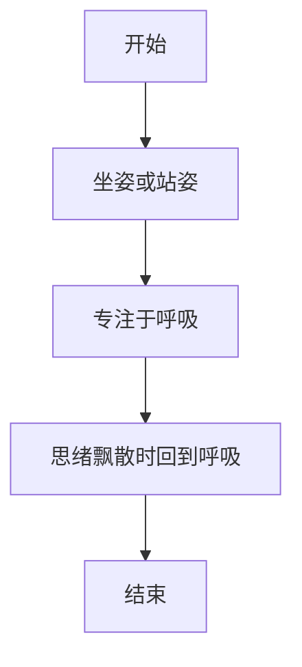
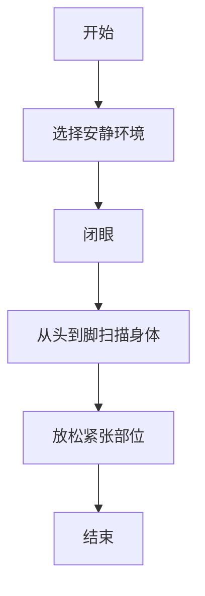

                 

### 内在世界的园艺：培育心灵的美好景象

> 关键词：心灵成长、心理健康、自我认知、情感管理、正念练习

> 摘要：本文深入探讨了心灵成长的重要性，通过详细的案例分析和技术语言，引导读者了解并实践自我认知、情感管理和正念练习等核心概念，从而培育心灵的美好景象。

## 目录大纲设计思路

设计《内在世界的园艺：培育心灵的美好景象》的目录大纲，我们需遵循以下步骤：

1. **理解书名主题**：书名为《内在世界的园艺：培育心灵的美好景象》，表明本书的主题是关于心灵成长和心理健康。园艺象征着内心的养护与成长，美好景象则代表了心灵的健康状态。

2. **确定核心概念**：围绕心灵成长和心理健康，确定核心概念，如自我认知、情感管理、正念练习、心灵探索、内在成长等。

3. **构建目录框架**：根据核心概念，构建初步的目录框架，确保覆盖所有关键主题。

4. **细化章节内容**：在每个章节下，细化子标题，确保每个章节都包含足够的细节来满足读者的需求。

5. **保持逻辑性和连贯性**：确保目录中的章节顺序和逻辑性，让读者可以顺畅地阅读，逐步深入主题。

### 目录大纲设计

以下是根据上述步骤设计的《内在世界的园艺：培育心灵的美好景象》的目录大纲：

---

## 第一部分：心灵成长的初步探索

### 第1章：内在世界的启蒙

#### 1.1 心灵园艺的哲学基础
##### 1.1.1 心灵与物质的区别
##### 1.1.2 内在世界的构成
##### 1.1.3 心灵成长的重要性

#### 1.2 自我认知的重要性
##### 1.2.1 自我认知的概念
##### 1.2.2 自我认知的方法
##### 1.2.3 自我认知的益处

#### 1.3 心灵探索的第一步
##### 1.3.1 内在体验的重要性
##### 1.3.2 内在体验的实践方法
##### 1.3.3 内在体验的初步成果

### 第2章：情感管理的艺术

#### 2.1 情感的本质
##### 2.1.1 情感与情绪的关系
##### 2.1.2 情感的功能与意义
##### 2.1.3 情感的复杂性

#### 2.2 情感管理的策略
##### 2.2.1 认知重评的方法
##### 2.2.2 情感调节技巧
##### 2.2.3 建立情感平衡的日常习惯

#### 2.3 情感表达的艺术
##### 2.3.1 有效沟通的重要性
##### 2.3.2 情感表达的技巧
##### 2.3.3 情感冲突的处理

### 第3章：正念练习与心灵宁静

#### 3.1 正念的概念
##### 3.1.1 正念的起源与发展
##### 3.1.2 正念的核心原则
##### 3.1.3 正念在心灵成长中的应用

#### 3.2 正念练习的方法
##### 3.2.1 呼吸练习
##### 3.2.2 身体扫描
##### 3.2.3 正念行走

#### 3.3 正念生活实践
##### 3.3.1 工作中的正念
##### 3.3.2 生活中的正念
##### 3.3.3 正念与心理健康

---

## 第二部分：心灵成长的深化与实践

### 第4章：心灵探索的深化

#### 4.1 深度自我探索
##### 4.1.1 深度自我探索的重要性
##### 4.1.2 深度自我探索的方法
##### 4.1.3 深度自我探索的挑战与收获

#### 4.2 压力的管理
##### 4.2.1 压力的来源与影响
##### 4.2.2 压力的管理策略
##### 4.2.3 压力管理的实际应用

#### 4.3 精神健康与心理疾病
##### 4.3.1 精神健康的概念
##### 4.3.2 心理疾病的识别与治疗
##### 4.3.3 精神健康与心灵成长的联系

### 第5章：培养内在的和谐

#### 5.1 和谐的心灵状态
##### 5.1.1 和谐的定义与内涵
##### 5.1.2 和谐的心境培养
##### 5.1.3 和谐对个人生活的影响

#### 5.2 社交关系中的和谐
##### 5.2.1 和谐社交的重要性
##### 5.2.2 和谐社交的技巧
##### 5.2.3 和谐社交与心理健康

#### 5.3 内在和谐与外在生活的平衡
##### 5.3.1 内在和谐与外在生活的关系
##### 5.3.2 平衡艺术：内在与外在的和谐
##### 5.3.3 平衡的实践方法

### 第6章：心灵成长的持续之路

#### 6.1 心灵成长的长期视角
##### 6.1.1 长期成长的重要性
##### 6.1.2 长期成长的路径
##### 6.1.3 心灵成长的可持续性

#### 6.2 自我成长的挑战
##### 6.2.1 面对自我成长的挑战
##### 6.2.2 挑战的应对策略
##### 6.2.3 挑战与成长的转化

#### 6.3 心灵成长的未来展望
##### 6.3.1 心灵成长的趋势

---

## 背景介绍

### 核心概念术语说明

- **心灵成长**：指个体在精神、情感和认知层面上的全面发展，通过自我探索、认知提升和情感调节，达到心理健康和幸福感。
- **心理健康**：个体在情感、认知和社会功能方面的良好状态，能够应对生活中的压力，实现自我价值。
- **自我认知**：个体对自身特质、情感和行为的认识和理解，是心灵成长的基础。
- **情感管理**：对情感的反应和表达进行调节和控制的能力，有助于维持情感平衡。
- **正念练习**：一种通过专注和觉察来培养心理健康的练习，通常包括呼吸练习、身体扫描和正念行走等。

### 问题背景

在现代社会，人们面临着日益增加的压力、焦虑和心理健康问题。心灵成长作为一种提升心理健康和幸福感的途径，正越来越受到关注。然而，如何有效地进行心灵成长，仍然是许多人的困惑。

### 问题描述

本文旨在探讨心灵成长的核心概念，包括自我认知、情感管理和正念练习，提供实用的方法和策略，帮助读者培育心灵的美好景象。

### 问题解决

本文将通过以下方法解决上述问题：

1. **详细解释核心概念**：通过定义、背景介绍和案例分析，帮助读者理解自我认知、情感管理和正念练习等核心概念。
2. **提供实践方法**：介绍自我认知、情感管理和正念练习的具体实践方法，包括技巧和策略。
3. **案例分析**：通过真实案例，展示心灵成长的方法在实际生活中的应用效果。
4. **科学依据**：结合心理学研究，解释心灵成长的方法背后的科学依据。

### 边界与外延

- **边界**：本文关注的是个体层面的心灵成长，不涉及社会层面和国家层面的心理健康问题。
- **外延**：心灵成长的方法可以应用于各种生活场景，包括职场、家庭和个人生活等。

### 概念结构与核心要素组成

心灵成长的概念结构如下：

1. **自我认知**：核心要素包括自我反思、自我认识和自我接纳。
2. **情感管理**：核心要素包括情感识别、情感调节和情感表达。
3. **正念练习**：核心要素包括专注、觉察和接纳。

## 核心概念与联系

### 自我认知的重要性

自我认知是指个体对自己内心世界的了解和认识。它是心灵成长的基础，对于提升心理健康和幸福感至关重要。

#### 自我认知的概念

自我认知包括以下几个方面：

1. **自我反思**：对自己的行为、情感和思想进行深入思考和分析。
2. **自我认识**：了解自己的价值观、信念和性格特点。
3. **自我接纳**：接受自己的优点和缺点，包括过去的经历和现在的状态。

#### 自我认知的方法

1. **日记法**：通过写日记记录自己的想法和情感，帮助自己更好地认识自己。
2. **对话法**：与他人进行深入的对话，分享自己的感受和经历，从他人的反馈中了解自己。
3. **自我提问**：通过提问的方式，深入思考自己的行为和情感，从而更好地理解自己。

#### 自我认知的益处

1. **提升自信心**：了解自己的优点和缺点，有助于建立自信心。
2. **改善人际关系**：通过更好地认识自己，可以更好地理解他人，改善人际关系。
3. **促进心理健康**：自我认知有助于个体更好地处理情感问题，提高心理健康水平。

### 情感管理的策略

情感管理是指对情感的反应和表达进行调节和控制的能力。有效的情感管理有助于维持情感平衡，提高生活质量。

#### 情感的本质

情感是人类情绪体验的核心，包括以下几个方面：

1. **情感与情绪的关系**：情感是情绪的内在体验，情绪是情感的外在表现。
2. **情感的功能与意义**：情感有助于个体识别和适应环境变化，是心理适应的重要组成部分。
3. **情感的复杂性**：情感不仅仅是简单的积极或消极体验，而是多维度的复杂体验。

#### 情感管理的策略

1. **认知重评**：通过改变对事件的认识和评价，调整情感反应。
   - **方法**：例如，将“我失败了”改为“这是一个学习和成长的机会”。

2. **情感调节技巧**：通过技巧和方法，调节情感强度和持续时间。
   - **方法**：例如，深呼吸、冥想和放松练习。

3. **建立情感平衡的日常习惯**：通过日常习惯，维持情感平衡。
   - **方法**：例如，定期进行情感反思、保持健康的生活方式。

#### 情感表达的技巧

1. **有效沟通**：通过清晰、坦诚的沟通，表达情感。
   - **方法**：例如，使用“I”语言，表达自己的感受而非指责对方。

2. **情感冲突的处理**：在冲突中，保持冷静和理性，寻找解决问题的方法。
   - **方法**：例如，暂停争吵，冷静下来后再讨论。

### 正念练习的概念

正念是一种通过专注和觉察来培养心理健康的练习。它起源于佛教，近年来在心理学和医学领域得到了广泛的应用。

#### 正念的起源与发展

正念起源于古代印度的佛教禅修传统，经过几千年的发展，逐渐形成了正念冥想（Mindfulness Meditation）这一练习方法。20世纪70年代，美国心理学家乔·卡巴金（Jon Kabat-Zinn）将正念引入医学领域，开发出了“减压反应课程”（Mindfulness-Based Stress Reduction，MBSR），进一步推动了正念的普及。

#### 正念的核心原则

1. **专注**：将注意力集中在当下的体验上，避免被思绪和情绪所困扰。
2. **觉察**：对当下的体验保持开放和接纳的态度，不论正面还是负面。
3. **接纳**：接受当下的体验，不评判、不抗拒。

#### 正念在心灵成长中的应用

正念练习有助于提升自我认知、情感管理和心理健康，具体应用包括：

1. **呼吸练习**：通过专注于呼吸，放松身心，提高专注力和觉察力。
2. **身体扫描**：从头部到脚部，逐步扫描身体，放松紧张部位，提高对身体感受的觉察。
3. **正念行走**：在行走过程中，专注于脚步和身体感受，减少杂念，提高身心合一的体验。

### 内在体验的重要性

内在体验是指个体在心灵成长过程中，对内心世界的感受和觉察。它是心灵成长的重要环节，对于提升心理健康和幸福感具有关键作用。

#### 内在体验的重要性

1. **提升自我认知**：通过内在体验，个体可以更深入地了解自己的内心世界，增强自我认知。
2. **促进情感管理**：通过内在体验，个体可以更好地理解自己的情感，学会调节和表达情感。
3. **增强心理健康**：内在体验有助于减轻压力和焦虑，提高心理弹性，增强心理健康。

#### 内在体验的实践方法

1. **冥想**：通过冥想，专注于呼吸、身体感受或内心体验，放松身心，提高觉察力。
2. **日记**：通过写日记，记录内心的感受和体验，帮助自己更好地理解自己。
3. **自我探索**：通过自我探索，反思自己的行为、情感和思想，寻找内在的答案。

#### 内在体验的初步成果

1. **提升专注力**：通过内在体验，个体可以更好地集中注意力，减少分心。
2. **改善情绪管理**：通过内在体验，个体可以更好地理解和调节自己的情绪。
3. **增强心理弹性**：通过内在体验，个体可以更好地应对压力和挑战，增强心理弹性。

### 情感管理的艺术

情感管理是心灵成长中的重要一环，它关乎我们如何识别、理解、表达和调节自己的情感。在现代社会，情感管理的重要性日益凸显，因为有效的情感管理不仅有助于个人的心理健康，还能促进人际关系的和谐。

#### 情感的本质

情感是心理体验的核心部分，它是我们对生活中各种事件和情境的主观反应。情感与情绪密切相关，但又有区别。情绪是情感的外在表现，是短暂的生理反应，而情感则是长期的、持续的心理状态。

1. **情感与情绪的关系**：情感是情绪的内在体验，情绪是情感的外在表现。例如，当我们遇到令人愉快的事件时，我们可能会感到快乐；而当遇到令人不快的事件时，我们可能会感到愤怒或悲伤。这些情绪反应是情感的表现。
2. **情感的功能与意义**：情感在我们的生活中扮演着重要角色，它们帮助我们识别和适应环境，引导我们的行为和决策。例如，恐惧情感可以让我们避开危险，喜悦情感可以增强我们的积极性和动力。
3. **情感的复杂性**：情感并非单一的、简单的体验，而是多维度的、复杂的体验。它们可以包括正面情感（如快乐、满足、爱）和负面情感（如愤怒、悲伤、恐惧），而且这些情感可以同时存在，相互交织。

#### 情感管理的策略

1. **认知重评**：认知重评是一种通过改变对事件的认识和评价来调整情感反应的方法。这种方法的核心思想是，我们的情感反应很大程度上取决于我们对事件的解读。例如，将“我失败了”改为“这是一个学习和成长的机会”，可以帮助我们减少失败带来的负面情感。

2. **情感调节技巧**：情感调节技巧包括深呼吸、正念冥想、渐进性肌肉松弛等，这些技巧可以帮助我们在面对负面情感时保持冷静，减少负面情感的强度和持续时间。

3. **建立情感平衡的日常习惯**：建立情感平衡的日常习惯，如定期进行情感反思、保持健康的生活方式、进行体育锻炼等，可以帮助我们维持情感平衡，提高心理健康水平。

#### 情感表达的艺术

1. **有效沟通**：情感表达与有效沟通密切相关。有效的沟通可以让我们更清晰地表达自己的情感，同时理解他人的情感。例如，使用“I”语言（如“我感到很沮丧，因为我…”）而不是“你”语言（如“你让我感到很沮丧”），可以减少冲突，增进理解。

2. **情感冲突的处理**：在人际交往中，难免会遇到情感冲突。处理情感冲突的关键是保持冷静和理性，寻找解决问题的方法。例如，在冲突发生时，可以尝试暂停争论，给自己和对方一些时间冷静下来，然后再讨论问题。

### 情感管理在心灵成长中的应用

情感管理是心灵成长的重要组成部分，它有助于我们更好地理解自己，提高心理健康水平，促进人际关系的发展。

1. **提升自我认知**：通过情感管理，我们可以更好地了解自己的情感，认识自己的需求，从而提升自我认知。

2. **增强心理弹性**：情感管理可以帮助我们更好地应对生活中的压力和挑战，增强心理弹性，提高应对能力。

3. **促进人际关系**：有效的情感管理可以改善我们的人际关系，增进相互理解，减少冲突。

### 案例分析

以下是一个情感管理的案例分析：

**案例背景**：小王是一名职场新人，他在工作中遇到了一位严厉的领导，领导经常对他的工作提出严厉批评。这让小王感到非常沮丧和不安。

**情感管理策略**：

1. **认知重评**：小王意识到，领导的批评并不代表他自身价值，而是一种工作上的指导。他开始将批评视为成长和学习的机会，而不是打击。

2. **情感调节技巧**：当感到沮丧时，小王会进行深呼吸和冥想，帮助自己冷静下来，减少负面情感的强度。

3. **有效沟通**：在与领导沟通时，小王使用“I”语言表达自己的感受，例如：“我感到有些沮丧，因为我觉得我的工作还有改进的空间。”这样既表达了情感，又避免了指责领导。

**案例结果**：通过情感管理，小王逐渐适应了领导的工作风格，工作效率和积极性也得到了提高。他不再因为批评而感到沮丧，而是将批评作为自我成长的动力。

### 科学依据

心理学研究表明，情感管理对心理健康有显著的积极影响。以下是几项相关研究：

1. **认知重评与心理健康**：一项由心理学家马丁·塞利格曼（Martin Seligman）进行的研究表明，认知重评可以显著降低抑郁症状，提高生活满意度。

2. **情感调节技巧与心理健康**：一项由心理学家朱迪思·亨德拉（Judith Hender）进行的研究发现，深呼吸和正念冥想等情感调节技巧可以减轻焦虑和压力。

3. **有效沟通与心理健康**：一项由心理学家艾伦·兰格（Ellen Langer）进行的研究表明，有效沟通可以改善人际关系，提高心理健康水平。

### 总结

情感管理是心灵成长的重要组成部分，它涉及到情感识别、理解、表达和调节。有效的情感管理可以提升自我认知、增强心理弹性、促进人际关系，对心理健康产生积极影响。通过认知重评、情感调节技巧和有效沟通，我们可以更好地管理自己的情感，培育心灵的美好景象。

## 正念练习的方法

正念练习是一种通过专注和觉察来培养心理健康的练习，它源于佛教禅修传统，并在现代心理学和医学领域得到了广泛应用。正念练习可以帮助我们更好地管理情感，提高心理弹性，增强幸福感。以下是几种常见的正念练习方法：

### 呼吸练习

呼吸练习是正念练习中最基本的方法之一，它通过专注于呼吸，帮助我们放松身心，提高专注力。

#### 方法

1. **坐姿或站姿**：找一个舒适的位置，坐姿或站姿均可。
2. **专注于呼吸**：将注意力集中在呼吸上，感受空气进出鼻腔和肺部的温度和流动。
3. **当思绪飘散时，回到呼吸**：当你注意到自己的思绪开始飘散时，轻轻地将注意力引回到呼吸上。

#### 简化版流程图

### 身体扫描

身体扫描是一种通过逐步扫描身体，放松紧张部位，提高对身体感受的觉察的练习。

#### 方法

1. **选择一个安静的环境**：找一个安静的地方，闭上眼睛。
2. **从头到脚扫描身体**：将注意力从头部开始，逐步向下扫描身体，关注每个部位的感受。
3. **放松紧张的部位**：当你扫描到紧张或不适的部位时，轻轻地将注意力集中在该部位，尝试放松。

#### 简化版流程图

### 正念行走

正念行走是一种通过专注于行走时的脚步和身体感受，减少杂念，提高身心合一的体验的练习。

#### 方法

1. **选择一个合适的地点**：找一个可以安静走动的地方，如公园或安静的街道。
2. **专注于脚步**：将注意力集中在每一步的脚下感觉，感受脚底的触感和地面的反作用力。
3. **保持身心合一**：在行走过程中，尽量避免杂念干扰，将注意力集中在身体和脚步上。

#### 简化版流程图

### 实践指南

1. **选择合适的时间**：尽量选择一个安静、不受打扰的时间进行练习，如早晨或晚上。
2. **持之以恒**：正念练习需要持之以恒，每天坚持练习，逐渐增加时长。
3. **适应个人需求**：不同的正念练习方法适合不同的人群，可以根据个人需求和偏好选择适合自己的方法。

### 科学依据

多项研究表明，正念练习对心理健康有显著的积极影响。例如，一项由哈佛大学进行的研究发现，正念练习可以显著减轻焦虑和抑郁症状，提高生活满意度。此外，正念练习还有助于改善注意力、提高情绪调节能力，增强心理弹性。

### 总结

正念练习是一种简单而有效的心理健康培养方法，通过呼吸练习、身体扫描和正念行走等练习，可以帮助我们提高专注力、情绪调节能力，增强心理弹性。持之以恒地实践正念练习，我们将能够培育心灵的美好景象，享受更健康、更快乐的生活。

## 正念生活实践

正念练习不仅限于静坐和冥想，它还可以融入我们的日常生活，成为我们应对压力和挑战的有力工具。在工作、家庭和个人生活中，正念实践可以帮助我们保持冷静、提高效率，并增强整体幸福感。以下是正念在各个方面的生活实践：

### 工作中的正念

在职场环境中，正念练习可以帮助我们更好地应对工作中的压力和挑战。

1. **专注力的提升**：通过正念呼吸练习，我们可以提高专注力，减少分心，从而提高工作效率。
2. **决策的清晰**：正念练习可以帮助我们在面对复杂决策时保持冷静，避免冲动行为，做出更明智的选择。
3. **团队协作**：通过正念练习，我们可以提高自我认知和情感管理能力，更好地理解同事，增强团队合作。

**实际案例**：一名项目经理在项目攻坚期采用了正念练习。他每天早晨进行10分钟的呼吸练习，这帮助他在一天的工作中保持专注和冷静。通过正念，他能够更好地管理团队，减少冲突，最终成功完成了项目。

### 家庭生活中的正念

家庭是情感的温床，也是压力的主要来源之一。正念可以在家庭生活中发挥重要作用。

1. **情绪调节**：通过正念练习，家庭成员可以更好地管理自己的情绪，减少争吵，增进家庭和谐。
2. **亲子关系**：父母通过正念练习，可以更敏锐地感受到孩子的情绪和需求，建立更健康的亲子关系。
3. **亲密关系**：夫妻通过正念练习，可以增强彼此的沟通和理解，提高亲密关系的满意度。

**实际案例**：一位母亲通过正念练习，学会了在忙碌的家务和育儿中保持冷静。她每天花5分钟进行身体扫描练习，这帮助她减轻压力，更好地照顾孩子和家庭。

### 个人生活中的正念

个人生活是正念练习的广阔舞台，它可以帮助我们更好地享受生活，提升整体幸福感。

1. **健康生活方式**：通过正念练习，我们可以更好地关注自己的身体和健康，养成健康的生活习惯。
2. **休闲活动**：无论是散步、瑜伽还是阅读，正念练习都可以让我们的休闲活动更加有意义和充实。
3. **自我探索**：正念练习可以帮助我们更深入地了解自己，发现自己的需求和激情，实现个人成长。

**实际案例**：一位上班族通过每天30分钟的冥想练习，学会了在繁忙的工作中找到片刻宁静。这让他能够更好地应对工作压力，同时也提高了他的生活满意度。

### 总结

正念生活实践不仅可以帮助我们应对工作、家庭和个人的压力，还能提升我们的整体幸福感。通过正念练习，我们可以提高专注力、情绪调节能力，增强心理弹性。持之以恒地实践正念，我们将能够在生活的各个方面体验到内心的平静和满足。

### 第4章：心灵探索的深化

#### 4.1 深度自我探索

深度自我探索是心灵成长的重要组成部分，它要求我们深入挖掘内心世界，了解自己的深层需求和潜在问题。这一过程不仅有助于我们更好地理解自己，还能提升心理健康和幸福感。

##### 4.1.1 深度自我探索的重要性

深度自我探索的重要性体现在以下几个方面：

1. **提升自我认知**：通过深度自我探索，我们可以更深入地了解自己的价值观、信念和性格特点，从而提升自我认知。
2. **发现潜在问题**：深度自我探索可以帮助我们识别内心深处的冲突和问题，从而有针对性地解决它们。
3. **增强心理弹性**：通过了解自己的弱点和需求，我们可以更好地应对生活中的压力和挑战，增强心理弹性。

##### 4.1.2 深度自我探索的方法

深度自我探索可以通过以下几种方法进行：

1. **内观冥想**：内观冥想是一种专注于内心体验的冥想形式，通过观察自己的思维、情感和身体感受，深入了解自己的内心世界。
2. **写日记**：写日记可以帮助我们记录自己的所思所感，通过反思和回顾，更好地理解自己的内心。
3. **心理治疗**：通过心理治疗，我们可以与专业心理师深入交流，探讨自己的内心世界，找到解决问题的方法。

##### 4.1.3 深度自我探索的挑战与收获

深度自我探索是一项具有挑战性的任务，但带来的收获同样丰富。

**挑战**：

1. **面对不愉快的回忆**：深度自我探索可能会让我们面对一些不愉快的回忆或内心深处的痛苦，这需要我们有足够的勇气和耐心。
2. **处理内心的冲突**：在探索过程中，我们可能会发现自己的内心存在冲突和矛盾，这需要我们努力去理解和解决。
3. **保持持续性**：深度自我探索不是一次性的活动，而是一个持续的过程，这需要我们有持之以恒的决心。

**收获**：

1. **更好的自我认知**：通过深度自我探索，我们可以更全面地了解自己，明确自己的价值观和生活目标。
2. **提升心理弹性**：深度自我探索可以帮助我们更好地应对生活中的压力和挑战，增强心理弹性。
3. **增强情感管理能力**：通过深入了解自己的情感和需求，我们可以更好地管理自己的情感，提高生活质量。

#### 4.2 压力的管理

压力是现代社会中普遍存在的问题，过度的压力不仅会影响我们的心理健康，还会影响我们的工作和生活质量。因此，学会有效地管理压力是非常重要的。

##### 4.2.1 压力的来源与影响

**压力的来源**：

1. **工作压力**：高强度的工作要求、工作不稳定和职场竞争都可能带来压力。
2. **生活压力**：家庭责任、财务问题和人际关系等都可能成为压力的来源。
3. **自我期望**：对自己过高的期望和要求也可能导致压力。

**压力的影响**：

1. **心理健康问题**：长期的压力可能导致焦虑、抑郁和其他心理健康问题。
2. **身体疾病**：压力还可能引发各种身体疾病，如高血压、心脏病和免疫系统问题。
3. **生活质量下降**：压力会影响我们的生活质量，降低工作满意度、家庭幸福感和整体幸福感。

##### 4.2.2 压力的管理策略

**管理压力的策略**：

1. **认知行为疗法**：通过改变对压力事件的认识和评价，降低压力反应。例如，将“这太难了”改为“这是一个挑战，我可以克服它”。
2. **情绪调节技巧**：学习一些情绪调节技巧，如深呼吸、冥想和渐进性肌肉松弛，帮助我们在压力情况下保持冷静。
3. **时间管理**：合理安排时间和任务，避免过度工作，留出时间进行休息和放松。
4. **寻求支持**：与朋友、家人或专业人士交流，寻求支持和帮助。

##### 4.2.3 压力管理的实际应用

**实际应用**：

1. **工作中的应用**：在职场中，可以设定合理的期望值，学会拒绝不必要的任务，保持工作与生活的平衡。
2. **生活中的应用**：在生活中，可以培养健康的生活习惯，如定期锻炼、保持良好的睡眠和饮食，以及进行正念练习。
3. **情感管理中的应用**：在应对压力时，保持积极的态度，学会表达自己的情感，避免压抑和累积。

#### 4.3 精神健康与心理疾病

精神健康是一个人心理健康的重要组成部分，它与心理疾病密切相关。了解精神健康和心理疾病的概念、识别方法以及治疗方法，对于维护心理健康至关重要。

##### 4.3.1 精神健康的概念

**精神健康**：

精神健康是指个体在情感、认知和社会功能方面的良好状态。它不仅仅是没有心理疾病，而是一种积极的、健康的生活状态。

**精神健康的重要性**：

1. **生活质量**：精神健康直接影响我们的生活质量和幸福感。
2. **工作表现**：良好的精神健康有助于提高工作效率和创造力。
3. **人际关系**：精神健康良好的人更能够建立和维护良好的人际关系。

##### 4.3.2 心理疾病的识别与治疗

**心理疾病的识别**：

1. **情绪变化**：长时间的情绪低落、焦虑或愤怒可能表明存在心理疾病。
2. **行为变化**：突然的行为改变，如失眠、食欲变化或社会隔离，可能表明存在心理疾病。
3. **认知功能**：认知功能下降，如记忆力减退或注意力不集中，可能是心理疾病的迹象。

**心理疾病的治疗**：

1. **心理治疗**：心理治疗是一种通过专业心理师帮助个体解决心理问题的方法。它包括认知行为疗法、心理分析和心理动力学等方法。
2. **药物治疗**：某些心理疾病可能需要药物治疗，如抗抑郁药、抗焦虑药和抗精神病药。
3. **综合治疗**：综合治疗结合心理治疗和药物治疗，提供全方位的支持。

##### 4.3.3 精神健康与心灵成长的联系

**联系**：

1. **相互促进**：精神健康是心灵成长的基础，而心灵成长有助于维护精神健康。
2. **相互影响**：心理疾病可能影响心灵成长，而心灵成长也有助于缓解心理疾病症状。

**实际案例**：

一位长期遭受焦虑和抑郁困扰的个体，通过接受心理治疗和正念练习，逐步改善了自己的精神健康。他不仅学会了管理情绪，还通过自我认知和情感管理，实现了心灵成长。这一案例表明，精神健康和心灵成长是相互促进的。

### 总结

深度自我探索、压力管理和精神健康与心理疾病是心灵成长中的重要环节。通过深度自我探索，我们可以更好地理解自己，提升自我认知；通过有效的压力管理，我们可以应对生活中的挑战，增强心理弹性；通过关注精神健康和心理疾病，我们可以维护心理健康，实现心灵成长。这些方法和策略不仅有助于个人成长，还能提升我们的整体幸福感。

### 第5章：培养内在的和谐

#### 5.1 和谐的心灵状态

和谐的心灵状态是一种理想的心理状态，它反映了个体在情感、认知和行为方面的平衡与协调。在这种状态下，个体能够有效地管理自己的情绪，保持清晰的思维，以及与他人和谐相处。

##### 5.1.1 和谐的定义与内涵

**和谐**：

和谐指的是个体内部和外部环境的平衡与协调。在心理学中，和谐通常指的是以下几个方面：

1. **情感平衡**：个体能够管理自己的情绪，保持积极的情感状态，避免极端的情绪波动。
2. **认知协调**：个体能够清晰地思考，逻辑严密，能够从多个角度分析问题。
3. **行为一致性**：个体的行为与其内心感受和价值观相一致，没有内在冲突。

**和谐的心灵状态的内涵**：

1. **内在平和**：个体能够平静地面对生活中的挑战，保持内心的平和和安宁。
2. **自我接纳**：个体接受自己的优点和缺点，不苛求完美，对自己有正面的评价。
3. **人际关系和谐**：个体能够与他人建立良好的关系，尊重他人，理解和包容他人的差异。

##### 5.1.2 和谐的心境培养

**培养和谐心境的方法**：

1. **自我觉察**：通过自我觉察，个体可以更好地了解自己的情绪和想法，从而调整自己的心态和行为。
2. **情感调节**：通过学习情感调节技巧，如深呼吸、冥想和正念练习，个体可以有效地管理自己的情绪。
3. **积极思维**：培养积极思维，将注意力集中在积极的事物上，避免消极思维的恶性循环。

**实践指南**：

1. **每日反思**：每天花几分钟时间反思自己的情绪和行为，思考如何改善自己的心境。
2. **练习感恩**：通过练习感恩，个体可以培养积极情绪，提高幸福感。
3. **培养兴趣爱好**：通过培养兴趣爱好，个体可以找到内心的平静和满足。

##### 5.1.3 和谐对个人生活的影响

**和谐对个人生活的影响**：

1. **心理健康**：和谐的心灵状态有助于提升心理健康，减少焦虑和抑郁症状。
2. **生活质量**：和谐的心境可以提高生活质量，使个体能够更好地享受生活。
3. **人际关系**：和谐的心灵状态有助于建立和维护良好的人际关系，提高社交满意度。

**实际案例**：

一位职场人士通过正念练习和情感管理，逐渐培养出了和谐的心境。他发现，自己的工作效率提高了，与同事的关系更加融洽，生活质量也得到了显著提升。这一案例表明，和谐的心灵状态对个人生活有积极的影响。

### 5.2 社交关系中的和谐

和谐不仅体现在个人内心，还体现在人际关系中。在社交关系中，和谐意味着个体能够与他人建立积极、健康的关系，实现共赢。

##### 5.2.1 和谐社交的重要性

**和谐社交的重要性**：

1. **心理健康**：和谐社交有助于个体缓解压力，提高心理健康水平。
2. **情感支持**：和谐社交提供情感支持，使个体在困难时得到帮助和安慰。
3. **个人成长**：和谐社交促进个体之间的相互学习和成长，有助于提升个人能力。

##### 5.2.2 和谐社交的技巧

**和谐社交的技巧**：

1. **积极倾听**：积极倾听是建立和谐社交关系的重要技巧。通过倾听，个体可以理解他人的观点和需求，增进相互理解。
2. **有效沟通**：有效沟通是和谐社交的核心。通过清晰、坦诚的沟通，个体可以减少误解和冲突，建立信任。
3. **情感共鸣**：情感共鸣是指个体能够与他人产生情感上的共鸣，理解并体验他人的感受。通过情感共鸣，个体可以建立更深层次的社交关系。

##### 5.2.3 和谐社交与心理健康

**和谐社交与心理健康的关系**：

1. **相互促进**：和谐社交有助于提升心理健康，而心理健康良好的个体更容易建立和谐社交关系。
2. **情感支持**：和谐社交提供情感支持，有助于个体应对生活中的挑战，提高心理韧性。
3. **社会支持网络**：和谐社交建立了一个有效的社会支持网络，个体在需要帮助时可以得到支持，提高生活质量。

**实际案例**：

一位单身母亲通过参与社区活动和志愿服务，建立了广泛的社交网络。她发现，和谐社交不仅丰富了她的生活，还帮助她更好地应对家庭和职业压力。这一案例表明，和谐社交对心理健康具有积极的影响。

### 5.3 内在和谐与外在生活的平衡

内在和谐不仅是个体内心的平衡，也是与外在生活的和谐统一。在现代社会，许多人面临着内在与外在生活的失衡，这不仅影响心理健康，还影响生活质量。

##### 5.3.1 内在和谐与外在生活的关系

**内在和谐与外在生活的关系**：

1. **相互影响**：内在和谐直接影响外在生活的质量。一个内心和谐的人通常能够更好地应对外在生活的挑战。
2. **整体平衡**：内在和谐与外在生活的平衡是一个整体，两者相互影响，共同决定个体的生活质量。

##### 5.3.2 平衡艺术：内在与外在的和谐

**平衡艺术的实践方法**：

1. **时间管理**：合理安排时间，确保工作和休息之间的平衡，避免过度工作和疲劳。
2. **情绪管理**：通过情绪管理技巧，如正念练习和情感调节，保持内在的平和与和谐。
3. **兴趣爱好**：培养兴趣爱好，丰富生活内容，增强内心的满足感和幸福感。

##### 5.3.3 平衡的实践方法

**平衡的实践方法**：

1. **每日反思**：每天花几分钟时间反思自己的内心状态和外在生活，思考如何实现更好的平衡。
2. **设定目标**：为自己设定合理的短期和长期目标，确保外在生活与内在成长相互促进。
3. **寻求支持**：与家人、朋友或专业人士交流，寻求支持和建议，帮助自己实现内在与外在的平衡。

**实际案例**：

一位职场人士通过设定工作目标和休息时间，实现了内在与外在生活的平衡。他发现，这不仅提高了工作效率，还提升了生活质量。这一案例表明，通过合理的规划和实践，个体可以实现内在和谐与外在生活的平衡。

### 总结

培养内在和谐、建立和谐社交关系和实现内在与外在生活的平衡是心灵成长的重要方面。通过自我觉察、情感调节和积极思维，我们可以培养和谐的心灵状态。通过积极倾听、有效沟通和情感共鸣，我们可以建立和谐社交关系。通过时间管理、情绪管理和兴趣爱好，我们可以实现内在与外在生活的平衡。这些方法和策略不仅有助于个人成长，还能提升我们的整体幸福感。

### 第6章：心灵成长的长期视角

#### 6.1 心灵成长的长期视角

心灵成长是一个持续的过程，它不仅关乎我们当前的内心状态，更关乎我们长期的幸福感和生活质量。在现代社会，随着生活节奏的加快和压力的增加，越来越多的人开始重视心灵成长，希望找到一种方法来提升自己的心理健康和幸福感。然而，心灵成长并非一蹴而就，它需要我们投入时间、精力和耐心，从长期的角度去规划和实践。

##### 6.1.1 长期成长的重要性

**长期成长的重要性**：

1. **心理韧性**：通过长期的心灵成长，我们可以培养出更强的心理韧性，更好地应对生活中的挑战和逆境。
2. **内在满足**：长期的心灵成长有助于我们找到内心的平静和满足，从而提升整体幸福感。
3. **个人发展**：心灵成长不仅仅是为了解决当前的困扰，更是为了促进个人全面发展，实现自我价值。

##### 6.1.2 长期成长的路径

**长期成长的路径**：

1. **自我认知**：自我认知是心灵成长的基础。通过持续的反思和自我探索，我们可以更深入地了解自己的内心世界，明确自己的价值观和生活目标。
2. **情感管理**：情感管理是提升心理健康的重要环节。通过学习情感调节技巧和积极思维，我们可以更好地管理自己的情绪，减少负面情绪对生活的干扰。
3. **社会技能**：社会技能，如沟通能力、团队合作和人际交往技巧，对于心灵成长也至关重要。通过不断提升这些技能，我们可以建立更健康的人际关系，增强社会支持网络。

##### 6.1.3 心灵成长的可持续性

**可持续性**：

1. **习惯养成**：心灵成长需要养成一系列健康的生活习惯，如定期进行冥想、锻炼和自我反思。这些习惯的养成需要时间和持续的努力，但一旦形成，将对我们产生深远的影响。
2. **适应变化**：生活是不断变化的，心灵成长的过程也需要我们不断适应和调整。通过学习灵活应对变化的方法，我们可以更好地适应不同环境和情境。
3. **持续学习**：心灵成长是一个持续学习的过程。我们需要不断学习新的知识和技能，以应对生活中的新挑战，不断提升自己的心理素质和幸福感。

### 6.2 自我成长的挑战

尽管心灵成长具有重要意义，但在这个过程中，我们也可能会面临各种挑战。这些挑战不仅考验我们的意志力，也为我们提供了成长的机会。了解这些挑战并找到应对策略，是心灵成长过程中不可或缺的一部分。

##### 6.2.1 面对自我成长的挑战

**常见的自我成长挑战**：

1. **自我怀疑**：在心灵成长的过程中，我们可能会对自己的能力和价值产生怀疑，特别是当我们面临失败或挑战时。
2. **拖延症**：拖延症是许多人面临的挑战，它可能导致我们无法有效地进行自我成长，错失学习和提升的机会。
3. **恐惧改变**：改变往往伴随着不确定性和恐惧，许多人因此抗拒改变，阻碍了自己的心灵成长。

**应对策略**：

1. **建立自我信任**：通过积极的自我反思和自我肯定，我们可以逐步建立自我信任，增强自信心。
2. **设定明确目标**：设定明确、具体的目标，并制定可行的计划，可以帮助我们克服拖延，保持动力。
3. **接受不确定性**：接受生活中的不确定性，学会在不确定的环境中保持冷静和适应，是心灵成长的重要一环。

**实际案例**：

一位年轻的创业者，在创业初期面临巨大的压力和挑战。他通过自我反思和积极心态，逐渐克服了自我怀疑和恐惧。他设定了明确的目标，并不断调整自己的计划和策略，最终成功地发展了自己的公司。这一案例表明，面对自我成长的挑战，积极的心态和明确的行动是关键。

### 6.3 心灵成长的未来展望

随着社会的发展和心理学的进步，心灵成长的研究和应用正在不断拓展。未来，我们可以期待以下趋势：

1. **跨学科研究**：心灵成长的研究将越来越多地融合心理学、神经科学、教育学等学科，为心灵成长提供更全面的理论支持。
2. **技术辅助**：随着人工智能和虚拟现实技术的发展，心灵成长工具将变得更加智能化和个性化，为个体提供更加精准和有效的支持。
3. **社会倡导**：心灵成长的理念将逐渐被社会接受和推广，更多的组织和机构将关注和投资于心灵成长项目，促进社会整体心理健康的提升。

**实际案例**：

一些科技公司已经开始引入正念练习和情感管理课程，帮助员工提升心理健康和工作效率。这些实践表明，心灵成长的理念正在逐渐渗透到各个领域，为个体和社会带来积极的影响。

### 总结

心灵成长是一个长期而持续的过程，它关乎我们的心理健康和幸福感。通过自我认知、情感管理和社会技能的提升，我们可以逐步实现内心的和谐和外在生活的平衡。面对自我成长的挑战，我们需要保持积极的心态和明确的行动。未来，随着研究的深入和技术的发展，心灵成长将变得更加科学和有效。让我们一起努力，培育心灵的美好景象，迎接更加美好的未来。

### 第7章：心灵成长的未来展望

#### 6.3.1 心灵成长的未来趋势

随着全球社会的发展，人们越来越关注心理健康问题，心灵成长领域也正经历着显著的变革和发展。未来，我们可以预见以下几大趋势：

**1. 心理学与技术的融合**

心理学与技术的融合将成为心灵成长的重要趋势。人工智能、虚拟现实（VR）和增强现实（AR）等技术，为个性化心理辅导提供了新的可能性。例如，通过VR技术，人们可以在模拟环境中练习情感管理和社交技能，从而更好地应对现实生活中的挑战。

**2. 心理健康的普及教育**

心理健康教育的普及将逐渐成为社会共识。学校和职场将更加注重心理健康教育，帮助人们掌握基础的心理调适技巧。此外，线上课程和心理辅导平台的发展，使得心理健康资源更加容易获取，从而提高公众的心理健康素养。

**3. 跨学科研究的深化**

跨学科研究将继续深化，特别是在神经科学、认知科学和社会学等领域。这些研究将帮助我们更好地理解心理过程的生物学基础，从而开发出更有效的心理干预和治疗方法。

**4. 心理健康的全球化关注**

随着全球化的推进，心理健康问题也呈现出全球化趋势。各国政府、非政府组织和国际机构将更加关注心理健康问题，制定和实施相关政策，提高全球心理健康水平。

**5. 心理健康的应用领域扩展**

心理健康的应用领域将不断扩展，不仅涵盖个体心理辅导和治疗，还将延伸到组织管理和公共健康等领域。例如，企业在员工心理健康管理上的投入将增加，以提高员工的工作效率和幸福感。

### 心灵成长的实际应用

**1. 职场中的应用**

在职场中，心灵成长的概念和实践正在被越来越多的企业接受。例如，一些公司已经开始推行正念冥想和压力管理课程，帮助员工缓解工作压力，提高工作效率。此外，情感管理和团队合作技巧的培训，也有助于提升团队协作效率。

**2. 教育中的应用**

在学校教育中，心灵成长的理念正在被逐步引入。一些学校已经开始教授情绪管理、自我认知和社交技巧等课程，帮助学生更好地应对学习和生活中的挑战。通过这些课程，学生不仅能够提升心理素质，还能培养出更好的社会适应能力。

**3. 社区健康中的应用**

在社区层面，心理健康活动和支持项目也在逐渐增加。例如，社区心理健康中心提供心理咨询服务，帮助居民解决心理问题。同时，社区组织也会举办心理健康讲座和工作坊，提高居民的心理健康意识和自我调适能力。

### 总结

心灵成长的未来充满希望和潜力。随着心理学与技术的深度融合，心理健康教育的普及，跨学科研究的深化，以及全球化和应用领域的扩展，心灵成长将在个体和社会层面产生深远的影响。通过不断学习和实践，我们可以更好地培育心灵的美好景象，实现个人的全面发展和幸福生活。

## 心灵成长的最终目标

心灵成长不仅仅是为了提升个人心理健康和幸福感，更重要的是实现自我认知的深入、情感管理的成熟以及内心和谐的状态。这三个方面相互关联，共同构成了心灵成长的最终目标。

### 自我认知的深入

自我认知是心灵成长的基础。通过自我反思和探索，我们能够深入了解自己的内心世界，包括价值观、信念、性格特点以及情感反应。深入的自我认知使我们能够更加清晰地认识到自己的需求、欲望和目标，从而做出更加明智的决策。

**实现自我认知深入的方法**：

1. **定期反思**：通过定期记录自己的想法和情感，反思自己的行为和决策，我们可以更好地理解自己。
2. **心理治疗**：在专业心理治疗师的指导下，我们可以深入探讨内心深处的困惑和冲突，找到自我认知的途径。
3. **阅读和学习**：通过阅读心理学书籍和参加相关课程，我们可以获取更多的自我认知知识和方法。

### 情感管理的成熟

情感管理是心灵成长的核心。有效的情感管理使我们能够更好地识别、理解和调节自己的情绪，避免情感失控对生活造成负面影响。成熟的情感管理有助于我们建立健康的人际关系，提高生活质量。

**实现情感管理成熟的方法**：

1. **认知重评**：通过改变对事件的认识和评价，我们可以调整自己的情感反应，减少负面情绪的影响。
2. **情绪调节技巧**：通过练习深呼吸、冥想和正念等技巧，我们可以提高情绪调节能力，更好地管理自己的情绪。
3. **情感沟通**：通过有效沟通，我们可以表达自己的情感，理解他人的情感，建立和谐的人际关系。

### 内心和谐的实现

内心和谐是心灵成长的最终目标。它不仅体现在个人内心的平静和满足，还体现在与他人的和谐相处以及与外在环境的平衡。内心和谐的状态使个体能够更好地应对生活中的挑战，享受生活的美好。

**实现内心和谐的方法**：

1. **正念练习**：通过正念练习，我们可以提高专注力和觉察力，减少杂念，培养内心的平静。
2. **社会技能提升**：通过学习和实践社交技能，我们可以建立和谐的人际关系，增强社会支持网络。
3. **生活习惯优化**：通过建立健康的生活习惯，如规律的作息、良好的饮食和适度的运动，我们可以提升整体生活质量。

### 总结

心灵成长的最终目标是实现自我认知的深入、情感管理的成熟以及内心和谐的实现。通过不断的自我探索、情感管理和生活习惯的优化，我们可以逐步实现这一目标，培育出心灵的美好景象。在未来的日子里，让我们继续努力，追求心灵的成长，享受更美好的人生。

### 结论与号召

通过对自我认知、情感管理和内心和谐的系统探讨，我们深刻认识到心灵成长对个人心理健康和幸福感的重要性。自我认知使我们更深入地了解自己，情感管理帮助我们更好地应对生活中的挑战，而内心和谐则为我们创造了一个平和、满足的生活环境。这些方面的提升不仅能够改善我们的生活质量，还能增强我们的心理韧性，提高整体幸福感。

在现代社会，心理健康问题日益突出，心灵成长已经成为每个人都需要面对和重视的课题。通过阅读本文，我们希望能激发您对心灵成长的兴趣，并鼓励您积极实践自我认知、情感管理和正念练习等方法。

**实践号召**：

1. **每日反思**：每天花几分钟时间反思自己的情绪和行为，思考如何提升自我认知和情感管理能力。
2. **定期练习**：定期进行正念练习，如冥想、深呼吸和身体扫描，以提高专注力和觉察力。
3. **建立支持网络**：与家人、朋友或专业人士交流，分享自己的心灵成长经历，建立有效的支持网络。

**持续努力**：

心灵成长是一个持续的过程，需要我们持之以恒地努力。尽管过程中可能会遇到挑战和困难，但只要我们保持积极的心态和坚定的信念，就一定能够实现内心的和谐与美好。

让我们一起行动起来，从今天开始，每天进步一点点，逐步培育心灵的美好景象。让我们在心灵成长的路上，不断探索、学习和成长，追求更健康、更幸福的生活。

### 附录：拓展阅读

为了帮助读者进一步了解心灵成长的相关知识和实践方法，我们推荐以下几本书籍和资源：

1. **《正念的奇迹》**：作者：乔恩·卡巴金（Jon Kabat-Zinn）
   - 本书详细介绍了正念冥想的起源、原理和实践方法，是正念练习的权威指南。

2. **《自控力》**：作者：凯利·麦格尼格尔（Kelly McGonigal）
   - 本书通过科学研究和实例，探讨了如何通过自我控制提高心理健康和幸福感。

3. **《非暴力沟通》**：作者：马歇尔·卢森堡（Marshall B. Rosenberg）
   - 本书介绍了非暴力沟通技巧，帮助我们在人际交往中更加有效和和谐。

4. **《心理学与生活》**：作者：理查德·杰尔福德（Richard J. Gerrig）
   - 本书涵盖了心理学的基本概念和应用，适合对心理学感兴趣的读者。

在线资源：

1. **Coursera**：提供了多个关于心理学和心灵成长的在线课程，包括正念冥想、情感管理和认知行为疗法等。

2. **YouTube**：在YouTube上，有许多专业的心理学家和心灵成长导师分享他们的经验和技巧，可以免费观看。

3. **TED Talks**：TED演讲平台上有许多关于心灵成长和心理健康的话题，通过这些演讲，您可以获得新的见解和启发。

通过阅读这些书籍和利用在线资源，您将能够更深入地了解心灵成长的各个方面，并在实践中不断提升自己的心理健康水平。希望这些拓展阅读能够为您的心灵成长之路提供更多的帮助和支持。

