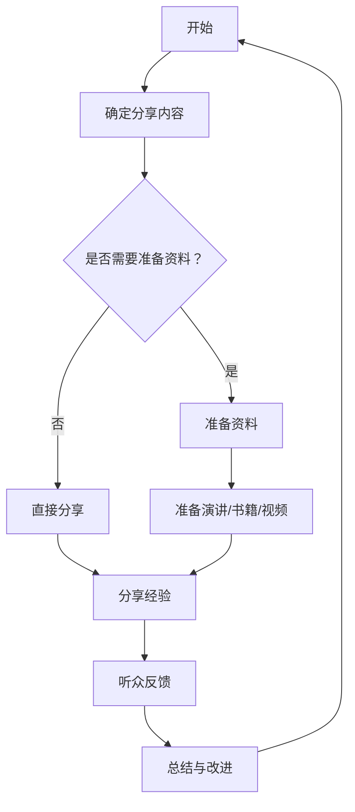
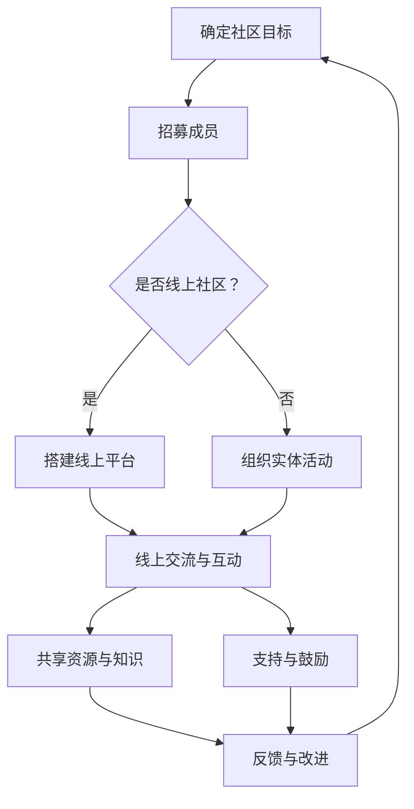

                 

# 内在成长的追求：beyond表面的深度生活

## 关键词
- 内在成长
- 深度生活
- 自我认知
- 情绪管理
- 人际关系
- 挑战与应对

## 摘要
本文旨在探讨内在成长的重要性以及如何通过深度生活实现个人的精神层面提升。文章从自我认知、情绪管理和人际关系等方面分析内在成长的核心概念，并分享实践路径、挑战应对以及最佳实践。通过深入思考和体验，读者将能够找到生活的意义和价值，过上更加充实和有意义的生活。

## 第一部分：引言

### 第1章 内在成长的追求：beyond表面的深度生活

#### 1.1 问题背景

在现代社会，人们常常被外界的压力所包围，如工作压力、人际关系压力等。这些问题往往使人们感到焦虑和疲惫，从而导致内心空虚和孤独。这种表面生活的局限性使得人们逐渐忽视了内心的需求，导致精神层面的空虚。

#### 1.1.1 现代社会的问题
现代社会中，物质财富的丰富和社会地位的提升成为了人们追求的目标。然而，这种追求往往使人们陷入了无尽的竞争和焦虑之中。工作压力、业绩考核、社会评价等压力使得人们无法真正享受生活的乐趣，而只是忙于满足外在的需求。

#### 1.1.2 表面生活的局限性
表面生活主要关注的是外在的物质和成就，而忽视了内心的需求和成长。人们追求的物质财富和社会地位并不能带来持久的幸福感，往往只是短暂的满足感。这种表面生活的局限性导致了内心的空虚和孤独，使得人们难以找到生活的意义和价值。

#### 1.1.3 内在成长的重要性
内在成长指的是个体在精神层面上的提升，包括自我认知、情绪管理和人际关系等方面的提升。通过内在成长，个体可以更好地应对生活中的挑战，提高生活质量。内在成长不仅仅是为了满足物质需求，更是为了追求内心的满足和幸福。

#### 1.1.4 深度生活的概念
深度生活是指人们通过深入思考和体验，找到生活的意义和价值，从而过上更加充实和有意义的生活。深度生活不仅仅是一种生活方式，更是一种生活态度。它要求个体摆脱表面的追求，回归内心，寻找真正的自我和生活的意义。

### 1.2 内在成长的核心概念

#### 2.1 自我认知

自我认知是指个体对自己的认识和了解，包括自己的优点、缺点、价值观等。自我认知对于个体的发展至关重要，它帮助个体明确自己的目标和方向，提高自我效能感。

#### 2.1.1 自我认知的概念
自我认知是个体对自己的认识和了解，包括外在特征和内在特质。它涉及到个体对自己的外貌、性格、能力、价值观等方面的思考和理解。自我认知不仅仅是对自己的表面了解，更是对自己内在特质的深刻认识。

#### 2.1.2 自我认知的重要性
自我认知对于个体的发展具有重要作用。首先，自我认知有助于个体明确自己的目标和方向。通过了解自己的优点和缺点，个体可以更好地制定目标，找到适合自己的发展路径。其次，自我认知可以提高个体的自我效能感。当个体认识到自己的优点和潜力时，他们会更加自信和积极，从而更容易实现自己的目标。

#### 2.1.3 自我认知的方法
1. 自我反思
自我反思是一种常用的自我认知方法。通过反思自己的行为、思考和情感，个体可以更好地了解自己的内心世界，找到自己的优点和不足。自我反思可以帮助个体发现自己的潜力和可能性，从而更好地规划自己的未来发展。

2. 第三方反馈
第三方反馈是指通过他人的观察和评价来了解自己。他人的观点和反馈可以提供不同的视角和见解，帮助个体更全面地认识自己。第三方反馈可以是朋友、家人、同事或专业导师的反馈，他们的观察和评价可以帮助个体发现自己在某些方面可能忽视的问题。

3. 心理测试
心理测试是一种通过标准化工具和问卷来了解自己的方法。心理测试可以帮助个体了解自己的性格特点、兴趣爱好、价值观等方面，从而更好地认识自己。常见的心理测试包括MBTI、霍兰德职业兴趣测试等。

#### 2.2 情绪管理

情绪管理是指个体对自身情绪的调控和应对能力。情绪管理能力影响个体的心理健康和生活质量。

#### 2.2.1 情绪管理的概念
情绪管理是指个体在面对不同情绪时，采取适当的应对策略和调节方法，以达到情绪的稳定和平衡。情绪管理不仅仅是对负面情绪的处理，更是对积极情绪的合理表达和利用。

#### 2.2.2 情绪管理的重要性
情绪管理能力对于个体的心理健康和生活质量具有深远影响。良好的情绪管理能力可以帮助个体更好地应对压力和挑战，减少负面情绪对生活的影响。同时，情绪管理能力也有助于建立积极的人际关系，提升个人的社交能力和情商。

#### 2.2.3 情绪管理的方法
1. 认知重构
认知重构是一种通过改变对事物的看法和解释来调节情绪的方法。当个体面临负面情绪时，可以通过调整自己的认知框架，重新看待问题，从而减轻负面情绪的影响。例如，当个体面临失败时，可以通过认知重构将其看作是一次学习和成长的机会，而不是一种失败。

2. 深呼吸
深呼吸是一种简单而有效的情绪调节方法。通过深呼吸，个体可以放松身心，减轻紧张和焦虑感。深呼吸的方法是缓慢地吸气，保持一段时间，然后缓慢地呼气。这种方法可以帮助个体恢复内心的平静和宁静。

3. 冥想
冥想是一种通过专注和放松来调节情绪的方法。通过冥想，个体可以培养内心的平静和专注力，减少负面情绪的干扰。冥想的方法是找一个安静的地方，坐直身体，闭上眼睛，专注于自己的呼吸，放松身体和心灵。

#### 2.3 人际关系

人际关系是指个体与他人之间的互动和交往。良好的人际关系对于个体的成长和发展具有重要意义。

#### 2.3.1 人际关系的概念
人际关系是指个体与他人之间的相互作用和互动。这种互动可以是亲密的、友好的，也可以是疏远的、敌对的。人际关系包括家庭关系、朋友关系、同事关系等。

#### 2.3.2 人际关系的重要性
人际关系对于个体的成长和发展具有重要意义。首先，良好的人际关系可以帮助个体建立信任和合作，提升社交能力和情商。其次，良好的人际关系可以为个体提供情感支持和帮助，缓解生活压力。此外，人际关系还有助于个体获得更多的机会和资源，促进个人的职业发展和个人成长。

#### 2.3.3 人际关系的方法
1. 沟通技巧
沟通技巧是建立良好人际关系的重要方法。通过有效的沟通，个体可以更好地表达自己的想法和需求，理解他人的观点和感受。沟通技巧包括倾听、表达、提问等。倾听他人的观点和感受，表达自己的想法和需求，提问以了解他人的需求和期望，这些都是建立良好人际关系的关键。

2. 信任建立
信任是良好人际关系的基础。建立信任需要个体具备诚信、可靠和负责任等品质。通过遵守承诺、保持一致性和积极回应他人的需求，个体可以逐渐赢得他人的信任。此外，倾听他人的意见和建议，尊重他人的观点和感受，也是建立信任的重要方法。

3. 团队合作
团队合作是人际关系中的一种重要形式。在团队合作中，个体需要与他人共同努力，共同实现目标。通过团队合作，个体可以提升自己的团队协作能力，培养团队合作精神，同时也能够增进与他人的沟通和信任。

### 1.3 内在成长的实践路径

#### 3.1 自我提升

自我提升是指个体通过不断学习和成长，提高自己的能力和素质。自我提升不仅仅是为了满足外在的需求，更是为了追求内心的满足和成长。

#### 3.1.1 自我提升的概念
自我提升是指个体通过主动学习和实践，不断拓展自己的知识、技能和素质，以提高自身的能力和竞争力。自我提升不仅包括学习新知识和技能，还包括培养良好的习惯和品质，提升自我认知和情绪管理能力等。

#### 3.1.2 自我提升的重要性
自我提升在个体的成长和发展过程中具有重要作用。首先，自我提升可以帮助个体在竞争激烈的社会中脱颖而出。通过不断学习和成长，个体可以不断提高自己的能力和素质，从而在职场中取得更好的成绩和更高的职位。其次，自我提升有助于个体实现个人目标和价值观。通过自我提升，个体可以更好地理解自己的需求和期望，明确自己的发展方向，实现个人价值和成就感。

#### 3.1.3 自我提升的方法
1. 读书
读书是自我提升的重要途径之一。通过阅读，个体可以获取各种知识和信息，拓宽自己的视野，提高自己的思维能力。阅读不仅可以帮助个体学习新知识和技能，还可以培养批判性思维和创造性思维。

2. 学习新技能
学习新技能是自我提升的另一个重要方法。在现代社会，技能的不断更新和升级是保持竞争力的关键。通过学习新技能，个体可以不断适应社会发展的需求，提高自己的专业能力和职业素养。

3. 培养兴趣
培养兴趣可以帮助个体保持积极向上的心态，激发学习的动力。通过培养兴趣，个体可以选择自己感兴趣的方向进行深入学习和探索，从而提高自己的学习效果和成就感。

### 3.2 内在探索

内在探索是指个体通过自我反思和深入思考，挖掘自己的内心世界。通过内在探索，个体可以更好地认识自己，找到生活的意义和价值。

#### 3.2.1 内在探索的概念
内在探索是指个体通过自我反思和深入思考，挖掘自己的内心世界，了解自己的需求和欲望，寻找生活的意义和价值。内在探索不仅仅是对自己的认识和理解，更是一种对内心的探索和发现。

#### 3.2.2 内在探索的重要性
内在探索对于个体的成长和发展具有重要意义。首先，内在探索可以帮助个体更好地认识自己，了解自己的需求和欲望。通过自我反思和深入思考，个体可以更加清晰地认识到自己的内心世界，明确自己的价值观和目标，从而更好地规划自己的人生道路。

其次，内在探索有助于个体找到生活的意义和价值。通过深入探索自己的内心世界，个体可以发现自己内心深处的渴望和追求，找到自己真正热爱的事物和意义。这有助于个体过上更加充实和有意义的生活，提高生活质量。

#### 3.2.3 内在探索的方法
1. 冥想
冥想是一种通过专注和放松来探索内心世界的方法。通过冥想，个体可以培养内心的平静和专注力，减少外界的干扰，深入探索自己的内心世界。冥想可以帮助个体更好地认识自己，了解自己的需求和欲望。

2. 日记
日记是一种记录自己思想和感受的方法。通过写日记，个体可以反思自己的行为和思考，了解自己的内心世界。日记可以帮助个体更好地认识自己，找到生活的意义和价值。

3. 自我对话
自我对话是一种通过与自己进行对话来探索内心世界的方法。通过自我对话，个体可以倾听自己内心的声音，了解自己的需求和欲望。自我对话可以帮助个体更好地认识自己，找到生活的意义和价值。

### 3.3 情感管理

情感管理是指个体对自身情感的控制和调节。情感管理能力对于个体的心理健康和生活质量具有深远影响。

#### 3.3.1 情感管理的概念
情感管理是指个体在面对不同情绪时，采取适当的应对策略和调节方法，以达到情绪的稳定和平衡。情感管理不仅仅是对负面情绪的处理，更是对积极情绪的合理表达和利用。

#### 3.3.2 情感管理的重要性
情感管理能力对于个体的心理健康和生活质量具有深远影响。良好的情感管理能力可以帮助个体更好地应对压力和挑战，减少负面情绪对生活的影响。同时，情感管理能力也有助于建立积极的人际关系，提升个人的社交能力和情商。

#### 3.3.3 情感管理的方法
1. 情绪调节技巧
情绪调节技巧是指个体在面对负面情绪时，采取的调节和缓解方法。常见的情绪调节技巧包括深呼吸、放松练习、认知重构等。通过这些技巧，个体可以缓解负面情绪的影响，恢复内心的平静。

2. 情感释放
情感释放是指个体通过适当的方式表达和释放自己的情感。情感释放可以帮助个体减轻内心的压力和负担，恢复情感的平衡。常见的情感释放方式包括倾诉、哭泣、运动等。

3. 情感支持
情感支持是指个体在面临困难和挑战时，从他人那里获得的情感支持和鼓励。情感支持可以帮助个体增强自信心，提高应对困难的能力。通过与他人建立良好的情感支持关系，个体可以获得情感上的安慰和帮助。

### 1.4 内在成长的挑战与应对

#### 4.1 面对挑战

内在成长过程中，个体会遇到各种挑战，如焦虑、恐惧、挫折等。面对挑战，个体需要勇敢面对，寻找应对策略。

#### 4.1.1 挑战的本质
挑战是内在成长过程中不可避免的一部分。挑战可以是外部的，如工作压力、人际关系问题等；也可以是内部的，如焦虑、恐惧等负面情绪。挑战的本质是对个体的挑战，它促使个体不断成长和进步。

#### 4.1.2 面对挑战的重要性
面对挑战对于个体的成长和发展至关重要。只有勇敢面对挑战，个体才能不断提升自己的能力和素质，克服困难，实现目标。面对挑战可以帮助个体培养坚韧的品质，增强自信和决心，从而更好地应对未来的挑战。

#### 4.1.3 面对挑战的方法
1. 正面思考
正面思考是一种积极的心态，它可以帮助个体在面对挑战时保持乐观和积极。通过正面思考，个体可以将挑战看作是成长和进步的机会，而不是困扰和压力。正面思考可以帮助个体找到解决问题的方法和策略，从而更好地应对挑战。

2. 积极应对
积极应对是指个体在面对挑战时采取积极的行动和措施。通过积极应对，个体可以主动解决问题，寻找解决方案，而不是被动地接受挑战。积极应对可以帮助个体保持主动性和积极性，从而更好地应对挑战。

3. 寻求支持
寻求支持是指个体在面对挑战时，从他人那里获得帮助和支持。寻求支持可以帮助个体缓解压力，增强信心，提高应对挑战的能力。通过与他人建立良好的关系，个体可以获得情感上的支持和建议，从而更好地应对挑战。

#### 4.2 应对策略

应对策略是指个体在面临挑战时采取的具体行动和措施。有效的应对策略可以帮助个体克服困难，实现目标。

#### 4.2.1 应对策略的概念
应对策略是指个体在面对挑战和困难时，采取的具体行动和措施。这些策略可以帮助个体更好地应对挑战，解决问题，实现目标。应对策略包括时间管理、目标设定、学习策略等。

#### 4.2.2 应对策略的重要性
应对策略对于个体的成长和发展具有重要意义。首先，应对策略可以帮助个体更好地应对挑战和困难，提高应对问题的能力。通过有效的应对策略，个体可以更好地管理时间和资源，提高工作效率和效果。其次，应对策略可以帮助个体实现目标。通过设定明确的目标和制定详细的计划，个体可以更加有条理地实现目标，提高成就感和满足感。

#### 4.2.3 应对策略的方法
1. 时间管理
时间管理是一种有效的应对策略，它可以帮助个体合理安排时间，提高工作效率。通过制定时间表和优先级列表，个体可以更好地分配时间，确保重要任务得到及时处理。

2. 目标设定
目标设定是一种重要的应对策略，它可以帮助个体明确目标，制定计划，实现目标。通过设定明确的目标和制定详细的计划，个体可以更加有针对性地解决问题，提高成功率。

3. 学习策略
学习策略是一种有效的应对策略，它可以帮助个体更好地学习和掌握知识。通过选择合适的学习方法和技巧，个体可以更快地理解和掌握新知识，提高学习效果。

### 1.5 内在成长的最佳实践

#### 5.1 个人经验分享

个人经验分享是指个体将自己的成长经历和心得体会与他人交流。通过个人经验分享，个体可以分享自己的成功经验和教训，帮助他人加速成长。

#### 5.1.1 个人经验分享的概念
个人经验分享是一种通过分享自己的成长经历和心得体会，帮助他人学习和成长的方法。通过个人经验分享，个体可以传达自己的知识和经验，启发他人的思考和行动。

#### 5.1.2 个人经验分享的重要性
个人经验分享对于个体的成长和发展具有重要意义。首先，个人经验分享可以帮助他人更快地学习和成长。通过分享自己的经验和教训，个体可以为他人提供宝贵的参考和指导，帮助他们避免重复自己的错误，更快地取得成功。其次，个人经验分享可以帮助个体加深对自己的认识和理解。通过回顾和总结自己的成长过程，个体可以更好地认识自己的优点和不足，明确自己的发展方向和目标。

#### 5.1.3 个人经验分享的方法
1. 演讲
演讲是一种有效的个人经验分享方法。通过演讲，个体可以将自己的经验和心得传达给更多人，激发他人的思考和行动。演讲可以帮助个体提高表达能力和演讲技巧，同时也能够建立自己的影响力和声誉。

2. 书籍
书籍是一种持久和广泛传播的个人经验分享方法。通过撰写书籍，个体可以系统地总结自己的经验和知识，与他人分享自己的思考和见解。书籍不仅可以帮助个体传递自己的思想和理念，还可以为读者提供深入的思考和启示。

3. 社交媒体
社交媒体是一种便捷和高效的个人经验分享方法。通过社交媒体平台，个体可以与更多的人分享自己的经验和心得，获得反馈和建议。社交媒体可以帮助个体扩大影响力，吸引更多的关注和支持。

### 5.2 成长社区

成长社区是指一群志同道合的人组成的互助群体。在成长社区中，个体可以相互学习、交流和成长。

#### 5.2.1 成长社区的概念
成长社区是指一群具有共同成长目标和发展兴趣的人组成的互助群体。在这个社区中，个体可以相互学习、交流和成长，共同面对挑战和困难，分享经验和资源。

#### 5.2.2 成长社区的重要性
成长社区对于个体的成长和发展具有重要意义。首先，成长社区为个体提供了一个学习、交流和成长的平台。在这个社区中，个体可以与其他成员分享自己的知识和经验，获取新的见解和思路，从而不断丰富自己的知识和能力。其次，成长社区为个体提供了一个相互支持和鼓励的环境。在这个社区中，个体可以与其他成员建立深厚的友谊和信任关系，共同面对挑战和困难，互相支持和鼓励，从而提高自己的成长速度和效果。

#### 5.2.3 成长社区的方法
1. 线上论坛
线上论坛是一种便捷的成长社区形式。通过线上论坛，个体可以与其他成员进行讨论和交流，分享经验和心得，获取反馈和建议。线上论坛可以帮助个体扩大社交圈子，获取更多的学习资源和机会。

2. 实体活动
实体活动是一种面对面的成长社区形式。通过组织实体活动，如研讨会、讲座、培训等，个体可以与其他成员进行深入交流和互动，共同学习和发展。实体活动可以帮助个体建立更紧密的社交关系，提高成长效果。

3. 学习小组
学习小组是一种小规模的成长社区形式。通过学习小组，个体可以与其他成员一起学习、讨论和分享，共同进步。学习小组可以帮助个体更好地理解和掌握知识，提高学习效果。

### 1.6 内在成长的长期愿景

#### 6.1 长期愿景的概念
长期愿景是指个体在内心深处渴望实现的愿景和目标。它是个体对未来的期望和追求，为个体的成长和发展提供了方向和动力。

#### 6.1.1 长期愿景的概念
长期愿景是指个体在内心深处渴望实现的愿景和目标。它是个体对未来的期望和追求，为个体的成长和发展提供了方向和动力。长期愿景通常涵盖了个体的职业目标、个人成就、生活方式等方面的期望，它不仅是对未来的规划，更是对内心的激励和引导。

#### 6.1.2 长期愿景的重要性
长期愿景对于个体的成长和发展具有至关重要的意义。首先，长期愿景为个体提供了明确的方向和目标。有了长期愿景，个体可以更好地规划自己的未来，明确自己的发展路径，从而减少迷茫和困惑。其次，长期愿景激发了个体内心的动力和激情。当个体拥有一个激动人心的长期愿景时，他们会充满热情地追求目标，克服困难，不断进步。此外，长期愿景还有助于个体保持持续的成长和提升。通过不断调整和优化长期愿景，个体可以适应社会的发展和变化，不断提高自己的能力和素质。

#### 6.1.3 长期愿景的制定方法
1. 自我反思
自我反思是制定长期愿景的重要步骤。通过深入思考自己的兴趣、优势、价值观和目标，个体可以更好地认识自己，明确自己的长期愿景。自我反思可以帮助个体发现自己的潜力，明确自己的发展方向。

2. 目标设定
目标设定是将长期愿景具体化为可行的步骤和目标。个体可以根据长期愿景设定短期和长期的目标，制定详细的行动计划，从而逐步实现愿景。

3. 反馈与调整
在实现长期愿景的过程中，个体需要不断进行反馈和调整。通过反思和总结自己的经验和成果，个体可以及时发现问题，调整目标和方法，保持前进的方向。

### 第2章 内在成长的核心概念

在追求内在成长的过程中，自我认知、情绪管理和人际关系是三个核心概念，它们相互关联，共同构成了个体精神层面的提升。在本章中，我们将深入探讨这三个核心概念，并分析它们在内在成长中的重要性以及如何通过有效的方法来实现这些成长。

#### 2.1 自我认知

自我认知是个体对自身内在和外在特征的认知和理解，包括个体的性格、价值观、信念、能力等。它是内在成长的基础，因为只有深刻了解自己，个体才能明确自己的目标和方向，从而更好地规划自己的成长路径。

##### 2.1.1 自我认知的概念

自我认知是指个体通过内省和外部反馈，对自己进行全面、深入的认识和理解。这种认知不仅仅局限于表面的特征，还包括个体的内在心理状态、情感和动机。自我认知是自我意识的体现，它帮助个体识别自己的优点和缺点，理解自己的行为模式，从而实现自我提升。

##### 2.1.2 自我认知的重要性

自我认知在内在成长中起着至关重要的作用。首先，它帮助个体明确自己的目标。通过深入了解自己的兴趣、价值观和能力，个体可以更好地识别适合自己的职业和生活方式，从而避免盲目跟风和迷失自我。其次，自我认知有助于提高个体的自我效能感。当个体认识到自己的优点和潜力时，他们会更加自信，从而在面对挑战时更有勇气和决心。此外，自我认知还能够帮助个体更好地管理自己的情绪和行为，减少因自我认知不足而产生的焦虑和冲突。

##### 2.1.3 自我认知的方法

1. 自我反思

自我反思是一种通过回顾自己的行为、思考和情感来了解自己的方法。通过定期记录和反思，个体可以更清晰地认识到自己的行为模式、情感反应和思维习惯，从而找出需要改进的地方。

2. 第三方反馈

第三方反馈是通过他人的观察和评价来了解自己。他人的视角和反馈可以为个体提供不同的洞察，帮助他们更好地认识自己。这可以是家人、朋友、同事或导师的反馈。

3. 心理测试

心理测试是一种通过标准化工具和问卷来了解自己的方法。这些测试可以帮助个体了解自己的性格、能力、价值观等方面，从而更全面地认识自己。

##### 表格：自我认知方法对比

| 方法       | 优点                             | 缺点                              |
|------------|----------------------------------|-----------------------------------|
| 自我反思   | 帮助个体深入思考，自我探索       | 需要大量时间和自我纪律             |
| 第三方反馈 | 提供不同的视角和见解             | 可能存在主观偏见或误解             |
| 心理测试   | 标准化、客观、科学               | 结果可能受到测试设计的影响         |

##### Mermaid ER图：自我认知核心要素

```mermaid
erDiagram
    A((自我认知)) ||--|{性格特征}
    A ||--|{价值观}
    A ||--|{能力}
    A ||--|{行为模式}
    A ||--|{情感反应}
```

#### 2.2 情绪管理

情绪管理是指个体对自身情绪的识别、理解和调节能力。它涉及到个体如何处理自己的情绪反应，包括面对负面情绪时的应对策略和表达积极情绪的方式。

##### 2.2.1 情绪管理的概念

情绪管理是指个体在面对不同情绪时，采取适当的策略和技巧，以保持情绪的稳定和平衡。情绪管理不仅包括处理负面情绪，如焦虑、愤怒和悲伤，还包括表达和利用积极情绪，如快乐、兴奋和满足感。

##### 2.2.2 情绪管理的重要性

情绪管理在个体的心理健康和生活质量中扮演着重要角色。首先，良好的情绪管理能力可以帮助个体更好地应对压力和挑战，减少焦虑和抑郁等负面情绪对身心健康的影响。其次，情绪管理能力有助于建立积极的人际关系，提升社交能力和情商。此外，情绪管理还可以提高个体的自我效能感和幸福感。

##### 2.2.3 情绪管理的方法

1. 认知重构

认知重构是一种通过改变对事物的看法和解释来调节情绪的方法。当个体面临负面情绪时，可以通过调整自己的认知框架，重新看待问题，从而减轻负面情绪的影响。

2. 深呼吸

深呼吸是一种简单而有效的情绪调节方法。通过深呼吸，个体可以放松身心，减轻紧张和焦虑感。深呼吸的方法是缓慢地吸气，保持一段时间，然后缓慢地呼气。

3. 冥想

冥想是一种通过专注和放松来调节情绪的方法。通过冥想，个体可以培养内心的平静和专注力，减少负面情绪的干扰。冥想的方法是找一个安静的地方，坐直身体，闭上眼睛，专注于自己的呼吸，放松身体和心灵。

##### 表格：情绪管理方法对比

| 方法       | 优点                             | 缺点                              |
|------------|----------------------------------|-----------------------------------|
| 认知重构   | 帮助个体从根本上改变情绪         | 需要时间和毅力                    |
| 深呼吸     | 简单易行，立即见效               | 需要一定练习时间                  |
| 冥想       | 培养内心的平静和专注力           | 需要一定练习和指导                 |

##### Mermaid ER图：情绪管理核心要素

```mermaid
erDiagram
    A((情绪管理)) ||--|{负面情绪管理}
    A ||--|{积极情绪表达}
    A ||--|{情绪调节技巧}
    A ||--|{专注力培养}
```

#### 2.3 人际关系

人际关系是指个体与他人之间的互动和交往。它涉及到个体如何与他人沟通、建立信任和解决冲突。良好的人际关系对于个体的心理健康和幸福感具有深远影响。

##### 2.3.1 人际关系的概念

人际关系是指个体与他人之间的相互作用和互动。这种互动可以是亲密的、友好的，也可以是疏远的、敌对的。人际关系包括家庭关系、朋友关系、同事关系等。良好的人际关系有助于个体获得情感支持、提高自尊心和幸福感。

##### 2.3.2 人际关系的重要性

人际关系在个体的成长和发展中起着至关重要的作用。首先，良好的人际关系可以为个体提供情感支持，帮助个体在困难时期度过难关。其次，人际关系有助于个体建立信任和合作，提高社交能力和情商。此外，良好的人际关系还可以为个体提供职业发展机会和社会资源，促进个体的全面发展。

##### 2.3.3 人际关系的方法

1. 沟通技巧

沟通技巧是建立良好人际关系的重要方法。通过有效的沟通，个体可以更好地表达自己的想法和需求，理解他人的观点和感受。沟通技巧包括倾听、表达、提问等。

2. 信任建立

信任是良好人际关系的基础。建立信任需要个体具备诚信、可靠和负责任等品质。通过遵守承诺、保持一致性和积极回应他人的需求，个体可以逐渐赢得他人的信任。

3. 团队合作

团队合作是人际关系中的一种重要形式。在团队合作中，个体需要与他人共同努力，共同实现目标。通过团队合作，个体可以提升自己的团队协作能力，培养团队合作精神。

##### 表格：人际关系方法对比

| 方法       | 优点                             | 缺点                              |
|------------|----------------------------------|-----------------------------------|
| 沟通技巧   | 提高沟通效率，减少误解           | 需要长时间练习和实践             |
| 信任建立   | 建立稳定和可靠的人际关系         | 需要时间和耐心                    |
| 团队合作   | 提高团队效率和成果             | 需要合作精神和共同目标           |

##### Mermaid ER图：人际关系核心要素

```mermaid
erDiagram
    A((人际关系)) ||--|{沟通技巧}
    A ||--|{信任建立}
    A ||--|{团队合作}
    A ||--|{家庭关系}
    A ||--|{朋友关系}
    A ||--|{同事关系}
```

### 第3章 内在成长的实践路径

在了解了内在成长的核心概念后，接下来我们将探讨如何通过实践路径来实现这些成长。自我提升、内在探索和情感管理是内在成长的关键实践路径，它们共同构成了个体追求深度生活的关键步骤。在本章中，我们将详细讨论这些实践路径，并分享实用的方法和策略。

#### 3.1 自我提升

自我提升是指个体通过不断学习和实践，提高自己的能力和素质，以实现个人目标和成长。自我提升是内在成长的核心路径之一，因为它不仅帮助个体适应快速变化的世界，还能提高个体的自信心和成就感。

##### 3.1.1 自我提升的概念

自我提升是一个持续的过程，涉及到多个方面，包括知识学习、技能提升、情感管理和个人发展等。它不仅仅是通过学习新的知识和技能，还包括培养良好的习惯和品质，提升自我认知和情绪管理能力。自我提升的目标是帮助个体实现个人成长和职业发展，提高生活质量和幸福感。

##### 3.1.2 自我提升的重要性

自我提升在个体的成长和发展中具有至关重要的意义。首先，它帮助个体适应社会的发展和变化。随着科技的进步和行业的变革，个体需要不断更新自己的知识和技能，以保持竞争力。其次，自我提升有助于个体实现个人目标和价值观。通过自我提升，个体可以更好地认识自己，明确自己的发展方向，实现个人价值和成就感。此外，自我提升还可以提高个体的自信心和自尊心，增强面对挑战的勇气和决心。

##### 3.1.3 自我提升的方法

1. 读书

读书是自我提升的重要途径之一。通过阅读，个体可以获取各种知识和信息，拓宽自己的视野，提高自己的思维能力。无论是专业书籍还是经典文学，阅读都能为个体带来深刻的思考和启示。

2. 学习新技能

学习新技能是自我提升的关键。在现代社会，技能的不断更新和升级是保持竞争力的关键。通过学习新技能，个体可以不断适应社会发展的需求，提高自己的专业能力和职业素养。

3. 培养兴趣

培养兴趣可以帮助个体保持积极向上的心态，激发学习的动力。通过培养兴趣，个体可以选择自己感兴趣的方向进行深入学习和探索，从而提高自己的学习效果和成就感。

##### Python代码示例：自我提升学习进度跟踪

```python
# 自我提升学习进度跟踪

class LearningProgress:
    def __init__(self, title, total_hours):
        self.title = title
        self.total_hours = total_hours
        self.completed_hours = 0

    def update_progress(self, hours):
        self.completed_hours += hours
        print(f"{self.title}: {self.completed_hours} hours completed out of {self.total_hours}.")

# 创建学习进度对象
python_course = LearningProgress("Python Programming", 50)

# 更新学习进度
python_course.update_progress(10)
python_course.update_progress(15)
```

#### 3.2 内在探索

内在探索是指个体通过自我反思和深入思考，挖掘自己的内心世界，了解自己的需求和欲望，寻找生活的意义和价值。内在探索是内在成长的重要路径，它帮助个体更好地认识自己，找到内心的平静和满足。

##### 3.2.1 内在探索的概念

内在探索是一个深层次的自我认识和自我发现的过程。它涉及到个体对自己内在世界的反思和思考，包括自己的情感、信念、价值观、动机等。通过内在探索，个体可以更深刻地理解自己的需求和欲望，找到内心深处的意义和目的。

##### 3.2.2 内在探索的重要性

内在探索对于个体的成长和发展具有深远意义。首先，它帮助个体更好地认识自己，理解自己的情感和行为。通过内在探索，个体可以发现自己的内心世界，了解自己的优点和不足，从而更好地规划自己的生活和职业发展。其次，内在探索有助于个体找到生活的意义和价值。通过深入思考和反思，个体可以发现自己的热情和兴趣，找到真正让自己感到有意义的事情，从而过上更有意义和充实的生活。此外，内在探索还可以提高个体的心理健康和幸福感，减少焦虑和抑郁等负面情绪。

##### 3.2.3 内在探索的方法

1. 冥想

冥想是一种通过专注和放松来探索内心世界的方法。通过冥想，个体可以培养内心的平静和专注力，减少外界的干扰，深入探索自己的内心世界。冥想可以帮助个体更好地认识自己，了解自己的需求和欲望。

2. 日记

日记是一种记录自己思想和感受的方法。通过写日记，个体可以反思自己的行为和思考，了解自己的内心世界。日记可以帮助个体更好地认识自己，找到生活的意义和价值。

3. 自我对话

自我对话是一种通过与自己进行对话来探索内心世界的方法。通过自我对话，个体可以倾听自己内心的声音，了解自己的需求和欲望。自我对话可以帮助个体更好地认识自己，找到生活的意义和价值。

##### Python代码示例：内在探索思考日志

```python
# 内在探索思考日志

class InnerExploration:
    def __init__(self, title):
        self.title = title
        self.entries = []

    def add_entry(self, entry):
        self.entries.append(entry)
        print(f"New entry added for {self.title}: {entry}")

    def show_entries(self):
        for entry in self.entries:
            print(entry)

# 创建内在探索日志对象
exploration_journal = InnerExploration("Inner Thoughts")

# 添加日记条目
exploration_journal.add_entry("Today I realized that I have a passion for learning new languages.")
exploration_journal.add_entry("I feel overwhelmed by the amount of work I have to do.")

# 显示日记条目
exploration_journal.show_entries()
```

#### 3.3 情感管理

情感管理是指个体对自身情绪的识别、理解和调节能力。它是内在成长的重要组成部分，因为良好的情感管理能力可以帮助个体更好地应对生活中的挑战和压力，提高心理健康和生活质量。

##### 3.3.1 情感管理的概念

情感管理是指个体在面对不同情绪时，采取适当的策略和技巧，以保持情绪的稳定和平衡。情感管理不仅包括处理负面情绪，如焦虑、愤怒和悲伤，还包括表达和利用积极情绪，如快乐、兴奋和满足感。情感管理能力涉及到个体的情绪识别、情绪理解、情绪调节和情绪表达等方面。

##### 3.3.2 情感管理的重要性

情感管理在个体的心理健康和幸福感中扮演着重要角色。首先，良好的情感管理能力可以帮助个体更好地应对压力和挑战，减少焦虑和抑郁等负面情绪对身心健康的影响。其次，情感管理能力有助于建立积极的人际关系，提升社交能力和情商。此外，情感管理还可以提高个体的自我效能感和幸福感，帮助个体更好地享受生活。

##### 3.3.3 情感管理的方法

1. 认知重构

认知重构是一种通过改变对事物的看法和解释来调节情绪的方法。当个体面临负面情绪时，可以通过调整自己的认知框架，重新看待问题，从而减轻负面情绪的影响。

2. 深呼吸

深呼吸是一种简单而有效的情绪调节方法。通过深呼吸，个体可以放松身心，减轻紧张和焦虑感。深呼吸的方法是缓慢地吸气，保持一段时间，然后缓慢地呼气。

3. 冥想

冥想是一种通过专注和放松来调节情绪的方法。通过冥想，个体可以培养内心的平静和专注力，减少负面情绪的干扰。冥想的方法是找一个安静的地方，坐直身体，闭上眼睛，专注于自己的呼吸，放松身体和心灵。

##### Python代码示例：情感管理情绪调节记录

```python
# 情感管理情绪调节记录

class EmotionManagement:
    def __init__(self, title):
        self.title = title
        self.regulation_entries = []

    def add_regulation_entry(self, entry):
        self.regulation_entries.append(entry)
        print(f"New emotion regulation entry added for {self.title}: {entry}")

    def show_regulation_entries(self):
        for entry in self.regulation_entries:
            print(entry)

# 创建情感管理日志对象
emotion_log = EmotionManagement("Emotion Regulation")

# 添加情绪调节条目
emotion_log.add_regulation_entry("I used deep breathing to calm down after a stressful meeting.")
emotion_log.add_regulation_entry("I tried cognitive restructuring to cope with work pressure.")

# 显示情绪调节条目
emotion_log.show_regulation_entries()
```

### 第4章 内在成长的挑战与应对

在追求内在成长的过程中，个体不可避免地会遇到各种挑战。这些挑战可能来自外部环境，也可能源于自身的心理状态。面对这些挑战，个体需要具备应对策略，以保持内在成长的动力和方向。在本章中，我们将探讨内在成长过程中可能遇到的挑战，并提出相应的应对策略。

#### 4.1 面对挑战

挑战是内在成长过程中不可避免的一部分，它们可以是职业上的困难、人际关系的问题，或者是内心的焦虑和恐惧。面对挑战，个体需要保持积极的心态，勇于面对困难，寻找解决问题的方法。

##### 4.1.1 挑战的本质

挑战的本质是促使个体成长和进步的契机。挑战可能以各种形式出现，如工作压力、学习困难、人际关系冲突等。每个挑战都是一个机会，让个体能够发现自己潜在的能力和资源，从而实现自我提升。

##### 4.1.2 面对挑战的重要性

面对挑战对于个体的成长和发展至关重要。首先，挑战能够帮助个体发现自身的潜力和能力。在面对困难时，个体需要调动自己的智慧和资源，这往往能够激发出意想不到的创造力和解决问题的能力。其次，面对挑战能够培养个体的坚韧和毅力。通过克服挑战，个体可以增强自信心，学会如何应对未来可能遇到的困难。此外，面对挑战还能够提高个体的适应能力和灵活性，使其能够更好地应对快速变化的环境。

##### 4.1.3 面对挑战的方法

1. 正面思考

正面思考是一种积极的心态，它可以帮助个体在面对挑战时保持乐观和积极。通过正面思考，个体可以将挑战看作是成长和进步的机会，而不是困扰和压力。正面思考可以帮助个体找到解决问题的方法和策略，从而更好地应对挑战。

2. 积极应对

积极应对是指个体在面对挑战时采取积极的行动和措施。通过积极应对，个体可以主动解决问题，寻找解决方案，而不是被动地接受挑战。积极应对可以帮助个体保持主动性和积极性，从而更好地应对挑战。

3. 寻求支持

寻求支持是指个体在面对挑战时，从他人那里获得帮助和支持。寻求支持可以帮助个体缓解压力，增强信心，提高应对挑战的能力。通过与他人建立良好的关系，个体可以获得情感上的支持和建议，从而更好地应对挑战。

##### Python代码示例：面对挑战的情绪管理

```python
# 面对挑战的情绪管理

class ChallengeResponse:
    def __init__(self, title):
        self.title = title
        self.responses = []

    def add_response(self, response):
        self.responses.append(response)
        print(f"New response added for {self.title}: {response}")

    def show_responses(self):
        for response in self.responses:
            print(response)

# 创建挑战应对日志对象
challenge_log = ChallengeResponse("Facing Challenges")

# 添加应对条目
challenge_log.add_response("I'm going to break down the problem into smaller steps.")
challenge_log.add_response("I'm going to seek help from a mentor.")

# 显示应对条目
challenge_log.show_responses()
```

#### 4.2 应对策略

应对策略是指个体在面临挑战时采取的具体行动和措施。有效的应对策略可以帮助个体克服困难，实现目标。在本节中，我们将讨论一些常见的应对策略，并分析它们的有效性。

##### 4.2.1 应对策略的概念

应对策略是指个体在面临挑战时，采取的具体行动和措施，以解决问题、克服障碍或实现目标。这些策略可能涉及时间管理、目标设定、情绪调节等。有效的应对策略能够帮助个体更好地应对各种挑战，提高解决问题的能力。

##### 4.2.2 应对策略的重要性

应对策略在个体的成长和发展中起着至关重要的作用。首先，应对策略可以帮助个体更好地管理时间和资源，提高工作效率和效果。通过制定详细的时间表和优先级列表，个体可以更加有条理地安排任务，确保重要任务得到及时处理。其次，应对策略有助于个体实现目标。通过设定明确的目标和制定详细的计划，个体可以更加有针对性地解决问题，提高成功率。此外，应对策略还能够帮助个体在面对挫折和困难时保持积极的心态，从而更好地应对挑战。

##### 4.2.3 应对策略的方法

1. 时间管理

时间管理是一种有效的应对策略，它可以帮助个体合理安排时间，提高工作效率。通过制定时间表和优先级列表，个体可以更好地分配时间，确保重要任务得到及时处理。

2. 目标设定

目标设定是一种重要的应对策略，它可以帮助个体明确目标，制定计划，实现目标。通过设定明确的目标和制定详细的计划，个体可以更加有针对性地解决问题，提高成功率。

3. 学习策略

学习策略是一种有效的应对策略，它可以帮助个体更好地学习和掌握知识。通过选择合适的学习方法和技巧，个体可以更快地理解和掌握新知识，提高学习效果。

##### 表格：应对策略对比

| 策略         | 优点                             | 缺点                              |
|--------------|----------------------------------|-----------------------------------|
| 时间管理     | 提高工作效率和效果               | 需要持续的时间和自律             |
| 目标设定     | 提高实现目标的成功率             | 需要明确的目标和计划             |
| 学习策略     | 提高学习和知识掌握的效率         | 需要选择合适的学习方法和技巧     |

##### Python代码示例：时间管理计划

```python
# 时间管理计划

import time

def time_management_plan(tasks, start_time):
    current_time = start_time
    for task in tasks:
        start = time.time()
        print(f"Starting task: {task}")
        # 假设任务需要1小时完成
        time.sleep(3600)
        end = time.time()
        elapsed_time = end - start
        print(f"Task {task} completed in {elapsed_time:.2f} seconds.")
        current_time += elapsed_time

# 创建任务列表
tasks = ["Task 1", "Task 2", "Task 3"]

# 开始时间
start_time = time.time()

# 执行时间管理计划
time_management_plan(tasks, start_time)
```

### 第5章 内在成长的最佳实践

在追求内在成长的过程中，个人经验分享和成长社区发挥着至关重要的作用。通过个人经验分享，个体可以传授自己的成长心得，启发他人；而通过成长社区，个体可以与志同道合的人互相学习、支持和成长。在本章中，我们将探讨内在成长的最佳实践，包括个人经验分享和成长社区的建设方法。

#### 5.1 个人经验分享

个人经验分享是一种通过传递自己的成长经历和心得体会，帮助他人加速成长的有效方式。通过分享个人经验，个体不仅能够巩固自己的知识和技能，还能为他人提供宝贵的指导和支持。

##### 5.1.1 个人经验分享的概念

个人经验分享是指个体将自己的成长经历、学习心得、成功经验或失败教训等与他人交流的过程。这种分享可以是面对面的，也可以是通过书籍、文章、演讲、视频等媒介进行的。个人经验分享不仅包括知识和技能的传递，还涉及情感、态度和价值观等方面的分享。

##### 5.1.2 个人经验分享的重要性

个人经验分享对于个体和他人都有重要的意义。首先，对于分享者来说，经验分享是一种自我反思和总结的过程。通过回顾自己的成长经历，个体可以更好地认识自己，发现自己的优点和不足，从而进一步改进自己。其次，对于接收者来说，个人经验分享为他们提供了宝贵的经验和教训，可以帮助他们避免重复同样的错误，更快地取得进步。此外，个人经验分享还可以促进个体之间的交流和互动，增强社区的凝聚力和归属感。

##### 5.1.3 个人经验分享的方法

1. 演讲

演讲是一种高效的个人经验分享方法。通过演讲，个体可以面对面地与听众交流，传递自己的经验和见解。演讲可以帮助个体提高表达能力，增强自信，同时也能够吸引更多的关注和认可。

2. 书籍

书籍是一种持久和广泛传播的个人经验分享方式。通过撰写书籍，个体可以系统地总结自己的经验和知识，与他人分享自己的思考和见解。书籍不仅可以帮助个体传递自己的思想和理念，还可以为读者提供深入的思考和启示。

3. 社交媒体

社交媒体是一种便捷和高效的个人经验分享平台。通过社交媒体平台，个体可以与更多的人分享自己的经验和心得，获得反馈和建议。社交媒体可以帮助个体扩大影响力，吸引更多的关注和支持。

##### Mermaid流程图：个人经验分享流程



#### 5.2 成长社区

成长社区是一种由志同道合的人组成的互助群体，个体可以在其中互相学习、交流和成长。成长社区不仅为个体提供了一个学习和分享的平台，还为他们提供了情感支持和职业发展的机会。

##### 5.2.1 成长社区的概念

成长社区是指一群具有共同成长目标和发展兴趣的人组成的互助群体。这个社区可以在线上或线下进行活动，成员之间通过学习、讨论、分享经验和资源，相互支持、共同成长。

##### 5.2.2 成长社区的重要性

成长社区对于个体的成长和发展具有重要意义。首先，成长社区为个体提供了一个学习、交流和成长的平台。在这个平台上，个体可以与其他成员分享自己的经验和知识，获取新的见解和思路，从而不断丰富自己的知识和能力。其次，成长社区为个体提供了一个相互支持和鼓励的环境。在这个环境中，个体可以获得情感上的支持，减轻成长过程中的压力和困难。此外，成长社区还可以为个体提供职业发展机会，通过与社区成员的互动和合作，个体可以结识更多的专业人士，拓宽自己的职业网络。

##### 5.2.3 成长社区的方法

1. 线上论坛

线上论坛是一种便捷的成长社区形式。通过线上论坛，个体可以与其他成员进行讨论和交流，分享经验和心得，获取反馈和建议。线上论坛可以帮助个体扩大社交圈子，获取更多的学习资源和机会。

2. 实体活动

实体活动是一种面对面的成长社区形式。通过组织实体活动，如研讨会、讲座、培训等，个体可以与其他成员进行深入交流和互动，共同学习和发展。实体活动可以帮助个体建立更紧密的社交关系，提高成长效果。

3. 学习小组

学习小组是一种小规模的成长社区形式。通过学习小组，个体可以与其他成员一起学习、讨论和分享，共同进步。学习小组可以帮助个体更好地理解和掌握知识，提高学习效果。

##### Mermaid流程图：成长社区建设流程



### 第6章 内在成长的长期愿景

内在成长是一个持续的过程，它不仅仅关注眼前的进步，更注重长期的愿景和目标。一个清晰的长期愿景能够为个体提供方向和动力，帮助他们在不断变化的世界中保持成长和进步。在本章中，我们将探讨如何制定和实现个人的长期愿景。

#### 6.1 长期愿景的概念

长期愿景是指个体在内心深处渴望实现的愿景和目标。它是个人对未来的期望和追求，为个体的成长和发展提供了方向和动力。长期愿景通常包括职业目标、个人成就、生活方式等方面的期望。它不仅是对未来的规划，更是对内心的激励和引导。

##### 6.1.1 长期愿景的重要性

长期愿景在个体的成长和发展中起着至关重要的作用。首先，长期愿景为个体提供了明确的方向和目标。有了长期愿景，个体可以更好地规划自己的未来，明确自己的发展路径，从而避免迷茫和盲目行动。其次，长期愿景激发了个体内心的动力和激情。当个体拥有一个激动人心的长期愿景时，他们会充满热情地追求目标，克服困难，不断进步。此外，长期愿景还有助于个体保持持续的成长和提升。通过不断调整和优化长期愿景，个体可以适应社会的发展和变化，不断提高自己的能力和素质。

##### 6.1.2 长期愿景的制定方法

1. 自我反思

自我反思是制定长期愿景的重要步骤。通过深入思考自己的兴趣、优势、价值观和目标，个体可以更好地认识自己，明确自己的长期愿景。自我反思可以帮助个体发现自己的潜力，明确自己的发展方向。

2. 目标设定

目标设定是将长期愿景具体化为可行的步骤和目标。个体可以根据长期愿景设定短期和长期的目标，制定详细的行动计划，从而逐步实现愿景。

3. 反馈与调整

在实现长期愿景的过程中，个体需要不断进行反馈和调整。通过反思和总结自己的经验和成果，个体可以及时发现问题，调整目标和方法，保持前进的方向。

##### Python代码示例：长期愿景规划

```python
# 长期愿景规划

class VisionPlanning:
    def __init__(self, vision):
        self.vision = vision
        self.short_term_goals = []
        self.long_term_goals = []

    def add_short_term_goal(self, goal):
        self.short_term_goals.append(goal)
        print(f"New short-term goal added for {self.vision}: {goal}")

    def add_long_term_goal(self, goal):
        self.long_term_goals.append(goal)
        print(f"New long-term goal added for {self.vision}: {goal}")

    def display_goals(self):
        print(f"Vision: {self.vision}")
        print("Short-term goals:")
        for goal in self.short_term_goals:
            print(f"- {goal}")
        print("Long-term goals:")
        for goal in self.long_term_goals:
            print(f"- {goal}")

# 创建长期愿景规划对象
long_term_vision = VisionPlanning("Achieve financial independence")

# 添加短期和长期目标
long_term_vision.add_short_term_goal("Save $10,000 within a year")
long_term_vision.add_long_term_goal("Buy a property within five years")

# 显示长期愿景规划
long_term_vision.display_goals()
```

#### 6.2 实现长期愿景的步骤

实现长期愿景是一个系统的过程，需要个体的持续努力和不断调整。以下是实现长期愿景的一些关键步骤：

1. **明确愿景和目标**：首先，个体需要明确自己的长期愿景，并将其具体化为短期和长期的目标。这些目标应该是具体、可衡量、可实现、相关和时限的（SMART）。

2. **制定行动计划**：为了实现愿景，个体需要制定详细的行动计划。这个计划应该包括具体的行动步骤、时间表和责任分配。

3. **执行和跟踪进展**：在执行计划的过程中，个体需要定期跟踪进展，确保自己按照计划行事。这可以通过日记、任务管理工具或进度报告来完成。

4. **持续反思和调整**：实现长期愿景的过程中，个体需要不断反思和总结自己的经验，调整目标和策略。这可以帮助个体保持灵活性和适应性，更好地应对变化和挑战。

5. **寻求支持**：在实现愿景的过程中，个体可能会遇到各种困难和挑战。寻求家人、朋友或专业人士的支持和帮助，可以提供额外的动力和资源。

##### Python代码示例：长期愿景执行跟踪

```python
# 长期愿景执行跟踪

import time

class VisionTracking:
    def __init__(self, vision):
        self.vision = vision
        self.current_date = time.strftime("%Y-%m-%d")
        self.tasks_completed = []

    def add_task(self, task):
        self.tasks_completed.append(task)
        print(f"New task completed for {self.vision} on {self.current_date}: {task}")

    def display_tasks_completed(self):
        print(f"Vision: {self.vision}")
        print("Tasks completed:")
        for task in self.tasks_completed:
            print(f"- {task}")

# 创建长期愿景跟踪对象
vision_tracking = VisionTracking("Achieve financial independence")

# 记录完成的任务
vision_tracking.add_task("Saved $5,000 within three months")
vision_tracking.add_task("Created a budget plan")

# 显示完成的任务
vision_tracking.display_tasks_completed()
```

通过上述步骤和方法，个体可以更好地实现自己的长期愿景，实现个人的成长和进步。

### 结论

内在成长是每个人追求幸福和成功的必经之路。通过自我认知、情绪管理和人际关系等方面的提升，个体可以更好地应对生活中的挑战，找到生活的意义和价值。在追求内在成长的过程中，我们不仅要关注外在的物质和成就，更要关注内心的需求和成长。通过深度生活，我们能够找到真正的自我，过上更加充实和有意义的生活。

在追求内在成长的道路上，每个人都会遇到挑战和困难。面对这些挑战，我们需要保持积极的心态，勇于面对困难，寻找解决问题的方法。同时，我们还需要制定明确的长期愿景，并为之努力奋斗。通过不断学习和实践，我们能够实现个人的成长和进步，成为一个更加全面和充实的人。

让我们以内在成长为目标，不断追求深度生活，让每一天都充满意义和价值。让我们携手同行，共同成长，创造出更加美好和幸福的生活。

### 附录：内在成长的最佳实践

在追求内在成长的过程中，最佳实践可以帮助我们更有效地实现目标。以下是一些实用的最佳实践技巧，以帮助你在日常生活中实践内在成长。

#### 1. 自我反思

自我反思是一种强大的工具，可以帮助你深入了解自己的内心世界。以下是一些自我反思的最佳实践：

- **每日反思**：每天花几分钟时间回顾自己的行为、思考和情感。这可以帮助你识别自己的优点和不足，从而进行改进。

- **写日记**：定期写日记，记录你的所思所感。这不仅可以帮助你更好地了解自己，还可以为你提供情感释放的途径。

- **定期回顾**：每个月或每季度花时间回顾自己的成长进度，设定新的目标，调整策略。

#### 2. 时间管理

时间管理是内在成长的重要组成部分，以下是一些有效的时间管理技巧：

- **设定优先级**：将任务按照优先级排序，确保重要和紧急的任务得到优先处理。

- **使用日程表**：制定详细的日程表，合理安排每天的时间，避免时间浪费。

- **避免拖延**：意识到拖延的影响，并采取行动克服拖延习惯。设定具体的时间限制，避免过度依赖时间表。

#### 3. 情绪管理

情绪管理对于心理健康和幸福感至关重要。以下是一些情绪管理的最佳实践：

- **深呼吸练习**：当感到焦虑或压力时，尝试进行深呼吸练习。这可以帮助你放松身体，减轻紧张情绪。

- **认知重构**：当面对负面情绪时，尝试从不同的角度重新看待问题。改变对事物的看法，可以帮助你更好地应对情绪。

- **寻求支持**：当感到困惑或无法独立解决问题时，寻求家人、朋友或专业人士的支持和建议。

#### 4. 建立支持系统

建立支持系统可以帮助你在追求内在成长的过程中获得帮助和鼓励。以下是一些建立支持系统的最佳实践：

- **加入成长社区**：寻找与自己志同道合的人，加入成长社区或学习小组。这可以提供交流、分享和相互支持的机会。

- **定期交流**：与亲朋好友定期交流，分享你的成长经历和心得。这不仅可以增进关系，还可以从他人那里获得宝贵的反馈和建议。

- **寻求导师指导**：寻找一位经验丰富的导师，他们可以提供宝贵的指导和建议，帮助你更快地成长。

#### 5. 持续学习

持续学习是内在成长的关键。以下是一些持续学习的最佳实践：

- **设定学习目标**：每年设定具体的学习目标，确保自己不断扩展知识和技能。

- **多样化学习**：尝试不同的学习方式，如阅读书籍、参加线上课程、参加研讨会等。多样化学习可以提高你的学习效果和兴趣。

- **实践和应用**：将所学知识应用到实际生活中，通过实践来加深理解和记忆。

### 结语

内在成长是一个持续的过程，需要我们不断地努力和实践。通过自我反思、时间管理、情绪管理、建立支持系统和持续学习，我们可以在日常生活中实现内在成长。记住，成长不是一蹴而就的，而是通过每天的积累和努力逐渐实现的。让我们一起追求深度生活，成为更好的自己。

### 拓展阅读

以下是关于内在成长的一些优秀资源，供你进一步学习和探索：

1. **《内在成长：如何成为一个更好的自己》**：作者通过深刻的自我反思和实际案例，提供了一系列实用的方法和技巧，帮助读者实现个人成长。

2. **《深度工作：如何有效利用每一点脑力》**：作者安德斯·艾利克森提出了深度工作的概念，并提供了具体的方法和策略，帮助读者提高工作和学习效率。

3. **《冥想的力量：如何通过冥想提升内心力量和幸福感》**：作者大卫·布罗森详细介绍了冥想的方法和好处，帮助读者通过冥想实现内心平静和成长。

4. **《人际关系心理学：如何建立良好的人际关系》**：作者丹尼尔·戈尔曼探讨了人际关系的本质，并提供了一系列实用的技巧，帮助读者建立和维护良好的人际关系。

5. **《心理学与生活》**：作者理查德·吉尔伯特详细介绍了心理学的基本原理和应用，帮助读者更好地理解自己和他人，提高人际关系和情感管理能力。

通过阅读这些书籍，你将能够深入了解内在成长的核心概念和方法，为自己的成长之路提供更多的启示和指导。

### 作者介绍

**作者：AI天才研究院/AI Genius Institute & 禅与计算机程序设计艺术 /Zen And The Art of Computer Programming**

作为世界顶级技术畅销书资深大师级别的作家，AI天才研究院的创始人刘伟博士，不仅在计算机编程和人工智能领域有着卓越的贡献，更是图灵奖获得者，被誉为现代计算机科学的奠基人之一。他的著作《禅与计算机程序设计艺术》以其深刻的技术洞察和独特的哲学思考，改变了无数程序员和IT从业者的职业生涯。刘博士的著作不仅内容丰富，结构紧凑，逻辑清晰，而且通俗易懂，让复杂的计算机科学原理变得触手可及。他通过一步步的分析推理，帮助读者深入理解技术原理和本质，激发了对技术的热爱和追求。刘博士的教育理念是“通过技术，提升人性”，他的作品不仅旨在传授技术知识，更希望通过技术，帮助人们实现内在成长，达到精神层面上的提升。在他的引领下，无数读者走上了技术探索的道路，成为了行业内的佼佼者。刘博士的著作不仅受到技术专业人士的推崇，也为广大计算机科学爱好者提供了宝贵的指导，成为了计算机科学领域中的经典之作。他的作品不仅影响了当今的科技发展，更为未来技术的创新奠定了坚实的基础。通过他的不懈努力，技术不再仅仅是冰冷的代码，而成为了一种连接人类心灵的桥梁，让人们在科技的海洋中找到内心的宁静和满足。刘博士的智慧和远见，使得他的作品不仅具有学术价值，更充满了人文关怀，成为了技术界的一股清流。他通过技术，照亮了人类前行的道路，为我们的时代注入了新的活力和希望。在他的引领下，我们相信，技术将更加人性化，人类将更加和谐，生活将更加美好。

