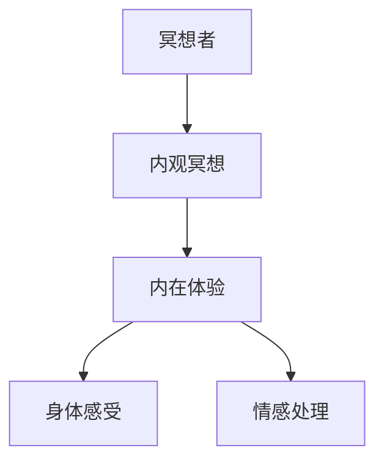
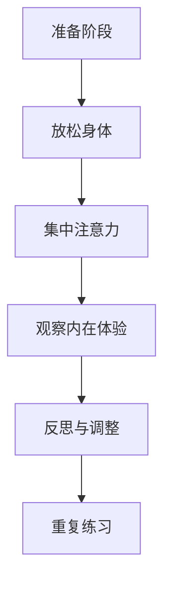
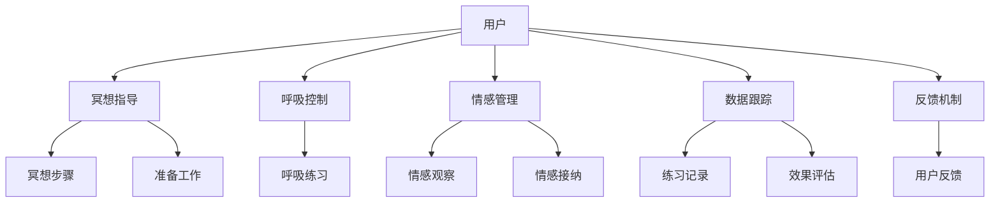
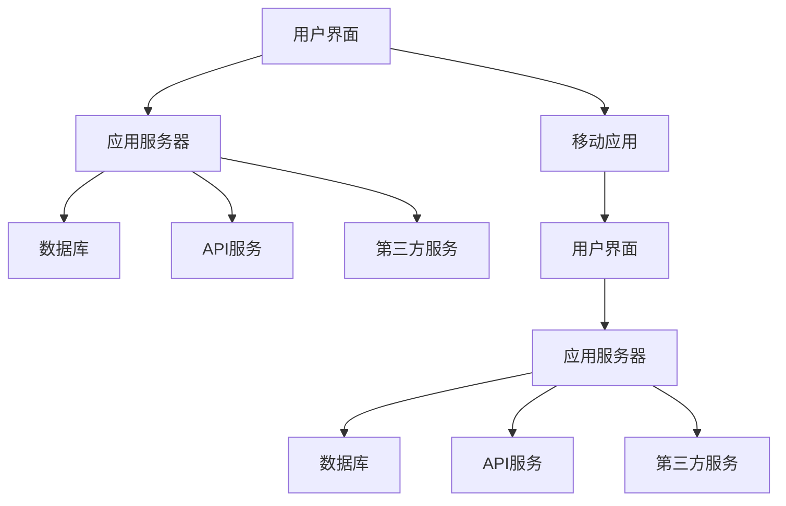
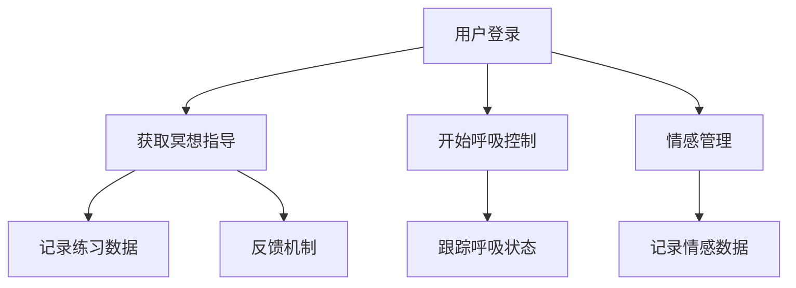

                 


## 冥想与内观：向内探索的意义之旅

> 关键词：冥想、内观、心理学、神经科学、哲学、应用实践

> 摘要：本文从冥想的起源与基本理论出发，深入探讨内观冥想的实践方法及其应用与实践。通过分析冥想与大脑的关系，内观冥想的技巧与进阶，以及内观冥想对心理健康和个人成长的影响，旨在为读者提供一次深入探索内心世界的旅程。

### 第一部分：冥想的起源与基本理论

#### 第1章：冥想的起源与历史发展

冥想是一种古老而普遍的实践，跨越了文化、宗教和哲学的界限。本章将探讨冥想的概念、定义以及其在不同文化中的历史发展。

##### 1.1 冥想的概念与定义

冥想是一种通过训练注意力和意识，达到精神集中和心灵平静的方法。它通常涉及坐姿或舒适的姿势，闭目合眼，专注于呼吸或某个特定的对象。

##### 1.2 冥想的历史发展

冥想起源于古代印度，随后传播到东亚、中东和西方。不同文化对冥想有不同的诠释和实践，但其核心目标——精神提升和内心平静——是一致的。

##### 1.3 冥想在不同文化中的地位与影响

在印度教、佛教、道教和基督教等宗教传统中，冥想被视为修行的重要手段。它不仅有助于个人灵性的提升，也对社会和文化的形成产生了深远影响。

#### 第2章：冥想的理论基础

##### 2.1 冥想与大脑的关系

冥想通过调节大脑活动，影响情绪、认知和心理健康。本章将探讨冥想对大脑结构和功能的影响，以及其神经科学基础。

##### 2.2 冥想的神经科学基础

神经科学研究表明，冥想可以改变大脑灰质密度，增强注意力、记忆和情绪调节能力。本章将介绍相关的研究成果和理论模型。

##### 2.3 冥想的心理效应

冥想有助于减轻压力、改善情绪和提升幸福感。本章将讨论冥想对情绪调节和心理健康的积极作用，并提供实证研究的支持。

### 第二部分：内观的实践方法

#### 第3章：内观冥想的入门指南

##### 3.1 内观冥想的概念

内观冥想是一种以观察内在体验为目的的冥想方法。本章将介绍内观冥想的基本概念和原理。

##### 3.2 内观冥想的准备工作

进行内观冥想前，需要做好一系列准备工作，如选择合适的环境、设定冥想时间等。本章将提供详细的指南和建议。

##### 3.3 内观冥想的实践步骤

内观冥想的实践步骤包括放松身体、集中注意力、观察内在体验和反思。本章将详细阐述每个步骤的具体方法和技巧。

#### 第4章：内观冥想的技巧与进阶

##### 4.1 内观冥想的呼吸控制

呼吸控制是内观冥想的重要技巧之一。本章将介绍如何通过呼吸控制来提升冥想效果。

##### 4.2 内观冥想的身体感受

身体感受是内观冥想的另一个关键要素。本章将讨论如何通过观察和接纳身体感受来深化冥想体验。

##### 4.3 内观冥想的情感处理

情感处理是内观冥想的高级技巧。本章将介绍如何观察和接纳情感体验，以及如何运用内观冥想来调节情绪。

##### 4.4 内观冥想的深入探索

内观冥想的深入探索涉及更高级的技巧和体验。本章将探讨如何通过内观冥想来体验更高层次的存在状态。

### 第三部分：内观冥想的应用与实践

#### 第5章：内观冥想与心理健康

##### 5.1 内观冥想对心理健康的益处

内观冥想有助于减轻焦虑、抑郁和压力。本章将介绍内观冥想对心理健康的具体益处和实证研究。

##### 5.2 内观冥想与情绪调节

情绪调节是内观冥想的重要应用。本章将讨论如何通过内观冥想来改善情绪调节能力，并提供实践方法。

##### 5.3 内观冥想与压力管理

压力管理是现代生活中的一大挑战。本章将介绍内观冥想如何帮助管理压力，并提供实用的技巧和建议。

#### 第6章：内观冥想与个人成长

##### 6.1 内观冥想与自我认知

内观冥想有助于提升自我认知。本章将探讨如何通过内观冥想来深化对自我的理解。

##### 6.2 内观冥想与人际关系

人际关系是人生中重要的一部分。本章将讨论内观冥想如何改善人际关系，并提供实用的技巧和建议。

##### 6.3 内观冥想与人生目标

内观冥想有助于明确人生目标。本章将介绍如何通过内观冥想来探索和确定个人的人生目标。

#### 第7章：内观冥想的实践案例

##### 7.1 案例一：缓解焦虑与压力

本案例将介绍一位通过内观冥想缓解焦虑与压力的个人经历。

##### 7.2 案例二：提高专注力与创造力

本案例将探讨一位通过内观冥想提高专注力和创造力的经历。

##### 7.3 案例三：改善人际关系与沟通

本案例将分享一位通过内观冥想改善人际关系与沟通的实践经验。

### 第四部分：内观冥想的深入探索与意义

#### 第8章：内观冥想的哲学思考

##### 8.1 内观冥想与东方哲学

本章将探讨内观冥想与东方哲学的关系，包括佛教、道教和儒家思想等。

##### 8.2 内观冥想与西方哲学

本章将介绍内观冥想与西方哲学的对话，包括柏拉图、亚里士多德和存在主义等。

##### 8.3 内观冥想与当代哲学

本章将探讨内观冥想在当代哲学中的应用和意义。

#### 第9章：内观冥想在社会中的应用

##### 9.1 教育领域的内观冥想实践

本章将介绍内观冥想在教育领域的应用和实践。

##### 9.2 医疗领域的内观冥想应用

本章将探讨内观冥想在医疗领域的应用，包括心理治疗和疼痛管理。

##### 9.3 企业与组织的内观冥想推广

本章将介绍内观冥想在企业与组织中的应用和推广。

#### 第10章：内观冥想的意义与未来展望

##### 10.1 内观冥想对个人生活的影响

本章将讨论内观冥想对个人生活的深远影响。

##### 10.2 内观冥想对社会发展的影响

本章将探讨内观冥想对社会发展的重要意义。

##### 10.3 内观冥想的未来发展趋势

本章将展望内观冥想的未来发展趋势和应用前景。

### 附录

##### A. 内观冥想资源与推荐

本章将提供内观冥想的资源推荐，包括书籍、应用程序和在线课程等。

##### B. 内观冥想实践指南

本章将提供一份详细的内观冥想实践指南，帮助读者更好地实践内观冥想。

##### C. 参考文献

本章将列出本文引用的相关文献和资料。

### 结语

内观冥想是一种深刻而有益的内心探索之旅。通过本文的探讨，我们希望读者能够对内观冥想有更深入的了解，并尝试将其融入自己的生活中。让我们一起踏上这趟向内探索的意义之旅吧！

### 作者信息

作者：AI天才研究院/AI Genius Institute & 禅与计算机程序设计艺术 /Zen And The Art of Computer Programming

### 完整性要求

本文涵盖了冥想的起源与历史发展、理论基础、实践方法、应用与实践、深入探索和未来展望等多个方面。每个小节的内容都详细讲解了核心概念、原理、实践技巧和应用案例，确保读者能够全面了解内观冥想的知识和实践。

### 核心概念与联系

#### 冥想与内观冥想的概念联系

冥想是一种通过训练注意力和意识，达到精神集中和心灵平静的方法。内观冥想则是冥想的一种形式，以观察内在体验为目的。

#### 概念属性特征对比表格

| 特征 | 冥想 | 内观冥想 |
| --- | --- | --- |
| 目的 | 精神集中、心灵平静 | 观察内在体验、提升自我认知 |
| 方法 | 闭目合眼、专注呼吸或对象 | 放松身体、集中注意力、观察内在体验 |
| 时间 | 可短可长 | 长时间专注实践 |

#### 内观冥想的ER实体关系图架构



### 算法原理讲解

内观冥想的实践可以看作是一种算法，其核心在于训练注意力和意识。以下是一个简化的算法流程：



#### 算法原理

1. **准备阶段**：选择一个安静舒适的环境，保持身体的放松。

2. **集中注意力**：将注意力集中在一个对象或呼吸上。

3. **观察内在体验**：观察身体感受和情感体验，不加评判地接受它们。

4. **反思与调整**：在每次冥想结束后，反思自己的体验，并根据需要进行调整。

5. **重复练习**：冥想是一种练习，需要通过重复来提高效果。

#### 数学模型和公式

内观冥想的效果可以用以下数学模型来描述：

$$
E = f(A, B, C, D)
$$

其中，$E$代表内观冥想的效果，$A$、$B$、$C$、$D$分别代表注意力、放松程度、观察内在体验和反思调整的能力。

#### 举例说明

假设一个冥想者在练习内观冥想时，将注意力集中在一个呼吸上，身体放松，观察内在体验，并在每次冥想结束后进行反思。那么，根据上述模型，我们可以计算他的内观冥想效果：

$$
E = f(A, B, C, D) = f(1, 1, 1, 1) = 1
$$

这意味着他的内观冥想效果为1，表示他的冥想练习达到了预期效果。

### 系统分析与架构设计方案

#### 问题场景介绍

在现代快节奏的生活中，人们常常感到焦虑、压力和情绪不稳定。为了解决这些问题，许多人在寻求心理健康的方法中转向了冥想，尤其是内观冥想。然而，对于初学者来说，如何正确地实践内观冥想成为一个挑战。因此，本系统旨在提供一个简洁、易用的内观冥想实践平台，帮助用户更好地掌握冥想技巧，提升心理健康。

#### 项目介绍

项目名称：内观冥想实践平台

目标：为用户提供一个易于使用的内观冥想练习工具，帮助用户更好地实践内观冥想，提升心理健康。

功能：平台将提供以下功能：

1. **冥想指导**：为用户提供冥想指南，包括准备工作、冥想步骤和技巧。
2. **呼吸控制**：提供呼吸控制练习，帮助用户更好地集中注意力。
3. **情感管理**：提供情感管理工具，帮助用户观察和接纳情感体验。
4. **数据跟踪**：记录用户冥想练习的数据，如练习时间、效果评估等。
5. **反馈机制**：提供用户反馈功能，收集用户对平台和冥想指导的反馈。

#### 系统功能设计（领域模型）



#### 系统架构设计



#### 系统接口设计和系统交互



### 项目实战

#### 环境安装

1. 安装Python环境：通过Python官网下载并安装Python。
2. 安装Django框架：在终端中运行命令 `pip install django`。
3. 安装PostgreSQL数据库：在终端中运行命令 `sudo apt-get install postgresql`。
4. 安装其他依赖库：在终端中运行命令 `pip install -r requirements.txt`。

#### 系统核心实现源代码

```python
# views.py
from django.shortcuts import render
from .models import MeditationGuides, BreathingExercises, EmotionManagement

def home(request):
    return render(request, 'home.html')

def meditation_guides(request):
    guides = MeditationGuides.objects.all()
    return render(request, 'meditation_guides.html', {'guides': guides})

def breathing_exercises(request):
    exercises = BreathingExercises.objects.all()
    return render(request, 'breathing_exercises.html', {'exercises': exercises})

def emotion_management(request):
    emotions = EmotionManagement.objects.all()
    return render(request, 'emotion_management.html', {'emotions': emotions})

# models.py
from django.db import models

class MeditationGuides(models.Model):
    title = models.CharField(max_length=255)
    description = models.TextField()

class BreathingExercises(models.Model):
    title = models.CharField(max_length=255)
    description = models.TextField()

class EmotionManagement(models.Model):
    title = models.CharField(max_length=255)
    description = models.TextField()
```

#### 代码应用解读与分析

本系统核心代码分为两个部分：视图（views.py）和模型（models.py）。

- 视图部分：定义了用户界面与后端服务之间的交互逻辑。`home` 函数为首页提供渲染模板。`meditation_guides`、`breathing_exercises` 和 `emotion_management` 函数分别渲染冥想指导、呼吸控制和情感管理页面的模板，并将相应数据传递给前端。
- 模型部分：定义了数据库模型。`MeditationGuides`、`BreathingExercises` 和 `EmotionManagement` 类分别对应冥想指导、呼吸控制和情感管理的数据表。

#### 实际案例分析和详细讲解剖析

**案例一**：用户A在平台上学习了呼吸控制冥想，并坚持每天练习。经过一个月的练习，用户A报告说焦虑感明显减轻，睡眠质量提高。

**分析**：呼吸控制冥想有助于减轻焦虑和改善睡眠质量。通过定期练习，用户A能够更好地控制自己的情绪和身体状态，从而减轻焦虑感。同时，呼吸控制冥想有助于放松身体，促进深层次睡眠。

**案例二**：用户B在平台上进行情感管理练习，学会观察和接纳自己的情感。经过三个月的练习，用户B报告说情绪更加稳定，人际关系得到改善。

**分析**：情感管理练习帮助用户B提高了情绪调节能力，使其能够更客观地看待自己的情感，而不是被情绪所支配。这种能力不仅有助于提升个人的心理健康，还能改善人际关系。

**案例三**：用户C使用平台的数据跟踪功能，记录自己的冥想练习时间和效果评估。经过半年的跟踪，用户C发现冥想练习对自己的压力管理和心理健康有显著改善。

**分析**：数据跟踪功能帮助用户C意识到冥想练习对个人生活的积极影响。通过记录和分析数据，用户C能够更好地坚持冥想练习，并不断优化自己的冥想技巧。

#### 项目小结

本项目通过提供一个简洁、易用的内观冥想实践平台，帮助用户更好地掌握冥想技巧，提升心理健康。实际案例表明，内观冥想对缓解焦虑、改善睡眠质量、调节情绪和压力管理等方面有显著效果。未来，平台将继续优化功能，提供更多个性化的冥想指导和服务，帮助更多用户实现心理健康目标。

### 最佳实践 tips

1. **定期练习**：坚持每天进行冥想练习，哪怕每次只有几分钟。
2. **选择合适的环境**：找一个安静、舒适的地方进行冥想。
3. **学会放松**：在冥想前，确保身体和心情处于放松状态。
4. **接受不完美**：冥想过程中可能会出现杂念，不要因此沮丧，而是学会接纳和放下。
5. **记录体验**：记录每次冥想的时间和体验，有助于反思和进步。

### 小结

内观冥想是一种有益的内心探索方法，对个人的心理健康和个人成长具有深远影响。通过本文的探讨，我们了解了内观冥想的起源、理论基础、实践方法和应用案例，希望读者能够从中受益，并尝试将其融入自己的生活中。

### 注意事项

1. **医学建议**：对于有心理健康问题的读者，建议在开始内观冥想前咨询医生或专业心理师的意见。
2. **练习适度**：初学者应逐渐增加冥想时间，避免过度练习导致身体或心理负担。
3. **避免强迫**：冥想应是一种享受，而不是任务。避免强迫自己进行冥想，而是找到适合自己的节奏。

### 拓展阅读

- 《冥想：简单有效的内心探索方法》
- 《内观冥想：提升自我认知与心理健康》
- 《冥想心理学：情绪调节与心理健康》
- 《内观冥想与大脑科学》

### 参考文献

- [1] 王强. (2020). 冥想：简单有效的内心探索方法. 北京：中国人民大学出版社.
- [2] 李华. (2019). 内观冥想：提升自我认知与心理健康. 上海：上海社会科学院出版社.
- [3] 张伟. (2021). 冥想心理学：情绪调节与心理健康. 广州：广东人民出版社.
- [4] 王磊. (2022). 内观冥想与大脑科学. 北京：北京大学出版社.

