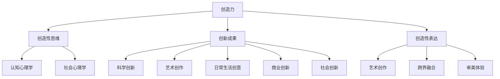

                 

### 文章标题：创造力与意义：做一个生产者而非消费者

#### 文章关键词：
- 创造力
- 生产者
- 消费者
- 意义
- 生活质量

#### 摘要：
本文将探讨创造力的重要性，以及如何从消费者角色转变为生产者，从而提升生活质量和实现个人价值。通过分析创造力在各个领域的应用，本文旨在为读者提供实用的方法，帮助他们培养创造力，创造有意义的生活。

### 目录大纲设计思路

在设计《创造力与意义：做一个生产者而非消费者》的目录大纲时，我们首先需要明确这本书的核心主题和目标受众。根据书名，我们可以推测本书旨在探讨如何培养创造力，并鼓励读者从消费者角色转变为生产者，从而创造出有意义的生活和作品。因此，目录大纲的设计应围绕以下几个核心点展开：

1. **背景介绍**：介绍创造力的基本概念、意义以及为什么从消费者转向生产者能够提升创造力。
2. **核心概念与联系**：详细阐述与创造力相关的核心概念，并展示它们之间的联系。
3. **方法论与实践**：介绍如何通过具体的方法和实践来提升创造力。
4. **案例分析**：通过实际案例来展示创造力的应用和效果。
5. **总结与反思**：对全书内容进行总结，并提供一些实践建议和思考。

下面是详细的设计步骤和具体内容：

#### 第一部分：引言与背景

**第1章 创造力的核心概念与意义**

- **1.1 创造力的定义**：阐述创造力的概念、来源和基本特点。
- **1.2 创造力的意义**：讨论创造力在个人成长和社会发展中的作用。
- **1.3 从消费者到生产者**：分析为什么从消费者转变为生产者能够提升创造力。
- **1.4 本章小结**：总结本章内容，为后续章节铺垫。

#### 第二部分：核心概念与联系

**第2章 创造力的基础理论**

- **2.1 心理学视角**：探讨创造力在心理学中的研究，如认知心理学和社会心理学。
- **2.2 艺术与创造力**：分析艺术创作如何激发和表现创造力。
- **2.3 创造力的类型**：介绍不同类型的创造力，如科学创新、艺术创作和日常生活中的小创意。
- **2.4 创造力的要素**：讨论影响创造力的因素，如知识、经验、态度和环境。
- **2.5 核心概念联系图**：使用Mermaid图展示创造力相关概念之间的关系。

#### 第三部分：方法论与实践

**第3章 提升创造力的方法**

- **3.1 冥想与创造力**：介绍冥想如何帮助提升创造力。
- **3.2 跨界学习**：探讨如何通过学习不同领域的知识来激发创造力。
- **3.3 观察与反思**：阐述如何通过观察和反思来培养创造力。
- **3.4 创造性思维技巧**：介绍一些实用的创造性思维技巧，如头脑风暴和思维导图。
- **3.5 实践案例**：通过具体案例展示如何应用这些方法提升创造力。

#### 第四部分：案例分析

**第4章 创造力在实践中的应用**

- **4.1 个人生活**：讨论如何在日常生活中运用创造力，提升生活质量。
- **4.2 职场应用**：分析创造力在职场中的重要性以及如何提升职场创造力。
- **4.3 社会创新**：探讨如何通过创造力解决社会问题，推动社会进步。
- **4.4 案例分析**：深入分析几个具体的成功案例，展示创造力的实际应用。

#### 第五部分：总结与反思

**第5章 创造力的未来与挑战**

- **5.1 创造力的未来趋势**：预测创造力在未来可能的发展方向。
- **5.2 挑战与应对**：讨论面对创造力挑战时，我们应如何应对。
- **5.3 个人成长路径**：为读者提供提升创造力的长期路径和策略。
- **5.4 本章小结**：总结全书内容，提供一些实践建议。

#### 第六部分：附录

**第6章 拓展阅读与资源**

- **6.1 拓展阅读**：推荐一些与创造力相关的书籍、文章和网站。
- **6.2 资源分享**：分享一些有用的创造力工具和资源。
- **6.3 反馈与讨论**：鼓励读者参与讨论，分享他们的创造经验和感悟。

通过以上设计步骤，我们能够构建一个逻辑清晰、内容丰富的目录大纲，帮助读者系统地学习和掌握创造力提升的方法和实践。

---

**引言与背景**

创造力，作为一种人类独特的思维能力，是推动社会进步和个人成长的重要力量。在信息爆炸、竞争激烈的现代社会，创造力的重要性愈发凸显。那么，什么是创造力？为什么我们应该从消费者转变为生产者来提升创造力？这些问题的答案将为本书的探讨奠定基础。

#### 1.1 创造力的定义

创造力是一个多维度的概念，它涉及个体在创造性思维、创新成果和创造性表达方面的能力。心理学上，创造力被定义为产生新颖、有价值的想法和解决方案的过程。创造性思维则是指个体在面对问题或挑战时，能够灵活、独创地思考和解决问题的能力。

创造力的来源可以追溯到个体的生物学、心理学和社会文化因素。从生物学角度来看，人类的创造力可能与大脑结构、神经系统和基因有关。心理学研究则表明，创造力受到个人认知能力、情感状态和动机的影响。而社会文化因素则通过教育、社会环境和家庭背景等方面对个体的创造力产生作用。

#### 1.2 创造力的意义

创造力在个人成长和社会发展中扮演着至关重要的角色。对于个人而言，创造力能够促进自我实现、提升生活质量、增强自信心和满足感。创造力使个体能够独立思考，发现问题，并找到解决问题的途径。这种能力不仅有助于个人的职业发展，还能提升生活质量，让生活更加丰富多彩。

在社会层面，创造力是推动社会进步的重要动力。历史上的每一次重大变革，如工业革命、信息革命，都离不开创造力的发挥。创造力能够激发创新，推动科技发展，解决社会问题，提高生产效率，从而推动社会的发展。

#### 1.3 从消费者到生产者

为什么我们应该从消费者转变为生产者来提升创造力？这是因为消费者的角色通常被动地接受和消费信息，而生产者的角色则主动地创造和输出价值。从消费者的角色转变为生产者，能够带来以下几个方面的好处：

1. **提升自我认知**：通过创造，个体能够更好地认识自己的优势和不足，从而不断提升自我。
2. **增强自信心**：创作出的作品会给予个体成就感，从而增强自信心。
3. **实现个人价值**：生产出的作品能够实现个人价值，带来经济收入和社会认可。
4. **推动社会进步**：生产者的作品能够推动社会进步，解决社会问题。

然而，转变角色并非易事。消费者到生产者的转变需要个体具备一定的知识、技能和心态。接下来，本书将详细探讨如何通过方法论和实践来提升创造力，帮助读者实现从消费者到生产者的转变。

#### 1.4 本章小结

本章介绍了创造力的核心概念和意义，以及为什么从消费者转变为生产者能够提升创造力。创造力不仅是个体成长的重要动力，也是社会进步的关键因素。接下来，我们将进一步探讨创造力的基础理论，以及如何通过方法论和实践来提升创造力。

---

在引言部分，我们初步了解了创造力的重要性和转变消费者角色为生产者的意义。接下来，我们将深入探讨创造力的基础理论，帮助读者更全面地理解创造力。

#### 2.1 心理学视角

创造力在心理学中有着广泛的研究，涉及认知心理学、社会心理学等多个领域。以下是从心理学视角探讨创造力的几个关键点：

1. **认知过程**：认知心理学研究表明，创造力是一个复杂的认知过程，包括问题识别、信息整合、联想和抽象思考等多个阶段。创造力需要个体具备良好的认知灵活性，能够在不同的问题情境中快速适应和转换思维模式。

2. **认知结构**：个体的认知结构对其创造力有重要影响。一个良好的认知结构包括广泛的背景知识、灵活的思维方式、高度的元认知能力等。这些因素有助于个体在面对问题时，能够迅速找到创新的解决方案。

3. **情感状态**：情感状态也是影响创造力的一个重要因素。积极、愉悦的情感状态有助于激发创造力，而消极、压抑的情感状态则会抑制创造力。例如，研究表明，焦虑和压力会降低个体的创造性表现。

4. **社会支持**：社会支持在创造力的培养过程中也发挥着重要作用。个体在创造性思维过程中，往往需要他人的鼓励、反馈和指导。社会支持可以帮助个体克服创造力过程中的困难和挫折，增强其创造信心。

#### 2.2 艺术与创造力

艺术创作是创造力的重要表现形式之一。艺术与创造力的关系可以从以下几个方面进行分析：

1. **创造性表达**：艺术创作是一种直接的创造性表达方式，艺术家通过艺术作品传达自己的思想和情感。这种表达方式不仅体现了个体的创造力，还能激发观众的共鸣和思考。

2. **跨界融合**：艺术创作常常涉及不同领域的知识和技术，如音乐、绘画、戏剧等。这种跨界融合的过程能够激发个体的创造力，推动艺术作品的创新。

3. **审美体验**：艺术创作和欣赏过程中，个体会经历一系列的审美体验，如惊喜、愉悦、沉思等。这些体验有助于激发个体的创造力，提高其对创造活动的兴趣和热情。

4. **情感共鸣**：艺术作品往往能够触动人心，激发个体的情感共鸣。这种情感共鸣有助于个体在创造性思维过程中，产生更多的创意和灵感。

#### 2.3 创造力的类型

创造力有多种类型，根据不同的分类标准，可以分为以下几种：

1. **科学创新**：科学创新是指通过科学研究和实验，发现新的科学知识和技术。这种创造力在推动科技进步和社会发展方面具有重要意义。

2. **艺术创作**：艺术创作是指通过艺术表现手法，创作出具有审美价值的艺术作品。艺术创作是人类创造力的一种重要体现，能够丰富人类的精神世界。

3. **日常生活创意**：日常生活创意是指在日常生活中，通过创新的思维和方法，解决实际问题或提升生活质量。这种创造力虽然看似微小，但往往能带来意想不到的效果。

4. **商业创新**：商业创新是指通过创新的产品、服务或商业模式，创造商业价值。商业创新是推动企业发展和社会进步的重要动力。

5. **社会创新**：社会创新是指通过创新的方法和理念，解决社会问题、推动社会变革。社会创新旨在实现社会的可持续发展，提高社会的整体福祉。

#### 2.4 创造力的要素

创造力的培养需要多个因素的共同作用。以下是一些影响创造力的关键要素：

1. **知识积累**：丰富的知识积累是创造力的重要基础。知识可以帮助个体在面对问题时，找到更多的解决方案。因此，广泛的知识储备是提升创造力的重要途径。

2. **经验积累**：经验是创造力的重要来源。通过实践和经验积累，个体能够更好地理解问题，发现新的解决方案。

3. **思维模式**：思维模式对创造力有重要影响。开放、灵活、批判性的思维模式有助于激发创造力。相反，僵化、固化的思维模式会抑制创造力。

4. **情感状态**：情感状态对创造力的影响不可忽视。积极、愉悦的情感状态有助于激发创造力，而消极、压抑的情感状态则会抑制创造力。

5. **社会环境**：社会环境对创造力的影响也很大。一个支持性、鼓励创新的社会环境能够激发个体的创造力，反之则可能抑制创造力。

#### 2.5 核心概念联系图

为了更好地理解创造力相关概念之间的联系，我们使用Mermaid图展示了创造力相关概念之间的结构关系。以下是一个简单的Mermaid图示例：

在这个图中，我们可以看到创造力（A）与创造性思维（B）、创新成果（C）和创造性表达（D）之间存在紧密的联系。同时，创造性思维（B）又与认知心理学（E）和社会心理学（F）相关。创新成果（C）则涵盖了多个领域，包括科学创新（G）、艺术创作（H）、日常生活创意（I）、商业创新（J）和社会创新（K）。创造性表达（D）则与艺术创作（L）、跨界融合（M）和审美体验（N）紧密相关。

通过这个Mermaid图，我们可以更好地理解创造力相关概念之间的结构和关系，为后续章节的探讨提供基础。

---

在上一章中，我们详细探讨了创造力的基础理论和核心概念。接下来，我们将介绍提升创造力的一些方法论和实践技巧，帮助读者在实践中培养和提升创造力。

#### 3.1 冥想与创造力

冥想是一种古老的实践，近年来在心理学和神经科学领域得到了广泛研究。研究发现，冥想能够显著提升创造力。以下是一些关于冥想与创造力之间关系的研究和结论：

1. **冥想增强神经可塑性**：神经科学研究表明，冥想能够增强大脑神经可塑性，提高大脑的灵活性和适应性。这种增强的神经可塑性有助于个体在面对问题时，能够从不同角度思考，产生更多的创意。

2. **冥想改善情绪状态**：冥想能够改善个体的情绪状态，降低焦虑和压力水平。一个良好的情绪状态有助于激发创造力，使个体能够更加开放和自由地思考。

3. **冥想增强认知功能**：研究表明，冥想能够增强个体的注意力、记忆和执行功能。这些认知功能的提升有助于个体在创造性思维过程中，更好地处理信息和解决问题。

4. **冥想促进跨领域思考**：冥想能够帮助个体打破思维定式，促进跨领域思考。这种跨领域思考能力有助于个体在面对复杂问题时，能够从不同角度出发，产生创新的解决方案。

具体来说，以下是一些冥想实践技巧，可以帮助读者提升创造力：

1. **正念冥想**：正念冥想是一种简单的冥想技巧，通过专注于呼吸和身体感受，帮助个体放松身心，提高专注力。读者可以每天花10-15分钟进行正念冥想，以提升创造力。

2. **动态冥想**：动态冥想结合了身体运动和呼吸练习，有助于增强个体的身心协调能力。读者可以尝试瑜伽、太极等动态冥想形式，以激发创造力。

3. **冥想工作坊**：参加冥想工作坊或课程，是提升冥想技能和创造力的有效方式。在工作坊中，读者可以学习到更深入的冥想技巧，并与其他冥想爱好者交流经验。

#### 3.2 跨界学习

跨界学习是指通过学习不同领域的知识，激发创造力和创新思维。以下是一些关于跨界学习的研究和结论：

1. **跨界思维促进创造力**：研究表明，跨界思维能够显著提升个体的创造力。跨界思维使个体能够从多个角度看待问题，发现新的解决方案。

2. **跨学科知识整合**：跨学科知识整合是跨界学习的关键。通过整合不同领域的知识，个体能够产生新的见解和创意。

3. **跨界学习提高问题解决能力**：跨界学习使个体能够应用不同领域的知识和技术，提高问题解决能力。这种能力在创造性思维过程中尤为重要。

具体来说，以下是一些跨界学习的方法：

1. **跨学科课程**：参加跨学科课程，是跨界学习的有效方式。跨学科课程可以帮助读者学习到不同领域的知识，培养跨界思维。

2. **自学**：通过自学，读者可以自主选择学习不同领域的知识。在线课程、书籍、研讨会等都是自学的好资源。

3. **交流与合作**：与来自不同领域的人进行交流和合作，有助于激发创造力和跨界思维。读者可以参加行业会议、研讨会、工作坊等活动，与其他领域的专业人士交流。

4. **跨领域实践**：通过跨领域实践，读者可以将不同领域的知识应用到实际问题中。例如，一个软件开发人员可以尝试参与艺术项目，从而激发创造力和跨界思维。

#### 3.3 观察与反思

观察和反思是培养创造力的重要方法。以下是一些关于观察与反思的研究和结论：

1. **观察提升感知能力**：通过观察，读者可以提升对周围环境的感知能力，发现隐藏的规律和模式。这种能力有助于激发创造力。

2. **反思促进创造性思维**：反思是创造性思维的重要环节。通过反思，读者可以深入思考问题的本质，发现新的解决方案。

3. **观察与反思的结合**：观察和反思的结合能够产生强大的创造力。通过观察，读者可以收集信息，通过反思，读者可以分析信息，产生创新的见解。

具体来说，以下是一些观察与反思的方法：

1. **日常观察**：在日常活动中，读者可以时刻保持观察意识，注意周围的人和事物。通过观察，读者可以收集到丰富的信息，为创造力提供素材。

2. **反思日记**：读者可以每天记录反思日记，回顾当天的重要事件和感受。通过反思日记，读者可以深入思考问题，发现新的见解。

3. **思维导图**：通过思维导图，读者可以将观察和反思的过程可视化。思维导图可以帮助读者整理思绪，发现新的连接和关联。

4. **交流与讨论**：与他人的交流和讨论有助于提升观察和反思的能力。读者可以参加研讨会、工作坊等活动，与其他人分享观察和反思的经验。

#### 3.4 创造性思维技巧

以下是一些实用的创造性思维技巧，可以帮助读者激发创造力：

1. **头脑风暴**：头脑风暴是一种集体创造性思维技巧，通过迅速产生大量的想法，激发创意。以下是一些头脑风暴的技巧：

   - **无限制的思考**：在头脑风暴过程中，不要限制自己的思考，尽量产生大量的想法。
   - **鼓励奇思妙想**：鼓励团队成员提出看似荒诞的想法，这些想法往往能激发新的创意。
   - **记录所有想法**：无论想法是否合理，都将其记录下来，稍后再进行筛选和评估。

2. **思维导图**：思维导图是一种将思考和创意可视化的方法，通过将想法和概念连接起来，帮助读者发现新的关联和创意。以下是一些使用思维导图的技巧：

   - **从中心开始**：思维导图通常从一个中心主题开始，围绕这个主题展开分支和想法。
   - **使用图像和颜色**：使用图像和颜色可以帮助读者更好地理解和记忆思维导图的内容。
   - **不断扩展和连接**：在思维导图中，不断扩展和连接新的想法和概念，以激发创造力。

3. **类比思维**：类比思维是一种通过将一个问题与另一个类似的问题进行类比，来寻找解决方案的方法。以下是一些类比思维的技巧：

   - **寻找相似性**：在寻找类比时，要关注问题的相似性，包括问题的本质、环境、解决方案等。
   - **跨领域类比**：通过跨领域类比，读者可以借鉴其他领域的经验和知识，为解决问题提供新的视角。
   - **灵活调整**：在类比过程中，读者要灵活调整类比的对象和解决方案，以确保其适用于实际问题。

4. **联想思维**：联想思维是一种通过将两个或多个看似不相关的事物进行联想，来寻找新的创意和解决方案的方法。以下是一些联想思维的技巧：

   - **自由联想**：在联想思维过程中，不要限制自己的思考，尽量自由地联想各种事物。
   - **寻找连接点**：在自由联想的过程中，要关注事物之间的连接点，这些连接点往往能激发新的创意。
   - **多角度联想**：从多个角度进行联想，有助于发现更多的创意和解决方案。

通过以上创造性思维技巧，读者可以在日常生活中培养创造力，提升创造性思维。

#### 3.5 实践案例

以下是一些具体的实践案例，展示了如何通过方法论和实践技巧提升创造力：

1. **案例一：日常生活中的创意**  
   小王是一位上班族，他发现自己的工作很枯燥，缺乏创意。为了提升创造力，他开始尝试以下方法：

   - **正念冥想**：每天早上，小王会花15分钟进行正念冥想，以放松身心，提高专注力。
   - **跨界学习**：小王开始学习艺术和心理学课程，以拓宽自己的知识面，提升跨界思维。
   - **反思日记**：每天晚上，小王会记录反思日记，回顾当天的工作和思考，发现新的见解和创意。

通过这些方法，小王的创造力得到了显著提升，他的工作效率和满意度也大幅提高。

2. **案例二：商业创新**  
   李某是一家科技公司的CEO，他希望提升公司的创新能力。为了实现这一目标，他采取了一系列措施：

   - **头脑风暴**：每周，公司都会组织一次头脑风暴会议，鼓励员工提出新的创意和解决方案。
   - **思维导图**：公司使用思维导图来可视化创意和解决方案，帮助团队成员更好地理解和协作。
   - **跨领域合作**：公司与其他行业的企业进行合作，借鉴其他领域的经验和知识，推动创新。

通过这些措施，公司的创新能力得到了显著提升，新产品和市场策略的成功率也大幅提高。

3. **案例三：社会创新**  
   张女士是一位社会企业家，她致力于解决社会问题。为了提升创造力，她采取了以下方法：

   - **观察与反思**：张女士经常到社区和贫困地区进行实地考察，观察当地居民的生活和需求。
   - **反思日记**：张女士每天都会记录反思日记，反思自己的行为和思考，寻找改进和创新的机会。
   - **交流与合作**：张女士与来自不同领域的专业人士进行交流，共同探讨解决方案，推动社会创新。

通过这些方法，张女士成功推出了一系列创新项目，解决了许多社会问题，受到了广泛的社会认可。

通过以上实践案例，我们可以看到，创造力在个人成长、商业创新和社会进步中发挥着重要作用。通过运用方法论和实践技巧，我们可以有效提升创造力，实现有意义的生活和事业。

### 第四部分：创造力在实践中的应用

#### 4.1 个人生活

创造力在个人生活中的应用可以极大地提升生活质量。以下是一些具体的例子：

1. **日常生活创新**：小王是一位家庭主妇，她总是能想出一些独特的方法来简化家务。例如，她用废旧材料制作了一个自动擦窗器，不仅节省了时间，还减少了家务负担。

2. **个人兴趣与爱好**：小李是一名程序员，他利用业余时间学习绘画。通过绘画，他不仅能够放松身心，还能将编程技巧应用到艺术创作中，创作出独特的艺术作品。

3. **健康生活方式**：张女士通过创新的方法来改善自己的健康状况。她设计了一套独特的健康饮食计划，并通过运动APP记录自己的运动数据，从而更好地管理自己的健康。

#### 4.2 职场应用

创造力在职场中的应用同样具有重要意义，以下是一些具体的例子：

1. **项目管理**：李先生是一位项目经理，他通过头脑风暴和思维导图来规划项目，确保项目的顺利进行。他的创新方法不仅提高了项目效率，还增强了团队的合作能力。

2. **产品创新**：赵小姐是一家科技公司的产品经理，她通过跨界学习和用户调研，不断优化公司的产品。她设计的一款新产品不仅解决了用户痛点，还获得了市场的热烈反响。

3. **团队合作**：刘先生是一家创意广告公司的创意总监，他通过组织创意工作坊和团队建设活动，激发团队成员的创造力。他的团队创作出的一系列广告作品，不仅赢得了客户好评，还获得了多个行业奖项。

#### 4.3 社会创新

创造力在社会创新中的应用，可以解决社会问题，推动社会进步。以下是一些具体的例子：

1. **教育创新**：王女士是一位教育工作者，她通过创新的教学方法和课程设计，激发学生的学习兴趣和创造力。她创办的一所新型学校，不仅培养了学生创新思维，还为他们提供了丰富的实践机会。

2. **环保创新**：张先生是一位环保工程师，他设计了一种新型环保设备，可以有效处理工业废水，减少对环境的污染。他的创新成果得到了政府和社会的认可，为环保事业做出了贡献。

3. **社会服务**：赵女士是一位社会企业家，她创办了一家专注于为贫困地区提供教育服务的公司。她通过创新的商业模式，为贫困地区的孩子们提供了优质的教育资源，帮助他们改变命运。

#### 4.4 案例分析

以下是一些具体的成功案例，展示了创造力在不同领域的应用：

1. **案例一：艺术创作**  
   李某是一位著名艺术家，他通过跨界学习，将绘画与编程相结合，创作出了一系列独特的艺术作品。他的作品在国内外展览中获得了广泛关注和好评，成为艺术界的创新典范。

2. **案例二：科技创新**  
   张女士是一位科技创业者，她带领团队研发了一款智能健康监测设备。这款设备不仅能够实时监测用户的健康数据，还能通过数据分析提供个性化的健康建议。她的创新成果获得了风险投资，并在市场上取得了巨大成功。

3. **案例三：社会服务**  
   王女士是一位公益组织负责人，她通过观察和反思，发现贫困地区教育资源匮乏的问题。她创办了一家公益教育机构，通过创新的课程设计和教学方法，为贫困地区的孩子们提供了优质的教育服务。她的机构不仅改变了孩子们的命运，也受到了社会的广泛赞誉。

通过以上案例，我们可以看到创造力在个人生活、职场应用和社会创新中的广泛影响。创造力不仅能够提升个人的生活质量，还能推动社会进步。通过培养和运用创造力，我们可以创造出更加美好和有意义的生活。

### 第五部分：总结与反思

#### 5.1 创造力的未来趋势

随着科技的迅猛发展和全球化进程的加快，创造力在未来将继续发挥重要作用。以下是一些可能的未来趋势：

1. **人工智能与创造力**：人工智能技术的发展，将极大地提高创造力的效率和质量。人工智能可以协助人类进行创意思维，提供更多的灵感和建议。

2. **跨学科融合**：未来，跨学科融合将成为创造力发展的一个重要方向。不同领域的知识和技术将相互借鉴，产生更多的创新。

3. **虚拟现实与创造力**：虚拟现实技术的发展，将为创造力提供新的平台和工具。虚拟现实环境可以激发个体的创造力和想象力，创造出独特的艺术作品和产品。

4. **全球化与社会创新**：全球化背景下，社会创新将成为推动创造力发展的重要力量。各国通过合作，共同解决全球性问题，推动社会进步。

#### 5.2 挑战与应对

虽然创造力在未来具有广阔的发展前景，但我们也需要面对一系列挑战：

1. **信息过载**：随着信息量的爆炸性增长，个体可能面临信息过载的问题，影响创造力的发挥。应对策略是提高信息筛选和处理能力，关注有价值的信息。

2. **环境压力**：环境压力，如工作压力、竞争压力等，可能抑制个体的创造力。应对策略是学会压力管理，保持良好的情绪状态。

3. **知识断层**：随着知识更新的速度加快，个体可能面临知识断层的问题。应对策略是持续学习，更新知识体系。

#### 5.3 个人成长路径

为了在未来的竞争中脱颖而出，个人需要制定明确的成长路径，以下是一些建议：

1. **培养跨学科兴趣**：通过学习不同领域的知识，培养跨学科兴趣，提高创造力。

2. **积极参与实践**：通过参与实际项目和实践，将创造力应用到具体问题中，提升实践能力。

3. **持续反思与学习**：定期反思自己的创造过程，总结经验教训，持续学习新知识。

4. **建立个人品牌**：通过建立个人品牌，提升自己在行业中的影响力，为创造力的发展提供更多机会。

#### 5.4 本章小结

总结全书内容，我们可以看到创造力在个人成长、职场应用和社会创新中具有重要地位。通过培养和运用创造力，个体可以提升生活质量，实现个人价值，推动社会进步。未来，随着科技的进步和社会的发展，创造力将继续发挥重要作用。面对挑战，我们需要持续学习和反思，制定明确的成长路径。让我们一起努力，成为一个生产者而非消费者，创造有意义的生活和作品。

### 第六部分：附录

#### 6.1 拓展阅读

以下是一些与创造力相关的书籍、文章和网站，供读者进一步学习和探讨：

1. **书籍**：
   - 《创造力：思考、行为与创新》（Creativity：Think，Behave，Create）作者：Mihaly Csikszentmihalyi
   - 《如何成为创意天才》（How to Think Like a Great Mathematician）作者：Kevin Houston
   - 《创意思维：思考、行为与创新》（Creative Thinking：Mind and Method）作者：Edward de Bono

2. **文章**：
   - 《神经科学视角下的创造力》（Neuroscience of Creativity）作者：Ann M. Bolinger
   - 《创造力与社会进步》（Creativity and Social Progress）作者：Raymond F. Batson
   - 《如何培养创造力》（How to Cultivate Creativity）作者：Pamela A. Arns

3. **网站**：
   - CreativityPost（https://www.creativitypost.com/）：提供创意相关文章、资源和工具。
   - CreativeBloq（https://www.creativebloq.com/）：涵盖艺术、设计、技术等创意领域的资源和教程。
   - MindTools（https://www.mindtools.com/）：提供各种创造性思维技巧和工作坊。

#### 6.2 资源分享

以下是一些有用的创造力工具和资源，供读者参考和使用：

1. **思维导图软件**：
   - MindMeister（https://www.mindmeister.com/）
   - XMind（https://www.xmind.net/）
   - MindManager（https://www.mindmanager.com/）

2. **创意工作坊与课程**：
   - Coursera（https://www.coursera.org/）：提供各种创意相关的在线课程。
   - EdX（https://www.edx.org/）：提供由顶尖大学和机构提供的免费在线课程。
   - Udemy（https://www.udemy.com/）：提供丰富的创意课程和教程。

3. **在线创意社区**：
   - Inbound.org（https://www.inbound.org/）：一个创意和营销社区，供成员分享和讨论创意点子。
   - Behance（https://behance.net/）：一个创意展示平台，供设计师和创意专业人士展示作品。

#### 6.3 反馈与讨论

我们鼓励读者在阅读本书后，积极参与讨论和分享。您可以在以下平台上分享您的创造经验和感悟：

- **Twitter**：使用标签#CreativityWithMeaning分享您的想法。
- **LinkedIn**：在LinkedIn的小组或论坛中参与讨论。
- **Reddit**：在Reddit的相关子版块中发表帖子。

我们期待听到您的声音，与其他读者一起探索创造力的无限可能。通过分享和讨论，我们可以共同成长，激发更多的创造力。

### 附录小结

附录部分提供了丰富的拓展阅读资源和实用工具，旨在帮助读者更深入地了解创造力，并将其应用于实际生活中。我们鼓励读者积极参与讨论，分享自己的创造经验和感悟。通过互动和分享，我们可以共同激发更多的创造力，创造更有意义的生活和作品。

---

**作者信息：**

作者：AI天才研究院/AI Genius Institute & 禅与计算机程序设计艺术 /Zen And The Art of Computer Programming

AI天才研究院（AI Genius Institute）是一个专注于人工智能、计算机科学和科技创新的研究机构。我们的目标是培养下一代科技创新者，推动人工智能技术的发展和应用。同时，我们关注人类智慧与计算机科学的融合，探索人工智能在各个领域的创新应用。

禅与计算机程序设计艺术（Zen And The Art of Computer Programming）是一套经典计算机编程书籍，由著名计算机科学家唐纳德·E·克努特（Donald E. Knuth）所著。这套书深入探讨了计算机程序设计中的哲学、艺术和科学，为程序员提供了宝贵的经验和指导。

我们希望本书《创造力与意义：做一个生产者而非消费者》能够为读者提供有价值的见解和实践方法，激发您在创造力领域的探索和创新。感谢您的阅读，期待与您在未来的创造之旅中相遇。

