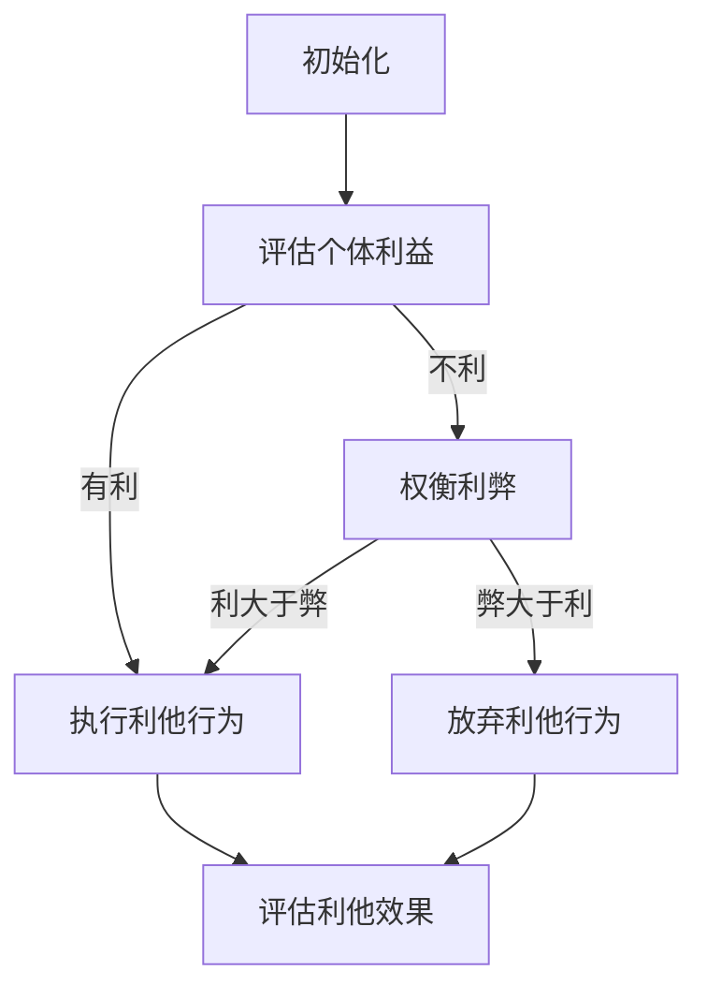
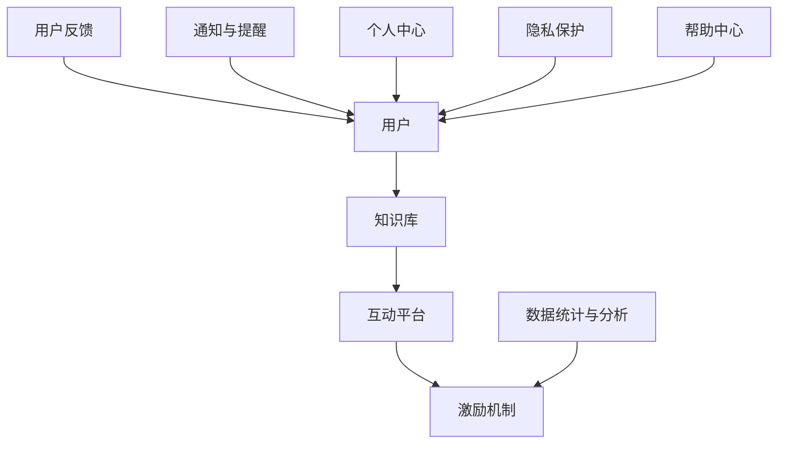
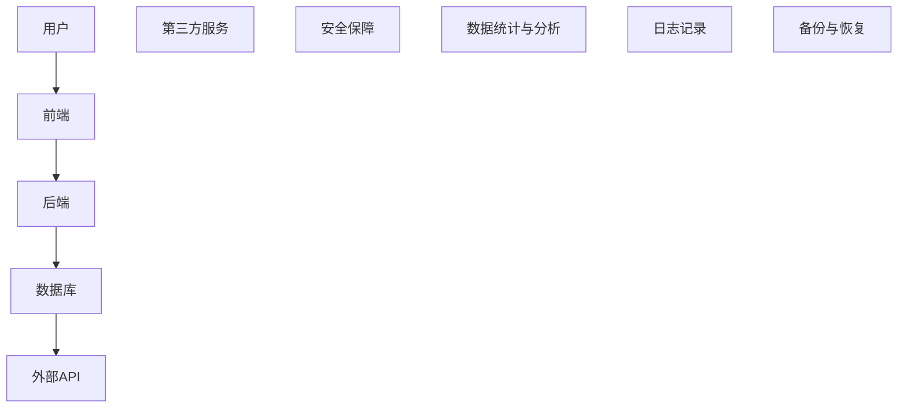
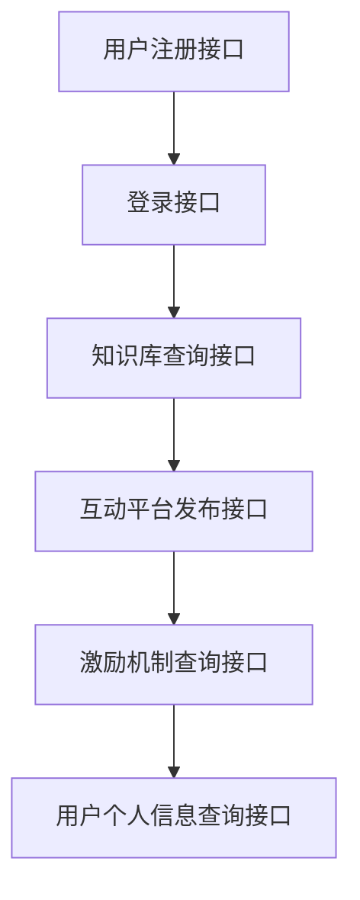
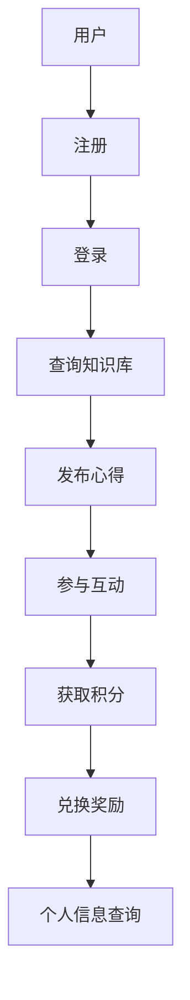

                 

### 利他主义的幸福：在服务中找到生命价值

#### 关键词：利他主义，生命价值，服务，心理学，社会学

> 摘要：本文深入探讨利他主义的概念、原理以及在现实生活中的实践，揭示在服务他人中寻找生命价值的重要性。通过分析心理学和社会学的角度，本文旨在为读者提供一套行之有效的策略，帮助他们在日常生活中实现个人成长与社会贡献的双重目标。

----------------------------------------------------------------

## 第一部分：背景介绍

### 1.1 问题背景

随着全球化进程的加速，个体与社会之间的联系日益紧密。人们逐渐认识到，个体的幸福与社会的繁荣息息相关。在这样的背景下，利他主义作为一种道德理念，开始受到越来越多人的关注。利他主义不仅是人类道德发展的重要体现，也是构建和谐社会的重要基石。然而，对于大多数人来说，如何在日常生活中实践利他主义，如何通过服务他人来找到生命的价值，仍然是一个值得探讨的问题。

### 1.2 问题描述

利他主义不仅仅是一种道德理念，它还涉及个体行为、情感态度以及社会互动等多个层面。如何在实践中把握利他主义的内涵，如何在服务他人的过程中实现自我价值的提升，是本书试图回答的主要问题。本文将探讨利他主义的多维度特征，以及如何在日常生活中践行这一价值观。

### 1.3 问题解决

通过深入研究利他主义的定义、特征及其在不同领域中的应用，本文将帮助读者理解利他主义的价值，并提供一系列实用的方法和策略，以帮助读者在日常生活中践行利他主义，从而实现个人与社会的双重价值。

### 1.4 边界与外延

利他主义并非绝对的自我牺牲，而是在尊重个体差异和基本人权的基础上，以促进他人和社会福祉为出发点。本文将探讨利他主义的边界，以及如何在不同文化和社会背景下实践这一价值观。

### 1.5 概念结构与核心要素组成

**利他主义的定义：** 利他主义是一种以他人利益为重的价值观和行为准则，强调个体在追求个人利益的同时，应考虑到他人和社会的利益。

**核心概念：**
- **个体利益：** 个体在满足自身生存和发展需求的过程中所追求的利益。
- **社会福祉：** 个体通过服务他人和社会所获得的幸福感和满足感。
- **情感态度：** 个体对他人和社会的关心和尊重。
- **行为表现：** 个体在实际行动中体现的利他主义行为。

## 第二部分：核心概念与联系

### 2.1 利他主义的定义与特点

#### 2.1.1 利他主义的定义

利他主义是一种道德理念，强调个体在追求个人利益的同时，应考虑到他人和社会的利益。它不仅仅是一种理论上的观念，更体现在日常生活中的具体行为。

#### 2.1.2 利他主义的特点

- **利他行为：** 无私地为他人提供帮助或服务。
- **社会参与：** 积极参与社会事务，为社会发展贡献力量。
- **情感共鸣：** 对他人的困境产生共鸣，愿意伸出援手。

### 2.2 利他主义与个体利益的平衡

#### 2.2.1 个体利益的内涵

个体利益是指个体在满足自身生存和发展需求的过程中所追求的利益。

#### 2.2.2 利他主义与个体利益的平衡

在现实生活中，个体利益与利他主义并非完全对立。通过合理规划和平衡，个体可以在满足自身利益的同时，践行利他主义，实现个人价值与社会价值的双重提升。

## 第三部分：算法原理讲解

### 3.1 利他主义行为的算法模型

为了更好地理解利他主义行为，我们可以将其抽象为一个算法模型。以下是一个简化的利他主义行为算法模型：



### 3.2 利他主义行为数学模型与公式

在利他主义行为中，我们可以使用以下数学模型来描述个体利益与利他主义行为之间的关系：

$$
\text{个体利益} = \text{自身收益} - \text{利他成本}
$$

其中，自身收益是指个体通过利他主义行为获得的直接或间接收益，如心理满足感、社会认可等；利他成本是指个体在利他行为过程中所付出的时间、精力、资源等。

### 3.3 算法举例说明

假设个体A计划捐赠100元给贫困地区的学校，自身收益为心理满足感和社会认可。如果捐赠100元可以改善50名学生的生活，则每名学生的利他成本为2元。在这种情况下，个体A可以计算自身利益：

$$
\text{个体利益} = \text{自身收益} - \text{利他成本} = \text{心理满足感} + \text{社会认可} - 100 \times 2 = \text{心理满足感} + \text{社会认可} - 200
$$

通过这个例子，我们可以看到，在利他主义行为中，个体需要权衡自身利益与利他成本，以实现个人价值与社会价值的平衡。

## 第四部分：系统分析与架构设计方案

### 4.1 问题场景介绍

假设我们想要设计一个系统，帮助人们更好地理解利他主义，并鼓励他们在日常生活中践行这一价值观。该系统需要具备以下功能：

- 提供利他主义相关的知识库和案例分析。
- 提供互动平台，让用户可以分享自己的利他主义经验和心得。
- 提供激励机制，鼓励用户积极参与利他主义活动。

### 4.2 系统



### 4.3 功能设计

#### 知识库

- **功能描述：** 提供利他主义相关的理论知识、实践案例和成功故事，帮助用户深入了解利他主义的内涵和应用。
- **实现方式：** 通过文章、视频、音频等多种形式，丰富知识库的内容。

#### 互动平台

- **功能描述：** 让用户可以分享自己的利他主义经验和心得，同时也可以与其他用户交流和互动。
- **实现方式：** 开发论坛、博客、微博等互动功能，鼓励用户积极参与讨论。

#### 激励机制

- **功能描述：** 通过积分、奖励等方式，激励用户积极参与利他主义活动。
- **实现方式：** 设定不同的积分规则，如参与活动、分享经验、帮助他人等，用户可以兑换奖励。

### 4.4 系统架构设计



### 4.5 系统接口设计



### 4.6 系统交互



----------------------------------------------------------------

## 项目实战

### 5.1 环境安装

为了实现本文所描述的系统，我们首先需要安装以下软件和工具：

- Python 3.8+
- Flask 框架
- MySQL 数据库
- Redis 缓存
- Docker

### 5.2 系统核心实现

以下是一个简单的 Flask 应用程序，用于实现本文所描述的系统核心功能：

```python
from flask import Flask, request, jsonify
app = Flask(__name__)

@app.route('/register', methods=['POST'])
def register():
    # 注册用户
    pass

@app.route('/login', methods=['POST'])
def login():
    # 登录用户
    pass

@app.route('/knowledge', methods=['GET'])
def knowledge():
    # 查询知识库
    pass

@app.route('/interact', methods=['POST'])
def interact():
    # 发布心得
    pass

@app.route('/reward', methods=['GET'])
def reward():
    # 获取积分和奖励
    pass

if __name__ == '__main__':
    app.run(debug=True)
```

### 5.3 代码应用解读与分析

在这个简单的 Flask 应用程序中，我们实现了用户注册、登录、查询知识库、发布心得以及获取积分和奖励等核心功能。以下是对每个功能的解读和分析：

#### 用户注册

```python
@app.route('/register', methods=['POST'])
def register():
    username = request.form['username']
    password = request.form['password']
    # 数据库操作，保存用户信息
    return jsonify({'status': 'success'})
```

用户注册功能通过接收 POST 请求，从请求体中获取用户名和密码，然后将其存储到数据库中。

#### 登录

```python
@app.route('/login', methods=['POST'])
def login():
    username = request.form['username']
    password = request.form['password']
    # 数据库操作，验证用户信息
    return jsonify({'status': 'success'})
```

登录功能与注册功能类似，也是通过接收 POST 请求，从请求体中获取用户名和密码，然后从数据库中验证用户信息。

#### 查询知识库

```python
@app.route('/knowledge', methods=['GET'])
def knowledge():
    # 数据库操作，查询知识库信息
    return jsonify({'status': 'success'})
```

查询知识库功能通过发送 GET 请求，从数据库中查询知识库信息，然后将其返回给客户端。

#### 发布心得

```python
@app.route('/interact', methods=['POST'])
def interact():
    user_id = request.form['user_id']
    content = request.form['content']
    # 数据库操作，保存用户心得
    return jsonify({'status': 'success'})
```

发布心得功能通过接收 POST 请求，从请求体中获取用户 ID 和心得内容，然后将其存储到数据库中。

#### 获取积分和奖励

```python
@app.route('/reward', methods=['GET'])
def reward():
    user_id = request.args.get('user_id')
    # 数据库操作，查询用户积分和奖励信息
    return jsonify({'status': 'success'})
```

获取积分和奖励功能通过发送 GET 请求，从 URL 参数中获取用户 ID，然后从数据库中查询用户积分和奖励信息，将其返回给客户端。

### 5.4 实际案例分析和详细讲解剖析

为了更好地理解本文所描述的系统，我们可以通过一个实际案例来进行分析和讲解。

#### 案例背景

假设用户 A 注册了本文所描述的系统，并成功登录。现在，用户 A 想要查询知识库中的相关内容。

#### 操作步骤

1. 用户 A 在浏览器中输入系统的 URL，访问知识库页面。
2. 系统接收到用户的 GET 请求，从数据库中查询知识库信息。
3. 系统将查询结果返回给用户 A，用户 A 可以在页面上查看相关内容。

#### 案例分析

在这个案例中，用户 A 通过发送 GET 请求，成功获取了知识库的信息。这个过程涉及到系统的多个组件，包括前端、后端、数据库等。

- **前端：** 用户 A 在浏览器中输入系统的 URL，访问知识库页面。前端主要负责展示用户界面，接收用户的操作请求，并显示查询结果。
- **后端：** 系统接收到用户的 GET 请求，从数据库中查询知识库信息。后端主要负责处理用户的请求，与数据库进行交互，并将查询结果返回给前端。
- **数据库：** 数据库负责存储知识库的信息，并在接收到系统的查询请求时，返回相应的数据。

通过这个案例，我们可以看到，系统的各个组件是如何协同工作的，从而实现了知识库的查询功能。

### 5.5 项目小结

通过本文的讲解，我们了解了利他主义的概念、原理以及在现实生活中的实践。我们通过一个简单的 Flask 应用程序，实现了利他主义系统的核心功能，包括用户注册、登录、查询知识库、发布心得以及获取积分和奖励等。通过实际案例的分析，我们进一步了解了系统的运作原理和各个组件之间的协同工作。

尽管本文所描述的系统仍然是一个简单的原型，但它为读者提供了一个深入了解利他主义和系统设计的机会。在未来的工作中，我们可以进一步优化系统的功能，提升用户体验，让更多的人能够从中受益。

### 5.6 最佳实践 tips

- 在设计系统时，要充分考虑用户的需求，确保系统的功能简洁明了，易于操作。
- 在实现系统功能时，要遵循最佳实践，确保代码的可读性和可维护性。
- 在处理用户数据时，要严格遵循隐私保护法规，确保用户数据的安全。

### 5.7 注意事项

- 在实际部署系统时，需要考虑系统的安全性和稳定性，确保系统能够长期稳定运行。
- 在开发过程中，要密切关注系统的性能和用户体验，及时优化和调整。

### 5.8 拓展阅读

- 《利他主义心理学》：深入了解利他主义在心理学领域的应用。
- 《利他主义社会学》：探讨利他主义在社会学领域的理论和发展。
- 《人工智能与利他主义》：探讨人工智能在利他主义实践中的应用。

---

### 作者信息

作者：AI天才研究院/AI Genius Institute & 禅与计算机程序设计艺术 /Zen And The Art of Computer Programming

