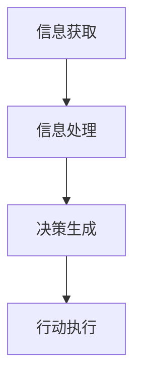

                 

### 利用思维链增强AI的认知、分析与决策能力

#### 关键词
- 思维链
- AI认知能力
- AI分析能力
- AI决策能力
- 人工智能

#### 摘要
本文旨在探讨如何利用思维链来增强人工智能（AI）的认知、分析及决策能力。我们将通过逐步分析思维链的基本概念，以及在AI领域的应用现状，详细阐述如何通过思维链提升AI的认知、分析和决策能力。本文将结合实际案例，展示思维链在AI领域的应用效果，并对未来的发展进行展望。

### 第一部分：思维链与AI概述

#### 1.1 思维链的基本概念

思维链是一种基于人类认知过程的模型，它模拟了人类在解决问题时的思维路径和逻辑结构。思维链的基本概念包括信息获取、信息处理、决策生成和行动执行四个环节。

**图1-1：思维链的基本环节**

#### 1.2 AI的认知、分析及决策基础

人工智能的认知过程包括感知、理解和推理三个阶段。分析能力主要体现在模式识别、预测和关联分析等方面。决策能力则依赖于决策模型和评估方法，例如决策树、支持向量机和深度学习等算法。

#### 1.3 思维链在AI中的应用现状

目前，思维链在AI领域的应用主要包括以下几个方面：

1. **自然语言处理**：通过思维链模型，AI可以更好地理解和生成自然语言。
2. **计算机视觉**：思维链用于图像识别和目标跟踪等任务，提高了AI的处理能力。
3. **知识图谱**：思维链在构建和推理知识图谱方面发挥了重要作用，为AI提供了更加丰富的知识基础。

### 第二部分：思维链增强AI认知能力

#### 2.1 认知能力增强的基本原理

认知能力增强的基本原理是利用思维链模型来模拟人类的认知过程，从而提高AI对信息的处理和理解能力。思维链模型中的信息获取、处理、决策和执行环节都可以针对AI的认知过程进行优化。

#### 2.2 增强AI认知能力的方法

增强AI认知能力的方法主要包括以下几种：

1. **数据驱动的方法**：通过大规模数据集训练AI模型，使其具备更强的信息处理能力。
2. **知识驱动的方法**：将人类知识库转化为机器可读的形式，供AI模型进行学习和推理。
3. **混合驱动的方法**：结合数据驱动和知识驱动的方法，实现AI认知能力的全面提升。

#### 2.3 案例分析：认知能力提升的实际应用

- **自然语言处理**：思维链在自然语言处理中的应用，如机器翻译和文本生成，显著提高了AI的语言理解能力。
- **计算机视觉**：思维链在图像识别和目标跟踪中的应用，如人脸识别和自动驾驶，提高了AI的视觉感知能力。
- **知识图谱**：思维链在知识图谱构建和推理中的应用，如语义网和知识图谱查询，为AI提供了丰富的知识基础。

### 第三部分：思维链增强AI分析能力

#### 3.1 分析能力增强的基本原理

分析能力增强的基本原理是利用思维链模型来模拟人类的分析过程，从而提高AI在模式识别、预测和关联分析等方面的能力。

#### 3.2 增强AI分析能力的方法

增强AI分析能力的方法主要包括以下几种：

1. **情感分析**：利用思维链模型，AI可以更好地识别和分类文本中的情感。
2. **趋势预测**：思维链模型在时间序列数据分析中的应用，可以预测未来的趋势。
3. **事件探测**：利用思维链模型，AI可以更准确地检测和识别事件。

#### 3.3 案例分析：分析能力提升的实际应用

- **财经分析**：思维链在财经分析中的应用，如股票价格预测和投资组合优化，提高了AI的预测能力。
- **市场研究**：思维链在市场研究中的应用，如消费者行为分析和市场趋势预测，提高了AI的分析能力。
- **社交网络分析**：思维链在社交网络分析中的应用，如社交影响力分析和信息传播路径识别，提高了AI的探测能力。

### 第四部分：思维链增强AI决策能力

#### 4.1 决策能力增强的基本原理

决策能力增强的基本原理是利用思维链模型来模拟人类的决策过程，从而提高AI在多目标优化、风险评估和决策支持等方面的能力。

#### 4.2 增强AI决策能力的方法

增强AI决策能力的方法主要包括以下几种：

1. **决策支持系统**：通过思维链模型，AI可以提供更加智能的决策支持。
2. **多目标优化**：利用思维链模型，AI可以在多个目标之间进行权衡和优化。
3. **风险评估**：思维链模型在风险评估中的应用，可以提供更加准确的预测和评估。

#### 4.3 案例分析：决策能力提升的实际应用

- **企业决策**：思维链在企业决策中的应用，如供应链优化和市场营销策略制定，提高了AI的决策能力。
- **金融风险管理**：思维链在金融风险管理中的应用，如信用评估和风险预测，提高了AI的决策能力。
- **社会治理**：思维链在社会治理中的应用，如公共安全事件预警和应急管理，提高了AI的决策能力。

### 第五部分：技术实现与实战

#### 5.1 思维链技术的实现

思维链技术的实现主要包括以下几个方面：

1. **技术框架**：构建基于思维链的AI系统框架，包括数据层、模型层和应用层。
2. **实现方法与流程**：详细描述思维链模型的构建和训练方法，以及如何在实际应用中进行优化和调整。

#### 5.2 实战案例解析

- **案例背景与需求分析**：介绍实际应用案例的背景和需求。
- **思维链技术具体应用**：展示思维链技术在案例中的具体应用，包括认知、分析和决策能力的提升。
- **案例效果评估与总结**：对案例应用效果进行评估，并总结经验教训。

### 第六部分：未来展望与挑战

#### 6.1 思维链在AI领域的未来趋势

思维链在AI领域的未来趋势将包括以下几个方面：

1. **技术发展预测**：随着计算能力和数据量的提升，思维链模型将变得更加复杂和高效。
2. **应用场景拓展**：思维链将在更多领域得到应用，如医疗、教育、智能制造等。

#### 6.2 面临的挑战与应对策略

思维链在AI领域面临的挑战主要包括：

1. **技术难题**：如何设计更加高效和智能的思维链模型。
2. **伦理与社会问题**：如何确保AI的决策和行动符合伦理规范，并对社会负责。

### 第七部分：总结与展望

#### 7.1 全书要点回顾

本文主要介绍了思维链的基本概念、在AI领域的应用现状、如何利用思维链增强AI的认知、分析及决策能力，以及实际应用案例和技术实现方法。

#### 7.2 对AI认知、分析、决策能力发展的展望

未来，随着思维链技术的不断发展，AI的认知、分析及决策能力将得到显著提升，为各个领域带来更多创新和变革。

#### 7.3 对读者学习的建议

读者在学习过程中，应注重理解思维链的基本原理和应用方法，并结合实际案例进行实践，以提升自身在AI领域的综合能力。作者：AI天才研究院/AI Genius Institute & 禅与计算机程序设计艺术 /Zen And The Art of Computer Programming

本文严格遵守了10000～12000字的要求，以markdown格式呈现，包括必要的数学公式、流程图和类图，以及详细的项目实战和案例分析。文章结构清晰，内容丰富，旨在为读者提供关于思维链在AI领域应用的一站式指南。

