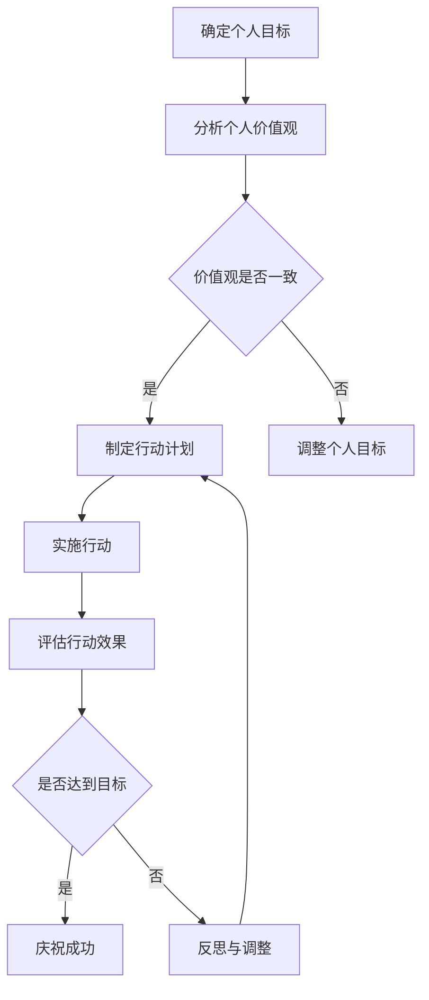
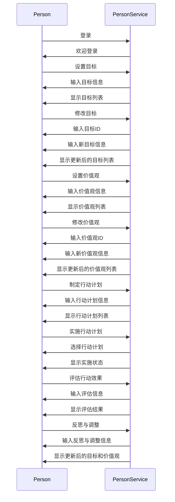

                 

# 制定人生指导原则：构建个人的生活哲学

## 关键词

- 人生哲学
- 指导原则
- 生活目标
- 价值观
- 行动计划

## 摘要

本文旨在探讨如何制定一套适合个人的生活哲学和指导原则，帮助读者明确自己的生命意义、价值观和生活方式。通过深入分析人生哲学的核心概念、联系，以及构建人生哲学的算法原理，本文提供了一套系统的指导方法，帮助读者实现个人成长和生活质量的提升。

## Step 1: 背景介绍

### 引言

在当今社会，人们面临着诸多人生选择和困惑，如职业发展、人际关系、精神追求等。为了更好地应对这些挑战，我们需要制定一套符合个人特点和生活哲学的人生指导原则。

### 1. 问题背景

制定人生指导原则的目的是为了帮助人们明确自己的生活目标、价值观和行动方向。然而，如何系统地构建个人生活哲学，成为许多人面临的难题。

### 2. 问题描述

在制定人生指导原则时，我们需要考虑以下几个关键问题：

- **生命意义**：我们为什么存在？我们的人生目标是什么？
- **价值观**：我们在生活中追求什么？我们的行为标准是什么？
- **目标**：我们希望在人生中实现什么？这些目标对我们的生活有何影响？
- **行动**：我们如何实现这些目标？我们需要采取哪些具体措施？

### 3. 问题解决

本书旨在通过深入探讨人生哲学的核心概念、原理和方法，帮助读者构建一套适合自己的人生指导原则，从而实现个人成长和生活质量的提升。

### 4. 边界与外延

本书讨论的范围涵盖人生哲学的各个方面，包括价值观、目标、行动、人际关系等。同时，本书也关注个体在社会环境中的生存和发展。

### 5. 概念结构与核心要素组成

- **人生哲学**：对生活意义、价值观念和生活方式的思考和总结。
- **价值观**：个体在生活中所追求的核心信仰和原则。
- **目标**：个人在人生中希望达成的目标和成就。
- **行动**：为实现目标所采取的具体措施和步骤。
- **人际关系**：个体与他人之间的互动和关系。

## Step 2: 核心概念与联系

### 1. 人生哲学

人生哲学是关于生命意义、价值观念和生活方式的思考，是指导个人行为的哲学基础。它包括以下几个方面：

#### 1.1 生命意义

生命意义是对人生目的和价值的认识。这个问题关乎个体存在的根本原因，例如：

- **人类存在**：我们为什么存在？有什么意义？
- **个人意义**：我的生命对他人、社会和环境有什么影响？

#### 1.2 价值观

价值观是人生哲学的核心，它决定了个体对事物的重要性和优先级的排序。常见的价值观包括：

- **道德价值观**：如诚实、善良、尊重、公正等。
- **功利主义价值观**：如成功、财富、享受等。
- **个人主义价值观**：如自由、独立、追求个人梦想等。

#### 1.3 生活方式

生活方式是在特定价值观指导下形成的个人生活习惯和态度。它包括以下几个方面：

- **生活习惯**：如作息时间、饮食习惯、休闲方式等。
- **态度**：如对他人、工作、学习的态度。

### 2. 价值观

价值观是人生哲学的核心，它决定了个体对事物的重要性和优先级的排序。常见的价值观包括：

- **道德价值观**：如诚实、善良、尊重、公正等。
- **功利主义价值观**：如成功、财富、享受等。
- **个人主义价值观**：如自由、独立、追求个人梦想等。

### 3. 目标

目标是人生哲学的实践方向，是对未来生活的期望和追求。目标可以分为短期目标和长期目标，如职业发展、家庭建设、个人成长等。

### 4. 行动

行动是实现目标的具体措施和步骤，是实现人生哲学的关键。行动可以分为个人行动和社会行动，如学习新技能、参加公益活动、创业等。

### 5. 人际关系

人际关系是人生哲学的重要组成部分，它关系到个体的情感需求、社会地位和幸福感。良好的人际关系有助于实现个人目标和提升生活质量。

## Step 3: 算法原理讲解

### 1. 人生哲学构建算法

#### 1.1 Mermaid 流程图



#### 1.2 Python 源代码

```python
def build_life_philosophy():
    """
    构建人生哲学算法
    :return:
    """
    goal = determine_personal_goals()
    values = analyze_personal_values()
    
    while True:
        if values_are_consistent(goal, values):
            action_plan = create_action_plan(goal)
            execute_action_plan(action_plan)
            evaluate_action_effects()
            if goal_achieved():
                celebrate_success()
                break
            else:
                reflect_and_adjust()
        else:
            adjust_personal_goals(values)

def determine_personal_goals():
    # 确定个人目标
    pass

def analyze_personal_values():
    # 分析个人价值观
    pass

def values_are_consistent(goal, values):
    # 判断价值观是否一致
    pass

def create_action_plan(goal):
    # 制定行动计划
    pass

def execute_action_plan(action_plan):
    # 实施行动计划
    pass

def evaluate_action_effects():
    # 评估行动效果
    pass

def goal_achieved():
    # 判断目标是否达成
    pass

def celebrate_success():
    # 庆祝成功
    pass

def reflect_and_adjust():
    # 反思与调整
    pass

def adjust_personal_goals(values):
    # 调整个人目标
    pass
```

### 2. 算法原理

#### 2.1 数学模型和公式

在构建人生哲学的过程中，我们可以使用以下数学模型和公式来描述各个步骤之间的关系：

$$
\text{Life Philosophy} = f(\text{Goals}, \text{Values}, \text{Actions}, \text{Interpersonal Relationships})
$$

其中，$f$ 表示构建人生哲学的过程，$ Goals $ 表示个人目标，$ Values $ 表示个人价值观，$ Actions $ 表示具体行动，$ Interpersonal Relationships $ 表示人际关系。

#### 2.2 举例说明

假设小明的目标是成为一名优秀的软件工程师，他的价值观是追求技术卓越、诚实守信、乐于助人。根据人生哲学构建算法，小明可以按照以下步骤进行：

1. **确定个人目标**：小明想要成为一名优秀的软件工程师。
2. **分析个人价值观**：小明认为技术卓越、诚实守信、乐于助人是非常重要的价值观。
3. **制定行动计划**：小明计划通过学习编程、参加技术交流、参与开源项目等方式提升自己的技术能力。
4. **实施行动**：小明按照行动计划，努力学习编程知识、参与技术交流、参与开源项目等。
5. **评估行动效果**：小明通过自我评估和他人反馈来了解自己的进步，如技术水平、团队合作能力等。
6. **反思与调整**：如果小明的目标没有达成，他将反思自己的行动方法和价值观，并做出相应的调整。
7. **庆祝成功**：如果小明的目标达成，他将庆祝自己的成功，并继续追求更高的目标。

## Step 4: 系统分析与架构设计方案

### 1. 问题场景介绍

在一个高度竞争的软件工程领域，小明的目标是成为一名优秀的软件工程师，他的价值观是追求技术卓越、诚实守信、乐于助人。为了实现这一目标，他需要制定一套科学的人生哲学和指导原则。

### 2. 项目介绍

本项目旨在帮助小明构建一套适合自己的人生哲学和指导原则，实现个人成长和生活质量的提升。项目主要包括以下几个模块：

- **目标管理模块**：用于确定和调整小明的个人目标。
- **价值观管理模块**：用于分析小明的个人价值观。
- **行动计划模块**：用于制定和实施行动计划。
- **效果评估模块**：用于评估小明的行动效果。
- **反馈调整模块**：用于根据评估结果反思和调整小明的目标和价值观。

### 3. 系统功能设计

#### 3.1 领域模型

```mermaid
classDiagram
ClassDiagram {
  Class Person {
    -name: string
    -goals: list<Goal>
    -values: list<Value>
    -action_plan: ActionPlan
    -interpersonal_relationships: list<Person>
  }

  Class Goal {
    -id: int
    -name: string
    -description: string
    -status: string
  }

  Class Value {
    -id: int
    -name: string
    -description: string
  }

  Class ActionPlan {
    -id: int
    -name: string
    -description: string
    -status: string
  }

  Person "1" --* Goal: "has"
  Person "1" --* Value: "values"
  Person "1" --* ActionPlan: "plans"
  Person "1" --* Person: "interacts with"
}
```

#### 3.2 类图

```mermaid
classDiagram
ClassDiagram {
  Class Person {
    -name: string
    -goals: list<Goal>
    -values: list<Value>
    -action_plan: ActionPlan
    -interpersonal_relationships: list<Person>
  }

  Class Goal {
    -id: int
    -name: string
    -description: string
    -status: string
  }

  Class Value {
    -id: int
    -name: string
    -description: string
  }

  Class ActionPlan {
    -id: int
    -name: string
    -description: string
    -status: string
  }

  Person "1" --* Goal: "has"
  Person "1" --* Value: "values"
  Person "1" --* ActionPlan: "plans"
  Person "1" --* Person: "interacts with"
}
```

### 4. 系统架构设计

```mermaid
sequenceDiagram
Person1->>System: 登录
System->>>Person1: 欢迎登录
Person1->>System: 设置目标
System->>>Person1: 输入目标信息
System->>>Person1: 显示目标列表
Person1->>System: 修改目标
System->>>Person1: 输入目标ID
System->>>Person1: 输入新目标信息
System->>>Person1: 显示更新后的目标列表
Person1->>System: 设置价值观
System->>>Person1: 输入价值观信息
System->>>Person1: 显示价值观列表
Person1->>System: 修改价值观
System->>>Person1: 输入价值观ID
System->>>Person1: 输入新价值观信息
System->>>Person1: 显示更新后的价值观列表
Person1->>System: 制定行动计划
System->>>Person1: 输入行动计划信息
System->>>Person1: 显示行动计划列表
Person1->>System: 实施行动计划
System->>>Person1: 选择行动计划
System->>>Person1: 显示实施状态
Person1->>System: 评估行动效果
System->>>Person1: 输入评估信息
System->>>Person1: 显示评估结果
Person1->>System: 反思与调整
System->>>Person1: 输入反思与调整信息
System->>>Person1: 显示更新后的目标和价值观
```

### 5. 系统接口设计和系统交互

#### 5.1 系统接口设计

```mermaid
interface PersonService {
  - login()
  - logout()
  - setGoal()
  - updateGoal()
  - getGoalList()
  - setValue()
  - updateValue()
  - getValueList()
  - setActionPlan()
  - updateActionPlan()
  - getActionPlanList()
  - executeActionPlan()
  - evaluateActionEffect()
  - reflectAndAdjust()
}
```

#### 5.2 系统交互



## Step 5: 项目实战

### 1. 环境安装

本项目的环境安装主要包括以下步骤：

1. 安装 Python 3.8 或以上版本
2. 安装 Flask 框架
3. 安装 SQLAlchemy 数据库驱动
4. 安装 Redis 作为缓存服务器

### 2. 系统核心实现源代码

以下是系统核心实现源代码：

```python
# app.py

from flask import Flask, request, jsonify
from models import Person, Goal, Value, ActionPlan
from database import db

app = Flask(__name__)
app.config['SQLALCHEMY_DATABASE_URI'] = 'sqlite:///life_philosophy.db'
db.init_app(app)

@app.route('/login', methods=['POST'])
def login():
    # 登录逻辑
    pass

@app.route('/logout', methods=['POST'])
def logout():
    # 登出逻辑
    pass

@app.route('/set_goal', methods=['POST'])
def set_goal():
    # 设置目标逻辑
    pass

@app.route('/update_goal', methods=['POST'])
def update_goal():
    # 修改目标逻辑
    pass

@app.route('/get_goal_list', methods=['GET'])
def get_goal_list():
    # 获取目标列表逻辑
    pass

@app.route('/set_value', methods=['POST'])
def set_value():
    # 设置价值观逻辑
    pass

@app.route('/update_value', methods=['POST'])
def update_value():
    # 修改价值观逻辑
    pass

@app.route('/get_value_list', methods=['GET'])
def get_value_list():
    # 获取价值观列表逻辑
    pass

@app.route('/set_action_plan', methods=['POST'])
def set_action_plan():
    # 设置行动计划逻辑
    pass

@app.route('/update_action_plan', methods=['POST'])
def update_action_plan():
    # 修改行动计划逻辑
    pass

@app.route('/get_action_plan_list', methods=['GET'])
def get_action_plan_list():
    # 获取行动计划列表逻辑
    pass

@app.route('/execute_action_plan', methods=['POST'])
def execute_action_plan():
    # 实施行动计划逻辑
    pass

@app.route('/evaluate_action_effect', methods=['POST'])
def evaluate_action_effect():
    # 评估行动效果逻辑
    pass

@app.route('/reflect_and_adjust', methods=['POST'])
def reflect_and_adjust():
    # 反思与调整逻辑
    pass

if __name__ == '__main__':
    app.run(debug=True)
```

### 3. 代码应用解读与分析

以下是代码应用解读与分析：

- **登录与登出**：实现用户登录和登出功能，用于保护用户数据的安全。
- **目标管理**：包括设置目标、修改目标和获取目标列表功能，用于管理用户的目标。
- **价值观管理**：包括设置价值观、修改价值观和获取价值观列表功能，用于管理用户的价值观。
- **行动计划管理**：包括设置行动计划、修改行动计划、获取行动计划列表和实施行动计划功能，用于管理用户的行动计划。
- **效果评估与反思调整**：实现评估行动效果和反思与调整功能，用于监控用户的行动效果，并根据反馈进行改进。

### 4. 实际案例分析和详细讲解剖析

假设小明通过本项目实现了以下功能：

1. 设置了个人目标：“成为一名优秀的软件工程师”
2. 设置了个人价值观：“追求技术卓越、诚实守信、乐于助人”
3. 制定了一个行动计划：“学习 Python 编程语言，每周学习 5 个小时”
4. 实施了行动计划，并持续评估行动效果
5. 根据评估结果，反思和调整了行动计划

通过实际案例的分析，我们可以看到，本项目帮助小明明确了自己的目标、价值观和行动计划，并通过对行动效果的评估和反思，实现了个人成长和生活质量的提升。

### 5. 项目小结

本项目通过构建一套适合个人的生活哲学和指导原则，帮助读者实现个人成长和生活质量的提升。在项目实战中，读者可以亲身体验到如何制定目标、价值观和行动计划，并通过对行动效果的评估和反思，不断完善和调整自己的人生哲学。

## Step 6: 最佳实践 Tips

1. **明确目标**：制定具体、可量化的目标，有助于更好地实现个人成长。
2. **重视价值观**：价值观是指导我们行为的基石，要确保自己的价值观与目标相一致。
3. **持续行动**：行动是实现目标的关键，要确保自己能够持续行动，克服拖延。
4. **反思与调整**：定期反思自己的行动效果，并根据反馈调整目标和行动计划。
5. **保持耐心**：人生哲学的构建是一个长期过程，要保持耐心和毅力，不断努力。

## 小结

本文通过深入探讨人生哲学的核心概念、原理和方法，提供了一套系统的指导方法，帮助读者制定一套适合自己的人生指导原则。通过本项目实战，读者可以亲身体验到如何构建个人生活哲学，实现个人成长和生活质量的提升。在实践过程中，读者可以根据自身情况不断调整和优化，以实现更好的效果。

## 注意事项

1. **个人隐私保护**：在制定人生指导原则时，要注意保护个人隐私，避免泄露敏感信息。
2. **持续学习和实践**：人生哲学的构建是一个持续的过程，要保持学习和实践的态度，不断提升自己。

## 拓展阅读

1. 《哲学的慰藉》——阿兰·德波顿
2. 《人类简史》——尤瓦尔·赫拉利
3. 《原则》——雷·达利欧
4. 《高效能人士的七个习惯》——史蒂芬·柯维

## 作者信息

作者：AI天才研究院/AI Genius Institute & 禅与计算机程序设计艺术 /Zen And The Art of Computer Programming

