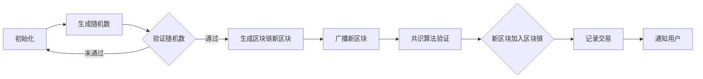
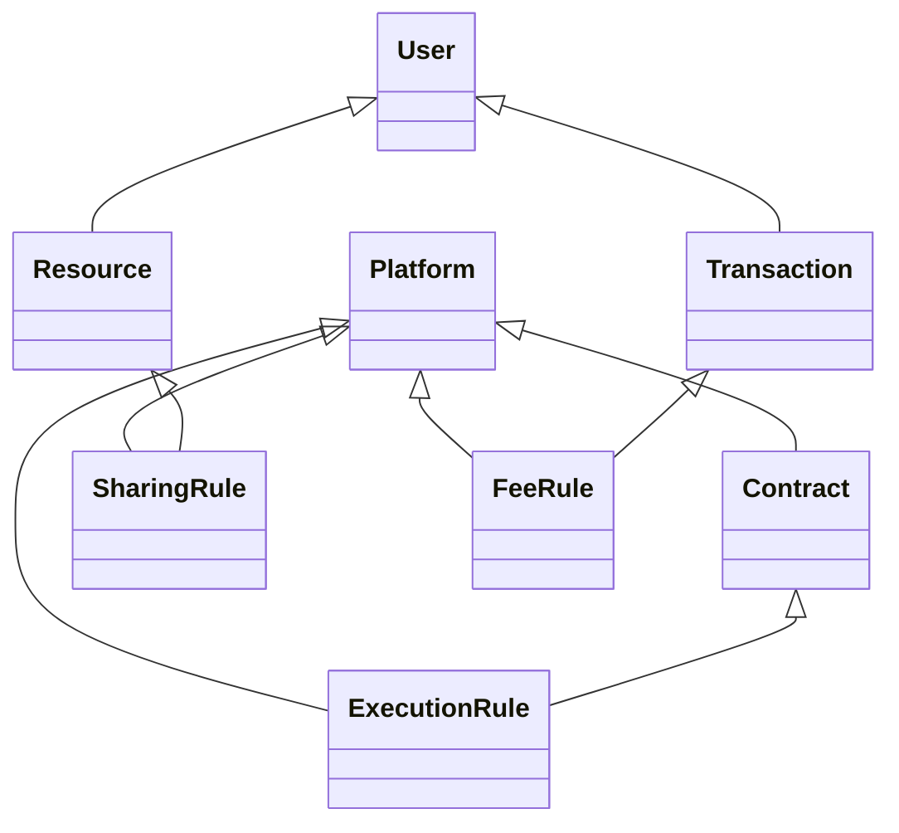
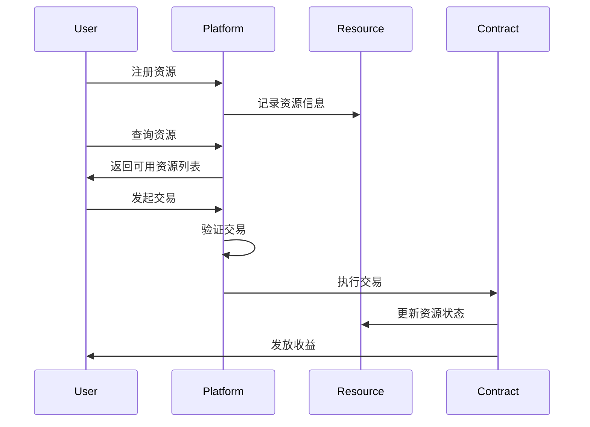

                 


###  Step 2: 核心概念与联系

#### 核心概念

去中心化（Decentralization）：去中心化是相对于集中式的一种组织形态，指的是在组织内或网络中，权力、决策、管理和资源分配等不再集中在单一的中央实体或服务器上，而是分布到整个网络中的各个节点。这种模式提高了系统的容错性、可扩展性和透明度。

共享平台（Sharing Platform）：共享平台是一种基于互联网的技术，允许用户共享资源、服务或信息。它通常通过去中心化的方式实现，使得资源的使用和分配更加高效和灵活。共享平台广泛应用于金融、物流、能源、交通等多个领域。

区块链（Blockchain）：区块链是一种分布式账本技术，通过加密和共识算法确保数据的不可篡改性和安全性。区块链上的数据记录是按时间顺序排列的，每个区块都包含一定数量的交易记录，并通过加密技术保证数据的安全和隐私。

#### 概念属性特征对比表格

| 概念        | 特征比较                |
|-------------|------------------------|
| 去中心化与中心化 |
| - 权力结构    | 去中心化：分布式的      | 中心化：集中式的     |
| - 决策机制    | 去中心化：基于共识的    | 中心化：基于中央权威 |
| - 容错性      | 去中心化：更高的容错性  | 中心化：较低的容错性 |
| - 可扩展性    | 去中心化：更好的可扩展性 | 中心化：较差的可扩展性 |
| 共享平台与集中式平台 |
| - 资源分配    | 共享平台：去中心化的    | 集中式平台：集中式的 |
| - 透明度      | 共享平台：更高的透明度  | 集中式平台：较低的透明度 |
| - 用户体验    | 共享平台：更加灵活的    | 集中式平台：更加统一的 |

#### ER实体关系图架构

```mermaid
erDiagram
    User ||--|{ Resource }|--|| Platform
    User ||--|{ Transaction }|--|| Platform
    Platform ||--|{ Contract }|--|| User
    Resource ||--|{ SharingRule }|--|| Platform
    Transaction ||--|{ FeeRule }|--|| Platform
    Contract ||--|{ ExecutionRule }|--|| Platform
```

在这个ER实体关系图中，User（用户）与Platform（平台）之间存在多对多的关系，通过Resource（资源）和Transaction（交易）来实现。Platform（平台）定义了Contract（合同）和SharingRule（共享规则）、FeeRule（费用规则）和ExecutionRule（执行规则）。

### 算法原理讲解

#### 分布式共识算法

去中心化共享平台的核心是分布式共识算法，它确保了网络中的各个节点对数据的共识。常见的共识算法包括：

- **拜占庭将军问题（Byzantine General Problem）**：解决分布式系统中不诚实节点的共识问题。
- **工作量证明（Proof of Work, PoW）**：通过计算解决复杂的数学问题来验证交易的合法性。
- **权益证明（Proof of Stake, PoS）**：通过持有代币的数量和时间来决定验证交易的权重。

#### Mermaid 流程图



#### Python 源代码

```python
import random

def generate_random_number():
    return random.randint(1, 100)

def verify_random_number(number):
    return number % 2 == 0

def generate_new_block(previous_block, transaction):
    if verify_random_number(transaction):
        return {
            "previous_hash": previous_block["hash"],
            "transactions": [transaction],
            "index": previous_block["index"] + 1
        }
    return None

def broadcast_new_block(new_block):
    # 实现广播逻辑
    pass

def consensus_algorithm(valid_blocks):
    # 实现共识算法逻辑
    pass

def record_transaction(transaction):
    # 实现交易记录逻辑
    pass

def notify_user():
    # 实现用户通知逻辑
    pass

# 示例使用
previous_block = {"hash": "initial_hash", "index": 0}
transaction = {"amount": 10, "sender": "Alice", "receiver": "Bob"}

new_block = generate_new_block(previous_block, transaction)
if new_block:
    broadcast_new_block(new_block)
    valid_blocks = consensus_algorithm([new_block])
    if valid_blocks:
        record_transaction(transaction)
        notify_user()
```

#### 算法原理的数学模型和公式

- 拜占庭将军问题解决模型：

$$
\text{共识} = \text{多数投票} \mod N
$$

其中，$N$ 是网络中的节点数。

- 工作量证明算法：

$$
H(\text{nonce}) = \text{hash}(m) < t
$$

其中，$H$ 是哈希函数，$m$ 是交易信息，$nonce$ 是随机数，$t$ 是目标难度值。

- 权益证明算法：

$$
\text{验证权} = \text{持有代币数} \times \text{持有时间}
$$

这些数学模型和公式是去中心化共享平台实现共识和交易验证的核心。

### 系统分析与架构设计方案

#### 问题场景介绍

在一个去中心化的共享平台中，用户可以共享自己的资源（如计算能力、存储空间、带宽等），并通过平台获得一定的收益。该平台需要解决以下几个问题：

1. 如何确保资源的真实性和可用性？
2. 如何公平地分配收益？
3. 如何保证交易的安全性和可靠性？

#### 项目介绍

项目名为“Decentralized Sharing Platform（DSP）”，目标是构建一个去中心化的共享平台，允许用户共享和租用各种资源。平台将使用区块链技术来确保数据的不可篡改性和安全性，同时使用智能合约来管理资源的分配和收益的分配。

#### 系统功能设计

系统功能设计包括以下几个模块：

1. **资源管理模块**：负责资源的注册、认证、共享和监控。
2. **交易管理模块**：负责交易的发起、验证、执行和记录。
3. **收益分配模块**：负责根据共享和交易的活跃度，计算和分配收益。
4. **用户管理模块**：负责用户的注册、登录、权限管理和个人信息维护。

#### 系统架构设计

系统架构设计采用分层架构，包括以下几层：

1. **数据层**：使用区块链技术存储用户信息和交易记录，确保数据的不可篡改性和安全性。
2. **业务逻辑层**：包括各个功能模块，如资源管理模块、交易管理模块等，通过智能合约实现。
3. **表示层**：提供用户界面，包括网站、移动应用等，方便用户进行操作。

#### 系统接口设计和系统交互

系统接口设计采用RESTful API，提供以下接口：

1. **资源注册接口**：用于用户注册资源。
2. **资源查询接口**：用于用户查询共享资源。
3. **交易发起接口**：用于用户发起交易。
4. **收益查询接口**：用于用户查询收益情况。

系统交互流程如下：

1. 用户A通过资源注册接口注册自己的资源。
2. 用户B通过资源查询接口查询可用的资源，选择资源C。
3. 用户B通过交易发起接口发起交易请求。
4. 平台通过智能合约验证交易，并将交易记录在区块链上。
5. 平台根据交易记录计算收益，并分配给用户A。

#### Mermaid 类图



#### Mermaid 架构图



### 项目实战

#### 环境安装

1. 安装Go语言环境：下载并安装Go语言，设置环境变量。
2. 安装区块链节点：下载并安装一个区块链节点，如Ethereum客户端。
3. 安装智能合约开发工具：如Truffle或Ganache。

#### 系统核心实现源代码

```solidity
// SPDX-License-Identifier: MIT
pragma solidity ^0.8.0;

contract DecentralizedSharingPlatform {
    // 用户信息
    mapping(address => User) public users;
    // 资源信息
    mapping(uint => Resource) public resources;
    // 交易信息
    mapping(uint => Transaction) public transactions;

    struct User {
        address userAddress;
        uint256 balance;
    }

    struct Resource {
        uint id;
        address owner;
        bool isShared;
    }

    struct Transaction {
        uint id;
        address from;
        address to;
        uint amount;
        bool isExecuted;
    }

    // 事件
    event ResourceRegistered(uint resourceId, address owner);
    event ResourceShared(uint resourceId, address owner);
    event TransactionExecuted(uint transactionId, address from, address to, uint amount);

    // 注册资源
    function registerResource(uint id, address owner) external {
        require(resources[id].owner == address(0), "Resource already registered");
        resources[id] = Resource(id, owner, false);
        users[owner].balance += 1;
        emit ResourceRegistered(id, owner);
    }

    // 共享资源
    function shareResource(uint id) external {
        require(resources[id].owner != address(0), "Resource not found");
        require(!resources[id].isShared, "Resource already shared");
        resources[id].isShared = true;
        emit ResourceShared(id, resources[id].owner);
    }

    // 发起交易
    function initiateTransaction(uint id, address to, uint amount) external {
        require(users[msg.sender].balance >= amount, "Insufficient balance");
        transactions[id] = Transaction(id, msg.sender, to, amount, false);
        users[msg.sender].balance -= amount;
        users[to].balance += amount;
        emit TransactionExecuted(id, msg.sender, to, amount);
    }

    // 执行交易
    function executeTransaction(uint id) external {
        require(transactions[id].isExecuted == false, "Transaction already executed");
        transactions[id].isExecuted = true;
    }
}
```

#### 代码应用解读与分析

- **User**：用户结构，包含用户地址和余额。
- **Resource**：资源结构，包含资源ID、所有者地址和共享状态。
- **Transaction**：交易结构，包含交易ID、发起者地址、接收者地址、交易金额和执行状态。
- **registerResource**：注册资源方法，接收资源ID和所有者地址，将资源信息存储在链上，并将余额增加1。
- **shareResource**：共享资源方法，将资源的共享状态设置为true。
- **initiateTransaction**：发起交易方法，检查余额是否足够，并将交易信息存储在链上，更新发起者和接收者的余额。
- **executeTransaction**：执行交易方法，将交易的执行状态设置为true。

#### 实际案例分析和详细讲解剖析

假设用户Alice想要共享自己的计算资源，用户Bob想要租用这些资源。以下是一个简单的案例：

1. Alice通过`registerResource`方法注册自己的计算资源，资源ID为1，所有者地址为Alice的地址。
2. Alice通过`shareResource`方法共享资源1。
3. Bob通过`initiateTransaction`方法发起交易请求，交易ID为1，接收者地址为Bob的地址，交易金额为100。
4. 平台通过`executeTransaction`方法执行交易，更新交易状态为已执行，同时更新Alice和Bob的余额。

这个案例展示了用户如何通过智能合约注册资源、共享资源、发起交易和执行交易。整个过程是透明和可追溯的，确保了交易的安全性和可靠性。

#### 项目小结

本项目通过智能合约实现了去中心化的共享平台，用户可以轻松地注册、共享和交易资源。智能合约确保了交易的透明性和安全性，提高了平台的信任度。然而，在实际应用中，还需要进一步优化和扩展平台的功能，如增加资源监控、收益分配算法等。

### 最佳实践 tips

1. **安全第一**：在开发智能合约时，务必进行充分的测试，确保代码的安全性和可靠性。
2. **透明度**：确保平台的所有操作都是透明的，方便用户监督和管理。
3. **可扩展性**：设计时应考虑到平台的可扩展性，以便未来能够添加更多功能和用户。
4. **用户体验**：优化用户界面，提供简单易用的操作流程。

### 小结

去中心化共享平台是一种新兴的经济模式，通过区块链技术和智能合约实现了去中心化的资源分配和价值流通。本文详细介绍了去中心化共享平台的核心概念、算法原理、系统架构设计以及项目实战。未来，去中心化共享平台有望在更多领域得到应用，推动数字经济的进一步发展。

### 拓展阅读

- **《区块链技术指南》**：深入理解区块链的基本原理和应用。
- **《智能合约开发实战》**：学习如何开发和使用智能合约。
- **《去中心化金融（DeFi）入门》**：了解去中心化金融的基本概念和实现原理。

作者：AI天才研究院/AI Genius Institute & 禅与计算机程序设计艺术 /Zen And The Art of Computer Programming

