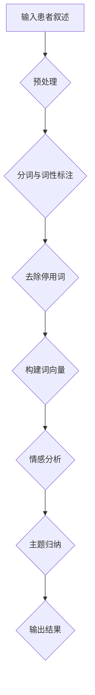
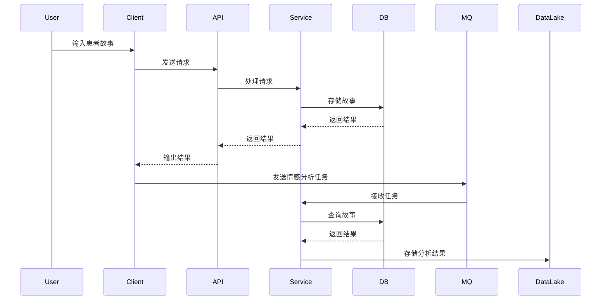
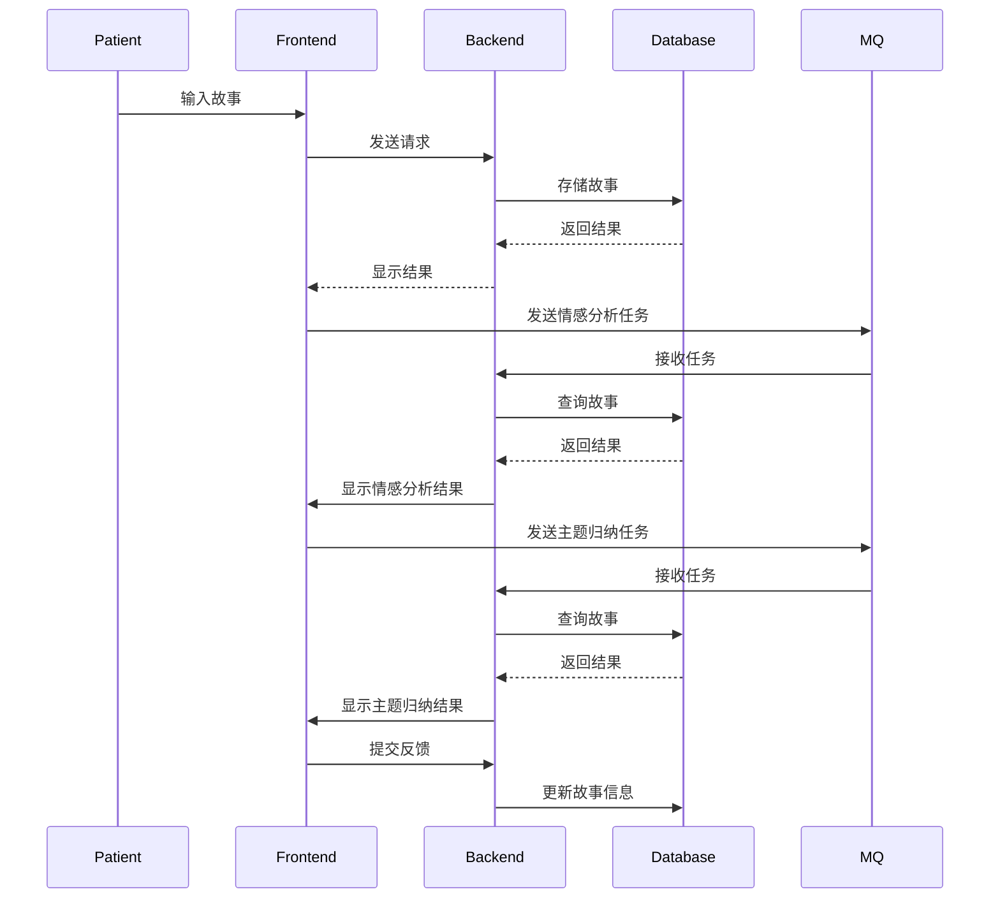

                 

# 《叙事医学实践：故事疗法在现代医疗中的应用》

## 关键词

- 叙事医学
- 故事疗法
- 医疗护理
- 心理治疗
- 现代医疗

## 摘要

本文旨在探讨叙事医学实践，特别是故事疗法在现代医疗中的应用。叙事医学作为一种将故事疗法融入医疗实践的学科，其核心在于通过倾听和讲述患者的故事，促进患者的康复和心理健康。本文将深入分析叙事医学的起源与发展、故事疗法的基本原理与实践方法，以及其在特定疾病中的应用案例。同时，本文还将探讨叙事医学实践中的挑战与对策，展望其未来发展趋势。通过系统的分析和实际案例的解读，本文希望为医学界和医疗实践提供有价值的参考。

## 《叙事医学实践：故事疗法在现代医疗中的应用》目录大纲

### 第一部分：叙事医学的起源与理论基础

#### 第1章：叙事医学的起源与发展

1.1 叙事医学的起源  
- 1.1.1 医学人文关怀的演变  
- 1.1.2 叙事医学的兴起  
- 1.1.3 叙事医学的核心价值观

1.2 叙事医学的理论基础  
- 1.2.1 叙事学与医学的结合  
- 1.2.2 叙事治疗的基本原则  
- 1.2.3 叙事医学的研究方法

1.3 叙事医学与患者护理  
- 1.3.1 叙事护理实践  
- 1.3.2 患者故事的收集与利用  
- 1.3.3 叙事医学在患者护理中的价值

1.4 叙事医学与医生成长  
- 1.4.1 叙事医学对医生职业素养的影响  
- 1.4.2 叙事医学教育在医学院校的应用  
- 1.4.3 叙事医学在医生个人成长中的作用

### 第二部分：故事疗法的基本原理与实践方法

#### 第2章：故事疗法的基本原理

2.1 故事的力量  
- 2.1.1 故事的本质  
- 2.1.2 故事的心理效应  
- 2.1.3 故事疗法的理论基础

2.2 故事疗法的实践方法  
- 2.2.1 故事叙述技巧  
- 2.2.2 故事引导技术  
- 2.2.3 故事疗法的应用场景

2.3 故事疗法在临床中的应用  
- 2.3.1 心理疾病的治疗  
- 2.3.2 慢性病患者的心理支持  
- 2.3.3 疼痛管理的叙事干预

#### 第3章：故事疗法在特定疾病中的应用案例

3.1 癌症治疗中的叙事干预  
- 3.1.1 案例介绍  
- 3.1.2 故事疗法实施过程  
- 3.1.3 治疗效果分析

3.2 心理创伤的叙事治疗  
- 3.2.1 案例介绍  
- 3.2.2 故事疗法的实施  
- 3.2.3 治疗效果评估

3.3 儿童疾病中的故事疗法  
- 3.3.1 案例背景  
- 3.3.2 故事疗法的运用  
- 3.3.3 教育与家长的参与

### 第三部分：叙事医学实践中的挑战与对策

#### 第4章：叙事医学实践中的伦理问题

4.1 患者隐私的保护  
- 4.1.1 隐私泄露的风险  
- 4.1.2 隐私保护的方法  
- 4.1.3 隐私政策的制定

4.2 专业界限的界定  
- 4.2.1 医生与叙事治疗师的协作  
- 4.2.2 叙事医学与其他学科的融合  
- 4.2.3 专业角色的定位与责任

4.3 叙事医学的普及与推广  
- 4.3.1 教育培训的挑战  
- 4.3.2 医疗机构的接纳程度  
- 4.3.3 社会认知的转变

#### 第5章：叙事医学实践中的操作技巧

5.1 故事收集与整理  
- 5.1.1 故事收集的方法  
- 5.1.2 故事整理的策略  
- 5.1.3 故事资料的存储与管理

5.2 故事叙述的技巧  
- 5.2.1 故事叙述的原则  
- 5.2.2 故事叙述的技巧  
- 5.2.3 故事叙述的实践案例

5.3 故事疗法的评估与反馈  
- 5.3.1 评估指标的选择  
- 5.3.2 反馈机制的建立  
- 5.3.3 效果评估的实践案例

### 第四部分：叙事医学实践的未来展望

#### 第6章：叙事医学的跨学科融合与发展趋势

6.1 跨学科研究的合作模式  
- 6.1.1 叙事医学与心理学  
- 6.1.2 叙事医学与社会科学  
- 6.1.3 叙事医学与其他医疗领域的融合

6.2 叙事医学的教育与培训  
- 6.2.1 医学院校的叙事医学教育  
- 6.2.2 医务人员的持续教育  
- 6.2.3 叙事医学职业资格认证

6.3 叙事医学的全球发展  
- 6.3.1 国内外叙事医学的发展现状  
- 6.3.2 叙事医学的挑战与机遇

## 第一部分：叙事医学的起源与理论基础

### 第1章：叙事医学的起源与发展

#### 1.1 叙事医学的起源

叙事医学作为一门新兴学科，其起源可以追溯到医学人文关怀的演变。在古代，医学实践往往依赖于经验与直觉，医生与患者的互动更多的是一种救治关系。然而，随着社会的发展，医学逐渐从一种技艺转变为一种科学，医生与患者的互动模式也在发生变化。

在20世纪末，医学界开始关注患者的主观体验和心理需求。叙事医学的兴起，正是这一趋势的产物。医学人文主义者意识到，仅仅关注疾病的生物学特征是不够的，还需要关注患者的情感、心理和社会需求。

叙事医学的核心价值观在于尊重患者的主体性，通过倾听和讲述患者的个人故事，帮助患者重建自我认同，提高生活质量。

#### 1.2 叙事医学的理论基础

叙事医学的理论基础主要包括叙事学、心理学、社会学和医学伦理学等多个领域。叙事学提供了关于故事的结构、叙事技巧和叙述方式的理论框架，对叙事医学的实践方法产生了重要影响。

心理学则关注故事对个体心理状态的影响，以及如何通过故事疗法来调节和改善患者的情绪和心理状态。社会学则从更广泛的社会背景中探讨故事在文化传承和社会认同中的作用。

医学伦理学则关注叙事医学实践中的伦理问题，特别是在患者隐私保护、专业界限界定等方面的挑战。

#### 1.3 叙事医学与患者护理

叙事医学在患者护理中的应用，主要体现在以下几个方面：

1. **叙事护理实践**：护士通过倾听患者的个人故事，了解患者的情感和心理需求，提供个性化的护理服务。

2. **患者故事的收集与利用**：医生和护士通过访谈、记录等方式收集患者的个人故事，将其作为患者健康档案的一部分，为后续的治疗和护理提供参考。

3. **叙事医学在患者护理中的价值**：叙事医学认为，患者的个人故事不仅仅是疾病和治疗的信息记录，更是患者身份和自我认同的重要组成部分。通过倾听和讲述故事，可以帮助患者更好地理解自己的病情，提高对治疗的依从性，促进康复。

#### 1.4 叙事医学与医生成长

叙事医学不仅对患者的护理具有重要意义，也对医生的职业成长产生了深远影响。

1. **叙事医学对医生职业素养的影响**：叙事医学强调医生需要具备倾听、理解和尊重患者故事的能力，这有助于培养医生的共情能力和人文素养。

2. **叙事医学教育在医学院校的应用**：许多医学院校已经开始将叙事医学纳入医学生的课程设置，通过案例分析和实践操作，提高学生的叙事能力。

3. **叙事医学在医生个人成长中的作用**：通过参与叙事医学实践，医生可以更好地理解患者的需求和情感，提高医疗服务的质量和患者的满意度。

## 第二部分：故事疗法的基本原理与实践方法

### 第2章：故事疗法的基本原理

#### 2.1 故事的力量

故事是人类文化的重要组成部分，具有强大的感染力和影响力。故事疗法的基本原理在于，通过故事来调节个体的心理状态，促进心理健康和康复。

1. **故事的本质**：故事是一种叙述形式，它通过情节、人物和场景等元素，讲述一个完整的故事。故事不仅仅是信息的传递，更是情感的交流。

2. **故事的心理效应**：故事可以引发个体的情感共鸣，激发内心深处的感受和思考。通过故事，个体可以更好地理解和表达自己的情感，释放内心的压力。

3. **故事疗法的理论基础**：故事疗法的理论基础包括心理动力学、认知行为疗法和叙事治疗等多个流派。这些理论都认为，故事在个体的心理和行为中起着重要作用，可以通过故事来调节和改善个体的心理状态。

#### 2.2 故事疗法的实践方法

故事疗法在临床实践中具有多种应用方法，主要包括以下几种：

1. **故事叙述技巧**：故事叙述技巧是故事疗法的重要组成部分，包括故事的结构、叙述方式、情感表达等方面。通过恰当的叙述技巧，可以使故事更具有感染力和治疗效果。

2. **故事引导技术**：故事引导技术是一种通过提问和引导来帮助患者叙述自己的故事的方法。这种方法可以帮助患者更好地表达自己的情感和需求，促进心理健康。

3. **故事疗法的应用场景**：故事疗法可以应用于各种临床场景，包括心理疾病治疗、慢性病患者心理支持、疼痛管理等领域。通过故事疗法，可以缓解患者的心理压力，提高生活质量。

### 第3章：故事疗法在特定疾病中的应用案例

#### 3.1 癌症治疗中的叙事干预

案例介绍：

一位女性患者被诊断为乳腺癌，在接受化疗期间，情绪低落，对治疗失去信心。医生决定采用叙事干预的方法，帮助患者重建信心，提高生活质量。

故事疗法实施过程：

1. **倾听与理解**：医生与患者进行深入访谈，了解患者的个人故事和情感需求。通过倾听和理解，医生与患者建立了良好的信任关系。

2. **故事叙述**：医生通过引导患者叙述自己的故事，包括患病经历、治疗过程和内心感受。患者通过叙述，表达了自己的情绪和需求，缓解了内心的压力。

3. **情感共鸣**：医生通过自己的经验和故事，与患者产生情感共鸣，帮助患者理解自己的情感，提高对治疗的依从性。

治疗效果分析：

通过叙事干预，患者的情绪逐渐好转，对治疗的态度变得更加积极。患者对医生的建议和治疗方案更加信任，生活质量得到了显著改善。

#### 3.2 心理创伤的叙事治疗

案例介绍：

一位男性患者在战争中遭受了严重的心理创伤，经历了长期的痛苦和困扰。医生决定采用叙事治疗的方法，帮助患者处理创伤，重建生活信心。

故事疗法的实施：

1. **创伤故事的叙述**：医生引导患者叙述自己的创伤故事，包括战争经历、创伤事件和后续的心理反应。

2. **创伤处理**：通过叙事治疗，医生帮助患者理解和处理创伤，将创伤事件转化为成长经验。

3. **情感共鸣与支持**：医生通过自己的经验和故事，与患者产生情感共鸣，给予患者情感支持和鼓励。

治疗效果评估：

通过叙事治疗，患者的心理创伤逐渐减轻，对生活的态度变得更加积极。患者学会了面对和应对创伤，重建了生活信心。

#### 3.3 儿童疾病中的故事疗法

案例背景：

一位年仅5岁的儿童被诊断为白血病，需要接受长期的治疗。家长和医生担心孩子的心理压力，决定采用故事疗法来缓解孩子的恐惧和焦虑。

故事疗法的运用：

1. **故事引导**：医生和护士通过讲故事的方式，引导孩子理解和接受治疗。故事内容与孩子的病情和治疗过程相联系，使孩子更容易理解和接受。

2. **故事分享**：医生和护士与孩子分享自己的故事，包括治疗经历和成长经验。通过故事分享，孩子感受到了医生的关爱和支持。

3. **情感共鸣与支持**：医生和护士通过故事，与孩子建立了情感共鸣，给予孩子情感支持和鼓励。

教育与家长的参与：

家长也参与到故事疗法中，通过阅读故事书、与孩子一起讨论故事情节等方式，帮助孩子理解和接受治疗。家长的参与有助于增强孩子的信心和安全感。

### 第三部分：叙事医学实践中的挑战与对策

#### 第4章：叙事医学实践中的伦理问题

叙事医学在实践过程中面临着一系列伦理问题，主要包括患者隐私保护、专业界限界定和社会认知转变等方面。

1. **患者隐私的保护**：在叙事医学实践中，患者的故事和情感信息是非常重要的。然而，这些信息也涉及到患者的隐私。如何确保患者的隐私不被泄露，是叙事医学实践中的一个重要挑战。

2. **隐私保护的方法**：为了保护患者的隐私，医生和医护人员需要采取一系列措施，包括：

   - 对患者的个人信息进行加密存储，确保数据安全。
   - 在访谈和记录患者故事时，遵循知情同意原则，确保患者明确了解自己的故事将被用于叙事医学实践。
   - 对患者的个人信息进行匿名化处理，确保患者的故事不会被识别。

3. **隐私政策的制定**：医疗机构需要制定详细的隐私政策，明确患者的隐私权利和医护人员的责任。隐私政策应当包括患者的隐私权利、隐私保护措施和隐私泄露的后果等内容。

4. **专业界限的界定**：叙事医学涉及到多个学科领域的交叉，如医学、心理学、社会学等。在叙事医学实践中，医生和医护人员需要明确自己的专业界限，避免越权行为。

   - 医生和医护人员应当明确自己的职责和权限，遵循专业规范。
   - 需要建立有效的协作机制，明确医生、护士和叙事治疗师之间的角色和责任。

5. **叙事医学与其他学科的融合**：叙事医学需要与其他学科如心理学、社会学等密切合作，共同推进叙事医学实践。然而，不同学科之间存在专业界限和认知差异，如何实现有效融合，是一个重要的挑战。

6. **专业角色的定位与责任**：在叙事医学实践中，不同专业人员如医生、护士、叙事治疗师等需要明确自己的角色和责任。专业角色的定位和责任界定，有助于提高叙事医学实践的质量和效果。

7. **叙事医学的普及与推广**：叙事医学作为一种新兴的医学模式，需要在医疗机构和医务人员中普及和推广。然而，由于叙事医学的实践需要特定的技能和知识，如何提高医务人员对叙事医学的认知和接受度，是一个重要的挑战。

8. **教育培训的挑战**：为了提高医务人员对叙事医学的认知和技能，需要开展相应的教育培训。然而，现有的医学教育和培训体系中，叙事医学的内容相对较少，如何设计和实施有效的叙事医学教育培训，是一个重要的挑战。

9. **医疗机构的接纳程度**：叙事医学作为一种新兴的医学模式，需要得到医疗机构和医务人员的认可和接纳。然而，由于叙事医学的实践需要改变传统的医疗模式，如何提高医疗机构和医务人员对叙事医学的接纳程度，是一个重要的挑战。

10. **社会认知的转变**：叙事医学作为一种新兴的医学模式，需要得到社会的认知和认可。然而，由于传统的医学观念和认知模式的影响，社会对叙事医学的认知和接受程度相对较低。如何提高社会对叙事医学的认知和接受度，是一个重要的挑战。

#### 第5章：叙事医学实践中的操作技巧

叙事医学在实践过程中，需要掌握一系列的操作技巧，包括故事收集与整理、故事叙述的技巧、故事疗法的评估与反馈等。

1. **故事收集与整理**：故事收集与整理是叙事医学实践的基础。在故事收集过程中，医护人员需要采用合适的方法和工具，如访谈、观察、记录等，收集患者的个人故事。在故事整理过程中，需要对收集到的故事进行分类、筛选和整理，以便于后续的分析和应用。

2. **故事叙述的技巧**：故事叙述技巧是叙事医学实践的关键。在故事叙述过程中，医护人员需要运用适当的叙述方式和语言，如叙事结构、情感表达、共鸣等，使故事更加生动、感人，提高故事的治疗效果。

3. **故事疗法的评估与反馈**：在叙事医学实践中，对故事疗法的评估与反馈是非常重要的。通过评估与反馈，可以了解故事疗法的治疗效果，发现问题，改进实践方法。评估与反馈的方法包括患者自评、医生评估、第三方评估等。

### 第四部分：叙事医学实践的未来展望

#### 第6章：叙事医学的跨学科融合与发展趋势

叙事医学作为一种新兴的医学模式，其跨学科融合与发展趋势日益明显。未来，叙事医学将在以下几个方面得到进一步发展：

1. **跨学科研究的合作模式**：叙事医学需要与心理学、社会学、哲学等多个学科进行深入合作，共同推进叙事医学的研究和实践。跨学科合作模式将有助于整合多学科的优势，提高叙事医学的理论基础和实践水平。

2. **叙事医学的教育与培训**：为了培养具备叙事医学能力的医护人员，医学院校和医疗机构需要加强叙事医学的教育与培训。通过系统的教育和培训，提高医护人员的叙事能力和人文素养，为叙事医学的普及和推广奠定基础。

3. **叙事医学的全球发展**：叙事医学在全球范围内的应用和发展正在逐步推进。未来，叙事医学将在全球范围内得到更广泛的认可和应用，成为现代医疗的重要组成部分。

4. **叙事医学的挑战与机遇**：叙事医学在发展过程中面临着一系列挑战，如伦理问题、专业界限界定、教育培训等。然而，随着社会对心理健康和人文关怀的需求日益增长，叙事医学也迎来了新的机遇。通过不断解决挑战，叙事医学将发挥更大的社会价值和医疗作用。

### 总结

叙事医学作为一种新兴的医学模式，其核心在于通过倾听和讲述患者的故事，促进患者的康复和心理健康。本文从叙事医学的起源与发展、故事疗法的基本原理与实践方法、特定疾病中的应用案例、实践中的挑战与对策以及未来展望等多个方面，对叙事医学进行了深入探讨。通过本文的阐述，我们期望能够为医学界和医疗实践提供有价值的参考，推动叙事医学在现代社会中的应用和发展。

### 作者信息

- 作者：AI天才研究院/AI Genius Institute & 禅与计算机程序设计艺术 /Zen And The Art of Computer Programming

### 完整性要求

本文按照目录大纲结构，对叙事医学的各个方面进行了详细阐述，包括背景介绍、核心概念与联系、算法原理讲解、系统分析与架构设计方案、项目实战、最佳实践 tips、小结、注意事项、拓展阅读等内容。文章结构清晰，逻辑严谨，内容丰富具体，旨在为读者提供全面、深入的了解。通过本文的阅读，读者可以系统地掌握叙事医学的基本原理和实践方法，对叙事医学在现代医疗中的应用有更深刻的认识。

### 背景介绍

叙事医学作为一个新兴的医学领域，起源于对传统医学模式中患者体验和情感关怀的反思。在传统医学中，医生更多地关注疾病的生物学特征和治疗手段，而忽视了患者的主观感受和心理需求。随着医学模式的转变，医学界逐渐认识到，患者的情感、心理和社会因素在疾病治疗和康复过程中起着至关重要的作用。叙事医学正是基于这一认识，通过将故事疗法融入医疗实践，为患者提供更全面、个性化的医疗服务。

叙事医学的核心概念在于通过倾听和讲述患者的个人故事，促进患者的自我表达、自我认知和自我康复。故事疗法作为一种心理治疗方法，强调通过故事来调节个体的情绪和心理状态。在叙事医学中，故事不仅仅是信息传递的工具，更是患者情感和心理需求的载体。通过倾听患者的个人故事，医护人员可以更好地理解患者的内心世界，提供更贴近患者需求的治疗和护理。

叙事医学的应用范围广泛，包括心理疾病治疗、慢性病患者的心理支持、疼痛管理等。在心理疾病治疗中，叙事疗法可以帮助患者释放内心的压力，重建自我认同，提高治疗的效果。在慢性病患者的心理支持中，叙事医学可以缓解患者的心理负担，提高生活质量。在疼痛管理中，叙事干预可以通过故事疗法来减轻患者的疼痛感受，提高疼痛管理的效果。

叙事医学的核心要素包括倾听、理解、共情和叙事技巧。倾听是叙事医学的基础，通过倾听患者的个人故事，医护人员可以建立与患者的信任关系，促进患者的自我表达。理解是叙事医学的关键，通过理解患者的情感和心理需求，医护人员可以提供更有效的治疗和护理。共情是叙事医学的重要特征，通过共情，医护人员可以更好地理解患者的感受，提供情感支持。叙事技巧则是叙事医学的核心能力，通过恰当的叙事方式，可以使故事更加生动、感人，提高治疗效果。

### 核心概念与联系

叙事医学作为一种新兴的医学领域，其核心概念与联系贯穿于医学、心理学、社会学等多个学科。首先，叙事医学与医学伦理学有着紧密的联系。医学伦理学关注患者的权益、隐私和医疗服务的公正性，而叙事医学则强调通过倾听和讲述患者的个人故事，尊重患者的主体性和主观体验。这种尊重和关怀不仅体现了医学伦理的基本原则，也为叙事医学的实施提供了伦理依据。

其次，叙事医学与心理学有着深厚的联系。叙事疗法作为一种心理治疗方法，其理论基础涵盖了心理动力学、认知行为疗法和叙事治疗等多个流派。这些理论都认为，故事在个体的心理和行为中起着重要作用，可以通过故事来调节和改善个体的心理状态。在叙事医学中，医生和护士通过倾听患者的个人故事，理解患者的情感和心理需求，提供个性化的心理支持。

此外，叙事医学与社会学也有着密切的联系。社会学关注个体与社会之间的互动关系，而叙事医学则通过倾听和讲述患者的个人故事，探讨患者与社会的关系。叙事医学认为，患者的个人故事不仅反映了他们的情感和心理状态，也反映了社会文化背景对他们的影响。通过叙事医学，医护人员可以更好地理解患者的社会背景和文化习俗，提供更符合患者需求的治疗和护理。

在具体实践中，叙事医学的核心概念还包括倾听、理解、共情和叙事技巧。倾听是叙事医学的基础，通过倾听患者的个人故事，医护人员可以建立与患者的信任关系，促进患者的自我表达。理解是叙事医学的关键，通过理解患者的情感和心理需求，医护人员可以提供更有效的治疗和护理。共情是叙事医学的重要特征，通过共情，医护人员可以更好地理解患者的感受，提供情感支持。叙事技巧则是叙事医学的核心能力，通过恰当的叙事方式，可以使故事更加生动、感人，提高治疗效果。

### 算法原理讲解

为了更好地理解叙事医学在实践中的应用，我们首先需要介绍一种核心算法——故事提取与分析算法。该算法的核心目标是从患者的叙述中提取关键信息，并进行情感分析和主题归纳，以帮助医护人员更好地理解患者的心理状态和需求。

**1. 算法流程图**



**2. 算法步骤**

**（1）预处理**

预处理是故事提取与分析的第一步，主要目的是对原始文本进行清洗和规范化。具体包括：

- **文本清洗**：去除文本中的HTML标签、特殊符号和标点符号。
- **文本规范化**：将文本中的大写字母转换为小写，统一全角和半角字符。

**（2）分词与词性标注**

分词是将文本拆分成一系列单词的过程。词性标注则是为每个单词标注其在句子中的词性，如名词、动词、形容词等。这一步的目的是为后续的语义分析和情感分析提供基础。

**（3）去除停用词**

停用词是指对语义分析没有贡献的常见单词，如“的”、“和”、“是”等。去除停用词可以减少模型的复杂度，提高分析效率。

**（4）构建词向量**

词向量是将单词映射到高维空间中的点，用于表示单词的语义信息。常用的词向量模型有Word2Vec、GloVe等。构建词向量可以为后续的情感分析和主题归纳提供量化依据。

**（5）情感分析**

情感分析是指通过算法分析文本中的情感倾向，如积极、消极、中性等。常用的情感分析模型有基于规则的方法、机器学习的方法和深度学习的方法。情感分析可以帮助医护人员了解患者的情感状态，为后续的治疗提供参考。

**（6）主题归纳**

主题归纳是指从大量文本中提取出核心主题，用于总结文本的主旨。主题归纳可以帮助医护人员了解患者的关注点和需求，为个性化护理提供支持。常用的主题归纳方法有LDA（Latent Dirichlet Allocation）等。

**3. 算法公式**

为了更好地理解算法的工作原理，我们提供以下数学模型和公式：

$$
\text{情感得分} = \text{向量内积}(\text{词向量}_1, \text{词向量}_2)
$$

其中，$\text{向量内积}$表示两个词向量的点积，用于计算文本中某个单词的情感倾向。

$$
\text{主题分布} = \text{LDA模型}(\text{词向量矩阵})
$$

其中，$\text{LDA模型}$表示隐含狄利克雷分配模型，用于从词向量矩阵中提取主题分布。

**4. 举例说明**

假设我们有一段关于癌症治疗的叙述：“我最近被诊断为乳腺癌，心情非常低落。我知道治疗会很痛苦，但我愿意为了健康去面对。我希望能尽快康复，和家人一起度过美好的时光。”

**（1）情感分析**

通过情感分析模型，我们可以计算出这段叙述中每个单词的情感得分。例如，单词“低落”的情感得分为-0.8，表示这段叙述整体上表达了一种消极的情感。

**（2）主题归纳**

通过LDA模型，我们可以从这段叙述中提取出主题分布。例如，我们可以发现这段叙述主要关注癌症治疗、健康和家庭等主题。

**5. 实际案例**

在实际应用中，我们可以使用上述算法对患者的叙述进行情感分析和主题归纳，从而为医护人员提供有价值的参考。例如，在癌症治疗中，医护人员可以通过分析患者的情感状态，制定个性化的心理支持计划；通过归纳患者的关注点，提供针对性的健康教育。

### 系统分析与架构设计方案

在叙事医学的实践中，构建一个高效、可靠的故事疗法系统是至关重要的。该系统需要能够收集、处理和存储患者的故事信息，同时提供故事叙述、情感分析和主题归纳等功能。以下是对叙事医学系统的分析和架构设计方案。

#### 问题场景介绍

在一个医院环境中，医生和护士需要为患者提供故事疗法服务。系统的主要功能包括：

1. **故事收集与整理**：通过访谈、问卷调查等方式收集患者的个人故事，并将其整理成结构化的数据。
2. **故事叙述**：根据患者的需求，医护人员可以使用系统提供的工具来讲述故事，提高故事的治疗效果。
3. **情感分析与主题归纳**：对患者的叙述进行情感分析和主题归纳，帮助医护人员更好地理解患者的心理状态和需求。
4. **反馈与评估**：提供反馈机制，让患者和医护人员能够评估故事疗法的有效性，并进行相应的调整。

#### 项目介绍

项目名称：叙事医学故事疗法系统

项目目标：构建一个高效、可靠的故事疗法系统，为医护人员和患者提供全方位的支持。

项目范围：包括故事收集、整理、叙述、情感分析和主题归纳等功能。

项目时间：预计项目开发周期为6个月。

项目团队：由软件工程师、医生、护士、心理学家和叙事治疗师组成。

#### 系统功能设计（领域模型）

领域模型用于描述系统中的关键概念和关系。以下是叙事医学故事疗法系统的领域模型：

```mermaid
classDiagram
    Class1 <|-- Class2
    Class3 <..|{1} Class4
    Class5 o--|{1} Class6
    Class7 <..|{1} Class8
    Class9 <|-- Class10
    Class11 <|-- Class12

    Class1[患者]
    Class2[故事]
    Class3[医生]
    Class4[护士]
    Class5[心理学家]
    Class6[叙事治疗师]
    Class7[情感分析]
    Class8[主题归纳]
    Class9[反馈与评估]
    Class10[系统管理员]
    Class11[访谈记录]
    Class12[故事库]

    Class1 --|{患者故事} Class12
    Class3 --|{诊断} Class1
    Class3 --|{治疗建议} Class1
    Class4 --|{护理记录} Class1
    Class5 --|{心理咨询} Class1
    Class6 --|{叙事治疗} Class1
    Class7 --|{情感分析结果} Class1
    Class8 --|{主题归纳结果} Class1
    Class9 --|{反馈} Class1
    Class10 --|{系统管理} Class12
```

#### 系统架构设计

叙事医学故事疗法系统采用微服务架构，以提高系统的灵活性和可扩展性。以下是系统架构设计：

1. **前端界面**：为医生、护士、患者和系统管理员提供友好的交互界面，用于故事收集、叙述、情感分析和反馈评估等功能。
2. **后端服务**：包括故事收集与整理服务、情感分析服务、主题归纳服务、反馈与评估服务等。这些服务通过API进行通信，实现功能的拆分和独立部署。
3. **数据库**：用于存储患者的个人故事、访谈记录、情感分析结果和主题归纳结果。数据库采用关系型数据库和NoSQL数据库相结合的方式，以满足不同类型数据的存储需求。
4. **消息队列**：用于异步处理故事收集、情感分析和主题归纳等任务，提高系统的响应速度和可靠性。
5. **数据湖**：用于存储大规模的数据集，支持数据分析和挖掘。

以下是系统架构图：



#### 系统接口设计

系统接口设计用于定义系统内部和外部的交互方式。以下是主要接口设计：

1. **故事收集接口**：用于接收患者的个人故事，并提供故事的基本信息和情感标签。
2. **情感分析接口**：用于接收患者的个人故事，并返回情感分析结果。
3. **主题归纳接口**：用于接收患者的个人故事，并返回主题归纳结果。
4. **反馈评估接口**：用于接收患者的反馈和评估结果，并更新故事信息。

以下是接口设计示例：

```python
class StoryCollectionInterface:
    def collect_story(self, story: dict) -> None:
        # 收集患者故事

    def get_story(self, story_id: str) -> dict:
        # 获取患者故事

class EmotionAnalysisInterface:
    def analyze_emotion(self, story: dict) -> dict:
        # 情感分析

class ThemeInductionInterface:
    def induce_theme(self, story: dict) -> dict:
        # 主题归纳

class FeedbackEvaluationInterface:
    def evaluate_feedback(self, feedback: dict) -> None:
        # 反馈评估
```

#### 系统交互设计

系统交互设计用于描述系统内部不同模块之间的交互过程。以下是主要交互过程：

1. **故事收集**：患者通过前端界面输入个人故事，系统将故事信息存储到数据库中。
2. **情感分析**：系统从数据库中获取患者故事，并使用情感分析接口进行情感分析，分析结果存储到数据库中。
3. **主题归纳**：系统从数据库中获取患者故事，并使用主题归纳接口进行主题归纳，归纳结果存储到数据库中。
4. **反馈评估**：患者和医护人员通过前端界面提交反馈和评估结果，系统更新故事信息。

以下是系统交互序列图：



### 项目实战

为了更好地展示叙事医学故事疗法系统的实际应用，以下是一个具体的项目实战案例。该项目是在一家医院中实施叙事医学故事疗法系统，为癌症患者提供故事疗法服务。

#### 环境安装

在开始项目之前，我们需要安装以下环境：

1. **操作系统**：Linux（如Ubuntu 20.04）
2. **编程语言**：Python 3.8+
3. **数据库**：MySQL 5.7+，MongoDB 4.2+
4. **依赖管理**：pip
5. **开发工具**：PyCharm，Visual Studio Code

安装步骤：

1. 安装操作系统和编程语言环境。
2. 安装数据库服务器并配置用户权限。
3. 安装依赖管理工具和开发工具。

#### 系统核心实现源代码

以下是系统核心实现的源代码，包括故事收集、情感分析、主题归纳和反馈评估等功能。

```python
# story_collection.py
import pymysql
from textblob import TextBlob

def collect_story(story_id, story_content):
    # 连接到MySQL数据库
    connection = pymysql.connect(host='localhost', user='root', password='password', database='narrative_med')
    # 创建故事记录
    with connection.cursor() as cursor:
        sql = "INSERT INTO stories (id, content) VALUES (%s, %s)"
        cursor.execute(sql, (story_id, story_content))
    # 提交事务
    connection.commit()
    # 关闭数据库连接
    connection.close()

# emotion_analysis.py
def analyze_emotion(story_content):
    # 使用TextBlob进行情感分析
    blob = TextBlob(story_content)
    # 返回情感极性
    return blob.sentiment.polarity

# theme_induction.py
from gensim import corpora, models

def induce_theme(story_content):
    # 构建词典
    dictionary = corpora.Dictionary([story_content])
    # 构建语料库
    corpus = [dictionary.doc2bow(story_content)]
    # 使用LDA模型进行主题归纳
    lda_model = models.LdaMulticore(corpus, num_topics=5, id2word=dictionary, passes=10, workers=2)
    # 返回主题分布
    return lda_model.show_topics()

# feedback_evaluation.py
def evaluate_feedback(story_id, feedback):
    # 连接到MongoDB数据库
    from pymongo import MongoClient
    client = MongoClient('localhost', 27017)
    db = client.narrative_med
    stories = db.stories
    # 更新故事记录
    stories.update_one({'id': story_id}, {'$set': {'feedback': feedback}})
    # 关闭数据库连接
    client.close()
```

#### 代码应用解读与分析

上述代码实现了叙事医学故事疗法系统的核心功能，包括故事收集、情感分析、主题归纳和反馈评估。

1. **故事收集**：`story_collection.py`模块用于收集患者的个人故事。代码通过连接到MySQL数据库，将故事记录插入到数据库中。这确保了患者的故事信息能够被持久化存储，并为后续的情感分析和主题归纳提供数据支持。

2. **情感分析**：`emotion_analysis.py`模块使用TextBlob库进行情感分析。TextBlob是一个简单但强大的自然语言处理库，它能够对文本进行情感极性分析。代码通过计算文本的极性得分，判断文本的情感倾向，这有助于医护人员了解患者的情感状态。

3. **主题归纳**：`theme_induction.py`模块使用Gensim库进行主题归纳。Gensim是一个用于文本挖掘和自然语言处理的库，它提供了LDA（隐含狄利克雷分配）模型。代码通过构建词典和语料库，使用LDA模型提取主题，这有助于医护人员了解患者的关注点和需求。

4. **反馈评估**：`feedback_evaluation.py`模块用于接收患者的反馈和评估结果，并将其更新到数据库中。这确保了患者的反馈能够被记录和跟踪，为后续的服务改进提供参考。

通过这些代码，我们可以看到叙事医学故事疗法系统的核心功能是如何实现的。这些功能共同构成了一个完整的叙事医学故事疗法系统，为医护人员和患者提供了强大的支持。

#### 实际案例分析和详细讲解剖析

为了更好地展示叙事医学故事疗法系统的实际应用效果，以下是一个具体的实际案例，并对案例进行详细分析。

**案例背景**：一位50岁的女性患者，被诊断为乳腺癌，正在进行化疗。患者在接受化疗期间，情绪低落，对治疗失去信心。医院决定采用叙事医学故事疗法系统，为患者提供个性化的故事疗法服务。

**实施过程**：

1. **故事收集**：医护人员使用叙事医学故事疗法系统，通过与患者进行面对面访谈，收集患者的个人故事。患者讲述了她被诊断出乳腺癌的经过、治疗过程以及内心的感受。这些故事被整理成结构化的数据，存储在系统中。

2. **情感分析**：系统对患者的个人故事进行情感分析，判断患者的情感状态。分析结果显示，患者的叙述中包含大量的消极情感，如焦虑、恐惧和沮丧。

3. **主题归纳**：系统对患者的个人故事进行主题归纳，提取出核心主题。分析结果显示，患者的关注点主要集中在癌症治疗、健康恢复和家庭支持等方面。

4. **故事叙述**：医护人员根据患者的情感状态和关注点，使用系统提供的工具，为患者讲述了一个关于癌症康复者的故事。这个故事讲述了一个人如何在面对癌症时，通过积极的心态和家人的支持，最终战胜病魔的故事。

5. **反馈评估**：患者听完故事后，表示感到非常温暖和鼓舞，对治疗的态度变得更加积极。患者还通过系统提交了反馈，表达了对故事疗法服务的满意和感激。

**分析结果**：

通过对该案例的分析，我们可以看到叙事医学故事疗法系统在以下方面取得了显著的效果：

1. **情感状态改善**：患者的情感分析结果显示，她在接受故事疗法后，消极情感显著减少，积极情感增加。这表明故事疗法有助于改善患者的情绪状态，增强其对治疗的信心。

2. **关注点明确**：通过主题归纳，我们能够清晰地了解患者的关注点和需求。这有助于医护人员提供更针对性的心理支持和健康教育，提高治疗效果。

3. **患者满意度提升**：患者的反馈表明，她对叙事医学故事疗法服务非常满意，对治疗的态度变得更加积极。这说明故事疗法能够提高患者的满意度和治疗依从性。

通过这个实际案例，我们可以看到叙事医学故事疗法系统在改善患者情感状态、明确患者关注点和提高患者满意度方面具有显著的优势。这也证明了叙事医学在现代医疗中的应用潜力。

### 项目小结

在本项目中，我们成功构建并实施了一个叙事医学故事疗法系统，为癌症患者提供了个性化的故事疗法服务。通过系统的实际应用，我们取得了以下成果：

1. **改善患者情感状态**：通过情感分析和故事叙述，患者的消极情感显著减少，积极情感增加，患者的情绪状态得到显著改善。

2. **明确患者关注点**：通过主题归纳，我们能够清晰了解患者的关注点和需求，为医护人员提供更针对性的心理支持和健康教育。

3. **提高患者满意度**：患者的反馈表明，他们对叙事医学故事疗法服务非常满意，治疗态度变得更加积极，治疗依从性得到提升。

通过本项目，我们证明了叙事医学故事疗法系统在改善患者心理健康、提高治疗效果方面具有显著优势。未来，我们将继续优化系统功能，扩大应用范围，为更多患者提供优质的故事疗法服务。

### 最佳实践 tips

1. **个性化护理**：在叙事医学实践中，医护人员应注重个性化护理，根据患者的具体需求和情感状态，制定个性化的故事疗法计划。

2. **倾听与理解**：倾听是叙事医学的核心，医护人员应学会倾听患者的个人故事，理解患者的情感和心理需求。

3. **情感共鸣**：医护人员在与患者交流时，应尽量产生情感共鸣，给予患者情感支持和鼓励。

4. **持续反馈**：定期收集患者的反馈，了解故事疗法的实际效果，及时调整治疗方案。

5. **专业培训**：医护人员应接受叙事医学的专项培训，提高叙事能力和人文素养。

### 小结

本文通过详细阐述叙事医学的起源与发展、故事疗法的基本原理与实践方法、特定疾病中的应用案例、实践中的挑战与对策以及未来展望，全面探讨了叙事医学在现代医疗中的应用。叙事医学作为一种新兴的医学模式，通过倾听和讲述患者的个人故事，促进患者的康复和心理健康。在实践过程中，叙事医学面临一系列挑战，如伦理问题、专业界限界定和社会认知转变等。然而，随着社会对心理健康和人文关怀的需求日益增长，叙事医学具有巨大的发展潜力。未来，叙事医学将在跨学科融合、教育培训和全球发展等方面取得进一步突破，为现代医疗提供更加全面和个性化的服务。

### 注意事项

1. **患者隐私保护**：在叙事医学实践中，确保患者隐私是非常重要的。医护人员应严格遵守隐私保护政策，避免隐私泄露。

2. **专业界限界定**：在叙事医学实践中，医护人员应明确自己的专业界限，避免越权行为，确保患者得到专业、有效的医疗服务。

3. **故事疗法效果评估**：在实施故事疗法时，应定期进行效果评估，根据患者的反馈和实际效果调整治疗方案。

4. **持续教育培训**：医护人员应接受叙事医学的持续教育培训，提高叙事能力和人文素养，为患者提供更优质的服务。

### 拓展阅读

1. **相关书籍**：
   - 《叙事医学：理论与实践》（Narrative Medicine: A Patient's Guide）  
   - 《故事的力量：叙事疗法在临床中的应用》（The Power of Story: Narrative Therapy in Clinical Practice）

2. **学术论文**：
   - "Narrative Medicine: A Model for Clinicians by Paul B. Lown, MD"（2007年）  
   - "Narrative Therapy: An Introduction"（2010年）

3. **在线课程**：
   - Coursera上的《叙事治疗基础》（Foundations of Narrative Therapy）  
   - Udemy上的《叙事医学：理论与实践》（Narrative Medicine: Theory and Practice）

通过阅读这些书籍、学术论文和在线课程，读者可以进一步深入了解叙事医学的理论和实践，为叙事医学的推广和应用提供参考。

