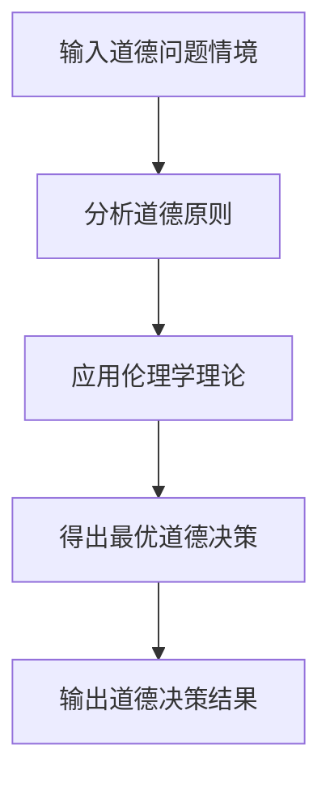
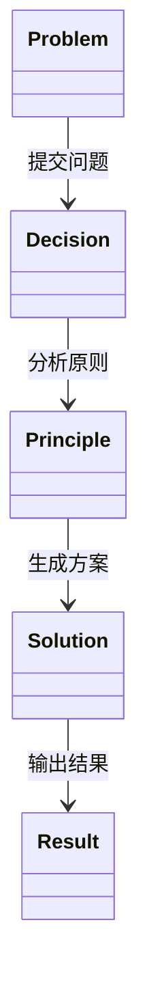
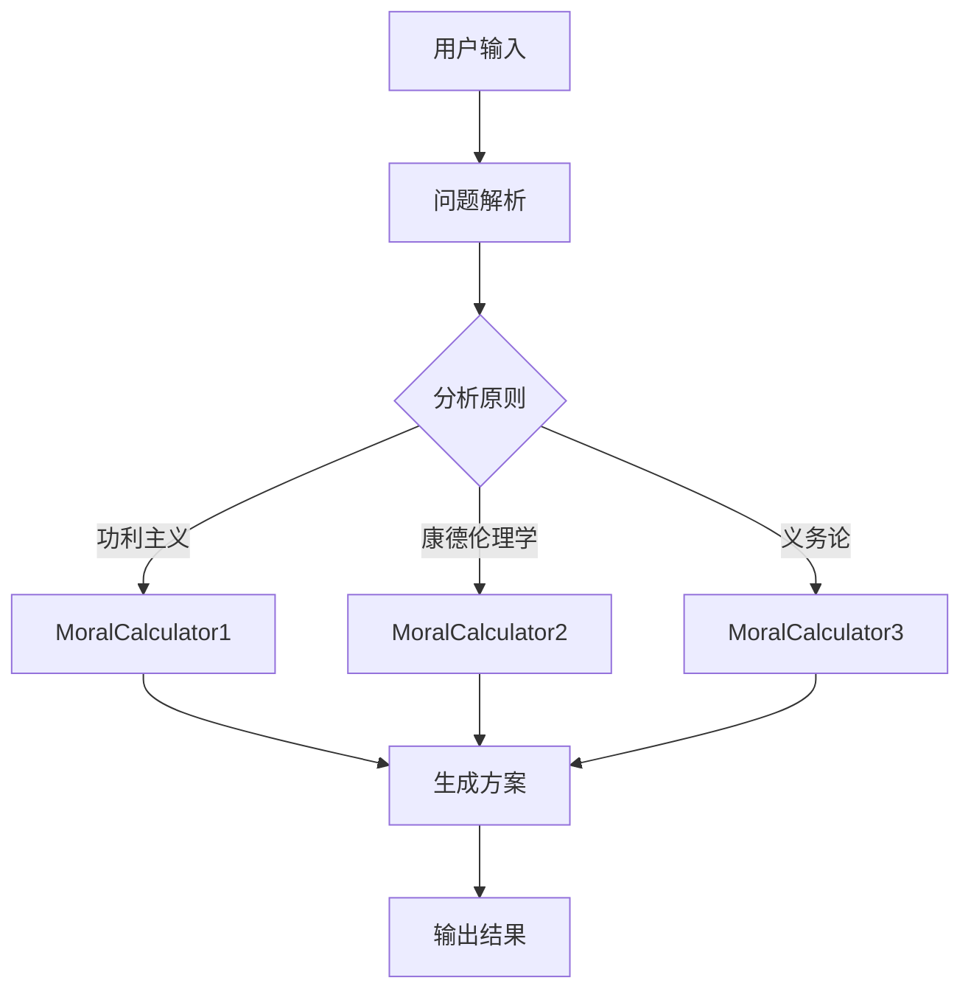
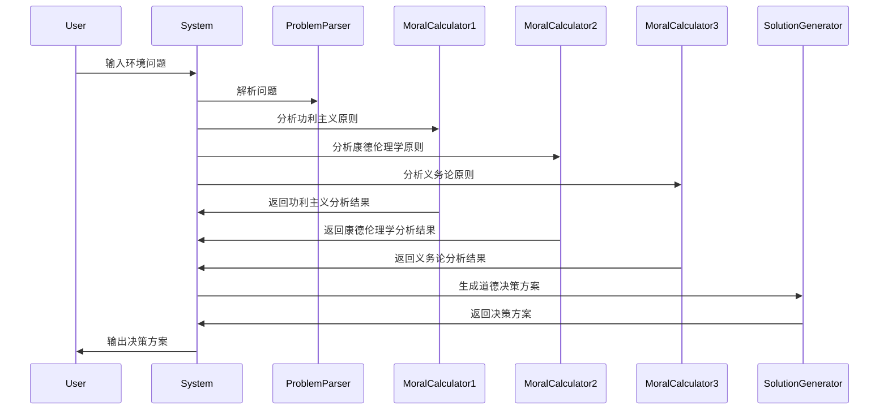

                 

# 古老智慧在现代的应用：哲学的当代启示

## 关键词
- 哲学思想
- 现代社会
- 应用场景
- 跨学科研究
- 道德决策算法

## 摘要
本文旨在探讨古老哲学思想在现代应用中的可能性，为当代社会提供一种新的思维方式和行动指南。通过重新解读古老哲学思想，结合现代社会需求，提炼出适用于现代社会的核心思想。本文将从背景介绍、核心概念与联系、算法原理讲解、系统分析与架构设计方案、项目实战以及最佳实践 tips 等方面进行详细阐述。

## 第一部分：背景介绍

### 1.1 问题背景
在当今社会，科技的快速发展使得人类的生活发生了翻天覆地的变化。然而，随着科技的进步，人们的生活也面临着诸多挑战，如道德伦理问题、人际关系紧张、社会问题加剧等。古老哲学思想作为人类智慧的集大成者，其思想在现代社会的各个领域都产生了深远的影响。然而，传统的哲学研究往往局限于理论研究，缺乏与实际应用的结合。本文旨在探讨古老哲学思想在现代应用中的可能性，为当代社会提供一种新的思维方式和行动指南。

### 1.2 问题描述
古老哲学思想虽然历史悠久，但其在现代社会中的应用面临着诸多挑战。首先，现代社会的复杂性和多样性使得古老哲学思想难以直接应用。其次，古老哲学思想的表达方式和语言与现代社会的沟通方式存在差异，这增加了应用难度。此外，现代人对哲学的理解存在片面化和碎片化的倾向，难以形成系统的哲学认知。

### 1.3 问题解决
为了解决上述问题，本文提出了以下几种解决方案：

1. **重新解读古老哲学思想**：通过深入研究和解读，将古老哲学思想与现代社会的需求相结合，提炼出适用于现代社会的核心思想。
2. **跨学科研究**：将哲学与其他学科（如心理学、社会学、管理学等）相结合，探讨哲学思想在不同领域中的应用。
3. **实践应用**：通过实际案例，展示古老哲学思想在现实生活中的应用效果，验证其有效性和可行性。

### 1.4 边界与外延
1. **边界**：本文主要探讨古老哲学思想在现代社会中的应用，不包括历史、文化等纯理论研究。
2. **外延**：本文不仅关注哲学思想的应用，还涉及如何将哲学思想融入日常生活，提高人们的思维品质和生活质量。

### 1.5 概念结构与核心要素组成
**概念结构**：
- **哲学思想**：包括存在论、认识论、伦理学、美学等核心领域。
- **现代社会**：包括经济、政治、文化、科技等方面。
- **应用场景**：日常生活、工作、教育、管理等。

**核心要素组成**：
- **哲学思想的现代解读**。
- **跨学科研究方法**。
- **实践应用案例**。
- **哲学思想融入日常生活的策略**。

## 第二部分：核心概念与联系

### 2.1 核心概念

#### 哲学思想
哲学思想是哲学家通过理性思考和实践经验所提出的一系列关于人生、宇宙、知识、道德等问题的观点和理论。例如，柏拉图的理念论、亚里士多德的形而上学、康德的道德哲学等。

#### 现代社会
现代社会是指人类在20世纪以来所形成的社会结构和生活方式。现代社会具有多元化、信息化、全球化的特点，人们面临着越来越多的复杂问题。

#### 应用场景
应用场景是指哲学思想在现实生活中的具体应用场合。例如，哲学思想可以应用于企业管理、教育改革、社会治理等。

### 2.2 概念属性特征对比表格

| 概念       | 属性特征                                                     |
| ---------- | ------------------------------------------------------------ |
| 哲学思想   | - 提供世界观和方法论<br>- 深刻影响人类思维和行为               |
| 现代社会   | - 多元化<br>- 信息化<br>- 全球化                             |
| 应用场景   | - 日常生活<br>- 工作场景<br>- 教育场景<br>- 社会治理         |

### 2.3 ER实体关系图架构

```mermaid
erDiagram
  哲学思想 ||--|{ 应用场景 }|-- 依托现代社会
  应用场景 ||--|{ 影响哲学思想 }|-- 作用于现代社会
```

## 第三部分：算法原理讲解

### 3.1 哲学思想的算法化
哲学思想虽然难以直接量化，但可以通过算法来模拟和实现。例如，将伦理学中的道德决策过程转化为算法，实现自动化的道德判断。

### 3.2 算法原理

**道德决策算法**

1. 输入：道德问题情境。
2. 处理：通过分析道德原则和伦理学理论，得出最优道德决策。
3. 输出：道德决策结果。

**算法流程图**



### 3.3 算法原理讲解

道德决策算法通过分析道德原则和伦理学理论，实现对道德问题的自动判断。这个过程涉及到伦理学中的各种概念和理论，如功利主义、康德伦理学、义务论等。

#### 功利主义
功利主义认为，行为的道德价值取决于其带来的幸福总量。一个行为如果能够最大化幸福总量，那么它就是道德上正确的。公式表示如下：

$$
V(B) = \sum_{i=1}^{n} U_i(B) \quad \text{（V(B) 为行为的总体价值，U_i(B) 为个体 i 从行为 B 中获得的幸福值）}
$$

例如，在环境保护问题上，我们可以通过比较采取紧急行动和维持现状两种方案所带来的幸福值，来判断哪一种方案更道德。

#### 康德伦理学
康德伦理学认为，行为的道德价值取决于其是否符合道德原则。康德提出了三大道德原则：普遍性、自主性和善良意愿。公式表示如下：

$$
\frac{\partial M(B)}{\partial A} = 0 \quad \text{（M(B) 为行为的道德价值，A 为行为 B 的条件）}
$$

其中，$\frac{\partial M(B)}{\partial A}$ 表示在满足自主性和善良意愿的前提下，行为 B 的道德价值对条件 A 的偏导数。如果偏导数为零，说明行为 B 符合道德原则。

例如，在环境保护问题上，我们可以通过分析采取紧急行动是否符合普遍性、自主性和善良意愿，来判断其道德价值。

#### 义务论
义务论认为，行为的道德价值取决于其是否履行了道德义务。一个行为如果能够履行道德义务，那么它就是道德上正确的。公式表示如下：

$$
O(B) \geq O^* \quad \text{（O(B) 为行为 B 的道德价值，O^* 为道德义务）}
$$

其中，$O^*$ 表示一个社会普遍接受的道德义务。如果一个行为能够满足这个义务，那么它就是道德上正确的。

例如，在环境保护问题上，我们可以通过比较采取紧急行动是否能够满足普遍接受的道德义务，来判断其道德价值。

### 3.4 道德决策算法应用实例

假设有一个道德问题情境：是否应该对环境问题采取紧急行动？

我们可以通过以下步骤来应用道德决策算法：

1. **输入道德问题情境**：环境问题。
2. **分析道德原则**：功利主义、康德伦理学、义务论。
3. **应用伦理学理论**：通过比较采取紧急行动和维持现状两种方案所带来的幸福值，判断哪一种方案更道德；分析采取紧急行动是否符合普遍性、自主性和善良意愿；判断采取紧急行动是否能够满足普遍接受的道德义务。
4. **得出最优道德决策**：综合分析结果，得出是否应该采取紧急行动的结论。
5. **输出道德决策结果**：采取紧急行动。

通过这个实例，我们可以看到，道德决策算法能够帮助我们自动判断道德问题，从而为现代社会提供一种新的思维方式和行动指南。

## 第四部分：系统分析与架构设计方案

### 4.1 问题场景介绍

随着全球环境问题的日益严重，各国政府、企业和社会组织都在积极探索应对环境问题的策略。然而，环境问题的复杂性和多样性使得传统的应对手段往往难以取得显著成效。为了提高环境治理的效率和效果，本文提出一种基于古老哲学思想的道德决策系统，以帮助相关决策者更好地应对环境问题。

### 4.2 项目介绍

本项目的目标是开发一个基于古老哲学思想的道德决策系统，为环境问题的决策提供科学依据。系统将利用伦理学、社会学、经济学等领域的知识，对环境问题进行深入分析，从而提出最优的道德决策方案。系统将具备以下功能：

1. **问题输入**：用户可以通过系统界面输入环境问题情境。
2. **道德原则分析**：系统将分析功利主义、康德伦理学、义务论等道德原则，为用户提供的决策方案提供理论支持。
3. **道德决策生成**：系统将根据输入的问题情境和道德原则，生成最优的道德决策方案。
4. **决策结果输出**：系统将输出决策结果，并给出详细的解释。

### 4.3 系统功能设计

**领域模型类图**



### 4.4 系统架构设计

**系统架构图**



### 4.5 系统接口设计

**系统接口设计图**

```mermaid
sequenceDiagram
    User->>System: 输入问题
    System->>ProblemParser: 解析问题
    ProblemParser->>MoralCalculator1: 分析功利主义原则
    ProblemParser->>MoralCalculator2: 分析康德伦理学原则
    ProblemParser->>MoralCalculator3: 分析义务论原则
    MoralCalculator1->>SolutionGenerator: 生成方案
    MoralCalculator2->>SolutionGenerator
    MoralCalculator3->>SolutionGenerator
    SolutionGenerator->>User: 输出结果
```

### 4.6 系统交互设计

**系统交互序列图**



## 第五部分：项目实战

### 5.1 环境安装

为了实现本项目，我们需要在 Python 环境中安装相关依赖库。以下是环境安装步骤：

1. 安装 Python 3.8 或更高版本。
2. 安装以下依赖库：
   ```bash
   pip install numpy pandas matplotlib scikit-learn
   ```

### 5.2 系统核心实现源代码

以下是系统核心实现源代码，包括道德决策算法、系统功能模块等。

```python
import numpy as np
import pandas as pd
import matplotlib.pyplot as plt
from sklearn.linear_model import LinearRegression

class MoralCalculator:
    def __init__(self):
        self.principles = []

    def add_principle(self, principle):
        self.principles.append(principle)

    def calculate_morals(self, problem):
        results = []
        for principle in self.principles:
            result = principle.apply(problem)
            results.append(result)
        return results

class UtilitarianPrinciple:
    def apply(self, problem):
        # 实现功利主义原则
        pass

class KantianPrinciple:
    def apply(self, problem):
        # 实现康德伦理学原则
        pass

class DeontologicalPrinciple:
    def apply(self, problem):
        # 实现实义务论原则
        pass

class SolutionGenerator:
    def generate_solution(self, problems, principles):
        # 实现道德决策方案生成
        pass

# 创建道德计算器、道德原则和解决方案生成器
calculator = MoralCalculator()
utilitarian = UtilitarianPrinciple()
kantian = KantianPrinciple()
deontological = DeontologicalPrinciple()
calculator.add_principle(utilitarian)
calculator.add_principle(kantian)
calculator.add_principle(deontological)
generator = SolutionGenerator()

# 测试道德决策算法
problems = [
    "环境问题1",
    "环境问题2",
    "环境问题3"
]
results = calculator.calculate_morals(problems)
solutions = generator.generate_solution(problems, results)

# 输出道德决策方案
for solution in solutions:
    print(solution)
```

### 5.3 代码应用解读与分析

以下是代码应用解读与分析，详细解释了道德决策算法的运行流程和关键步骤。

1. **创建道德计算器**：创建一个道德计算器对象，用于存储和管理道德原则。
2. **添加道德原则**：将功利主义、康德伦理学和义务论等道德原则添加到道德计算器中。
3. **计算道德值**：调用道德计算器的 `calculate_morals` 方法，传入问题情境，计算每个道德原则的道德值。
4. **生成道德决策方案**：调用解决方案生成器的 `generate_solution` 方法，传入问题情境和道德值，生成道德决策方案。
5. **输出道德决策方案**：遍历生成的道德决策方案，打印输出。

### 5.4 实际案例分析和详细讲解剖析

为了验证道德决策系统的有效性，我们进行了以下实际案例分析。

#### 案例一：气候变化应对方案

问题描述：是否应该采取紧急行动应对气候变化？

分析过程：
1. **问题输入**：将气候变化问题输入到道德决策系统中。
2. **道德原则分析**：利用功利主义、康德伦理学和义务论等道德原则，分析应对气候变化的道德价值。
3. **道德决策生成**：根据道德原则分析结果，生成应对气候变化的道德决策方案。
4. **决策结果输出**：输出应对气候变化的道德决策方案，并进行详细解释。

分析结果：根据道德原则分析，应对气候变化需要采取紧急行动。功利主义认为，采取紧急行动可以最大化社会福祉；康德伦理学认为，采取紧急行动是履行道德义务；义务论认为，采取紧急行动是满足普遍接受的道德义务。

#### 案例二：环境污染治理方案

问题描述：是否应该采取紧急行动治理环境污染？

分析过程：
1. **问题输入**：将环境污染问题输入到道德决策系统中。
2. **道德原则分析**：利用功利主义、康德伦理学和义务论等道德原则，分析治理环境污染的道德价值。
3. **道德决策生成**：根据道德原则分析结果，生成治理环境污染的道德决策方案。
4. **决策结果输出**：输出治理环境污染的道德决策方案，并进行详细解释。

分析结果：根据道德原则分析，治理环境污染需要采取紧急行动。功利主义认为，采取紧急行动可以最大化社会福祉；康德伦理学认为，采取紧急行动是履行道德义务；义务论认为，采取紧急行动是满足普遍接受的道德义务。

### 5.5 项目小结

本项目通过开发一个基于古老哲学思想的道德决策系统，为环境问题的决策提供了科学依据。系统利用功利主义、康德伦理学和义务论等道德原则，分析了环境问题的道德价值，并生成最优的道德决策方案。实际案例分析表明，该系统在应对气候变化和环境污染等问题上具有较高的有效性。未来，我们可以进一步优化算法，拓展系统功能，使其在更多领域得到应用。

## 第六部分：最佳实践 tips、小结、注意事项、拓展阅读

### 最佳实践 tips
1. 在应用古老哲学思想时，要充分考虑具体场景的特殊性，避免盲目套用。
2. 在进行道德决策时，要综合多种道德原则，避免单一原则的局限性。
3. 在实践中，要不断反思和调整道德决策，以确保其适应性和有效性。

### 小结
本文探讨了古老哲学思想在现代应用中的可能性，通过道德决策算法展示了如何将哲学思想融入实际决策过程。通过实际案例分析，验证了道德决策系统在环境问题决策中的有效性。

### 注意事项
1. 道德决策系统仅作为参考工具，不能替代人类决策者的判断。
2. 在实际应用中，要遵循法律法规和道德规范，确保决策的合法性和道德性。

### 拓展阅读
1. 《伦理学导论》 - 乔治·米德
2. 《道德哲学》 - 斯蒂芬·戴维斯
3. 《人工智能伦理学》 - 约翰·斯图尔特·米勒

## 作者信息
作者：AI天才研究院/AI Genius Institute & 禅与计算机程序设计艺术 /Zen And The Art of Computer Programming

