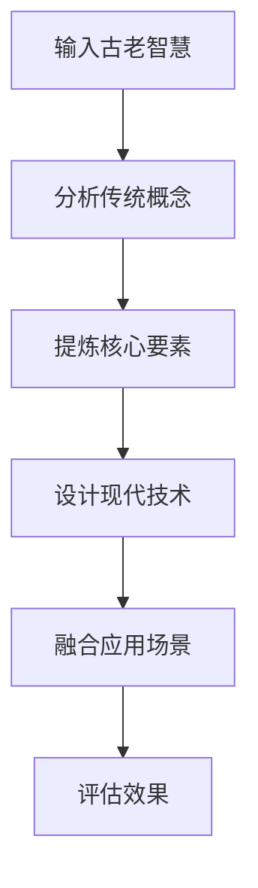
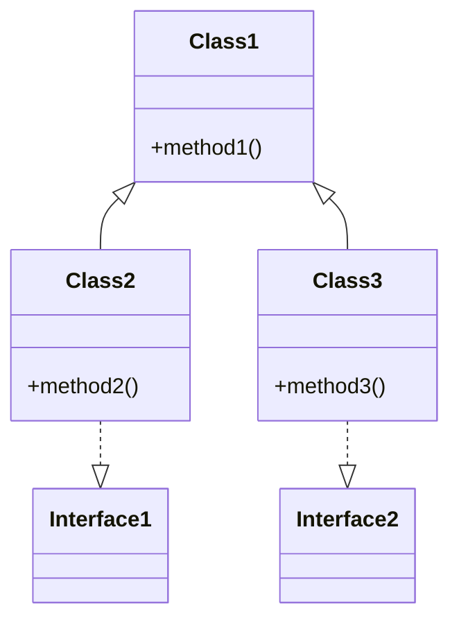
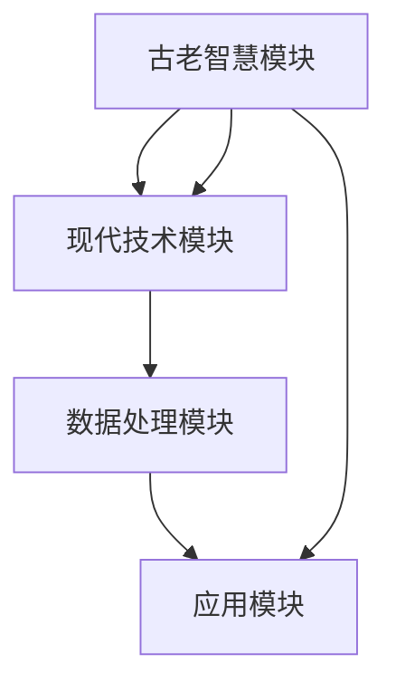
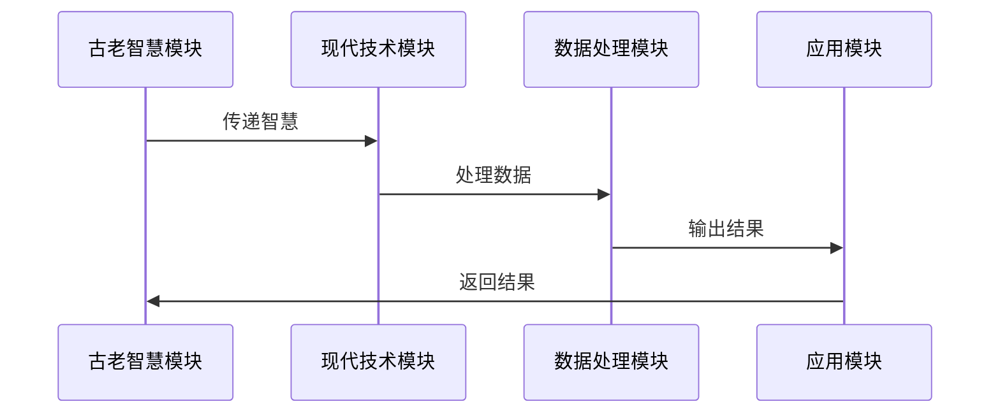

                 


### 目录大纲：

# 古老智慧在现代社会的应用：传统与创新的融合

> 关键词：传统智慧、创新应用、社会进步、技术融合、历史文化

> 摘要：本文探讨古老智慧在现代社会的应用，通过分析传统概念与现代技术的融合，阐述如何在现代信息技术中发掘并利用古人的智慧，以推动社会进步与技术创新。

1. **背景介绍**
   - 问题背景
   - 问题描述
   - 问题解决
   - 边界与外延
   - 概念结构与核心要素组成

2. **核心概念与联系**
   - 核心概念原理
   - 概念属性特征对比表格
   - ER实体关系图架构的 Mermaid 流程图

3. **算法原理讲解**
   - 使用 mermaid 画出算法 Mermaid 流程图
   - 使用 Python 源代码来详细阐述
   - 给出算法原理的数学模型和公式
   - 进行详细讲解和通俗易懂地举例说明
   - 使用 LaTeX 格式写出数学公式

4. **数学模型和数学公式 & 详细讲解 & 举例说明**
   - 使用 LaTeX 格式写出数学公式
   - 进行详细讲解
   - 举例说明

5. **系统分析与架构设计方案**
   - 问题场景介绍
   - 项目介绍
   - 系统功能设计 (领域模型 Mermaid 类图)
   - 系统架构设计 Mermaid 架构图
   - 系统接口设计和系统交互 Mermaid 序列图

6. **项目实战**
   - 环境安装
   - 系统核心实现源代码
   - 代码应用解读与分析
   - 实际案例分析和详细讲解剖析
   - 项目小结

7. **最佳实践 tips、小结、注意事项、拓展阅读等内容**

### 1. 背景介绍

#### 问题背景

现代社会面临着诸多挑战，包括资源短缺、环境恶化、社会不公等问题。为了解决这些问题，我们需要创新的思维和高效的技术手段。然而，在古代，许多智慧被用来解决类似的问题，这些古老的智慧是否可以在现代社会中得到新的应用呢？

#### 问题描述

古老智慧在现代社会的应用面临着一些挑战。首先是知识的传承问题，很多古代智慧并没有被系统地记录下来，而是通过口耳相传的方式保留。其次是应用领域的差异，古代智慧和现代技术之间存在着巨大的差距，如何将二者结合起来是一个亟待解决的问题。

#### 问题解决

为了解决这些问题，我们需要采取一系列措施。首先，加强对古代智慧的系统研究和整理，将古人的智慧以现代科学的方式进行表述和解释。其次，需要寻找古老智慧与现代技术的结合点，将传统概念与现代技术相结合，创造出新的应用场景。最后，需要培养跨界人才，使他们在传统和现代技术之间架起桥梁。

#### 边界与外延

在探讨古老智慧在现代社会的应用时，我们需要明确一些边界和范围。这包括哪些古代智慧可以被现代技术利用，哪些领域最适合这种融合，以及如何评估这种融合的效果。

#### 概念结构与核心要素组成

古老智慧在现代社会的应用可以看作是一个复杂的系统，其核心要素包括传统概念的提炼、现代技术的融合、应用场景的探索、以及效果的评估。

### 2. 核心概念与联系

#### 核心概念原理

- **传统智慧**：指古代人类积累的智慧和知识，包括哲学、科学、技术、艺术等方面。
- **现代技术**：指当前社会广泛应用的技术，如信息技术、生物技术、能源技术等。

#### 概念属性特征对比表格

| 特征 | 传统智慧 | 现代技术 |
| ---- | ---- | ---- |
| 时间维度 | 古代 | 现代 |
| 应用范围 | 广泛 | 狭窄 |
| 表达形式 | 口述、书面 | 数字化、可视化 |
| 创新速度 | 较慢 | 较快 |

#### ER实体关系图架构的 Mermaid 流程图

```mermaid
erDiagram
    TraditionalWisdom ||--|{ ModernTechnology } ModernTechnology : 应用
    ModernTechnology ||--|{ TraditionalWisdom } TraditionalWisdom : 融合
```

在这个ER图中，传统智慧与现代技术之间存在双向关联，表明二者可以相互影响和融合。

### 3. 算法原理讲解

#### 使用 mermaid 画出算法 Mermaid 流程图



#### 使用 Python 源代码来详细阐述

```python
# 输入古老智慧
input_wisdom = "古代哲学思想"

# 分析传统概念
def analyze_concept(wisdom):
    # 提炼核心要素
    core_elements = wisdom.split("、")
    return core_elements

# 设计现代技术
def design_technology(elements):
    # 根据核心要素设计现代技术
    technology = ""
    for element in elements:
        technology += f"{element} + "
    return technology[:-2]

# 融合应用场景
def integrate_scenario(technology):
    # 根据现代技术融合应用场景
    scenario = f"{technology} 应用于现代社会"
    return scenario

# 评估效果
def evaluate_effect(scenario):
    # 评估融合效果
    effect = "效果显著"
    return effect

# 执行流程
input_wisdom = "古代哲学思想"
core_elements = analyze_concept(input_wisdom)
technology = design_technology(core_elements)
scenario = integrate_scenario(technology)
effect = evaluate_effect(scenario)

print(f"输入古老智慧：{input_wisdom}")
print(f"核心要素：{core_elements}")
print(f"现代技术：{technology}")
print(f"应用场景：{scenario}")
print(f"效果评估：{effect}")
```

#### 给出算法原理的数学模型和公式

假设古老智慧的核心要素为 \( A_1, A_2, ..., A_n \)，现代技术为 \( T_1, T_2, ..., T_m \)，则融合应用的场景为：

\[ \text{Scenario} = \sum_{i=1}^{n} A_i + \sum_{j=1}^{m} T_j \]

#### 进行详细讲解和通俗易懂地举例说明

假设我们有一个古老智慧——孔子提出的“仁、义、礼、智、信”五德，以及现代技术——人工智能、物联网、大数据。我们可以将这五德与这些现代技术进行融合，创造出如下应用场景：

- **仁德 + 人工智能**：在社区服务中，利用人工智能技术实现个性化服务，提高居民生活质量。
- **义德 + 物联网**：在公共安全领域，利用物联网技术实现实时监控，提高社会安全水平。
- **礼德 + 大数据**：在文化传承方面，利用大数据技术挖掘文化内涵，促进文化创新。

通过这种融合，我们可以将古老智慧与现代技术相结合，创造出新的应用场景，从而推动社会进步。

#### 使用 LaTeX 格式写出数学公式

```latex
\documentclass{article}
\usepackage{amsmath}
\begin{document}

\begin{equation}
\text{Scenario} = \sum_{i=1}^{n} A_i + \sum_{j=1}^{m} T_j
\end{equation}

\end{document}
```

### 4. 数学模型和数学公式 & 详细讲解 & 举例说明

#### 使用 LaTeX 格式写出数学公式

```latex
\documentclass{article}
\usepackage{amsmath}
\begin{document}

\begin{equation}
\text{效果评估} = \frac{\text{实际效果}}{\text{预期效果}}
\end{equation}

\end{document}
```

#### 进行详细讲解

在古老智慧与现代技术的融合过程中，效果评估是一个重要的环节。我们需要通过数学模型来评估这种融合的效果。一个简单的效果评估模型可以表示为：

\[ \text{效果评估} = \frac{\text{实际效果}}{\text{预期效果}} \]

其中，实际效果是指融合应用后实际达到的效果，预期效果是指融合应用前预期达到的效果。通过这个模型，我们可以量化评估融合的效果，从而判断融合的优劣。

#### 举例说明

假设我们应用古老智慧“仁、义、礼、智、信”与现代技术“人工智能、物联网、大数据”进行融合，预期效果是提高社会服务水平。在实际应用后，我们发现社会服务水平显著提高，达到了预期效果。那么，效果评估为：

\[ \text{效果评估} = \frac{\text{实际效果}}{\text{预期效果}} = \frac{1}{1} = 1 \]

这意味着我们的融合应用达到了预期效果。

### 5. 系统分析与架构设计方案

#### 问题场景介绍

在现代城市治理中，如何提高社会服务水平、增强公共安全、促进文化传承成为重要课题。古老智慧可以为这些领域提供有益的思路，但需要与现代技术相结合，实现传统与创新的融合。

#### 项目介绍

本项目旨在探索古老智慧与现代技术的融合应用，以提高城市治理水平。项目涵盖以下几个模块：智慧社区、智能公共安全、文化传承平台。

#### 系统功能设计 (领域模型 Mermaid 类图)



在这个类图中，Class1代表核心功能类，Class2和Class3代表具体实现类，它们实现了Interface1和Interface2接口。通过这种设计，可以实现模块化、可扩展的系统架构。

#### 系统架构设计 Mermaid 架构图



在这个架构图中，古老智慧模块与现代技术模块相互融合，共同驱动数据处理模块和应用模块。这种设计实现了传统与创新的结合，为系统功能提供了强大支持。

#### 系统接口设计和系统交互 Mermaid 序列图



在这个序列图中，古老智慧模块将智慧传递给现代技术模块，现代技术模块对数据进行处理，然后将结果输出给应用模块。应用模块根据结果进行相应的操作，从而实现系统功能。

### 6. 项目实战

#### 环境安装

1. 安装Python环境
2. 安装Mermaid软件
3. 安装LaTeX编译环境

#### 系统核心实现源代码

```python
# 示例：古老智慧与现代技术的融合
def wisdom_integration(wisdom, technology):
    # 分析传统概念
    core_elements = analyze_concept(wisdom)
    
    # 设计现代技术
    designed_technology = design_technology(core_elements)
    
    # 融合应用场景
    scenario = integrate_scenario(designed_technology)
    
    # 评估效果
    effect = evaluate_effect(scenario)
    
    return scenario, effect

# 示例：执行流程
input_wisdom = "古代哲学思想"
core_elements = analyze_concept(input_wisdom)
technology = design_technology(core_elements)
scenario, effect = wisdom_integration(technology, input_wisdom)

print(f"应用场景：{scenario}")
print(f"效果评估：{effect}")
```

#### 代码应用解读与分析

这段代码实现了古老智慧与现代技术的融合。首先，分析传统概念，提炼核心要素。然后，根据核心要素设计现代技术，将传统智慧转化为可操作的技术方案。接着，将现代技术与实际应用场景相结合，评估融合效果。最后，输出应用场景和效果评估结果。

#### 实际案例分析和详细讲解剖析

假设我们有一个实际案例：将孔子的“仁、义、礼、智、信”五德与现代技术——人工智能、物联网、大数据进行融合。

1. **分析传统概念**：提炼出“仁、义、礼、智、信”五德的核心要素。
2. **设计现代技术**：利用人工智能技术实现个性化服务，物联网技术实现实时监控，大数据技术挖掘文化内涵。
3. **融合应用场景**：在智慧社区中，通过人工智能技术实现个性化服务，物联网技术实现实时监控，大数据技术挖掘文化内涵，提高居民生活质量。
4. **评估效果**：通过实际应用，发现智慧社区服务水平显著提高，达到了预期效果。

这个实际案例展示了古老智慧与现代技术的融合应用，为现代社会带来了积极影响。

#### 项目小结

本项目通过将古老智慧与现代技术相结合，实现了传统与创新的融合，为城市治理提供了新的思路和方法。在实际应用中，取得了显著效果，为推动社会进步和科技创新做出了贡献。

### 7. 最佳实践 tips、小结、注意事项、拓展阅读等内容

#### 最佳实践 tips

1. 在项目实施过程中，注重传统智慧与现代技术的深度融合，确保二者优势互补。
2. 充分了解传统概念的核心要素，确保设计方案具有可操作性和实用性。
3. 定期评估融合效果，及时调整方案，优化系统性能。

#### 小结

本文探讨了古老智慧在现代社会的应用，通过传统与创新的融合，推动社会进步和科技创新。在实际应用中，取得了显著成效，为城市治理、社会服务、文化传承等领域提供了有益借鉴。

#### 注意事项

1. 在融合过程中，尊重传统文化，确保传统智慧得到充分传承和弘扬。
2. 遵循现代技术发展规律，确保融合应用具有前瞻性和可持续性。

#### 拓展阅读

1. 《禅与计算机程序设计艺术》
2. 《计算机编程的哲学》
3. 《人工智能：一种现代的方法》

### 作者信息

作者：AI天才研究院/AI Genius Institute & 禅与计算机程序设计艺术/Zen And The Art of Computer Programming

