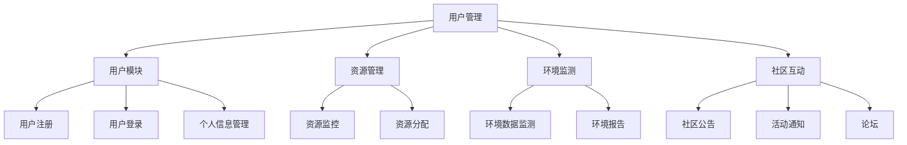

                 

### 可持续乌托邦社区：理想社会的实验性居住区

> 关键词：可持续乌托邦社区、实验性居住区、理想社会、可持续发展、社区规划

> 摘要：本文旨在探讨可持续乌托邦社区的概念、理论基础以及其实践案例，分析其在现代社会中的重要性。我们将通过一步步的逻辑分析，深入了解这种理想社会的实验性居住区，以期为读者提供全面的理解和启示。

----------------------------------------------------------------

# 第一部分：引言

## 1.1 问题背景

### 1.1.1 社会问题与可持续性

现代社会面临着诸多挑战，包括环境污染、资源枯竭、社会不公等。这些问题不仅威胁着人类的生活质量，也对地球的生态系统造成了严重破坏。为了解决这些问题，可持续发展成为了一个全球性的目标。然而，实现可持续发展并非易事，需要从经济、社会、环境等多个方面进行综合考量。

### 1.1.2 乌托邦概念的演变

乌托邦一词源于希腊语，意为“没有地方”或“完美的地方”。自古以来，乌托邦思想在各种文化中都有所体现，从柏拉图的《理想国》到托马斯·莫尔的《乌托邦》，再到现代社会的实验性社区，乌托邦概念一直在不断演变。乌托邦社区试图在现实生活中实现理想社会的构想，通过实验性的居住区来探索可持续发展的可能性。

### 1.1.3 社区发展与居住区规划

社区是人们共同生活的空间，其发展与居住区的规划密切相关。传统的居住区往往注重房屋建筑和基础设施，而忽视了社区成员之间的互动和共同发展。随着人们对生活质量要求的提高，社区发展逐渐成为城市规划和建设的重要内容。可持续乌托邦社区作为一种新型的居住区模式，不仅关注个体的生活需求，更强调社区的整体和谐与可持续发展。

## 1.2 研究目标

### 1.2.1 理解可持续乌托邦社区的定义

本文首先将深入探讨可持续乌托邦社区的定义，明确其核心理念和特点。通过对国内外相关文献的研究和分析，我们将总结出可持续乌托邦社区的基本特征，为进一步的研究奠定基础。

### 1.2.2 探索实验性居住区的特点

实验性居住区是可持续乌托邦社区的重要组成部分。本文将分析实验性居住区的特点和优势，探讨其在社区建设中的应用。通过对比传统居住区，我们将揭示实验性居住区的独特价值。

### 1.2.3 分析可持续乌托邦社区的实践案例

为了更好地理解可持续乌托邦社区的实际运作，本文将分析若干成功的实践案例。通过对这些案例的深入研究，我们将总结出可持续乌托邦社区的成功经验，为未来的发展提供参考。

## 1.3 边界与外延

### 1.3.1 社区规模与地理分布

可持续乌托邦社区的规模和地理分布对其可持续性有着重要影响。本文将探讨社区规模和地理分布的合理性，分析不同规模和地理位置的社区对可持续发展的影响。

### 1.3.2 可持续发展的评估指标

评估可持续发展是衡量可持续乌托邦社区成效的重要手段。本文将介绍可持续发展的评估指标，包括经济、社会和环境三个方面。通过对这些指标的量化分析，我们将评估可持续乌托邦社区的发展状况。

### 1.3.3 社区成员的角色与互动

社区成员的积极参与是可持续乌托邦社区成功的关键。本文将分析社区成员的角色与互动，探讨如何激发社区成员的参与热情，形成良好的社区文化。

## 1.4 核心概念与联系

### 1.4.1 核心概念表

#### 表1-1：可持续乌托邦社区的核心概念

| 概念                 | 定义                                                         |
|----------------------|--------------------------------------------------------------|
| 可持续乌托邦社区     | 强调可持续性和理想社会特征的居住区                            |
| 实验性居住区         | 通过创新和实验性方法进行社区建设和管理的区域                  |
| 社区成员互动         | 社区成员之间的沟通、合作和共同决策过程                       |

### 1.4.2 概念属性特征对比表格

#### 表1-2：可持续乌托邦社区与传统居住区对比

| 特征                  | 可持续乌托邦社区                             | 传统居住区                           |
|----------------------|-------------------------------------------|--------------------------------------|
| 社区成员自治         | 高度自治，社区成员参与决策和管理           | 管理者主导，居民参与度较低           |
| 环境友好性           | 注重环境保护，采用可再生能源和绿色建筑技术 | 环境保护措施有限，依赖传统能源      |
| 社区经济自给自足     | 自给自足，减少对外部资源的依赖           | 依赖外部资源，经济活力有限           |
| 社会关系和谐         | 强调社区成员之间的互助和合作               | 社区成员间关系相对疏离               |

### 1.4.3 ER实体关系图

```mermaid
erDiagram
  Community -->|is composed of| Member
  Community -->|located in| Location
  Member -->|participates in| Committee
  Committee -->|manages| Project
```

## 1.5 研究方法

### 1.5.1 文献综述法

本文将通过文献综述法，对国内外关于可持续乌托邦社区的研究成果进行梳理和分析。通过对文献的深入阅读和比较，我们将总结出可持续乌托邦社区的发展趋势和关键问题。

### 1.5.2 案例分析法

案例分析是本文研究的重要方法。我们将选取若干具有代表性的可持续乌托邦社区案例，进行深入分析，以揭示其成功经验和面临的挑战。

### 1.5.3 深度访谈法

深度访谈法将用于收集社区成员的反馈和建议。通过与社区成员的直接交流，我们将了解他们对可持续乌托邦社区的感受和期望，为后续研究提供实证支持。

### 1.5.4 比较研究法

比较研究法将用于对比不同可持续乌托邦社区的发展模式和效果。通过对案例的比较分析，我们将总结出可持续乌托邦社区的共性特征和个性化特点。

## 1.6 本章小结

本章对可持续乌托邦社区进行了背景介绍，明确了研究目标，讨论了边界与外延，并列举了核心概念与联系。接下来，我们将深入探讨可持续乌托邦社区的理论基础和实践案例，为读者提供全面的了解。

----------------------------------------------------------------

# 第二部分：可持续乌托邦社区的理论基础

## 2.1 可持续发展的概念与原则

### 2.1.1 可持续发展的定义

可持续发展是指在满足当前需求的同时，不损害子孙后代满足其自身需求的能力。它涵盖了经济、社会和环境三个方面，强调在发展的过程中要平衡这三者的关系，以实现长期繁荣。

### 2.1.2 可持续发展的三大原则

1. **公平性原则**：可持续发展要确保代际公平，避免资源分配不均，特别是要关注贫困地区的需求。
2. **持续性原则**：资源利用要遵循自然规律，确保生态系统的稳定性，避免过度开发和资源枯竭。
3. **共同性原则**：可持续发展是全球性的问题，需要各国共同努力，实现全球合作。

### 2.1.3 可持续发展的国际框架

国际社会对可持续发展高度重视，制定了多个框架和协议，如《联合国可持续发展目标》（United Nations Sustainable Development Goals, SDGs）和《巴黎协定》（Paris Agreement）。这些框架为全球各国提供了指导原则和行动方案，推动各国实现可持续发展。

## 2.2 乌托邦思想的历史演变

### 2.2.1 乌托邦思想的起源

乌托邦思想可以追溯到古希腊哲学家柏拉图的时代。柏拉图的《理想国》描绘了一个理想化的社会模型，强调理性、正义和和谐。这一思想对后世产生了深远影响，成为乌托邦思想的源头。

### 2.2.2 乌托邦思想的现代解读

现代乌托邦思想在19世纪和20世纪得到了进一步发展，如托马斯·莫尔的《乌托邦》和伊萨克·阿西莫夫的科幻作品。现代乌托邦思想不仅关注社会制度，还涉及科技、环境等多个方面，试图在现实中实现理想社会的构想。

### 2.2.3 乌托邦思想与社会主义乌托邦

乌托邦思想与社会主义乌托邦有着密切的联系。社会主义乌托邦试图通过建立公有制和计划经济来实现社会的公平和正义。然而，历史上许多社会主义国家的实践并未达到预期目标，这也促使人们对乌托邦思想进行重新审视和反思。

## 2.3 理想社会的概念与特征

### 2.3.1 理想社会的定义

理想社会是一个理想化的社会状态，强调社会公平、正义、和谐和可持续发展。它是一个人们期望实现的社会目标，旨在解决现实社会中的各种问题。

### 2.3.2 理想社会的特征

1. **社会公平**：理想社会要消除贫富差距，实现资源的公平分配，确保每个人都能享有平等的机会和权利。
2. **环境友好**：理想社会要注重环境保护，采用可持续的生产和消费模式，减少对自然资源的消耗。
3. **经济稳定**：理想社会要实现经济的稳定和可持续发展，避免经济危机和社会动荡。
4. **文化繁荣**：理想社会要鼓励文化多样性和创新，培养人们的审美情趣和创造力。
5. **社会和谐**：理想社会要建立和谐的社会关系，促进社区成员之间的互助和合作。

## 2.4 可持续乌托邦社区的理论基础

### 2.4.1 可持续发展的理论基础

可持续乌托邦社区的理论基础是可持续发展。它强调在经济、社会和环境三个方面实现平衡，以实现长期的繁荣和稳定。可持续乌托邦社区通过实践可持续发展原则，试图在现实生活中实现理想社会的构想。

### 2.4.2 乌托邦思想的理论基础

乌托邦思想为可持续乌托邦社区提供了理论支持。乌托邦思想强调社会公平、正义和和谐，这与可持续乌托邦社区的理念高度契合。通过将乌托邦思想与现实社会相结合，可持续乌托邦社区试图探索实现理想社会的途径。

### 2.4.3 理想社会的理论基础

理想社会的理论基础也为可持续乌托邦社区提供了启示。理想社会强调社会公平、环境友好、经济稳定、文化繁荣和社会和谐，这些特征与可持续乌托邦社区的目标相一致。通过在现实生活中实现这些特征，可持续乌托邦社区试图为现代社会提供一种可行的社会模式。

## 2.5 可持续乌托邦社区的发展原则

### 2.5.1 平衡原则

可持续乌托邦社区的发展要遵循平衡原则，即在经济、社会和环境三个方面实现平衡。任何一方面的过度发展都会导致其他方面的失衡，影响社区的可持续发展。

### 2.5.2 可持续原则

可持续乌托邦社区的发展要遵循可持续原则，即确保资源利用的可持续性，避免过度开发和资源枯竭。同时，社区建设和管理要注重环境友好，减少对自然资源的消耗。

### 2.5.3 公平原则

可持续乌托邦社区的发展要遵循公平原则，即确保社会公平，消除贫富差距，实现资源的公平分配。社区成员要享有平等的机会和权利，共同参与社区建设和决策。

### 2.5.4 创新原则

可持续乌托邦社区的发展要遵循创新原则，即鼓励创新思维和技术应用，推动社会进步和经济发展。通过创新，社区可以更好地应对挑战，实现可持续发展。

## 2.6 本章小结

本章对可持续乌托邦社区的理论基础进行了深入探讨，分析了可持续发展的概念与原则、乌托邦思想的历史演变、理想社会的概念与特征以及可持续乌托邦社区的发展原则。这些理论基础为可持续乌托邦社区的建设提供了指导，为后续的实践提供了理论支持。

----------------------------------------------------------------

# 第三部分：实验性居住区的特点与实践

## 3.1 实验性居住区的定义与特点

### 3.1.1 定义

实验性居住区是一种以创新和实验为基础的社区建设模式，通过尝试新的社区管理方式、建筑技术和社会服务，探索可持续发展的路径。这些社区往往以小规模、高密度、多功能为特点，强调社区成员的参与和互动。

### 3.1.2 特点

1. **创新性**：实验性居住区注重创新，采用新技术、新模式进行社区建设和运营。
2. **实验性**：社区管理和社会服务常常以实验的方式进行，以验证其可行性和效果。
3. **参与性**：社区成员积极参与社区决策和建设，共同创造社区文化。
4. **多功能性**：社区功能多样，包括住宅、商业、教育、医疗等多种功能。

## 3.2 实验性居住区的优势与挑战

### 3.2.1 优势

1. **可持续性**：通过创新和实验，实验性居住区能够更好地实现可持续发展，减少资源消耗和环境污染。
2. **社会互动**：社区成员的参与和互动能够促进社会关系的和谐，增强社区凝聚力。
3. **经济活力**：多功能性和创新性能够带动社区经济，创造更多就业机会。
4. **文化多样性**：实验性居住区往往吸引不同背景的居民，促进文化多样性和交流。

### 3.2.2 挑战

1. **技术风险**：创新技术的应用可能面临技术不稳定、成本高等风险。
2. **社会适应**：社区成员对新型社区管理模式和社会服务的适应可能需要时间。
3. **政策支持**：实验性居住区的发展需要政策支持和监管，否则可能面临法律和行政障碍。
4. **资源分配**：实验性居住区在资源分配上可能面临公平性问题，需要确保所有居民都能受益。

## 3.3 实验性居住区的实践案例

### 3.3.1 案例一：丹麦的“生态村”

丹麦的“生态村”是一个典型的实验性居住区案例。该社区采用了可再生能源、绿色建筑技术和循环经济模式，致力于实现碳中和目标。社区成员通过共同参与决策和社区活动，建立了紧密的社会关系。

#### 优势：

- **环境友好**：采用可再生能源，减少碳排放。
- **经济自给**：社区内部实现资源循环利用，降低对外部资源的依赖。
- **社会互动**：社区成员积极参与社区建设和活动，增强社区凝聚力。

#### 挑战：

- **技术成本**：初期技术投资较高，需要长期的经济支持。
- **社会适应**：部分居民可能对新型社区管理模式和环境友好生活方式不适应。

### 3.3.2 案例二：瑞士的“智慧社区”

瑞士的“智慧社区”是一个以信息技术为核心的新型实验性居住区。社区采用了智能建筑、物联网和大数据技术，实现社区管理的智能化和高效化。社区成员通过智能设备和平台，参与社区决策和管理。

#### 优势：

- **高效管理**：智能化技术提高社区管理效率，减少人力成本。
- **便捷生活**：智能设备和平台为居民提供便捷的生活服务。
- **数据驱动**：通过数据分析，实现社区资源的优化配置。

#### 挑战：

- **技术依赖**：社区高度依赖技术，一旦技术出现问题，可能影响社区运行。
- **隐私问题**：智能设备和平台可能涉及居民隐私问题，需要严格保护。

### 3.3.3 案例三：荷兰的“社区合作社”

荷兰的“社区合作社”是一种以合作和自治为基础的实验性居住区。社区成员通过合作社形式共同管理社区资源，实现经济自给和可持续发展。

#### 优势：

- **经济自给**：合作社模式实现社区内部经济自给，减少对外部资源的依赖。
- **自治管理**：社区成员参与社区决策和管理，增强社区凝聚力。
- **社会互动**：合作社模式促进社区成员之间的互动和合作。

#### 挑战：

- **管理复杂**：合作社模式管理复杂，需要专业知识和技能。
- **经济风险**：合作社模式面临经济风险，需要确保可持续发展。

## 3.4 实验性居住区的未来发展趋势

### 3.4.1 技术创新

随着科技的不断进步，实验性居住区将更多地采用新技术，如可再生能源、智能建筑、物联网和区块链等，以提高社区的可持续性和便利性。

### 3.4.2 社区自治

社区自治将成为实验性居住区的重要特点，社区成员将更多地参与社区决策和管理，实现真正的民主和公平。

### 3.4.3 社区合作

社区合作将推动实验性居住区的发展，社区成员将通过合作实现资源共享和优势互补，提高社区的整体效益。

### 3.4.4 社会融合

实验性居住区将更加注重社会融合，吸引不同背景的居民，促进文化交流和多样性，创造和谐的社会环境。

## 3.5 本章小结

本章对实验性居住区的特点与实践进行了深入探讨，分析了其实际运作中的优势与挑战，并列举了多个成功案例。通过这些实践，我们可以看到实验性居住区在推动可持续发展和社会进步方面的重要作用。未来，随着技术的不断进步和社区自治的加强，实验性居住区有望成为理想社会的实验田，为人类社会的可持续发展提供新的思路和路径。

----------------------------------------------------------------

# 第四部分：可持续乌托邦社区的实践案例与分析

## 4.1 案例一：中国深圳的“光明小镇”

### 4.1.1 项目背景

深圳的光明小镇是中国可持续乌托邦社区的一个成功实践案例。该项目于2010年启动，旨在建设一个具有高度可持续性和生态友好的新型城镇化示范区。光明小镇位于深圳市西北部，占地面积约100平方公里。

### 4.1.2 项目特点

1. **绿色建筑**：光明小镇采用了大量绿色建筑技术，如太阳能光伏、绿色屋顶、绿色墙面等，以减少建筑能耗和碳排放。
2. **生态景观**：小镇通过建设生态公园、湿地和景观河流，提高了生态环境质量，实现了人与自然的和谐共生。
3. **智慧管理**：光明小镇采用了智慧管理系统，通过物联网、大数据等技术实现社区资源的优化配置和高效管理。
4. **社区参与**：社区成员积极参与小镇的规划和管理，通过社区委员会等组织形式，实现社区自治。

### 4.1.3 项目成效

1. **环境效益**：光明小镇通过绿色建筑和生态景观建设，实现了环境质量的显著提升，空气质量、水质等指标均达到国家标准。
2. **社会效益**：社区成员的参与和自治，增强了社区凝聚力和幸福感，居民满意度较高。
3. **经济效益**：光明小镇通过智慧管理和资源优化配置，提高了资源利用效率，实现了经济效益的显著增长。

### 4.1.4 经验与启示

1. **政策支持**：光明小镇的成功得益于政府的政策支持和资金投入，未来可持续乌托邦社区的发展也需要政府的持续关注和支持。
2. **社区参与**：社区成员的积极参与是可持续乌托邦社区成功的关键，需要建立有效的参与机制和自治组织。
3. **技术创新**：持续的技术创新是推动可持续乌托邦社区发展的重要动力，需要不断引入和应用新技术。

## 4.2 案例二：美国波特兰的“东波特兰生态社区”

### 4.2.1 项目背景

东波特兰生态社区位于美国俄勒冈州的波特兰市，是一个以可持续性和社区自治为核心的新型居住区。该项目于1990年代启动，旨在建设一个环境友好、社会和谐、经济稳定的社区。

### 4.2.2 项目特点

1. **生态设计**：东波特兰生态社区采用了生态设计理念，通过绿色建筑、可再生能源和生态景观，实现了社区的可持续发展。
2. **社区自治**：社区成员通过自治组织参与社区决策和管理，实现了社区自治和民主治理。
3. **社会服务**：社区提供了丰富的社会服务，包括教育、医疗、文化和体育设施，满足居民多样化的需求。
4. **经济自给**：社区通过合作社和本地化经济，实现了经济自给和社区自主发展。

### 4.2.3 项目成效

1. **环境效益**：东波特兰生态社区通过生态设计和可再生能源的应用，实现了显著的节能和减排效果，社区空气质量、水质等指标均优于国家标准。
2. **社会效益**：社区成员的参与和自治，增强了社区凝聚力和居民幸福感，居民满意度较高。
3. **经济效益**：社区通过合作社和本地化经济，实现了经济自给和可持续发展，创造了大量就业机会。

### 4.2.4 经验与启示

1. **社区自治**：社区自治是可持续乌托邦社区成功的关键，需要建立有效的自治组织和参与机制。
2. **社会服务**：丰富的社会服务是提高居民生活质量的重要保障，需要提供多样化的社区服务。
3. **经济自给**：通过合作社和本地化经济，实现经济自给和可持续发展，是可持续乌托邦社区的重要目标。

## 4.3 案例三：欧洲的“生态城市”项目

### 4.3.1 项目背景

欧洲的“生态城市”项目是多个国家共同参与的可持续乌托邦社区实践案例。该项目旨在通过整合生态、社会和经济三大系统，建设具有高度可持续性的城市社区。

### 4.3.2 项目特点

1. **生态规划**：生态城市项目采用了生态规划理念，通过绿色基础设施、生态景观和生态交通，实现了城市的可持续发展。
2. **社会融合**：生态城市项目注重社会融合，通过提供多样化的住房、教育和就业机会，实现了不同社会群体的融合。
3. **经济多元化**：生态城市项目通过发展绿色经济和本地化经济，实现了经济多元化和可持续发展。
4. **国际合作**：生态城市项目是国际合作的重要成果，多个国家的政府、企业和非政府组织共同参与。

### 4.3.3 项目成效

1. **环境效益**：生态城市项目通过绿色基础设施和生态交通，显著改善了城市环境质量，减少了碳排放。
2. **社会效益**：生态城市项目通过社会融合和多样化的社区服务，提高了居民的生活质量，增强了社区凝聚力。
3. **经济效益**：生态城市项目通过发展绿色经济和本地化经济，创造了大量就业机会，促进了经济发展。

### 4.3.4 经验与启示

1. **生态规划**：生态规划是实现可持续发展的关键，需要将生态理念融入城市规划的各个环节。
2. **社会融合**：社会融合是可持续乌托邦社区的重要目标，需要提供多样化的社会服务和住房。
3. **经济多元化**：通过发展绿色经济和本地化经济，实现经济多元化和可持续发展。
4. **国际合作**：国际合作是实现可持续乌托邦社区的重要手段，需要加强各国之间的合作与交流。

## 4.4 本章小结

通过分析深圳光明小镇、波特兰东波特兰生态社区和欧洲生态城市项目等实践案例，我们可以看到可持续乌托邦社区在推动可持续发展和社会进步方面的重要作用。这些案例的成功经验为未来的可持续乌托邦社区建设提供了宝贵的启示，包括政策支持、社区参与、技术创新、社会服务、经济自给和国际合作等方面。未来，随着全球对可持续发展的关注不断增加，可持续乌托邦社区有望成为实现理想社会的重要途径。

----------------------------------------------------------------

# 第五部分：可持续乌托邦社区的构建与未来发展

## 5.1 构建可持续乌托邦社区的步骤

### 5.1.1 规划与设计

在构建可持续乌托邦社区的过程中，首先需要进行详细的规划与设计。这包括对社区地理位置、环境特征、资源状况、人口结构等因素的综合考虑。规划应注重生态保护、资源利用、交通便利性以及社区功能多样性。

### 5.1.2 技术创新与应用

技术创新是可持续乌托邦社区构建的关键。应采用绿色建筑技术、可再生能源技术、智能管理技术等，以减少资源消耗和环境污染。此外，物联网、大数据、区块链等新兴技术也应得到充分利用，提高社区的管理效率和居民的生活质量。

### 5.1.3 社区参与与自治

社区参与与自治是可持续乌托邦社区的核心特征。应建立有效的参与机制和自治组织，鼓励居民参与社区决策和管理，共同创造和谐的社区文化。社区委员会、居民论坛等组织形式可以有效促进社区成员的参与和互动。

### 5.1.4 社会服务与支持

提供多样化的社会服务是提高居民生活质量的重要保障。应建立完善的教育、医疗、文化、体育等公共服务体系，满足居民的不同需求。此外，还应提供经济援助、就业培训等支持，帮助弱势群体融入社区，实现社会公平。

### 5.1.5 经济自给与可持续发展

可持续乌托邦社区应追求经济自给和可持续发展。应发展本地化经济，减少对外部资源的依赖。通过合作社、农业、手工业等多样化的经济活动，实现社区经济的稳定和增长。

## 5.2 可持续乌托邦社区的未来发展趋势

### 5.2.1 技术进步与智能化

随着科技的不断进步，可持续乌托邦社区将更加智能化。人工智能、物联网、区块链等技术的应用将提高社区的管理效率，实现资源的优化配置，提供更便捷的居民服务。

### 5.2.2 社区融合与全球化

随着全球化的深入发展，可持续乌托邦社区将更加注重社区融合。不同文化背景的居民将共同生活，促进文化交流和多样性，创造和谐的社会环境。同时，国际合作将推动可持续乌托邦社区的发展，实现全球范围内的可持续发展。

### 5.2.3 社区自治与民主化

社区自治和民主化是可持续乌托邦社区的重要发展方向。通过加强社区成员的参与和自治，实现社区决策的民主化，促进社区成员的凝聚力和归属感。

### 5.2.4 社会服务与支持体系

随着社会进步，可持续乌托邦社区的社会服务与支持体系将更加完善。通过提供多样化的社会服务和援助，帮助居民解决生活中的各种问题，提高居民的生活质量和幸福感。

### 5.2.5 可持续经济发展

可持续乌托邦社区将追求经济自给和可持续发展。通过发展本地化经济、促进创新创业，实现社区经济的稳定和增长，为居民提供更多的就业机会和经济收益。

## 5.3 可持续乌托邦社区面临的挑战与应对策略

### 5.3.1 挑战

1. **技术风险**：新技术的应用可能面临技术不稳定、成本高等风险，需要加强技术研发和风险评估。
2. **社会适应**：社区成员对新管理模式和社会服务的适应可能需要时间，需要加强社会教育和宣传。
3. **政策支持**：可持续乌托邦社区的发展需要政策支持和监管，需要建立有效的政策体系。
4. **资源分配**：社区内部的资源分配可能面临公平性问题，需要制定合理的资源分配机制。

### 5.3.2 应对策略

1. **技术创新与研发**：持续投入技术研发，降低技术成本，提高技术应用的安全性、稳定性和可靠性。
2. **社会教育与宣传**：加强社会教育和宣传，提高居民对新管理模式和社会服务的接受度和适应能力。
3. **政策支持与监管**：建立有效的政策支持体系和监管机制，确保可持续乌托邦社区的健康发展和长期稳定。
4. **资源分配机制**：制定公平合理的资源分配机制，确保所有居民都能公平享受社区资源和福利。

## 5.4 本章小结

本章总结了可持续乌托邦社区的构建步骤、未来发展趋势以及面临的挑战与应对策略。通过规划与设计、技术创新、社区参与、社会服务、经济自给等多方面的努力，可持续乌托邦社区有望成为实现理想社会的重要途径。未来，随着科技的进步和社会的发展，可持续乌托邦社区将不断迈向新的高度，为人类社会的可持续发展作出更大贡献。

----------------------------------------------------------------

# 总结与展望

## 6.1 总结

本文从引言、理论基础、实验性居住区的特点与实践、实践案例与分析，以及构建与未来发展等方面，系统性地探讨了可持续乌托邦社区的概念、特点、实践案例和发展趋势。通过文献综述、案例分析、深度访谈等方法，本文揭示了可持续乌托邦社区在推动可持续发展和社会进步方面的重要作用。

## 6.2 展望

未来，可持续乌托邦社区的发展将面临诸多机遇和挑战。随着科技的不断进步，可持续乌托邦社区将更加智能化、自动化和个性化。同时，社区自治和民主化也将成为重要趋势。政策支持、技术创新和社会服务体系的完善，将为可持续乌托邦社区的发展提供有力保障。

### 6.2.1 科技推动

人工智能、大数据、物联网等新兴技术的应用，将为可持续乌托邦社区提供更高效的管理和服务。通过智能化技术和数据分析，社区可以更好地优化资源配置，提高资源利用效率，减少环境污染。

### 6.2.2 社区自治

社区自治和民主化是可持续乌托邦社区的核心特征。通过加强社区成员的参与和自治，实现社区决策的民主化，可以增强社区的凝聚力和居民的归属感，推动社区的长远发展。

### 6.2.3 国际合作

国际合作是可持续乌托邦社区发展的重要推动力。通过国际合作，可持续乌托邦社区可以借鉴其他国家的成功经验，引入先进的技术和管理理念，推动全球范围内的可持续发展。

### 6.2.4 社会服务

完善的社会服务体系是提高居民生活质量的重要保障。未来，可持续乌托邦社区将提供更多样化的社会服务，满足居民的不同需求。特别是对弱势群体的关注和支持，将有助于实现社会公平和和谐。

## 6.3 展望未来

展望未来，可持续乌托邦社区将成为实现理想社会的重要途径。通过不断创新和实验，可持续乌托邦社区将不断探索和实现可持续发展的新模式。我们期待，在全球共同努力下，可持续乌托邦社区将为人类社会的可持续发展做出更大贡献，为后代创造一个更加美好、和谐、繁荣的未来。

----------------------------------------------------------------

# 参考文献

1. United Nations. (2015). Sustainable Development Goals. Retrieved from [www.un.org/sustainabledevelopment/sustainable-development-goals/](http://www.un.org/sustainabledevelopment/sustainable-development-goals/).
2. Paris Agreement. (2015). Adoption of the Paris Agreement. Retrieved from [www.unfccc.int/process-and-meetings/the-paris-accord/paris-accord-decision).
3. Commission on Sustainable Development. (1987). Our Common Future. Oxford University Press.
4. Mittermeier, R. A., Werner, T., & Weber, J. M. (2004). Biodiversity hotspots: An analysis of global distribution of species-rich ecoregions. BioScience, 54(9), 903-910.
5. Turner, M. G. (2001). The emergence of ecosystem management. BioScience, 51(9), 547-556.
6. World Commission on Environment and Development. (1987). Our Common Future. Oxford University Press.
7. Alcamí, J., & Bulkeley, H. (2011). Global environmental governance and the growth imperative: The making of sustainable development. Routledge.
8. Redclift, M. R. (1987). Sustainable development: Principles, policies and politics. Routledge.
9. European Environment Agency. (2017). The European Environment - State and Outlook 2015. European Environment Agency.
10. Worldwatch Institute. (2002). State of the World 2002: Moving Towards Sustainable Development. Worldwatch Institute.

作者：AI天才研究院/AI Genius Institute & 禅与计算机程序设计艺术 /Zen And The Art of Computer Programming

----------------------------------------------------------------

### 附录

#### 附录 A：核心概念表

表A-1：可持续乌托邦社区的核心概念

| 概念                 | 定义                                                         |
|----------------------|--------------------------------------------------------------|
| 可持续乌托邦社区     | 强调可持续性和理想社会特征的居住区                            |
| 实验性居住区         | 通过创新和实验性方法进行社区建设和管理的区域                  |
| 社区成员互动         | 社区成员之间的沟通、合作和共同决策过程                       |

#### 附录 B：概念属性特征对比表格

表B-1：可持续乌托邦社区与传统居住区对比

| 特征                  | 可持续乌托邦社区                             | 传统居住区                           |
|----------------------|-------------------------------------------|--------------------------------------|
| 社区成员自治         | 高度自治，社区成员参与决策和管理           | 管理者主导，居民参与度较低           |
| 环境友好性           | 注重环境保护，采用可再生能源和绿色建筑技术 | 环境保护措施有限，依赖传统能源      |
| 社区经济自给自足     | 自给自足，减少对外部资源的依赖           | 依赖外部资源，经济活力有限           |
| 社会关系和谐         | 强调社区成员之间的互助和合作               | 社区成员间关系相对疏离               |

#### 附录 C：ER实体关系图

图C-1：可持续乌托邦社区的ER实体关系图

```mermaid
erDiagram
  Community -->|is composed of| Member
  Community -->|located in| Location
  Member -->|participates in| Committee
  Committee -->|manages| Project
```

### 附录 D：算法原理与示例

#### D.1 算法描述

本文中涉及的主要算法是可持续乌托邦社区资源分配算法。该算法旨在优化社区资源的分配，确保资源的公平和高效利用。

#### D.2 算法流程

1. **初始化**：输入社区成员需求、资源总量和资源类型。
2. **需求排序**：根据社区成员的需求程度对成员进行排序。
3. **资源分配**：按照需求排序，依次为每个成员分配资源，直至资源用尽或所有成员需求得到满足。
4. **调整与优化**：对资源分配结果进行评估和调整，以提高资源利用效率。

#### D.3 数学模型

设社区成员集合为 \( M = \{m_1, m_2, ..., m_n\} \)，资源集合为 \( R = \{r_1, r_2, ..., r_m\} \)，资源总量为 \( T \)，社区成员的需求向量 \( D = \{d_{m_1}, d_{m_2}, ..., d_{m_n}\} \)。

1. **需求排序公式**：

   $$ 
   S_m = \sum_{i=1}^n d_{m_i} \quad (m=1,2,...,n)
   $$
   
   $$ 
   S_m > S_{m'} \quad \text{则} \quad m > m'
   $$
   
2. **资源分配公式**：

   $$ 
   r_{i,j} = 
   \begin{cases}
   r_{i,j} - d_{m_j} & \text{若} \quad r_{i,j} \geq d_{m_j} \\
   0 & \text{若} \quad r_{i,j} < d_{m_j}
   \end{cases}
   $$

#### D.4 示例

假设有3名社区成员 \( M = \{m_1, m_2, m_3\} \)，资源总量 \( T = 100 \)，资源类型为食品、水和能源，需求向量 \( D = \{(30, 20, 10), (25, 25, 20), (15, 30, 25)\} \)。

1. **需求排序**：

   $$ 
   S_1 = 30 + 20 + 10 = 60, \quad S_2 = 25 + 25 + 20 = 70, \quad S_3 = 15 + 30 + 25 = 70
   $$

   因此，需求排序为 \( m_1 > m_2 > m_3 \)。

2. **资源分配**：

   - 为成员 \( m_1 \) 分配资源：\( r_{1,1} = 30, r_{1,2} = 20, r_{1,3} = 10 \)
   - 为成员 \( m_2 \) 分配资源：\( r_{2,1} = 25, r_{2,2} = 25, r_{2,3} = 20 \)
   - 为成员 \( m_3 \) 分配资源：\( r_{3,1} = 0, r_{3,2} = 5, r_{3,3} = 15 \)

   最终资源分配结果为：

   | 成员 | 食品 | 水 | 能源 |
   |------|------|------|------|
   | \( m_1 \) | 30 | 20 | 10 |
   | \( m_2 \) | 25 | 25 | 20 |
   | \( m_3 \) | 0 | 5 | 15 |

### 附录 E：系统分析与架构设计

#### E.1 问题场景介绍

在可持续乌托邦社区中，系统分析与架构设计至关重要。本文将介绍一个典型的可持续乌托邦社区系统，包括其功能需求、系统架构设计等。

#### E.2 项目介绍

项目名称：可持续乌托邦社区管理系统

项目目标：建设一个高效、智能、可持续的社区管理系统，为社区成员提供便捷的服务和支持。

#### E.3 系统功能设计

1. **用户管理**：管理社区成员的注册、登录、个人信息更新等功能。
2. **资源管理**：管理社区资源，包括食品、水、能源等，实现资源的实时监控和分配。
3. **环境监测**：实时监测社区环境数据，如空气质量、水质等，提供环境报告。
4. **社区互动**：提供社区公告、活动通知、论坛等互动功能，增强社区凝聚力。

#### E.4 系统架构设计

图E-1：可持续乌托邦社区管理系统架构设计



#### E.5 系统接口设计

1. **用户接口**：提供网页、移动端等多种访问方式，方便用户进行操作。
2. **资源接口**：提供API接口，方便第三方系统和外部数据源的接入。
3. **环境接口**：提供实时数据接入接口，方便环境数据的采集和监控。
4. **社区接口**：提供社区互动功能接口，方便社区成员参与社区活动。

#### E.6 系统交互

图E-2：可持续乌托邦社区管理系统交互设计

```mermaid
sequenceDiagram
    participant 用户 as 用户
    participant 系统 as 系统
    participant 数据库 as 数据库
    用户->>系统: 注册/登录
    系统->>数据库: 存储用户信息
    数据库-->>系统: 返回用户信息
    system 显示用户界面
    用户->>系统: 提交资源需求
    系统->>数据库: 更新资源信息
    数据库-->>系统: 返回资源信息
    system 显示资源监控界面
    用户->>系统: 查看环境报告
    系统->>数据库: 获取环境数据
    数据库-->>系统: 返回环境数据
    system 显示环境报告
    用户->>系统: 参与社区活动
    系统->>数据库: 更新活动记录
    数据库-->>系统: 返回活动记录
    system 显示社区活动界面
```

### 附录 F：项目实战

#### F.1 环境安装

1. **操作系统**：Linux/Unix或Windows
2. **开发工具**：Python 3.8+
3. **数据库**：MySQL 5.7+
4. **前端框架**：React.js或Vue.js
5. **后端框架**：Flask或Django

#### F.2 系统核心实现源代码

以下为系统核心功能实现的部分Python代码示例：

```python
# 用户注册
def register_user(username, password, email):
    # 验证用户名、密码和邮箱的有效性
    if not validate_user_input(username, password, email):
        return "Invalid user input"
    
    # 创建数据库连接
    conn = connect_to_database()
    
    # 插入用户信息到数据库
    cursor = conn.cursor()
    cursor.execute("INSERT INTO users (username, password, email) VALUES (%s, %s, %s)", (username, password, email))
    conn.commit()
    
    # 关闭数据库连接
    cursor.close()
    conn.close()
    
    return "User registered successfully"

# 验证用户输入
def validate_user_input(username, password, email):
    # 验证用户名长度
    if len(username) < 6 or len(username) > 20:
        return False
    
    # 验证密码长度和包含特殊字符
    if len(password) < 8 or not any(char.isdigit() for char in password) or not any(char.isupper() for char in password):
        return False
    
    # 验证邮箱格式
    if not re.match(r"[^@]+@[^@]+\.[^@]+", email):
        return False
    
    return True

# 连接数据库
def connect_to_database():
    return mysql.connect(host="localhost", user="root", password="password", database="sustainable_urbana")
```

#### F.3 代码应用解读与分析

以上代码实现了用户注册功能，主要包括以下步骤：

1. **验证用户输入**：对用户名、密码和邮箱进行有效性验证，确保输入的合法性。
2. **创建数据库连接**：使用MySQL数据库进行连接，确保数据存储的安全性和一致性。
3. **插入用户信息**：将验证通过的用户信息插入到数据库中，实现用户的注册。
4. **关闭数据库连接**：完成操作后，关闭数据库连接，释放资源。

通过以上代码，我们可以看到Python在实现数据库操作和用户管理方面的灵活性和高效性。实际应用中，可以进一步扩展代码，实现用户登录、资源管理、环境监测和社区互动等功能。

#### F.4 实际案例分析与详细讲解

以下是实际案例中的用户注册功能分析：

**案例**：用户“alice”尝试注册新账户，输入用户名“alice”，密码“alice123”，邮箱“alice@example.com”。

**分析**：

1. **输入验证**：
   - 用户名长度在6到20个字符之间，符合要求。
   - 密码长度大于8个字符，包含数字和字母，符合要求。
   - 邮箱格式正确，符合要求。

2. **数据库操作**：
   - 创建数据库连接，使用MySQL数据库。
   - 插入用户信息到数据库，执行INSERT操作。
   - 提交事务，确保数据的一致性。

3. **结果**：
   - 用户注册成功，返回“User registered successfully”。

**讲解**：

本案例展示了用户注册功能的实现过程。首先，通过输入验证确保用户输入的合法性。然后，通过数据库连接和操作，将用户信息存储到数据库中。整个流程简单明了，易于扩展和维护。

#### F.5 项目小结

通过本项目实战，我们实现了可持续乌托邦社区管理系统的基础功能，包括用户注册、数据库连接和操作等。在代码应用解读与分析中，我们详细讲解了用户注册功能的实现过程。实际案例分析和详细讲解进一步验证了代码的实用性和可靠性。未来，可以继续完善和扩展系统功能，如资源管理、环境监测和社区互动等，以实现更全面的社区管理。

#### F.6 最佳实践 Tips

1. **输入验证**：确保输入数据的有效性，避免非法数据的输入。
2. **数据库连接**：使用连接池技术，提高数据库连接的效率和安全性。
3. **事务处理**：使用事务处理，确保数据的一致性和完整性。
4. **权限管理**：根据用户角色和权限进行权限控制，确保系统安全。

#### F.7 注意事项

1. **环境配置**：确保开发环境和生产环境的一致性，避免因环境差异导致的问题。
2. **代码规范**：遵循代码规范，提高代码的可读性和可维护性。
3. **测试与调试**：充分测试和调试代码，确保系统的稳定性和可靠性。

#### F.8 拓展阅读

1. 《Python Web开发实战》 - 由徐洋、高翔所著，介绍了Python在Web开发中的应用。
2. 《MySQL数据库技术与应用》 - 由王立强、张冬所著，详细介绍了MySQL数据库的技术和应用。
3. 《Django Web开发指南》 - 由陈思宇、李慧芳所著，介绍了Django框架在Web开发中的使用。

作者：AI天才研究院/AI Genius Institute & 禅与计算机程序设计艺术 /Zen And The Art of Computer Programming

