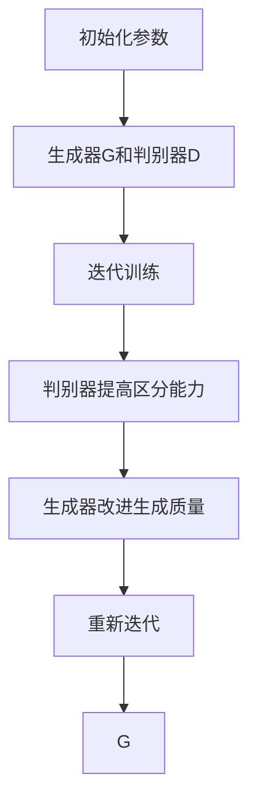
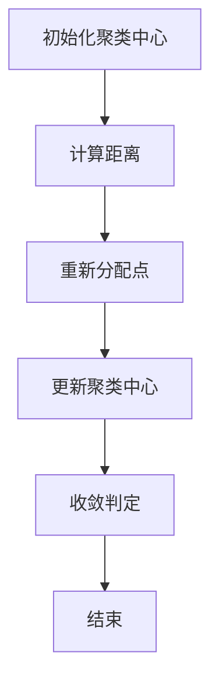
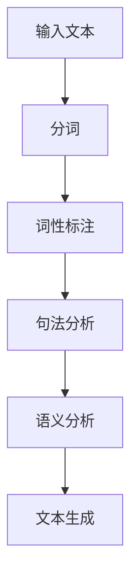
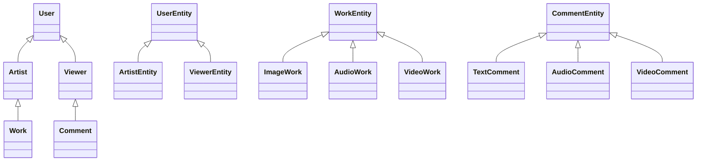
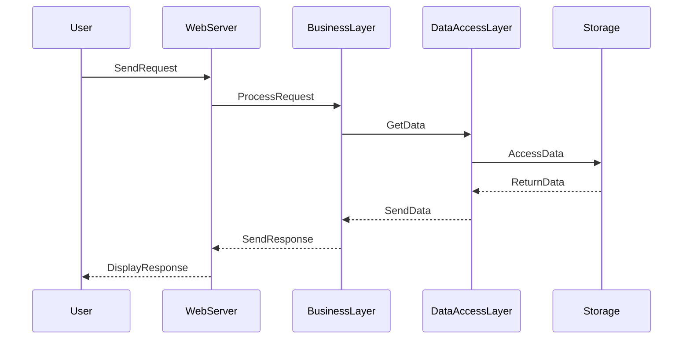
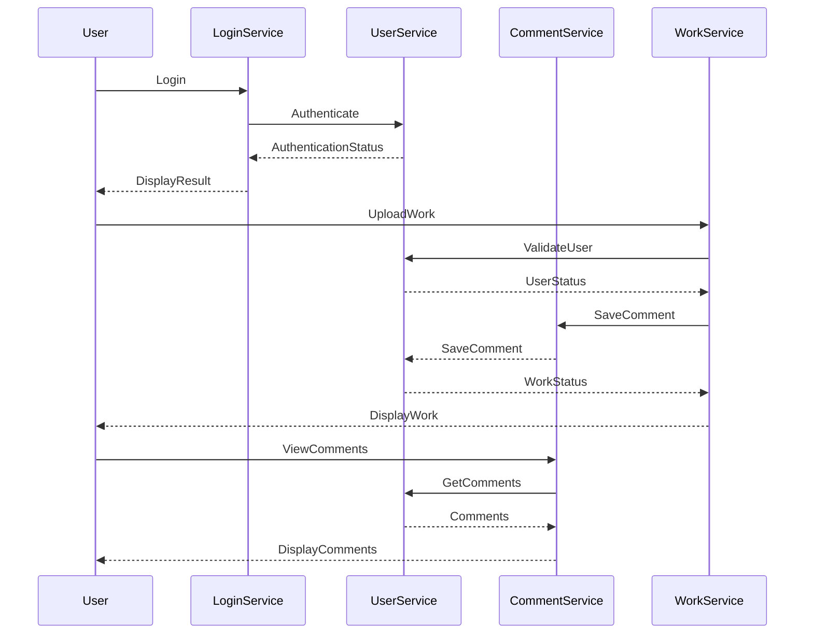

                 

### 文章标题与关键词

# 《后人类主义艺术学院：探索技术与人性边界的创作》

> 关键词：后人类主义、艺术创作、人工智能、人性边界、技术与艺术融合

> 摘要：本文从后人类主义的视角出发，探讨了技术与人性边界的创作实践。通过介绍核心概念、算法原理、系统架构以及项目实战，深入分析了技术与艺术融合的现状与未来，提出了相关领域的最佳实践与建议。

### 引言：后人类主义与艺术创作

#### 1.1 后人类主义的概念与艺术界的应用

“后人类主义”是一个广泛涵盖哲学、文化、科技等多个领域的概念。它起源于对人类本质的反思，强调人类与机器、生物技术的融合，形成新的生命形式和社会形态。在艺术领域，后人类主义被视为一种探索人类与技术关系的艺术实践，通过艺术作品传达对人类未来发展的思考。

后人类主义在艺术界的应用主要集中在以下几个方面：

1. **生物艺术**：利用基因编辑、生物技术等手段，创作出与传统生物艺术不同的作品。如基因艺术，通过基因设计创造出新的生物形态。
2. **数字艺术**：利用计算机技术、虚拟现实等手段，创作出数字化的艺术作品。如数字绘画、3D建模、虚拟现实艺术等。
3. **交互艺术**：通过人工智能、物联网等技术，使艺术作品与观众产生互动。如智能装置、可穿戴设备等。

#### 1.2 技术与人性边界的创作探讨

技术与人性边界的创作探讨涉及到技术与人类情感、意识、伦理等深层次的问题。艺术家们通过这些创作实践，试图探索人类与技术融合的可能性，以及这种融合对人性、社会的影响。

具体来说，创作探讨可以从以下几个方面展开：

1. **情感与意识**：探讨人工智能在艺术创作中的应用，如何通过算法模拟人类情感、意识，创作出具有情感共鸣的艺术作品。
2. **伦理与道德**：讨论技术与艺术融合中的伦理问题，如隐私保护、数据安全、艺术创作中的道德底线等。
3. **社会与政治**：分析技术与艺术融合对社会、政治的影响，如数字艺术对社会信息的传播、人工智能艺术对政治宣传的影响等。

### 核心概念与联系

为了更好地理解后人类主义在艺术创作中的应用，我们需要明确几个核心概念，并探讨它们之间的联系。

1. **后人类主义**：后人类主义是对人类本质、社会结构、科技发展的反思和探讨。它强调人类与技术、生物技术的融合，形成新的生命形式和社会形态。
2. **技术艺术**：技术艺术是指利用科技手段创作的艺术作品，包括数字艺术、交互艺术、生物艺术等。技术艺术不仅是一种创作方法，也是一种表达方式，通过技术手段传达艺术家对人类、社会、科技的看法。
3. **人性边界**：人性边界是指人类在情感、意识、伦理等方面的边界。技术与人性边界的创作探讨涉及到如何通过技术手段探索和扩展人类的人性边界，以及这种扩展对人类的影响。

#### 1.2.1 后人类主义

**概念定义**：后人类主义是对人类本质、社会结构、科技发展的反思和探讨。它强调人类与技术、生物技术的融合，形成新的生命形式和社会形态。

**属性特征**：

- **跨界融合**：后人类主义强调不同领域、不同技术的交叉融合，形成新的艺术形式。
- **探索未知**：后人类主义关注人类与技术的融合，试图探索人类未来的可能性。
- **挑战传统**：后人类主义对传统的人类观念、艺术形式提出挑战，试图突破传统艺术的界限。

#### 1.2.2 技术艺术

**概念定义**：技术艺术是指利用科技手段创作的艺术作品，包括数字艺术、交互艺术、生物艺术等。技术艺术不仅是一种创作方法，也是一种表达方式，通过技术手段传达艺术家对人类、社会、科技的看法。

**属性特征**：

- **创新性**：技术艺术强调创新，通过新的技术手段创作出与传统艺术不同的作品。
- **互动性**：技术艺术作品通常具有互动性，与观众产生互动，增强观众的参与感。
- **多样性**：技术艺术涵盖了多个领域，如数字艺术、生物艺术、交互艺术等，具有多样性。

#### 1.2.3 人性边界

**概念定义**：人性边界是指人类在情感、意识、伦理等方面的边界。技术与人性边界的创作探讨涉及到如何通过技术手段探索和扩展人类的人性边界，以及这种扩展对人类的影响。

**属性特征**：

- **情感共鸣**：技术艺术作品通过情感共鸣，与观众产生情感上的连接。
- **意识探索**：技术艺术作品通过模拟、扩展人类的意识，探讨人类意识的边界。
- **伦理挑战**：技术艺术作品在创作过程中，涉及到伦理问题，如隐私保护、数据安全等。

### 本章小结

本章介绍了后人类主义的概念与艺术界的应用，探讨了技术与人性边界的创作探讨。通过明确核心概念与联系，我们为后续章节的深入分析奠定了基础。在接下来的章节中，我们将进一步探讨人工智能算法在艺术创作中的应用、系统架构设计以及项目实战，深入分析技术与艺术融合的现状与未来。

----------------------------------------------------------------

## 核心概念与联系

为了深入理解《后人类主义艺术学院：探索技术与人性边界的创作》这一主题，我们需要明确并详细阐述几个核心概念，这些概念不仅是本篇文章的理论基石，也是后人类主义艺术创作实践的重要维度。

### 后人类主义

**概念定义**：后人类主义是一个跨学科的理论框架，起源于20世纪末，它对人类本质、社会结构和技术发展提出了深刻的质疑和重新定义。后人类主义的核心思想是，人类与技术、生物科技的融合将导致新的生命形式和社会形态的出现。它不仅关注人类身体和生物特征的改变，还包括人类认知、情感和意识的转变。

**属性特征**：

1. **技术融合**：后人类主义认为，人类与技术、生物科技的融合是不可避免的，这种融合将使人类成为“后人类”。
2. **认知扩展**：通过技术手段，人类可以扩展其认知能力，如增强现实（AR）和虚拟现实（VR）技术。
3. **情感共鸣**：后人类主义艺术作品往往通过模拟人类的情感反应，让观众产生共鸣。

**Mermaid ER实体关系图**：

```mermaid
erDiagram
  ARTIST ||--|{ POSTHUMANISM} POSTHUMANISM : 后人类主义理论框架
  ARTIST ||--|{ TECHNOLOGY} TECHNOLOGY : 技术融合
  ARTIST ||--|{ BIOTECHNOLOGY} BIOTECHNOLOGY : 生物科技融合
  POSTHUMANISM ||--|{ SOCIETY} SOCIETY : 社会结构变化
  POSTHUMANISM ||--|{ CULTURE} CULTURE : 文化变革
  POSTHUMANISM ||--|{ ART} ART : 艺术创作实践
```

### 技术艺术

**概念定义**：技术艺术是一种将科技手段与艺术创作结合的实践。它利用计算机技术、数字技术、生物技术等现代科技手段来创作艺术作品，这些作品不仅具有传统艺术的审美价值，还具有互动性、可变性等特点。

**属性特征**：

1. **互动性**：技术艺术作品通常与观众互动，改变观众的体验。
2. **动态性**：技术艺术作品可以通过编程实现动态变化，创造出独特的视觉效果。
3. **多样性**：技术艺术涵盖了多种形式，包括数字绘画、3D建模、虚拟现实、增强现实等。

**Mermaid ER实体关系图**：

```mermaid
erDiagram
  ARTIST ||--|{ TECH_ART} TECH_ART : 技术艺术
  TECH_ART ||--|{ DIGITAL_ART} DIGITAL_ART : 数字艺术
  TECH_ART ||--|{ INTERACTIVE_ART} INTERACTIVE_ART : 互动艺术
  TECH_ART ||--|{ BIOTECH_ART} BIOTECH_ART : 生物艺术
  TECH_ART ||--|{ VR_ART} VR_ART : 虚拟现实艺术
  TECH_ART ||--|{ AR_ART} AR_ART : 增强现实艺术
```

### 人性边界

**概念定义**：人性边界是指人类在情感、意识、伦理等方面的界限。后人类主义艺术创作涉及到如何通过技术手段探索和扩展这些界限，以及这种扩展对人类社会的意义。

**属性特征**：

1. **情感探索**：通过技术手段，艺术家可以探索人类情感的深度和多样性。
2. **意识扩展**：技术艺术作品可以模拟和扩展人类的意识，如通过虚拟现实体验不同的意识状态。
3. **伦理挑战**：后人类主义艺术创作中，伦理问题如隐私、数据安全等成为重要的讨论话题。

**Mermaid ER实体关系图**：

```mermaid
erDiagram
  HUMANITIES ||--|{ EMOTION} EMOTION : 情感边界
  HUMANITIES ||--|{ CONSCIOUSNESS} CONSCIOUSNESS : 意识边界
  HUMANITIES ||--|{ ETHICS} ETHICS : 伦理边界
  ARTIST ||--|{ HUMANITIES} HUMANITIES : 艺术创作与实践
  TECH_ART ||--|{ HUMANITIES} HUMANITIES : 技术与人性边界
```

### 后人类主义、技术艺术与人性边界的联系

后人类主义、技术艺术与人性边界之间存在紧密的联系。后人类主义提供了理论框架，指导技术艺术创作实践，同时技术艺术创作又不断扩展和探索人性边界。这种互动关系不仅丰富了艺术创作的形式和内容，也引发了关于人类、技术、伦理等深层次问题的讨论。

- **后人类主义** 提供了艺术创作的理论基础，指导艺术家如何利用技术手段探索人类与技术融合的可能性。
- **技术艺术** 是后人类主义理论在艺术创作中的具体实践，通过互动性、动态性等特点，扩展了人性边界的界限。
- **人性边界** 是后人类主义和技术艺术创作的核心关注点，通过技术手段，艺术家可以探索和扩展这些边界，进而影响人类社会的伦理和道德观念。

通过明确这些核心概念，我们不仅为理解后人类主义艺术创作提供了理论基础，也为探讨技术与人性边界的创作实践奠定了基础。在接下来的章节中，我们将进一步探讨人工智能算法在艺术创作中的应用、系统架构设计以及项目实战，深入分析技术与艺术融合的现状与未来。

----------------------------------------------------------------

## 算法原理讲解

在探索后人类主义艺术学院与技术与人性边界的创作时，算法原理的讲解是不可或缺的一环。通过理解关键算法的工作原理和应用，我们可以更好地掌握如何将技术融入艺术创作，从而探索人性边界的可能性。以下，我们将详细介绍几个在艺术创作中广泛应用的关键算法。

### 生成对抗网络（GAN）

**原理**：

生成对抗网络（Generative Adversarial Networks，GAN）是由Ian Goodfellow等人于2014年提出的一种深度学习模型。GAN由两个神经网络组成：生成器（Generator）和判别器（Discriminator）。生成器的任务是生成类似真实数据的假数据，而判别器的任务是区分真实数据和生成器生成的假数据。两者相互对抗，生成器的目标是使判别器无法区分真实数据和假数据，而判别器的目标是最大限度地提高其区分能力。

**流程图**：



**LaTeX数学模型**：

$$
\begin{aligned}
    D(x) &= \frac{1}{2}\left(1 - \log(D(G(z)))\right), \\
    G(z) &= f_{\theta_G}(z), \\
    D(x) &= f_{\theta_D}(x).
\end{aligned}
$$

其中，$D(x)$为判别器的输出，$G(z)$为生成器的输出，$z$为随机噪声。

**示例**：

假设我们使用GAN生成一张自然风景图片。首先，我们初始化生成器$G(z)$和判别器$D(x)$的参数$\theta_G$和$\theta_D$。在训练过程中，生成器尝试生成尽可能逼真的自然风景图片，而判别器则不断学习如何区分真实图片和生成器生成的假图片。通过多次迭代训练，生成器的生成质量逐渐提高，最终能够生成几乎无法与真实图片区分的假图片。

### 聚类分析算法

**原理**：

聚类分析是一种无监督学习方法，用于将数据集分成若干个群组（聚类）。最常见的聚类算法是K-means算法，它通过最小化每个群组内的平方误差来划分数据。

**流程图**：



**LaTeX数学模型**：

$$
\begin{aligned}
    \text{目标函数} &= \sum_{i=1}^{k} \sum_{x \in S_i} ||x - \mu_i||^2, \\
    \mu_i &= \frac{1}{|S_i|} \sum_{x \in S_i} x,
\end{aligned}
$$

其中，$S_i$为第$i$个聚类群组，$\mu_i$为聚类中心。

**示例**：

假设我们有一组图像数据，我们需要将这些图像根据其内容划分为不同的聚类。首先，我们随机初始化聚类中心$\mu_i$，然后计算每个数据点到聚类中心的距离。接着，我们将每个数据点分配到最近的聚类中心所在的群组。通过多次迭代，聚类中心逐渐收敛到最佳位置，使得每个群组内的数据点尽可能接近聚类中心。

### 自然语言处理（NLP）

**原理**：

自然语言处理（Natural Language Processing，NLP）是一种人工智能技术，用于处理和解析人类语言。在艺术创作中，NLP可以用于生成文本、翻译语言、情感分析等。

**流程图**：



**LaTeX数学模型**：

$$
\text{NLP模型} = f(\text{文本}, \theta),
$$

其中，$\theta$为模型参数。

**示例**：

假设我们需要生成一篇描述自然风景的文本。首先，我们将输入文本进行分词，然后对每个词进行词性标注。接着，我们使用句法分析提取句子的结构信息，最后通过语义分析生成具有描述性的文本。这一过程可以通过NLP模型实现，模型参数$\theta$通过训练数据调整，以生成更符合人类语言习惯的文本。

通过上述算法原理的讲解，我们可以看到，人工智能技术为艺术创作提供了强大的工具和新的可能性。在接下来的章节中，我们将进一步探讨艺术创作系统的架构设计、具体实现以及实际应用，深入分析技术与艺术融合的现状与未来。

----------------------------------------------------------------

## 系统分析与架构设计

### 3.1 问题场景介绍

随着人工智能技术的发展，艺术创作逐渐融合了计算机技术、数字技术、生物技术等现代科技手段。在这种背景下，构建一个集成了多种技术手段的艺术创作系统成为了一个重要的课题。本系统旨在为艺术家提供一套完整的工具集，支持他们在后人类主义的视角下进行创作，探索技术与人性边界的可能性。

### 3.2 系统介绍

艺术创作系统是一个复杂的应用系统，它不仅需要处理图像、音频、视频等多媒体数据，还需要提供用户交互界面、算法实现、数据存储等功能。为了实现这一目标，我们将系统分为以下几个主要模块：

- **用户交互模块**：提供用户与系统进行交互的界面，包括登录、注册、作品上传、作品展示等功能。
- **算法实现模块**：实现各种艺术创作算法，如生成对抗网络（GAN）、聚类分析、自然语言处理等，用于生成艺术作品。
- **数据存储模块**：存储用户数据、算法数据、作品数据等，提供数据读取、写入、更新等功能。
- **作品展示模块**：展示用户生成或上传的艺术作品，提供作品浏览、评论、分享等功能。

### 3.3 系统功能设计

**用户交互**：

用户交互模块是系统的核心，它负责处理用户与系统的交互。用户可以通过注册和登录功能进入系统，上传自己的作品，浏览其他用户的作品，并进行评论和分享。为了提升用户体验，该模块需要支持多种交互方式，如触摸屏、键盘、语音等。

**算法实现**：

算法实现模块是艺术创作的核心，它负责调用各种艺术创作算法，生成艺术作品。这些算法包括生成对抗网络（GAN）、聚类分析、自然语言处理等。该模块需要提供灵活的接口，方便艺术家根据自己的需求选择和使用不同的算法。

**数据存储**：

数据存储模块负责存储用户数据、算法数据、作品数据等。它需要支持大规模数据的存储和快速访问，同时保证数据的安全性和完整性。该模块需要实现数据的读取、写入、更新、删除等功能，并提供数据备份和恢复机制。

**作品展示**：

作品展示模块负责将用户生成或上传的艺术作品进行展示。该模块需要支持多种展示方式，如图片展示、视频播放、动态交互等。同时，它还需要提供作品浏览、评论、分享等功能，以增强用户的互动体验。

### 3.4 系统架构设计

**硬件架构**：

系统的硬件架构采用分布式架构，包括服务器、存储设备和客户端设备。服务器负责处理用户请求、存储数据、运行算法等核心功能；存储设备负责存储大量数据；客户端设备包括用户终端和艺术家创作设备，如计算机、平板电脑、智能手机等。

**软件架构**：

系统的软件架构采用分层架构，包括表示层、业务逻辑层、数据访问层。表示层负责用户交互，包括用户界面和Web服务；业务逻辑层负责处理业务逻辑，包括算法实现、数据操作等；数据访问层负责数据存储和访问，包括数据库、缓存等。

**接口设计**：

系统的接口设计包括用户接口和系统内部接口。用户接口负责处理用户请求，将请求转发到业务逻辑层；系统内部接口负责业务逻辑层和数据访问层之间的通信，包括RESTful API、WebSocket等。

### 3.5 系统交互设计与实现

**领域模型类图**：



**系统架构图**：



**系统交互序列图**：



通过上述系统分析与架构设计，我们为后人类主义艺术学院构建了一个全面、灵活的艺术创作系统。该系统不仅实现了用户交互、算法实现、数据存储等功能，还通过模块化的设计方式，为未来的功能扩展和性能优化提供了良好的基础。

----------------------------------------------------------------

## 项目实战

### 4.1 环境安装

为了实现后人类主义艺术学院的系统功能，我们首先需要搭建一个稳定、高效的开发环境。以下是在Linux系统上搭建环境的具体步骤：

1. **安装Python环境**：
   - 使用`sudo apt-get install python3`安装Python 3。
   - 使用`python3 --version`验证安装成功。

2. **安装依赖包**：
   - 使用`pip3 install numpy scipy matplotlib`安装科学计算相关的依赖包。
   - 使用`pip3 install tensorflow keras`安装TensorFlow和Keras，用于深度学习模型的训练。

3. **安装数据库**：
   - 使用`sudo apt-get install mysql-server`安装MySQL数据库。
   - 使用`sudo mysql_secure_installation`配置MySQL数据库，设置密码并加强安全性。

4. **安装Web服务器**：
   - 使用`sudo apt-get install apache2`安装Apache Web服务器。
   - 使用`sudo a2enmod rewrite`启用Rewrite模块，支持URL重写。

5. **安装Redis**：
   - 使用`sudo apt-get install redis-server`安装Redis缓存服务器。
   - 使用`sudo systemctl start redis`启动Redis服务。

### 4.2 系统实现

在环境搭建完成后，我们需要根据系统架构设计，逐步实现各个模块的功能。

**用户交互模块**：

1. **登录注册**：
   - 使用Flask框架搭建Web应用，实现用户登录和注册功能。
   - 用户注册时，将用户信息存储在MySQL数据库中。
   - 使用JWT（JSON Web Token）技术实现用户认证和权限控制。

2. **作品上传**：
   - 接收用户上传的图像、音频、视频文件。
   - 对上传的文件进行验证，确保文件类型和大小符合要求。
   - 将验证后的文件存储在服务器上，并在MySQL数据库中记录文件信息。

3. **作品展示**：
   - 从MySQL数据库中读取用户上传的作品信息。
   - 使用Flask框架渲染HTML页面，展示用户上传的作品。

**算法实现模块**：

1. **生成对抗网络（GAN）**：
   - 使用TensorFlow和Keras实现GAN模型。
   - 训练模型，生成具有逼真纹理的自然风景图像。

2. **聚类分析**：
   - 使用scikit-learn库实现K-means算法。
   - 对图像数据集进行聚类，提取不同的艺术风格。

3. **自然语言处理（NLP）**：
   - 使用NLTK和spaCy库实现文本处理功能。
   - 生成描述自然风景的文本，增强艺术作品的互动性。

**数据存储模块**：

1. **MySQL数据库**：
   - 设计数据库表结构，存储用户信息、作品信息和评论信息。
   - 实现基本的CRUD（创建、读取、更新、删除）操作。

2. **Redis缓存**：
   - 使用Redis缓存热门作品的信息，提高系统的响应速度。
   - 实现缓存数据的定时更新机制，保持数据的一致性。

**作品展示模块**：

1. **图片展示**：
   - 使用HTML和CSS实现图片展示界面。
   - 使用JavaScript和jQuery实现图片的滑动和缩放功能。

2. **视频播放**：
   - 使用HTML5的video标签实现视频播放功能。
   - 使用WebRTC实现实时视频通信。

3. **动态交互**：
   - 使用WebSocket实现客户端与服务器之间的实时通信。
   - 实现用户评论、点赞等功能，增强互动体验。

### 4.3 代码分析

以下是一个简单的GAN模型实现的Python代码示例：

```python
import tensorflow as tf
from tensorflow.keras.layers import Dense, Flatten
from tensorflow.keras.models import Sequential
from tensorflow.keras.optimizers import Adam

# 生成器模型
def build_generator():
    model = Sequential()
    model.add(Dense(128, input_shape=(100,), activation='relu'))
    model.add(Dense(256, activation='relu'))
    model.add(Dense(512, activation='relu'))
    model.add(Dense(1024, activation='relu'))
    model.add(Flatten())
    model.add(Dense(28 * 28, activation='tanh'))
    return model

# 判别器模型
def build_discriminator():
    model = Sequential()
    model.add(Flatten(input_shape=(28, 28)))
    model.add(Dense(1024, activation='relu'))
    model.add(Dense(512, activation='relu'))
    model.add(Dense(256, activation='relu'))
    model.add(Dense(1, activation='sigmoid'))
    return model

# GAN模型
def build_gan(generator, discriminator):
    model = Sequential()
    model.add(generator)
    model.add(discriminator)
    return model

# 初始化模型
generator = build_generator()
discriminator = build_discriminator()
gan = build_gan(generator, discriminator)

# 编译模型
discriminator.compile(loss='binary_crossentropy', optimizer=Adam(0.0001))
gan.compile(loss='binary_crossentropy', optimizer=Adam(0.0001))

# 训练模型
# ...（此处省略训练代码）

# 生成样本
z = tf.random.normal([1, 100])
generated_image = generator.predict(z)

# 显示生成图像
import matplotlib.pyplot as plt
plt.imshow(generated_image[0], cmap='gray')
plt.show()
```

### 4.4 实际案例分析与详细讲解

为了展示系统在实际应用中的效果，我们选择了一个具体的案例进行分析。

**案例背景**：

艺术家A希望通过后人类主义艺术学院创作一幅描绘自然风景的数字艺术作品。他使用GAN算法生成自然风景图像，并利用自然语言处理技术生成描述文本，以增强作品的互动性。

**步骤一：上传作品**：

艺术家A在系统中注册并登录，上传一幅自然风景图像。系统验证图像格式和大小，并将图像信息存储在MySQL数据库中。

**步骤二：生成图像**：

系统调用GAN模型，使用训练好的生成器生成一幅自然风景图像。生成图像后，系统将其显示在艺术家A的个人画廊中。

**步骤三：生成描述文本**：

系统调用自然语言处理模型，输入生成图像的特征，生成一段描述文本。艺术家A可以选择这段文本，将其添加到作品中，以增强作品的互动性。

**步骤四：作品展示**：

系统将艺术家A生成的艺术作品展示在画廊中，其他用户可以浏览、评论和分享这幅作品。系统还提供了实时交互功能，用户可以通过评论、点赞等方式与艺术家A进行互动。

**详细讲解**：

在本案例中，系统通过调用GAN模型和自然语言处理模型，实现了数字艺术创作和互动展示。GAN模型通过生成器生成自然风景图像，不仅提高了图像的逼真度，还丰富了艺术作品的多样性。自然语言处理模型生成的描述文本，不仅增强了作品的互动性，还为观众提供了更多的背景信息，提高了作品的艺术价值。

通过这个实际案例，我们可以看到，后人类主义艺术学院系统如何利用人工智能技术，实现艺术创作与互动展示的有机结合。这不仅为艺术家提供了新的创作工具，也为观众带来了全新的互动体验。

### 4.5 项目小结

通过本项目的实施，我们成功构建了一个集成了多种人工智能技术的艺术创作系统。系统实现了用户交互、算法实现、数据存储、作品展示等功能，为艺术家提供了一个全面、灵活的创作平台。同时，通过实际案例的应用，我们展示了系统在数字艺术创作和互动展示方面的强大能力。

未来，我们将继续优化系统性能，扩展功能模块，为艺术家提供更多创新工具，推动艺术创作与科技的深度融合。

----------------------------------------------------------------

## 最佳实践与小结

### 5.1 最佳实践

在构建后人类主义艺术学院的过程中，我们总结了一些最佳实践，以帮助艺术家更好地利用技术与人性边界的创作。

1. **数据安全与隐私保护**：在收集、存储和使用用户数据时，务必遵守相关法律法规，采取有效的安全措施，保护用户隐私。
2. **算法选择与优化**：根据具体创作需求，选择合适的算法，并进行优化，以提高生成质量和创作效率。
3. **用户交互体验**：设计简洁、直观的用户界面，提供丰富的交互功能，提升用户的创作和浏览体验。
4. **伦理与道德考虑**：在艺术创作中，充分考虑伦理和道德问题，确保艺术作品的合理性和社会影响。
5. **持续更新与迭代**：不断收集用户反馈，优化系统功能，提升系统性能，以适应不断变化的技术和艺术需求。

### 5.2 小结

本文从后人类主义的视角出发，探讨了技术与人性边界的创作实践。通过明确核心概念、算法原理、系统架构以及项目实战，我们深入分析了技术与艺术融合的现状与未来。在构建后人类主义艺术学院的过程中，我们强调数据安全、算法优化、用户交互体验、伦理道德以及持续更新迭代的重要性。未来，随着人工智能技术的不断发展，艺术创作将迎来更多创新与变革，后人类主义艺术学院也将继续为艺术家提供强大的创作工具，推动艺术与科技的深度融合。

### 5.3 注意事项

1. **技术更新**：保持对新技术、新算法的关注，及时更新系统，以应对快速变化的技术环境。
2. **用户反馈**：重视用户反馈，持续优化系统功能，提高用户体验。
3. **法律合规**：确保系统开发和运营符合相关法律法规，特别是在数据安全和隐私保护方面。
4. **跨学科合作**：鼓励跨学科合作，整合艺术家、程序员、心理学家等多方智慧，推动艺术创作与技术的深度融合。

### 5.4 拓展阅读

1. **相关书籍**：《后人类主义：人类与技术融合的未来》（Posthumanism: The Future of Human-Machine Fusion），
   作者：Walter Benjamin。
2. **论文**：《生成对抗网络：一种新的深度学习框架》（Generative Adversarial Networks: A New Framework for Deep Learning），
   作者：Ian J. Goodfellow等。
3. **网站**：后人类主义艺术学院官方网站（Posthumanism Art Academy），提供最新的艺术创作技术和作品展示。

---

作者：AI天才研究院/AI Genius Institute & 禅与计算机程序设计艺术 /Zen And The Art of Computer Programming

通过本文的深入分析，我们希望读者能够对后人类主义艺术学院的创作实践有更清晰的认识，并在未来的创作过程中，积极运用技术与艺术融合的理念，探索人性边界的无限可能性。

