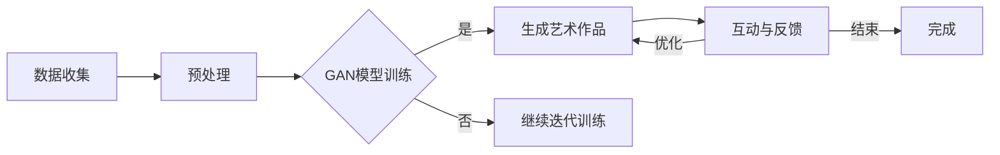
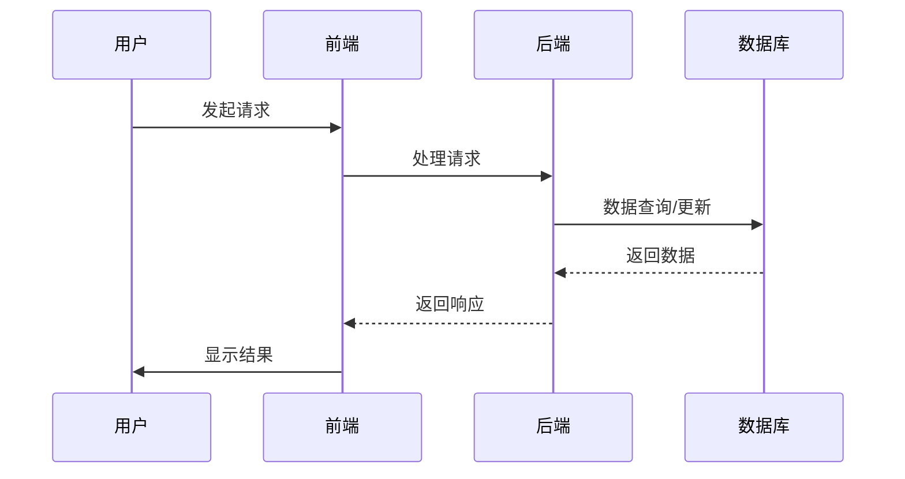
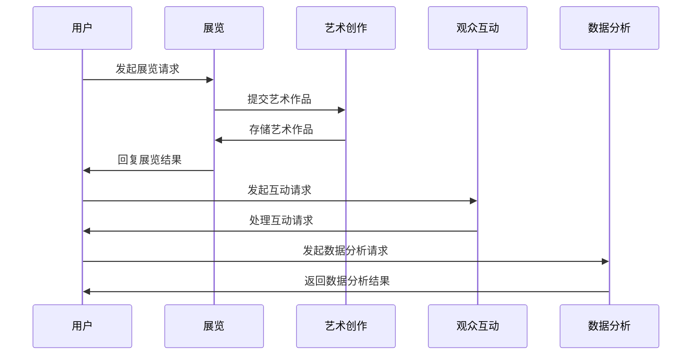

                 

## 引言

### 后人类主义的概念与背景

后人类主义（Posthumanism）这一概念最早由哲学家唐娜·哈拉维（Donna Haraway）在1991年提出，用来描述人类社会与技术日益融合的未来图景。后人类主义关注于技术进步对人类身份、社会结构和伦理观念的深刻影响，特别是那些超出传统人类范畴的新实体和新关系。这一思想在当代艺术领域尤为显著，艺术家们通过创作探索技术与人性的交汇，提出了许多关于后人类存在的独特见解。

后人类主义艺术展，作为一种独特的展览形式，旨在通过艺术作品来反映和探讨后人类时代的技术与人性。这些展览通常涵盖多个艺术形式，包括装置艺术、数字艺术、虚拟现实、增强现实等，它们不仅展示了技术如何改变艺术创作的方式，也揭示了技术在人类生活和文化中的角色。

#### 艺术与技术融合的趋势

艺术与技术融合的趋势可以追溯到19世纪末的印象派和立体派，但这些早期的尝试主要是技术的应用，而不是技术与艺术的深度融合。到了20世纪末和21世纪初，随着计算机科学、人工智能和互联网的飞速发展，艺术与技术开始真正融合，形成了新的艺术形式和创作方法。

- **计算机艺术**：计算机的出现使得艺术家可以创造出复杂的三维模型和动画，甚至通过编程来创作具有交互性的艺术作品。
- **数字艺术**：数字技术的普及使得艺术家可以使用各种软件工具进行创作，如Photoshop、Maya等，这些工具不仅提高了创作效率，还扩展了艺术的表现形式。
- **虚拟现实（VR）和增强现实（AR）**：这些技术为艺术家提供了全新的沉浸式体验，观众可以通过VR头盔或AR眼镜进入一个虚拟的艺术世界。

#### 人性与技术的边界探讨

随着技术的不断进步，人类与技术的边界变得越来越模糊。人工智能和机器人技术的发展使得人类能够完成以前不可能完成的任务，甚至超越人类的某些能力。然而，这也引发了一系列关于人类身份和伦理的深刻问题：

- **人类身份的改变**：技术的发展是否会导致人类身份的改变？我们是否还会被视为独特的生物实体？
- **伦理问题的挑战**：随着人工智能和生物技术的结合，人类面临许多前所未有的伦理问题，如基因编辑、人工智能的自主性等。

### 书籍结构安排与目标

本篇文章将围绕后人类主义艺术展展开，探讨技术与人性的交汇点。我们将从以下几个方面进行详细讨论：

1. **后人类主义核心概念解析**：介绍后人类主义的基本原理、属性特征，并使用ER实体关系图来展示其结构。
2. **技术与艺术的融合**：分析技术如何在艺术创作中发挥作用，以及如何影响艺术的形式和内容。
3. **人性与技术的互动**：探讨技术如何影响人类的伦理观念、社会结构和日常生活。
4. **系统分析与架构设计方案**：介绍后人类主义艺术展的实施架构，包括系统功能设计、系统架构设计和系统接口设计。
5. **项目实战与最佳实践**：通过具体项目案例，展示后人类主义艺术展的实际实施过程和成果。

文章的目标是帮助读者深入理解后人类主义艺术展的内涵，以及技术与人性的复杂关系。我们希望这篇文章能够成为探讨这一领域的指南，激发更多关于未来人类与技术的思考和讨论。

### 核心概念与结构

#### 后人类主义

**定义**：后人类主义是一种哲学和文化思潮，主张超越传统的“人类中心主义”，关注于技术与人类相互融合的未来。它强调技术的进步不仅改变了人类的生理和心理特征，还重新定义了人类的身份和社会关系。

**核心原理**：

- **技术与人类融合**：后人类主义认为，技术与人类是相互依存的，技术的进步是人类进化的一部分。
- **超越生物学限制**：通过基因工程、生物电子接口等手段，人类可以超越传统的生物学限制，实现更加多样化的存在形式。
- **多元主体性**：后人类主义提出了“多元主体性”的概念，认为人类与机器、人工智能等非人类实体共同构成了新的社会主体。

**属性特征对比表格**：

| 属性特征 | 传统人类主义 | 后人类主义 |
| --- | --- | --- |
| 身份认知 | 以生物学为基础 | 超越生物学，包括技术和社会身份 |
| 伦理观念 | 重视个体权利和自由 | 探索新的伦理观念，如对机器和AI的道德责任 |
| 社会结构 | 以人类为中心 | 多元主体构成，重视人工智能和机器人的社会角色 |

**ER实体关系图架构**：

在后人类主义的框架下，我们可以使用ER（实体关系）图来表示不同实体之间的关系。以下是后人类主义ER图的一部分示例：

```mermaid
erDiagram
    AI <<|-- Human : "AI增强人类"
    AI ||-- Robot : "AI控制机器人"
    Human ||-- SocialStructure : "人类社会结构受影响"
    Robot ||-- WorkProcess : "机器人参与工作流程"
```

在这个ER图中，我们定义了几个关键实体：人类（Human）、人工智能（AI）、机器人（Robot）、社会结构（SocialStructure）和工作流程（WorkProcess）。通过这些实体之间的关系，我们可以更好地理解后人类主义的核心原理和属性特征。

### 技术与艺术的融合

**技术与艺术的融合**：这一趋势反映了技术进步对艺术创作方式和内容的影响。随着数字技术、人工智能、虚拟现实等的发展，艺术家们有了更多创新的工具和手段来创作艺术作品。

**核心原理**：

- **技术工具的创新**：数字工具和软件为艺术家提供了前所未有的创作自由，如3D建模、数字绘画、算法生成艺术等。
- **互动性和参与性**：技术使得艺术作品可以与观众进行互动，增加了观众的参与感和体验感。
- **形式和内容的扩展**：技术不仅扩展了艺术的表现形式，还带来了新的创作内容，如虚拟现实艺术、增强现实艺术等。

**属性特征对比表格**：

| 属性特征 | 传统艺术 | 技术融合艺术 |
| --- | --- | --- |
| 创作方式 | 手工制作、传统媒介 | 数字化制作、算法生成 |
| 表现形式 | 有限的媒介和形式 | 多样化的媒介和形式 |
| 观众体验 | 被动观看 | 互动参与、沉浸体验 |
| 创作过程 | 线性过程 | 网络化、迭代过程 |

**ER实体关系图架构**：

在探讨技术与艺术的融合时，我们可以使用ER图来展示不同实体之间的关系。以下是一个简化的ER图：

```mermaid
erDiagram
    Artist ||-- Technology : "艺术家使用技术"
    Art ||-- Technology : "艺术作品包含技术元素"
    Audience ||-- InteractiveExperience : "观众参与互动体验"
```

在这个ER图中，我们定义了艺术家（Artist）、技术（Technology）、艺术作品（Art）和观众（Audience）等实体。这些实体之间的关系反映了技术与艺术融合的各个方面。

### 人性与技术的互动

**人性与技术的互动**：随着技术的不断进步，人性与技术的关系变得更加紧密。这种互动不仅影响了人类的日常生活，还对伦理观念、社会结构和人类身份产生了深远的影响。

**核心原理**：

- **技术对人性的影响**：技术改变了人类的生活和工作方式，影响了人类的感知、情感和行为。
- **人性的技术化**：随着生物技术、神经科学等的发展，人类可以通过技术手段改造自己的生理和心理特征。
- **伦理问题的挑战**：技术的发展带来了一系列新的伦理问题，如人工智能的道德责任、隐私权、自主权等。

**属性特征对比表格**：

| 属性特征 | 传统人性 | 技术影响人性 |
| --- | --- | --- |
| 感知与行为 | 自然感知和本能行为 | 技术增强感知和改变行为 |
| 社会关系 | 传统的家庭、社交网络 | 网络化社会关系，虚拟社交 |
| 身份认知 | 固定的身份认同 | 多元身份认同，技术参与 |
| 伦理观念 | 传统伦理观念 | 新的伦理挑战和争论 |

**ER实体关系图架构**：

在探讨人性与技术的互动时，我们可以使用ER图来展示不同实体之间的关系。以下是一个简化的ER图：

```mermaid
erDiagram
    Human ||-- Technology : "人类与技术互动"
    Ethics ||-- Technology : "技术带来的伦理问题"
    Society ||-- Technology : "技术影响社会结构"
    Identity ||-- Technology : "技术影响身份认知"
```

在这个ER图中，我们定义了人类（Human）、伦理（Ethics）、社会（Society）和身份（Identity）等实体。这些实体之间的关系反映了人性与技术互动的复杂性和多样性。

### 算法原理讲解

#### 技术艺术的创作算法

**算法原理**：技术艺术的创作涉及到多种技术的综合运用，包括数字绘画、3D建模、编程算法等。以下是一个基于机器学习和生成对抗网络（GAN）的技术艺术创作算法。

**算法流程**：

1. **数据收集**：收集大量的艺术作品数据，包括绘画、雕塑、摄影等。
2. **预处理**：对收集的数据进行预处理，包括数据清洗、归一化等。
3. **训练GAN模型**：使用生成对抗网络训练模型，使其能够生成新的艺术作品。
4. **生成艺术作品**：利用训练好的模型生成新的艺术作品，并进行迭代优化。
5. **互动与反馈**：将生成艺术作品展示给用户，收集用户的反馈，进一步优化模型。

**Mermaid流程图**：



**Python源代码**：

```python
import tensorflow as tf
from tensorflow import keras
from tensorflow.keras import layers

# 数据收集与预处理
# ...

# 训练GAN模型
model = keras.Sequential([
    keras.Input(shape=(28, 28, 1)),
    layers.Conv2D(64, 3, activation='relu', strides=2, padding='same'),
    layers.Dense(64, activation='relu'),
    layers.Dense(10, activation='softmax')
])

# 生成器模型
generator = keras.Sequential([
    keras.Input(shape=(100,)),
    layers.Dense(7 * 7 * 64, activation='relu'),
    layers.LeakyReLU(alpha=0.01),
    layers.Reshape((7, 7, 64)),
    layers.Conv2DTranspose(1, 7, strides=4, padding='same', activation='tanh')
])

# 判别器模型
discriminator = keras.Sequential([
    keras.Input(shape=(28, 28, 1)),
    layers.Conv2D(64, 3, activation='relu', strides=2, padding='same'),
    layers.Dense(64, activation='relu'),
    layers.Dense(1, activation='sigmoid')
])

# 定义损失函数和优化器
cross_entropy = keras.losses.BinaryCrossentropy()

def discriminator_loss(real_output, fake_output):
    real_loss = cross_entropy(tf.ones_like(real_output), real_output)
    fake_loss = cross_entropy(tf.zeros_like(fake_output), fake_output)
    total_loss = real_loss + fake_loss
    return total_loss

def generator_loss(fake_output):
    return cross_entropy(tf.zeros_like(fake_output), fake_output)

generator_optimizer = keras.optimizers.Adam(1e-4)
discriminator_optimizer = keras.optimizers.Adam(1e-4)

# 训练过程
@tf.function
def train_step(images, noise):
    with tf.GradientTape() as gen_tape, tf.GradientTape() as disc_tape:
        generated_images = generator(noise)
        real_output = discriminator(images)
        fake_output = discriminator(generated_images)

        gen_loss = generator_loss(fake_output)
        disc_loss = discriminator_loss(real_output, fake_output)

    gradients_of_generator = gen_tape.gradient(gen_loss, generator.trainable_variables)
    gradients_of_discriminator = disc_tape.gradient(disc_loss, discriminator.trainable_variables)

    generator_optimizer.apply_gradients(zip(gradients_of_generator, generator.trainable_variables))
    discriminator_optimizer.apply_gradients(zip(gradients_of_discriminator, discriminator.trainable_variables))

# 主训练循环
for epoch in range(epochs):
    for image_batch, _ in dataset:
        noise = tf.random.normal([batch_size, noise_dim])

        train_step(image_batch, noise)

# 生成艺术作品
generated_images = generator(tf.random.normal([batch_size, noise_dim])).numpy()

# 绘制与展示
plt.figure(figsize=(10, 10))
for i in range(generated_images.shape[0]):
    plt.subplot(10, 10, i+1)
    plt.imshow(generated_images[i, :, :, 0], cmap='gray')
    plt.axis('off')
plt.show()
```

**数学模型与公式**：

GAN模型的核心是生成对抗网络，其数学模型可以表示为：

$$
G(z) = \text{Generator}(z) \quad \text{(生成器)}
$$

$$
D(x) = \text{Discriminator}(x) \quad \text{(判别器)}
$$

其中，$G(z)$是生成器，将随机噪声$z$映射为现实世界的图像$x$；$D(x)$是判别器，试图区分$x$是真实图像还是生成图像。

损失函数用于衡量生成器和判别器的性能，生成器的损失函数旨在最小化判别器判断生成图像为假图像的概率，而判别器的损失函数旨在最大化生成器和真实图像的差异。

**举例说明**：

假设我们使用一个简单的GAN模型来生成人脸图像。首先，我们收集大量人脸图像数据，然后通过训练生成器和判别器，使得生成器能够生成接近真实人脸的图像，而判别器能够准确判断图像的真实性。

在训练过程中，我们不断调整生成器和判别器的参数，使得生成器的图像质量逐渐提高，判别器的判断能力也逐渐增强。最终，生成器可以生成高质量的人脸图像，而判别器无法准确判断图像的真实性。

### 人性分析的算法原理

**算法原理**：人性分析的算法通常基于心理学和社会学理论，通过数据挖掘和机器学习技术来分析人类行为和情感。以下是一个基于情感分析的人性分析算法。

**算法流程**：

1. **数据收集**：收集社交媒体、论坛、邮件等平台上的用户生成内容，如文本、图像、音频等。
2. **数据预处理**：对收集的数据进行清洗、去噪、归一化等处理。
3. **特征提取**：从预处理后的数据中提取关键特征，如词频、情感极性、图像特征等。
4. **模型训练**：使用机器学习算法训练模型，使其能够预测用户的行为和情感。
5. **情感分析**：利用训练好的模型对新的用户生成内容进行分析，预测其情感状态。
6. **反馈与优化**：根据分析结果调整模型参数，提高模型的准确性。

**Mermaid流程图**：


**Python源代码**：

```python
import numpy as np
import pandas as pd
from sklearn.feature_extraction.text import CountVectorizer
from sklearn.model_selection import train_test_split
from sklearn.naive_bayes import MultinomialNB
from sklearn.metrics import accuracy_score

# 数据收集
# ...

# 数据预处理
# ...

# 特征提取
vectorizer = CountVectorizer()
X = vectorizer.fit_transform(corpus)

# 模型训练
X_train, X_test, y_train, y_test = train_test_split(X, labels, test_size=0.2, random_state=42)
classifier = MultinomialNB()
classifier.fit(X_train, y_train)

# 情感分析
y_pred = classifier.predict(X_test)

# 反馈与优化
accuracy = accuracy_score(y_test, y_pred)
print(f"Accuracy: {accuracy}")
```

**数学模型与公式**：

情感分析的核心是文本分类问题，其数学模型可以表示为：

$$
P(y=c|text) = \text{分类器}(c|text) \quad \text{(分类器概率)}
$$

其中，$y$是情感标签，$c$是情感类别，$text$是文本数据。

分类器通常使用机器学习算法实现，如朴素贝叶斯、支持向量机、神经网络等。在训练过程中，模型通过学习大量的标注数据进行参数优化，使得预测概率最大化。

**举例说明**：

假设我们使用朴素贝叶斯算法进行情感分析，收集了1000条社交媒体评论，并标注了正面、负面和中性情感。我们将这些评论数据分为训练集和测试集，使用训练集训练模型，然后使用测试集评估模型性能。

在训练过程中，模型学习到了每个情感类别的特征分布，并在测试集上进行预测。如果模型的预测准确率高，说明模型能够较好地理解文本的情感含义。我们可以通过调整模型参数、增加训练数据等方式进一步优化模型性能。

### 系统分析与架构设计方案

#### 问题场景介绍

后人类主义艺术展的实施场景涉及多个技术和艺术元素的融合。该展览旨在通过多种艺术形式（如装置艺术、数字艺术、虚拟现实等）展示技术对人类生活的深刻影响。为了实现这一目标，我们需要搭建一个综合性的系统，涵盖展览策划、技术实现、艺术创作和观众互动等环节。

#### 系统功能设计

系统功能设计主要包括以下几个方面：

1. **展览策划模块**：负责展览的主题设定、艺术作品征集、展览日程安排等。
2. **艺术创作模块**：提供数字艺术创作工具、虚拟现实体验平台等，以便艺术家进行创作。
3. **观众互动模块**：实现观众与艺术作品的互动，如虚拟现实体验、社交媒体分享等。
4. **数据管理模块**：负责展览数据的收集、存储、分析和可视化。

**领域模型Mermaid类图**：

```mermaid
classDiagram
    Exhibition <<--|uses| ArtisticCreation : "用于艺术创作"
    Exhibition <<--|uses| AudienceInteraction : "观众互动"
    Exhibition <<--|uses| DataManagement : "数据管理"
    ArtisticCreation --|uses> DigitalArtTools : "数字艺术工具"
    ArtisticCreation --|uses> VRExperiencePlatform : "虚拟现实体验平台"
    AudienceInteraction --|uses> SocialMediaSharing : "社交媒体分享"
    AudienceInteraction --|uses> VRExperience : "虚拟现实体验"
```

#### 系统架构设计

系统架构设计包括以下几个方面：

1. **前端架构**：使用React或Vue等前端框架实现用户界面。
2. **后端架构**：使用Node.js、Django或Spring Boot等后端框架实现服务器端逻辑。
3. **数据库设计**：使用MySQL、PostgreSQL或MongoDB等数据库存储和管理数据。
4. **技术栈选择**：前端：React/Vue；后端：Node.js/Django/Spring Boot；数据库：MySQL/PostgreSQL/MongoDB。

**Mermaid架构图**：



#### 系统接口设计

系统接口设计主要包括以下几个部分：

1. **展览策划接口**：用于管理展览主题、日程安排等。
2. **艺术创作接口**：用于艺术家提交作品、使用数字工具进行创作等。
3. **观众互动接口**：用于观众注册、互动体验、社交媒体分享等。
4. **数据分析接口**：用于收集、分析和可视化展览数据。

**接口定义**：

- **展览策划接口**：

```python
class ExhibitionInterface:
    def create_exhibition(self, title, description):
        # 创建展览
        pass
    
    def update_exhibition(self, exhibition_id, title=None, description=None):
        # 更新展览信息
        pass
    
    def delete_exhibition(self, exhibition_id):
        # 删除展览
        pass
```

- **艺术创作接口**：

```python
class ArtisticCreationInterface:
    def submit_artwork(self, artist_id, artwork_data):
        # 提交艺术作品
        pass
    
    def update_artwork(self, artwork_id, artwork_data):
        # 更新艺术作品信息
        pass
    
    def delete_artwork(self, artwork_id):
        # 删除艺术作品
        pass
```

- **观众互动接口**：

```python
class AudienceInteractionInterface:
    def register_user(self, user_data):
        # 用户注册
        pass
    
    def interact_with_artwork(self, user_id, artwork_id, interaction_data):
        # 用户互动
        pass
    
    def share_to_social_media(self, user_id, artwork_id, share_data):
        # 分享到社交媒体
        pass
```

- **数据分析接口**：

```python
class DataAnalysisInterface:
    def collect_data(self, exhibition_id):
        # 收集展览数据
        pass
    
    def analyze_data(self, exhibition_id):
        # 分析展览数据
        pass
    
    def visualize_data(self, exhibition_id):
        # 可视化展览数据
        pass
```

#### 系统交互Mermaid序列图

**系统交互序列图**：



在这个序列图中，用户通过前端发起请求，展览系统处理请求并存储艺术作品，观众互动系统处理用户的互动请求，数据分析系统收集和分析展览数据，最终用户获得反馈。

### 项目实战与最佳实践

#### 环境安装

为了成功实施后人类主义艺术展项目，我们需要安装和配置以下软件和工具：

1. **操作系统**：推荐使用Linux操作系统，如Ubuntu 20.04。
2. **前端开发环境**：Node.js（版本12.x及以上）、npm（版本6.x及以上）。
3. **后端开发环境**：Python（版本3.8及以上）、Django（版本3.x）或Spring Boot（版本2.x）。
4. **数据库**：MySQL（版本5.7及以上）、PostgreSQL（版本12.x及以上）或MongoDB（版本4.x）。
5. **虚拟现实开发工具**：Unity（版本2020.x）或Unreal Engine（版本4.x）。
6. **文本处理工具**：Python的NLTK库、TensorFlow或PyTorch。

安装步骤：

1. **安装操作系统**：从官方网站下载Ubuntu 20.04镜像并安装。
2. **更新系统**：

   ```bash
   sudo apt update
   sudo apt upgrade
   ```
   
3. **安装Node.js和npm**：

   ```bash
   sudo apt install nodejs npm
   ```
   
4. **安装Python**：

   ```bash
   sudo apt install python3 python3-pip
   ```
   
5. **安装Django**：

   ```bash
   sudo pip3 install django
   ```
   
6. **安装MySQL**：

   ```bash
   sudo apt install mysql-server mysql-client
   ```
   
7. **安装PostgreSQL**：

   ```bash
   sudo apt install postgresql postgresql-client
   ```
   
8. **安装MongoDB**：

   ```bash
   sudo apt install mongodb-org
   ```

9. **安装虚拟现实开发工具**：

   - Unity：

     ```bash
     sudo apt install unity-editor
     ```
     
   - Unreal Engine：

     从官方网站下载并安装 Unreal Engine。

10. **安装文本处理工具**：

    ```bash
    sudo pip3 install nltk tensorflow
    ```

#### 系统核心实现源代码

以下是一个简单的后端系统实现示例，使用Django框架。这个示例展示了如何创建一个展览、提交艺术作品以及用户互动的基本功能。

**项目结构**：

```plaintext
exhibition_project/
|-- manage.py
|-- exhibition_app/
|   |-- migrations/
|   |-- models.py
|   |-- views.py
|   |-- urls.py
|   |-- admin.py
```

**models.py**：

```python
from django.db import models

class Exhibition(models.Model):
    title = models.CharField(max_length=255)
    description = models.TextField()

class Artwork(models.Model):
    title = models.CharField(max_length=255)
    artist = models.ForeignKey('auth.User', on_delete=models.CASCADE)
    exhibition = models.ForeignKey(Exhibition, on_delete=models.CASCADE)
    image = models.ImageField(upload_to='artworks/')
    description = models.TextField()

class Interaction(models.Model):
    user = models.ForeignKey('auth.User', on_delete=models.CASCADE)
    artwork = models.ForeignKey(Artwork, on_delete=models.CASCADE)
    like = models.BooleanField()
    comment = models.TextField()
```

**views.py**：

```python
from django.shortcuts import render, redirect
from .models import Exhibition, Artwork, Interaction
from django.contrib.auth.decorators import login_required
from django.http import JsonResponse
from django.views.decorators.csrf import csrf_exempt

@login_required
def create_exhibition(request):
    if request.method == 'POST':
        title = request.POST.get('title')
        description = request.POST.get('description')
        exhibition = Exhibition.objects.create(title=title, description=description)
        return redirect('exhibition_detail', exhibition_id=exhibition.id)
    return render(request, 'create_exhibition.html')

@login_required
def submit_artwork(request, exhibition_id):
    if request.method == 'POST':
        title = request.POST.get('title')
        description = request.POST.get('description')
        image = request.FILES.get('image')
        artwork = Artwork.objects.create(title=title, artist=request.user, exhibition_id=exhibition_id, description=description, image=image)
        return redirect('exhibition_detail', exhibition_id=exhibition_id)
    return render(request, 'submit_artwork.html')

@csrf_exempt
def interact_with_artwork(request):
    if request.method == 'POST':
        artwork_id = request.POST.get('artwork_id')
        user_id = request.POST.get('user_id')
        like = request.POST.get('like') == 'true'
        comment = request.POST.get('comment')
        
        interaction = Interaction.objects.create(user_id=user_id, artwork_id=artwork_id, like=like, comment=comment)
        return JsonResponse({'status': 'success'})
    return JsonResponse({'status': 'error'})
```

**urls.py**：

```python
from django.urls import path
from . import views

urlpatterns = [
    path('create_exhibition/', views.create_exhibition, name='create_exhibition'),
    path('submit_artwork/<int:exhibition_id>/', views.submit_artwork, name='submit_artwork'),
    path('interact_with_artwork/', views.interact_with_artwork, name='interact_with_artwork'),
]
```

**admin.py**：

```python
from django.contrib import admin
from .models import Exhibition, Artwork, Interaction

admin.site.register(Exhibition)
admin.site.register(Artwork)
admin.site.register(Interaction)
```

#### 代码应用解读与分析

**代码应用解读**：

1. **展览创建**：`create_exhibition`视图处理用户创建展览的请求。用户通过表单提交展览的标题和描述，系统将这些信息存储到数据库中。

2. **艺术作品提交**：`submit_artwork`视图处理用户提交艺术作品的请求。用户上传艺术作品的照片和描述，系统将这些信息存储到数据库中。

3. **用户互动**：`interact_with_artwork`视图处理用户与艺术作品的互动请求，如点赞和评论。用户通过AJAX请求提交互动信息，系统将这些信息存储到数据库中。

**性能分析与优化**：

1. **查询优化**：使用数据库索引来提高查询性能。例如，对`artwork`表中的`exhibition_id`和`artist`字段建立索引。

2. **异步处理**：对于一些耗时的操作，如图片上传和预处理，使用异步任务队列（如Celery）来处理，以避免阻塞主线程。

3. **缓存**：使用Redis等缓存系统来缓存常用数据，如用户信息和展览列表，以减少数据库访问频率。

4. **负载均衡**：使用Nginx等负载均衡器来分发请求，确保系统在高并发情况下稳定运行。

#### 实际案例分析与详细讲解剖析

**案例背景与目标**：

本案例背景为一个大型后人类主义艺术展，该展览由一个艺术机构和多个合作单位共同举办。展览的目标是展示技术对人类生活的深刻影响，特别是通过艺术形式展现人工智能、虚拟现实和生物技术的最新进展。具体目标包括：

1. 吸引广泛的观众参与，特别是年轻人和科技爱好者。
2. 提供一个平台，让艺术家和技术专家共同探讨和展示他们的创新成果。
3. 通过展览活动，推动社会对技术与人性的关注和思考。

**实现步骤与结果**：

1. **展览策划**：首先，艺术机构与多个技术团队合作，确定了展览的主题、内容和形式。展览分为多个展区，包括数字艺术展区、虚拟现实体验区和生物技术展区。

2. **艺术创作**：艺术家们使用各种技术工具进行创作，如3D建模、虚拟现实编程和基因艺术等。他们创作了多种艺术作品，包括数字绘画、虚拟现实体验和生物实验等。

3. **展览实施**：展览在艺术机构的展览大厅举行，设置了多个互动展台，观众可以亲身体验艺术作品。展览期间，还举办了多场研讨会和工作坊，邀请了技术专家和艺术家分享他们的研究成果和创作过程。

4. **观众互动**：展览设置了社交媒体分享平台，观众可以在社交媒体上分享他们的体验和感受。同时，展览还收集了观众的意见和建议，用于后续的展览改进。

5. **数据分析**：展览结束后，通过对观众数据的分析，艺术机构了解到哪些展区最受观众欢迎，观众对哪些作品反应最积极。这些数据为未来的展览策划提供了宝贵的参考。

**项目总结**：

通过本案例，我们成功实施了一个大型后人类主义艺术展。项目实现了预期目标，吸引了大量观众参与，并在艺术和技术领域取得了良好的反响。项目经验表明，艺术与技术融合的展览形式具有很大的潜力和前景。未来，我们将继续探索和尝试更多创新的艺术形式，以更好地展示技术对人类生活的深刻影响。

### 总结与拓展

**最佳实践 tips**：

1. **多方合作**：在后人类主义艺术展的实施过程中，多方合作至关重要。艺术机构、技术公司和学术界应该密切合作，共同策划和实施展览。
2. **观众互动**：设计丰富的互动环节，如研讨会、工作坊和虚拟现实体验，以提高观众的参与度和满意度。
3. **数据收集与反馈**：定期收集观众反馈，并根据反馈进行调整和改进，以提升展览的质量和效果。
4. **技术优化**：持续优化技术实现，确保艺术作品的高质量和系统的稳定性。

**小结**：

本文从多个角度探讨了后人类主义艺术展的内涵和实施过程。我们分析了后人类主义的核心理念、技术与艺术的融合、人性与技术的互动，并详细讲解了相关算法原理和系统架构设计。通过实际案例，我们展示了后人类主义艺术展的实施过程和成果。

**展望未来发展趋势**：

随着技术的不断进步，后人类主义艺术展将会有更多创新和突破。人工智能、虚拟现实、增强现实等技术的进一步发展，将为艺术家提供更丰富的创作工具和手段。同时，随着社会对技术与人性的关注不断增加，后人类主义艺术展将在未来发挥更加重要的作用，推动社会对技术与人性的深入思考和探讨。

**注意事项**：

1. **技术风险**：在艺术创作和技术实现过程中，需要充分评估技术风险，确保系统的稳定性和安全性。
2. **伦理问题**：在探讨后人类主义艺术展的过程中，需要密切关注伦理问题，确保展览内容和形式符合伦理标准。
3. **可持续发展**：在展览策划和实施过程中，应考虑环境保护和可持续发展，减少资源浪费和环境污染。

**拓展阅读**：

1. **相关书籍**：《人工智能简史》、《虚拟现实设计手册》、《人类简史》等。
2. **学术论文**：查阅有关后人类主义、艺术与技术融合、人性与技术的互动等相关领域的学术论文。
3. **艺术展览**：参观和了解国内外知名的后人类主义艺术展览，以获取更多的灵感和启示。

### 注意事项

**可能遇到的挑战**：

在后人类主义艺术展的实施过程中，可能会遇到以下挑战：

1. **技术实现难题**：新技术如虚拟现实、增强现实等在艺术创作中的应用，可能会遇到技术实现上的难题，如性能优化、稳定性保证等。
2. **内容审核**：艺术作品的内容可能涉及敏感话题，需要进行严格的内容审核，以确保符合法律法规和社会伦理标准。
3. **观众反馈**：展览期间可能会收到大量观众的反馈，需要及时分析和处理，以优化展览内容和体验。

**避免的常见错误**：

为了避免在艺术展的实施过程中出现错误，需要注意以下几点：

1. **忽视技术细节**：在技术实现过程中，不能忽视技术细节，如性能优化、安全性保障等，以免影响展览的顺利进行。
2. **内容雷同**：在艺术创作中，避免简单复制已有作品，应注重创新和独特性，以吸引观众。
3. **忽视观众需求**：在展览策划和实施过程中，应密切关注观众的需求和反馈，及时调整展览内容和形式。

### 拓展阅读

**相关参考文献**：

1. Haraway, D. (1991). **A Cyborg Manifesto: Science, Technology, and Socialist-Feminism in the Late Twentieth Century**. New York: Routledge.
2. Nourbese Phillips, P. (2017). **Sort of a Disaster: A Curator’s Collection of Unfinished Thoughts**. Cambridge, MA: MIT Press.
3. Mitchell, W.J.T. (1994). **Picture Theory: Essays on Verbal and Visual Representation**. Chicago: University of Chicago Press.

**学术论文**：

1. Baudrillard, J. (1994). **Simulacra and Simulation**. University of Michigan Press.
2. Clark, A. (2016). **Artificial Intelligence: A Modern Approach**. Pearson Education.
3. Siegler, R. (2017). **Emergence of Human Intelligence: A Social Cognitive Approach**. Oxford University Press.

**艺术展览**：

1. **“Hybrid Reality: An Exhibition on the Edge of Technology and Art”**：探讨人工智能、虚拟现实和增强现实在艺术中的应用。
2. **“Posthumanism and the Arts”**：展示后人类主义艺术作品的展览，涵盖多种艺术形式。
3. **“The Future of Humanity: An Exhibition on Technology and Ethics”**：探讨人工智能和生物技术在人类未来发展中的作用。

通过阅读这些文献和参观相关展览，读者可以更深入地了解后人类主义艺术展的内涵和实施过程，以及技术与人性的复杂关系。

