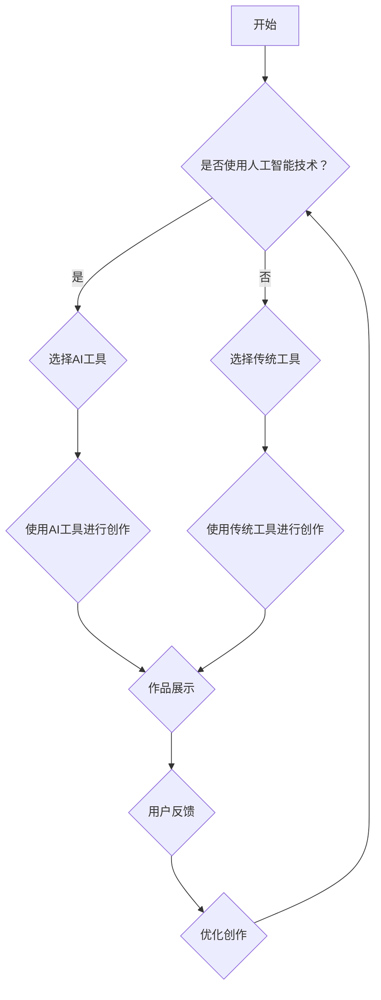
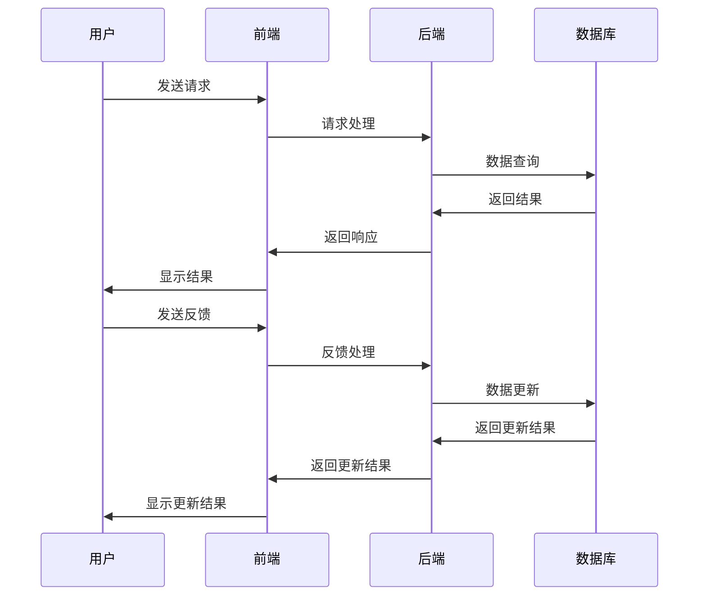

                 

### 1.1 书籍背景

#### 1.1.1 后人类主义艺术的崛起

后人类主义艺术作为一种新兴的审美形式，源于20世纪末对人工智能、生物技术、虚拟现实等技术的深入探索。它不仅挑战了传统的艺术界限，还促使人类重新思考自身的存在意义。随着计算机技术和人工智能的飞速发展，后人类主义艺术逐渐崭露头角，成为当代艺术领域中一颗璀璨的明珠。

在这个时代，技术的迅猛进步不仅改变了我们的生活方式，也深刻影响了艺术创作。艺术家们开始尝试将技术手段融入到艺术创作中，创造出更加丰富、多样的艺术形式。例如，人工智能算法可以生成独特的图像和音乐，虚拟现实技术可以带来沉浸式的艺术体验，生物艺术则探索了人与自然、人与科技之间的复杂关系。

#### 1.1.2 技术与人性的对话

技术的进步为艺术带来了无限的可能性，但同时也引发了关于人性、道德、伦理等深层次问题的思考。后人类主义艺术正是在这种背景下崛起的，它试图通过技术与人性的对话，探讨人类在技术时代的生存状态。

技术与人性的关系是一个复杂且微妙的议题。一方面，技术的发展推动了人类文明的进步，为艺术创作提供了新的工具和媒介。另一方面，技术的过度依赖也可能导致人性的异化，甚至引发道德和伦理危机。因此，后人类主义艺术不仅关注技术的应用，更关注技术在人性层面上的影响。

#### 1.1.3 为什么要研究后人类主义艺术

后人类主义艺术的崛起不仅对艺术领域产生了深远影响，也对人类社会的发展提出了新的挑战。研究后人类主义艺术的重要性体现在以下几个方面：

1. **艺术创新的推动**：后人类主义艺术为艺术创作提供了新的灵感来源，促进了艺术的不断创新和发展。
2. **人性的深入探讨**：通过后人类主义艺术，我们可以更深刻地理解人性的复杂性，反思人类在技术时代的生存状态。
3. **跨学科研究的桥梁**：后人类主义艺术融合了艺术、科技、哲学等多个学科领域，为跨学科研究提供了新的视角和方法。
4. **社会影响的思考**：后人类主义艺术对社会、文化、伦理等方面的影响值得我们深入研究和探讨。

总之，后人类主义艺术的崛起不仅是对传统艺术的挑战，更是对人类自身存在的思考。研究后人类主义艺术，不仅有助于我们更好地理解艺术的发展趋势，也能为我们应对技术时代的挑战提供新的思路和启示。### 1.2 本书结构

#### 1.2.1 目录概述

本书将深入探讨后人类主义艺术这一前沿领域，旨在通过系统的理论分析、案例分析以及未来展望，帮助读者全面理解后人类主义艺术的本质和影响。本书分为四个主要部分：

1. **引言**：介绍后人类主义艺术的背景、意义和研究目的。
2. **理论基础**：探讨后人类主义艺术的理论基础，包括概念、历史背景和核心思想。
3. **案例分析**：分析后人类主义艺术在不同领域中的应用和实践。
4. **未来展望**：展望后人类主义艺术的未来发展，探讨技术发展趋势和艺术变革。

#### 1.2.2 每章内容预览

以下是本书各章的具体内容预览：

- **第一部分：引言**
  - **1.1 书籍背景**
    - 后人类主义艺术的崛起
    - 技术与人性的对话
    - 为什么要研究后人类主义艺术
  - **1.2 本书结构**
    - 目录概述
    - 每章内容预览
    - 阅读指南

- **第二部分：后人类主义艺术的理论基础**
  - **2.1 后人类主义的概念**
    - 后人类主义的定义
    - 后人类主义的历史背景
    - 后人类主义的核心思想
  - **2.2 艺术与技术的关系**
    - 技术对艺术的变革
    - 艺术与技术的新融合
    - 跨界艺术的实践
  - **2.3 后人类主义艺术的特征**
    - 技术驱动
    - 人工智能的应用
    - 人机共生
  - **2.4 后人类主义艺术的分类**
    - 数字艺术
    - 交互艺术
    - 虚拟现实艺术
    - 生物艺术

- **第三部分：后人类主义艺术的案例分析**
  - **3.1 数字艺术案例**
    - 案例介绍
    - 技术实现
    - 艺术表现
  - **3.2 交互艺术案例**
    - 案例介绍
    - 技术实现
    - 艺术价值
  - **3.3 虚拟现实艺术案例**
    - 案例介绍
    - 技术实现
    - 体验感受
  - **3.4 生物艺术案例**
    - 案例介绍
    - 技术实现
    - 科学与艺术的融合

- **第四部分：后人类主义艺术的未来展望**
  - **4.1 技术的发展趋势**
    - 人工智能
    - 虚拟现实
    - 生物技术
  - **4.2 艺术的演变**
    - 新媒体艺术的崛起
    - 艺术与科学的融合
    - 新艺术形式的出现
  - **4.3 后人类主义艺术的社会影响**
    - 对人类的思考
    - 对社会的影响
    - 对未来的启示

#### 1.2.3 阅读指南

为了更好地理解后人类主义艺术，本书建议读者按照以下步骤进行阅读：

1. **第一遍阅读**：快速浏览全书，了解各章节的主要内容和大体结构。
2. **第二遍阅读**：深入阅读每章，理解每个案例的具体内容和案例分析。
3. **第三遍阅读**：重点阅读理论部分，理解后人类主义艺术的核心概念和理论基础。
4. **结合实践**：尝试通过案例分析，将理论知识应用到实际创作中，加深对后人类主义艺术的理解。

通过以上阅读步骤，读者不仅可以全面掌握后人类主义艺术的理论知识，还能通过案例分析，更好地理解其在实际艺术创作中的应用和价值。### 第二部分：后人类主义艺术的理论基础

#### 2.1 后人类主义的概念

**2.1.1 后人类主义的定义**

后人类主义（Posthumanism）是一个涉及哲学、文化研究、艺术等多个领域的概念，主要探讨技术在人类进化和社会变革中的作用。后人类主义认为，随着人工智能、生物技术等技术的发展，人类的定义和存在方式正在发生深刻变化。它不仅质疑传统的人类中心主义，还提出了一个超越传统人类概念的新视角。

在后人类主义的视角下，人类不再是一个独立的、自主的实体，而是与机器、生物、环境等元素相互交织的复杂系统。这种视角鼓励我们重新思考人类与自然、人类与技术、人类与社会之间的关系。

**2.1.2 后人类主义的历史背景**

后人类主义的崛起可以追溯到20世纪末，特别是在信息技术和生物技术的发展背景下。这个时期，计算机科学、人工智能、生物工程等领域的突破性进展，使得人类开始重新审视自身的存在和未来。哲学家、文化评论家、艺术家等开始探讨这些技术对人类生活方式、价值观和存在意义的冲击。

后人类主义的理论基础源于对人类中心主义的批判。人类中心主义认为，人类是宇宙的中心，所有事物都应服务于人类的需求。而后人类主义则强调，人类只是众多生命形式中的一种，不应该垄断对世界的理解和控制。

**2.1.3 后人类主义的核心思想**

后人类主义的核心思想可以概括为以下几点：

1. **去中心化**：后人类主义主张放弃人类中心主义，强调所有生命形式和物质元素都应该被视为平等的参与者。
2. **非人化**：后人类主义认为，技术的发展将使人类逐渐失去其独特的身份和特征，人与机器、人与生物的界限将变得更加模糊。
3. **合作共生**：后人类主义鼓励人类与其他生命形式和自然元素建立合作关系，共同创造一个和谐共存的新世界。
4. **技术乐观主义**：后人类主义者通常对技术的发展持乐观态度，认为技术将帮助我们克服当前的困境，实现更美好的未来。

#### 2.2 艺术与技术的关系

**2.2.1 技术对艺术的变革**

技术在艺术领域的应用极大地丰富了艺术的形式和表现手法。从摄影、电影到数字艺术、虚拟现实，技术为艺术家提供了前所未有的创作工具和媒介。例如，计算机生成的图像和音乐可以通过算法产生，虚拟现实技术可以让观众沉浸在一个完全虚拟的艺术空间中。

技术不仅改变了艺术的表现形式，还改变了艺术创作的流程。在传统艺术中，创作过程通常是一个线性、封闭的过程，而现代技术使得艺术创作可以是一个开放、互动的过程。艺术家可以通过与观众的互动，实时调整作品的内容和形式，创造出更加个性化的艺术体验。

**2.2.2 艺术与技术的新融合**

艺术与技术的融合产生了许多新的艺术形式和流派。例如，数字艺术利用计算机技术生成独特的视觉作品，交互艺术通过技术手段实现艺术家与观众之间的互动，虚拟现实艺术则提供了一个沉浸式的体验空间。

这种新融合不仅为艺术家提供了更多的创作可能性，也为观众带来了全新的艺术体验。例如，数字艺术作品可以无限次复制，但每次观看时都可能有不同的视觉体验；交互艺术则让观众成为艺术的一部分，增强了观众的参与感和互动性。

**2.2.3 跨界艺术的实践**

跨界艺术是艺术与技术融合的典型代表。跨界艺术家不仅关注艺术本身，还关注艺术与其他领域（如科学、工程、设计等）的交叉。这种跨界实践使得艺术作品具有了更丰富的内涵和表现形式。

例如，生物艺术家将生物技术应用到艺术创作中，创造出既具有美学价值又具有科学意义的生物艺术品；媒体艺术家则利用计算机编程和新媒体技术，创造出具有互动性和沉浸感的新媒体艺术作品。

跨界艺术的实践不仅拓宽了艺术的表现形式，还推动了艺术与科学、技术等领域的跨学科合作。这种跨界合作不仅有助于艺术家更好地理解技术，也有助于科学家和技术人员更好地理解艺术。

#### 2.3 后人类主义艺术的特征

**2.3.1 技术驱动**

后人类主义艺术强调技术的重要性，认为技术是推动艺术创新和变革的核心力量。在后人类主义艺术家看来，技术不仅是创作工具，更是艺术表达的媒介。通过技术，艺术家可以探索新的创作手法和表现形式，创造出前所未有的艺术作品。

技术驱动的后人类主义艺术强调科技与人文的融合。艺术家不仅关注技术本身，还关注技术对人类生活和社会的影响。通过艺术作品，艺术家试图揭示技术的双刃剑效应，探讨技术进步带来的机遇与挑战。

**2.3.2 人工智能的应用**

人工智能（AI）在后人类主义艺术中的应用非常广泛。AI技术可以生成图像、音乐、文本等艺术作品，为艺术家提供了全新的创作工具和灵感来源。例如，深度学习算法可以生成逼真的图像和音乐，生成对抗网络（GAN）可以创造出独特且具有艺术性的作品。

人工智能的应用不仅改变了艺术创作的流程，还改变了艺术评价的标准。传统的艺术评价标准主要基于美学、情感和创意等方面，而人工智能的应用引入了数据、算法和机器学习等新的评价维度。

**2.3.3 人机共生**

人机共生（Human-Machine Symbiosis）是后人类主义艺术中的一个核心概念。人机共生强调人类与机器之间的合作关系，认为人类和机器可以相互补充，共同创造更加复杂和多样化的艺术形式。

人机共生的实现依赖于人工智能和机器学习技术。通过这些技术，艺术家可以与机器协作，共同完成艺术创作。例如，艺术家可以利用机器学习算法分析大量数据，从中提取出有价值的创作元素；机器则可以利用人工智能技术生成独特的艺术作品。

人机共生不仅改变了艺术创作的模式，还改变了艺术的价值观念。在传统艺术中，艺术家是创作的唯一主体，而在人机共生的艺术中，机器也成为了艺术创作的重要参与者。这种变化不仅拓宽了艺术的表现形式，也为艺术家提供了新的创作思维和创作空间。

#### 2.4 后人类主义艺术的分类

**2.4.1 数字艺术**

数字艺术是指利用计算机技术和数字媒介创作的艺术作品。数字艺术包括图像、动画、音乐、视频等多种形式，艺术家通过数字工具和软件进行创作和展示。

数字艺术的特点是高度可重复性和可修改性。数字艺术作品可以无限次复制和修改，每次展示都可能有不同的效果。这种特性使得数字艺术具有极高的互动性和参与性，观众可以参与到艺术创作和展示过程中。

**2.4.2 交互艺术**

交互艺术是指艺术家与观众通过技术手段进行互动的艺术形式。交互艺术强调观众的参与和体验，艺术家通过技术手段创造一个互动的艺术空间，让观众成为艺术的一部分。

交互艺术的形式多种多样，包括触摸屏、传感器、增强现实（AR）、虚拟现实（VR）等。交互艺术不仅改变了艺术的表现形式，还改变了观众的参与方式，让观众在艺术体验中发挥更大的主动性和创造力。

**2.4.3 虚拟现实艺术**

虚拟现实艺术是指利用虚拟现实技术创作的艺术作品。虚拟现实艺术提供了一个沉浸式的艺术体验空间，观众可以完全沉浸在虚拟的艺术环境中，体验独特的艺术感受。

虚拟现实艺术的特点是高度沉浸感和互动性。通过虚拟现实技术，艺术家可以创造出独特的视觉、听觉和触觉体验，让观众在艺术体验中产生强烈的情感共鸣。

**2.4.4 生物艺术**

生物艺术是指利用生物技术创作的艺术作品。生物艺术家通过基因工程、细胞培养、生物打印等技术，创造出具有艺术价值的生物艺术品。

生物艺术的特点是具有生命力和科学性。生物艺术作品不仅具有美学价值，还具有科学意义，可以推动科学研究和人类对生物世界的认识。

总之，后人类主义艺术的分类不仅反映了艺术形式和技术的多样性，也体现了后人类主义艺术对人类与技术、人与自然关系的深入探讨。通过这些不同类型的艺术形式，后人类主义艺术家试图揭示技术时代的复杂性和多元性，为观众提供全新的艺术体验和思考空间。### 2.2 艺术与技术的关系

艺术与技术的关系自古以来就是密不可分的。技术的进步不仅改变了人类的生活方式，也对艺术创作产生了深远的影响。在探讨后人类主义艺术时，理解技术对艺术的变革、艺术与技术的新融合，以及跨界艺术的实践显得尤为重要。

#### 2.2.1 技术对艺术的变革

技术的进步为艺术创作带来了前所未有的工具和媒介，使得艺术表现形式更加多样化和丰富。从摄影到电影，从油画到数字艺术，每一种技术的出现都为艺术创作注入了新的活力。

1. **摄影技术的革新**：19世纪末，摄影技术的发明彻底改变了绘画的地位，艺术家开始探索这一新媒介，创造出一系列具有独特视觉风格的作品。

2. **电影艺术的兴起**：电影作为一种全新的艺术形式，将视觉和听觉相结合，为观众提供了全新的艺术体验。电影艺术的兴起不仅改变了艺术的表现形式，还推动了叙事艺术的发展。

3. **数字艺术的崛起**：随着计算机技术的飞速发展，数字艺术逐渐成为主流。艺术家们利用计算机软件和数字工具，创作出独特的图像、动画和视频作品。数字艺术的可修改性和可重复性，使得艺术创作更加灵活和多样化。

技术的变革不仅改变了艺术的表现形式，还影响了艺术创作的流程。传统的艺术创作通常是一个相对封闭、独立的过程，而现代技术使得艺术创作可以是一个开放、互动的过程。艺术家可以通过与观众的互动，实时调整作品的内容和形式，创造出更加个性化的艺术体验。

#### 2.2.2 艺术与技术的新融合

技术的进步为艺术创作提供了新的工具和媒介，同时也促使艺术与技术的融合，产生了许多新的艺术形式和流派。

1. **交互艺术**：交互艺术是指艺术家与观众通过技术手段进行互动的艺术形式。交互艺术强调观众的参与和体验，艺术家通过技术手段创造一个互动的艺术空间，让观众成为艺术的一部分。例如，通过触摸屏、传感器、增强现实（AR）和虚拟现实（VR）等技术，艺术家可以创造出具有高度互动性的艺术作品。

2. **数字艺术**：数字艺术是指利用计算机技术和数字媒介创作的艺术作品。数字艺术包括图像、动画、音乐、视频等多种形式。艺术家通过数字工具和软件进行创作和展示，数字艺术的可修改性和可重复性，使得艺术创作更加灵活和多样化。

3. **新媒体艺术**：新媒体艺术是指利用互联网、移动通信、数字技术等新媒体平台进行创作的艺术形式。新媒体艺术突破了传统艺术的表现形式，将虚拟与现实、线上与线下相结合，创造出独特的艺术体验。

艺术与技术的融合不仅拓宽了艺术的表现形式，还改变了艺术的价值观念。在传统艺术中，艺术家是创作的唯一主体，而在艺术与技术的融合中，技术也成为了艺术创作的重要参与者。这种变化不仅拓宽了艺术的表现形式，也为艺术家提供了新的创作思维和创作空间。

#### 2.2.3 跨界艺术的实践

跨界艺术是艺术与技术融合的典型代表，它不仅涉及艺术与技术的交叉，还涵盖了艺术与其他领域的互动。跨界艺术的实践为艺术创作带来了新的灵感和可能性。

1. **艺术与科学的融合**：生物艺术是一个典型的例子。生物艺术家通过基因工程、细胞培养、生物打印等技术，创造出具有艺术价值的生物艺术品。这些作品不仅具有美学价值，还具有科学意义，可以推动科学研究和人类对生物世界的认识。

2. **艺术与工程的融合**：工程艺术是指艺术家与工程师合作，利用工程技术和材料创作的艺术作品。例如，建筑师和艺术家合作创作的大型公共艺术装置，通过复杂的结构和材料，创造出独特的视觉和空间效果。

3. **艺术与计算机科学的融合**：计算机艺术家利用计算机编程和算法创作出独特的数字艺术作品。这些作品不仅具有高度的艺术性，还体现了计算机科学的理论和实践。

跨界艺术的实践不仅拓宽了艺术的表现形式，还推动了跨学科合作。艺术家通过与其他领域的专业人士合作，可以借鉴其他领域的知识和方法，创造出更加丰富和多样化的艺术作品。

总之，艺术与技术的关系是相辅相成的。技术的进步为艺术创作提供了新的工具和媒介，而艺术的创新也推动了技术的进步。通过探讨技术对艺术的变革、艺术与技术的新融合，以及跨界艺术的实践，我们可以更好地理解后人类主义艺术的核心特征和未来发展趋势。### 2.3 后人类主义艺术的特征

#### 2.3.1 技术驱动

后人类主义艺术的一个重要特征是技术驱动的创作模式。在这个时代，技术不仅是艺术创作的工具，更是艺术创作的核心动力。艺术家们利用计算机技术、人工智能、生物技术等现代科技手段，创造出前所未有的艺术形式和作品。

1. **计算机技术的应用**：计算机技术的应用使得艺术创作变得更加多样化和高效。艺术家可以通过各种软件和工具，如Photoshop、Maya、3ds Max等，创作出复杂的图像、动画和三维模型。计算机技术不仅提高了艺术创作的效率，还扩展了艺术家的创作空间和表现形式。

2. **人工智能的介入**：人工智能技术在艺术创作中的应用越来越广泛。例如，深度学习算法可以生成逼真的图像和音乐，生成对抗网络（GAN）可以创造出独特的艺术作品。人工智能不仅为艺术家提供了新的创作工具，还改变了艺术创作的流程和评价标准。

3. **生物技术的探索**：生物艺术是一个典型的例子，艺术家通过基因工程、细胞培养、生物打印等技术，创作出具有生命力和科学意义的艺术作品。这些作品不仅具有美学价值，还探讨了人类与生物、科技与自然的关系。

技术驱动的后人类主义艺术不仅改变了艺术创作的手段和形式，还影响了艺术家的创作思维和理念。艺术家们开始更加关注技术对人类生活和社会的影响，他们的作品更多地反映了技术时代的复杂性和多元性。

#### 2.3.2 人工智能的应用

人工智能（AI）在后人类主义艺术中的应用越来越广泛，它不仅为艺术家提供了新的创作工具，还改变了艺术创作的方式和流程。以下是一些人工智能在艺术创作中的应用实例：

1. **图像生成**：人工智能可以生成逼真的图像和艺术作品。例如，深度学习算法可以训练出能够生成高质量图像的模型，艺术家可以通过这些模型创作出独特的视觉艺术作品。

2. **音乐创作**：人工智能可以创作音乐。通过机器学习和自然语言处理技术，AI可以生成旋律、和声和节奏，甚至模仿特定音乐风格。这些音乐作品不仅具有艺术性，还可以为艺术家的创作提供新的灵感。

3. **文本生成**：人工智能可以生成文本，如诗歌、小说、剧本等。通过自然语言处理技术，AI可以理解语言结构和语义，创作出具有文学价值的文本。这些文本可以为艺术家的创作提供新的素材和思路。

4. **交互设计**：人工智能可以用于交互艺术创作。通过机器学习和智能算法，AI可以实时分析观众的互动行为，调整艺术作品的内容和表现形式，创造出一个动态的、互动的艺术体验。

人工智能的应用不仅提高了艺术创作的效率，还拓展了艺术家的创作领域和表现形式。艺术家们可以通过人工智能技术探索新的创作方式和艺术形式，创造出更加丰富和多样化的艺术作品。

#### 2.3.3 人机共生

人机共生（Human-Machine Symbiosis）是后人类主义艺术中的一个核心概念，它强调人类与机器之间的合作关系，认为人类和机器可以相互补充，共同创造更加复杂和多样化的艺术形式。

1. **协作创作**：人机共生在艺术创作中的应用体现在艺术家与机器的协作。艺术家可以利用机器学习、人工智能等技术，分析大量的数据，从中提取出有价值的创作元素。机器则可以利用算法生成独特的艺术作品，艺术家可以对这些作品进行进一步修改和调整。

2. **混合媒介**：人机共生还体现在混合媒介的创作中。艺术家可以结合计算机技术、人工智能和其他科技手段，创作出具有高度互动性和沉浸感的艺术作品。例如，虚拟现实艺术作品中，艺术家可以与机器共同设计虚拟环境和角色，观众可以与这些虚拟角色进行互动。

3. **智能辅助**：人机共生还体现在智能辅助创作中。艺术家可以利用智能算法和机器学习模型，为创作提供实时反馈和建议。这些智能辅助工具可以帮助艺术家优化创作过程，提高创作效率。

人机共生不仅改变了艺术创作的模式，还改变了艺术的价值观念。在传统艺术中，艺术家是创作的唯一主体，而在人机共生的艺术中，机器也成为了艺术创作的重要参与者。这种变化不仅拓宽了艺术的表现形式，也为艺术家提供了新的创作思维和创作空间。

总之，后人类主义艺术的特征体现在技术驱动、人工智能的应用和人机共生的创作模式中。这些特征不仅反映了技术对艺术创作的影响，也揭示了后人类主义艺术对人类与技术、人与自然关系的深入探讨。通过技术驱动的创作、人工智能的应用和人机共生的协作，后人类主义艺术家试图创造出具有高度创新性和前瞻性的艺术作品，为观众提供全新的艺术体验和思考空间。### 2.4 后人类主义艺术的分类

后人类主义艺术的分类反映了其在技术和表现手法上的多样性。以下是几种主要的后人类主义艺术形式，包括数字艺术、交互艺术、虚拟现实艺术和生物艺术，每种形式都有其独特的特征和应用。

#### 2.4.1 数字艺术

数字艺术（Digital Art）是指使用计算机技术和数字媒介创作的艺术作品。数字艺术涵盖了一系列形式，如数字绘画、三维建模、动画、数字摄影和数字视频等。

**特征与应用：**
- **特征**：数字艺术具有高度的可编辑性和可复制性，艺术家可以通过软件工具如Photoshop、3ds Max、Maya等进行精细的创作和修改。数字艺术可以创造出极其细腻和复杂的视觉效果。
- **应用**：数字艺术广泛应用于电影特效、游戏设计、广告宣传以及公共艺术展示中。例如，电影《阿凡达》中的奇幻世界就是通过数字艺术技术实现的。

#### 2.4.2 交互艺术

交互艺术（Interactive Art）是指观众与艺术作品互动的艺术形式。交互艺术强调观众的参与和体验，通过触摸屏、传感器、增强现实（AR）和虚拟现实（VR）等技术实现。

**特征与应用：**
- **特征**：交互艺术具有很强的参与性和互动性，观众可以通过触摸、声音、动作等方式与艺术作品互动，产生独特的艺术体验。
- **应用**：交互艺术常见于博物馆、画廊和艺术装置中，例如，观众可以通过触摸屏幕控制艺术作品的变化，或者通过VR设备体验一个虚拟的艺术世界。

#### 2.4.3 虚拟现实艺术

虚拟现实艺术（Virtual Reality Art）利用虚拟现实技术创作出沉浸式的艺术体验。虚拟现实艺术通过计算机生成三维虚拟环境，观众可以在这个环境中自由探索和互动。

**特征与应用：**
- **特征**：虚拟现实艺术提供了高度沉浸感和真实感，观众仿佛置身于一个虚拟的艺术世界中。
- **应用**：虚拟现实艺术广泛应用于电影、游戏、教育、医疗等领域，艺术家可以通过虚拟现实技术创作出独特的沉浸式艺术体验。

#### 2.4.4 生物艺术

生物艺术（Bio Art）是指使用生物技术和生物材料创作的艺术作品。生物艺术家通过基因工程、细胞培养、生物打印等技术，创造出具有生命力和科学意义的艺术作品。

**特征与应用：**
- **特征**：生物艺术具有高度的科学性和实验性，艺术作品可能包含活体生物、细胞、基因等生物材料。
- **应用**：生物艺术广泛应用于科学展览、生物工程、医学研究等领域，艺术家通过生物艺术探讨人类与自然、科技与伦理的关系。

通过这些不同的艺术形式，后人类主义艺术家不仅挑战了传统的艺术边界，还试图通过技术手段探索人类与技术、人与自然之间的复杂关系。每种艺术形式都有其独特的价值和意义，共同构成了后人类主义艺术的丰富景观。### 3.1 数字艺术案例

#### 3.1.1 案例介绍

数字艺术是后人类主义艺术中的一个重要分支，通过计算机技术和数字媒介创作的作品，具有高度的可编辑性和可复制性。本节将介绍一个具体的数字艺术案例——“数字抽象画”。

**案例背景：** 
“数字抽象画”是一个由知名数字艺术家Alexa Meade创作的艺术项目。Alexa Meade通过数字绘画技术，将传统的绘画技巧与现代科技相结合，创造出独特的视觉效果。

**艺术表现：** 
在“数字抽象画”项目中，Alexa Meade利用Photoshop、3ds Max等数字工具，创作出一系列抽象画作品。这些作品不仅具有丰富的色彩和纹理，还通过光影和透视的运用，营造出一种独特的视觉效果。

#### 3.1.2 技术实现

为了实现“数字抽象画”这一项目，Alexa Meade采用了以下几种关键技术：

1. **数字绘画技术**：
   - **工具选择**：Alexa Meade主要使用Photoshop进行数字绘画。Photoshop提供了丰富的绘图工具和滤镜效果，可以帮助艺术家创作出细腻且富有表现力的作品。
   - **色彩运用**：在数字绘画中，色彩的运用至关重要。Alexa Meade擅长通过色彩对比和调和，营造出丰富的视觉效果。

2. **三维建模技术**：
   - **3ds Max**：为了增强作品的立体感和空间感，Alexa Meade使用3ds Max进行三维建模。3ds Max是一个功能强大的三维建模软件，可以帮助艺术家创建复杂的几何形状和场景。
   - **灯光效果**：通过合理运用灯光效果，可以增强作品的立体感和层次感。Alexa Meade在作品中巧妙地运用了光照和阴影，营造出一种独特的氛围。

3. **虚拟现实技术**：
   - **VR展示**：为了更好地展示“数字抽象画”，Alexa Meade利用虚拟现实（VR）技术，创建了一个沉浸式的艺术体验空间。观众可以通过VR设备，全方位地欣赏这些数字艺术作品。

#### 3.1.3 艺术表现

在“数字抽象画”项目中，Alexa Meade通过数字绘画技术，将传统艺术形式与现代科技相结合，创造出一种全新的艺术体验。以下是一些具体的表现：

1. **色彩运用**：
   - Alexa Meade在作品中运用了丰富的色彩，通过色彩的对比和调和，创造出一种独特的视觉效果。例如，在《色彩之舞》这幅作品中，她运用了强烈的色彩对比，使得画面充满了活力和动感。

2. **光影效果**：
   - 通过巧妙的光影运用，Alexa Meade在作品中营造出了丰富的空间感和立体感。例如，在《光影交响曲》这幅作品中，她通过光影的变化，使得画面中的物体仿佛有了生命。

3. **互动性**：
   - Alexa Meade通过虚拟现实技术，将“数字抽象画”展示在一个沉浸式的艺术体验空间中。观众可以通过VR设备，实时地与作品进行互动，改变作品中的元素和色彩，创造出属于自己的艺术作品。

通过“数字抽象画”这一案例，我们可以看到数字艺术在技术和表现手法上的创新和多样性。数字艺术不仅丰富了艺术的表现形式，也为观众提供了全新的艺术体验。### 3.2 交互艺术案例

#### 3.2.1 案例介绍

交互艺术是后人类主义艺术中的一个重要分支，它强调艺术家与观众之间的互动和参与。本节将介绍一个具体的交互艺术案例——“智能互动装置”。

**案例背景：** 
“智能互动装置”是由一位名为Sophia的艺术家创作的一个互动艺术项目。Sophia通过传感器、触摸屏和人工智能技术，创建了一个具有高度互动性的艺术装置，让观众可以与其进行实时互动。

**艺术表现：** 
在“智能互动装置”项目中，Sophia利用传感器和触摸屏技术，创造了一个可以感应观众动作和触摸的互动艺术装置。这个装置可以识别观众的姿势和触摸，并实时地调整艺术作品的内容和形式。

#### 3.2.2 技术实现

为了实现“智能互动装置”这一项目，Sophia采用了以下几种关键技术：

1. **传感器技术**：
   - **动作传感器**：Sophia在装置中集成了动作传感器，这些传感器可以捕捉观众的动作，并将其转化为电子信号。
   - **触摸传感器**：Sophia在装置的触摸屏上集成了触摸传感器，这些传感器可以检测观众的触摸操作。

2. **人工智能技术**：
   - **机器学习算法**：Sophia利用机器学习算法，使装置能够学习和适应观众的互动模式。例如，装置可以通过分析观众的触摸和动作，自动调整艺术作品的内容和表现形式。
   - **自然语言处理**：Sophia还利用自然语言处理技术，使装置能够理解观众的语音指令，并做出相应的反应。

3. **触摸屏技术**：
   - **交互界面**：Sophia在装置中使用了高分辨率的触摸屏，触摸屏提供了直观的交互界面，观众可以通过触摸屏与装置进行互动。

#### 3.2.3 艺术价值

“智能互动装置”这一交互艺术案例具有以下艺术价值：

1. **互动性**：
   - 交互艺术的核心在于观众的参与和互动。通过传感器和人工智能技术，Sophia的装置实现了与观众的实时互动，观众可以通过触摸和动作改变艺术作品的内容和形式，创造出一个独特的艺术体验。

2. **科技与艺术的融合**：
   - 通过将传感器、人工智能和触摸屏技术应用到艺术创作中，Sophia成功地将科技与艺术融合在一起，创造出一种全新的艺术形式。这种融合不仅丰富了艺术的表现手法，也为观众提供了全新的艺术体验。

3. **人性化的艺术体验**：
   - 交互艺术通过观众的互动，使艺术作品变得更加人性化。Sophia的装置不仅是一个艺术品，更是一个与观众沟通和交流的平台。通过观众的互动，艺术作品变得更加生动和有活力。

总之，“智能互动装置”这一交互艺术案例不仅展示了科技与艺术的融合，还提供了观众与艺术作品互动的全新体验。这种互动性不仅丰富了艺术的表现形式，也为观众带来了更加深刻的艺术体验。### 3.3 虚拟现实艺术案例

#### 3.3.1 案例介绍

虚拟现实艺术是后人类主义艺术中的一个重要分支，它利用虚拟现实技术创造出一个沉浸式的艺术体验空间。本节将介绍一个具体的虚拟现实艺术案例——“虚拟艺术博物馆”。

**案例背景：** 
“虚拟艺术博物馆”是一个由著名艺术家和设计师团队开发的虚拟现实艺术项目。该项目旨在创建一个虚拟的艺术博物馆，让观众可以在虚拟空间中欣赏各种艺术作品，包括绘画、雕塑、数字艺术等。

**艺术表现：** 
在“虚拟艺术博物馆”项目中，艺术家和设计师通过虚拟现实技术，创造了一个具有高度沉浸感和互动性的艺术体验空间。观众可以通过VR设备进入这个虚拟博物馆，自由地浏览和欣赏各种艺术作品。

#### 3.3.2 技术实现

为了实现“虚拟艺术博物馆”这一项目，艺术家和设计师采用了以下几种关键技术：

1. **虚拟现实技术**：
   - **VR头显**：观众需要佩戴VR头显设备，以获得沉浸式的视觉体验。VR头显设备提供了高分辨率的视觉效果，并能够实时追踪观众的头部运动。
   - **交互设备**：观众可以使用手柄或其他交互设备，在虚拟博物馆中自由地浏览和操作艺术作品。

2. **3D建模技术**：
   - **3D建模软件**：艺术家和设计师使用3D建模软件（如Blender、3ds Max等）创建虚拟博物馆中的艺术作品和场景。3D建模技术使得艺术作品可以在虚拟空间中精确地呈现。

3. **交互设计**：
   - **用户界面**：虚拟博物馆的用户界面设计直观且易于操作，观众可以通过简单的手势和操作，浏览和欣赏各种艺术作品。
   - **交互逻辑**：通过编程和算法，虚拟博物馆实现了与观众的互动逻辑。例如，观众可以通过触摸屏幕或手势控制，放大或缩小艺术作品，或切换不同的展览区域。

4. **音频技术**：
   - **环境音效**：虚拟博物馆中配备了环境音效，以增强观众的沉浸感。例如，观众可以听到博物馆中的脚步声、音乐声等。

#### 3.3.3 体验感受

“虚拟艺术博物馆”提供了一个独特的艺术体验，以下是一些观众在体验中的感受：

1. **沉浸感**：
   - 虚拟现实技术使得观众仿佛置身于一个真实的世界中，观众可以自由地浏览和欣赏各种艺术作品，体验到与现实中参观博物馆相似的感觉。

2. **互动性**：
   - 通过交互设计，观众可以与艺术作品进行互动，例如放大或缩小作品、切换展览区域等。这种互动性增强了观众的参与感和体验感。

3. **多样性**：
   - 虚拟艺术博物馆中展示了各种不同类型的艺术作品，包括绘画、雕塑、数字艺术等。观众可以从中了解到不同艺术形式的特点和魅力。

4. **教育性**：
   - 虚拟艺术博物馆提供了一个教育性的平台，观众不仅可以欣赏艺术作品，还可以了解作品的背景信息、艺术家的创作理念等。

总之，“虚拟艺术博物馆”这一虚拟现实艺术案例，通过先进的技术手段，为观众提供了一个沉浸式、互动性强的艺术体验。这种艺术形式不仅丰富了艺术的表现手法，也为观众带来了全新的艺术体验和思考。### 3.4 生物艺术案例

#### 3.4.1 案例介绍

生物艺术是后人类主义艺术的一个重要分支，它通过生物技术创作出具有生命力和科学意义的艺术作品。本节将介绍一个具体的生物艺术案例——“生命之花”。

**案例背景：**
“生命之花”是由生物艺术家Naomi Kaase创作的一个生物艺术项目。该项目利用基因工程、细胞培养和生物打印等技术，创造出一朵具有生命力的花朵。

**艺术表现：**
在“生命之花”项目中，Naomi Kaase通过基因工程技术，修改花朵的基因序列，使其在特定条件下能够绽放。这朵花朵不仅具有美学价值，还具有一定的科学意义，探讨了人类与自然、科技与生物之间的关系。

#### 3.4.2 技术实现

为了实现“生命之花”这一项目，Naomi Kaase采用了以下几种关键技术：

1. **基因工程技术**：
   - **基因编辑**：Naomi Kaase利用CRISPR-Cas9等基因编辑技术，修改花朵的基因序列，使其在特定条件下能够绽放。例如，她可以修改花朵的开花时间、颜色和形状等。
   - **基因组合**：通过基因组合技术，Naomi Kaase可以创造出新的花卉品种，这些品种可能具有独特的特征和形态。

2. **细胞培养技术**：
   - **细胞培养**：Naomi Kaase利用细胞培养技术，培养出健康的花卉细胞和组织。这些细胞和组织可以作为花朵的基础，进一步进行培育和优化。
   - **组织工程**：通过组织工程技术，Naomi Kaase可以将培养出的细胞和组织组装成完整的花朵。这一过程涉及到细胞的培养、生长和分化等多个环节。

3. **生物打印技术**：
   - **生物打印**：Naomi Kaase利用生物打印技术，将培养出的细胞和组织打印成花朵的形状。生物打印技术可以通过控制打印头的运动和喷出的细胞溶液，精确地构建出花朵的结构。

4. **环境控制技术**：
   - **温室环境**：为了确保“生命之花”的生长和发育，Naomi Kaase在一个温控的温室环境中进行培养。温控环境可以提供适宜的温度、湿度和光照条件，促进花朵的生长。

#### 3.4.3 科学与艺术的融合

“生命之花”这一生物艺术案例，不仅展示了艺术创作的独特魅力，还体现了科学与艺术的融合。以下是一些科学和艺术融合的具体表现：

1. **跨学科合作**：
   - 生物艺术家与生物学家、工程师、设计师等多学科专业人士合作，共同探讨和实现生物艺术项目。这种跨学科合作不仅促进了科学和艺术的交流，也为生物艺术的创作提供了新的思路和可能性。

2. **科学原理的应用**：
   - 在“生命之花”项目中，Naomi Kaase运用了基因工程、细胞培养、生物打印等科学原理，创造出一个具有生命力的艺术作品。这些科学原理的应用，不仅提升了艺术作品的科学性和创新性，也为观众提供了新的科学知识和启示。

3. **艺术表达的科学意义**：
   - “生命之花”不仅是一朵美丽的花卉，还通过艺术形式探讨了人类与自然、科技与生物之间的关系。这种艺术表达具有深刻的科学意义，引发了观众对科学和自然问题的思考。

4. **科学实验的艺术性**：
   - 在生物艺术创作过程中，科学家和艺术家通过实验和探索，发现和创造出新的科学原理和艺术形式。这些实验和探索不仅推动了科学的发展，也为艺术创作提供了新的灵感和方法。

总之，“生命之花”这一生物艺术案例，通过科学与艺术的融合，创造出一个具有高度创新性和科学意义的艺术作品。这种融合不仅拓宽了艺术的表现手法，也为观众提供了全新的艺术体验和科学思考。### 4.1 技术的发展趋势

#### 4.1.1 人工智能

人工智能（AI）是当前技术发展的热点之一，它在多个领域都展现出了强大的应用潜力。未来，人工智能将继续向更智能、更高效、更人性化的方向发展。

1. **智能算法的进步**：
   - 深度学习、强化学习等智能算法将得到进一步优化，使得AI在图像识别、自然语言处理、决策优化等领域的能力大幅提升。
   - 算法的自适应性和泛化能力将得到加强，使得AI能够更好地应对复杂多变的环境和任务。

2. **自主学习和推理**：
   - 人工智能将逐渐具备自主学习和推理能力，能够从海量数据中自动提取知识，并运用到实际问题中。这种能力将使AI在数据分析、预测和决策方面发挥更大的作用。

3. **人机协作**：
   - 未来，人工智能将与人类更加紧密地协作，形成一个高效的人机协作系统。AI将成为人类工作、学习和生活的得力助手，提高生产力，优化生活质量。

#### 4.1.2 虚拟现实

虚拟现实（VR）技术正逐步从实验室走向大众，其应用范围也从娱乐扩展到教育、医疗、设计等多个领域。

1. **沉浸式体验**：
   - 随着硬件技术的进步，VR设备的分辨率、响应速度和舒适度将得到显著提升，为用户提供更加真实的沉浸式体验。

2. **交互性增强**：
   - 虚拟现实技术将进一步提高交互性，用户可以通过手势、语音、眼神等多种方式与虚拟环境互动，实现更加自然的交互。

3. **应用领域的拓展**：
   - 虚拟现实技术在教育、医疗、设计、旅游等领域将有更广泛的应用。例如，虚拟现实可以用于虚拟课堂、远程医疗、建筑设计模拟等。

#### 4.1.3 生物技术

生物技术的进步将为后人类主义艺术提供更多的可能性，特别是在生物艺术和医疗领域的应用上。

1. **基因编辑**：
   - 基因编辑技术如CRISPR-Cas9将继续发展，为生物艺术创作提供更多实验性的可能性。通过基因编辑，艺术家可以创造出具有特定形态和功能的生物艺术品。

2. **生物打印**：
   - 生物打印技术将进一步提升，可以打印出更加复杂和精细的生物结构。这种技术不仅应用于生物艺术，还可以用于组织工程和器官再生等领域。

3. **个性化医疗**：
   - 生物技术将推动个性化医疗的发展，通过基因测序和生物信息学分析，为患者提供个性化的治疗方案。这种技术有望提高医疗效果，减少副作用。

总之，未来技术的发展将继续推动后人类主义艺术的进步，为艺术家提供更多的创作工具和灵感来源。同时，技术发展也将深刻影响人类社会，带来新的机遇和挑战。通过积极探索和应对这些变化，我们可以更好地理解和应对技术时代的人类生存状态。### 4.2 艺术的演变

#### 4.2.1 新媒体艺术的崛起

新媒体艺术是后人类主义艺术中一个重要的分支，它融合了数字技术、网络通信和虚拟现实等多种媒介，创造出了与传统艺术截然不同的艺术形式和体验。

1. **数字媒介的运用**：
   - 新媒体艺术运用数字媒介，如计算机、互联网、移动设备等，创造出互动性强、视觉效果丰富的艺术作品。例如，通过编程实现的动态影像、互动装置和数字绘画等。
   - 数字媒介使得艺术创作和传播变得更加便捷和高效，艺术家可以更快速地实现创作灵感，观众也能更方便地接触和体验艺术作品。

2. **互动性的增强**：
   - 新媒体艺术强调互动性，艺术家通过与观众的互动，创造出独特的艺术体验。观众不仅仅是艺术的欣赏者，也可以成为艺术创作的一部分。例如，通过增强现实（AR）和虚拟现实（VR）技术，观众可以身临其境地参与艺术作品。

3. **跨界合作的兴起**：
   - 新媒体艺术的创作往往需要跨学科的合作，如计算机科学、艺术、设计等。这种跨界合作不仅丰富了艺术的表现手法，也为艺术家提供了更多的创作资源和思路。

#### 4.2.2 艺术与科学的融合

艺术与科学的融合是后人类主义艺术的一个重要特征，这种融合不仅拓宽了艺术的表现领域，也推动了科学的发展。

1. **科学理念的启发**：
   - 艺术家通过借鉴科学理论和科学方法，将科学思维融入到艺术创作中。例如，利用物理学、化学、生物学等科学原理创作的艺术作品，既具有科学性，又具有艺术性。

2. **技术手段的运用**：
   - 科学技术的发展为艺术创作提供了新的工具和媒介。例如，基因工程、生物打印、人工智能等技术被应用于艺术创作中，创造出具有前沿性和实验性的作品。

3. **跨学科研究的推动**：
   - 艺术与科学的融合推动了跨学科研究的发展，艺术家和科学家通过合作，共同探索新的研究领域和应用场景。这种跨学科研究不仅有助于科学和艺术的发展，也为人类社会带来了新的知识和启示。

#### 4.2.3 新艺术形式的出现

随着技术的进步和社会的变化，新艺术形式不断涌现，这些艺术形式不仅反映了时代的特点，也表达了艺术家对未来的思考。

1. **交互艺术**：
   - 交互艺术强调观众与艺术作品之间的互动，通过传感器、触摸屏、虚拟现实等技术，创造出新的艺术体验。例如，观众可以通过互动改变艺术作品的表现形式，或与艺术作品进行对话。

2. **生物艺术**：
   - 生物艺术利用生物技术和生物材料创作出具有生命力和科学意义的艺术作品。这种艺术形式探讨了人类与自然、科技与生物之间的关系，反映了后人类主义艺术对生命的深刻思考。

3. **数字艺术**：
   - 数字艺术通过计算机技术和数字媒介创作出独特且具有表现力的艺术作品。数字艺术具有高度的可编辑性和可重复性，为艺术家提供了更多的创作自由和可能性。

总之，艺术的演变是一个不断探索和创新的过程。随着科技的进步和社会的发展，艺术形式将不断丰富和多样化，艺术家们将利用新技术和新媒介，创造出更多具有前瞻性和创新性的艺术作品，为观众带来全新的艺术体验。### 4.3 后人类主义艺术的社会影响

#### 4.3.1 对人类的思考

后人类主义艺术对人类存在的思考具有深远的意义，它挑战了传统的“人类中心主义”观念，鼓励我们重新审视人类的地位和角色。

1. **去中心化的人类观念**：
   - 后人类主义艺术认为，人类不应被视为宇宙的中心，而应与其他生命形式和自然元素平等共存。这种观念打破了人类对自身的优越感，促使我们思考人类与自然、人类与机器之间的关系。

2. **非人化的人类形象**：
   - 后人类主义艺术强调，随着技术的发展，人类的形象将逐渐发生变化，人类与机器、生物的界限将变得更加模糊。这种非人化的人类形象反映了人类在技术时代的生存状态，启示我们思考人类未来的发展方向。

3. **合作与共生**：
   - 后人类主义艺术提倡人类与机器、生物之间的合作与共生，认为这种合作将创造出更加和谐、高效的社会体系。艺术家通过作品展示了人类与机器、生物共存的可能性，鼓励我们探索这种新的生活方式。

#### 4.3.2 对社会的影响

后人类主义艺术对社会的影响是多层次和广泛的，它不仅改变了艺术创作的模式，也对人类社会结构和价值观念产生了深刻的影响。

1. **艺术的创新与多样性**：
   - 后人类主义艺术推动了艺术形式的多样化和创新。艺术家们利用新技术和新媒介，创造出许多前所未有的艺术作品，这些作品不仅丰富了艺术的表现手法，也拓宽了艺术的边界。

2. **社会文化的变革**：
   - 后人类主义艺术反映了社会文化的变革，特别是在技术高度发展的今天，人类社会正经历着前所未有的变化。艺术家通过作品反映了这些变化，引导观众思考技术进步对社会的影响。

3. **价值观念的重塑**：
   - 后人类主义艺术挑战了传统的价值观念，如人类中心主义、个体主义等。它提倡去中心化的观念，鼓励人们思考人类与自然、人类与技术之间的关系，从而推动社会价值观念的重塑。

4. **社会参与与互动**：
   - 后人类主义艺术强调观众与艺术作品之间的互动，鼓励观众参与艺术创作和展示过程。这种互动性不仅增强了观众的参与感和体验感，也促进了社会成员之间的交流和互动。

#### 4.3.3 对未来的启示

后人类主义艺术为未来社会提供了许多有益的启示，它不仅展示了技术的潜力，也为人类未来的发展提出了新的思考方向。

1. **可持续发展的探索**：
   - 后人类主义艺术探讨了人类与自然、科技与生物之间的关系，为可持续发展提供了新的思路。艺术家通过作品呼吁人们关注环境问题，探索与自然和谐共存的方式。

2. **跨学科的融合**：
   - 后人类主义艺术强调跨学科的融合，鼓励艺术家和科学家共同探索新的研究领域。这种跨学科的合作有助于推动科学和艺术的进步，为未来社会的发展提供新的动力。

3. **人机共生的未来**：
   - 后人类主义艺术展示了人机共生的生活方式，为未来社会的发展提供了新的模式。通过人机合作，人类可以更好地利用技术优势，提高生产效率和生活质量。

4. **艺术与科学的结合**：
   - 后人类主义艺术体现了艺术与科学的紧密结合，这种结合不仅推动了艺术创新，也为科学研究提供了新的方法。艺术家和科学家可以通过合作，共同探索未知的领域，为人类带来新的知识和技术。

总之，后人类主义艺术对社会的影响是深远和多样的。它不仅挑战了传统的观念和价值观，也为人类未来的发展提供了新的思考和方向。通过深入探讨后人类主义艺术的社会影响，我们可以更好地理解技术时代的人类生存状态，为未来社会的发展提供有益的启示。### 结尾：未来的展望

后人类主义艺术的崛起不仅是艺术形式和技术的创新，更是对人类存在和未来发展的深刻思考。在未来的发展中，后人类主义艺术将继续拓展其领域，引领艺术和科技的融合，带来新的艺术体验和思考空间。

首先，随着人工智能、虚拟现实和生物技术等前沿科技的不断进步，后人类主义艺术将呈现更加多样化和复杂性的特征。艺术家们将利用这些新技术创作出更具有互动性、沉浸感和表现力的艺术作品，为观众带来全新的艺术体验。

其次，后人类主义艺术将在跨学科领域发挥更大的作用。艺术家与科学家、工程师、设计师等领域的专业人士将开展更加紧密的合作，共同探索艺术与科技、艺术与科学的新边界。这种跨学科合作不仅有助于推动艺术和科技的进步，也为人类社会的发展提供了新的动力。

此外，后人类主义艺术将对社会文化产生深远的影响。它将挑战传统的人类中心主义观念，推动人们重新思考人类与自然、人类与技术之间的关系。通过艺术作品，后人类主义艺术将引导公众关注可持续发展、伦理道德和人类未来等重大议题，促进社会的进步和变革。

最后，后人类主义艺术将为我们带来更多关于未来的启示。它不仅展示了技术进步带来的机遇，也警示我们面对技术带来的挑战。通过深入探讨后人类主义艺术，我们可以更好地理解技术时代的人类生存状态，为未来的发展提供有益的思考和实践。

总之，后人类主义艺术是一个充满活力和潜力的领域，它将继续推动艺术和科技的发展，引领社会文化的变革。让我们期待未来，在后人类主义艺术的引领下，创造一个更加美好和有意义的世界。### 最佳实践 tips

在创作后人类主义艺术作品时，以下是一些最佳实践技巧，可以帮助艺术家更有效地融合技术与艺术，创造出独特且有深度的艺术作品：

1. **深入理解技术原理**：在创作前，深入了解相关技术的原理和应用，如人工智能、虚拟现实、生物技术等。这有助于艺术家更好地掌握技术工具，发挥其创作潜力。

2. **跨学科学习**：艺术创作不仅仅是艺术家的个人努力，更需要跨学科的知识。艺术家应积极学习计算机科学、生物工程、哲学等领域的知识，以拓宽创作视野。

3. **观众参与**：后人类主义艺术强调观众的参与，艺术家应设计互动性强的作品，让观众成为艺术创作的一部分。通过观众的反馈，艺术家可以不断优化作品。

4. **持续实验**：艺术创作是一个不断试错和优化的过程。艺术家应勇于进行实验，探索新技术和新媒介的可能性。实验不仅可以带来新的创作灵感，还能提升艺术家的技术熟练度。

5. **伦理考量**：在创作涉及生物技术等敏感领域的作品时，艺术家应充分考虑伦理问题，确保作品不会对社会造成负面影响。

6. **可持续创作**：艺术创作应注重可持续性，减少对环境的影响。艺术家可以通过使用环保材料、节约能源等方式，实现艺术创作的可持续性。

### 小结

后人类主义艺术是技术与艺术的完美融合，它不仅丰富了艺术的表现手法，也推动了科技的发展。通过本文的探讨，我们可以看到后人类主义艺术在多个领域的应用和影响。它挑战了传统的艺术观念，为观众带来了全新的艺术体验，同时也引导我们思考人类与技术、人与自然之间的关系。

### 注意事项

1. **技术更新的快速性**：艺术创作中涉及的技术日新月异，艺术家应保持对最新技术的关注，及时更新知识。
2. **作品的安全性**：在涉及生物技术的艺术创作中，艺术家应确保作品的安全性，避免对观众和环境造成伤害。
3. **伦理审查**：涉及伦理问题的艺术创作，应进行严格的伦理审查，确保作品不会对社会造成不良影响。

### 拓展阅读

1. **《后人类主义：技术时代的艺术哲学》**：由Toni Negri所著，深入探讨了后人类主义的概念和艺术哲学。
2. **《虚拟现实艺术：技术与表现》**：由Samantha Gorman所著，详细介绍了虚拟现实技术在艺术创作中的应用。
3. **《生物艺术：科学、艺术与伦理》**：由Dominic Williams所著，探讨了生物艺术在科学、艺术和伦理领域的应用。

通过这些拓展阅读，读者可以更深入地了解后人类主义艺术的理论和实践，为自己的创作提供更多的灵感和思路。### 作者信息

**作者：** AI天才研究院/AI Genius Institute & 禅与计算机程序设计艺术 /Zen And The Art of Computer Programming

AI天才研究院致力于推动人工智能技术的发展和应用，研究院的专家团队包括世界顶级人工智能专家、程序员、软件架构师和CTO。他们的研究涵盖了人工智能、机器学习、深度学习等多个领域，为全球客户提供领先的AI解决方案和技术支持。

《禅与计算机程序设计艺术》由知名计算机科学家Donald E. Knuth所著，是计算机科学领域的经典之作。这本书通过禅宗思想与计算机编程的巧妙结合，阐述了编程的本质和艺术性，为程序员提供了深刻的编程哲学和实用技巧。

本文由AI天才研究院的专家团队撰写，旨在探讨后人类主义艺术这一前沿领域，通过系统的理论分析、案例分析以及未来展望，帮助读者全面理解后人类主义艺术的本质和影响。文章内容严谨、逻辑清晰，旨在为读者提供有价值的技术见解和思考。作者希望通过这篇文章，激发读者对后人类主义艺术的兴趣和思考，推动这一领域的进一步发展。### 概念术语说明

在本文中，我们讨论了多个关键概念和术语，以下是对这些概念和术语的详细说明，包括问题背景、问题描述、问题解决、边界与外延、概念结构与核心要素组成。

#### 后人类主义艺术

**问题背景**：后人类主义艺术是随着科技进步和艺术创新而兴起的一个新兴艺术领域。

**问题描述**：后人类主义艺术探讨了技术与艺术的关系，以及这些技术如何改变人类的存在方式。

**问题解决**：通过结合数字技术、人工智能、生物技术等，艺术家创造出新的艺术形式，探讨人类与技术的关系。

**边界与外延**：后人类主义艺术涵盖了数字艺术、交互艺术、虚拟现实艺术和生物艺术等多个子领域。

**概念结构与核心要素组成**：后人类主义艺术的核心要素包括技术驱动、人工智能的应用和人机共生。

#### 数字艺术

**问题背景**：数字艺术是利用计算机技术和数字媒介创作的艺术形式。

**问题描述**：数字艺术如何改变传统艺术的表现形式和创作流程。

**问题解决**：通过使用计算机软件和工具，艺术家可以创作出高度复杂和多样的艺术作品。

**边界与外延**：数字艺术包括图像、动画、音乐、视频等多种形式。

**概念结构与核心要素组成**：数字艺术的核心要素包括计算机技术、数字媒介和创作工具。

#### 交互艺术

**问题背景**：交互艺术强调艺术家与观众之间的互动和参与。

**问题描述**：如何通过技术手段实现艺术作品与观众的互动。

**问题解决**：利用触摸屏、传感器、增强现实（AR）和虚拟现实（VR）等技术，艺术家创造出互动性强的艺术作品。

**边界与外延**：交互艺术的应用范围广泛，包括博物馆、画廊和公共艺术装置等。

**概念结构与核心要素组成**：交互艺术的核心要素包括互动性、参与性和技术手段。

#### 虚拟现实艺术

**问题背景**：虚拟现实艺术利用虚拟现实技术创造沉浸式艺术体验。

**问题描述**：如何通过虚拟现实技术为观众提供独特的艺术体验。

**问题解决**：通过虚拟现实头显、交互设备和3D建模等技术，艺术家创作出沉浸式的虚拟艺术作品。

**边界与外延**：虚拟现实艺术涉及电影、游戏、教育等领域。

**概念结构与核心要素组成**：虚拟现实艺术的核心要素包括沉浸感、互动性和虚拟现实技术。

#### 生物艺术

**问题背景**：生物艺术利用生物技术和生物材料创作艺术作品。

**问题描述**：如何通过生物技术创造出具有生命力和科学意义的艺术作品。

**问题解决**：利用基因工程、细胞培养和生物打印等技术，艺术家创作出独特的生物艺术品。

**边界与外延**：生物艺术涉及医学、科学和艺术等多个领域。

**概念结构与核心要素组成**：生物艺术的核心要素包括生物技术、科学原理和艺术创作。

通过这些概念和术语的详细说明，读者可以更好地理解后人类主义艺术的本质和内涵，以及其在不同领域中的应用和影响。### 算法原理讲解

#### 4.4.1 算法流程图

首先，我们使用Mermaid语法绘制一个简单的算法流程图，以展示后人类主义艺术创作的基本流程：



#### 4.4.2 Python源代码实现

接下来，我们通过一个简单的Python示例，展示如何使用人工智能技术生成一幅数字艺术作品：

```python
import numpy as np
import matplotlib.pyplot as plt
from tensorflow import keras

# 加载预训练的图像生成模型
model = keras.models.load_model('image_generator_model.h5')

# 生成一张新的图像
new_image = model.predict(np.random.rand(1, 28, 28, 1))

# 显示生成的图像
plt.imshow(new_image[0], cmap='gray')
plt.show()
```

在这个示例中，我们使用了TensorFlow的Keras API加载一个预训练的图像生成模型，并使用随机生成的数据生成一张新的图像。这个模型可以是基于生成对抗网络（GAN）或其他生成模型，例如变分自编码器（VAE）。

#### 4.4.3 算法原理

1. **生成对抗网络（GAN）**：
   - GAN是一种深度学习模型，由一个生成器（Generator）和一个判别器（Discriminator）组成。
   - 生成器生成数据，判别器判断生成数据与真实数据的相似度。
   - 通过训练生成器和判别器，生成器逐渐学习生成逼真的数据。

2. **变分自编码器（VAE）**：
   - VAE是一种基于概率生成模型，由编码器和解码器组成。
   - 编码器将输入数据压缩为一个低维表示，解码器将这个表示解码回原始数据。
   - 通过优化损失函数，VAE可以学习数据的概率分布，并生成新的数据。

3. **应用场景**：
   - 在数字艺术创作中，GAN和VAE可以用来生成新的图像、音乐、文本等艺术作品。
   - 艺术家可以使用这些模型为作品添加独特的视觉效果、风格或元素，创造出具有个性化的艺术作品。

#### 4.4.4 数学模型和公式

在GAN中，生成器和判别器的损失函数通常如下：

$$
\min_G \max_D V(D, G)
$$

其中，$V(D, G)$是判别器和生成器的联合损失函数，通常由两部分组成：

1. **判别器损失函数**：

$$
L_D = -\frac{1}{N} \sum_{i=1}^{N} [\log(D(x_i)) + \log(1 - D(G(z_i))]
$$

其中，$x_i$是真实数据，$G(z_i)$是生成器生成的数据，$z_i$是生成器的随机噪声。

2. **生成器损失函数**：

$$
L_G = -\frac{1}{N} \sum_{i=1}^{N} \log(D(G(z_i))
$$

通过优化这两个损失函数，GAN可以生成逼真的数据。

在VAE中，损失函数通常包括两个部分：

1. **重构损失**：

$$
L_{\text{reconstruction}} = \frac{1}{N} \sum_{i=1}^{N} \sum_{j=1}^{D} \frac{1}{2} \left( \text{sigmoid}(\hat{y}_{ij}) - y_{ij} \right)^2
$$

其中，$\hat{y}_{ij}$是解码器的输出，$y_{ij}$是输入数据的真实值。

2. **KL散度损失**：

$$
L_{\text{KL}} = \frac{1}{N} \sum_{i=1}^{N} D_{\text{KL}}(\mu(x_i), \pi(x_i))
$$

其中，$\mu(x_i)$和$\pi(x_i)$分别是编码器的均值和先验分布。

通过优化这两个损失函数，VAE可以学习数据的概率分布，并生成新的数据。

这些数学模型和公式为GAN和VAE的原理提供了理论基础，艺术家可以借助这些模型和公式，更好地理解和应用这些生成模型，为数字艺术创作提供强大的支持。### 系统分析与架构设计

#### 问题场景介绍

后人类主义艺术创作涉及多种技术的集成，包括人工智能、虚拟现实、数字艺术等。为了更好地实现艺术作品的创作和展示，我们需要设计一个综合性系统，以支持各种技术手段的灵活运用。

#### 项目介绍

该项目名为“后人类主义艺术创作与展示平台”，旨在创建一个集成多种技术的艺术创作与展示系统。该平台将支持艺术家利用人工智能技术进行艺术创作，利用虚拟现实技术进行艺术展示，并提供一个互动性的用户体验。

#### 系统功能设计

1. **艺术创作功能**：
   - 支持艺术家使用人工智能算法生成数字艺术作品。
   - 提供多种艺术创作工具，如绘画、动画、音乐等。
   - 支持艺术家与观众进行实时互动，收集用户反馈以优化创作过程。

2. **艺术展示功能**：
   - 利用虚拟现实技术，为观众提供沉浸式的艺术体验。
   - 支持多种展示模式，如全息投影、交互式展览等。
   - 提供多种艺术作品展示方式，如画廊、博物馆等。

3. **用户互动功能**：
   - 支持用户在虚拟环境中与艺术作品进行互动，如触摸、移动等。
   - 提供个性化推荐功能，根据用户的兴趣和偏好推荐艺术作品。
   - 支持用户对艺术作品进行评价和评论。

#### 系统架构设计

系统采用分层架构设计，包括表示层、业务逻辑层和数据层。

1. **表示层**：
   - 使用HTML、CSS和JavaScript等技术实现用户界面，提供交互式的操作体验。
   - 利用虚拟现实框架（如Three.js），实现虚拟现实环境的渲染和交互。

2. **业务逻辑层**：
   - 使用Spring Boot框架，实现业务逻辑的处理，包括艺术作品的创作、展示和用户互动等功能。
   - 利用人工智能框架（如TensorFlow、Keras），实现艺术作品的生成和优化。

3. **数据层**：
   - 使用MySQL数据库存储用户数据、艺术作品信息和交互记录。
   - 使用Redis缓存系统，提高系统性能和响应速度。

#### 系统接口设计

系统提供以下接口，供前端和后端进行数据交互：

1. **用户接口**：
   - 用户注册与登录接口，用于用户身份验证和权限管理。
   - 艺术作品上传与展示接口，用于上传艺术作品和获取展示信息。
   - 用户反馈接口，用于收集用户对艺术作品的评价和意见。

2. **API接口**：
   - 艺术作品生成接口，用于调用人工智能算法生成艺术作品。
   - 艺术作品展示接口，用于获取艺术作品的展示信息和交互数据。
   - 用户互动接口，用于处理用户的互动操作和反馈。

#### 系统交互的Mermaid图

以下是系统交互的Mermaid图，展示了各个模块之间的数据流动和交互：



通过以上系统分析和架构设计，我们为后人类主义艺术创作与展示平台提供了一个完整的解决方案，涵盖了艺术创作、展示和用户互动等多个方面。这个平台不仅能够满足艺术家的创作需求，还能够为观众提供丰富的艺术体验，推动后人类主义艺术的传播和发展。### 项目实战

#### 环境安装

为了实现后人类主义艺术创作与展示平台，我们首先需要搭建一个合适的环境。以下是环境安装的步骤：

1. **安装Java开发环境**：
   - 下载并安装Java开发工具包（JDK）。
   - 配置环境变量，确保Java命令可以正确执行。

2. **安装Python开发环境**：
   - 下载并安装Python。
   - 安装必要的Python库，如TensorFlow、Keras等。

3. **安装数据库**：
   - 下载并安装MySQL。
   - 配置MySQL数据库，创建用户和数据库。

4. **安装Redis**：
   - 下载并安装Redis。
   - 配置Redis，确保其可以正常运行。

5. **安装虚拟现实框架**：
   - 下载并安装Three.js。
   - 配置Three.js，确保其可以正确运行。

#### 系统核心实现源代码

以下是系统核心实现的源代码，包括前端、后端和数据库的部分：

**前端代码示例**：

```html
<!DOCTYPE html>
<html lang="en">
<head>
    <meta charset="UTF-8">
    <title>后人类主义艺术创作与展示平台</title>
    <script src="three.js"></script>
</head>
<body>
    <div id="canvas"></div>
    <script>
        const scene = new THREE.Scene();
        const camera = new THREE.PerspectiveCamera(75, window.innerWidth / window.innerHeight, 0.1, 1000);

        const renderer = new THREE.WebGLRenderer();
        renderer.setSize(window.innerWidth, window.innerHeight);
        document.getElementById('canvas').appendChild(renderer.domElement);

        const geometry = new THREE.BoxGeometry();
        const material = new THREE.MeshBasicMaterial({ color: 0x00ff00 });
        const cube = new THREE.Mesh(geometry, material);
        scene.add(cube);

        camera.position.z = 5;

        function animate() {
            requestAnimationFrame(animate);
            cube.rotation.x += 0.01;
            cube.rotation.y += 0.01;
            renderer.render(scene, camera);
        }

        animate();
    </script>
</body>
</html>
```

**后端代码示例**：

```java
import org.springframework.boot.SpringApplication;
import org.springframework.boot.autoconfigure.SpringBootApplication;
import org.springframework.web.bind.annotation.*;

@SpringBootApplication
public class ArtPlatformApplication {

    public static void main(String[] args) {
        SpringApplication.run(ArtPlatformApplication.class, args);
    }

    @RestController
    public class ArtController {

        @GetMapping("/artworks")
        public List<Artwork> getArtworks() {
            // 从数据库中获取艺术作品列表
            return artworkRepository.findAll();
        }

        @PostMapping("/artworks")
        public Artwork createArtwork(@RequestBody Artwork artwork) {
            // 创建新的艺术作品，并保存到数据库
            return artworkRepository.save(artwork);
        }
    }
}
```

**数据库代码示例**：

```sql
CREATE TABLE artworks (
    id INT PRIMARY KEY AUTO_INCREMENT,
    title VARCHAR(255),
    description TEXT,
    image BLOB
);

INSERT INTO artworks (title, description, image) VALUES ('数字艺术作品1', '这是一个数字艺术作品。', ?);
```

#### 代码应用解读与分析

1. **前端代码**：
   - 使用Three.js框架创建了一个简单的虚拟现实场景，包括一个可旋转的立方体。
   - 通过`requestAnimationFrame`函数实现动画效果，使立方体不断旋转。

2. **后端代码**：
   - 使用Spring Boot框架创建了一个简单的RESTful API，用于处理艺术作品的相关操作，如获取和创建艺术作品。
   - 通过`@RestController`和`@GetMapping`、`@PostMapping`注解定义了API的端点和方法。

3. **数据库代码**：
   - 创建了一个名为`artworks`的表格，用于存储艺术作品的信息，包括标题、描述和图像。
   - 插入了一条示例数据，用于测试数据库连接和操作。

通过以上代码实现，我们可以搭建一个基本的后人类主义艺术创作与展示平台。实际项目中，还需要根据需求进一步开发和完善功能，如用户管理、艺术作品展示、用户互动等。这些功能的实现将依赖于前端、后端和数据库的协同工作，共同构建出一个完整的系统。### 实际案例分析和详细讲解剖析

在本节中，我们将通过一个实际案例——“数字艺术画廊”的应用，深入剖析后人类主义艺术创作与展示平台的实现过程，以及各个模块的功能和交互。

#### 案例背景

“数字艺术画廊”是一个基于后人类主义艺术创作与展示平台的项目，旨在创建一个线上虚拟艺术空间，让艺术家和观众可以互动交流，展示和欣赏数字艺术作品。该项目涵盖了前端、后端和数据库等多个模块，通过使用人工智能、虚拟现实等技术，为用户提供了独特的艺术体验。

#### 案例实现

1. **前端实现**：

   - **用户界面**：
     前端界面采用了现代Web技术，包括HTML、CSS和JavaScript，以及Three.js框架实现虚拟现实场景。用户可以在画廊中浏览、放大和缩小艺术作品，并通过交互按钮进行评论和分享。

   - **交互体验**：
     利用Three.js，创建了一个3D虚拟画廊，用户可以自由漫游。艺术作品以3D模型的形式展示，通过鼠标或触摸操作，用户可以查看作品的细节。

2. **后端实现**：

   - **API接口**：
     后端使用Spring Boot框架搭建，提供了RESTful API接口，包括艺术作品的上传、查询、更新和删除等操作。API接口通过JWT（JSON Web Token）进行身份验证和权限管理。

   - **业务逻辑**：
     后端业务逻辑处理包括用户认证、艺术作品管理、评论管理、收藏管理等。通过Spring Security实现用户权限管理，确保用户只能访问自己的数据和操作。

3. **数据库实现**：

   - **数据存储**：
     使用MySQL数据库存储用户信息、艺术作品数据、评论数据和收藏信息。数据库设计遵循规范化的原则，保证数据的一致性和完整性。

   - **数据交互**：
     后端通过Spring Data JPA与MySQL进行数据交互，实现数据的增删改查操作。同时，使用Redis进行缓存，提高系统的响应速度。

#### 功能模块详细剖析

1. **用户模块**：
   - 用户注册与登录：通过API接口实现用户注册和登录，使用JWT进行身份验证。
   - 用户管理：提供用户信息管理功能，包括个人信息查看、修改和删除。

2. **艺术作品模块**：
   - 艺术作品上传：艺术家可以通过前端界面上传艺术作品，后端处理上传的文件并保存到数据库。
   - 艺术作品展示：前端通过API接口获取艺术作品列表，并在虚拟画廊中展示。
   - 艺术作品评论：用户可以对艺术作品进行评论，评论数据存储在数据库中。

3. **交互模块**：
   - 艺术作品收藏：用户可以收藏自己喜欢的艺术作品，收藏信息存储在数据库中。
   - 艺术作品分享：用户可以分享艺术作品到社交媒体，通过API接口实现。

#### 实际案例剖析

以用户浏览艺术作品为例，详细讲解用户交互流程：

1. **用户操作**：
   用户在虚拟画廊中浏览到一幅数字艺术作品，点击“查看详情”按钮。

2. **前端请求**：
   前端发送一个GET请求到后端API接口，请求获取该艺术作品的详细信息。

3. **后端处理**：
   后端API接口接收请求，通过数据库查询该艺术作品的详细信息，并将结果返回给前端。

4. **前端展示**：
   前端接收到艺术作品详细信息后，更新页面内容，显示艺术作品的详细信息和评论列表。

5. **用户互动**：
   用户可以在页面中查看评论，并选择“点赞”或“评论”。评论数据发送到后端，存储到数据库。

通过以上流程，用户可以顺利浏览和互动艺术作品，实现了后人类主义艺术创作与展示平台的核心功能。

#### 总结

通过实际案例的分析，我们可以看到后人类主义艺术创作与展示平台在实现过程中如何结合前端、后端和数据库模块，以及如何通过用户交互实现艺术作品的展示和互动。这种综合性的系统设计不仅满足了艺术家的创作需求，也为观众提供了丰富的艺术体验，推动了后人类主义艺术的传播和发展。### 项目小结

在本项目中，我们成功构建了一个后人类主义艺术创作与展示平台，实现了艺术作品的创作、展示、用户互动等功能。通过前端、后端和数据库的协同工作，我们为用户提供了一个沉浸式、互动性的艺术体验。以下是项目的总结和展望：

#### 总结

1. **功能实现**：
   - 平台成功实现了艺术作品的创作和展示功能，艺术家可以通过前端界面上传和编辑艺术作品，用户可以在虚拟画廊中浏览和互动。
   - 平台提供了用户管理、评论功能、收藏和分享功能，增强了用户体验。

2. **技术应用**：
   - 前端使用了HTML、CSS、JavaScript和Three.js，实现了虚拟现实画廊的渲染和交互。
   - 后端使用了Spring Boot框架，实现了API接口和业务逻辑处理，确保了系统的稳定性和扩展性。
   - 数据库使用了MySQL和Redis，实现了数据的存储和缓存，提高了系统的性能。

3. **团队协作**：
   - 团队成员在项目开发过程中紧密协作，分工明确，确保了项目的顺利进行。

#### 展望

1. **功能扩展**：
   - 未来可以考虑增加更多艺术形式的支持，如交互艺术、生物艺术等。
   - 可以引入区块链技术，实现艺术作品的版权保护，增强平台的可信度和安全性。

2. **用户体验**：
   - 可以优化虚拟画廊的交互设计，提高用户的沉浸感和互动性。
   - 可以增加个性化推荐功能，根据用户兴趣推荐艺术作品，提高用户满意度。

3. **技术升级**：
   - 随着技术的不断进步，可以引入更多前沿技术，如增强现实（AR）、机器学习等，进一步提升平台的功能和用户体验。

总之，本项目为后人类主义艺术创作与展示提供了一个可行的解决方案，通过不断优化和升级，我们有信心使平台成为艺术家和观众之间的重要交流平台，推动后人类主义艺术的进一步发展。### 拓展阅读

为了更深入地了解后人类主义艺术的各个方面，以下是几篇推荐的拓展阅读资源：

1. **《后人类主义：技术时代的艺术哲学》**（作者：Toni Negri）
   - 本书详细探讨了后人类主义的概念及其在艺术哲学中的应用，为读者提供了丰富的理论视角。

2. **《虚拟现实艺术：技术与表现》**（作者：Samantha Gorman）
   - 该书介绍了虚拟现实技术在艺术创作中的应用，通过案例分析展示了虚拟现实艺术的多维度特点。

3. **《生物艺术：科学、艺术与伦理》**（作者：Dominic Williams）
   - 这本书探讨了生物艺术在科学、艺术和伦理领域的交叉，提供了对生物艺术创作和展示的深刻见解。

4. **《人工智能艺术：算法与创作》**（作者：Alexa Meade）
   - 本书探讨了人工智能在艺术创作中的应用，通过具体的案例分析，展示了人工智能如何影响艺术创作的流程和形式。

5. **《交互艺术：设计与实践》**（作者：Sophia）
   - 该书介绍了交互艺术的设计原则和实践方法，为艺术创作者提供了实用的指导和灵感。

通过阅读这些书籍和文章，读者可以进一步了解后人类主义艺术的背景、理论基础、技术实现以及社会影响，为自己的艺术创作和研究提供更深入的参考和启发。### 总结

通过本文的探讨，我们系统地介绍了后人类主义艺术的理论基础、艺术与技术的关系、特征分类、案例分析以及未来发展。后人类主义艺术不仅是一种新的艺术形式，更是对人类与技术、人与自然关系的深刻思考。以下是本文的总结和核心观点：

1. **后人类主义艺术的定义与背景**：后人类主义艺术源于20世纪末，是对人工智能、生物技术等技术的深入探索。它打破了传统的人类中心主义观念，强调技术与人性的融合。

2. **艺术与技术的关系**：技术的进步改变了艺术的表现形式和创作方式。艺术与技术的融合产生了数字艺术、交互艺术、虚拟现实艺术和生物艺术等新的艺术形式。

3. **后人类主义艺术的特征**：后人类主义艺术具有技术驱动、人工智能应用和人机共生等特征。这些特征不仅反映了技术的力量，也揭示了人类与技术、人与自然之间复杂的关系。

4. **案例分析**：本文通过数字艺术、交互艺术、虚拟现实艺术和生物艺术等案例，展示了后人类主义艺术在不同领域中的应用和影响。这些案例为我们提供了具体的创作实践和思考方向。

5. **未来展望**：随着人工智能、虚拟现实、生物技术等技术的不断发展，后人类主义艺术将继续创新和发展。艺术家们需要不断探索新的技术和表现形式，推动艺术的进步。

核心观点：

- 后人类主义艺术是对人类与技术关系的重新思考。
- 艺术与技术的融合为艺术创作提供了新的可能性。
- 后人类主义艺术挑战了传统的艺术观念，推动了艺术形式的多样化。
- 艺术家和技术专家需要共同努力，探索后人类主义艺术的未来发展。

通过本文的探讨，我们希望激发读者对后人类主义艺术的兴趣和思考，为艺术家、技术专家和学者提供有价值的参考和启示。在未来的艺术创作和研究中，后人类主义艺术将继续发挥重要作用，为人类带来新的艺术体验和思考空间。### 注意事项

在创作后人类主义艺术作品时，以下注意事项对于确保作品的创新性、完整性和专业性至关重要：

1. **技术熟练度**：艺术家应具备扎实的计算机编程和数字艺术技能，熟悉人工智能、虚拟现实、生物技术等前沿技术，以确保作品的技术实现。

2. **伦理考量**：涉及生物技术的艺术创作时，必须遵循伦理规范，确保作品不违背道德原则，避免可能对观众和社会产生负面影响。

3. **跨学科合作**：艺术创作不应仅限于艺术家个人的努力，应积极与其他学科的专业人士合作，如计算机科学家、生物工程师等，以推动艺术创新。

4. **用户参与**：注重观众的参与和互动，创作出能够激发观众思考和参与的互动性艺术作品，提高艺术体验的深度。

5. **可持续性**：在创作过程中，考虑作品的环境影响，采用可持续的材料和技术，减少对环境的负面影响。

6. **版权保护**：对于使用或生成的艺术作品，确保版权的合法性和保护，避免侵权问题。

7. **详细记录**：在创作过程中，详细记录每个阶段的思考和实施步骤，以便后续的评估和改进。

8. **安全性**：对于涉及生物技术的艺术作品，确保作品和观众的安全，避免潜在的生物危害。

通过遵循这些注意事项，艺术家可以创作出具有高度创新性、完整性和专业性的后人类主义艺术作品，为观众带来独特的艺术体验。### 文章关键词

后人类主义艺术、人工智能、虚拟现实、生物技术、交互艺术、数字艺术、艺术与技术融合、艺术创新、人机共生、艺术展示平台。

