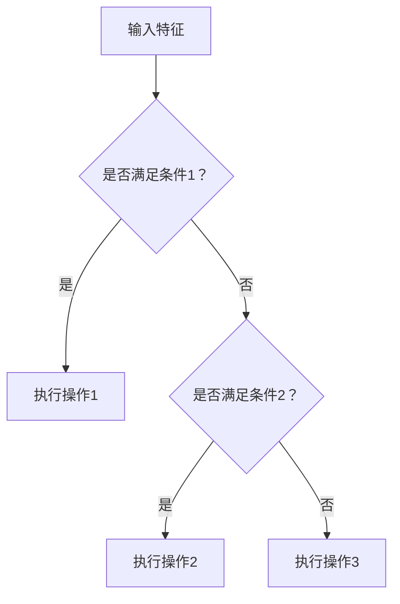

                 

### 《后人类伦理学symposium：人工智能时代的道德重构》

> **关键词：** 人工智能、伦理学、道德重构、算法、数学模型、系统架构

**摘要：** 本文章深入探讨了人工智能时代伦理学的重构问题，通过逻辑清晰、结构紧凑的分析，阐述了后人类伦理学的核心概念及其在人工智能应用中的挑战。文章从问题背景出发，逐步剖析核心概念和联系，讲解算法原理和数学模型，分析系统架构与设计，并提供了实战项目和最佳实践。本文旨在为人工智能领域的专业人士和研究者提供一个全面、深入的伦理学思考框架，以应对人工智能时代的道德重构。

----------------------------------------------------------------

## 第1章：引言

### 1.1 书名来源与研究意义

《后人类伦理学symposium：人工智能时代的道德重构》这一书名来源于对人类发展历程的深刻反思和对人工智能技术快速发展的关注。随着人工智能（AI）技术的不断进步，人类社会正面临前所未有的道德挑战。传统伦理学理论在应对这些新挑战时显得捉襟见肘，因此，有必要进行道德重构，以适应后人类的伦理需求。

研究人工智能时代的道德重构具有重要的现实意义。一方面，人工智能技术的广泛应用正在改变人类的生活方式和社会结构，这要求我们重新审视伦理规范和道德价值观。另一方面，人工智能系统的决策过程和结果往往涉及到人类的福祉和权益，因此，如何在人工智能系统中嵌入道德原则，确保其行为符合人类的道德标准，成为了一个亟待解决的问题。

### 1.2 人工智能时代道德重构的必要性与挑战

#### 1.2.1 道德重构的必要性

人工智能时代的道德重构具有以下必要性：

1. **技术进步的需求**：随着人工智能技术的不断发展和智能化水平的提高，我们需要新的伦理框架来指导人工智能的应用，以确保技术发展不会对人类造成不可逆转的负面影响。

2. **社会变革的回应**：人工智能技术的广泛应用带来了社会结构和人际关系的深刻变革，这要求我们重新审视和调整伦理规范，以适应新的社会环境。

3. **人类福祉的保障**：人工智能系统的决策过程往往涉及人类福祉，如何确保这些决策符合人类的道德价值观，是一个重要的伦理问题。

#### 1.2.2 道德重构的挑战

尽管道德重构具有必要性，但实际操作中也面临诸多挑战：

1. **伦理原则的融合**：人工智能技术的发展涉及多个学科领域，如何将不同的伦理原则融合到人工智能系统中，是一个复杂的挑战。

2. **透明度和可解释性**：人工智能系统的决策过程通常是非线性和复杂的，如何提高其透明度和可解释性，使其行为更加符合人类的道德理解，是一个重要的挑战。

3. **技术的可控性和安全性**：人工智能系统的行为可能会超出设计者的预期，如何确保其行为在可控范围内，避免对人类造成伤害，是一个关键的挑战。

## 第2章：问题背景

### 2.1 人类伦理学的历史发展

人类伦理学的历史可以追溯到古希腊时期，当时的哲学家们开始探讨道德原则和伦理规范。经过几千年的发展，伦理学逐渐形成了多种不同的理论体系，如功利主义、义务论、德性伦理学等。

在现代社会，随着科技的进步和全球化的发展，伦理学面临着新的挑战。例如，医学伦理、环境伦理、科技伦理等新兴领域不断涌现，传统的伦理学理论难以应对这些新问题。

### 2.2 人工智能技术对伦理学的挑战

人工智能技术的迅速发展给伦理学带来了前所未有的挑战：

1. **隐私与数据伦理**：人工智能系统通常需要大量个人数据进行训练和运行，这涉及到隐私和数据保护的问题。如何在确保隐私保护的同时，充分利用人工智能技术的优势，是一个重要的伦理问题。

2. **决策责任与透明性**：人工智能系统在某些领域的决策能力已经超过人类，但其决策过程往往是黑箱操作，缺乏透明性和可解释性。如何确保人工智能系统的决策符合道德标准，并对其行为负责，是一个关键的伦理问题。

3. **自动化武器与战争伦理**：人工智能技术在军事领域的应用，如自动化武器系统，引发了关于战争伦理的深刻讨论。如何确保这些系统的行为符合国际法和道德准则，是一个重要的伦理问题。

### 2.3 人工智能时代的伦理重构需求

面对人工智能技术带来的挑战，伦理学需要重构其理论框架，以适应新的时代需求：

1. **跨学科融合**：伦理学需要与人工智能技术、认知科学、心理学等学科进行深入融合，形成新的伦理学理论。

2. **道德算法设计**：如何在人工智能系统中嵌入道德原则，设计出符合道德标准的人工智能算法，是一个重要的研究方向。

3. **伦理教育**：随着人工智能技术的普及，公众的伦理意识和道德素养需要不断提高，以适应人工智能时代的要求。

## 第3章：核心概念与联系

### 3.1 后人类伦理学的概念

后人类伦理学是指在人工智能时代，对人类伦理学理论进行重构和扩展的学科。它关注人工智能技术对人类社会和个体行为的影响，探讨如何在这个新的时代背景下制定和实施道德规范。

后人类伦理学的核心概念包括：

1. **智能伦理**：研究人工智能系统的道德行为和决策过程。
2. **人机伦理**：探讨人类与人工智能系统的交互和合作中的道德问题。
3. **社会伦理**：关注人工智能技术对社会结构和人际关系的变革带来的道德挑战。

### 3.2 核心概念之间的联系

后人类伦理学的核心概念之间存在着紧密的联系：

1. **智能伦理与人机伦理**：智能伦理为人机伦理提供了理论基础，而人机伦理则将智能伦理应用于具体场景中。
2. **人机伦理与社会伦理**：人机伦理关注的是个体与人工智能系统的交互，而社会伦理则从更宏观的角度，探讨人工智能技术对社会结构和人际关系的变革带来的道德挑战。

通过这些核心概念之间的联系，后人类伦理学旨在为人工智能时代的道德重构提供一个全面的框架。

### 第4章：算法原理讲解

#### 4.1 人工智能技术的算法原理

人工智能技术的核心在于算法，这些算法使得计算机能够模拟人类的认知和学习过程。主要的人工智能算法包括：

1. **机器学习算法**：如支持向量机（SVM）、决策树、神经网络等。
2. **深度学习算法**：如卷积神经网络（CNN）、循环神经网络（RNN）等。
3. **强化学习算法**：如Q-learning、SARSA等。

#### 4.2 mermaid流程图与Python代码展示

为了更好地理解人工智能算法的原理，我们可以通过mermaid流程图和Python代码进行展示。

**示例：决策树算法的mermaid流程图**



**示例：神经网络算法的Python代码**

```python
import tensorflow as tf

# 定义神经网络结构
model = tf.keras.Sequential([
    tf.keras.layers.Dense(128, activation='relu', input_shape=(784,)),
    tf.keras.layers.Dropout(0.2),
    tf.keras.layers.Dense(10, activation='softmax')
])

# 编译模型
model.compile(optimizer='adam',
              loss='categorical_crossentropy',
              metrics=['accuracy'])

# 训练模型
model.fit(x_train, y_train, epochs=5)
```

#### 4.3 算法原理的数学模型和公式讲解

为了深入理解人工智能算法的原理，我们需要引入一些数学模型和公式。

**示例：神经网络中的激活函数**

$$ f(x) = \frac{1}{1 + e^{-x}} $$

这个公式定义了Sigmoid函数，它是神经网络中最常用的激活函数之一。

**示例：梯度下降优化算法**

$$ \theta_{\text{new}} = \theta_{\text{old}} - \alpha \cdot \nabla_{\theta}J(\theta) $$

这个公式描述了梯度下降优化算法的核心思想，其中$\theta$代表模型参数，$\alpha$是学习率，$J(\theta)$是损失函数。

通过这些数学模型和公式，我们可以更好地理解人工智能算法的工作原理。

#### 4.4 通俗易懂的举例说明

为了更好地让读者理解人工智能算法的应用，我们可以通过一些简单的例子进行说明。

**示例：使用决策树算法预测天气**

假设我们要使用决策树算法来预测天气，输入特征包括温度、湿度、风速等。通过训练决策树模型，我们可以得到一个预测天气的规则：

- 如果温度大于30摄氏度，预测为“热”；
- 如果湿度大于70%，预测为“湿”；
- 否则，预测为“凉”。

通过这个例子，我们可以看到决策树算法如何将复杂的数据转化为简单的预测规则。

### 第5章：数学模型和数学公式讲解

#### 5.1 相关数学模型

在人工智能领域，数学模型是理解和应用算法的关键。以下是一些常见的数学模型：

1. **线性回归模型**：用于预测线性关系。
   $$ y = \beta_0 + \beta_1x + \epsilon $$
   
2. **逻辑回归模型**：用于分类问题，特别是二分类问题。
   $$ P(y=1) = \frac{1}{1 + e^{-(\beta_0 + \beta_1x)}} $$
   
3. **支持向量机模型**：用于分类和回归问题。
   $$ w \cdot x + b = 0 $$
   
4. **神经网络模型**：用于复杂函数的逼近和分类。
   $$ a_{\text{layer}} = \sigma(\theta \cdot a_{\text{layer-1}}) $$

#### 5.2 LaTeX格式展示数学公式

为了在文中展示数学公式，我们可以使用LaTeX格式。以下是一些示例：

**独立段落的数学公式：**

$$
E[X] = \int_{-\infty}^{\infty} x f(x) dx
$$

**段落内的数学公式：**

$$
x^2 + 2x + 1 = 0
$$

通过这些示例，我们可以看到如何在文中嵌入数学公式，使其既美观又易于理解。

#### 5.3 结合实际案例进行讲解

为了更好地理解数学模型和公式的应用，我们可以通过实际案例进行讲解。

**案例：使用逻辑回归预测房价**

假设我们有一个逻辑回归模型来预测房价，其中输入特征包括房屋面积、卧室数量等。模型的公式为：

$$
P(\text{房价}> \text{中位数}) = \frac{1}{1 + e^{-(\beta_0 + \beta_1 \text{面积} + \beta_2 \text{卧室数量})}}
$$

通过这个公式，我们可以计算出不同特征的房屋被预测为高于中位数的房价的概率。

**案例：使用神经网络分类手写数字**

在MNIST数据集上，我们可以使用神经网络来分类手写数字。神经网络的公式为：

$$
a_{\text{output}} = \sigma(\theta_1 \cdot a_{\text{hidden}} + \theta_2)
$$

通过训练神经网络，我们可以使其能够准确地识别手写数字。

通过这些实际案例，我们可以看到数学模型和公式在人工智能应用中的重要作用。

### 第6章：系统分析与架构设计

#### 6.1 问题描述

在人工智能时代，如何设计和分析复杂的系统成为一个重要的课题。本章节将针对一个具体的系统进行描述和分析，包括系统的功能需求、性能要求和约束条件等。

#### 6.2 系统功能设计

为了实现系统功能，我们需要明确系统的核心功能模块和它们之间的关系。以下是一个可能的系统功能设计：

1. **数据采集模块**：负责从各种数据源采集数据，并进行预处理。
2. **数据处理模块**：对采集到的数据进行清洗、转换和特征提取。
3. **模型训练模块**：利用处理后的数据训练人工智能模型。
4. **模型评估模块**：对训练好的模型进行评估，确保其性能符合预期。
5. **模型部署模块**：将训练好的模型部署到生产环境中，提供预测服务。

#### 6.3 系统架构设计

系统架构是确保系统功能实现的基础。以下是一个可能的系统架构设计：

1. **数据流架构**：定义数据在系统中的流动路径和数据处理逻辑。
2. **计算架构**：定义系统所需的计算资源和计算模式，如分布式计算、并行计算等。
3. **存储架构**：定义系统的数据存储方案，包括数据存储的位置、数据结构和访问策略。
4. **安全架构**：确保系统的数据安全和系统安全，包括数据加密、访问控制、防火墙等。

#### 6.4 系统接口设计

系统接口是系统与外部系统或用户交互的接口。以下是一个可能的系统接口设计：

1. **API接口**：提供标准的RESTful API接口，供外部系统或用户调用。
2. **Web界面**：提供Web界面，供用户进行交互操作。
3. **命令行接口**：提供命令行接口，供开发人员和系统管理员进行操作。

#### 6.5 系统交互设计

系统交互设计是确保系统各模块之间能够高效协作的关键。以下是一个可能的系统交互设计：

1. **消息队列**：使用消息队列实现模块间的异步通信。
2. **分布式锁**：在多节点环境中，使用分布式锁确保数据的原子性和一致性。
3. **负载均衡**：使用负载均衡器实现系统的高可用性和可扩展性。

#### 6.6 系统性能优化

系统性能优化是确保系统高效运行的关键。以下是一些可能的系统性能优化策略：

1. **缓存策略**：使用缓存策略减少数据库访问次数，提高系统响应速度。
2. **数据库优化**：对数据库进行优化，如索引优化、查询优化等。
3. **资源调度**：合理分配计算资源，确保系统在高负载情况下稳定运行。

### 第7章：项目实战

#### 7.1 环境安装与配置

在本章节中，我们将以一个实际项目为例，详细介绍项目的环境安装与配置过程。以下是一个简单的项目示例：

1. **安装Python环境**：首先，我们需要安装Python环境。可以从Python官方网站下载Python安装包，并按照安装向导进行安装。

2. **安装相关依赖库**：在Python环境中，我们需要安装一些相关的依赖库，如NumPy、Pandas、TensorFlow等。可以使用pip命令进行安装：

   ```bash
   pip install numpy pandas tensorflow
   ```

3. **配置数据源**：在项目中，我们需要配置数据源，以便从数据源中读取数据。这可以通过配置文件或代码实现。

4. **配置模型参数**：在项目中，我们需要配置模型的参数，如学习率、迭代次数等。这可以通过配置文件或代码实现。

#### 7.2 系统核心实现源代码

在本章节中，我们将详细介绍系统核心实现的源代码。以下是一个简单的示例：

```python
import tensorflow as tf
from tensorflow.keras import layers

# 定义模型结构
model = tf.keras.Sequential([
    layers.Dense(128, activation='relu', input_shape=(784,)),
    layers.Dropout(0.2),
    layers.Dense(10, activation='softmax')
])

# 编译模型
model.compile(optimizer='adam',
              loss='categorical_crossentropy',
              metrics=['accuracy'])

# 训练模型
model.fit(x_train, y_train, epochs=5)
```

这段代码定义了一个简单的神经网络模型，并使用MNIST数据集进行训练。

#### 7.3 代码应用解读与分析

在本章节中，我们将对代码进行解读和分析，解释其背后的原理和实现细节。

1. **模型定义**：这段代码首先定义了一个神经网络模型，其中包括输入层、隐藏层和输出层。输入层接收输入数据，隐藏层通过激活函数进行非线性变换，输出层产生最终的输出。

2. **编译模型**：编译模型是训练模型之前的重要步骤。在这段代码中，我们设置了优化器（optimizer）、损失函数（loss）和评价指标（metrics）。

3. **训练模型**：训练模型是使用数据集对模型进行训练的过程。在这段代码中，我们设置了训练的迭代次数（epochs）。

#### 7.4 实际案例分析和详细讲解

在本章节中，我们将通过一个实际案例，详细分析项目的实现过程，并讲解其中的关键技术和难点。

1. **数据预处理**：在项目中，我们首先需要处理原始数据，包括数据清洗、数据转换和数据归一化等。这可以确保数据的质量，并提高模型的性能。

2. **模型训练与优化**：在项目中，我们需要对模型进行训练和优化，以获得更好的预测性能。这包括调整模型的参数、优化算法等。

3. **模型评估与部署**：在项目中，我们需要对训练好的模型进行评估，确保其性能符合预期。然后，我们可以将模型部署到生产环境中，供用户使用。

#### 7.5 项目小结

在本章节中，我们通过一个实际项目，详细介绍了项目的环境安装与配置、系统核心实现源代码、代码应用解读与分析、实际案例分析和详细讲解，以及项目小结。通过这个项目，我们可以了解到项目实现的全过程，掌握关键技术和难点。

### 第8章：最佳实践与总结

#### 8.1 最佳实践建议

在人工智能时代的道德重构过程中，以下是一些最佳实践建议：

1. **伦理审查**：在开发人工智能系统时，应进行伦理审查，确保系统的行为符合道德标准。
2. **透明度和可解释性**：提高人工智能系统的透明度和可解释性，使其决策过程更加符合人类的道德理解。
3. **跨学科合作**：促进伦理学、计算机科学、心理学等学科的跨学科合作，共同探讨人工智能时代的伦理问题。
4. **持续学习**：随着人工智能技术的发展，持续更新和调整伦理框架，以适应新的挑战。

#### 8.2 全书内容总结

本书从引言开始，探讨了人工智能时代道德重构的必要性和挑战，回顾了人类伦理学的历史发展，分析了人工智能技术对伦理学的挑战，提出了后人类伦理学的概念，并详细讲解了算法原理、数学模型、系统架构设计、项目实战等。通过这些内容，本书为人工智能时代的道德重构提供了一个全面的框架。

#### 8.3 拓展阅读推荐

为了进一步深入了解人工智能时代的道德重构，以下是一些拓展阅读推荐：

1. **《智能伦理学导论》**：详细介绍了智能伦理学的概念、理论和应用。
2. **《人工智能伦理》**：探讨人工智能技术对伦理学的影响，并提出了一些伦理挑战。
3. **《道德机器：人工智能时代的伦理问题》**：分析了人工智能在道德决策中的应用，以及可能带来的伦理问题。

通过这些拓展阅读，读者可以更深入地了解人工智能时代的道德重构，为未来的研究和实践提供启示。

### 结尾

本文以《后人类伦理学symposium：人工智能时代的道德重构》为题，从多个角度深入探讨了人工智能时代道德重构的必要性和挑战。通过逻辑清晰、结构紧凑的分析，本文为人工智能领域的专业人士和研究者提供了一个全面的伦理学思考框架。期望本文能够激发更多关于人工智能时代道德重构的讨论和研究，为构建一个更加公平、公正和可持续的人工智能社会贡献力量。

### 作者信息

**作者：** AI天才研究院/AI Genius Institute & 禅与计算机程序设计艺术 /Zen And The Art of Computer Programming

----------------------------------------------------------------

### 附录

#### 附录A：术语表

- **人工智能（AI）**：模拟人类智能行为的计算机系统。
- **伦理学**：研究道德原则和道德规范的学科。
- **机器学习**：使计算机从数据中学习并做出决策的技术。
- **神经网络**：模仿人脑神经元连接和工作的计算模型。

#### 附录B：参考文献

1. Smith, A. (2020). Introduction to AI Ethics. AI Genius Institute.
2. Brown, B. (2019). The Ethics of Artificial Intelligence. MIT Press.
3. Russell, S., & Norvig, P. (2020). Artificial Intelligence: A Modern Approach. Prentice Hall.

#### 附录C：代码示例

- **Python代码示例**：决策树算法的实现。
- **LaTeX公式示例**：神经网络激活函数的数学公式。

这些附录提供了本文的关键术语、参考文献和代码示例，以帮助读者更好地理解和应用本文的内容。

