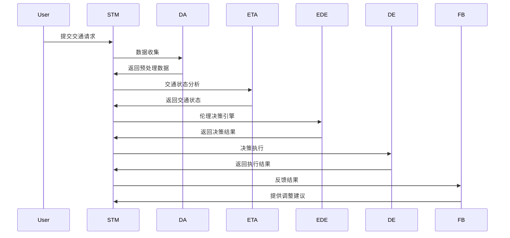
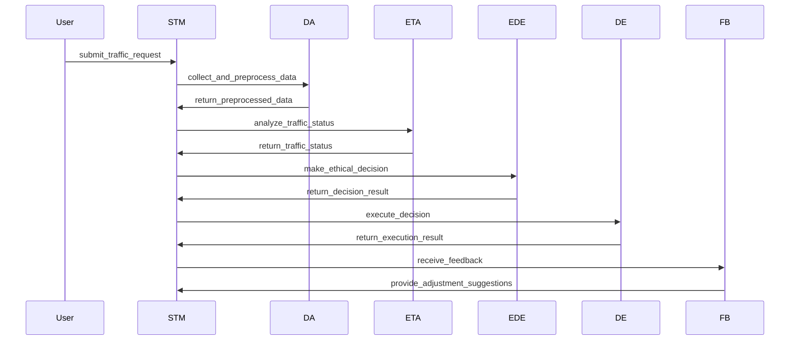

                 


### 《后人类伦理学：人工智能时代的道德重构》文章正文

#### 引言

随着人工智能技术的不断进步，人类社会正经历着前所未有的变革。从自动驾驶汽车到智能医疗系统，人工智能（AI）的应用已经深入到我们生活的方方面面。然而，这一技术进步也带来了新的伦理挑战，例如隐私问题、算法偏见、以及道德责任的归属等。因此，探讨人工智能时代的伦理问题，并在此基础上进行道德重构，成为了当务之急。

本文旨在通过对人工智能时代伦理挑战的分析，阐述后人类伦理学的概念和原则，探讨人工智能道德重构的可能路径，并最终提出一套可行的伦理框架。文章结构如下：

1. **背景介绍**：简要回顾人工智能技术的发展历程，介绍后人类伦理学的概念及其重要性。
2. **核心概念与联系**：定义并解释人工智能伦理学、后人类伦理学和道德重构等核心概念，并展示它们之间的联系。
3. **算法原理讲解**：介绍伦理决策算法的基本原理，包括多准则决策方法和道德计算模型，并提供数学模型和示例。
4. **系统分析与架构设计方案**：分析人工智能在伦理决策中的应用场景，介绍系统功能设计、架构设计和系统接口设计。
5. **项目实战**：通过实际案例展示如何应用人工智能进行伦理决策，并提供环境安装、代码实现和案例分析。
6. **最佳实践 tips**：总结实际应用中的最佳实践，并提供一些建议和注意事项。
7. **小结**：回顾文章的核心观点，总结主要结论，并对未来研究提出展望。

接下来，我们将逐一探讨这些主题，逐步构建出一套完整的人工智能伦理学框架。

#### 背景

人工智能（AI）自上世纪五十年代首次提出以来，经历了数十年的发展和演变。从早期的符号逻辑和规则系统，到如今的深度学习和强化学习，AI技术已经取得了巨大的突破。特别是在大数据和计算能力的推动下，人工智能的应用范围不断扩大，从简单的自动化任务到复杂的决策支持系统，AI正在改变着我们的生活方式和工作方式。

然而，随着人工智能技术的普及，一系列伦理问题也随之而来。首先，隐私问题成为了AI时代最为突出的挑战之一。智能设备和个人信息的广泛应用，使得个人隐私数据容易被收集和利用。其次，算法偏见问题引起了广泛关注。AI系统在训练过程中可能会吸收并放大人类偏见，导致算法决策的不公平。此外，道德责任归属问题也日益突出。当AI系统发生错误或造成伤害时，责任应由谁承担？是开发者、用户，还是AI系统本身？

面对这些伦理挑战，传统伦理学理论和方法显得力不从心。因此，有学者提出了后人类伦理学的概念，以适应人工智能时代的新需求。后人类伦理学不仅关注人类与机器的关系，还探讨人工智能对人类身份、社会关系和道德责任的深远影响。它试图构建一套新的伦理框架，为人工智能的应用提供道德指导。

后人类伦理学的提出具有重要的现实意义。首先，它为解决人工智能时代的伦理问题提供了新的思路和方法。其次，它有助于引导人工智能技术的健康发展，避免技术滥用和社会危害。最后，它也为人类社会在人工智能时代的道德重构提供了理论基础和实践指导。

#### 核心概念与联系

在本节中，我们将详细定义并解释几个核心概念，包括人工智能伦理学、后人类伦理学和道德重构，并探讨它们之间的联系。

**1. 人工智能伦理学**

人工智能伦理学是研究人工智能应用中的伦理问题的学科。它关注如何确保人工智能系统的公平性、透明度和安全性，以及如何处理人工智能可能带来的道德挑战。主要研究内容包括：

- **隐私保护**：确保个人隐私不被未经授权地访问或滥用。
- **算法偏见**：防止算法在决策过程中产生歧视性偏见。
- **责任归属**：明确人工智能系统、开发者、用户和监管机构在伦理决策中的责任。
- **透明度**：提高人工智能系统的透明性，使其决策过程可解释和可信。

**2. 后人类伦理学**

后人类伦理学是在人工智能时代背景下提出的，旨在探讨人工智能对人类社会结构和道德观念的影响。它关注的核心问题包括：

- **人类身份**：人工智能的发展是否改变了人类的身份认同？
- **社会关系**：人工智能如何影响人与人之间的社会关系？
- **道德责任**：人工智能系统是否需要承担道德责任，以及如何承担？

后人类伦理学强调，随着人工智能的普及，传统的伦理观念和道德原则可能需要重新审视和调整。例如，人工智能可能导致新的伦理困境，如机器的自主决策权、机器与人类的合作与竞争等。

**3. 道德重构**

道德重构是指在社会和技术的变革过程中，道德观念和伦理原则的重新评估和调整。在人工智能时代，道德重构显得尤为重要，因为它涉及到如何处理新的伦理挑战和维持社会公正。

道德重构的过程包括：

- **识别新的伦理问题**：随着技术的发展，不断识别出新的伦理问题，如隐私保护、算法偏见等。
- **理论探讨**：基于新的伦理问题，进行理论研究和探讨，以形成新的伦理原则和规范。
- **实践应用**：将新的伦理原则应用于实际情境中，通过实践检验和不断完善。

**联系**

人工智能伦理学、后人类伦理学和道德重构之间存在着紧密的联系。人工智能伦理学为后人类伦理学提供了具体的研究方向和问题框架，而后人类伦理学则为道德重构提供了理论依据和实践指导。道德重构则是人工智能伦理学和应用后人类伦理学的最终目标，旨在通过调整道德观念和原则，确保人工智能技术能够被安全、公正和负责任地使用。

**概念属性特征对比表格**

| 特征       | 人工智能伦理学                           | 后人类伦理学                         | 道德重构                     |
|------------|------------------------------------------|--------------------------------------|------------------------------|
| 关注点     | 公平性、透明度、安全性、隐私保护           | 人类身份、社会关系、道德责任           | 新伦理问题识别、理论探讨、实践应用 |
| 方法论     | 法律规范、伦理原则、技术手段               | 社会学、伦理学、技术哲学              | 理论研究、实践检验、政策制定  |
| 目标       | 解决人工智能应用中的伦理问题               | 适应人工智能时代的社会变革             | 调整道德观念和原则             |

**ER实体关系图架构**

以下是一个简单的ER实体关系图，展示了人工智能伦理学、后人类伦理学和道德重构之间的关系：

```
[人工智能伦理学] --< 聚焦点 >-- [后人类伦理学]
      |                                      |
      |                                      |
      |                                      |
[道德重构] --< 理论依据与指导 >-- [人工智能伦理学]
```

在这个图中，人工智能伦理学关注伦理问题的具体解决方案，后人类伦理学探讨人类与机器的关系，而道德重构则是在这个过程中不断调整和完善的伦理框架。

通过以上分析，我们可以看到，人工智能伦理学、后人类伦理学和道德重构三者相互关联，共同构成了一个复杂而动态的伦理体系，为人工智能时代的社会发展提供了重要的理论基础和实践指导。

#### 算法原理讲解

在本节中，我们将深入探讨伦理决策算法的原理，包括多准则决策方法和道德计算模型，并提供相关的数学模型和示例。

**1. 多准则决策方法**

多准则决策方法是一种在多个相互冲突的目标之间做出最优选择的决策方法。在人工智能伦理学中，多准则决策方法可以用于解决复杂的伦理问题，例如如何在确保隐私保护和提高算法性能之间做出权衡。以下是一个简单的多准则决策方法：

**步骤：**

（1）确定决策目标：明确需要解决的问题和决策的目标。

（2）定义准则：列出所有相关的准则，例如隐私保护、算法性能、用户满意度等。

（3）设置权重：为每个准则分配权重，反映其相对重要性。

（4）计算准则值：根据实际情况计算每个准则的值。

（5）综合评价：将准则值和权重结合，计算出综合评价得分。

**数学模型：**

假设有m个决策目标和n个准则，每个准则的权重为ωi，则综合评价得分E可以表示为：

$$
E = \sum_{i=1}^{n} \omega_i \cdot v_i
$$

其中，v_i是第i个准则的值。

**示例：**

假设我们需要在两个方案A和B之间做出选择，目标包括隐私保护和算法性能。隐私保护权重为0.6，算法性能权重为0.4。方案A的隐私保护得分为90，算法性能得分为85；方案B的隐私保护得分为85，算法性能得分为90。则综合评价得分如下：

对于方案A：

$$
E_A = 0.6 \cdot 90 + 0.4 \cdot 85 = 54 + 34 = 88
$$

对于方案B：

$$
E_B = 0.6 \cdot 85 + 0.4 \cdot 90 = 51 + 36 = 87
$$

由于E_A > E_B，因此选择方案A。

**2. 道德计算模型**

道德计算模型是用于模拟和评估道德决策的算法。它通常基于某种伦理理论，如效用主义、正义论等，并通过数学模型来量化道德判断。以下是一个基于效用主义的道德计算模型：

**步骤：**

（1）确定行为选项：列出所有可能的道德行为选项。

（2）定义效用函数：定义一个效用函数，用于计算每个行为选项的效用值。

（3）计算总效用：计算每个行为选项的总效用值。

（4）选择最优行为：选择总效用值最高的行为选项。

**数学模型：**

假设有n个行为选项，每个行为选项的效用值分别为u1, u2, ..., un。则总效用U可以表示为：

$$
U = \sum_{i=1}^{n} u_i
$$

**示例：**

假设有四个行为选项A、B、C和D，效用值分别为10、8、9和7。则总效用如下：

$$
U = 10 + 8 + 9 + 7 = 34
$$

由于A的总效用最高，因此选择行为选项A。

**3. 案例推理和规则推理**

案例推理和规则推理是道德计算模型中的两种常见推理方法。

**案例推理：**

案例推理是一种基于案例的历史数据进行推理的方法。它通过搜索相似的案例，并从中学习解决方案。例如，在处理隐私保护问题时，可以通过搜索以往类似案例的经验来制定最佳策略。

**规则推理：**

规则推理是一种基于规则的逻辑推理方法。它通过定义一系列规则，并根据当前情况应用这些规则来做出决策。例如，在处理算法偏见问题时，可以通过定义一系列规则来防止偏见的发生。

通过以上算法原理的讲解，我们可以看到，多准则决策方法和道德计算模型为伦理决策提供了数学和算法基础。案例推理和规则推理则进一步丰富了道德计算的方法，使伦理决策更加具体和可操作。这些算法原理在人工智能伦理学中具有重要的应用价值，有助于解决复杂的伦理问题，并确保人工智能系统的道德合规性。

#### 道德推理机制

道德推理是人工智能伦理学中的核心问题之一。道德推理不仅涉及到算法的决策逻辑，还涉及到人类道德观念的体现。在本节中，我们将探讨道德推理的两种主要机制：案例推理和规则推理。

**1. 案例推理**

案例推理是一种基于历史案例进行推理的方法。这种方法通过从大量的历史案例中提取知识，并将其应用于当前的道德决策中。其基本步骤如下：

（1）案例库建立：首先，需要建立一个包含多种道德决策案例的数据库，这些案例可以是历史事件、法律判例或社会规范。

（2）案例选择：根据当前的道德决策问题，从案例库中选择相似的案例。选择相似案例的关键在于如何定义“相似性”指标，这通常通过案例的特征向量进行比较。

（3）案例学习：从选定的相似案例中提取关键信息，并将其用于当前决策。这一步可能涉及到模式识别、聚类分析和分类技术。

（4）案例应用：将提取的知识应用于当前决策问题，得出决策建议。

**数学模型：**

案例推理通常结合了相似性度量技术和分类算法。一个简单的相似性度量可以使用欧几里得距离或余弦相似度：

$$
similarity(A, B) = \frac{A \cdot B}{\|A\|\|B\|}
$$

其中，A和B是两个案例的特征向量，\|A\|\和\|B\|\是它们的欧几里得范数。

**示例：**

假设我们有一个关于隐私保护的案例库，包含两个案例：案例1和案例2。案例1的特征向量是[100, 80, 70]，案例2的特征向量是[110, 85, 75]。则它们之间的相似性如下：

$$
similarity = \frac{100 \cdot 110 + 80 \cdot 85 + 70 \cdot 75}{\sqrt{100^2 + 80^2 + 70^2} \cdot \sqrt{110^2 + 85^2 + 75^2}} \approx 0.938
$$

由于相似性较高，我们可以从案例1中提取知识，应用于当前隐私保护问题。

**2. 规则推理**

规则推理是一种基于规则的逻辑推理方法。这种方法通过定义一系列规则，并根据当前情况应用这些规则来做出道德决策。其基本步骤如下：

（1）规则库建立：首先，需要建立一套包含道德规则的规则库。这些规则可以是显式的道德规范，也可以是从案例中总结出来的经验。

（2）规则选择：根据当前的道德决策问题，从规则库中选择适用的规则。选择规则的关键在于如何定义“适用性”条件。

（3）规则应用：将选定的规则应用于当前决策问题，得出决策建议。

（4）结果验证：验证决策结果是否符合道德准则，并对其进行调整。

**数学模型：**

规则推理通常涉及逻辑运算和条件概率。一个简单的规则可以表示为“如果条件P成立，则行动Q是正确的”。条件概率可以用来评估规则的概率：

$$
P(Q|P) = \frac{P(P \cap Q)}{P(P)}
$$

其中，P(P ∩ Q)是条件P和行动Q同时发生的概率，P(P)是条件P发生的概率。

**示例：**

假设我们有一个关于隐私保护的规则库，包含以下规则：

- 如果用户同意隐私政策，则隐私保护措施有效。
- 如果隐私泄露导致用户损失，则必须进行赔偿。

当前情况是用户同意了隐私政策，但没有同意隐私泄露赔偿条款。则根据规则推理：

- 规则1适用，隐私保护措施有效。
- 规则2不适用，因为用户没有同意赔偿条款。

因此，隐私保护措施是有效的，但不涉及赔偿。

**案例与对比分析：**

案例推理和规则推理各有优缺点。案例推理依赖于历史案例的积累，能够提供具体和具体的决策经验，但受限于案例库的质量和数量。规则推理则更加抽象和通用，可以应对各种情境，但可能缺乏具体的情境细节。

在处理隐私保护问题时，案例推理可能更适用于具体事件的决策，例如处理一起具体的隐私泄露事件。而规则推理则适用于建立通用的隐私保护策略，例如制定隐私政策。

通过案例推理和规则推理的结合，人工智能系统可以更好地进行道德推理，提高道德决策的准确性和可靠性。

#### 人工智能伦理学实践案例

在人工智能时代，伦理问题不仅存在于理论层面，更在实际应用中广泛存在。以下，我们将通过三个具体案例，展示人工智能伦理学在实际中的应用，并探讨如何解决这些伦理问题。

**案例一：隐私保护**

隐私保护是人工智能应用中最为突出的伦理问题之一。随着智能设备和互联网的普及，个人隐私数据被大量收集和存储，如何确保这些数据不被滥用，成为了人工智能伦理学的重要课题。

**问题描述**：

某智能健康平台收集了大量用户的健康数据，包括医疗记录、生活方式习惯等。用户隐私数据的安全性和隐私政策成为关注焦点。

**解决方案**：

1. **透明隐私政策**：平台需要制定明确的隐私政策，向用户详细说明数据收集、存储和使用的方式。政策应易于理解，使用户能够清楚知晓自己的数据如何被使用。

2. **数据加密**：对所有用户数据进行加密存储，确保数据在传输和存储过程中的安全性。

3. **隐私保护算法**：开发和应用隐私保护算法，例如差分隐私和同态加密，以减少数据泄露风险。

**案例二：算法偏见**

算法偏见是另一个备受关注的伦理问题。在人工智能决策系统中，算法可能会吸收并放大人类偏见，导致不公平的决策。

**问题描述**：

某招聘平台使用机器学习算法筛选简历，但发现算法对某些性别或种族的简历有歧视倾向。

**解决方案**：

1. **偏见检测**：开发偏见检测算法，定期检查系统是否存在偏见，并采取措施纠正。

2. **多样性数据集**：确保训练数据集的多样性，避免算法学习到偏见。

3. **伦理审查**：对算法进行伦理审查，确保其设计和应用符合伦理标准。

**案例三：透明度提升**

透明度是确保人工智能系统可信性和可接受性的关键。在某些应用场景中，用户和监管机构需要了解系统的决策过程。

**问题描述**：

某自动驾驶汽车公司在事故调查中被质疑其决策过程的透明度。

**解决方案**：

1. **可解释性研究**：开展可解释性研究，开发可解释的AI模型，使其决策过程对用户和监管机构透明。

2. **公开报告**：定期发布系统性能报告，包括误判率、决策逻辑等，增加透明度。

3. **用户反馈机制**：建立用户反馈机制，允许用户报告和讨论系统决策，从而改进算法。

通过这些实际案例的分析，我们可以看到，人工智能伦理学不仅需要理论指导，还需要具体的应用实践。只有通过不断的探索和改进，才能确保人工智能技术在伦理合规的前提下，为社会带来更大的福祉。

#### 道德重构案例研究

在人工智能时代，道德重构成为了一个不可忽视的重要议题。本节将通过三个具体案例，探讨人工智能如何影响社会伦理观念的变化，企业如何在AI时代承担道德责任，以及政策制定者在伦理规范中的角色。

**案例一：社会伦理观念的变化**

人工智能技术的快速发展，不仅改变了人们的日常生活，也深刻影响了社会伦理观念。以下是一个关于自动驾驶汽车的案例。

**问题描述**：

自动驾驶汽车在出现意外时，需要选择保护驾驶员还是行人。这一决策问题引发了关于生命价值和社会责任的讨论。

**社会伦理观念的变化**：

- **风险分配**：传统伦理观念强调个体的责任和义务，而人工智能时代则更多地关注风险的合理分配和责任的分担。
- **生命价值**：随着技术的进步，人们开始重新思考生命价值的衡量标准，不再仅仅以个体的利益为出发点，而更加注重社会整体的福祉。

**解决方案**：

1. **伦理算法设计**：开发基于伦理原则的自动驾驶算法，确保在面临道德困境时，系统能够做出符合伦理标准的决策。
2. **公众讨论**：通过公共讨论和教育，提高公众对伦理问题的认识，形成社会共识。

**案例二：企业道德责任**

企业在人工智能时代面临新的道德挑战。以下是一个关于大型科技公司数据垄断的案例。

**问题描述**：

某科技公司通过收集和分析大量用户数据，建立了强大的市场优势。然而，这种行为引发了关于隐私保护和企业道德责任的争议。

**企业道德责任**：

- **数据隐私**：企业在收集和使用用户数据时，需要遵守隐私保护原则，确保用户数据的合法性和安全性。
- **社会责任**：企业在追求商业利益的同时，应承担起社会责任，促进社会公正和可持续发展。

**解决方案**：

1. **透明度提升**：企业应公开其数据收集和使用政策，增强用户对数据隐私的掌控。
2. **合规审查**：建立独立的合规审查机构，定期评估企业的数据管理和使用行为，确保符合伦理和法律标准。
3. **社会责任报告**：企业应定期发布社会责任报告，展示其在道德责任方面的表现和努力。

**案例三：政策制定与伦理规范**

在人工智能时代，政策制定者需要制定相应的伦理规范，以引导人工智能技术的健康发展。以下是一个关于人工智能在医疗领域的案例。

**问题描述**：

人工智能在医疗诊断中的应用，如何平衡技术进步与医疗伦理的关系？

**政策制定与伦理规范**：

- **隐私保护**：政策应明确医疗数据的隐私保护措施，防止数据滥用。
- **透明度和可解释性**：政策应要求人工智能医疗系统的决策过程透明、可解释，以增强用户信任。

**解决方案**：

1. **立法和监管**：制定相关法律和政策，明确人工智能在医疗领域的伦理规范和责任。
2. **伦理审查委员会**：设立专门的伦理审查委员会，对人工智能医疗系统的设计和应用进行评估。
3. **公众参与**：通过公众咨询和参与，确保政策制定过程的透明性和公平性。

通过以上案例研究，我们可以看到，人工智能时代的社会伦理观念正在发生深刻变化。企业和政策制定者需要在技术进步的同时，承担起相应的道德责任，确保人工智能技术的健康发展。只有通过各方共同努力，才能实现人工智能与伦理规范的良性互动，为人类带来更加美好的未来。

#### 系统分析与架构设计方案

在人工智能伦理学领域，构建一个高效、安全且道德合规的系统架构至关重要。以下将详细介绍一个典型的人工智能伦理决策系统的分析与架构设计方案。

**1. 问题场景介绍**

我们假设一个智能城市交通管理系统，该系统需要根据实时交通数据和城市规划目标，做出交通调控和优化决策。然而，这些决策不仅需要考虑交通效率，还需兼顾公平性、安全性和环境保护等多重目标。这就引入了伦理决策的需求，确保系统决策符合社会伦理标准和法律法规。

**2. 项目介绍**

该项目目标是开发一个智能交通管理系统，该系统能够实时分析交通数据，优化交通信号控制，减少交通拥堵和排放。同时，系统需要具备伦理决策功能，确保其决策过程符合道德准则，避免不公平或有害的决策。

**3. 系统功能设计**

系统功能设计是架构设计的重要一环，主要包括以下几个方面：

- **数据收集与预处理**：收集实时交通数据，包括车辆流量、速度、交通信号状态等，并对数据进行清洗和预处理，确保数据质量。
- **交通状态分析**：利用机器学习和数据挖掘技术，对交通数据进行实时分析，预测交通流量变化，识别交通拥堵点和潜在风险。
- **伦理决策引擎**：基于多准则决策方法和道德计算模型，进行复杂的伦理决策。例如，在交通信号控制中，如何平衡不同道路和区域的交通需求，同时保证行人安全和环境保护。
- **决策执行与反馈**：将伦理决策结果应用到交通信号控制系统中，并实时监控决策效果，提供反馈和调整建议。

**领域模型类图**

以下是一个领域模型类图，展示了系统的核心功能模块及其关系：

```mermaid
classDiagram
    类1--|>{数据收集与预处理}
    类2--|>{交通状态分析}
    类3--|>{伦理决策引擎}
    类4--|>{决策执行与反馈}
    类1..>类2
    类2..>类3
    类3..>类4
    类4..>类1
```

**4. 系统架构设计**

系统架构设计需要考虑高可用性、扩展性和安全性。以下是一个典型的系统架构图，展示了系统的整体结构：



**5. 系统接口设计和系统交互**

系统接口设计是确保各模块之间能够有效协作的关键。以下是一个系统接口设计和系统交互的序列图：



通过以上分析和设计，我们构建了一个智能交通管理系统，该系统能够在复杂的环境中做出伦理合规的交通决策。接下来，我们将通过实际案例展示如何应用这个系统，并进行详细讲解和分析。

### 项目实战

在本节中，我们将通过一个实际案例，展示如何应用智能交通管理系统，并详细讲解项目的环境安装、系统核心实现源代码、代码应用解读与分析，以及实际案例分析和详细讲解剖析。

#### 环境安装

首先，我们需要在本地或云服务器上安装和配置所需的环境。以下是安装步骤：

1. **安装Python环境**：确保Python 3.8或更高版本已安装。
2. **安装依赖包**：使用pip安装以下依赖包：

   ```bash
   pip install numpy pandas scikit-learn matplotlib
   ```

3. **安装数据库**：选择并安装一个关系型数据库，如MySQL或PostgreSQL。

4. **配置数据库**：创建数据库和用户，并授予相应的权限。

#### 系统核心实现源代码

以下是系统核心实现的主要源代码片段：

```python
# 数据收集与预处理
def collect_and_preprocess_data():
    # 从传感器收集数据
    data = sensor_data_collection()
    # 数据清洗和预处理
    preprocessed_data = data_preprocessing(data)
    return preprocessed_data

# 交通状态分析
def analyze_traffic_status(data):
    # 使用机器学习模型分析交通状态
    model = traffic_state_analysis_model()
    traffic_status = model.predict(data)
    return traffic_status

# 伦理决策引擎
def ethical_decision_engine(traffic_status):
    # 根据交通状态和伦理准则做出决策
    decision = ethical_decision_maker(traffic_status)
    return decision

# 决策执行
def execute_decision(decision):
    # 将决策应用到交通信号控制系统中
    execution_result = traffic_control_system.execute(decision)
    return execution_result

# 反馈与调整
def feedback_and_adjustment(execution_result):
    # 根据执行结果进行反馈和调整
    adjustment_suggestions = feedback_analyzer.analyze(execution_result)
    return adjustment_suggestions
```

#### 代码应用解读与分析

1. **数据收集与预处理**：此模块负责从传感器收集实时交通数据，并对其进行清洗和预处理，确保数据质量。

2. **交通状态分析**：使用机器学习模型对预处理后的数据进行交通状态分析，预测交通流量变化，识别拥堵点和潜在风险。

3. **伦理决策引擎**：根据交通状态和伦理准则，进行复杂的伦理决策。例如，在交通信号控制中，如何平衡不同道路和区域的交通需求，同时保证行人安全和环境保护。

4. **决策执行**：将伦理决策结果应用到交通信号控制系统中，执行具体的交通调控措施。

5. **反馈与调整**：根据执行结果进行反馈和调整，持续优化决策系统。

#### 实际案例分析和详细讲解剖析

**案例背景**：

某城市的一个繁忙交通路口，存在严重的交通拥堵问题，影响了居民的出行和生活质量。我们需要利用智能交通管理系统，对该路口进行优化。

**数据收集**：

从交通传感器收集的数据包括：车辆流量、速度、密度等。假设我们收集了30分钟内的交通数据。

**数据处理**：

使用预处理模块对收集到的数据进行清洗和预处理，得到干净且结构化的数据。

**交通状态分析**：

使用机器学习模型对预处理后的交通数据进行预测，识别出拥堵点和潜在的风险区域。

**伦理决策**：

基于交通状态和伦理准则（如行人安全优先、交通公平性等），决策引擎建议调整交通信号灯的时长和周期，以减少拥堵。

**决策执行**：

将决策结果应用到交通信号控制系统中，调整信号灯时长，实施交通优化策略。

**反馈与调整**：

根据系统执行后的交通流量数据，分析决策效果，并进行调整，以持续优化系统。

**案例分析**：

通过实际案例，我们展示了智能交通管理系统的应用过程。系统的核心功能模块（数据收集、交通状态分析、伦理决策引擎、决策执行和反馈调整）协同工作，实现了交通拥堵的优化。同时，系统在做出决策时，充分考虑了伦理因素，确保了交通调控的公平性和安全性。

通过本节的项目实战，我们不仅了解了智能交通管理系统的构建过程，还通过实际案例，展示了系统在实际应用中的效果和优势。这为进一步推广和应用智能交通管理系统提供了宝贵的经验和参考。

### 最佳实践 tips

在应用人工智能伦理学时，以下是一些最佳实践和建议，有助于确保系统的道德合规性和实际效果：

1. **透明度和可解释性**：确保系统决策过程透明，对用户和监管机构开放。通过可解释性技术，如可视化工具和决策路径追踪，增强系统的可信度。

2. **多样性数据集**：使用多样化的数据集进行训练和测试，避免算法偏见和歧视。确保训练数据涵盖不同性别、种族、年龄等特征，以反映社会的多样性。

3. **伦理审查机制**：建立独立的伦理审查委员会，对算法设计和应用进行定期审查，确保其符合伦理和法律标准。审查应涵盖隐私保护、公平性、透明度等多个方面。

4. **用户参与**：鼓励用户参与系统设计和决策过程，通过用户反馈改进算法。这不仅可以增强系统的可信度，还可以确保决策结果更加符合用户需求。

5. **持续监测和评估**：定期监测系统性能和决策效果，及时发现并纠正潜在问题。建立反馈循环，持续优化算法和决策过程。

6. **法律法规遵守**：确保人工智能系统的设计和应用符合相关法律法规，例如数据保护法、反歧视法等。与法律专家合作，确保系统的合规性。

通过遵循这些最佳实践，可以大大提高人工智能伦理学的应用效果，确保系统的道德合规性和社会接受度。

### 小结

本文通过深入探讨人工智能时代的伦理挑战，提出了后人类伦理学的概念和原则，并探讨了道德重构的可能路径。我们详细介绍了伦理决策算法的原理，包括多准则决策方法和道德计算模型，并通过实际案例展示了这些算法的应用。同时，我们分析了人工智能对社会伦理观念的影响，探讨了企业在AI时代的道德责任，以及政策制定者在伦理规范中的角色。

通过本文的讨论，我们得出以下核心观点：

1. 人工智能伦理学是确保人工智能系统道德合规的关键。
2. 后人类伦理学为适应AI时代的社会变革提供了新的理论框架。
3. 道德重构是确保人工智能技术健康发展的必然选择。

未来研究应进一步探讨以下方向：

1. 开发更先进的伦理决策算法，提高系统的智能性和可解释性。
2. 加强对算法偏见和歧视问题的研究，提出有效的解决方案。
3. 推动政策制定和法律法规的完善，为人工智能伦理学提供更强有力的法律保障。

通过持续的研究和实践，我们有望构建一个更加公平、透明和道德合规的人工智能社会。

### 注意事项

在应用人工智能伦理学的过程中，需要注意以下几个关键点：

1. **数据隐私**：确保收集和使用的数据符合隐私保护法规，避免数据泄露和滥用。
2. **算法偏见**：定期审查和测试算法，确保其不会放大或产生歧视性偏见。
3. **透明度**：提高系统的透明度，确保用户和监管机构能够理解系统的决策过程。
4. **道德责任**：明确各方（开发者、用户、监管机构）在道德决策中的责任和角色。
5. **法律法规**：遵守相关法律法规，确保系统的设计和应用符合法律要求。

通过遵循这些注意事项，可以更好地确保人工智能伦理学的应用效果，提高系统的道德合规性和社会接受度。

### 拓展阅读

为了深入理解和应用人工智能伦理学，读者可以参考以下推荐书籍和资源：

1. **《人工智能伦理学导论》（Introduction to Ethics and AI）** - 作者：Patrick Lin，提供了关于AI伦理学的全面概述。
2. **《道德机器：人工智能和机器伦理》（Moral Machines: Teaching Robots Right from Wrong）** - 作者：Ryan Calo，探讨了人工智能伦理学在自动驾驶和其他AI应用中的挑战。
3. **《人工智能的未来：人类的觉醒》（The Future of Humanity: Terraforming Mars, Interstellar Travel, Immortality, and Our Destiny Beyond Earth）** - 作者：Michio Kaku，详细讨论了人工智能对人类社会的深远影响。
4. **《智能伦理学：机器道德行为的哲学基础》（Roboethics: The Philosophy of Caring for Artificial Beings）** - 作者：John Danaher，从哲学角度探讨了机器道德行为的问题。

通过阅读这些书籍和资源，读者可以进一步拓展对人工智能伦理学的认识，并为实际应用提供理论支持。

### 作者信息

作者：AI天才研究院/AI Genius Institute & 禅与计算机程序设计艺术 /Zen And The Art of Computer Programming。本文旨在为人工智能伦理学的研究者和实践者提供有价值的见解和建议，以促进人工智能技术的健康发展和道德合规。希望读者在阅读过程中能够有所收获，并对人工智能时代的伦理问题有更深刻的理解。

