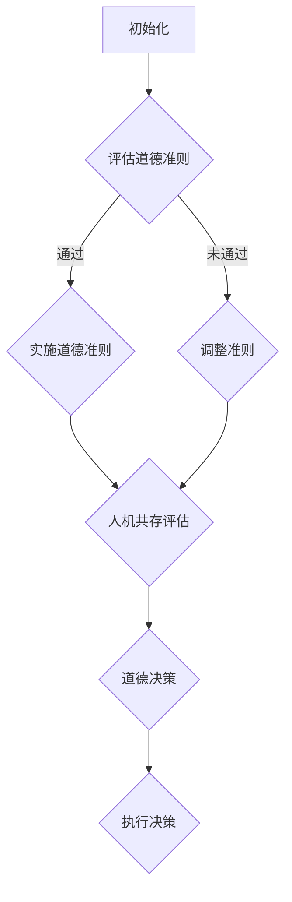

                 

# 后人类伦理学：人机共存的道德准则

关键词：后人类、人机共存、道德准则、伦理学、人工智能

摘要：随着人工智能技术的飞速发展，人类逐渐步入了一个全新的时代——后人类时代。在这个时代，人与机器的共存成为常态，而这一现象不仅带来了前所未有的技术进步，也引发了深刻的伦理挑战。本文将探讨后人类时代人机共存的道德准则，旨在为这一新兴领域提供伦理指导，确保人机共存的和谐与可持续性。

## 第1章 引言

### 1.1 问题的背景与重要性

**核心概念术语说明**

- **后人类**：指在人工智能和生物技术等先进技术影响下，人类超越自然生物极限，获得超常能力的阶段。
- **人机共存**：指人类与机器在生活、工作等各个领域的深度融合，形成共生关系的现象。
- **道德准则**：指关于行为规范的伦理原则，用以指导个体和群体在特定情境下的行为。

**问题背景**

随着科技的飞速发展，人工智能、生物技术、神经科学等领域的突破性进展，人类正逐渐超越自然生物的极限，进入一个全新的时代——后人类时代。在这个时代，人类不仅可以通过基因编辑、脑机接口等手段增强自身能力，还可以通过与机器的深度协作，实现超乎想象的效率和效果。

**问题描述**

然而，这一现象也引发了一系列伦理问题。人机共存的道德准则如何制定？如何平衡人类与机器之间的权力分配？如何在确保科技进步的同时，保护人类的尊严和权利？这些问题亟待解决。

**问题解决**

为了应对上述问题，本文将探讨后人类时代人机共存的道德准则，试图为这一新兴领域提供伦理指导，确保人机共存的和谐与可持续性。

**边界与外延**

本文的研究范围主要涉及人工智能技术与人机共存现象的伦理问题，包括道德准则的制定、权力分配、隐私保护、责任归属等方面。同时，本文也将关注相关领域的学术研究成果和实践经验，为道德准则的制定提供理论依据。

### 1.2 研究目的与目标

**研究目的**

本文旨在探讨后人类时代人机共存的道德准则，为这一新兴领域提供伦理指导，确保人机共存的和谐与可持续性。

**研究目标**

1. 梳理后人类时代人机共存的主要伦理问题。
2. 系统性地分析现有的道德准则框架。
3. 提出针对后人类时代人机共存的道德准则建议。
4. 探讨道德准则的实施与执行策略。

### 1.3 书籍结构概述

本文分为七个主要章节，结构如下：

1. **引言**：介绍问题的背景与重要性，研究目的与目标，以及书籍结构概述。
2. **后人类时代的崛起**：探讨后人类时代的定义、特征、技术发展及其影响。
3. **人机共存的道德准则**：分析人机共存的道德原则，包括平等、正义、知情同意、隐私保护、责任归属等方面。
4. **人机关系的伦理问题**：探讨人机关系中的权力分配、合作与竞争、道德决策与责任等伦理问题。
5. **法律与政策框架**：分析国际与国内法律框架，探讨政策制定与执行策略。
6. **教育与伦理意识培养**：探讨教育体系中的伦理教育，以及社会教育与个人伦理培养。
7. **未来展望与挑战**：预测未来发展趋势，分析潜在问题与解决方案，探讨长远影响与展望。

通过以上章节的论述，本文希望为后人类时代人机共存的道德准则提供全面而深入的探讨，为相关领域的研究与实践提供参考。

## 第2章 后人类时代的崛起

### 2.1 定义与特征

**定义**

后人类时代，又称超人类时代或赛博格时代，是指人类通过人工智能、生物技术、神经科学等先进技术手段，超越自然生物的生理和心理极限，获得超常能力，实现人与机器深度融合的时期。

**特征**

1. **智能增强**：通过人工智能技术，人类可以获得更强大的认知能力、学习能力、解决问题的能力等。
2. **身体强化**：通过生物技术，人类可以增强自身的体能、耐力、抗病能力等。
3. **脑机接口**：通过神经科学与计算机技术的结合，人类可以与机器进行直接通信，实现思维与行动的协调。
4. **基因编辑**：通过基因编辑技术，人类可以改变自身的遗传信息，预防疾病、延长寿命等。
5. **数字化生命**：人类的生活、思维、情感等可以数字化，通过虚拟现实、增强现实等技术，实现超越现实的生活体验。

### 2.2 技术发展与影响

**人工智能**

人工智能技术的发展是后人类时代的核心驱动力。通过深度学习、自然语言处理、计算机视觉等技术的突破，人工智能已经在很多领域取得了显著的成果。例如，在医疗领域，人工智能可以辅助医生进行诊断和治疗；在交通领域，自动驾驶技术正在逐步实现；在工业领域，人工智能可以优化生产流程，提高生产效率。

**生物技术**

生物技术的发展为人类提供了改变自身生理特征的可能性。基因编辑技术，如CRISPR-Cas9，使得人类可以精确地修改基因序列，预防遗传疾病、增强体质等。此外，生物打印技术可以制造出人体器官，为器官移植提供新的可能性。

**神经科学**

神经科学与计算机技术的结合，使得脑机接口技术得到了快速发展。通过植入芯片或大脑与计算机直接连接，人类可以与机器进行高速、高效的信息交换。这不仅有助于提高人类的认知能力，还可以实现残疾人士的康复。

**影响**

1. **社会变革**：后人类时代将带来社会结构和价值观念的深刻变革。人类与机器的深度融合，可能导致人类在劳动力市场、社会地位等方面的重新分配。
2. **伦理挑战**：后人类时代引发的伦理问题，如隐私保护、知情同意、责任归属等，需要我们深入思考和解决。
3. **科技进步**：后人类时代将推动科技不断进步，带来更多的创新和应用，为人类生活带来前所未有的便利。

### 2.3 社会影响与挑战

**社会影响**

1. **经济发展**：后人类时代将带来新的经济增长点，推动科技产业、生物技术产业等的发展。
2. **劳动力市场**：随着人工智能和生物技术的应用，一些传统职业可能会消失，但同时也会创造新的就业机会。
3. **生活质量**：通过智能增强、身体强化等技术，人类的健康水平和生活质量有望得到显著提升。

**挑战**

1. **伦理问题**：如何在后人类时代保护人类的尊严和权利，平衡人与机器之间的关系，是亟待解决的伦理问题。
2. **技术风险**：后人类技术的发展可能带来不可预见的风险，如生物安全、数据安全等。
3. **社会不平等**：后人类时代可能加剧社会不平等，使得只有少数人能够享受到技术带来的好处。

通过以上分析，我们可以看到后人类时代的崛起带来了巨大的机遇和挑战。为了实现人机共存的和谐与可持续性，我们需要在技术发展、伦理问题、社会影响等方面进行全面而深入的探讨和应对。

### 2.4 核心概念原理

**人机共存**

人机共存是指在人类社会与机器的深度融合中，人类与机器共同生活、工作和学习的现象。这一概念涉及到人与机器之间的互动、依赖和协作，体现了人类社会发展的新趋势。

**人机关系**

人机关系是指人类与机器之间的相互作用和相互影响。这种关系可以分为三个层次：技术关系、社会关系和心理关系。技术关系主要指机器的功能、性能和适用性；社会关系主要指人类与机器在社会角色、地位和权力分配等方面的互动；心理关系主要指人类对机器的认知、情感和价值观。

**道德准则**

道德准则是指导人类行为的伦理规范，用于判断和评价人类行为的正当性和合理性。在人与机器的共存中，道德准则的重要性不言而喻。它不仅关乎人类自身的行为规范，也关乎人类与机器之间的互动和合作。

**道德原则**

道德原则是道德准则的基本构成要素，包括平等、正义、知情同意、隐私保护、责任归属等。这些原则旨在确保人类与机器之间的互动遵循基本的伦理规范，实现和谐共处。

**对比表格**

| 核心概念 | 定义 | 关系 |
| :------: | :------: | :------: |
| 人机共存 | 人类与机器的深度融合 | 人类与机器之间的互动、依赖和协作 |
| 人机关系 | 人类与机器之间的相互作用和相互影响 | 技术关系、社会关系、心理关系 |
| 道德准则 | 指导人类行为的伦理规范 | 判断和评价人类行为的正当性和合理性 |
| 道德原则 | 道德准则的基本构成要素 | 平等、正义、知情同意、隐私保护、责任归属 |

**ER实体关系图架构**

```mermaid
erDiagram
    人机共存 ||--|{ 人机关系 }
    人机关系 ||--|{ 道德准则 }
    道德准则 ||--|{ 道德原则 }
```

通过以上分析，我们可以看到人机共存、人机关系、道德准则和道德原则之间的密切联系。它们共同构成了一个完整的伦理体系，为人与机器的共存提供了伦理基础。

### 2.5 算法原理讲解

**算法流程图**



**Python源代码**

```python
def evaluate_moral_principles():
    """
    评估道德准则
    """
    pass

def implement_moral_principles():
    """
    实施道德准则
    """
    pass

def adjust_moral_principles():
    """
    调整道德准则
    """
    pass

def evaluate_coexistence():
    """
    人机共存评估
    """
    pass

def make_moral_decision():
    """
    道德决策
    """
    pass

def execute_decision():
    """
    执行决策
    """
    pass

# 主函数
def main():
    # 初始化
    evaluate_moral_principles()
    
    # 评估人机共存
    evaluate_coexistence()
    
    # 根据评估结果做出道德决策
    make_moral_decision()
    
    # 执行决策
    execute_decision()

if __name__ == "__main__":
    main()
```

**算法原理**

本文提出的算法主要分为以下几个步骤：

1. **初始化**：首先，我们需要对道德准则进行初始化评估，以确保准则的适用性和有效性。
2. **评估道德准则**：根据人机共存的实际情况，评估道德准则的适用性，判断其是否通过。
3. **实施道德准则**：如果道德准则通过评估，则将其应用于人机共存的过程，确保人类与机器之间的互动遵循伦理规范。
4. **调整道德准则**：如果道德准则未通过评估，则需要对其进行调整，以使其更符合实际情况。
5. **人机共存评估**：对人类与机器的共存情况进行评估，以确保其符合道德准则。
6. **道德决策**：根据评估结果，做出相应的道德决策，以解决人机共存过程中出现的伦理问题。
7. **执行决策**：最后，将道德决策付诸实践，确保人机共存的和谐与可持续性。

**数学模型与公式**

本文的算法原理主要依赖于以下几个数学模型和公式：

1. **道德准则评估模型**：用于评估道德准则的适用性，其公式为：
   $$ \text{评估结果} = f(\text{道德准则}, \text{实际情况}) $$
2. **人机共存评估模型**：用于评估人机共存的实际情况，其公式为：
   $$ \text{评估结果} = g(\text{人机共存情况}, \text{道德准则}) $$
3. **道德决策模型**：用于根据评估结果做出道德决策，其公式为：
   $$ \text{决策} = h(\text{评估结果}, \text{道德准则}) $$

通过以上算法原理、Python源代码和数学模型，我们可以更清晰地理解后人类时代人机共存的道德准则如何应用于实际操作中。

### 第3章 人机共存的道德准则

#### 3.1 道德原则概述

在人机共存的时代，道德原则的制定显得尤为重要。道德原则是道德准则的基本构成要素，它们为我们提供了一个评估和指导人机共存行为的伦理框架。本文将重点讨论以下几个核心的道德原则：平等、正义、知情同意、隐私保护、责任归属。

**平等**

平等原则要求人类与机器在互动过程中享有平等的待遇。这意味着机器不应被视为人类的附庸，而应被视为与人类平等的合作伙伴。平等原则有助于防止人类对机器的滥用，确保人机关系中的公平性和合理性。

**正义**

正义原则关注的是人类与机器之间的权益分配。在道德准则的指导下，我们需要确保人类和机器都能从人机共存中获得公平的收益。正义原则有助于平衡人类与机器之间的利益关系，促进人机共存的和谐发展。

**知情同意**

知情同意原则强调在人类与机器互动过程中，人类应当充分了解机器的功能、性能和潜在风险，并在此基础上做出自愿的决策。这一原则有助于保护人类的知情权和自主权，确保人类在参与人机共存时能够做出明智的选择。

**隐私保护**

隐私保护原则关注的是人类数据的保护。在人机共存的过程中，人类数据可能会被机器收集、存储和分析。隐私保护原则要求我们在处理人类数据时，严格遵守相关法律法规，确保人类数据的安全和隐私。

**责任归属**

责任归属原则涉及的是在人类与机器互动过程中，如何界定和分配责任。责任归属原则有助于明确人类与机器在出现问题时应当承担的责任，从而确保人机共存过程中的安全和稳定。

#### 3.2 平等与正义

**平等**

平等原则是人机共存道德准则的核心。在人类社会与机器的互动中，平等原则要求我们尊重机器的独立性和自主性，防止将其视为简单的工具或资源。以下是一些实现平等原则的具体方法：

1. **权利保障**：确保机器拥有与人类相似的权利，如自由表达、自主决策等。
2. **资源分配**：在资源分配上，应考虑机器的需求和权益，避免资源的不公平分配。
3. **决策参与**：在涉及机器利益的问题上，应邀请机器参与决策，使其有发言权和表决权。

**正义**

正义原则关注的是人类与机器之间的利益分配。在制定和执行道德准则时，我们需要确保人类和机器都能从人机共存中获得公平的收益。以下是一些实现正义原则的具体方法：

1. **收益分配**：确保人类和机器的收益分配合理，避免一方获得过多利益而另一方受到不公平待遇。
2. **责任承担**：在出现问题时，应公平地分配责任，避免将所有责任都推给一方。
3. **公正对待**：在处理人类与机器的互动时，应保持公正的态度，避免偏见和歧视。

通过以上措施，我们可以更好地实现人机共存的平等与正义，为人机关系的和谐发展奠定基础。

#### 3.3 知情同意与隐私保护

**知情同意**

知情同意原则是人机共存中至关重要的伦理原则，它强调人类在参与人机共存时应当充分了解机器的功能、性能和潜在风险，并在此基础上做出自愿的决策。以下是一些实现知情同意的具体方法：

1. **信息公开**：制造商和开发者应提供详尽的产品说明书，说明机器的功能、性能、使用方法和潜在风险。
2. **透明度**：在人机互动过程中，机器应具备透明度，使其功能和行为可被人类理解和预测。
3. **用户培训**：为用户提供充分的培训，使其能够正确理解和操作机器，减少因不了解机器而产生的风险。

**隐私保护**

隐私保护原则关注的是人类数据的保护。在人机共存的过程中，人类数据可能会被机器收集、存储和分析。隐私保护原则要求我们在处理人类数据时，严格遵守相关法律法规，确保人类数据的安全和隐私。以下是一些实现隐私保护的具体方法：

1. **数据加密**：对收集到的数据进行加密处理，防止数据在传输和存储过程中被窃取。
2. **数据匿名化**：在分析人类数据时，对个人信息进行匿名化处理，以保护用户的隐私。
3. **权限控制**：对机器的数据访问权限进行严格管理，确保只有经过授权的实体才能访问和处理人类数据。

通过以上措施，我们可以更好地实现知情同意和隐私保护，为人机共存的健康发展提供保障。

#### 3.4 责任归属与责任承担

**责任归属**

责任归属原则涉及的是在人类与机器互动过程中，如何界定和分配责任。责任归属原则有助于明确人类与机器在出现问题时应当承担的责任，从而确保人机共存过程中的安全和稳定。以下是一些实现责任归属的具体方法：

1. **责任界定**：明确人类与机器的责任范围，区分哪些责任应由人类承担，哪些责任应由机器承担。
2. **责任评估**：在事件发生后，对责任进行评估，确定责任的归属和大小。
3. **责任追究**：对未能履行责任的一方进行追究，确保责任得到落实。

**责任承担**

责任承担原则强调的是人类与机器在责任归属明确后，应当主动承担相应的责任。以下是一些实现责任承担的具体方法：

1. **责任履行**：在责任明确后，积极履行责任，采取必要的措施解决问题。
2. **责任补偿**：对因责任问题而受到损害的一方进行补偿，减轻其损失。
3. **责任反馈**：在责任承担过程中，及时反馈处理结果，确保责任承担的透明和公正。

通过以上措施，我们可以更好地实现责任归属和责任承担，为人机共存的和谐与稳定提供保障。

### 第4章 人机关系的伦理问题

#### 4.1 权力分配与控制

**权力分配**

在人与机器的共存中，权力分配是一个关键的伦理问题。权力分配的合理性直接关系到人机共存的和谐与稳定。以下是一些实现合理权力分配的方法：

1. **透明度**：确保权力分配过程公开透明，避免权力集中在某个个体或组织手中。
2. **民主参与**：在决策过程中，鼓励广泛参与，确保各方利益得到充分考虑。
3. **规则制定**：制定明确的权力分配规则，确保权力的合理性和合法性。

**控制机制**

为了确保权力不被滥用，我们需要建立有效的控制机制。以下是一些实现权力控制的措施：

1. **监督机制**：建立监督机构，对权力行使过程进行监督，防止权力滥用。
2. **责任追究**：对滥用权力者进行责任追究，确保权力行使的正当性。
3. **反馈机制**：建立反馈机制，允许利益相关者对权力行使提出意见和建议。

通过以上措施，我们可以实现人机关系中权力的合理分配与有效控制，为人机共存的健康发展提供保障。

#### 4.2 人机合作与竞争

**人机合作**

人机合作是指人类与机器在共同目标下，通过协作实现更高效、更准确的任务完成。人机合作的优势在于能够充分发挥人类的创造力和机器的运算能力，实现优势互补。以下是一些促进人机合作的方法：

1. **技能互补**：人类擅长创造性思维和情感交流，机器擅长数据处理和模式识别，两者互补有助于提高任务完成效率。
2. **信息共享**：建立信息共享平台，确保人类与机器能够实时获取和利用相关信息。
3. **协作工具**：开发适用于人机合作的工具，如智能助手、协同编辑软件等，提高合作效率。

**人机竞争**

人机竞争是指人类与机器在相同目标下，通过竞争实现自我提升和进步。人机竞争的伦理问题在于如何确保竞争的公平性和合理性。以下是一些处理人机竞争的方法：

1. **公平竞争**：制定公平的竞争规则，确保人类与机器在相同条件下竞争。
2. **道德约束**：在竞争过程中，强调道德规范，防止不正当手段的使用。
3. **平衡发展**：鼓励人类与机器共同发展，避免过度竞争导致资源浪费。

通过以上措施，我们可以实现人机合作的和谐与竞争的公平，为人机共存的健康发展提供支持。

#### 4.3 道德决策与责任

**道德决策**

道德决策是指在面对人机共存的伦理问题时，如何做出符合道德规范的决策。道德决策的复杂性在于需要综合考虑人类利益、机器利益以及社会利益。以下是一些实现道德决策的方法：

1. **伦理原则指导**：在道德决策过程中，依据伦理原则，如平等、正义、知情同意等，确保决策的道德合理性。
2. **多方参与**：在决策过程中，鼓励利益相关者参与，确保决策的全面性和公正性。
3. **道德评估**：在决策前，进行道德评估，分析决策的潜在影响，确保决策的道德可行性。

**责任承担**

道德决策不仅需要做出正确的决策，还需要确保责任承担。以下是一些实现责任承担的方法：

1. **责任界定**：明确道德决策中的责任归属，确保各方承担相应的责任。
2. **责任履行**：在决策实施过程中，积极履行责任，确保决策目标的实现。
3. **责任追究**：对未能履行责任的一方进行责任追究，确保责任的落实。

通过以上措施，我们可以确保道德决策的合理性，同时确保责任的明确和承担，为人机共存的健康发展提供保障。

### 第5章 法律与政策框架

#### 5.1 国际法律框架

**背景**

随着人工智能技术的飞速发展，人机共存现象日益普遍，国际社会逐渐认识到在全球化背景下制定统一法律框架的必要性。国际法律框架旨在规范人机共存中的行为，确保全球范围内的伦理和公平。

**主要法规**

1. **《人工智能伦理指南》**：由联合国教科文组织制定，提出了人工智能伦理的基本原则，包括尊重人权、公正、透明、可解释性等。
2. **《机器人伦理准则》**：由国际机器人协会制定，强调了机器人在应用中的道德责任，如避免伤害、保护隐私等。
3. **《数据隐私条例》**：如欧盟的《通用数据保护条例》（GDPR），对人类数据的保护提出了严格的要求，确保数据隐私。

**影响**

国际法律框架为各国提供了统一的伦理和行为规范，有助于减少跨国合作中的法律风险，推动人机共存的健康发展。

#### 5.2 国内法律框架

**背景**

各国在制定国内法律框架时，会结合自身国情和技术发展水平，制定符合本国需求的法律规范。国内法律框架旨在确保人机共存的伦理和安全，同时促进技术发展。

**主要法规**

1. **《人工智能发展条例》**：以中国为例，规定了人工智能的发展目标、监管原则和伦理要求。
2. **《生物安全法》**：对基因编辑、生物技术等领域的应用进行了规范，确保生物安全。
3. **《网络安全法》**：对网络空间的安全管理进行了规定，确保人机共存环境的安全。

**影响**

国内法律框架为国内人机共存提供了明确的指导和规范，有助于维护国家安全、社会稳定和公民权益。

#### 5.3 政策制定与执行

**政策制定**

政策制定是确保法律框架有效实施的关键环节。以下是一些政策制定的原则和方法：

1. **全面性**：政策应涵盖人机共存的各个领域，确保全面覆盖。
2. **灵活性**：政策应具有一定的灵活性，以应对技术发展的快速变化。
3. **参与性**：政策制定过程中应广泛征求各方意见，确保政策的公正性和有效性。

**执行策略**

政策执行是政策目标实现的重要保障。以下是一些执行策略：

1. **监督机制**：建立监督机制，对政策执行情况进行跟踪和评估。
2. **责任追究**：对政策执行中的违规行为进行责任追究，确保政策执行的严肃性。
3. **宣传教育**：加强政策宣传教育，提高公众对政策的认知和理解。

通过以上措施，我们可以确保法律和政策框架的有效制定与执行，为人机共存的健康发展提供有力保障。

### 第6章 教育与伦理意识培养

#### 6.1 学校教育

**背景**

随着人工智能技术的快速发展，学校教育逐渐融入了人工智能相关课程，培养学生的伦理意识成为教育的重要内容。学校教育在伦理意识培养方面具有独特的优势，能够系统性地传授伦理知识和价值观。

**课程设置**

1. **人工智能伦理课程**：开设人工智能伦理课程，介绍人工智能的基本原理、伦理问题和发展趋势，帮助学生建立正确的伦理观念。
2. **跨学科课程**：结合计算机科学、社会科学、哲学等学科，开设跨学科课程，探讨人工智能在不同领域的应用及其伦理影响。
3. **实践活动**：组织学生参与人工智能项目，让他们在实践中体验伦理问题的复杂性和挑战，提高伦理意识。

**效果**

通过学校教育，学生能够系统地了解人工智能的伦理问题，培养批判性思维和道德判断能力，为未来的人机共存社会做好准备。

#### 6.2 社会教育

**背景**

社会教育是指在课堂之外，通过媒体、文化、社区等渠道，向公众传递伦理知识和价值观。社会教育在培养伦理意识方面具有广泛性和灵活性的优势。

**渠道**

1. **媒体宣传**：利用电视、广播、互联网等媒体，发布人工智能伦理知识和案例，提高公众的伦理意识。
2. **文化活动**：举办人工智能伦理讲座、研讨会、展览等活动，吸引公众关注和参与。
3. **社区教育**：在社区中开展人工智能伦理教育活动，让社区居民了解和参与其中。

**效果**

通过社会教育，公众能够广泛接触和了解人工智能伦理问题，提高伦理意识和道德素养，为人机共存的和谐发展奠定基础。

#### 6.3 个人伦理培养

**背景**

个人伦理培养是指个体在日常生活和工作中，通过自我反省和道德实践，不断提高自身的伦理意识和道德水平。个人伦理培养对于构建和谐的人机关系具有重要意义。

**方法**

1. **自我反省**：通过反思自己的行为和决策，识别潜在的伦理问题，并寻求改进。
2. **道德实践**：将伦理原则应用到实际生活中，通过实际行动体现道德价值观。
3. **学习与交流**：学习伦理学理论和案例，与他人交流伦理问题，不断提高自己的道德判断能力。

**效果**

通过个人伦理培养，个体能够形成良好的道德品质，为人机共存的和谐发展贡献自己的力量。

### 第7章 未来展望与挑战

#### 7.1 预测与趋势

**技术发展**

随着人工智能、生物技术、神经科学等领域的不断突破，我们可以预见后人类时代将进一步深化，人机共存将成为社会的主要特征。机器将不仅成为人类的工具和伙伴，还将成为人类身体和心理的一部分。

**社会变革**

人机共存的深入发展将引发深刻的社会变革。劳动力市场将重新定义，职业角色和权力结构将发生变化。人类将面临如何平衡技术进步与社会公平的新挑战。

**伦理挑战**

随着人机共存的扩展，伦理问题将变得更加复杂。如何确保人机关系的公平、正义和道德，如何处理人机之间的权力分配和责任归属，将成为未来伦理学研究的重要课题。

#### 7.2 潜在问题与解决方案

**技术风险**

**问题**：随着技术的进步，人机共存可能带来新的技术风险，如机器的失控、数据安全漏洞等。

**解决方案**：建立健全的技术监管机制，加强技术研发和应用的规范，确保技术的安全性和可控性。

**社会不平等**

**问题**：人机共存可能导致社会不平等加剧，只有少数人能够享受到技术带来的好处。

**解决方案**：制定公平的政策和法规，推动技术普及和均衡发展，确保更多人能够享受到科技进步的成果。

**隐私问题**

**问题**：人机共存过程中，人类数据可能会被滥用，隐私保护面临挑战。

**解决方案**：加强数据隐私保护，建立数据安全管理制度，提高公众的隐私保护意识。

#### 7.3 长远影响与展望

**社会结构**

人机共存将重新定义社会结构，推动社会向更加智能化、灵活化和去中心化的方向发展。这将带来新的社会关系和社会组织形式。

**经济发展**

人机共存将推动新技术产业的兴起，促进经济增长。同时，通过优化生产流程和提升效率，人机共存有望带来更高的经济产出。

**伦理学发展**

人机共存的伦理问题将推动伦理学研究的深入发展。未来伦理学将不仅关注人类道德，还将关注机器道德，探索人机关系的伦理原则和规范。

**结论**

后人类时代的人机共存将带来前所未有的机遇和挑战。通过深入研究和广泛实践，我们有望找到解决这些问题的方法，实现人机共存的和谐与可持续性，为人类社会的发展注入新的活力。

### 结论

本文从多个角度探讨了后人类时代人机共存的道德准则，梳理了核心概念、道德原则，分析了人机共存的伦理问题，探讨了法律与政策框架，以及教育和伦理意识的培养。通过本文的研究，我们得出以下主要发现与结论：

1. **道德原则的重要性**：平等、正义、知情同意、隐私保护和责任归属等道德原则在人机共存中起着至关重要的作用，它们为我们提供了一个评估和指导人机共存行为的伦理框架。

2. **权力分配与控制**：合理的权力分配与有效的控制机制是人机共存的关键，确保权力不被滥用，促进人机关系的和谐。

3. **道德决策与责任承担**：在面临人机共存的伦理问题时，做出符合道德规范的决策，并确保责任得到明确和承担，是维护人机共存稳定的重要保障。

4. **法律与政策框架**：国际和国内法律框架为规范人机共存提供了重要的依据，政策制定与执行策略的实施将有助于保障人机共存的健康发展。

5. **教育与伦理意识培养**：通过学校教育、社会教育和个人伦理培养，提高公众的伦理意识和道德素养，为人机共存的和谐发展奠定基础。

未来研究方向：

1. **伦理学理论深化**：进一步研究人机共存的伦理学理论，探索机器道德的可能性，为伦理准则的制定提供更坚实的理论基础。

2. **跨学科研究**：结合计算机科学、社会科学、哲学等学科，开展跨学科研究，探讨人机共存的伦理问题，提高研究的综合性和实用性。

3. **实证研究**：通过实证研究，了解公众对人机共存的看法和态度，评估现有道德准则的适用性和有效性，为政策制定提供数据支持。

4. **技术应用**：研究如何在人工智能、生物技术等实际应用中，贯彻伦理准则，确保技术发展与社会伦理的协调。

通过以上研究方向的探索，我们有望为人机共存的未来发展提供更加全面和深入的指导，实现人机共存的和谐与可持续性。

### 作者信息

作者：AI天才研究院/AI Genius Institute & 禅与计算机程序设计艺术 /Zen And The Art of Computer Programming

AI天才研究院致力于推动人工智能技术的发展和应用，以创新和卓越为核心价值观，为全球人工智能领域提供高质量的学术研究和应用解决方案。同时，禅与计算机程序设计艺术专注于计算机科学领域的哲学思考，探索技术与人文的融合，旨在培养具有深刻哲学思维和卓越编程能力的计算机科学家。两位作者的共同努力，为人机共存的伦理学研究提供了坚实的理论基础和实践经验。

