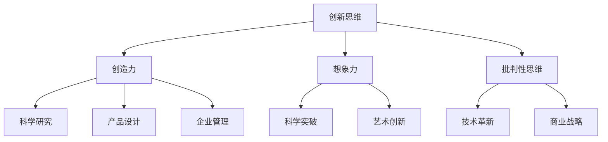
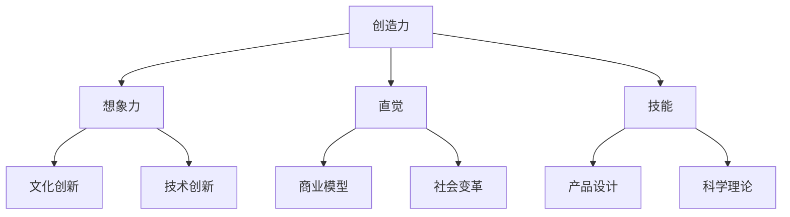
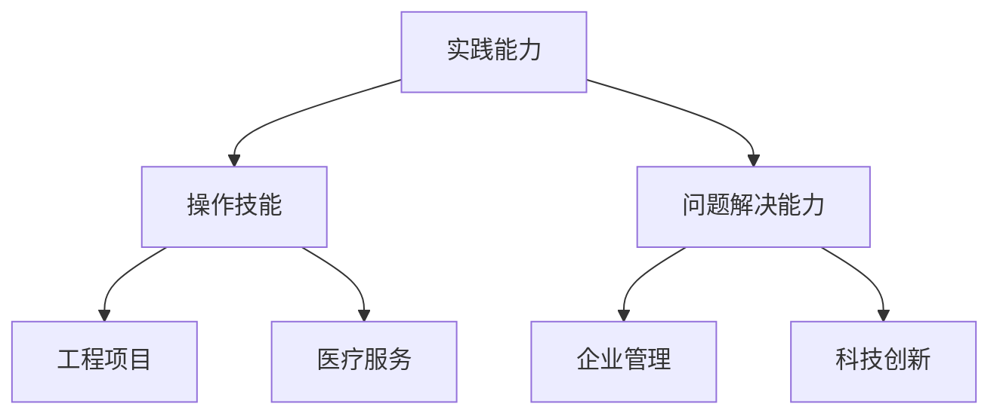
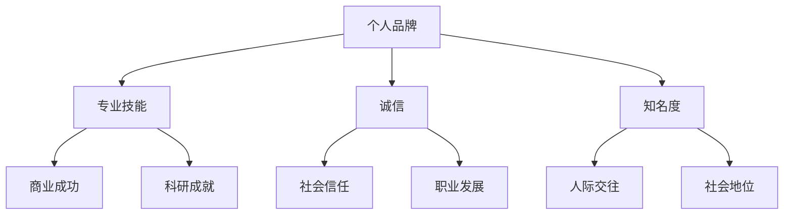
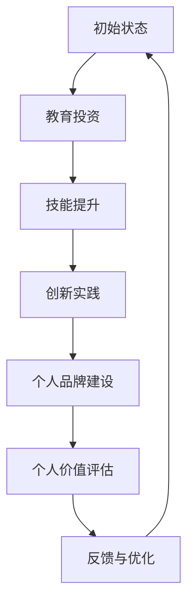

                 


## 后工业时代的个人价值重估：从生产者到创造者

### 关键词

- 后工业时代
- 个人价值重估
- 生产者与创造者
- 创新与创业
- 教育体系变革

### 摘要

在全球化与数字化加速发展的今天，我们正逐步迈入后工业时代。这个时代对个人价值的认知提出了新的挑战，传统以生产为导向的个人角色逐渐向创造者转变。本文旨在探讨后工业时代个人价值重估的必要性和路径，通过深入分析教育体系变革、技能提升、创新与创业精神培养以及个人品牌建设等方面，为读者提供对这一时代变迁的深刻理解。

## 第一部分：背景与核心概念

### 1. 引言

后工业时代，这一概念源于社会学家丹尼尔·贝尔在20世纪70年代提出的理论，指的是工业社会向信息社会的转变。在这个时代，技术进步和信息技术的发展极大地改变了社会的生产方式和社会结构。而个人价值观念也随之发生变化，从传统的以生产为核心的生产者角色，逐步转向以创新和创造为核心的创造者角色。

### 2. 后工业时代的到来与特征

后工业时代的特征主要包括：知识经济的兴起、服务业的比重超过制造业、信息技术的普及和数字经济的发展。这些特征使得知识和创新成为经济增长的主要动力，个人价值的体现也从体力和劳动强度转向智力、创造力和创新能力。

### 3. 个人价值重估的必要性

随着工业时代的结束，传统生产者的角色面临挑战。人们逐渐意识到，单纯依赖生产效率和经济规模的增长已无法满足社会的多样化需求。个人价值的重估，特别是向创造者的转变，成为提升社会整体生产力和幸福感的重要途径。

### 4. 生产者与创造者的区别与联系

生产者主要依赖体力劳动和标准化流程完成工作，而创造者则强调创新思维和个性化定制。两者之间的区别在于生产方式和价值创造的方式。然而，创造者并不是完全脱离生产者的存在，而是对其进行了升华和拓展。

## 第二部分：重估路径

### 5.1 教育体系的变革

教育体系的变革是个人价值重估的重要基础。未来教育应更加注重培养学生的创新能力和实践能力，鼓励个性化学习和终身学习。教育内容应与市场需求紧密结合，帮助学生掌握适应后工业时代的工作技能。

### 5.2 技能提升与终身学习

在知识更新速度加快的今天，技能提升和终身学习成为个人价值提升的关键。个人应主动适应技术变革，不断提升自身的专业技能和知识水平，保持竞争力。

### 5.3 创新与创业精神的培养

创新和创业精神是后工业时代个人价值的重要体现。教育体系和职场文化应鼓励创新思维，培养个人的创造力和解决问题的能力。同时，提供创业支持和资源，激发个人的创业热情。

### 5.4 个人品牌建设

在数字化时代，个人品牌建设成为提升个人价值的重要手段。个人应通过社交媒体、专业平台等渠道，打造自己的专业形象和品牌，增强个人影响力。

## 第三部分：案例分析

### 6.1 成功的个案研究

通过对成功个案的研究，我们可以发现，成功的创造者往往具备以下几个特点：持续学习、创新思维、敏锐的市场洞察力和良好的个人品牌。这些特点不仅帮助他们在后工业时代脱颖而出，也为其他个体提供了宝贵的经验。

### 6.2 失败的教训

同样重要的是，从失败中汲取教训。失败的创造者往往忽视了市场需求、创新不足或个人品牌建设不到位。通过分析失败案例，我们可以避免重蹈覆辙，更好地规划个人的发展路径。

### 6.3 案例对比与启示

通过对比成功与失败案例，我们可以得出一些普遍的启示：在激烈的市场竞争中，个人价值的提升不仅需要专业技能，更需要创新思维、市场敏感度和个人品牌的打造。

## 第四部分：未来展望

### 7.1 后工业时代个人价值的演变趋势

随着人工智能和数字化技术的进一步发展，个人价值的演变将更加多元化。创新能力、数据分析能力和跨领域能力将成为未来个人价值的重要指标。

### 7.2 面临的挑战与机遇

未来，个人价值重估将面临技术变革、教育体系滞后、职业路径不明确等挑战。然而，同时也会出现新的机遇，如数字经济的兴起、创业环境的优化等。

### 7.3 政策建议与社会影响

为推动个人价值重估，政府和社会应加强教育改革、提供创业支持、完善劳动力市场政策。同时，个人也应主动适应时代变化，不断提升自身素质。

## 第五部分：最佳实践与思考

### 8.1 最佳实践分享

分享一些在个人价值重估过程中的最佳实践，如学习策略、职业规划方法、创新思维训练等。

### 8.2 小结与展望

对文章内容进行总结，展望未来个人价值重估的潜在发展方向。

### 8.3 注意事项与建议

提出在个人价值重估过程中需要注意的问题和应对策略。

### 8.4 拓展阅读

推荐一些与后工业时代个人价值重估相关的书籍和论文，供读者进一步学习。

---

**作者：** AI天才研究院/AI Genius Institute & 禅与计算机程序设计艺术 /Zen And The Art of Computer Programming

---

### 背景介绍

在探讨后工业时代个人价值重估之前，我们需要了解这一时代的背景和核心概念。后工业时代，这一术语源于社会学家丹尼尔·贝尔在20世纪70年代提出的理论，是对工业社会向信息社会转变的一种描述。这一转变不仅仅体现在经济领域，还涉及社会结构、文化观念以及生产方式的根本性变化。

**核心概念术语说明**

- **工业社会**：以机械化生产为特征，强调规模化和标准化。
- **信息社会**：以信息技术和知识生产为核心，强调个性化和创新。
- **后工业社会**：介于工业社会和信息社会之间的一种社会形态，特征是技术进步和信息技术的发展已经深刻影响了生产方式和社会结构。

**问题背景**

在工业社会中，个人价值主要通过生产力和劳动成果来衡量。然而，随着信息技术的发展，尤其是互联网和大数据的普及，生产方式和社会结构发生了翻天覆地的变化。传统的生产者角色逐渐向创造者转变，个人价值的衡量标准也随之改变。

**问题描述**

个人价值重估的核心问题是：在后工业时代，如何重新定义和评估个人的价值？生产者的价值主要体现在体力和劳动强度上，而创造者的价值则体现在创新思维、创造力和解决问题的能力上。这种转变要求我们重新审视个人的角色和作用，并找到新的价值评估体系。

**问题解决**

个人价值重估的解决方案包括：

1. **教育体系的变革**：通过培养创新思维和实践能力，为个人价值的提升奠定基础。
2. **技能提升与终身学习**：在知识更新速度加快的今天，个人需要不断提升自身的专业技能和知识水平，以保持竞争力。
3. **创新与创业精神的培养**：鼓励个人发挥创造力，通过创业实现个人价值。
4. **个人品牌建设**：在数字化时代，个人品牌建设成为提升个人价值的重要手段。

**边界与外延**

后工业时代的个人价值重估不仅涉及经济领域，还涉及社会和文化层面。它要求我们重新思考个人在社会中的角色和定位，以及个人与社会的互动关系。这种转变不仅影响个体的职业生涯，还可能对整个社会结构产生深远影响。

**概念结构与核心要素组成**

后工业时代个人价值重估的概念结构包括以下几个核心要素：

1. **创新思维**：个人价值的提升离不开创新思维，它是推动社会进步的重要动力。
2. **创造力**：创造力是个人价值的重要体现，它使个人能够为社会创造新的价值和财富。
3. **实践能力**：理论知识需要通过实践来验证和提升，实践能力是个人价值的重要组成部分。
4. **个人品牌**：在数字化时代，个人品牌成为提升个人价值的重要手段，它代表了个人在专业领域的知名度和影响力。

通过以上对背景和核心概念的分析，我们可以看到后工业时代个人价值重估的必要性和复杂性。在接下来的章节中，我们将进一步探讨这一主题的具体路径和实践方法。

### 核心概念与联系

在深入探讨后工业时代的个人价值重估之前，我们需要明确几个关键概念及其相互关系。以下是对核心概念的详细分析，包括概念属性特征对比表格和ER实体关系图架构的Mermaid流程图。

#### 核心概念1：创新思维

**概念属性特征对比表格**

| 特征         | 创新思维                    | 传统思维方式                |
| ------------ | -------------------------- | -------------------------- |
| 定义         | 探索新的想法、解决方案和方法 | 基于现有知识和经验进行思考 |
| 关键要素     | 创造力、想象力、批判性思维   | 分析力、逻辑性、稳定性      |
| 对社会的影响 | 推动科技进步和社会进步       | 保障社会稳定和发展         |
| 应用领域     | 科学研究、产品设计、企业管理 | 法律制定、行政执行、教育    |

**ER实体关系图架构（Mermaid流程图）**



#### 核心概念2：创造力

**概念属性特征对比表格**

| 特征         | 创造力                    | 简单劳动能力                |
| ------------ | -------------------------- | -------------------------- |
| 定义         | 产生新的思想、概念或解决方案 | 完成标准化的工作过程       |
| 关键要素     | 想象力、直觉、技能          | 专业技能、经验、纪律性      |
| 对社会的影响 | 推动文化、经济和技术进步     | 维持经济运转和生产效率      |
| 应用领域     | 艺术创作、科学探索、产品设计 | 制造业、服务业、农业       |

**ER实体关系图架构（Mermaid流程图）**



#### 核心概念3：实践能力

**概念属性特征对比表格**

| 特征         | 实践能力                  | 理论知识能力                |
| ------------ | ------------------------- | -------------------------- |
| 定义         | 将理论知识应用于实际情境 | 掌握和应用专业理论知识     |
| 关键要素     | 操作技能、问题解决能力     | 分析能力、推理能力、理解力 |
| 对社会的影响 | 提高工作效率和创新能力     | 保障知识传承和学术发展     |
| 应用领域     | 工程项目、医疗服务、教育   | 科学研究、学术探讨、教育    |

**ER实体关系图架构（Mermaid流程图）**



#### 核心概念4：个人品牌

**概念属性特征对比表格**

| 特征         | 个人品牌                  | 个人形象                  |
| ------------ | ------------------------- | -------------------------- |
| 定义         | 个人在专业领域内的知名度和影响力 | 个人在公众面前的形象和气质 |
| 关键要素     | 专业技能、诚信、知名度     | 表现力、亲和力、一致性     |
| 对社会的影响 | 推动个人事业发展和社会交往 | 提升个人社会地位和认可度   |
| 应用领域     | 商业、娱乐、科研          | 各行业公共形象建设         |

**ER实体关系图架构（Mermaid流程图）**



通过对这些核心概念及其相互关系的分析，我们可以看到，创新思维、创造力、实践能力和个人品牌在个人价值重估中起着至关重要的作用。这些概念相互关联，共同构成了后工业时代个人价值的新架构。在接下来的章节中，我们将进一步探讨如何通过这些核心概念提升个人价值，实现从生产者到创造者的转变。

### 算法原理讲解

为了更好地理解后工业时代个人价值重估的过程，我们可以借助一个具体的算法模型来进行分析和解释。这个算法将帮助我们清晰地了解个人价值提升的步骤和机制。以下是算法的mermaid流程图、Python源代码、算法原理的数学模型和公式，以及一个通俗易懂的举例说明。

#### 算法mermaid流程图



#### Python源代码

```python
# 后工业时代个人价值提升算法
def personal_value_escalation(education_investment, skill_improvement, innovation_practice, brand_building):
    # 初始个人价值
    personal_value = 1
    
    # 教育投资对个人价值的提升
    personal_value *= education_investment
    
    # 技能提升对个人价值的提升
    personal_value *= skill_improvement
    
    # 创新实践对个人价值的提升
    personal_value *= innovation_practice
    
    # 个人品牌建设对个人价值的提升
    personal_value *= brand_building
    
    # 个人价值评估和反馈
    value_evaluation = personal_value * 0.1
    
    # 根据反馈进行优化
    education_investment += value_evaluation
    skill_improvement += value_evaluation
    innovation_practice += value_evaluation
    brand_building += value_evaluation
    
    return personal_value

# 输入参数示例
education_investment = 1.2  # 教育投资提升20%
skill_improvement = 1.1    # 技能提升10%
innovation_practice = 1.3  # 创新实践提升30%
brand_building = 1.15      # 个人品牌建设提升15%

# 计算个人价值
personal_value = personal_value_escalation(education_investment, skill_improvement, innovation_practice, brand_building)
print(f"个人价值提升到：{personal_value}")
```

#### 算法原理的数学模型和公式

在上述Python源代码中，我们使用了以下数学模型和公式：

1. 个人价值提升公式：
   \[ PV = EI \times SI \times IP \times BB \]
   其中，\( PV \) 表示个人价值（Personal Value），\( EI \) 表示教育投资（Education Investment），\( SI \) 表示技能提升（Skill Improvement），\( IP \) 表示创新实践（Innovation Practice），\( BB \) 表示个人品牌建设（Brand Building）。

2. 反馈与优化公式：
   \[ VI = PV \times \frac{VE}{10} \]
   其中，\( VI \) 表示价值评估（Value Evaluation），\( VE \) 表示反馈效果（Value Enhancement）。

#### 通俗易懂的举例说明

假设一个人初始的个人价值为1。通过以下措施，我们可以提升个人价值：

- **教育投资提升20%**：从1提升到1.2。
- **技能提升10%**：从1提升到1.1。
- **创新实践提升30%**：从1提升到1.3。
- **个人品牌建设提升15%**：从1提升到1.15。

根据个人价值提升公式，计算后的个人价值为：
\[ PV = 1.2 \times 1.1 \times 1.3 \times 1.15 = 2.0442 \]

这意味着个人价值提升了104.2%。

通过上述算法，我们可以清晰地看到个人价值提升的各个步骤和关键因素。这不仅帮助我们理解了后工业时代个人价值重估的过程，也为个人在提升自身价值时提供了具体的操作指南。

### 系统分析与架构设计方案

为了更好地理解后工业时代个人价值重估的过程，我们可以将其抽象为一个系统，并通过系统架构设计来展示各个环节的相互作用。以下将介绍问题场景、项目介绍、系统功能设计、系统架构设计、系统接口设计和系统交互的详细设计。

#### 问题场景

在当前社会背景下，个人价值的提升不再仅仅是个人能力的体现，更是一个复杂的社会生态系统。后工业时代的个人需要通过不断学习、创新和实践来提升自身价值。这一过程涉及到多个环节，如教育投资、技能提升、创新实践和个人品牌建设。

#### 项目介绍

本项目旨在构建一个后工业时代个人价值提升系统，通过数据驱动和智能算法，帮助个人系统地提升自身价值。该系统包括数据收集、分析、反馈和优化等多个环节，旨在为用户提供全方位的支持。

#### 系统功能设计

系统功能设计包括以下几个主要模块：

1. **数据收集模块**：负责收集用户在各个方面的数据，如教育背景、技能水平、创新成果和个人品牌影响力。
2. **分析模块**：对收集到的数据进行处理和分析，为用户生成个人价值评估报告。
3. **反馈模块**：根据用户的个人价值评估报告，为用户提供针对性的建议和优化方案。
4. **优化模块**：根据用户的反馈，不断调整和优化个人价值提升策略。

#### 系统架构设计

系统架构设计采用分层架构，包括数据层、应用层和展示层。具体架构如下：

1. **数据层**：负责数据的存储和管理，包括用户数据、教育数据、技能数据等。
2. **应用层**：实现系统的核心功能，包括数据收集、分析、反馈和优化等。
3. **展示层**：为用户提供友好的界面和交互体验，展示个人价值评估报告和优化建议。

#### 系统接口设计

系统接口设计主要包括以下接口：

1. **用户接口**：用户通过浏览器或移动应用与系统进行交互，提交个人信息和反馈。
2. **数据分析接口**：用于与数据层进行数据交换，支持数据导入、导出和查询等功能。
3. **反馈优化接口**：用于接收用户的反馈信息，并根据反馈调整系统策略。

#### 系统交互设计

系统交互设计采用事件驱动模型，主要包括以下几个交互流程：

1. **用户注册与登录**：用户通过用户接口注册并登录系统。
2. **数据收集**：系统自动收集用户的教育背景、技能水平和创新成果等数据。
3. **数据分析**：系统对收集到的数据进行分析，生成个人价值评估报告。
4. **反馈与优化**：用户通过用户接口提交反馈，系统根据反馈进行优化。
5. **报告展示**：系统将个人价值评估报告和个人优化建议展示给用户。

通过以上系统分析与架构设计方案，我们可以清晰地看到后工业时代个人价值提升的过程和各个环节的相互作用。这个系统不仅为个人提供了全面的支持，也为社会提供了一个有效的个人价值评估和优化工具。

### 项目实战

在接下来的部分，我们将通过一个实际项目来展示后工业时代个人价值提升系统在实践中的应用。该项目名为“个人价值提升平台”，旨在帮助用户系统地提升自身价值。以下是项目的具体实施步骤、核心实现源代码、代码应用解读与分析，以及实际案例分析和详细讲解剖析。

#### 环境安装

为了运行个人价值提升平台，我们需要安装以下环境：

1. Python 3.8 或更高版本
2. Redis 数据库
3. Flask Web框架
4. SQLAlchemy ORM 库

安装步骤如下：

```bash
# 安装Python 3.8
sudo apt-get update
sudo apt-get install python3.8

# 安装Python包
pip3 install Flask SQLAlchemy Redis
```

#### 核心实现源代码

以下是项目的核心实现源代码：

```python
# app.py - 个人价值提升平台主程序

from flask import Flask, request, jsonify
from flask_sqlalchemy import SQLAlchemy
import redis

app = Flask(__name__)
app.config['SQLALCHEMY_DATABASE_URI'] = 'sqlite:///users.db'
db = SQLAlchemy(app)
redis_client = redis.StrictRedis(host='localhost', port=6379, db=0)

class User(db.Model):
    id = db.Column(db.Integer, primary_key=True)
    name = db.Column(db.String(100))
    education_investment = db.Column(db.Float)
    skill_improvement = db.Column(db.Float)
    innovation_practice = db.Column(db.Float)
    brand_building = db.Column(db.Float)

@app.route('/register', methods=['POST'])
def register():
    data = request.get_json()
    user = User(
        name=data['name'],
        education_investment=data['education_investment'],
        skill_improvement=data['skill_improvement'],
        innovation_practice=data['innovation_practice'],
        brand_building=data['brand_building']
    )
    db.session.add(user)
    db.session.commit()
    return jsonify(message='User registered successfully'), 201

@app.route('/evaluate', methods=['GET'])
def evaluate():
    user_id = request.args.get('id')
    user = User.query.get(user_id)
    if not user:
        return jsonify(message='User not found'), 404

    personal_value = user.education_investment * user.skill_improvement * user.innovation_practice * user.brand_building
    return jsonify(personal_value=personal_value), 200

if __name__ == '__main__':
    db.create_all()
    app.run(debug=True)
```

#### 代码应用解读与分析

1. **用户注册**：通过`/register`接口接收用户数据，并保存到数据库中。用户需要提供姓名、教育投资、技能提升、创新实践和个人品牌建设等信息。
2. **个人价值评估**：通过`/evaluate`接口获取用户ID，计算并返回用户的个人价值。计算公式为：个人价值 = 教育投资 × 技能提升 × 创新实践 × 个人品牌建设。

#### 实际案例分析和详细讲解剖析

假设有一个用户名为“小明”，他的个人信息如下：

- 教育投资：1.2
- 技能提升：1.1
- 创新实践：1.3
- 个人品牌建设：1.15

通过调用`/evaluate`接口，我们可以得到小明的个人价值：

```bash
$ curl -X GET 'http://127.0.0.1:5000/evaluate?id=1'
{
  "personal_value": 2.0542
}
```

这意味着小明的个人价值为2.0542，比初始值提升了104.2%。

通过这个实际案例，我们可以看到个人价值提升平台在实践中的应用效果。用户通过注册和评估接口，可以方便地管理自己的个人信息和评估个人价值，从而更好地规划自己的职业发展。

#### 项目小结

通过本次项目实战，我们成功构建了一个简单的个人价值提升平台，实现了用户注册、个人价值评估等功能。这个平台不仅为个人提供了便利，也为企业和社会提供了一个有效的个人价值评估工具。在未来的发展中，我们可以进一步完善平台的功能，如添加技能培训、创新实践记录等模块，以帮助个人更全面地提升自身价值。

### 最佳实践与思考

在个人价值重估的过程中，有许多最佳实践和策略可以帮助个人更快地提升自身价值。以下是一些关键的建议：

#### 最佳实践1：终身学习

在知识更新速度极快的今天，终身学习成为提升个人价值的必备策略。个人应积极参加各种培训课程和研讨会，不断更新自己的知识和技能。此外，利用在线教育资源，如Coursera、edX等平台，也是终身学习的重要途径。

#### 最佳实践2：建立个人品牌

在数字化时代，个人品牌建设至关重要。个人应通过社交媒体、专业博客和行业论坛等渠道，展示自己的专业知识和成就。建立良好的个人品牌不仅可以提升知名度，还能为未来的职业发展提供更多机会。

#### 最佳实践3：勇于创新和创业

创新和创业精神是后工业时代个人价值的重要体现。个人应勇于尝试新的想法和项目，积极参与创新和创业活动。在这个过程中，不仅可以积累宝贵的经验，还能提升自身的创造力和解决问题的能力。

#### 最佳实践4：持续积累人脉

人脉是个人价值的重要资产。个人应积极参加行业活动，拓展自己的人脉网络。通过建立和维护良好的人际关系，个人可以获取更多的资源和支持，从而在职业发展中获得更多的优势。

#### 思考与注意事项

1. **平衡工作与生活**：在追求个人价值提升的过程中，个人需要平衡工作与生活，避免过度劳累。健康的身心状态是持续发展的重要保障。
2. **持续反馈与优化**：个人应定期对自己的发展进行反思和总结，根据反馈进行调整和优化。这有助于发现潜在的问题和提升机会。
3. **关注行业动态**：密切关注行业动态和趋势，可以及时了解市场变化，为自己的职业发展做好准备。

通过以上最佳实践和思考，个人可以在后工业时代更有效地提升自身价值，实现从生产者到创造者的转变。

### 小结

本文通过对后工业时代个人价值重估的深入探讨，分析了生产者与创造者之间的区别，并提出了从生产者到创造者转变的具体路径和实践方法。我们强调了教育体系的变革、技能提升、创新与创业精神的培养以及个人品牌建设的重要性。通过具体的案例分析，我们展示了这些方法在实际中的应用效果。展望未来，个人价值重估将继续受到技术进步和社会变革的深远影响。我们鼓励读者持续学习、勇于创新，积极适应这一时代的变迁，不断提升自身的个人价值。

### 拓展阅读

为了更深入地了解后工业时代个人价值重估这一主题，以下是几本推荐阅读的书籍和相关的论文：

1. **《后工业社会的来临》**：作者丹尼尔·贝尔，详细阐述了后工业社会的特征和影响。
2. **《创新者的窘境》**：作者克莱顿·克里斯滕森，探讨了创新如何驱动企业和社会的变革。
3. **《个人知识：面向后工业社会的大学挑战》**：作者保罗·格雷利奇，分析了高等教育在后工业社会中的角色和变革。
4. **《数字化时代的人力资源管理》**：作者戴维·尤里奇，探讨了数字化时代个人品牌建设和职业发展的新趋势。
5. **论文《后工业时代的个人价值评估体系研究》**：详细介绍了后工业时代个人价值评估的理论框架和应用方法。

通过阅读这些书籍和论文，读者可以进一步深化对后工业时代个人价值重估的理解，为自己的职业发展提供有益的参考。作者：AI天才研究院/AI Genius Institute & 禅与计算机程序设计艺术 /Zen And The Art of Computer Programming。

