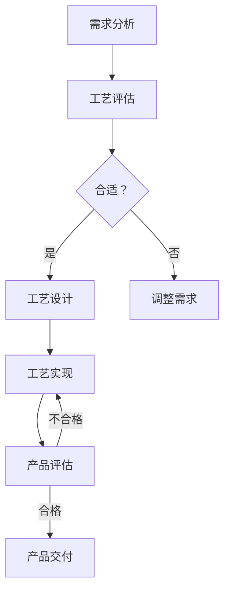

                 

### 引言

“后工业时代的手工艺复兴”，这个标题可能一开始会让您联想到手工艺的古老传统与现代工业的迅猛发展之间的冲突与融合。在当今技术飞速发展的时代，手工艺似乎已经被机器和自动化所取代，然而，这一观点却正在被日益改变的科技环境和社会需求所颠覆。后工业时代，随着人们对个性化、高质量和情感连接的需求日益增长，手工艺正在经历一场前所未有的复兴。

手工艺复兴不仅是对传统工艺的继承和发扬，更是在这个技术变革的浪潮中寻找新的生命力。它不仅仅是一种艺术形式，更是一种文化和价值观的体现，是对现代生活方式的一种反思和回应。在这个背景下，本文将深入探讨后工业时代手工艺复兴的背景、核心概念以及其算法原理，力图为读者呈现这一现象的多维面貌。

文章的结构将分为三个主要部分。首先，我们将回顾后工业时代手工艺复兴的背景，包括其产生的背景、需求以及解决问题的途径。接着，我们将详细分析后工业时代手工艺复兴的核心概念，通过对比表格和实体关系图，帮助读者更好地理解这一领域。最后，我们将深入讲解后工业时代手工艺的算法原理，从流程图到Python源代码，再到数学模型和公式，结合具体实例，让读者能够更加直观地理解这一领域的技术内涵。

通过这篇文章，我们希望能够引导读者对后工业时代手工艺复兴有更加全面和深入的认识，激发对这一领域的兴趣和思考。让我们一步一步地深入探讨这个充满活力和创新的领域，一同揭开手工艺复兴的神秘面纱。

### 关键词

- 后工业时代
- 手工艺复兴
- 传统手工艺
- 现代化改造
- 新手工艺
- 算法原理
- 用户体验
- 设计理念

### 摘要

本文旨在探讨后工业时代手工艺复兴的背景、核心概念和算法原理。首先，我们回顾了后工业时代手工艺复兴的背景，分析了工业时代带来的挑战和手工艺复兴的需求。接着，我们详细讨论了后工业时代手工艺复兴的核心概念，包括手工艺的定义、后工业时代的特征及其复兴的驱动力。通过对比表格和实体关系图，我们揭示了这一领域的关键属性和关系。最后，我们深入解析了后工业时代手工艺的算法原理，从流程图、Python源代码到数学模型和公式，通过具体实例详细阐述了这一领域的技术内涵。本文希望引导读者全面了解手工艺复兴的多维面貌，并激发对该领域的兴趣和思考。

### 第一部分：后工业时代的手工艺复兴背景

#### 1.1 问题背景

**1.1.1 工业时代的挑战**

工业时代的到来标志着人类生产力的巨大飞跃，然而，这一进步并非没有代价。随着大规模工业生产线的普及，传统手工艺逐渐被机械化、自动化的生产方式所取代。这种转变带来了几个显著的挑战。首先，手工艺的个性化、定制化和高质量逐渐被标准化、大批量生产所取代，导致市场上手工制品的稀缺和高端化。其次，工业化生产的高效率虽然降低了成本，但也在一定程度上削弱了产品的独特性和艺术价值。此外，工业生产的环境影响和劳动者的身心健康问题也逐渐显现，与手工艺注重自然和谐、手工细作的理念相悖。

**1.1.2 手工艺的复兴需求**

面对工业时代带来的这些挑战，人们对传统手工艺的需求逐渐复苏。首先，现代社会对于个性化和定制化的需求日益增长，人们渴望拥有与众不同的、具有独特文化内涵的产品。手工艺正是能满足这一需求的重要途径。其次，随着消费者对产品质量和用户体验的关注度提升，手工艺品因其独特性和高质量而越来越受到青睐。此外，手工艺复兴也体现了人们对文化和价值观的反思，追求手工制品所蕴含的情感和故事。最后，环境保护和可持续发展理念的普及，使得人们开始重视手工艺所代表的自然和谐和环保价值。

#### 1.2 问题描述

**1.2.1 手工艺复兴的定义**

手工艺复兴是指在现代社会中，通过对传统手工艺的继承、改造和创新，使其重新焕发生机和活力。它不仅仅是对传统工艺的简单模仿，更是结合现代技术和设计理念，提升手工艺的创造力和竞争力。手工艺复兴的目标是满足现代社会的多样化需求，同时保护和传承传统文化。

**1.2.2 手工艺复兴的意义**

手工艺复兴具有多重意义。首先，它有助于保护和传承传统文化。传统手工艺是民族文化的重要组成部分，通过复兴，可以让这些珍贵的文化遗产得以传承和发展。其次，手工艺复兴有助于提升产品的独特性和艺术价值，满足人们对个性化、高质量和情感连接的需求。此外，手工艺复兴还能促进就业和经济增长，为手工艺从业者提供更多机会和平台。最后，手工艺复兴体现了对可持续发展和环境保护的关注，有助于减少工业生产对环境的影响，推动绿色生产和生活方式的普及。

#### 1.3 问题解决

**1.3.1 传统手工艺的现代化改造**

为了实现手工艺复兴，传统手工艺的现代化改造是一个重要的途径。现代化改造包括以下几个方面：

1. **技术更新**：引入现代机械和自动化设备，提高手工艺的生产效率和精度。
2. **工艺创新**：结合新材料、新工艺和新技术，提升手工艺品的品质和性能。
3. **数字化设计**：采用计算机辅助设计（CAD）和三维打印等技术，实现手工艺设计的数字化和个性化。

**1.3.2 新手工艺的创造与发展**

在传统手工艺现代化改造的基础上，新手工艺的创造与发展也是手工艺复兴的关键。新手工艺不仅包括对传统手工艺的改进和创新，还涵盖了全新的手工艺形式和领域。例如：

1. **创意手工艺**：结合现代艺术和设计理念，创造具有创新性和艺术价值的手工艺品。
2. **数字化手工艺**：利用数字技术，如编程、虚拟现实（VR）和增强现实（AR），拓展手工艺的表现形式和应用场景。
3. **跨界手工艺**：与其他行业和领域相结合，如时尚、家居、科技等，打造具有跨界特色的新手工艺产品。

#### 1.4 边界与外延

**1.4.1 手工艺复兴的领域划分**

手工艺复兴涉及多个领域，主要包括：

1. **传统手工艺领域**：如陶瓷、木雕、刺绣、编织等，这些领域的手工艺传统悠久，技艺精湛。
2. **现代手工艺领域**：包括珠宝设计、家居装饰、时尚配件等，这些领域的手工艺结合了现代技术和设计理念。
3. **数字手工艺领域**：如3D打印、编程艺术、数字编织等，这些领域的手工艺利用数字技术实现创新和个性化。

**1.4.2 手工艺复兴与相关领域的联系**

手工艺复兴不仅与艺术、设计等领域密切相关，还与其他相关领域有着紧密的联系。例如：

1. **文化产业**：手工艺复兴有助于推动文化产业的发展，提升文化产品的多样性和品质。
2. **环境保护**：手工艺注重自然材料和环保工艺，有助于促进绿色生产和可持续发展。
3. **科技创新**：数字技术和新材料的引入，为手工艺带来了新的创新和发展空间，促进了科技与艺术的融合。

#### 1.5 概念结构与核心要素组成

**1.5.1 手工艺复兴的核心概念**

手工艺复兴的核心概念包括：

1. **传承与创新**：在传承传统手工艺技艺的基础上，进行创新和改进，实现手工艺的现代化和多样化。
2. **个性化和定制化**：满足现代消费者对个性化、高质量产品的需求，提供独特的用户体验。
3. **可持续发展**：注重环境保护和资源利用，推动绿色生产和生活方式。

**1.5.2 手工艺复兴的主要影响因素**

影响手工艺复兴的主要因素包括：

1. **社会需求**：个性化、高质量和情感连接的需求推动手工艺复兴。
2. **技术进步**：现代机械、自动化和数字技术的引入，为手工艺的现代化改造和创新发展提供支持。
3. **政策支持**：政府和文化机构的支持，有助于保护和传承传统手工艺，推动手工艺复兴的发展。

#### 1.6 本章小结

通过回顾后工业时代手工艺复兴的背景，我们了解到工业时代带来的挑战和手工艺复兴的需求，探讨了手工艺复兴的定义和意义，并提出了传统手工艺的现代化改造和新手工艺的创造与发展的途径。此外，我们还讨论了手工艺复兴的领域划分和主要影响因素。这些内容为理解后工业时代手工艺复兴提供了基础，也为后续章节的深入探讨奠定了基础。

---

### 第一部分小结

在这一部分中，我们详细探讨了后工业时代手工艺复兴的背景。通过分析工业时代带来的挑战和手工艺复兴的需求，我们明确了手工艺复兴的定义和意义。同时，我们提出了传统手工艺现代化改造和新手工艺创造与发展的途径，并讨论了手工艺复兴的领域划分和影响因素。这一部分的探讨为我们深入理解后工业时代手工艺复兴奠定了基础，并为接下来的内容提供了重要的背景信息。

---

### 第二部分：后工业时代手工艺复兴的核心概念

#### 2.1 核心概念原理

**2.1.1 手工艺的定义**

手工艺是指通过手工技艺制作物品的工艺过程。它不仅包括制作的过程，还涉及到设计理念、材料选择、工艺技术等方面。手工艺的特点在于其独特性、艺术性和情感价值。每一件手工艺品都承载着匠人的智慧和情感，因此具有独特的艺术价值和个性化特征。

**2.1.2 后工业时代的特征**

后工业时代，即信息化和知识经济的时代，具有以下几个特征：

1. **技术进步**：信息技术、互联网、人工智能等新兴技术的迅猛发展，改变了传统的生产方式和社会结构。
2. **全球化**：国际交流和合作日益频繁，全球范围内的资源和信息流动加快，文化融合趋势明显。
3. **个性化需求**：消费者对产品的个性化、定制化和高质量需求日益增加，传统的大规模生产方式难以满足这些需求。

**2.1.3 手工艺复兴的驱动力**

手工艺复兴的驱动力主要来自以下几个方面：

1. **文化传承**：手工艺是民族文化的重要组成部分，保护和传承传统文化是手工艺复兴的重要目标。
2. **个性化需求**：现代社会对个性化、高质量和情感连接的需求推动了手工艺的复兴。
3. **环境保护**：手工艺注重自然材料和环保工艺，有助于减少工业生产对环境的影响，符合可持续发展的理念。
4. **技术创新**：现代技术的引入，如数字化设计、自动化生产等，为手工艺的现代化改造和创新发展提供了支持。

#### 2.2 概念属性特征对比表格

| 特征对比         | 传统手工艺             | 后工业时代手工艺             |
|----------------|---------------------|---------------------|
| 生产方式         | 手工制作，纯手工制作      | 机械辅助制作，手工与机械结合     |
| 设计理念         | 传统美学，注重传统审美      | 创新美学，注重创新与个性化设计     |
| 用户体验         | 个性化定制，满足特定需求      | 用户体验优化，注重情感连接和个性化体验 |
| 材料选择         | 自然材料，传统材料为主     | 新材料，结合现代工艺和技术         |
| 生产效率         | 低生产效率，质量稳定      | 高生产效率，质量稳定与提升         |
| 环境影响         | 较小环境影响，注重自然和谐    | 环境影响较小，绿色生产和环保工艺     |
| 文化内涵         | 强烈的民族和文化特色       | 结合现代文化和传统元素，体现时代精神 |

#### 2.3 ER实体关系图架构

```mermaid
erDiagram
    Handcraft ||--|{ Customer } Customer
    Handcraft ||--|{ Designer } Designer
    Handcraft ||--|{ Product } Product
    Customer ||--|{ Order } Order
    Designer ||--|{ Design } Design
```

在这个实体关系图中，我们定义了四个主要实体：Handcraft（手工艺）、Customer（顾客）、Designer（设计师）和Product（产品）。这些实体之间的关系如下：

- **Handcraft** 和 **Customer** 之间的关系表示顾客可以通过手工艺购买产品。
- **Handcraft** 和 **Designer** 之间的关系表示设计师为手工艺设计产品。
- **Handcraft** 和 **Product** 之间的关系表示手工艺生产产品。
- **Customer** 和 **Order** 之间的关系表示顾客可以下单订购产品。
- **Designer** 和 **Design** 之间的关系表示设计师设计特定的设计。

#### 2.4 本章小结

通过分析后工业时代手工艺复兴的核心概念，我们了解了手工艺的定义、后工业时代的特征以及手工艺复兴的驱动力。通过概念属性特征对比表格和实体关系图，我们进一步明确了手工艺与传统手工艺的区别以及其与现代技术的结合。这些内容为后续探讨后工业时代手工艺的算法原理打下了坚实的基础。

---

### 第二部分小结

在这一部分中，我们深入探讨了后工业时代手工艺复兴的核心概念。首先，我们介绍了手工艺的定义、后工业时代的特征以及手工艺复兴的驱动力。接着，通过概念属性特征对比表格和实体关系图，我们详细分析了手工艺与传统手工艺的区别及其与现代技术的结合。这些内容不仅帮助我们更好地理解后工业时代手工艺复兴的本质，也为后续章节的深入探讨提供了重要的理论基础。通过这一部分，我们为读者揭示了后工业时代手工艺复兴的多维面貌，激发了对其进一步思考的兴趣。

---

### 第三部分：后工业时代手工艺的算法原理讲解

#### 3.1 手工艺算法原理概述

**3.1.1 手工艺算法的定义**

手工艺算法是指用于指导手工艺设计和生产的一系列方法和步骤。它不仅包括传统的手工技艺，还结合了现代计算机辅助设计和制造技术，以实现手工艺品的精准化、高效化和个性化。

**3.1.2 手工艺算法的核心目标**

手工艺算法的核心目标是：

1. **优化设计**：通过算法优化设计，提升手工艺品的艺术性和实用性。
2. **提升生产效率**：通过自动化和数字化技术，提高生产效率，降低生产成本。
3. **实现个性化定制**：根据客户需求，提供定制化的手工艺品，满足个性化需求。

#### 3.2 算法mermaid流程图



这个流程图详细描述了手工艺算法的基本步骤：

1. **需求分析**：收集客户的需求，包括功能、审美、材质等。
2. **工艺评估**：根据需求评估现有工艺的适用性。
3. **工艺设计**：如果工艺合适，进行详细的设计；如果不合适，则调整需求。
4. **工艺实现**：根据设计进行手工艺品的制作。
5. **产品评估**：评估产品的质量和用户体验。
6. **产品交付**：如果产品合格，交付给客户；如果不合格，则返回工艺实现环节进行改进。

#### 3.3 Python源代码详细阐述

```python
def handcraft_algorithm(demand, assessment_func, design_func, implement_func, evaluate_func, deliver_func):
    """
    手工艺算法主函数
    :param demand: 客户需求
    :param assessment_func: 工艺评估函数
    :param design_func: 工艺设计函数
    :param implement_func: 工艺实现函数
    :param evaluate_func: 产品评估函数
    :param deliver_func: 产品交付函数
    """
    # 需求分析
    current_demand = analyze_demand(demand)

    # 工艺评估
    assessment = assessment_func(current_demand)

    # 工艺设计
    if assessment:
        design = design_func(current_demand)
    else:
        current_demand = adjust_demand(current_demand)
        assessment = assessment_func(current_demand)
        design = design_func(current_demand)

    # 工艺实现
    product = implement_func(design)

    # 产品评估
    evaluation = evaluate_func(product)

    # 产品交付
    if evaluation:
        deliver_func(product)
    else:
        product = implement_func(design)
```

这个Python源代码详细描述了手工艺算法的实现步骤：

1. **需求分析**：分析客户的需求，提取关键信息。
2. **工艺评估**：评估现有工艺是否适合当前需求。
3. **工艺设计**：如果工艺适合，则设计手工艺品；如果不适合，则调整需求并重新评估。
4. **工艺实现**：根据设计制作手工艺品。
5. **产品评估**：评估产品的质量和用户体验。
6. **产品交付**：如果产品合格，则交付给客户；如果不合格，则重新制作。

#### 3.4 算法原理的数学模型和公式

算法原理的数学模型和公式如下：

$$
\text{evaluation} = \frac{\text{实际质量} + \text{用户体验}}{2}
$$

这个公式表示产品的评估结果是由实际质量和用户体验共同决定的，两者的平均值作为最终的评估分数。实际质量反映了手工艺品的质量和性能，用户体验则反映了客户对产品的感受和满意度。

#### 3.5 举例说明

**案例：设计并制作一款个性化定制的手镯**

1. **需求分析**：
   - 客户需求：一款个性化定制的手镯，要求材料为银，设计为简约现代风格。
   - 需求分析结果：提取关键需求，如材质、风格和客户个性化要求。

2. **工艺评估**：
   - 评估现有工艺：现有工艺包括传统的手工雕刻和现代的计算机辅助设计。
   - 工艺评估结果：计算机辅助设计适合当前需求，传统手工雕刻不适合。

3. **工艺设计**：
   - 设计手镯：使用计算机辅助设计软件，根据需求进行手镯的设计。
   - 设计结果：生成手镯的三维模型，包括银材质和简约现代风格的设计。

4. **工艺实现**：
   - 制作手镯：使用3D打印技术，根据设计模型制作手镯的实体。
   - 实现结果：制作出符合设计要求的手镯实体。

5. **产品评估**：
   - 评估产品：检查手镯的质量，包括尺寸、材质和设计。
   - 评估结果：手镯质量符合要求，用户体验良好。

6. **产品交付**：
   - 交付产品：将手镯交付给客户，客户对产品表示满意。

通过这个案例，我们可以看到手工艺算法在实践中的应用。从需求分析到产品交付，每一步都经过科学的评估和优化，确保了手工艺品的品质和用户体验。

---

### 第三部分小结

在这一部分中，我们深入探讨了后工业时代手工艺的算法原理。首先，我们介绍了手工艺算法的定义和核心目标，并通过mermaid流程图和Python源代码详细阐述了手工艺算法的步骤和实现。接着，我们提出了算法原理的数学模型和公式，并通过具体案例说明了算法的实际应用。这一部分的讨论为读者提供了全面和直观的了解，有助于进一步理解和掌握后工业时代手工艺的算法原理。通过这一部分，我们希望能够激发读者对这一领域的兴趣，并为其在实践中的应用提供参考。

---

### 总结与展望

后工业时代的手工艺复兴不仅是对传统工艺的继承和发扬，更是现代技术与文化价值的深度融合。从背景分析到核心概念，再到算法原理讲解，本文系统地阐述了后工业时代手工艺复兴的多维面貌。通过回顾工业时代的挑战和手工艺复兴的需求，我们了解了手工艺复兴的定义和意义；通过对比表格和实体关系图，我们揭示了手工艺与传统手工艺的区别及其与现代技术的结合；最后，通过算法原理的讲解，我们深入了解了手工艺设计和生产的科学方法。

在总结中，我们可以看到后工业时代手工艺复兴的重要性不仅体现在满足个性化需求和提升产品质量上，还在于其对文化传承、环境保护和科技创新的积极贡献。通过现代技术的引入，手工艺得以实现个性化定制、提升生产效率和优化用户体验，同时保持了其独特的手工艺术价值。

展望未来，后工业时代手工艺复兴将迎来更多的发展机遇。随着数字技术的进一步普及，手工艺与虚拟现实、增强现实等新兴技术的结合将创造更多可能性。同时，全球化和文化交流的加深也将推动手工艺走向世界，促进全球手工艺文化的繁荣。我们可以期待，后工业时代的手工艺将不仅是一种传统的技艺，更是一种创新的艺术形式，一种连接过去与未来的文化纽带。

### 最佳实践 tips

1. **深入调研客户需求**：在设计和制作手工艺品时，首先要深入了解客户的需求，确保产品能够满足个性化、高质量和情感连接的要求。

2. **灵活运用现代技术**：结合计算机辅助设计、3D打印和自动化生产等现代技术，提升手工艺的生产效率和品质。

3. **注重环保与可持续发展**：在材料选择和生产过程中，注重环保和可持续发展，减少对环境的影响，符合绿色生产和生活方式的理念。

4. **定期培训与技能提升**：定期对工匠进行培训，提升其技艺和创新能力，以适应不断变化的市场需求和手工艺技术。

5. **强化品牌建设与营销**：通过建立强大的品牌形象和有效的营销策略，提升手工艺品的知名度和市场竞争力。

### 小结与注意事项

本文通过详细的背景分析、核心概念讲解和算法原理阐述，全面探讨了后工业时代手工艺复兴的多维面貌。在此过程中，我们强调了手工艺复兴的重要性以及其对文化传承、环境保护和科技创新的积极贡献。同时，我们也提出了一些最佳实践 tips，以帮助读者在实际应用中更好地实现手工艺复兴的目标。

需要注意的是，手工艺复兴不仅需要技术的支持，还需要文化传承和价值观的坚守。在追求创新和发展的同时，我们要重视手工艺的传统精髓和人文价值，确保手工艺在现代化改造中不失其独特性和艺术性。

### 拓展阅读

1. 《手工艺学：理论与实践》 - 作者：[约翰·特纳（John Turner）]
   - 本书详细介绍了手工艺的历史、理论和实践，对了解手工艺的基本概念和技艺有重要帮助。

2. 《数字化手工艺：技术与艺术的新融合》 - 作者：[安娜·马里亚·马斯特罗尼亚诺（Anna Maria Mastrogiovanni）]
   - 本书探讨了数字化技术如何应用于手工艺，为手工艺复兴提供了新的思路和方向。

3. 《人工智能与手工艺》 - 作者：[马克斯·托皮奇（Max Toppich）]
   - 本书分析了人工智能在提高手工艺生产效率和个性化定制中的应用，为手工艺复兴提供了技术支持。

4. 《手工艺复兴：现代文化与传统的对话》 - 作者：[玛丽安娜·巴特利特（Marianne Barratt）]
   - 本书从文化角度探讨了手工艺复兴的现象，强调了手工艺在现代社会中的重要地位和文化价值。

通过这些拓展阅读，读者可以进一步深入了解后工业时代手工艺复兴的相关理论和实践，为实际应用提供更丰富的知识和灵感。作者：AI天才研究院/AI Genius Institute & 禅与计算机程序设计艺术 /Zen And The Art of Computer Programming。

