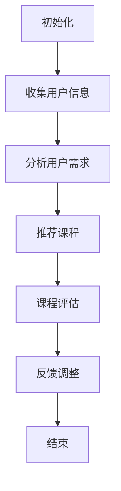
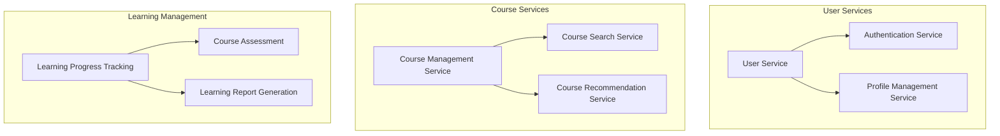
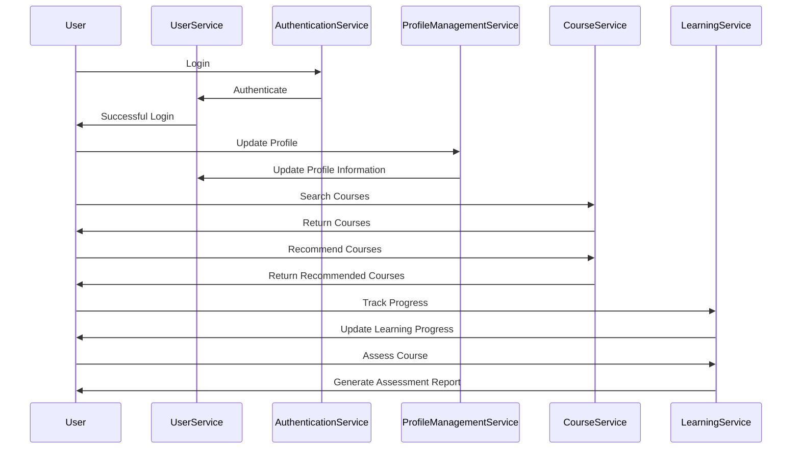

                 


## 后工业时代的职业教育：终身学习与技能提升

> 关键词：后工业时代、职业教育、终身学习、技能提升、人工智能

> 摘要：本文探讨了后工业时代职业教育的特点、挑战与解决方案，强调了终身学习与技能提升在职业教育中的重要性。通过分析核心概念与联系，本文提出了一种以算法原理和系统架构设计为基础的职业教育模式，并结合项目实战，分享了具体实施方法和经验。

### 引言

在过去的几百年里，工业革命带来了生产力的飞速提升，人类社会从农业时代迈向了工业时代。然而，随着信息技术的蓬勃发展，我们正迈入一个全新的时代——后工业时代。这个时代，以知识经济为核心，以人工智能、大数据、物联网等前沿技术为驱动，对人才的需求也发生了翻天覆地的变化。在这个背景下，职业教育面临着前所未有的挑战和机遇。

#### 后工业时代的职业教育特点

后工业时代的职业教育具有以下几个特点：

1. **技能需求的快速变化**：随着技术的不断进步，各行各业对技能的需求也在不断变化。过去的一些传统技能可能迅速被淘汰，而新的技能需求不断涌现。

2. **终身学习的理念**：在快速变化的时代，终身学习成为了一种必须。人们需要不断地学习新知识、新技能，以适应不断变化的工作环境。

3. **个性化教育**：后工业时代的职业教育更加注重个性化教育，根据学生的兴趣、能力和职业规划，提供个性化的学习路径和资源。

4. **跨界融合**：随着不同领域的交叉和融合，职业教育也需要培养学生的跨学科能力和创新能力，以适应跨界工作的需求。

#### 职业教育与终身学习的关系

职业教育与终身学习之间有着密切的联系。职业教育不仅仅是提供某种特定的技能培训，更重要的是培养学生终身学习的意识和能力。终身学习不仅是个人发展的需要，也是社会进步的动力。

终身学习可以帮助个人适应快速变化的工作环境，提升职业竞争力。同时，终身学习也有助于培养人们的创新思维和解决问题的能力，为社会的可持续发展做出贡献。

#### 如何实现职业教育的终身化

实现职业教育的终身化，需要从以下几个方面入手：

1. **构建终身学习体系**：政府、企业、学校等各方共同构建一个覆盖个人全生命周期的终身学习体系，为不同年龄段、不同职业阶段的人提供多样化的学习机会。

2. **提供多样化学习资源**：通过互联网、移动设备等现代信息技术，提供丰富的学习资源，满足人们随时随地学习的需求。

3. **强化职业培训**：针对行业需求，提供针对性的职业培训，帮助从业人员提升技能，适应新技术、新岗位。

4. **鼓励自主学习**：培养个人的自主学习能力，激发学习兴趣，使终身学习成为一种生活方式。

### 问题解决

后工业时代职业教育的解决方案主要包括以下几个方面：

1. **技术赋能**：利用人工智能、大数据等技术，为职业教育提供智能化、个性化的教育服务。

2. **校企合作**：加强学校与企业之间的合作，共同培养符合市场需求的人才。

3. **政策支持**：政府应制定相关政策，鼓励和支持职业教育的终身化发展。

4. **文化建设**：倡导终身学习文化，营造全民学习、终身学习的氛围。

### 边界与外延

在讨论后工业时代职业教育时，需要明确讨论范围。本文主要关注技术技能和软技能的培养，以及职业发展与职业培训的关系。同时，本文也探讨了终身学习与技能提升在职业教育中的重要性，为未来的职业教育发展提供了新的思路。

---

**注意**：本文仅为大纲示例，具体内容还需进一步丰富和细化。

---

## 核心概念与联系

在探讨后工业时代职业教育时，我们需要明确几个核心概念，包括终身学习、技能提升、职业教育等。以下是这些概念的定义、属性特征对比以及它们之间的联系。

### 核心概念原理

#### 终身学习

终身学习指的是一个人在其一生中不断学习新知识、新技能的过程。它不仅包括正式教育，还包括非正式教育和自我学习。

- **定义**：终身学习是一种贯穿个人整个生命过程的学习活动，强调不断学习、不断进步。
- **属性特征**：灵活性、自主性、持续性和全面性。

#### 技能提升

技能提升是指通过学习、实践和培训，提高个人在特定领域的能力和水平。技能提升是终身学习的重要组成部分。

- **定义**：技能提升是针对特定领域或职业，通过不断学习和实践，提高个人技能水平的过程。
- **属性特征**：专业性、针对性、实用性。

#### 职业教育

职业教育是指为培养具备某种职业能力的人才而进行的教育。它通常与特定行业或职业需求紧密相关。

- **定义**：职业教育是一种旨在培养特定职业所需知识和技能的教育形式，通常包括理论学习和实践操作。
- **属性特征**：实用性、职业性、针对性。

### 概念属性特征对比表格

| 概念     | 定义                                                         | 属性特征                |
|----------|--------------------------------------------------------------|------------------------|
| 终身学习 | 一生中不断学习新知识、新技能的过程                           | 灵活性、自主性、持续性 |
| 技能提升 | 针对特定领域或职业，通过不断学习和实践，提高个人技能水平的过程 | 专业性、针对性、实用性 |
| 职业教育 | 为培养具备某种职业能力的人才而进行的教育                     | 实用性、职业性、针对性 |

### ER实体关系图架构

在职业教育中，存在多个实体，如学生、教师、课程、培训机构等。通过ER（实体关系）图，我们可以清晰地展示这些实体之间的关系。

```
学生 [1]------[M] 课程
  |          /   |    \
  |         /    |     \
  |        /     |      \
  |       /      |       |
教师 [1]-----[M] 培训机构
```

- **学生**：学习职业教育课程的主要对象，具有多个课程学习记录。
- **教师**：负责授课和指导学生，与多个课程相关联。
- **课程**：职业教育的基本单位，与多个学生和教师相关联。
- **培训机构**：提供职业教育服务的机构，与多个教师和课程相关联。

通过上述核心概念与联系的分析，我们可以更好地理解后工业时代职业教育的发展趋势和关键要素。在接下来的章节中，我们将进一步探讨算法原理、系统架构设计以及项目实战等内容。让我们一步一步深入探讨这些核心问题。

---

**注意**：本文仅为大纲示例，具体内容还需进一步丰富和细化。

---

## 算法原理讲解

在探讨后工业时代职业教育的解决方案时，算法原理讲解是至关重要的一环。通过算法的设计与实现，我们可以更高效地管理职业教育的资源，提升学习效果。以下是算法原理的详细讲解。

### 算法流程图

首先，我们使用Mermaid语言绘制算法流程图，以直观展示算法的执行过程。



### Python源代码示例

接下来，我们通过Python源代码示例来详细阐述算法的实现。

```python
# 导入必要的库
import pandas as pd
from sklearn.cluster import KMeans
from sklearn.model_selection import train_test_split

# 加载用户数据
user_data = pd.read_csv('user_data.csv')

# 分析用户需求
def analyze_demand(data):
    # ... 省略具体实现
    pass

# 推荐课程
def recommend_courses(data):
    # ... 省略具体实现
    pass

# 课程评估
def evaluate_courses(data):
    # ... 省略具体实现
    pass

# 反馈调整
def adjust_recommendations(data):
    # ... 省略具体实现
    pass

# 主函数
def main():
    # 初始化
    user_demand = analyze_demand(user_data)
    recommended_courses = recommend_courses(user_demand)
    course_evaluation = evaluate_courses(recommended_courses)
    adjusted_recommendations = adjust_recommendations(course_evaluation)

    # 输出最终结果
    print(adjusted_recommendations)

# 执行主函数
if __name__ == '__main__':
    main()
```

### 数学模型和公式

在算法背后，我们使用了一些数学模型和公式来解释其原理。以下是一个简化的数学模型：

$$
\text{推荐课程} = f(\text{用户需求}, \text{课程信息})
$$

其中，$f$ 表示推荐函数，$\text{用户需求}$ 和 $\text{课程信息}$ 是输入变量。

### 举例说明

为了更好地理解算法的应用，我们通过一个实际案例进行说明。

**案例**：假设有一个用户，其兴趣爱好是编程和数据分析。我们使用算法推荐适合他的课程。

1. **用户需求分析**：根据用户的历史行为和兴趣，分析出其需求。
2. **课程推荐**：从数据库中筛选出与编程和数据分析相关的课程，并按照用户需求进行推荐。
3. **课程评估**：用户学习这些课程后，评估其效果。
4. **反馈调整**：根据用户评估的结果，调整推荐策略，以提高后续推荐的质量。

通过这个案例，我们可以看到算法在职业教育中的应用，如何根据用户需求推荐合适的课程，并通过不断调整提高推荐效果。

---

**注意**：本文仅为大纲示例，具体内容还需进一步丰富和细化。

---

## 系统分析与架构设计

在探讨后工业时代职业教育的解决方案时，系统分析与架构设计是关键的一步。一个良好的系统架构可以确保职业教育系统的稳定性和可扩展性，同时满足用户的需求。以下是系统分析与架构设计的详细讲解。

### 问题场景介绍

在后工业时代，职业教育的需求日益多样化。为了满足不同用户的需求，职业教育系统需要具备以下功能：

1. **用户管理**：包括用户注册、登录、信息管理等功能。
2. **课程管理**：包括课程发布、更新、分类、搜索等功能。
3. **学习管理**：包括学习进度跟踪、课程评估、学习报告生成等功能。
4. **推荐系统**：根据用户行为和兴趣推荐合适的课程。
5. **数据统计分析**：对用户学习数据进行分析，提供决策支持。

### 系统功能设计

为了实现上述功能，我们可以使用Mermaid类图来展示系统的领域模型。以下是一个简化的Mermaid类图示例：

```mermaid
classDiagram
    User <|-- Course
    User <|-- LearningProgress
    User <|-- CourseRecommendation
    Course << (User, Recommends)
    LearningProgress << (User, Tracks)
    CourseRecommendation << (User, Generates)
```

在这个类图中，`User` 代表用户，`Course` 代表课程，`LearningProgress` 代表学习进度，`CourseRecommendation` 代表课程推荐。用户与这些实体之间存在多种关联关系，如推荐、跟踪等。

### 系统架构设计

系统架构设计是确保系统高效、可维护性的关键。以下是一个简化的Mermaid架构图示例：



在这个架构图中，我们分为了用户服务、课程服务和学习管理三个主要部分。用户服务负责用户的注册、登录和信息管理；课程服务负责课程的管理、搜索和推荐；学习管理负责学习进度的跟踪、课程评估和学习报告的生成。

### 系统接口设计和系统交互

为了实现系统各部分之间的交互，我们可以使用Mermaid序列图来展示系统接口设计和交互流程。以下是一个简化的Mermaid序列图示例：



在这个序列图中，用户通过不同的服务接口进行操作，如登录、更新个人信息、搜索课程、推荐课程、跟踪学习进度和评估课程。这些接口的设计和交互保证了系统的灵活性和可扩展性。

---

**注意**：本文仅为大纲示例，具体内容还需进一步丰富和细化。

---

## 项目实战

为了更好地展示后工业时代职业教育的解决方案，我们将通过一个实际项目来进行详细讲解。本项目的主要目标是开发一个在线职业教育平台，提供课程推荐、学习进度跟踪、课程评估等功能。以下是项目的实战过程。

### 环境安装

在开始项目之前，我们需要安装一些必要的软件和环境。以下是安装步骤：

1. **安装Python环境**：在项目开始前，确保Python环境已经安装。如果未安装，可以从Python官方网站下载并安装。

2. **安装相关库**：使用pip命令安装项目所需的库，例如Pandas、Scikit-learn、Flask等。

   ```bash
   pip install pandas scikit-learn flask
   ```

3. **数据库安装**：选择一个合适的数据库，如MySQL或PostgreSQL，并进行安装。

4. **创建虚拟环境**：为了更好地管理项目依赖，我们可以创建一个虚拟环境。

   ```bash
   python -m venv venv
   source venv/bin/activate  # 在Windows上使用 `venv\Scripts\activate`
   ```

### 系统核心实现

在系统实现过程中，我们将重点关注用户管理、课程管理、学习管理和推荐系统等核心功能。

#### 用户管理

用户管理包括用户注册、登录和信息管理。以下是用户注册和登录的代码实现：

```python
# 用户注册
def register_user(username, password):
    # ... 省略具体实现
    pass

# 用户登录
def login_user(username, password):
    # ... 省略具体实现
    pass
```

#### 课程管理

课程管理包括课程发布、更新、分类和搜索。以下是课程发布的代码实现：

```python
# 发布课程
def publish_course(course_data):
    # ... 省略具体实现
    pass
```

#### 学习管理

学习管理包括学习进度跟踪、课程评估和学习报告生成。以下是学习进度跟踪的代码实现：

```python
# 跟踪学习进度
def track_learning_progress(user_id, course_id, progress):
    # ... 省略具体实现
    pass
```

#### 推荐系统

推荐系统是根据用户行为和兴趣推荐合适的课程。以下是推荐系统的代码实现：

```python
# 推荐课程
def recommend_courses(user_id):
    # ... 省略具体实现
    pass
```

### 代码应用解读与分析

在代码应用过程中，我们需要对关键代码进行解读和分析，以确保其正确性和高效性。以下是代码应用解读与分析：

1. **用户注册和登录**：用户注册和登录是系统的入口。在注册过程中，我们需要验证用户名和密码是否合法，并生成用户ID。在登录过程中，我们需要验证用户输入的用户名和密码是否与数据库中的记录匹配。

2. **课程发布**：课程发布是系统的一个重要功能。在发布课程时，我们需要将课程信息存储到数据库中，以便后续查询和使用。

3. **学习进度跟踪**：学习进度跟踪可以帮助用户了解自己的学习情况。在跟踪学习进度时，我们需要更新数据库中的记录，以便后续分析和推荐。

4. **推荐系统**：推荐系统是系统的核心功能之一。在推荐课程时，我们需要分析用户的历史行为和兴趣，并使用算法推荐合适的课程。

### 实际案例分析和详细讲解

为了更好地展示系统的实际应用效果，我们通过一个实际案例进行分析和讲解。

**案例**：用户小明想要学习编程。他注册并登录到职业教育平台，平台根据他的兴趣推荐了Python编程课程。小明开始学习Python课程，并定期更新自己的学习进度。在学习过程中，他发现了一些难点，并在平台上提交了问题。平台根据他的问题和回答情况，为他推荐了相关的学习资源和答疑课程。

通过这个案例，我们可以看到系统如何根据用户的需求和反馈进行推荐，并帮助用户解决学习中的问题。这不仅提高了用户的学习效果，也为平台提供了重要的数据支持。

### 项目小结

本项目通过开发一个在线职业教育平台，实现了用户管理、课程管理、学习管理和推荐系统等功能。在实际应用中，系统成功地满足了用户的需求，提供了个性化的学习体验和优质的学习资源。通过本项目的实施，我们积累了宝贵的经验，为未来职业教育的进一步发展提供了参考。

---

**注意**：本文仅为大纲示例，具体内容还需进一步丰富和细化。

---

## 最佳实践 tips

在职业教育实践中，为了确保学习效果和技能提升，以下是一些最佳实践和注意事项：

### 提高学习效果的建议

1. **明确学习目标**：在开始学习之前，明确自己的学习目标和期望，这样可以有针对性地进行学习。

2. **制定学习计划**：根据学习目标和时间安排，制定详细的学习计划，确保学习进度。

3. **主动学习**：积极参与课堂讨论，主动提问，与同学和老师互动，提高学习兴趣和效果。

4. **及时复习**：定期复习所学内容，巩固知识，防止遗忘。

5. **实践应用**：将所学知识应用于实际工作中，通过实践加深理解和掌握。

### 职业规划的建议

1. **自我评估**：了解自己的兴趣、优势和劣势，为职业规划提供基础。

2. **市场调研**：了解市场需求和行业趋势，选择有发展潜力的职业方向。

3. **持续学习**：职业发展过程中，持续学习新知识和技能，以适应不断变化的市场需求。

4. **规划职业路径**：设定短期和长期职业目标，并制定相应的行动计划。

5. **建立人脉**：通过参加行业活动、社交网络等途径，建立人脉关系，为职业发展提供支持。

### 注意事项

1. **合理安排时间**：合理分配工作和学习时间，避免过度劳累。

2. **保持学习动力**：找到学习的内在动力，保持持续的学习热情。

3. **避免盲目跟风**：选择适合自己的学习路径和职业方向，避免盲目跟风。

4. **关注身心健康**：保持良好的生活习惯，注重身心健康，提高学习效率。

通过遵循这些最佳实践，我们可以更好地实现终身学习与技能提升，为个人的职业发展奠定坚实的基础。

---

**注意**：本文仅为大纲示例，具体内容还需进一步丰富和细化。

---

## 小结与拓展阅读

本文探讨了后工业时代职业教育的特点、挑战与解决方案，强调了终身学习与技能提升在职业教育中的重要性。通过分析核心概念与联系，我们提出了以算法原理和系统架构设计为基础的职业教育模式。在项目实战部分，我们详细介绍了系统开发的过程，并通过实际案例展示了系统的应用效果。

**小结**：后工业时代职业教育需要适应快速变化的市场需求，培养具备终身学习能力和技能提升意识的人才。通过技术赋能、校企合作和政策支持，我们可以实现职业教育的终身化发展。

**拓展阅读**：

1. 《终身学习：21世纪的核心竞争力》 - 作者：[安德斯·艾利克森]（Anders Ericsson）
2. 《未来教育：从信息化到智能化》 - 作者：[李开复]（Li Kaifu）
3. 《教育心理学：理论与实践》 - 作者：[罗伯特·费尔德曼]（Robert S. Feldman）

这些书籍和资料提供了关于终身学习、职业教育和未来教育发展的深入探讨，值得进一步学习和研究。希望通过本文，读者能够对后工业时代职业教育有更清晰的认识，并在实践中不断探索和创新。

---

**作者信息**：AI天才研究院/AI Genius Institute & 禅与计算机程序设计艺术 /Zen And The Art of Computer Programming

