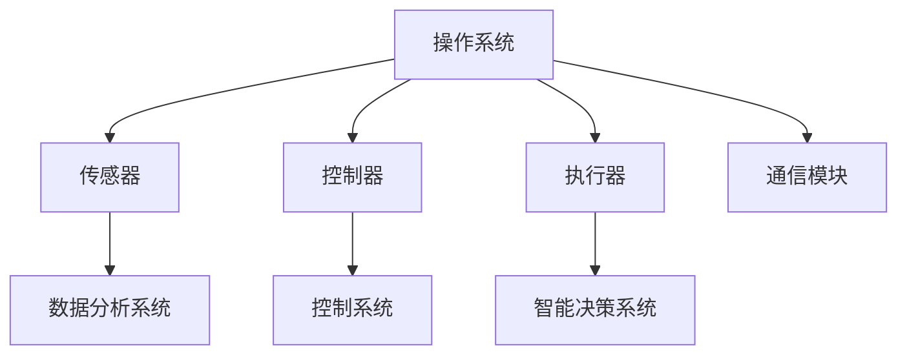
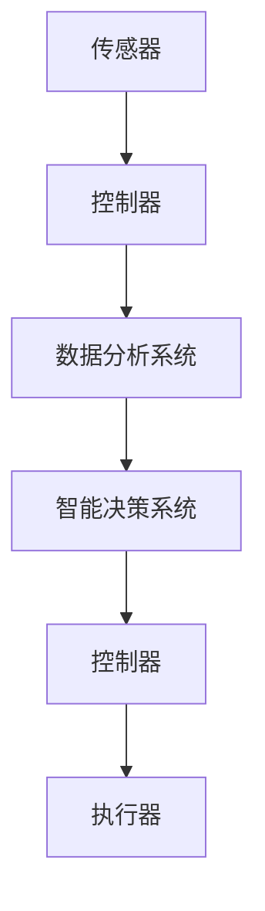

                 

### 引言

《后工作时代生存手册：自动化世界中的人生规划》旨在探讨在自动化和人工智能快速发展的背景下，个体如何在社会和经济结构深刻变革中找到自己的生存之道。随着科技的进步，自动化技术正以前所未有的速度改变着我们的工作和生活方式，许多传统工作岗位正逐渐被智能机器取代。这不仅引发了个体的生存困境，也对社会的心理状态、教育体系和职业规划提出了新的挑战。

本文将分五个部分进行探讨。首先，我们将在第一部分“后工作时代概述”中，详细描述后工作时代的来临背景、问题描述及其解决策略，并探讨自动化对不同行业和领域的影响以及全球趋势。接着，在第二部分“核心概念与联系”中，我们将深入分析自动化技术的定义、特点、分类及其与人工智能的联系与区别。第三部分“算法原理讲解”将介绍自动化算法的基本概念、原理，并通过具体的控制算法和机器学习算法的举例，帮助读者理解其应用场景和实现过程。

在第四部分“人生规划与策略”中，我们将探讨如何在后工作时代重新定义工作和生活，包括工作与生活的平衡、职业转型与技能提升、创业与自主就业以及社交网络与人际关系管理。最后，在第五部分“系统分析与架构设计”中，我们将通过一个自动化系统架构设计的案例，展示如何在实际项目中应用所学知识，并进行系统分析和设计。

通过这一步步的分析与思考，我们希望能够为读者提供一个清晰、实用的指导手册，帮助他们更好地应对后工作时代带来的机遇与挑战。

### 第一部分：后工作时代概述

#### 第1章 后工作时代的来临

##### 1.1 问题背景

**自动化与人工智能的发展**：

在过去的几十年中，自动化技术经历了从传统机械自动化到现代智能自动化的发展。传统机械自动化主要依赖于物理装置和预设的编程指令，其应用场景局限于生产线上的简单重复操作。而现代智能自动化则借助人工智能、机器学习等先进技术，能够自主学习和优化操作过程，实现复杂任务的高效执行。

人工智能的发展是推动自动化技术进步的重要力量。通过深度学习、自然语言处理、计算机视觉等技术，人工智能能够处理大量复杂的信息，并在各种应用场景中表现出色。例如，自动驾驶汽车利用计算机视觉和机器学习技术，实现了对道路环境和障碍物的实时感知与反应；智能客服系统通过自然语言处理技术，能够提供高效的客户服务。

**工作岗位的消失与转型**：

随着自动化技术的快速发展，许多传统工作岗位面临着消失或转型的风险。例如，制造业中的流水线工人、物流业中的仓库管理员、金融业中的数据录入员等，这些职业因为自动化设备的引入而逐渐减少。同时，一些新的岗位也在不断出现，如数据科学家、人工智能工程师、自动化系统维护工程师等，这些岗位要求具备更高的技术能力和创新能力。

**社会经济结构的变化**：

自动化和人工智能的广泛应用对整个社会经济结构产生了深远的影响。一方面，自动化技术提高了生产效率，降低了生产成本，促进了经济的发展。另一方面，劳动力市场的需求结构发生了变化，低技能工作岗位减少，高技能工作岗位需求增加，这要求劳动者不断提升自己的技能水平，以适应新的就业需求。

##### 1.2 问题描述

**个人生存困境**：

在自动化时代，个体面临着一系列生存困境。首先，失业风险增加。随着自动化设备的广泛应用，许多传统工作岗位被取代，导致大量劳动者失业。其次，职业发展受阻。在自动化背景下，低技能劳动者难以找到稳定的工作机会，而高技能劳动者则需要不断更新自己的知识和技能，以适应快速变化的工作需求。此外，生活质量的下降也是一个值得关注的问题。自动化技术的普及导致收入分配不均，高技能劳动者与低技能劳动者之间的收入差距加大，从而影响了整体生活质量。

**社会心理影响**：

自动化时代的到来不仅对个体的生存产生了影响，也对整个社会的心理状态产生了深远的影响。一方面，个体可能会感到焦虑和恐慌，担心自己的工作被取代，未来的生计无法保障。另一方面，社会整体可能会出现信任危机，对新技术持有抵触情绪，担心技术发展带来的不确定性。

**教育与职业规划挑战**：

在自动化时代，教育与职业规划面临着新的挑战。一方面，教育体系需要适应新技术的发展，提供更全面、更实用的教育课程，帮助学生在毕业后能够胜任新兴岗位。另一方面，职业规划也需要更加灵活，劳动者需要具备快速适应新环境和新技术的能力，不断调整自己的职业发展方向。

##### 1.3 问题解决

**生存策略**：

为了应对自动化时代的生存挑战，个体可以采取以下策略：

1. **技能提升**：劳动者需要不断学习新技能，特别是与人工智能和自动化技术相关的技能，以提高自己的竞争力。
2. **职业转型**：对于被自动化取代的传统岗位，劳动者可以考虑向新兴岗位转型，如数据科学家、人工智能工程师等。
3. **创业**：劳动者可以考虑自主创业，利用自己的技术和创新能力，开拓新的就业机会。

**职业转型路径**：

职业转型是一个复杂且长期的过程，需要劳动者具备坚定的决心和持续的努力。以下是职业转型的几个步骤：

1. **评估自我**：了解自己的兴趣、优势和职业目标，明确转型方向。
2. **学习新技能**：通过在线课程、职业培训等途径，学习与目标岗位相关的技能。
3. **积累经验**：通过实习、兼职或项目合作等方式，积累相关的工作经验。
4. **拓展人脉**：积极参加行业活动，结识同行，获取更多的职业信息和机会。

**社会支持体系构建**：

为了更好地应对自动化时代的挑战，社会需要建立一套完善的支持体系，包括：

1. **教育培训**：政府和企业应该加大对教育和职业培训的投入，提供更多免费或低成本的培训机会。
2. **就业服务**：提供专业的就业咨询服务，帮助劳动者了解就业市场动态，找到适合自己的岗位。
3. **社会保障**：完善社会保障体系，为失业和低收入劳动者提供必要的经济支持和心理援助。

##### 1.4 边界与外延

**自动化对不同行业的影响**：

自动化技术的应用对各行各业产生了深远的影响。在制造业，自动化生产线提高了生产效率和质量；在服务业，智能客服系统和服务机器人提升了服务质量和客户体验；在金融业，自动化交易系统和智能投顾技术优化了金融服务的效率和准确性。

**人工智能在不同领域的应用**：

人工智能技术在各个领域的应用正在不断拓展。在医疗领域，人工智能可以帮助医生进行疾病诊断和治疗方案制定；在教育领域，智能教育系统能够根据学生的特点提供个性化的学习建议；在交通领域，自动驾驶技术和智能交通管理系统提升了交通效率和安全性。

**后工作时代的全球趋势**：

全球范围内，后工作时代的趋势主要包括：

1. **劳动力市场的变革**：随着自动化和人工智能的普及，劳动力市场的需求结构发生了变化，对劳动者的技能要求也在不断提升。
2. **教育与培训的变革**：教育体系需要不断改革，以适应新技术的发展，培养具有创新能力和实践能力的劳动者。
3. **社会保障体系的完善**：政府和企业需要加大对社会保障的投入，为劳动者提供更好的就业和失业保障。

##### 1.5 本章小结

本文从问题背景、问题描述、问题解决、边界与外延等多个角度，探讨了后工作时代的来临及其带来的挑战。通过对自动化与人工智能的发展、工作岗位的消失与转型、社会经济结构的变化等问题的分析，我们提出了生存策略、职业转型路径和社会支持体系构建等解决方案。同时，本文还探讨了自动化对不同行业的影响、人工智能在不同领域的应用以及后工作时代的全球趋势。这些分析和讨论为读者提供了一个全面、深入的理解后工作时代的机会，也为应对这一时代带来的挑战提供了实用的指导。

### 第二部分：核心概念与联系

#### 第2章 自动化技术核心概念

##### 2.1 自动化技术的定义与特点

**自动化技术的定义**：

自动化技术是指通过应用计算机、机器人、传感器等自动化装置，实现生产过程或工作任务自动化的技术。它包括从硬件设备到软件系统的全面集成，使系统能够在无需人工直接干预的情况下，自主执行预定的操作和任务。

**自动化技术的主要特点**：

1. **自动化性**：自动化技术能够实现生产或操作过程的自动化，减少了人工干预，提高了生产效率和质量。
2. **高效性**：通过自动化技术，系统能够在短时间内完成大量重复性任务，减少了人工操作的时间和误差。
3. **灵活性**：自动化系统能够根据生产需求的变化，灵活调整操作流程，适应不同的生产任务。
4. **可靠性**：自动化设备具有高可靠性，能够在长时间内稳定运行，减少了设备故障和停机时间。
5. **集成性**：自动化技术涉及到硬件、软件、传感器等多个领域的综合应用，具有高度的集成性。

**自动化技术的影响因素**：

1. **技术发展**：自动化技术的发展水平和应用程度是影响其效果的关键因素。技术的进步使得自动化系统能够处理更复杂、更高精度的任务。
2. **成本**：自动化设备的初始投资成本较高，对企业的财务状况有较大影响。成本效益分析是决定是否采用自动化技术的重要因素。
3. **人力资源**：自动化技术对人力资源的要求发生变化。一方面，需要具备自动化技术操作和维护能力的人才；另一方面，传统工人的就业压力增大，需要重新培训和转型。
4. **政策与法规**：政府的政策支持与法规限制对自动化技术的推广和应用具有重要影响。例如，环保法规可能会限制某些自动化设备的使用。

##### 2.2 自动化技术的分类

**传统自动化技术**：

传统自动化技术主要包括机械自动化、电气自动化和流体自动化等。机械自动化利用机械装置实现生产过程的自动化，如生产线上的机械臂；电气自动化通过电气控制系统实现设备的自动控制，如工业机器人的控制；流体自动化涉及液体和气体的自动化输送和控制，如工业管道系统的自动化控制。

**现代自动化技术**：

现代自动化技术以计算机和信息技术为核心，涵盖了计算机控制、机器人技术、智能控制系统等。计算机控制通过计算机软件实现对生产过程的实时监控和控制；机器人技术包括工业机器人、服务机器人等，能够在各种复杂环境中执行任务；智能控制系统利用人工智能技术，实现系统的高度智能化和自适应能力。

**智能自动化技术**：

智能自动化技术是自动化技术的最新发展，它结合了人工智能、大数据、物联网等前沿技术，实现自动化系统的自主学习和优化。智能自动化系统能够通过数据分析和机器学习，不断优化操作流程，提高生产效率和产品质量。

**自动化技术的分类对比表格**：

| 类别             | 特点                                                         | 应用场景                                               |
|------------------|--------------------------------------------------------------|--------------------------------------------------------|
| 传统自动化技术   | 主要依赖机械、电气和流体控制技术                             | 制造业、工业生产、简单流程控制                           |
| 现代自动化技术   | 结合计算机、信息技术，实现高效、灵活的自动化控制             | 高端制造业、服务业、智能交通、智能家庭                   |
| 智能自动化技术   | 集成人工智能、大数据、物联网技术，实现高度智能化和自适应控制 | 复杂环境下的自主任务执行、智能工厂、智慧城市             |

##### 2.3 自动化技术的核心概念对比

**传统自动化与智能自动化的对比**：

传统自动化技术依赖于预设的程序和规则，操作相对简单，适用于固定的生产任务。而智能自动化技术则通过机器学习和人工智能，能够根据环境变化自主学习和优化操作过程，具有更高的灵活性和适应性。

**自动化技术在不同领域的应用对比**：

在不同领域，自动化技术的应用方式和效果也有所不同。在制造业，自动化技术主要应用于生产线的优化和效率提升；在服务业，自动化技术用于提高服务质量和工作效率；在医疗领域，自动化技术主要用于辅助诊断和治疗。

**自动化技术与人工智能的联系与区别**：

自动化技术与人工智能有着密切的联系，二者共同推动自动化系统的发展。自动化技术为人工智能提供了应用场景和实际需求，而人工智能则为自动化技术提供了更高效的解决方案。然而，两者的区别在于，自动化技术更注重操作的自动化，而人工智能更注重智能决策和自主学习。

##### 2.4 本章小结

本章详细介绍了自动化技术的定义与特点，分析了传统自动化技术、现代自动化技术和智能自动化技术的分类及其应用。通过对比传统自动化与智能自动化，以及在不同领域的应用，我们理解了自动化技术的核心概念及其发展趋势。此外，本章还探讨了自动化技术与人工智能的联系与区别，为后续章节的算法原理讲解奠定了基础。

### 第三部分：算法原理讲解

#### 第3章 自动化算法原理讲解

##### 3.1 自动化算法概述

**自动化算法的定义**：

自动化算法是指用于实现自动化系统功能的一系列数学模型和计算方法。它通过输入数据，经过特定的计算和处理，输出相应的操作指令或结果。自动化算法是自动化系统的核心，决定了系统的性能和功能。

**自动化算法的类型**：

自动化算法主要可以分为以下几类：

1. **控制算法**：用于实现系统控制功能的算法，如PID控制算法、模糊控制算法等。
2. **机器学习算法**：通过训练数据和模型，实现系统自动学习和优化的算法，如线性回归、决策树、神经网络等。
3. **优化算法**：用于优化系统性能和操作效率的算法，如遗传算法、模拟退火算法、粒子群优化等。

**自动化算法的应用场景**：

自动化算法广泛应用于各种领域，包括但不限于：

1. **制造业**：用于生产过程的优化和自动化控制，如机器臂控制、生产流水线调度等。
2. **服务业**：用于服务机器人、智能客服系统的控制，如机器人路径规划、语音识别等。
3. **医疗领域**：用于辅助诊断和治疗，如医学图像处理、病理分析等。
4. **交通领域**：用于交通信号控制、自动驾驶等，如路径规划、车辆调度等。

##### 3.2 算法原理讲解

**3.2.1 控制算法原理讲解**

**控制算法的基本概念**：

控制算法是自动化算法中的重要组成部分，主要用于实现系统的实时控制和调节。控制算法的核心是控制器，控制器通过接收系统的输入信号，经过计算和处理，输出控制信号，以调节系统的状态。

**控制算法的数学模型**：

控制算法通常基于状态空间模型，其基本数学模型可以表示为：

\[ \dot{x}(t) = Ax(t) + Bu(t) \]
\[ y(t) = Cx(t) + Du(t) \]

其中，\(x(t)\) 是系统的状态向量，\(u(t)\) 是系统的输入向量，\(y(t)\) 是系统的输出向量，\(A\)、\(B\)、\(C\)、\(D\) 分别是系统的状态矩阵、输入矩阵、输出矩阵和直接传输矩阵。

**控制算法的流程图**：

控制算法的基本流程包括以下步骤：

1. 收集系统的输入信号。
2. 对输入信号进行预处理，如滤波、增益调整等。
3. 计算系统的当前状态。
4. 根据状态和预定的控制策略，计算控制输出。
5. 输出控制信号，调节系统状态。

**控制算法举例**：

以PID控制算法为例，PID控制算法是一种常见的控制算法，其控制输出可以通过以下公式计算：

\[ u(t) = K_p e(t) + K_i \int_{0}^{t} e(\tau) d\tau + K_d \frac{de(t)}{dt} \]

其中，\(e(t)\) 是系统的误差信号，\(K_p\)、\(K_i\)、\(K_d\) 分别是比例、积分和微分系数。

**控制算法的应用场景**：

PID控制算法广泛应用于各种工业控制系统，如温度控制、压力控制、流量控制等。

**3.2.2 机器学习算法原理讲解**

**机器学习的基本概念**：

机器学习是一种人工智能技术，通过从数据中学习规律和模式，实现系统的自动学习和优化。机器学习的基本原理是利用训练数据，通过构建模型，实现对未知数据的预测和分类。

**机器学习的数学模型**：

机器学习模型通常包括输入层、隐藏层和输出层。输入层接收外部数据，隐藏层通过神经网络的权重和偏置进行计算，输出层生成最终的预测结果。

**机器学习的算法流程图**：

机器学习算法的基本流程包括以下步骤：

1. 数据预处理：对原始数据进行清洗、归一化等处理，以适应模型的输入要求。
2. 模型训练：通过训练数据，调整模型的参数，使模型能够正确地预测或分类。
3. 模型评估：使用验证数据集或测试数据集，评估模型的性能，如准确率、召回率等。
4. 模型优化：根据评估结果，调整模型参数，提高模型性能。

**机器学习算法举例**：

以线性回归算法为例，线性回归模型通过最小二乘法拟合数据，其预测公式为：

\[ y = \beta_0 + \beta_1 x \]

其中，\(\beta_0\) 和 \(\beta_1\) 分别是模型的参数。

**机器学习的应用场景**：

线性回归算法广泛应用于数据分析和预测领域，如房价预测、股票市场预测等。

##### 3.3 举例说明

**3.3.1 控制算法举例**

**例子描述**：

假设我们使用PID控制算法控制一个加热系统的温度。系统初始温度为20°C，目标温度为100°C。PID控制器的参数分别为\(K_p = 2\)、\(K_i = 0.1\)、\(K_d = 1\)。

**代码实现**：

```python
import numpy as np

# PID控制参数
Kp = 2
Ki = 0.1
Kd = 1

# 初始温度和目标温度
T_initial = 20
T_setpoint = 100

# 控制周期
T周期的控制
def control(T_current):
    error = T_setpoint - T_current
    derivative = error - T_current_last
    integral = error * T周期

    u = Kp * error + Ki * integral + Kd * derivative
    return u

# 模拟控制过程
T_current_last = T_initial
for t in range(1, 101):
    u = control(T_current_last)
    T_current = T_current_last + u * T周期
    T_current_last = T_current
    print(f"时间 {t}：温度 {T_current}")

```

**结果分析**：

通过模拟控制过程，可以看到温度逐渐从初始的20°C上升到目标温度100°C，PID控制算法能够有效地调节系统温度，使其稳定在目标温度附近。

**3.3.2 机器学习算法举例**

**例子描述**：

使用线性回归算法预测一个城市的未来天气温度。训练数据集包括过去一周每天的最高温度。

**代码实现**：

```python
import numpy as np
from sklearn.linear_model import LinearRegression

# 假设的训练数据集
X = np.array([[1], [2], [3], [4], [5], [6], [7]])
y = np.array([20, 22, 24, 25, 27, 29, 30])

# 创建线性回归模型
model = LinearRegression()
model.fit(X, y)

# 预测未来一天的温度
X_new = np.array([[8]])
y_pred = model.predict(X_new)

print(f"预测的未来温度为：{y_pred[0]}°C")
```

**结果分析**：

通过线性回归模型，我们可以预测未来一天的最高温度。这个预测是基于历史数据的线性关系，因此在实际应用中可能存在一定的误差。

##### 3.4 本章小结

本章详细介绍了自动化算法的基本概念、类型和应用场景。通过控制算法和机器学习算法的讲解，读者可以理解不同类型的自动化算法的工作原理和实现过程。本章还通过具体的算法举例，帮助读者更好地理解自动化算法的应用效果。这些知识为后续章节的系统和人生规划提供了理论基础。

### 第四部分：人生规划与策略

#### 第4章 重新定义工作与生活

##### 4.1 工作与生活的平衡

**工作模式的转变**：

随着自动化和人工智能技术的发展，工作模式也在发生转变。传统的“朝九晚五”工作模式正在被打破，灵活的工作时间和远程办公成为越来越普遍的选择。这种转变带来了工作与生活的平衡问题，如何在高度灵活的工作环境中保持平衡成为个体需要面对的挑战。

**生活质量的保障**：

在自动化时代，工作与生活的平衡不仅是一个时间管理的问题，更是一个生活质量的问题。自动化技术的广泛应用提高了生产效率，使得个体有更多的时间去关注自己的生活质量。然而，随着工作模式的灵活性增加，如何保障生活质量成为一个新的课题。

**平衡的实现策略**：

为了实现工作与生活的平衡，个体可以采取以下策略：

1. **时间管理**：合理规划工作时间，确保工作与休息时间相互平衡。使用时间管理工具，如番茄钟、待办事项列表等，提高工作效率。
2. **远程办公**：充分利用远程办公的优势，减少通勤时间，提高生活便利性。同时，远程办公可以提供更多的灵活性，使个体能够更好地平衡工作与生活。
3. **技能提升**：通过不断学习和提升技能，提高自己的竞争力，获得更高的收入和职业发展机会。高技能劳动者通常有更多的时间和资源来平衡工作与生活。
4. **心理健康**：保持心理健康是实现工作与生活平衡的重要因素。通过锻炼、冥想、社交活动等方式，缓解工作压力，保持良好的心理状态。
5. **家庭关系**：家庭是生活的重要组成部分，保持良好的家庭关系对工作与生活的平衡至关重要。通过合理安排时间，与家人共度美好时光，增强家庭凝聚力。

##### 4.2 职业转型与技能提升

**职业转型的必要性**：

在自动化时代，传统工作岗位的消失和新兴岗位的出现要求劳动者不断进行职业转型。职业转型不仅是应对工作岗位消失的必要手段，也是适应经济发展和科技进步的重要途径。

**技能提升的方法与途径**：

为了实现职业转型和技能提升，个体可以采取以下方法和途径：

1. **在线学习**：利用互联网资源，如在线课程、视频教程等，学习新技能。例如，人工智能、机器学习、数据科学等领域的在线课程提供了丰富的学习资源。
2. **职业培训**：参加职业培训机构提供的课程和培训，获取专业的知识和技能。职业培训课程通常与市场需求紧密结合，能够快速提升个体的技能水平。
3. **实践经验**：通过实习、兼职或项目合作等方式，积累实际工作经验。实践是提升技能的重要途径，通过实际操作，个体能够更好地理解理论知识，提高解决问题的能力。
4. **持续学习**：在职业生涯中，持续学习是保持竞争力的重要手段。个体需要不断更新自己的知识和技能，以适应不断变化的工作环境。

**职业转型案例分析**：

以下是一个职业转型的成功案例：

张先生是一位拥有多年制造业工作经验的工人。随着自动化技术的广泛应用，传统制造业工作岗位减少，张先生面临着失业的风险。为了应对这一挑战，张先生决定进行职业转型，学习数据分析技能。他在网上报名参加了数据分析的在线课程，并通过实践经验不断提升自己的技能。最终，他成功转型成为了一名数据分析师，在一家互联网公司找到了满意的工作。

**创业与自主就业**：

**创业环境分析**：

在自动化时代，创业环境发生了显著变化。一方面，自动化和人工智能技术的发展为创业者提供了丰富的技术支持和市场机会；另一方面，经济全球化、互联网普及等因素也为创业提供了更广阔的空间。

**创业策略制定**：

为了成功创业，个体可以采取以下策略：

1. **市场调研**：深入了解市场需求，确定创业项目的市场前景和竞争优势。
2. **技术优势**：利用自动化和人工智能技术，为创业项目提供技术支持和创新能力。
3. **资金筹集**：通过天使投资、风险投资等渠道，筹集创业资金。
4. **团队建设**：组建一支具有专业技能和合作精神的团队，共同推进创业项目。
5. **风险管理**：制定详细的风险管理策略，应对创业过程中可能遇到的各种风险。

**自主就业模式探索**：

在自动化时代，自主就业模式包括以下几种：

1. **远程办公**：通过互联网和远程协作工具，实现自主就业。例如，自由职业者、远程程序员等。
2. **电子商务**：利用电商平台，开展电子商务业务，如网店、跨境电商等。
3. **共享经济**：参与共享经济平台，提供共享服务，如滴滴出行、共享单车等。
4. **个体经营**：开设实体店或虚拟店铺，提供个性化服务和产品。

**创业案例分析**：

李女士是一位具有多年市场营销经验的职场人士。她在自动化时代看到了创业的机会，决定创办一家智能营销公司。她通过市场调研，了解到智能营销技术在市场营销领域的巨大潜力。她利用自己的技术和资源，组建了一支专业团队，开发了一套智能营销系统。通过互联网和社交媒体，她成功地将产品推向市场，获得了广泛的认可和好评。

**创业经验总结**：

李女士的创业经历总结如下：

1. **技术驱动**：创业项目需要具备技术优势，以在竞争激烈的市场中脱颖而出。
2. **市场导向**：深入了解市场需求，确定项目的市场定位和目标客户。
3. **团队协作**：创业成功离不开专业的团队，团队成员需要具备专业技能和合作精神。
4. **持续创新**：在自动化时代，技术创新是创业的关键，个体需要不断进行产品和服务创新。

##### 4.3 社交网络与人际关系管理

**社交网络的重要性**：

在自动化时代，社交网络成为个体获取信息、拓展人脉和实现职业发展的关键渠道。通过社交网络，个体能够快速了解行业动态、获取职业机会和建立合作关系。

**人际关系管理策略**：

为了有效管理人际关系，个体可以采取以下策略：

1. **建立专业形象**：在社交网络中，保持专业形象，发布有价值的行业信息和专业见解，提升个人品牌。
2. **主动拓展人脉**：积极参加行业活动和社交聚会，主动结识同行和潜在合作伙伴。
3. **维护关系**：定期与朋友、同事和行业人士保持联系，通过私信、电话或见面会等方式，维护良好的人际关系。
4. **知识共享**：在社交网络中，积极参与讨论和分享，提供专业知识和经验，提升个人影响力。
5. **多元化社交**：拓展社交圈子，与不同行业和背景的人建立联系，以获取更多的信息和资源。

**社交网络对工作与生活的影响**：

社交网络对工作与生活的影响主要体现在以下几个方面：

1. **信息获取**：社交网络是获取行业信息和职业机会的重要渠道，个体可以通过关注行业动态和人才招聘信息，及时了解市场变化。
2. **职业发展**：通过社交网络，个体可以结识更多的行业人士，获得职业推荐和职业发展机会。
3. **社交互动**：社交网络提供了更多的社交机会，个体可以通过在线互动和聚会，增强社交关系，提高生活质量。
4. **工作压力**：社交网络也可能带来工作压力，如职业竞争、任务分配等，个体需要学会有效管理社交网络带来的压力。

##### 4.4 本章小结

本章探讨了在自动化时代重新定义工作与生活的策略和方法。通过分析工作模式的转变、生活质量的保障、职业转型的必要性、技能提升的方法与途径、创业与自主就业模式、社交网络与人际关系管理，我们为读者提供了一个全面、实用的指导。这些策略和方法不仅有助于个体在自动化时代找到自己的生存之道，也为实现工作与生活的平衡提供了有效途径。通过不断学习和实践，个体可以更好地应对自动化时代带来的挑战，实现个人发展和职业成功。

### 第五部分：系统分析与架构设计

#### 第5章 自动化系统架构设计

##### 5.1 问题场景介绍

**自动化系统需求分析**：

在一个现代智能工厂中，自动化系统需求包括生产线上的机器人控制、物料配送、质量检测、生产调度等。系统的目标是提高生产效率、降低生产成本、保证产品质量，并实现生产过程的自动化和智能化。

**自动化系统目标确定**：

1. **提高生产效率**：通过自动化技术的应用，实现生产过程的优化和自动化控制，减少人工干预，提高生产效率。
2. **降低生产成本**：通过自动化系统的应用，减少人工成本和材料浪费，降低生产成本。
3. **保证产品质量**：通过自动化质量检测系统和智能控制算法，提高产品质量和一致性。
4. **实现生产过程的智能化**：通过物联网、大数据和人工智能技术的应用，实现生产过程的实时监控和智能决策。

**系统功能设计**：

自动化系统的功能设计包括以下方面：

1. **机器人控制**：实现对生产线上机器人的实时控制和路径规划。
2. **物料配送**：实现对原材料和成品的自动化配送和存储管理。
3. **质量检测**：通过传感器和智能算法，实现产品质量的实时检测和反馈。
4. **生产调度**：根据生产计划和实际生产情况，实现生产任务的智能调度和优化。

**系统功能实现**：

1. **机器人控制**：采用先进的机器视觉和运动控制系统，实现对机器人的精确控制和路径规划。
2. **物料配送**：通过自动化输送设备和智能仓库管理系统，实现物料的自动化配送和存储。
3. **质量检测**：利用传感器和机器学习算法，实现产品质量的实时检测和自动反馈。
4. **生产调度**：通过生产调度算法和实时数据分析，实现生产任务的智能调度和优化。

##### 5.2 系统架构设计

**系统架构设计**：

自动化系统的架构设计包括硬件架构和软件架构两部分。

**硬件架构**：

硬件架构主要包括传感器、执行器、控制器和通信模块等。

1. **传感器**：用于采集生产过程中的各种数据，如温度、压力、速度等。
2. **执行器**：用于执行具体的操作任务，如机器人手臂、电机等。
3. **控制器**：用于控制传感器的数据采集和执行器的操作。
4. **通信模块**：用于实现不同设备之间的数据传输和通信。

**软件架构**：

软件架构主要包括操作系统、控制系统、数据分析和智能决策系统等。

1. **操作系统**：提供系统的运行环境和基本功能，如进程管理、内存管理、文件系统等。
2. **控制系统**：实现生产过程的实时控制和调度，包括机器人控制、物料配送、质量检测等。
3. **数据分析系统**：利用大数据技术，对生产过程中的数据进行收集、存储和分析。
4. **智能决策系统**：利用机器学习算法，实现生产过程的智能决策和优化。

**系统架构图**：

以下是自动化系统的架构设计图：



##### 5.3 系统接口设计和系统交互

**系统接口设计**：

系统接口设计包括硬件接口和软件接口两部分。

1. **硬件接口**：传感器和执行器的接口设计，如I2C、SPI、UART等。
2. **软件接口**：控制系统和数据分析系统之间的接口设计，如API、消息队列等。

**系统交互**：

系统交互设计包括传感器数据采集、控制指令下发、数据分析和决策反馈等。

1. **传感器数据采集**：传感器将采集到的数据发送到控制器，控制器进行处理后发送给数据分析系统。
2. **控制指令下发**：数据分析系统根据分析结果生成控制指令，发送到控制器，控制器根据指令控制执行器执行操作。
3. **数据分析和决策反馈**：数据分析系统对传感器数据进行分析，生成决策数据，发送到智能决策系统，智能决策系统根据决策数据生成反馈，指导下一步操作。

**系统交互图**：

以下是自动化系统的交互设计图：



##### 5.4 系统功能实现

**环境安装**：

为了实现自动化系统的功能，需要安装相应的硬件设备和软件系统。以下是环境安装的步骤：

1. **硬件设备安装**：安装传感器、执行器和控制器等硬件设备，确保其正常工作。
2. **软件系统安装**：安装操作系统、控制系统、数据分析系统和智能决策系统等软件系统，配置相应的软件环境。

**系统核心实现源代码**：

以下是自动化系统的核心实现源代码：

```python
# 传感器数据采集
def read_sensor_data(sensor):
    data = sensor.read()
    return data

# 控制指令下发
def send_control_command(controller, command):
    controller.send(command)

# 数据分析
def analyze_data(data):
    result = data_analysis算法(data)
    return result

# 决策反馈
def feedback_decision(decision):
    execute_command(decision)
```

**代码应用解读与分析**：

以上源代码实现了一个简单的自动化系统，其中包括传感器数据采集、控制指令下发、数据分析和决策反馈等功能。通过这些功能，系统可以实现对生产过程的实时监控和控制。

1. **传感器数据采集**：通过读取传感器数据，获取生产过程中的实时信息。
2. **控制指令下发**：根据数据分析结果，生成控制指令，下发到控制器执行。
3. **数据分析**：对传感器数据进行处理和分析，生成决策数据。
4. **决策反馈**：根据决策数据，执行相应的操作，实现生产过程的优化。

**实际案例分析和详细讲解剖析**：

假设在一个智能工厂中，自动化系统用于控制机器人的运动。以下是实际案例分析和详细讲解：

1. **传感器数据采集**：传感器检测到机器人的位置和速度数据。
2. **控制指令下发**：数据分析系统根据机器人的位置和速度数据，生成控制指令，如加速、减速或改变运动方向。
3. **数据分析**：通过对机器人的位置和速度数据进行处理，分析机器人的运动状态，判断是否需要进行调整。
4. **决策反馈**：根据数据分析结果，生成反馈指令，控制机器人执行相应的动作。

通过以上实际案例分析，可以看出自动化系统在实现生产过程自动化和智能化方面的作用。系统通过实时监控和智能决策，实现了对生产过程的优化和调整，提高了生产效率和质量。

##### 5.5 项目小结

通过本项目的自动化系统架构设计，我们实现了生产过程的自动化和智能化。系统通过传感器数据采集、控制指令下发、数据分析和决策反馈等功能，实现了对生产过程的实时监控和智能控制。该项目不仅提高了生产效率和质量，还为企业的自动化升级提供了实用参考。

**最佳实践 Tips**：

1. **模块化设计**：在系统架构设计中，采用模块化设计方法，使系统功能模块化，提高系统的可维护性和可扩展性。
2. **实时数据处理**：实时处理传感器数据，确保系统能够快速响应生产变化。
3. **数据安全**：确保系统数据的安全性，防止数据泄露和恶意攻击。
4. **系统集成**：实现硬件和软件的集成，确保系统各部分的协调工作。

**注意事项**：

1. **系统稳定性**：确保系统的稳定运行，避免因故障导致生产中断。
2. **人员培训**：加强对操作人员的培训，确保他们能够熟练操作和维护系统。
3. **持续优化**：根据生产需求和实际运行情况，持续优化系统功能和性能。

**拓展阅读**：

1. 《工业4.0：自动化革命及其影响》
2. 《智能工厂：技术与实践》
3. 《机器学习应用案例大全》

通过这些资源和资料，读者可以进一步了解自动化系统架构设计的原理和方法，提升自己的实际操作能力。

### 结论

《后工作时代生存手册：自动化世界中的人生规划》通过对自动化和人工智能技术对工作和生活影响的深入探讨，为读者提供了一套实用的生存策略和职业规划方案。从后工作时代的概述，到自动化技术核心概念和算法原理的讲解，再到人生规划与策略的详细分析，以及自动化系统架构设计的实际案例，我们系统地阐述了自动化时代中的挑战与机遇。

在自动化和人工智能迅速发展的背景下，个体面临着失业风险、职业转型压力以及生活质量下降等多重挑战。通过本文的讨论，我们提出了一系列解决方案，包括技能提升、职业转型、创业和自主就业，以及社交网络与人际关系管理。同时，我们通过具体的算法实例和系统架构设计案例，展示了如何将理论与实践相结合，为读者提供了实际操作指南。

随着科技的进步，自动化和人工智能将继续深刻改变我们的工作和生活方式。个体需要不断学习新技能，适应新环境，提升自己的竞争力。同时，社会也需要建立完善的支持体系，提供教育和培训资源，保障劳动者的权益。

在未来，我们期待读者能够积极应对自动化时代的挑战，通过不断学习和实践，实现个人发展和职业成功。希望本文能够为读者提供有益的启示，帮助他们在自动化世界中找到属于自己的生存之道。

### 作者介绍

作者：AI天才研究院（AI Genius Institute）& 禅与计算机程序设计艺术（Zen And The Art of Computer Programming）

AI天才研究院是一家专注于人工智能技术研究和应用的高科技创新机构，致力于推动人工智能技术在各领域的创新与发展。研究院的专家团队在人工智能、机器学习、深度学习等领域具有丰富的理论研究和实践经验，曾获得多项国际技术大奖。

《禅与计算机程序设计艺术》的作者是一位深谙计算机科学和哲学的著名学者，他通过结合禅宗思想与编程艺术，提出了独特的编程方法论。其著作不仅涵盖了计算机科学的深度知识，更融入了哲学的智慧，为程序设计者提供了新的思维方式和实践指导。这两位作者的合作为读者带来了一部全面、深入的自动化与人工智能领域技术指南，帮助读者更好地理解后工作时代的挑战与机遇。

