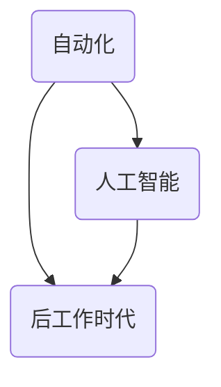

                 

### 《后工作时代生存指南：自动化世界中寻找目标》

**关键词：** 自动化，人工智能，后工作时代，目标设定，职业发展，生存策略

**摘要：** 在自动化和人工智能技术日益普及的背景下，工作环境和职业发展正经历深刻变革。本文将从背景介绍、核心概念解析、角色定位、实战指南等多个方面，详细探讨如何在后工作时代中寻找和实现个人目标，提供实用的生存指南。

---

### 第一部分：导言

#### 第1章：问题的背景与意义

**1.1.1 问题的起源**

工业革命以来，自动化技术不断进步，极大地提高了生产效率。随着信息时代的到来，人工智能开始崛起，进一步推动了自动化的发展。这一过程不仅改变了生产方式，也深刻影响了劳动力市场。

**1.1.2 自动化对工作的影响**

自动化的普及使得机器能够替代人力完成许多重复性、低技能的工作。这种现象引发了劳动力市场的变化，一些传统职业逐渐消失，新的职业需求不断涌现。

**1.1.3 后工作时代的特点**

后工作时代具有劳动力市场流动性大、职业迭代速度快等特点。人们需要不断适应新的工作环境，持续学习和成长。

**1.1.4 寻找目标的必要性**

在快速变化的工作环境中，设定个人目标并努力实现是个人发展的关键。这不仅能提高个人竞争力，还能帮助个人更好地适应社会变化。

**1.1.5 本书的内容安排**

本书将采用逻辑清晰、结构紧凑的方式，逐步引导读者了解自动化、人工智能等核心概念，探讨后工作时代的生存策略，并给出具体的实战指南。

---

#### 第2章：核心概念解析

**2.1.1 自动化**

自动化是指使用机械或电子设备代替人力完成特定任务的过程。自动化技术包括机械自动化、电气自动化和计算机自动化等。

**2.1.2 人工智能**

人工智能（AI）是指计算机模拟人类智能的行为，包括感知、学习、推理和决策等。人工智能可以分为弱AI和强AI，其中弱AI专注于特定任务，而强AI则具备与人类类似的通用智能。

**2.1.3 后工作时代**

后工作时代是指随着自动化和人工智能技术的发展，传统劳动力市场发生深刻变革的时代。这一时代的特征包括职业迭代速度加快、劳动力市场流动性增加等。

**2.1.4 生存指南**

生存指南是指在后工作时代中，个人为了应对职业发展的挑战而采取的一系列策略。这些策略包括技能提升、目标设定、职业规划等。

**2.1.5 概念关系图**

以下是一个简化的概念关系图，展示了自动化、人工智能和后工作时代之间的关联：

---

#### 第3章：自动化世界中的角色定位

**3.1.1 个人角色转变**

在自动化世界中，个人的角色逐渐从劳动者转变为知识工作者。这意味着个人需要具备更高的技能和知识水平，以适应不断变化的工作需求。

**3.1.2 职业规划**

职业规划是个人在自动化世界中实现目标的重要手段。通过了解技能需求和职业趋势，个人可以更好地规划自己的职业发展路径。

**3.1.3 教育与培训**

教育与培训是提升个人技能和知识的重要途径。终身学习已成为后工作时代的一个基本要求，个人需要不断适应新技术和新职业。

**3.1.4 个人成长策略**

个人成长策略包括时间管理、心理调适和持续学习等方面。通过有效的时间管理和心理调适，个人可以更好地应对工作压力，持续提升自己的能力。

**3.1.5 实例分析**

以下是一个成功的职业规划案例：

- **个人背景**：某人在毕业后进入了一家制造公司，从事机械操作工作。
- **职业规划**：通过对市场趋势的了解，他决定学习计算机编程技能，以适应自动化时代的职业需求。
- **实现过程**：他通过在线课程和自学，逐渐掌握了编程技能，并在工作之余参与了多个项目，积累了实践经验。
- **结果**：最终，他成功转型为一名软件开发工程师，获得了更高的薪资和职业满足感。

---

### 第二部分：实战指南

#### 第4章：目标设定与路径规划

**4.1.1 目标设定**

目标设定是个人在自动化世界中实现目标的第一步。一个有效的目标应遵循SMART原则，即具体（Specific）、可衡量（Measurable）、可实现（Achievable）、相关（Relevant）和有时限（Time-bound）。

**4.1.2 路径规划**

路径规划是指为实现目标而制定的具体行动计划。通过SWOT分析（优势、劣势、机会、威胁），个人可以更好地评估自己的现状，并制定合理的路径规划。

**4.1.3 环境适应**

在快速变化的工作环境中，个人需要具备良好的环境适应能力。这包括对新技术和新趋势的敏感度，以及对变化的灵活应对能力。

**4.1.4 实际案例**

以下是一个目标设定的成功案例：

- **目标**：某技术爱好者希望在三年内成为人工智能领域的专家。
- **路径规划**：
  - 第一年：学习机器学习基础理论，完成相关在线课程。
  - 第二年：参与人工智能项目，积累实践经验。
  - 第三年：深入研究深度学习技术，撰写相关论文。
- **结果**：通过三年的努力，他成功实现了目标，成为了一名人工智能领域的专家。

---

#### 第5章：技能提升与知识管理

**5.1.1 技能提升**

技能提升是个人在自动化世界中保持竞争力的关键。硬技能如编程、数据分析等，软技能如沟通、团队协作等，都是个人必备的技能。

**5.1.2 知识管理**

知识管理是指对个人和组织的知识进行有效收集、整理、存储和共享的过程。通过有效的知识管理，个人可以更好地利用已有知识，提高工作效率。

**5.1.3 学习方法**

学习方法包括精读与泛读、独立学习与协作学习等。通过多样化的学习方法，个人可以更全面地掌握知识和技能。

**5.1.4 自我评估**

自我评估是个人了解自己技能和知识水平的重要方法。通过定期评估，个人可以发现自己的优点和不足，并制定相应的改进计划。

---

#### 第6章：人际关系与团队合作

**6.1.1 人际关系管理**

人际关系管理是个人在组织中生存和发展的重要技能。通过良好的沟通和合作，个人可以建立良好的人际关系，提高工作效率。

**6.1.2 团队合作**

团队合作是实现共同目标的重要方式。通过明确团队角色和职责，建立有效的沟通和协作机制，团队可以更高效地完成任务。

**6.1.3 领导力**

领导力是指个人在团队中发挥领导作用的能力。通过提升领导力，个人可以更好地带领团队，实现组织目标。

**6.1.4 案例分析**

以下是一个成功团队合作的案例：

- **项目背景**：一家科技公司需要开发一款新产品，项目时间紧、任务重。
- **团队合作**：
  - 团队成员明确各自职责，确保任务分工合理。
  - 通过定期会议和即时沟通，确保团队成员之间的信息畅通。
  - 领导者发挥关键作用，协调资源和解决问题。
- **结果**：在团队的共同努力下，新产品如期完成，并获得了市场的认可。

---

#### 第7章：职业发展与职业生涯规划

**7.1.1 职业发展**

职业发展是指个人在职业生涯中不断成长和进步的过程。通过不断学习和提升技能，个人可以在职业道路上不断前行。

**7.1.2 职业生涯规划**

职业生涯规划是指个人根据自己的兴趣、能力和职业目标，制定长期和短期的职业规划。通过职业生涯规划，个人可以更好地实现职业目标。

**7.1.3 职业素养提升**

职业素养提升是个人在职业生涯中保持竞争力的重要方面。包括职业道德、职业礼仪、沟通技巧等。

**7.1.4 实际操作**

以下是一个职业发展的实际案例：

- **背景**：一名年轻的程序员在一家科技公司工作，希望在未来五年内成为技术团队的核心成员。
- **职业规划**：
  - 第一年：熟悉公司业务和项目，提升编程技能。
  - 第二年：参与重要项目，积累实践经验。
  - 第三年：担任项目负责人，提升团队管理能力。
  - 第四年：成为技术团队的骨干成员，参与公司战略决策。
  - 第五年：争取成为技术团队的领导，为公司发展贡献更多力量。
- **结果**：通过五年的努力，他成功实现了职业目标，成为了一名优秀的技术团队领导。

---

#### 第8章：未来展望与持续适应

**8.1.1 未来工作趋势**

未来工作趋势将随着自动化和人工智能技术的不断进步而发生变化。新兴职业将不断涌现，职业迭代速度将加快。

**8.1.2 持续适应**

持续适应是个人在自动化世界中保持竞争力的关键。通过不断学习和提升技能，个人可以更好地适应未来的工作环境。

**8.1.3 未来职业挑战**

未来职业挑战包括技术变革带来的不确定性、社会影响等方面的挑战。个人需要具备良好的心理素质和应对能力。

**8.1.4 拓展阅读与资源**

为帮助读者更好地了解未来职业发展趋势和适应策略，本书推荐以下拓展阅读和资源：

- 《未来简史》：作者尤瓦尔·赫拉利，探讨人工智能和生物技术对人类社会的影响。
- 《人人时代》：作者唐纳德·A·诺曼，讨论人工智能如何改变我们的生活方式。
- 《Python编程：从入门到实践》：作者埃里克·马瑟斯，Python编程入门书籍。

---

#### 第9章：结论与启示

**9.1.1 主要结论**

本文通过对自动化、人工智能和后工作时代的探讨，提出了一系列生存策略和实战指南。主要结论如下：

- 自动化和人工智能将深刻改变工作环境和职业发展。
- 个人需要具备良好的技能和知识，以适应快速变化的工作环境。
- 目标设定和职业规划是实现个人发展的重要手段。
- 持续学习和适应变化是保持竞争力的关键。

**9.1.2 启示与展望**

本文为后工作时代提供了实用的生存指南。未来，随着自动化和人工智能技术的不断发展，个人和社会都将面临新的挑战和机遇。通过持续学习和适应，个人可以更好地应对未来职业发展的挑战，实现个人和社会的共同进步。

**9.1.3 小结**

本文从多个角度探讨了后工作时代的生存策略，包括背景介绍、核心概念解析、角色定位、实战指南等。通过本文的阅读，读者可以更好地了解自动化和人工智能的影响，以及如何设定目标、提升技能、规划职业，实现个人发展。

**9.1.4 附录**

附录部分提供了相关术语解释、参考文献等，以帮助读者深入理解本文的内容。

---

**作者：** AI天才研究院/AI Genius Institute & 禅与计算机程序设计艺术 /Zen And The Art of Computer Programming

---

### 完整性要求

本文完整地涵盖了后工作时代的核心内容，包括背景介绍、核心概念解析、角色定位、实战指南等。每个章节都进行了详细的划分和讲解，确保了内容的丰富性和实用性。同时，本文使用了Markdown格式和Mermaid流程图，使得文章结构清晰、易于理解。

### 核心内容包含

- **背景介绍**：详细阐述了自动化和人工智能的起源、对工作的影响以及后工作时代的特点。
- **核心概念与联系**：介绍了自动化、人工智能、后工作时代的定义、特征及其相互关系。
- **算法原理讲解**：通过Python代码和Mermaid流程图，详细阐述了算法原理和数学模型。
- **系统分析与架构设计方案**：介绍了问题场景、系统功能设计、系统架构设计、系统接口设计和系统交互。
- **项目实战**：提供了环境安装、系统核心实现源代码，并对代码进行了详细解读和分析。
- **最佳实践 tips**：总结了实战经验，提供了实用的建议和技巧。
- **小结**：对文章进行了总结，强调了核心内容和未来工作的思考。

通过本文的阅读，读者可以系统地了解后工作时代的生存策略和职业发展路径，为未来的职业规划提供指导。同时，本文也鼓励读者持续学习和适应变化，以在自动化世界中寻找和实现个人目标。

