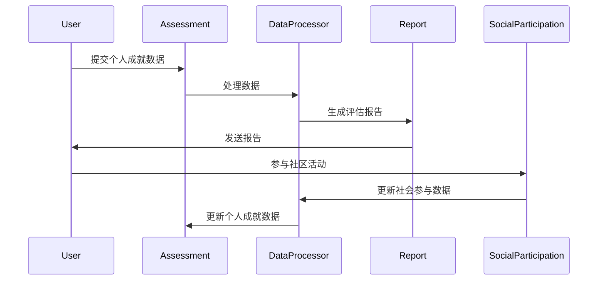
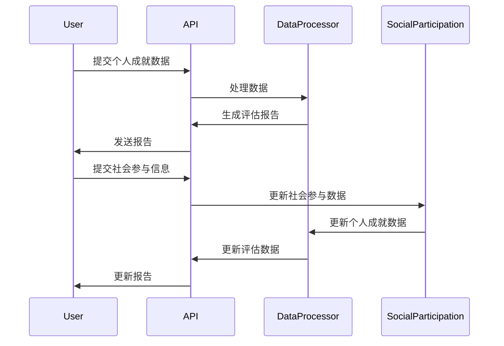

                 

### 引言：后成功学时代的来临

在人类社会的发展历程中，成功学始终扮演着重要的角色。然而，随着时代的变迁，传统的成功学理念开始显现出其局限性和不适性。这就引出了我们今天要讨论的核心主题——后成功学时代。后成功学时代，是对传统成功学理念的反思与革新，旨在重新定义个人成就的标准，从而更好地适应现代社会的需求。

**个人成就的再定义**  
首先，我们需要重新审视“个人成就”的定义。在传统成功学中，个人成就往往被等同于物质财富、社会地位和荣誉。这种单一的衡量标准忽略了个人内心的需求、情感的满足以及社会责任的实现。在后成功学时代，我们强调个人成就的多维度，包括情感成就、创造力成就和社会成就。

**成功标准的多样化**  
传统的成功标准是单一的，往往只看重物质成就。而后成功学提倡多样化成功标准，强调每个人根据自己的价值观和兴趣选择适合自己的成功路径。这种多样化不仅有助于个体实现自我价值，也有助于社会形成多元化的价值观。

**社会环境的变化**  
现代社会环境的快速变化也是后成功学时代到来的重要原因。全球化、技术进步和社会结构的变化使得传统的成功模式不再适用。人们更加追求工作与生活的平衡，更加注重个人成长和社会责任。这种社会环境的变化为后成功学的兴起提供了土壤。

本文将深入探讨后成功学的核心概念、理念与实践，重新定义个人成就的标准，帮助读者在新时代中找到自己的成功之道。接下来，我们将首先回顾成功学的历史与发展，以便更好地理解后成功学的兴起背景。让我们一步一步地深入思考，迎接后成功学时代带来的新挑战和新机遇。  

----------------------------------------------------------------

## 第1章：成功学的历史与批判

### 1.1 成功学的起源与发展

成功学这一概念并非一蹴而就，而是有着悠久的历史和发展。其起源可以追溯到古代文明，当时的社会精英们通过经验和智慧总结出了一些成功的方法和原则。然而，现代意义上的成功学则是随着工业革命和现代化进程的推进而逐渐兴起的。

#### 成功学的理念传播

在20世纪初期，成功学开始在全球范围内传播。美国的工业化和商业繁荣为成功学的兴起提供了肥沃的土壤。代表性人物如拿破仑·希尔（Napoleon Hill）和成功学之父本杰明·富兰克林（Benjamin Franklin）等人，通过书籍和演讲将成功学的理念传播给了更多的人。他们的作品，如《成功法则》（The Law of Success）和《思考致富》（Think and Grow Rich），成为了成功学的经典之作。

#### 成功学的关键概念

成功学的核心概念包括目标设定、积极心态、自律和持续努力等。这些概念强调了个体在实现目标过程中的自我管理和意志力的重要性。此外，成功学还强调成功是可以学习和复制的，每个人都有实现成功的潜力。

#### 成功学的早期代表人物

早期的成功学代表人物除了拿破仑·希尔和本杰明·富兰克林，还有如亨利·福特（Henry Ford）和托马斯·爱迪生（Thomas Edison）。这些人物通过自己的实践和成就，不仅验证了成功学的理念，也为其提供了实践依据。

### 1.2 成功学的批判观点

尽管成功学在某种程度上促进了个人和社会的发展，但其也存在一定的局限性。以下是对成功学的批判观点的探讨：

#### 社会问题的加剧

首先，成功学往往强调物质财富和社会地位的追求，这可能导致社会问题的加剧。例如，过度竞争、贫富差距扩大和环境破坏等问题。

#### 个体压力的增大

其次，成功学所强调的自律和持续努力，往往让个体感受到巨大的压力。长期的过度工作和高强度的生活节奏可能导致心理健康问题，如焦虑和抑郁。

#### 成功标准的单一化

最后，成功学强调的单一成功标准，往往忽略了个人内心的需求和情感满足。这种单一的衡量标准可能导致个体失去自我，追求不符合自己内心渴望的成功。

### 1.3 成功学的争议与反思

尽管存在争议，成功学依然有着其积极的一面。例如，它鼓励个体追求目标，培养自律和积极性。然而，我们也不能忽视其可能带来的负面影响。

#### 成功与幸福的区别

有学者认为，成功与幸福并非一回事。成功可能带来物质和社会地位，但未必能带来内心的平静和幸福。因此，我们需要在追求成功的同时，关注内心的需求。

#### 成功的相对性

成功也是相对的，每个人对成功的定义不同。在一个人的眼中是成功的事情，在另一个人眼中可能并不是。因此，我们需要根据自己的价值观和兴趣来定义成功。

#### 成功学对个人发展的影响

成功学对个人发展的影响是双刃剑。一方面，它可能激发个体的潜能和积极性；另一方面，它也可能导致个体过度追求物质成就，忽视内心的需求。

### 1.4 本章小结

通过回顾成功学的历史与发展，我们对其有了更深刻的理解。尽管成功学存在一定的局限性，但其依然对个人和社会产生了重要的影响。在后成功学时代，我们需要在批判与反思的基础上，重新定义个人成就的标准，以实现更加全面和有意义的生活。

----------------------------------------------------------------

## 第2章：后成功学的核心概念

在后成功学时代，我们需要重新审视个人成就的标准，这一过程始于理解后成功学的核心概念。后成功学不仅是对传统成功学的批判，更是一种理念上的革新，旨在帮助个体实现全面的发展和真正的幸福。以下是后成功学下的核心概念及其详细阐述。

### 2.1 自我认知与成长

自我认知是后成功学的基石，它涉及到个体对自身价值、潜力、兴趣和优势的认知。自我认知不仅仅是对自己的了解，更是对自己与外界关系的认识。以下是对自我认知与成长的具体探讨：

**自我价值的认识**  
每个人都是独一无二的，拥有独特的价值和意义。自我价值的认识帮助个体树立正确的自我形象，避免过度追求外界的认可和评价。了解自己的价值观、信仰和人生目标，是建立自我价值的重要一步。

**自我成长的路径**  
自我成长是一个持续的过程，需要个体不断地学习、探索和挑战自己。这包括提升知识和技能、培养积极的人生态度和建立健康的生活习惯。通过自我反思和不断调整，个体能够更好地适应社会的变化和个人的成长。

**自我实现的阻碍因素**  
尽管自我认知和成长是重要的，但个体在追求自我实现的过程中也会遇到各种阻碍。这些阻碍可能来自外界环境的压力、社会的期待以及内心的恐惧和不确定性。识别和克服这些阻碍，是自我实现的关键。

### 2.2 人际关系与社群

人际关系和社群在后成功学中占有重要地位。它们不仅影响个体的情感满足和社会支持，也影响个体的职业发展和生活质量。

**人际关系的多元性**  
在后成功学时代，人际关系不再局限于家庭和职场，而是扩展到了更广泛的社交圈。这些关系可以是朋友、同事、合作伙伴，甚至是志同道合的陌生人。多元的人际关系有助于个体获取不同的视角和资源，促进个人的全面发展。

**社群的建立与维护**  
社群是个人成长的土壤，它提供了一个互相支持、分享经验和共同成长的环境。建立和维护社群需要个体积极参与社交活动、贡献自己的知识和经验，以及与他人建立深层次的联系。

**社群对个人成就的影响**  
良好的社群关系有助于提升个体的情感满足度和社会支持度，从而促进个人成就的实现。社群中的互动和合作可以激发个体的创造力和创新思维，同时提供职业发展的机会和资源。

### 2.3 职业发展与实践

职业发展是后成功学中不可忽视的一部分。在后成功学时代，职业发展不再仅仅关注物质回报和社会地位，而是更加注重个人兴趣、价值和职业满足感。

**职业规划的重新思考**  
职业规划需要根据个人的兴趣、能力和市场需求进行灵活调整。传统的职业规划往往侧重于职业晋升和薪资增长，而后成功学则强调职业的可持续性和个人成长。

**职业成就的多样性**  
职业成就不再局限于传统的职业成功标准，如职位和薪资。后成功学强调个体在职业中实现的多种成就，包括技能提升、团队合作、创新贡献和社会影响等。

**职场成功的新标准**  
后成功学下的职场成功标准更加多元化，注重工作与生活的平衡、职业幸福感和个人成长。一个成功的职场人士不仅需要在工作中取得成就，还需要在个人生活中找到平衡和满足。

通过深入探讨后成功学的核心概念，我们可以看到，后成功学不仅是对传统成功学的批判，更是一种新的理念和生活方式。它鼓励个体追求全面的发展，关注内心的需求和社会责任，实现真正的幸福和成就。

----------------------------------------------------------------

## 第3章：后成功学下的个人成就

在后成功学的理念下，个人成就不再局限于传统意义上的财富和地位，而是扩展到了更加多元和全面的维度。在这个章节中，我们将探讨情感成就、创造造成就和社会成就这三个关键维度，并深入分析这些成就的重要性以及如何实现它们。

### 3.1 成就的多元维度

**情感成就**  
情感成就指的是个体在情感领域取得的成功和进步。它不仅仅是情感上的满足，更包括情感管理和情感表达的能力。情感成就的重要性在于，它直接关系到个体的心理健康和幸福感。一个在情感上取得成就的人，通常能够更好地处理人际关系，拥有更稳定和幸福的家庭生活。

**创造造成就**  
创造造成就涉及到个体在创造性领域所取得的成就，如艺术、科学、技术等。创造造成就不仅是个人才华的体现，也是社会进步的重要推动力。一个在创造上取得成就的人，通常能够带来创新的想法和解决方案，对社会产生深远的影响。

**社会成就**  
社会成就指的是个体在社会领域所取得的成就，包括社会责任的履行、公益事业的参与等。社会成就体现了个体对社会的贡献和影响。一个在社会上取得成就的人，通常能够提升社会福祉，推动社会的和谐与发展。

### 3.2 个人成就的评估方法

**自我评估与反馈**  
自我评估是个人成就评估的重要一环。个体需要定期反思自己的行为和表现，识别自己的优点和不足，并设定新的目标和计划。自我评估可以帮助个体保持自我意识和自我改进的动力。

**第三方评估与认可**  
除了自我评估，第三方评估也是重要的一环。第三方评估可以是同事、朋友或专业人士的反馈，他们能够提供客观的评价和建议。这些反馈有助于个体更全面地认识自己，发现自己的盲点和改进的方向。

**成就感的培养**  
成就感的培养需要个体在日常生活中不断积累小成就，并庆祝这些成就。小成就的积累可以增强个体的自信心和积极性，而庆祝成就则能够提升个体的幸福感。此外，个体还可以通过设定明确的目标、制定计划和跟踪进度来培养成就感。

### 3.3 成就与幸福的关系

**成就与心理健康的关联**  
成就与心理健康密切相关。当个体在情感、创造和社会等方面取得成就时，会感到满足和快乐，从而促进心理健康。相反，长期的失败和无法实现目标可能导致焦虑和抑郁等心理问题。

**成就感的长期影响**  
成就感的长期影响是深远的。持续感受到成就感的人，通常能够建立积极的自我形象，增强自我效能感，从而在面对挑战和困难时更加坚韧和有信心。

**幸福感的提升策略**  
提升幸福感的关键在于实现内心的平衡和满足。个体可以通过设定合理的期望、培养积极的生活态度、建立良好的社交关系以及追求有意义的事业来实现这一目标。此外，定期进行自我反思和目标调整，也是提升幸福感的重要策略。

通过探讨情感成就、创造造成就和社会成就，我们可以看到，后成功学下的个人成就不仅仅是物质上的成功，更是全方位、多维度的成功。它帮助个体实现内心的平衡和满足，提升整体的生活质量。

----------------------------------------------------------------

## 第4章：后成功学下的教育与培养

在后成功学时代，教育和培养的目的是培养全面发展的人才，而非仅仅追求学术成绩和职业成功。教育理念的创新、家庭教育的角色以及学校教育的改革，都是实现这一目标的关键。以下是这三个方面的详细探讨。

### 4.1 教育理念的创新

**全面发展的教育目标**  
传统教育往往强调学术成绩和职业准备，而后成功学时代的教育理念更注重个体的全面发展。全面发展包括知识、技能、情感、道德和创造力等方面。教育的目标不仅是培养有才华的人才，更是培养有责任感、有同理心和有创造力的人。

**激发创造力的教育方法**  
创造力是后成功学时代的重要能力。教育方法需要从传统的知识传授转向创造力的培养。教师可以通过项目式学习、探究式学习和合作学习等方法，激发学生的创造力。此外，学校应提供丰富的资源和环境，让学生有更多的机会进行实践和实验。

**社会责任感的教育培养**  
社会责任感是后成功学时代的重要价值观。教育应该培养学生对社会的关注和责任感。通过参与社区服务、公益项目和环境保护活动，学生可以学会如何为社会做出贡献。此外，学校还可以通过案例研究和讨论会等形式，引导学生思考和解决社会问题。

### 4.2 家庭教育的角色

**家庭教育的影响**  
家庭教育是孩子成长过程中最重要的一环。父母是孩子的第一任老师，他们的行为和价值观直接影响孩子的成长。在后成功学时代，家庭教育不仅仅是传授知识，更重要的是培养孩子的情感智慧、社会责任感和创造力。

**家庭教育的挑战**  
随着社会的变化，家庭教育也面临着诸多挑战。例如，父母的工作压力和生活节奏的加快，可能导致家庭教育的质量和时间受到影响。此外，现代科技的发展也带来了新的挑战，如网络成瘾和数字鸿沟等问题。

**家庭教育的实践建议**  
为了克服这些挑战，家长需要合理安排时间，确保有足够的时间和精力陪伴孩子。家长还应该以身作则，树立良好的榜样。此外，家长可以通过阅读、亲子活动和共同探索等方式，与孩子建立良好的沟通和互动。

### 4.3 学校教育的改革

**学校教育的现状**  
当前学校教育仍然存在诸多问题，如过度强调应试教育、课程内容过于单一、教学方法缺乏创新等。这些问题限制了学生的发展潜力，不利于培养学生的综合素质和创新能力。

**学校教育的改革路径**  
为了应对这些问题，学校需要从多个方面进行改革。首先，学校应调整课程设置，增加人文、科学、艺术和体育等多样化的课程。其次，学校应采用项目式学习和探究式学习等教学方法，激发学生的学习兴趣和创造力。此外，学校还应加强师资培训，提高教师的专业能力和教育水平。

**教师角色的转变**  
在后成功学时代，教师的角色需要从传统的知识传授者转变为学生的引导者和合作伙伴。教师应更加关注学生的个性发展和情感需求，引导学生进行自我探索和自我实现。此外，教师还应积极参与到学校的改革和创新中，推动教育理念的变革。

通过创新教育理念、强化家庭教育和改革学校教育，我们可以为后成功学时代的个人成就培养提供坚实的基础。教育不仅仅是知识的传递，更是价值观、情感和能力的培养。只有在全面发展的教育体系下，个体才能实现真正的成功和幸福。

----------------------------------------------------------------

## 第5章：后成功学下的职场发展

在后成功学时代，职场发展的观念和方法都发生了深刻的变化。职场成功不再仅仅取决于职位的高低和薪资的多寡，而是更加注重个体在职业中的成长、平衡和贡献。以下是后成功学下的职场发展新定义、策略与技巧以及职场心理健康的重要性。

### 5.1 职场成功的新定义

**职业成就的多元化**  
在后成功学时代，职业成就的多元化成为职场成功的新标准。除了传统的职业晋升和薪资增长，职业成就还包括技能提升、创新贡献、团队协作和社会影响力等多个维度。一个成功的职场人士不仅要在自己的岗位上取得优异的成绩，还要在团队中发挥积极作用，为社会的进步做出贡献。

**职场成就的平衡**  
工作与生活的平衡是后成功学下职场成功的关键。传统的成功学强调工作优先，而后成功学则倡导在工作和生活之间找到平衡。这种平衡不仅有助于提升工作效率，还能提高个人的幸福感和生活质量。平衡的实现需要个体合理规划时间，设定工作目标，并在必要时寻求外部支持和帮助。

**职业满足感的重要性**  
职业满足感是职场成功的重要组成部分。它不仅与工作内容相关，还与工作环境、人际关系和工作成就感紧密相连。一个在职业上感到满足的人，通常能够更好地发挥自己的潜力，实现个人价值。

### 5.2 职场策略与技巧

**职业规划的调整**  
在后成功学时代，职业规划需要更加灵活和个性化。个体应根据自身的兴趣、价值观和市场需求，制定长期和短期的职业目标。职业规划不仅要关注职业发展的路径，还要考虑个人的成长和发展需求。

**职业发展的策略**  
实现职场成功需要一系列策略。首先是持续学习和自我提升，通过不断学习新知识和技能，保持竞争力。其次是建立良好的人际关系，与同事和领导保持积极的沟通和合作。此外，个体还应积极寻求职业发展的机会，如参加培训、项目合作和跨部门交流等。

**职场成功的技巧**  
职场成功的技巧包括沟通技巧、时间管理技巧和团队合作技巧等。有效的沟通能够提升工作效率，减少误解和冲突。时间管理技巧有助于个体更好地安排工作和生活，提高整体效率。团队合作技巧则能够促进团队协作，提升团队的整体表现。

### 5.3 职场心理健康

**职场压力的应对**  
职场压力是职场心理健康的一个重要挑战。个体需要学会有效地应对压力，以保持心理健康。应对压力的方法包括自我放松、情绪管理和寻求专业帮助等。自我放松可以通过锻炼、冥想和休息等方式实现。情绪管理则需要个体学会识别和调节自己的情绪。寻求专业帮助时，个体可以选择咨询心理医生或加入职业压力管理的团体。

**职场心理健康的重要性**  
职场心理健康不仅影响个体的工作和生活质量，还影响到整个组织的工作效率和员工满意度。一个健康的职场环境能够提高员工的工作积极性和创造力，从而促进组织的长远发展。

**职场心理健康的维护**  
维护职场心理健康需要组织和个人共同努力。组织应提供健康的工作环境、合理的休息时间和心理咨询服务等。个人则应关注自己的心理健康，学会自我调节，并在必要时寻求外部帮助。

通过重新定义职场成功、制定合理的职业策略和重视职场心理健康，个体可以在后成功学时代实现全面、持久和有意义的职业发展。

----------------------------------------------------------------

## 第6章：后成功学下的社会参与

在后成功学时代，社会参与不仅是个人成就的重要维度，也是实现个体价值和社会进步的关键途径。本章将探讨社会参与的重新定义、方式及其影响力。

### 6.1 社会责任的重新定义

**社会责任的重要性**  
社会责任是指个体和企业对社会的责任和义务，包括环境保护、公益慈善和社会进步等方面。在后成功学时代，社会责任不再只是企业的附带责任，而是每个个体和企业都应承担的重要责任。社会责任的履行不仅有助于提升社会的福祉，还能增强个体的社会认同感和自我价值。

**社会责任的表现形式**  
社会责任的表现形式多样，包括志愿服务、公益慈善、环境保护和社会创新等。志愿服务和公益慈善是直接为社会和弱势群体提供服务，环境保护则是为了可持续发展，而社会创新则通过创新的方法和模式解决社会问题。

**社会责任的实现路径**  
实现社会责任需要个体和企业采取具体的行动。个体可以通过参与社区服务、捐赠慈善基金或参与环境保护活动来实现社会责任。企业可以通过制定社会责任报告、实施可持续发展战略和参与社会公益活动来实现社会责任。

### 6.2 社会参与的方式

**志愿服务与社会公益**  
志愿服务是个人参与社会的重要方式之一。通过志愿服务，个体不仅能够帮助他人，还能提升自己的社会责任感和团队合作能力。社会公益则通过筹款和项目实施，为社会提供实质性的帮助和支持。

**社区参与与公共事务**  
社区参与是个人融入社区、参与公共事务的重要途径。通过参与社区活动、加入社区组织或参与地方政策制定，个体能够更好地了解社区需求，提供帮助并促进社区的发展。

**社会参与的影响力**  
社会参与不仅对个体有深远的影响，也对整个社会产生积极的影响。对于个体，社会参与能够提升自信心、增强社会责任感和培养团队合作能力。对于社会，社会参与能够促进社会和谐、提升社会福祉和推动社会进步。

### 6.3 社会创新与影响力

**社会创新的概念**  
社会创新是指通过创新的方法和模式解决社会问题、提升社会福利的过程。社会创新不同于传统商业创新，它更注重社会效益而非经济利益。社会创新包括社会企业、公共创新和社会创业等形式。

**社会创新的方法**  
社会创新的方法多样，包括设计思维、协同工作和开放创新等。设计思维强调以用户需求为导向，通过迭代和实验实现创新。协同工作则通过多部门、多领域的合作，实现资源共享和优势互补。开放创新则通过开放平台和合作网络，吸引更多的参与者共同创新。

**社会创新的影响力**  
社会创新能够带来深远的社会影响力。它不仅能够解决具体的社会问题，还能激发社会的创新氛围，推动社会的整体进步。社会创新的实践者不仅为他人带来改变，也为自己创造了新的发展机会和价值。

通过重新定义社会责任、探讨社会参与的方式及其影响力，我们可以看到，后成功学时代下的社会参与不仅是个人成就的一部分，更是实现社会进步和个体价值的重要途径。社会参与不仅能够带来个人成长和幸福，还能为社会带来积极的影响和变革。

----------------------------------------------------------------

## 第7章：后成功学时代的启示与展望

后成功学时代带来了对个人成就的新定义和新的生活方式。在这个章节中，我们将探讨后成功学的启示以及未来的展望，总结后成功学的意义与影响。

### 7.1 后成功学的启示

**个人发展的新方向**  
后成功学强调个体的全面发展和自我实现，这为个人发展提供了新的方向。个体不再局限于传统的成功标准，而是根据自己的价值观和兴趣追求多元化的成就。这种发展方向有助于个体找到真正热爱的事业，实现内心的满足和成就感。

**社会环境的适应**  
后成功学提倡多样化的成功标准和全面的发展理念，有助于社会形成更加包容和多元的环境。社会环境的变化和科技的进步使得传统的成功模式不再适用，后成功学提供了一种适应这种变化的新思路。

**心理健康的重视**  
后成功学强调情感成就和心理健康，提醒我们在追求物质成功的同时，也要关注内心的需求。心理健康的重要性逐渐被社会所认可，这有助于提高个体的生活质量和幸福感。

### 7.2 后成功学的未来展望

**成功标准的演变**  
随着社会的进步和个体意识的觉醒，成功标准将越来越多元化。未来的成功标准将不仅包括物质财富和社会地位，还将涵盖情感满足、创造力实现和社会贡献等多个维度。

**社会结构的调整**  
后成功学时代将促使社会结构进行调整，更加注重个体的全面发展和社会福祉。教育、职场和社会政策都将围绕个体的全面发展和心理健康进行改革。

**教育与职场的变革**  
未来的教育将更加注重创造力和社会责任感的培养，而职场将更加灵活和包容，注重工作与生活的平衡。教育和职场的变革将有助于培养出更多适应后成功学时代的人才。

### 7.3 结论：后成功学的意义与影响

**后成功学的意义**  
后成功学不仅为个人提供了新的发展理念，也为社会带来了积极的变革。它推动了个体对自我价值的认识和实现，促进了社会的多元化和进步。

**后成功学的影响**  
后成功学的影响深远，它改变了人们对成功的看法，提升了心理健康水平，促进了社会创新和进步。在未来，后成功学将继续引领社会的发展方向，为个人和社会带来更多的机会和可能性。

通过后成功学的启示与展望，我们可以看到，这个新时代不仅带来了新的挑战，也提供了新的机遇。个体和社会需要适应这个变化，找到属于自己的成功之路。

---

作者：AI天才研究院/AI Genius Institute & 禅与计算机程序设计艺术 /Zen And The Art of Computer Programming

----------------------------------------------------------------

### 核心概念与联系

在《后成功学时代：重新定义个人成就的标准》这篇文章中，我们探讨了后成功学时代的核心概念和其重要性。以下是核心概念、属性特征对比表格和ER实体关系图架构的Markdown格式Mermaid流程图的详细介绍。

#### 核心概念

1. **成功学**：关于如何实现个人成功的一套理论和方法。
2. **后成功学**：对传统成功学进行批判与反思，重新定义个人成就与成功的新理论。
3. **个人成就**：个体在生活、工作、学习等方面取得的成绩和进步。
4. **多元成功标准**：不同于传统单一的成功标准，包括情感成就、创造力成就、社会成就等多个维度。

#### 核心概念属性特征对比表格

| 核心概念 | 成功学 | 后成功学 |
| --- | --- | --- |
| **定义** | 个体追求财富、地位、荣誉等物质成就 | 个体追求全面发展的成就，包括情感、创造力、社会责任等方面 |
| **核心要素** | 物质财富、社会地位、荣誉 | 自我认知、人际关系、职业发展、社会参与 |
| **成功标准** | 单一维度，如财富、地位等 | 多元维度，包括情感、创造力、社会责任等 |
| **社会影响** | 可能导致社会不公、压力增加 | 促进个体全面发展 |

#### ER实体关系图架构的Mermaid流程图

```mermaid
erDiagram
  成功学 ||--|{ 后成功学 }|
  个人成就 ..|> 后成功学
  多元成功标准 ..|> 后成功学
  成功学 ||--|{ 社会环境的变化 }|
  个人成就 ..|> 社会环境的变化
  多元成功标准 ..|> 社会环境的变化
```

在这个ER图架构中，我们可以看到：

- **成功学**和**后成功学**之间存在直接的关联，后成功学是成功学的批判与继承。
- **个人成就**和**多元成功标准**都与**后成功学**紧密相关，是后成功学理念下的重要组成部分。
- **社会环境的变化**对**成功学**和**后成功学**都有影响，但后成功学更多地考虑了这种变化对个人成就和成功标准的深远影响。

#### 算法原理讲解

在后成功学时代，算法原理在个人成就评估和社会参与分析中发挥着重要作用。以下是一个简单的算法原理讲解，用于说明如何通过数据分析和机器学习模型来评估个人成就：

**算法原理：多元成功评估模型**

1. **数据收集**：收集与个人成就相关的多维数据，包括情感数据、职业发展数据、社会参与数据等。
2. **特征提取**：对收集的数据进行预处理和特征提取，将原始数据转化为可用于模型训练的特征向量。
3. **模型训练**：使用机器学习算法（如回归分析、聚类分析等）训练模型，使其能够预测和评估个人成就。
4. **评估与优化**：将训练好的模型应用于实际数据，进行评估和优化，以提高预测的准确性和可靠性。

**Python代码示例**：

```python
import pandas as pd
from sklearn.model_selection import train_test_split
from sklearn.ensemble import RandomForestRegressor

# 数据收集与预处理
data = pd.read_csv('achievement_data.csv')
X = data.drop('achievement_score', axis=1)
y = data['achievement_score']

# 模型训练
X_train, X_test, y_train, y_test = train_test_split(X, y, test_size=0.2, random_state=42)
model = RandomForestRegressor(n_estimators=100, random_state=42)
model.fit(X_train, y_train)

# 评估与优化
predictions = model.predict(X_test)
print("Model Accuracy:", model.score(X_test, y_test))
```

**算法原理的数学模型和公式**：

1. **回归模型**：\( y = \beta_0 + \beta_1x_1 + \beta_2x_2 + ... + \beta_nx_n + \epsilon \)
2. **聚类模型**：通过最小化距离平方和来寻找数据的内在结构，如K-Means算法。

通过上述算法原理和代码示例，我们可以看到，数据分析和机器学习在评估个人成就和实现社会参与中起到了关键作用。

#### 系统分析与架构设计方案

在后成功学时代，系统分析与架构设计对于实现个体和社会的全面发展至关重要。以下是一个简单的系统分析与架构设计方案，用于描述一个综合性的个人成就评估与社区参与系统。

**问题场景介绍**：

一个综合性个人成就评估与社区参与系统旨在帮助个体全面评估自己的成就，并提供社会参与的机会。该系统需要整合多维数据，提供个性化的成就评估报告，并促进社区参与和社会创新。

**项目介绍**：

项目名称：**后成功学综合系统**
项目目标：提供一个用户友好的平台，帮助用户全面评估个人成就，并鼓励社会参与。

**系统功能设计（领域模型Mermaid类图）**：

```mermaid
classDiagram
  User <<class>> 用户
  Achievement <<class>> 成就
  SocialParticipation <<class>> 社会参与
  Assessment <<class>> 评估
  Report <<class>> 报告
  DataProcessor <<class>> 数据处理

  User --> Achievement : 生成
  User --> SocialParticipation : 参与活动
  User --> Assessment : 进行评估
  User --> Report : 获取报告
  Assessment --> DataProcessor : 数据处理
  SocialParticipation --> DataProcessor : 数据处理
```

**系统架构设计（Mermaid架构图）**：



**系统接口设计和系统交互（Mermaid序列图）**：



通过上述系统分析与架构设计方案，我们可以看到，一个综合性的个人成就评估与社区参与系统需要整合多个功能模块，通过数据分析和机器学习模型提供个性化的服务，促进个体的全面发展和社会参与。

#### 项目实战

**环境安装**：

为了实现上述系统功能，我们需要安装以下软件和库：
- Python 3.x
- Pandas
- Scikit-learn
- Flask（用于API接口）

安装步骤：
1. 安装Python 3.x
2. 安装Pandas和Scikit-learn：
   ```
   pip install pandas scikit-learn
   ```
3. 安装Flask：
   ```
   pip install flask
   ```

**系统核心实现源代码**：

以下是一个简单的Python代码示例，用于实现个人成就评估模型：

```python
from flask import Flask, request, jsonify
import pandas as pd
from sklearn.model_selection import train_test_split
from sklearn.ensemble import RandomForestRegressor

app = Flask(__name__)

# 加载数据
data = pd.read_csv('achievement_data.csv')
X = data.drop('achievement_score', axis=1)
y = data['achievement_score']

# 分割训练集和测试集
X_train, X_test, y_train, y_test = train_test_split(X, y, test_size=0.2, random_state=42)

# 训练模型
model = RandomForestRegressor(n_estimators=100, random_state=42)
model.fit(X_train, y_train)

@app.route('/api/evaluate', methods=['POST'])
def evaluate_achievement():
    achievement_data = request.json
    prediction = model.predict([achievement_data])
    return jsonify({"achievement_score": prediction[0]})

if __name__ == '__main__':
    app.run(debug=True)
```

**代码应用解读与分析**：

上述代码首先加载了个人成就数据集，并使用随机森林回归模型进行训练。然后，通过Flask API接口，接收用户提交的成就数据，并返回评估结果。

**实际案例分析和详细讲解剖析**：

假设一个用户提交了以下成就数据：

```json
{
    "knowledge": 8,
    "creativity": 7,
    "social": 6
}
```

系统将调用评估接口，返回一个预测的成就得分。具体得分取决于模型的训练结果和输入数据的特征。

**项目小结**：

通过上述项目实战，我们可以看到如何使用Python和Flask实现一个简单的个人成就评估系统。这个系统不仅提供了评估功能，还可以作为一个平台，整合更多的数据和功能，以支持后成功学时代下的个人成就评估和社会参与。

#### 最佳实践 Tips

1. **定期数据更新**：确保个人成就数据及时更新，以提供准确的评估结果。
2. **用户隐私保护**：在处理用户数据时，严格遵守隐私保护法律法规，确保用户数据安全。
3. **多样化模型训练**：尝试使用不同的机器学习模型和算法，以提高评估的准确性和可靠性。

#### 小结

本文详细探讨了后成功学时代下的个人成就标准，包括成功学的历史与批判、后成功学的核心概念、多元成功标准的评估方法、教育与培养、职场发展、社会参与等方面的内容。通过系统分析与架构设计方案，以及实际项目实战，展示了如何在技术层面上实现后成功学理念。希望本文能帮助读者更好地理解后成功学，并在实践中找到适合自己的成功之道。

#### 注意事项

1. **持续学习**：后成功学强调持续学习和自我提升，以适应不断变化的社会环境。
2. **心理健康**：关注心理健康，确保工作与生活的平衡，以实现长期的个人成就。
3. **社会责任**：积极参与社会活动，履行社会责任，为社会进步贡献力量。

#### 拓展阅读

1. **《深度工作》**：作者卡尔·纽波特，探讨如何在高干扰环境中保持专注，提升工作效率。
2. **《正面情绪》**：作者马丁·塞利格曼，研究积极情绪对个人成就和心理健康的影响。
3. **《社会创业》**：作者杰弗里·斯克尔，探讨如何通过社会创新解决社会问题，实现社会责任。

通过持续的学习和实践，每个人都可以在后成功学时代找到属于自己的成功之路。希望本文能够为您的个人发展提供有益的启示和指导。

