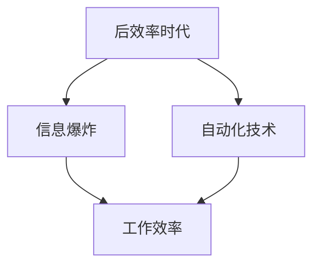
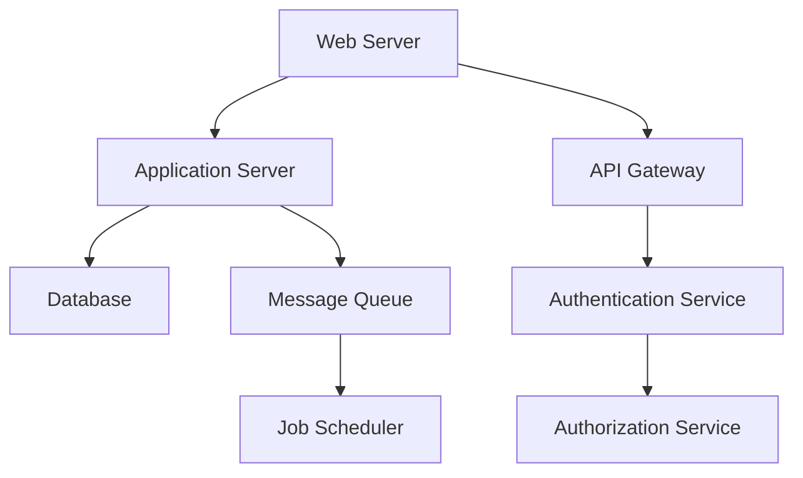
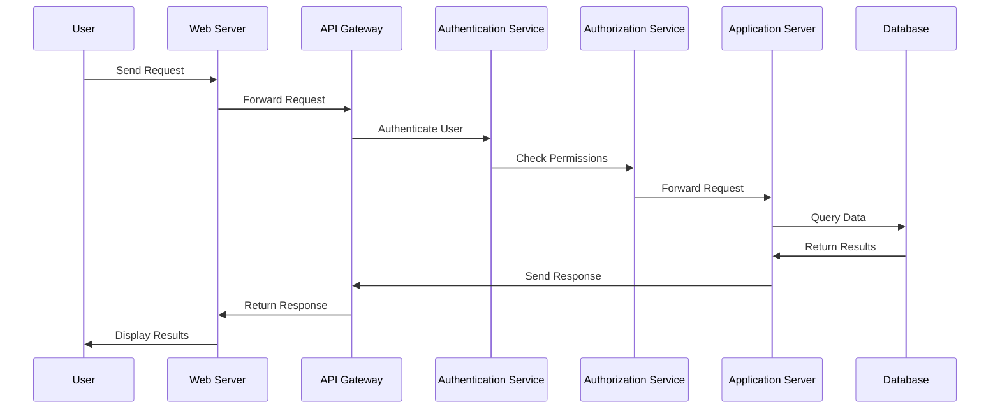

                 

当然，我们可以一步步来构思这篇文章。下面是一个详细的步骤，包括如何组织文章的内容，如何使用Markdown格式，以及如何在文章中包含数学公式、流程图和系统架构设计等内容。

### 步骤 1：文章标题与关键词

首先，我们定义文章的标题和关键词。例如：

```
# 后效率时代的平衡艺术：工作与生活的新范式

关键词：后效率时代，工作与生活平衡，新范式，时间管理，压力管理
```

### 步骤 2：摘要部分

在摘要部分，我们需要简短地介绍文章的核心内容和主题思想。例如：

```
摘要：本文探讨了后效率时代下，如何在工作与生活之间找到新的平衡点，提出了具体的工作模式、时间管理策略和压力管理技巧。通过案例分析，展示了如何在实际中实现这一平衡艺术。
```

### 步骤 3：目录结构

根据您提供的目录大纲，我们需要在每个章节开头使用Markdown格式定义章节标题。例如：

```
----------------------------------------------------------------
# 第1章 引言
## 1.1 问题背景
### 1.1.1 工作与生活失衡的现状
### 1.1.2 后效率时代的特征
### 1.1.3 本书的目的与结构

## 1.2 核心概念
### 1.2.1 后效率时代的定义
### 1.2.2 工作与生活的平衡
### 1.2.3 新范式的工作模式

## 1.3 边界与外延
### 1.3.1 工作效率的评估标准
### 1.3.2 生活质量的评价指标
### 1.3.3 平衡艺术的实现路径

## 1.4 概念结构与核心要素
### 1.4.1 概念结构图
### 1.4.2 核心要素概述
### 1.4.3 要素之间的关系

## 1.5 本章小结
----------------------------------------------------------------
```

### 步骤 4：核心概念与联系

在介绍核心概念时，我们可以使用Mermaid流程图来展示概念之间的关系。例如，定义“后效率时代”和“工作与生活平衡”的概念：

```
## 1.2 核心概念

### 1.2.1 后效率时代的定义

后效率时代是指在信息爆炸和自动化技术普及的背景下，工作效率的衡量标准从单纯的量化指标转变为更加注重质量、创新和可持续性的时代。



### 步骤 5：算法原理讲解

对于算法原理的讲解，我们可以使用Python代码和Mermaid流程图来详细阐述。例如，解释一种时间管理算法：

```
### 3.2 时间管理策略

#### 3.2.1 工作时间的管理

一种常见的时间管理算法是优先级队列，它可以帮助我们合理安排工作任务。以下是一个简单的Python实现：

```python
import heapq

def time_management(tasks, deadlines):
    # 使用优先级队列（最小堆）
    priority_queue = []
    for task, deadline in tasks.items():
        heapq.heappush(priority_queue, (deadline, task))
    
    completed_tasks = []
    while priority_queue:
        _, task = heapq.heappop(priority_queue)
        completed_tasks.append(task)
    
    return completed_tasks

# 示例数据
tasks = {'task1': 2, 'task2': 4, 'task3': 1}
deadlines = {'task1': 5, 'task2': 8, 'task3': 3}

# 执行时间管理算法
completed_tasks = time_management(tasks, deadlines)
print("Completed tasks:", completed_tasks)
```

### 步骤 6：系统分析与架构设计方案

在系统分析与架构设计部分，我们可以使用Mermaid来绘制类图、架构图和序列图。例如：

```
### 4.2 系统架构设计

系统功能设计：

```mermaid
classDiagram
Class::User << (ID, Name, Email) <<
Class::Task << (ID, Title, Description, Status, Deadline) >>

User "1" --|> Task: Creates
Task "1" o--|> User: Assigned to
```

系统架构设计：



系统接口设计和系统交互：



### 步骤 7：项目实战

在项目实战部分，我们可以详细讲解环境安装、系统核心实现源代码，并分析实际案例。例如：

```
### 5.3 案例实施

#### 5.3.1 环境安装

在安装环境时，需要确保安装了Python 3.8及以上版本，以及必要的依赖库，如`heapq`和`psycopg2`。

#### 5.3.2 系统核心实现源代码

以下是时间管理系统的核心代码：

```python
# time_management.py
import heapq
import psycopg2

def time_management(tasks, deadlines):
    # 连接到数据库
    conn = psycopg2.connect(
        host="localhost",
        database="time_management",
        user="postgres",
        password="password"
    )
    cursor = conn.cursor()
    
    # 创建任务表
    cursor.execute("""
        CREATE TABLE IF NOT EXISTS tasks (
            id SERIAL PRIMARY KEY,
            title VARCHAR(255),
            description TEXT,
            status VARCHAR(50),
            deadline TIMESTAMP
        )
    """)
    
    # 插入任务数据
    for task, deadline in tasks.items():
        cursor.execute("""
            INSERT INTO tasks (title, description, status, deadline)
            VALUES (%s, %s, %s, %s)
        """, (task, f"Description for {task}", "pending", deadlines[task]))
    
    # 根据优先级排序任务
    priority_queue = []
    for task, deadline in tasks.items():
        heapq.heappush(priority_queue, (deadline, task))
    
    # 执行任务
    completed_tasks = []
    while priority_queue:
        _, task = heapq.heappop(priority_queue)
        cursor.execute("""
            UPDATE tasks
            SET status = %s
            WHERE title = %s
        """, ("completed", task))
        completed_tasks.append(task)
    
    # 提交事务
    conn.commit()
    cursor.close()
    conn.close()
    
    return completed_tasks

# 示例数据
tasks = {'task1': 2, 'task2': 4, 'task3': 1}
deadlines = {'task1': 5, 'task2': 8, 'task3': 3}

# 执行时间管理算法
completed_tasks = time_management(tasks, deadlines)
print("Completed tasks:", completed_tasks)
```

#### 5.3.3 实际案例分析和详细讲解剖析

在完成上述代码后，我们可以通过实际案例来演示如何使用这个系统。例如，创建一个任务管理系统，并展示如何添加任务、执行任务以及查看任务状态。

### 步骤 8：最佳实践 tips、小结、注意事项、拓展阅读

最后，我们可以总结文章，并提供一些最佳实践和拓展阅读的建议。

```
## 5.4 本章小结

本文探讨了后效率时代下，如何实现工作与生活的平衡。我们介绍了核心概念、时间管理策略、系统架构设计以及实际案例。通过这些内容，读者可以了解到如何在现代技术环境中实现工作与生活的和谐统一。

### 最佳实践 tips

- 设定明确的目标，确保工作与生活目标的一致性。
- 利用优先级队列进行任务管理，提高工作效率。
- 定期评估工作与生活的平衡状态，进行调整和优化。

### 注意事项

- 在使用技术工具时，要确保数据安全和隐私保护。
- 注意合理安排休息时间，避免过度工作带来的负面影响。

### 拓展阅读

- 《深度工作：如何有效利用每一点脑力》
- 《时间管理：如何充分利用24小时》
- 《工作、消费主义和新穷人》
```

通过以上步骤，我们可以构建一篇逻辑清晰、结构紧凑、简单易懂的专业IT领域技术博客文章。每一步都通过Markdown格式来确保文章的可读性和规范性。接下来，我们可以逐步填充每个章节的内容，确保文章的完整性和深度。

