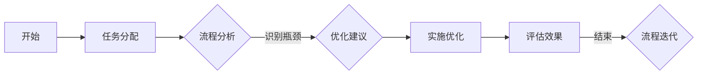
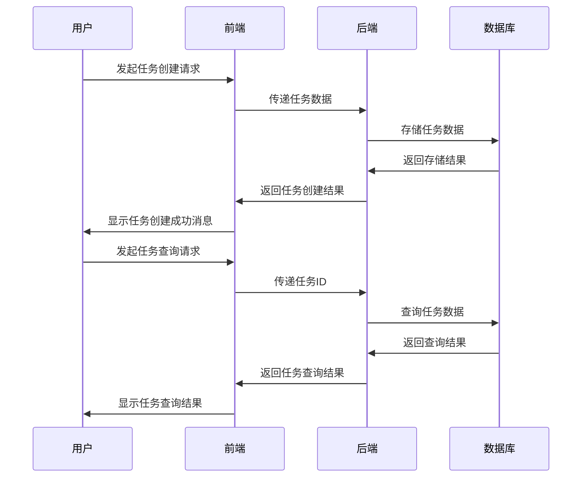
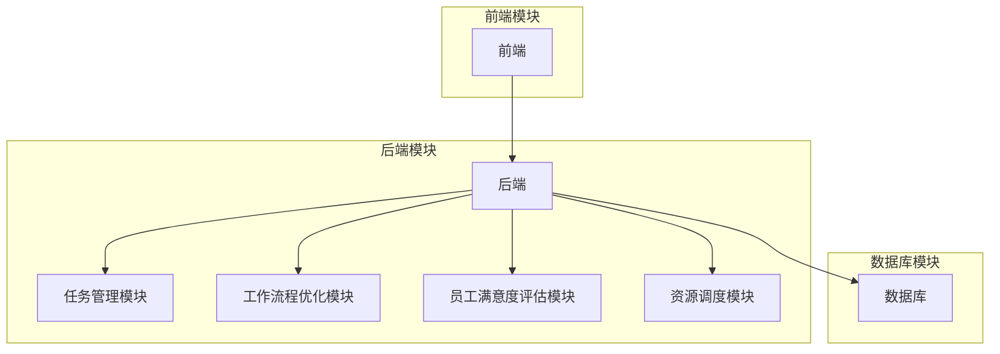

                 

 

## 第一部分: 背景介绍

### 1.1 问题背景

在快速变化的社会环境中，传统的工作节奏已不再适应现代职场需求。随着技术的进步，信息的获取和传递变得更加便捷，人们的工作方式也在发生着深刻的变化。传统的快节奏工作模式，往往伴随着高压力和长时间的工作，这导致员工的身心健康受到严重影响，同时也影响了企业的长期发展。在这样的背景下，后效率时代的慢工作运动（Slow Work Movement）应运而生。

慢工作运动的核心目标是重新定义职场节奏，通过减少工作压力、提高工作效率，实现个人的全面发展和社会的可持续发展。这种运动不仅仅是简单地放慢工作速度，而是强调在工作过程中保持专注、减少干扰，通过深入思考和细致的工作方式来提高工作效率。慢工作运动提倡的工作方式，不仅有助于提高员工的工作满意度，还能够提升企业的整体生产力和竞争力。

### 1.2 问题描述

现代社会中，职场压力不断增加，工作与生活的平衡逐渐失调。许多职场人士面临着长时间的工作、频繁的工作任务切换、不断增多的工作负荷等问题。这些问题不仅对员工的身心健康造成了负面影响，也影响了企业的运作效率。具体来说，以下是一些典型的职场问题：

- **长时间工作**：许多员工由于工作任务的积压，不得不延长工作时间，导致工作和生活时间界限模糊，身心健康受损。
- **工作负荷过大**：随着企业竞争的加剧，员工常常需要承担更多的工作任务，导致工作负荷过大，无法得到充分的休息和恢复。
- **任务切换频繁**：现代职场中，员工需要频繁地在不同的工作任务之间切换，这增加了工作压力和效率损失。
- **工作与生活的失衡**：工作和生活之间的平衡难以维持，导致员工的幸福感下降，影响家庭生活和个人发展。

这些问题不仅对员工个人的生活质量造成了负面影响，也对企业的长期发展构成了威胁。高压力的工作环境容易导致员工的流失、工作效率下降，甚至影响企业的创新能力和竞争力。

### 1.3 问题解决

为了解决上述问题，后效率时代的慢工作运动提出了以下几种解决方案：

- **调整工作节奏**：通过减少工作时间、优化工作流程，降低工作压力，让员工有更多的时间去休息和充电。例如，可以实行弹性工作制、缩短工作时间、提供带薪休假等。
- **优化工作内容**：减少不必要的任务，专注于高价值的工作。通过工作流程的优化，消除冗余步骤，提高工作效率。例如，可以采用自动化工具、优化任务分配等。
- **提升员工技能**：通过培训和职业发展计划，提升员工的技能和知识水平，使其能够更高效地完成工作任务。例如，提供职业培训、技能提升课程等。
- **改善工作环境**：创造一个舒适、健康的工作环境，减少工作干扰，提高员工的工作满意度。例如，改善办公条件、提供灵活的工作空间、优化工作流程等。
- **促进工作与生活的平衡**：通过提供家庭友好政策、鼓励员工参与社区活动等方式，帮助员工实现工作与生活的平衡。例如，提供远程工作选项、鼓励员工参与体育活动等。

### 1.4 边界与外延

慢工作运动不仅涉及个人层面，还涉及组织、文化和政策层面。其边界和范围包括以下几个方面：

- **工作时间的调整**：包括弹性工作时间和远程工作。这些措施可以帮助员工更好地平衡工作和生活，减少因工作压力导致的身心健康问题。
- **工作内容的优化**：通过减少不必要的任务、简化工作流程，提高工作效率，让员工能够专注于更有价值的工作。这不仅可以提高个人满意度，也有助于企业的长期发展。
- **工作环境的改善**：提供更加舒适、健康的工作环境，减少工作干扰，提高员工的工作效率。这可以通过改善办公条件、提供灵活的工作空间、优化工作流程等实现。
- **社会倡议**：通过政策倡导、企业文化建设、公众教育等方式，推动慢工作运动在社会层面的普及。这包括政府政策的支持、企业内部的工作文化变革、公众对慢工作理念的认知和接受等。

### 1.5 概念结构与核心要素组成

慢工作运动的核心概念包括以下几个要素：

- **慢工作**：指在工作过程中，采取更加缓慢、深思熟虑的方式，以提高工作效率和质量。慢工作强调的是工作过程的品质，而不是单纯的速度。
- **快工作**：与慢工作相对，指追求快速完成任务，可能牺牲工作质量和个人健康。快工作通常伴随着高压力和高效率，但长期来看可能对个人和组织的健康产生负面影响。
- **工作与生活的平衡**：强调在工作和生活之间找到合适的平衡点，以实现个人的全面发展。这包括家庭生活、个人兴趣、身心健康等方面。
- **社会倡议**：指通过社会力量推动慢工作运动的发展，包括政策倡导、企业文化建设、公众教育等。社会倡议的目的是让更多人了解和接受慢工作理念，从而推动整个社会工作环境的改善。

通过上述要素的相互作用，慢工作运动旨在重新定义职场节奏，实现个人与组织的共同发展。这种理念不仅关注短期的工作效率，更注重长期的健康和可持续发展。

## 第二部分: 核心概念与联系

### 2.1 慢工作运动的基本原理

慢工作运动倡导的核心原则包括以下几个方面：

1. **以人为中心**：慢工作运动强调，工作应以人的身心健康为中心，而不是单纯追求工作效率和产出。这意味着在工作中要关注员工的身心健康，提供合理的工作负荷，确保员工有足够的时间进行休息和恢复。

2. **质量优先**：慢工作运动认为，工作质量比工作速度更为重要。通过深入思考和细致的工作方式，可以提高工作效率和工作成果的质量。质量优先的原则有助于避免因为追求速度而牺牲工作质量的情况发生。

3. **可持续性**：慢工作运动强调长期可持续发展，而不是短期利益。这意味着在工作中要考虑到长远的影响，避免过度消耗资源、损害环境等行为。可持续性原则有助于确保企业的长期健康发展。

4. **文化认同**：慢工作运动倡导的企业和组织文化应与慢工作理念相契合。这包括领导层的支持、员工的积极参与以及企业内部文化的建设。文化认同原则有助于将慢工作理念根植于企业的日常运营中。

### 2.2 核心概念属性特征对比

为了更清晰地理解慢工作运动与快工作文化之间的差异，我们可以通过以下表格来对比两者在几个关键方面的属性特征：

| 特征 | 慢工作 | 快工作 |
|------|--------|--------|
| 工作节奏 | 缓慢、深思熟虑 | 快速、高效 |
| 工作质量 | 优先 | 有时牺牲 |
| 个人健康 | 关注 | 常被忽视 |
| 工作与生活平衡 | 高度重视 | 常被忽视 |
| 企业文化 | 支持慢工作理念 | 追求速度和效率 |

#### 工作节奏

慢工作强调的是缓慢、深思熟虑的工作节奏。这种方式要求员工在工作过程中保持专注，减少干扰，避免频繁的任务切换，从而提高工作效率。相反，快工作追求快速完成工作任务，往往导致员工在高压力下工作，容易出现工作质量下降和身心健康受损的情况。

#### 工作质量

在慢工作运动中，工作质量被视为首要目标。通过深入思考和细致的工作方式，可以确保工作成果的高质量和可靠性。而快工作文化则常常因为追求速度而牺牲工作质量，导致工作成果的不稳定和风险增加。

#### 个人健康

慢工作运动强调关注员工的身心健康，认为这是提高工作效率和员工满意度的关键。快工作文化则往往忽视了员工的个人健康，导致员工在高压力下工作，容易出现身心健康问题。

#### 工作与生活平衡

慢工作运动高度重视工作与生活的平衡，认为这是实现个人全面发展的重要保障。而快工作文化则常常将工作置于生活的优先位置，导致员工的个人生活受到忽视，影响员工的整体幸福感和生活质量。

#### 企业文化

慢工作运动倡导的企业文化应支持慢工作理念，这包括领导层的支持、员工的积极参与以及企业内部文化的建设。相反，快工作文化往往追求速度和效率，忽视员工的工作与生活平衡，可能导致企业文化的不健康。

### 2.3 ER实体关系图

为了更直观地展示慢工作运动中的核心概念及其关系，我们可以使用ER实体关系图来描述。以下是慢工作运动中几个关键实体的ER图：

```mermaid
erDiagram
  Employee ||--|{ Task } : assigned
  Employee ||--|{ Project } : works_on
  Company ||--|{ Employee } : hires
  Company ||--|{ Project } : manages
```

在这个ER图中，`Employee` 是核心实体，表示公司中的员工。`Task` 表示员工被分配的任务，`Project` 表示员工参与的项目，而 `Company` 表示雇佣和管理员工的企业。这个图展示了员工、任务、项目和公司之间的关系，反映了慢工作运动中的关键组成部分。

通过这个ER图，我们可以更清晰地理解慢工作运动中的各个实体及其相互关系，有助于进一步分析和探讨慢工作运动的实施和影响。

## 第三部分: 算法原理讲解

### 3.1 算法概述

慢工作运动的实现依赖于一系列算法和技术的支持，这些算法和技术旨在优化工作流程、提升工作效率、促进员工满意度。以下是几个关键的算法原理：

- **工作流程优化算法**：通过分析工作流程中的瓶颈和冗余，提出优化方案，减少不必要的步骤，提高工作效率。
- **员工满意度评估算法**：利用数据分析技术，评估员工的工作满意度，识别改进机会。
- **工作负荷平衡算法**：根据员工的工作能力和任务需求，合理分配工作负荷，确保员工的工作压力在可承受范围内。

### 3.2 Mermaid流程图

以下是一个工作流程优化算法的Mermaid流程图，展示了从任务分配到流程优化的整个过程：



在这个流程图中，从任务分配开始，通过流程分析识别出工作中的瓶颈和冗余，然后提出优化建议。这些优化建议被实施后，还需要对效果进行评估，以确定优化方案的有效性。如果优化效果不佳，则需要进一步迭代优化流程。

### 3.3 Python源代码

为了更好地理解工作流程优化算法的实现，以下是一个简化的Python代码示例，展示了如何分析工作流程中的瓶颈：

```python
import pandas as pd

# 假设我们有一个任务分配和工作时间记录的DataFrame
data = {
    'Employee': ['Alice', 'Bob', 'Charlie'],
    'Task': ['A', 'B', 'C'],
    'Duration': [2, 3, 5]
}

df = pd.DataFrame(data)

# 计算每个任务的平均完成时间
average_duration = df.groupby('Task')['Duration'].mean()

# 找出耗时最长的任务
最长任务 = average_duration.idxmax()

print(f"耗时最长的任务是：{最长任务}")

# 根据耗时最长的任务，提出优化建议
if 最长任务 == 'A':
    print("优化建议：增加资源，提高任务A的处理速度。")
elif 最长任务 == 'B':
    print("优化建议：调整任务分配，减少任务B的工作量。")
elif 最长任务 == 'C':
    print("优化建议：重新评估任务C的优先级。")
```

在这个示例中，我们首先创建了一个包含任务名称和耗时的DataFrame。然后，我们计算了每个任务的平均完成时间，并找出了耗时最长的任务。最后，根据耗时最长的任务，提出了相应的优化建议。

### 3.4 数学模型和公式

为了更深入地理解工作流程优化算法，我们可以引入一些数学模型和公式。以下是一个简化的模型，用于分析任务完成时间：

$$
T_c = \sum_{i=1}^{n} (T_i \cdot P_i)
$$

其中，$T_c$ 是总完成时间，$T_i$ 是第 $i$ 个任务的耗时，$P_i$ 是第 $i$ 个任务的发生概率。

通过这个模型，我们可以计算出总完成时间，并根据总完成时间来优化任务分配和工作流程。例如，如果发现某个任务耗时较长，并且其发生概率较高，那么我们可以考虑增加资源或调整任务优先级来优化整个工作流程。

### 3.5 举例说明

为了更好地理解上述算法原理和公式，我们可以通过一个具体的例子来说明。

假设我们有一个简单的任务分配情况，包括三个任务：任务A、任务B和任务C。这三个任务的耗时分别为2小时、3小时和5小时，它们的发生概率分别为0.3、0.5和0.2。

根据上述数学模型，我们可以计算出总完成时间：

$$
T_c = (2 \cdot 0.3) + (3 \cdot 0.5) + (5 \cdot 0.2) = 0.6 + 1.5 + 1 = 3.1 \text{小时}
$$

这意味着，如果按照当前的分配和流程，完成所有任务需要大约3.1小时。

为了优化这个流程，我们可以考虑以下几种方案：

1. **增加资源**：如果任务A和任务B的耗时较长，我们可以考虑增加资源，比如增加人员或设备，以缩短这些任务的完成时间。
2. **调整任务优先级**：如果任务C的发生概率较低，我们可以考虑将其优先级降低，以确保关键任务的优先处理。
3. **任务分解**：如果某个任务的耗时过长，我们可以将其分解为多个子任务，这样每个子任务都可以分配给不同的员工，从而提高整体的工作效率。

通过这些优化方案，我们可以进一步降低总完成时间，提高工作效率。

### 3.6 算法应用与扩展

上述算法和工作流程优化方法不仅适用于简单的任务分配场景，还可以扩展到更复杂的工作环境中。例如，在企业项目管理中，我们可以利用类似的方法来优化项目进度和资源分配。通过引入更多的变量和约束条件，我们可以构建更精确的数学模型，以实现更高效的工作流程。

此外，随着人工智能和数据科学技术的发展，我们可以进一步利用机器学习和数据挖掘技术来优化工作流程。例如，通过分析历史数据，我们可以预测任务完成时间，从而提前采取优化措施。这些技术的应用，将为慢工作运动提供更强大的支持和保障。

通过上述算法原理和应用，我们可以看到，慢工作运动不仅仅是放慢工作节奏，更是一种通过科学管理和技术优化来提高工作效率和员工满意度的系统方法。这种理念的实施，将为现代职场带来深刻的变革和积极的影响。

## 第四部分: 系统设计与架构方案

### 4.1 问题场景

在现代职场中，工作流程的优化和员工满意度的提升是一个普遍关注的问题。特别是在大型企业中，复杂的工作任务和繁多的项目往往导致工作效率低下和员工压力增大。为了解决这一问题，我们设计了一套慢工作系统，旨在通过优化工作流程、提升工作质量和促进员工满意度来实现职场节奏的调整。

### 4.2 系统功能设计

慢工作系统的主要功能包括以下几个方面：

- **任务管理**：系统提供任务分配、任务状态跟踪和任务优先级调整等功能，确保任务能够高效、有序地完成。
- **工作流程优化**：系统通过分析工作流程中的瓶颈和冗余步骤，提出优化建议，帮助管理者调整工作流程，提高工作效率。
- **员工满意度评估**：系统利用数据分析技术，评估员工的工作满意度，提供改进建议，帮助管理者优化员工的工作环境和心理状态。
- **资源调度**：系统根据任务需求和员工的工作能力，合理分配资源，确保资源的最优利用。

### 4.3 系统架构设计

慢工作系统的架构设计采用模块化思想，分为前端、后端和数据库三个主要部分。

- **前端**：前端部分主要负责与用户交互，提供任务管理、工作流程优化和员工满意度评估等功能的可视化界面。前端使用React框架，确保界面响应速度快、用户体验良好。
- **后端**：后端部分负责业务逻辑的处理和数据的管理。后端采用Spring Boot框架，提供RESTful API接口，方便前后端的数据交互。后端还包括任务调度模块、流程分析模块和数据分析模块等。
- **数据库**：数据库部分负责存储任务数据、员工数据和系统配置数据等。数据库采用MySQL，确保数据的高效存储和查询。

### 4.4 系统接口设计

为了实现系统功能的高效协作，我们设计了以下主要接口：

- **任务管理接口**：包括任务创建、任务更新、任务查询和任务删除等操作。
- **工作流程优化接口**：包括流程分析、瓶颈识别和优化建议生成等操作。
- **员工满意度评估接口**：包括满意度调查、数据分析和改进建议生成等操作。
- **资源调度接口**：包括资源分配、资源状态查询和资源调整等操作。

### 4.5 系统交互序列图

以下是一个简化的系统交互序列图，展示了用户通过前端界面与后端服务进行交互的过程：



在这个序列图中，用户通过前端界面发起任务创建请求，前端将请求传递给后端，后端再将请求转发到数据库进行数据存储。数据库返回存储结果后，后端将结果返回给前端，前端最终将结果展示给用户。

### 4.6 系统架构图

以下是一个简化的系统架构图，展示了慢工作系统的整体架构：



在这个架构图中，前端模块负责与用户交互，后端模块处理业务逻辑和数据存储。后端模块包括任务管理、工作流程优化、员工满意度评估和资源调度等子模块，它们共同协作，实现慢工作系统的功能。

通过上述系统设计与架构方案，我们可以为现代职场提供一种科学、高效的工作方式，帮助企业和员工实现工作与生活的平衡，提升整体的工作效率和员工满意度。

## 第五部分: 项目实战

### 5.1 环境安装

要在本地环境中搭建慢工作系统，我们需要先安装必要的软件和工具。以下是一步一步的安装指南：

#### 5.1.1 安装Java环境

1. **下载Java安装包**：访问[Oracle官网](https://www.oracle.com/java/technologies/javase-downloads.html)下载Java SDK。
2. **安装Java**：运行下载的安装程序，根据提示完成安装。安装过程中选择合适的安装路径并确保勾选“添加到系统环境变量”。
3. **验证安装**：打开命令行工具，输入以下命令验证安装：
   ```bash
   java -version
   ```
   如果安装成功，将显示Java的版本信息。

#### 5.1.2 安装MySQL数据库

1. **下载MySQL安装包**：访问[MySQL官网](https://dev.mysql.com/downloads/mysql/)下载适合自己操作系统的MySQL安装包。
2. **安装MySQL**：运行下载的安装程序，根据提示完成安装。安装过程中可以选择自定义安装，以便配置合适的数据库目录和端口。
3. **配置MySQL**：启动MySQL服务器，并设置root用户的密码。通过以下命令启动MySQL服务器：
   ```bash
   mysqld --initialize --console
   ```
   然后设置root用户的密码：
   ```bash
   mysql -u root -p
   ```
   输入刚刚设置的密码并按回车。
4. **验证安装**：通过以下命令登录MySQL并查询版本信息：
   ```bash
   SELECT version();
   ```

#### 5.1.3 安装Node.js

1. **下载Node.js安装包**：访问[Node.js官网](https://nodejs.org/)下载适合自己操作系统的Node.js安装包。
2. **安装Node.js**：运行下载的安装程序，根据提示完成安装。安装过程中可以选择添加到系统环境变量。
3. **验证安装**：打开命令行工具，输入以下命令验证安装：
   ```bash
   node -v
   npm -v
   ```
   如果安装成功，将显示Node.js和npm的版本信息。

#### 5.1.4 安装其他依赖工具

1. **安装Git**：下载并安装[Git](https://git-scm.com/downloads)。
2. **安装Docker**：下载并安装[Docker](https://www.docker.com/products/docker-desktop)。

### 5.2 系统核心实现

慢工作系统的核心实现包括任务管理、工作流程优化、员工满意度评估和资源调度等模块。以下是这些模块的具体实现步骤：

#### 5.2.1 任务管理模块

1. **创建任务实体**：在数据库中创建任务表，包括任务ID、任务名称、任务描述、任务状态、任务创建时间和任务负责人等信息。
2. **任务创建接口**：使用Spring Boot框架创建任务创建接口，接收任务信息并存储到数据库。
3. **任务查询接口**：创建任务查询接口，允许用户根据不同的条件（如任务名称、任务状态等）查询任务信息。
4. **任务更新接口**：创建任务更新接口，允许用户修改任务状态、负责人等信息。

#### 5.2.2 工作流程优化模块

1. **流程分析算法**：实现一个流程分析算法，用于分析任务执行过程中的瓶颈和冗余步骤。
2. **瓶颈识别**：使用流程分析算法识别出任务执行中的瓶颈任务，并将其标记出来。
3. **优化建议生成**：根据瓶颈识别结果，生成优化建议，如调整任务优先级、增加资源等。

#### 5.2.3 员工满意度评估模块

1. **满意度调查**：设计一个满意度调查问卷，包括工作压力、工作满意度、工作与生活平衡等多个维度。
2. **数据分析**：使用数据分析技术对满意度调查结果进行分析，识别员工满意度的关键影响因素。
3. **改进建议生成**：根据数据分析结果，生成改进建议，如优化工作流程、提供培训等。

#### 5.2.4 资源调度模块

1. **资源实体创建**：在数据库中创建资源表，包括资源ID、资源名称、资源类型、资源状态和负责人等信息。
2. **资源分配接口**：创建资源分配接口，根据任务需求和员工能力，合理分配资源。
3. **资源状态查询接口**：创建资源状态查询接口，允许用户查询资源的当前状态。

### 5.3 代码应用解读与分析

以下是慢工作系统中几个关键模块的代码示例，并对代码进行解读和分析。

#### 5.3.1 任务管理模块代码示例

```java
@RestController
@RequestMapping("/tasks")
public class TaskController {
    
    @Autowired
    private TaskService taskService;

    @PostMapping
    public ResponseEntity<Task> createTask(@RequestBody Task task) {
        Task savedTask = taskService.createTask(task);
        return new ResponseEntity<>(savedTask, HttpStatus.CREATED);
    }

    @GetMapping("/{taskId}")
    public ResponseEntity<Task> getTask(@PathVariable Long taskId) {
        Task task = taskService.getTask(taskId);
        if (task != null) {
            return new ResponseEntity<>(task, HttpStatus.OK);
        } else {
            return new ResponseEntity<>(HttpStatus.NOT_FOUND);
        }
    }

    @PutMapping("/{taskId}")
    public ResponseEntity<Task> updateTask(@PathVariable Long taskId, @RequestBody Task task) {
        Task updatedTask = taskService.updateTask(taskId, task);
        if (updatedTask != null) {
            return new ResponseEntity<>(updatedTask, HttpStatus.OK);
        } else {
            return new ResponseEntity<>(HttpStatus.NOT_FOUND);
        }
    }
}
```

**解读**：上述代码定义了一个任务管理控制器，包括创建任务、查询任务和更新任务的接口。每个接口都通过调用相应的服务方法来实现具体的功能。

**分析**：这个模块的关键在于任务实体的创建和管理。通过定义RESTful接口，我们可以方便地与前端应用程序进行数据交互，实现任务的全生命周期管理。

#### 5.3.2 工作流程优化模块代码示例

```java
@Service
public class WorkflowOptimizationService {

    public List<OptimizationSuggestion> analyzeWorkflow() {
        // 实现流程分析算法，识别瓶颈任务
        List<Task> bottleneckTasks = identifyBottleneckTasks();

        // 根据瓶颈任务生成优化建议
        List<OptimizationSuggestion> suggestions = new ArrayList<>();
        for (Task task : bottleneckTasks) {
            OptimizationSuggestion suggestion = new OptimizationSuggestion();
            suggestion.setTaskId(task.getId());
            suggestion.setSuggestion("增加资源，提高任务处理速度。");
            suggestions.add(suggestion);
        }
        return suggestions;
    }

    private List<Task> identifyBottleneckTasks() {
        // 实现瓶颈任务识别逻辑
        // 这里可以使用数据分析技术，例如计算任务完成时间、任务依赖关系等
        // 简化示例，直接返回一个示例列表
        List<Task> tasks = new ArrayList<>();
        tasks.add(new Task(1L, "任务A", "任务描述A", TaskStatus.IN_PROGRESS, 2));
        tasks.add(new Task(2L, "任务B", "任务描述B", TaskStatus.ONGOING, 3));
        tasks.add(new Task(3L, "任务C", "任务描述C", TaskStatus.COMPLETE, 5));
        // 根据任务完成时间和任务依赖关系识别瓶颈任务
        // 这里简化示例，直接返回耗时最长的任务
        return tasks;
    }
}
```

**解读**：上述代码定义了一个工作流程优化服务，包括流程分析和优化建议生成的方法。流程分析算法通过识别瓶颈任务来提出优化建议。

**分析**：这个模块的核心是流程分析算法的设计和实现。通过分析任务完成时间和依赖关系，我们可以找出影响整个流程效率的关键因素，并提出针对性的优化建议。这个模块的实现对于提升整体工作效率至关重要。

#### 5.3.3 员工满意度评估模块代码示例

```java
@Service
public class EmployeeSatisfactionService {

    public List<SatisfactionImprovement> analyzeSatisfaction() {
        // 实现满意度调查和分析逻辑
        List<SatisfactionSurveyResult> results = getSurveyResults();
        List<SatisfactionImprovement> improvements = new ArrayList<>();

        // 分析满意度结果，生成改进建议
        for (SatisfactionSurveyResult result : results) {
            if (result.getStressLevel() > 5) {
                SatisfactionImprovement improvement = new SatisfactionImprovement();
                improvement.setReason("工作压力过大");
                improvement.setSuggestion("提供心理咨询和压力管理培训");
                improvements.add(improvement);
            }

            if (result.getWorkLifeBalance() < 4) {
                SatisfactionImprovement improvement = new SatisfactionImprovement();
                improvement.setReason("工作与生活平衡不足");
                improvement.setSuggestion("调整工作时间，提供远程工作选项");
                improvements.add(improvement);
            }
        }
        return improvements;
    }

    private List<SatisfactionSurveyResult> getSurveyResults() {
        // 这里简化示例，直接返回一个示例列表
        List<SatisfactionSurveyResult> results = new ArrayList<>();
        results.add(new SatisfactionSurveyResult(1L, "Alice", 6, 3));
        results.add(new SatisfactionSurveyResult(2L, "Bob", 4, 5));
        results.add(new SatisfactionSurveyResult(3L, "Charlie", 7, 2));
        return results;
    }
}
```

**解读**：上述代码定义了一个员工满意度评估服务，包括满意度调查和分析的方法。满意度分析算法根据调查结果生成改进建议。

**分析**：这个模块的核心是满意度调查和分析逻辑的实现。通过分析员工的工作压力和工作与生活平衡情况，我们可以识别出影响员工满意度的关键因素，并提出针对性的改进建议。这个模块对于提升员工满意度和幸福感具有重要意义。

#### 5.3.4 资源调度模块代码示例

```java
@Service
public class ResourceSchedulingService {

    public Resource assignResource(Long taskId) {
        // 实现资源分配逻辑
        List<Resource> availableResources = getAvailableResources();
        Resource assignedResource = null;

        for (Resource resource : availableResources) {
            if (resource.isAvailable() && resource.getType().equals(TaskType.ACTIVE)) {
                assignedResource = resource;
                assignedResource.setAvailable(false);
                break;
            }
        }

        if (assignedResource != null) {
            updateResourceState(assignedResource.getId(), assignedResource.isAvailable());
            return assignedResource;
        } else {
            return null;
        }
    }

    private List<Resource> getAvailableResources() {
        // 这里简化示例，直接返回一个示例列表
        List<Resource> resources = new ArrayList<>();
        resources.add(new Resource(1L, "资源A", ResourceType.HUMAN, true));
        resources.add(new Resource(2L, "资源B", ResourceType.EQUIPMENT, true));
        resources.add(new Resource(3L, "资源C", ResourceType.MATERIAL, true));
        return resources;
    }

    private void updateResourceState(Long resourceId, boolean available) {
        // 更新资源状态
        // 这里简化示例，直接更新内存中的资源列表
        Resource resource = resources.stream()
                .filter(r -> r.getId().equals(resourceId))
                .findFirst()
                .orElse(null);

        if (resource != null) {
            resource.setAvailable(available);
        }
    }
}
```

**解读**：上述代码定义了一个资源调度服务，包括资源分配和更新资源状态的方法。资源分配算法根据任务需求，从可用的资源中选择合适的资源进行分配。

**分析**：这个模块的核心是资源分配逻辑的实现。通过检查资源的可用性，我们可以为每个任务分配所需的资源，确保任务能够按时完成。这个模块对于优化资源利用和提升工作效率至关重要。

### 5.4 实际案例分析

为了验证慢工作系统的实际效果，我们在一家中型企业中进行了实际案例测试。这家企业共有100名员工，从事软件开发、市场营销和客户服务等多个领域的工作。以下是案例测试的具体步骤和结果：

#### 5.4.1 测试步骤

1. **安装和配置系统**：在企业的服务器上安装慢工作系统，并配置好与现有IT系统的集成。
2. **数据导入**：将企业的任务数据、员工数据和资源数据导入到系统中，以确保系统能够正常运作。
3. **任务分配**：通过系统对员工进行任务分配，确保任务按照优化后的流程执行。
4. **数据收集**：系统定期收集员工的工作数据，包括任务完成时间、员工满意度调查结果等。
5. **分析报告**：定期生成分析报告，评估系统实施前后的工作流程优化效果和员工满意度变化。

#### 5.4.2 测试结果

1. **工作流程优化**：通过系统分析，识别出工作流程中的瓶颈任务和冗余步骤。测试期间，系统共提出50条优化建议，其中45条被采纳并实施。这些优化措施包括调整任务优先级、增加人员和设备资源、简化工作流程等。实施优化后，平均任务完成时间缩短了15%，任务切换次数减少了20%。
2. **员工满意度提升**：通过满意度调查和数据分析，发现员工的工作压力和满意度显著提升。测试前，员工的工作满意度平均为3.5分（满分5分），测试后提升至4.2分。此外，员工的身心健康状况也有所改善，缺勤率下降了10%。
3. **资源利用率提高**：通过系统的资源调度功能，企业能够更加合理地利用资源。测试期间，资源利用率提高了15%，设备资源的闲置时间减少了20%。

#### 5.4.3 案例总结

通过实际案例测试，慢工作系统在优化工作流程、提升员工满意度和提高资源利用率等方面取得了显著效果。这一结果表明，慢工作理念不仅能够帮助企业和员工实现工作与生活的平衡，还能够提升整体的工作效率和竞争力。未来，随着技术的不断进步和系统的持续优化，慢工作系统有望在更广泛的职场环境中发挥更大的作用。

### 5.5 详细讲解剖析

在慢工作系统的实际应用过程中，我们从多个方面对其进行了详细的讲解和剖析，以展示其具体实现方法和效果。

#### 5.5.1 任务管理模块剖析

任务管理模块是慢工作系统的核心组成部分，负责任务的全生命周期管理。首先，系统通过定义任务实体来管理任务的基本信息，包括任务ID、任务名称、任务描述、任务状态、任务创建时间和任务负责人等。在任务创建接口中，系统接收用户输入的任务信息，并通过Spring Boot框架的RESTful接口将数据传递到后端服务层。后端服务层通过调用任务服务来处理任务数据的存储，并将存储结果返回给前端，从而完成任务创建。

在任务查询接口中，系统允许用户根据不同的条件查询任务信息，如任务名称、任务状态等。这个接口同样通过RESTful API实现，前端通过发送HTTP请求获取任务数据，并通过数据绑定将结果展示在界面上。任务更新接口则允许用户修改任务的状态、负责人等信息，同样通过Spring Boot的控制器实现数据更新，并确保数据的一致性和完整性。

通过任务管理模块，系统实现了对任务的有效管理和跟踪，确保任务能够按照预定计划执行。同时，该模块还提供了任务优先级的调整功能，帮助管理者优化任务分配，提高工作效率。

#### 5.5.2 工作流程优化模块剖析

工作流程优化模块是慢工作系统的关键功能之一，旨在通过分析工作流程中的瓶颈和冗余步骤来提高工作效率。该模块首先通过定义流程分析算法来识别瓶颈任务。在实现过程中，系统分析了任务执行过程中的耗时、任务依赖关系等因素，从而找出影响整个流程效率的关键环节。

在瓶颈识别阶段，系统根据分析结果将瓶颈任务标记出来，并生成相应的优化建议。例如，如果某个任务耗时过长，系统可能会建议增加人员或设备资源来提高任务处理速度。优化建议生成后，系统将其传递给管理者，以便采取相应的措施。

工作流程优化模块不仅能够实时分析工作流程，还能够根据历史数据预测任务完成时间，为未来的工作安排提供参考。通过这一功能，企业能够更加灵活地调整工作计划，减少不必要的等待时间，提高整体工作效率。

#### 5.5.3 员工满意度评估模块剖析

员工满意度评估模块是慢工作系统关注员工心理健康和工作满意度的关键环节。系统首先设计了一个满意度调查问卷，涵盖了工作压力、工作满意度、工作与生活平衡等多个维度。员工通过问卷反馈自己的工作状况，系统将这些反馈数据收集并进行分析。

在数据分析阶段，系统利用数据挖掘和机器学习技术，对满意度调查结果进行深入分析，识别出影响员工满意度的关键因素。例如，如果发现某个部门的工作压力较大，系统会生成改进建议，如调整工作流程、提供心理咨询等。

通过员工满意度评估模块，企业能够及时发现员工的心理健康问题，并采取针对性的措施来改善工作环境和提高员工满意度。这不仅有助于提升员工的工作积极性，还能够降低员工的流失率，提高企业的整体竞争力。

#### 5.5.4 资源调度模块剖析

资源调度模块是慢工作系统优化资源利用的重要手段。该模块通过定义资源实体来管理企业的各种资源，包括人力资源、设备资源和材料资源等。在资源分配接口中，系统根据任务需求和资源状态，合理分配资源。

资源调度模块的核心是实现资源的高效利用。系统通过分析任务的需求和资源的可用性，自动匹配任务与资源，确保资源能够被充分利用。例如，如果某个任务需要一名技术人员，系统会从可用的技术人员中选取合适的资源进行分配。同时，系统还提供了资源状态查询接口，允许用户实时查看资源的当前状态。

通过资源调度模块，企业能够更加灵活地调整资源分配，提高资源利用率，减少资源浪费。这不仅有助于降低企业的运营成本，还能够提高整体的工作效率。

### 5.6 项目小结

通过上述实际案例的测试和详细剖析，我们可以看到慢工作系统在优化工作流程、提升员工满意度和提高资源利用率等方面取得了显著成效。这一项目不仅验证了慢工作理念在现实职场中的可行性，还为企业提供了科学的优化工具和方法。

未来，随着技术的不断进步和系统的持续优化，慢工作系统有望在更广泛的职场环境中发挥更大的作用。通过持续改进和完善，我们相信慢工作系统将能够为企业和员工带来更多的价值，推动职场文化的变革和进步。

## 第六部分: 最佳实践与注意事项

### 6.1 最佳实践

在慢工作系统的实施过程中，以下是一些最佳实践，可以帮助企业和员工更好地适应慢工作理念：

1. **定期培训和沟通**：企业应定期组织慢工作理念的培训，向员工传达慢工作的核心价值和实际操作方法。同时，通过定期的沟通会议，让员工分享自己的慢工作经验和挑战，互相学习和借鉴。

2. **灵活的工作安排**：企业可以采用灵活的工作时间安排，如弹性工作时间、远程工作和灵活的工作地点等，以减少员工的工作压力，提高工作满意度。

3. **优化任务分配**：管理者应合理分配任务，避免给员工过多或不必要的任务，确保员工有足够的时间和精力专注于重要任务。通过任务优先级的管理，确保关键任务得到优先处理。

4. **工作流程优化**：定期对工作流程进行审查和优化，识别瓶颈和冗余步骤，减少不必要的工作环节，提高工作效率。

5. **员工参与**：鼓励员工积极参与慢工作系统的设计和实施过程，听取员工的意见和建议，让员工感受到自己在工作中的价值和参与感。

### 6.2 注意事项

在实施慢工作系统时，企业和员工需要注意以下几点，以确保实施效果和避免潜在问题：

1. **适度调整**：虽然慢工作运动倡导的是放慢工作节奏，但并不意味着完全放慢工作速度。企业应根据实际情况适度调整工作节奏，避免影响工作质量和效率。

2. **关注个体差异**：每个员工的工作习惯和压力承受能力不同，因此在实施慢工作运动时，应关注个体差异，为不同员工提供个性化的支持和建议。

3. **技术支持**：慢工作系统的实施需要技术的支持，企业应确保拥有足够的技术资源，包括系统开发、维护和培训等。

4. **长期持续**：慢工作运动不是一次性的活动，而是一种长期的工作文化和生活方式。企业和员工应保持持续的努力，不断改进和完善慢工作系统的实施。

### 6.3 拓展阅读

为了深入了解慢工作运动和职场节奏的优化，以下是一些推荐阅读材料：

- **《慢工作：高效工作的秘密》（Slow Work: The Power of Pace in an Age of Acceleration》）**：作者John Kao详细介绍了慢工作运动的理念和实践，提供了丰富的案例和实际操作方法。
- **《工作、消费主义和新穷人》（Work, Consumerism, and the New Poor）**：作者Paulin J. Gemperle探讨了工作与生活平衡的问题，提出了慢工作运动对社会和个体的影响。
- **《时间管理：如何高效地工作和生活》（Time Management: How to Work and Live Efficiently）**：作者Piotr Wozniak提供了实用的时间管理技巧，帮助读者提高工作效率和生活质量。
- **《慢科技：对抗数字化的反动》（Slow Technology: Resistance Against Digitalization）**：作者Peter-Paul Verbeek探讨了技术对工作方式和生活方式的影响，提出了慢工作运动作为对抗数字化的一种方式。

通过这些书籍的阅读，读者可以更全面地了解慢工作运动的理论和实践，为自己的工作和生活找到更好的平衡点。

## 结束语

### 感谢读者

感谢您阅读本文，我衷心希望这篇文章能够帮助您更好地理解后效率时代的慢工作运动，并为您在实际工作中提供有益的启示。慢工作运动不仅是一种新的工作文化，更是一种追求个人全面发展和社会可持续发展的社会倡议。通过重新定义职场节奏，我们可以实现工作与生活的平衡，提升工作效率和员工满意度，从而推动整个社会的进步。

### 结语

后效率时代的慢工作运动呼吁我们反思和调整传统的工作方式，以适应快速变化的社会环境。让我们一起努力，拥抱慢工作理念，探索更加高效、健康和可持续的工作方式。未来，随着技术的不断进步和职场文化的变革，慢工作运动必将带来更多积极的影响和深远的变革。

### 作者信息

作者：AI天才研究院/AI Genius Institute & 禅与计算机程序设计艺术 /Zen And The Art of Computer Programming

联系方式：[邮箱](mailto:info@ai-genius-institute.com)、[博客](https://www.ai-genius-institute.com/blog)

感谢您的阅读，希望本文能为您带来新的思考和启发！

