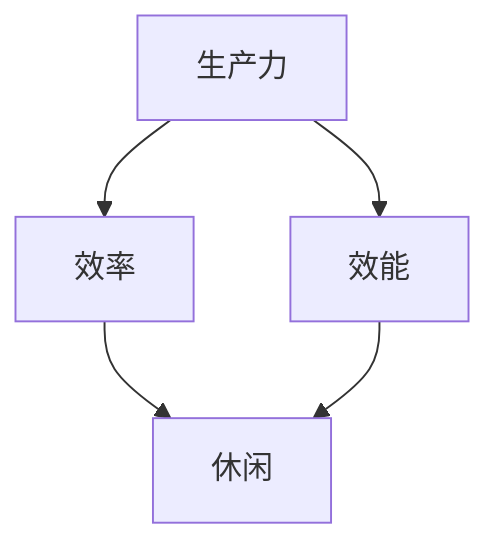
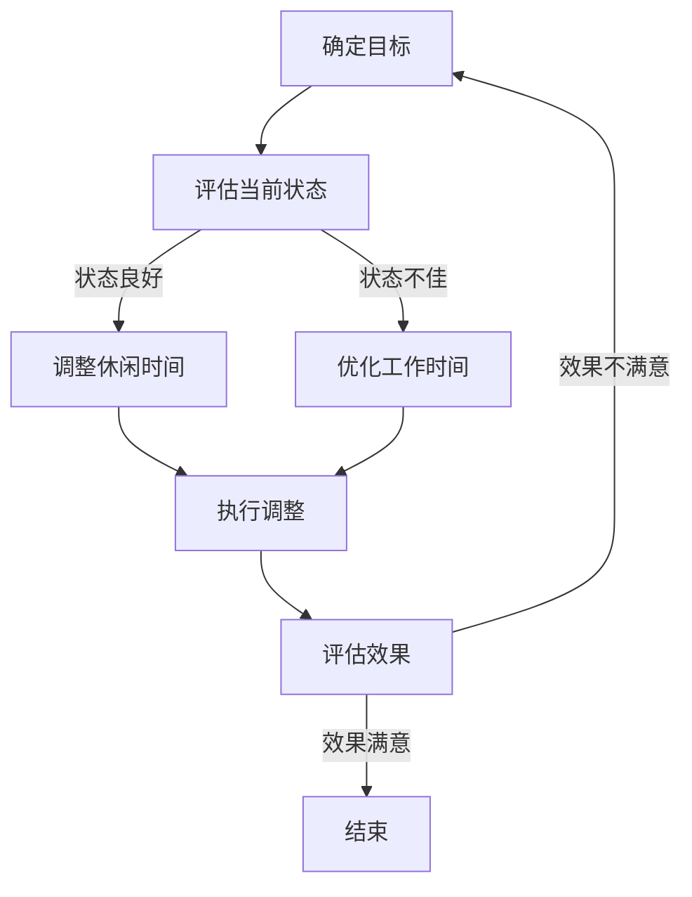
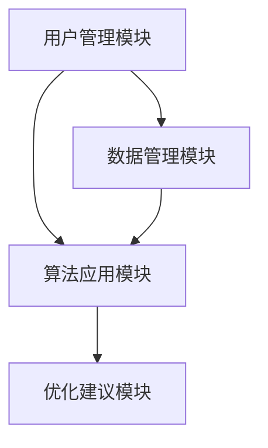
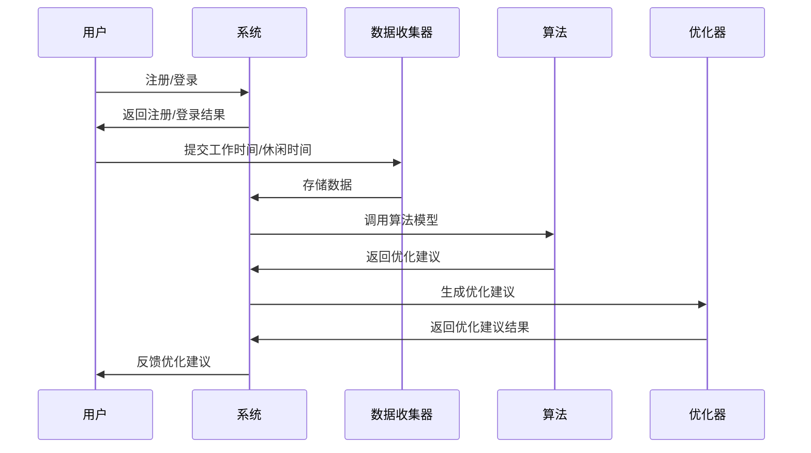

                 

### 《后效率时代：重新定义生产力与休闲的平衡》

---

**关键词**：后效率时代，生产力，休闲，平衡，方法论，算法原理，系统架构，项目实战。

**摘要**：随着技术的飞速发展，我们的工作与生活正在经历深刻的变革。在这个后效率时代，如何重新定义生产力与休闲的平衡，成为了一个亟待解决的重要课题。本文旨在探讨这一时代背景下，如何通过科学的方法论和创新的算法原理，来优化生产力与休闲的平衡，从而提升个人和组织的整体效能。

---

#### 引言

**1.1 书籍背景与目的**

在数字经济的浪潮下，我们的工作方式和生活节奏发生了翻天覆地的变化。传统的工作模式已不再适应现代社会的高效和灵活性。后效率时代，指的是在这个背景下，人们开始重新审视效率与效果的关系，寻求更高质量的生产力与休闲平衡。

本篇文章旨在提出一种新的方法论，帮助读者理解后效率时代的特征，以及如何通过创新的算法原理和实践，重新定义生产力与休闲的平衡，实现个人与组织效能的全面提升。

**1.2 生产力与休闲的平衡概念**

生产力与休闲的平衡，指的是在一个合理的时间内，既能高效地完成工作任务，又能充分享受休闲时光，达到身心愉悦的状态。在后效率时代，这一平衡不仅关乎个人的健康与幸福，也直接影响到组织的管理效率和创新活力。

**1.3 读者对象与阅读建议**

本文适合对工作效率和生活方式有较高追求的职场人士、企业管理者以及热衷于探索新理念的读者。建议读者在阅读过程中，结合自身实际情况，反思和优化自己的工作与休闲方式。

---

#### 背景介绍

**2.1 后效率时代的特征**

后效率时代，主要表现为以下几个特征：

1. **数字化与网络化**：工作与生活的数字化程度不断提高，信息传播速度加快，人们之间的沟通更加便捷。
2. **高度灵活的工作方式**：远程办公、弹性工作时间的普及，使工作地点和时间的限制变得更加灵活。
3. **信息过载与注意力分散**：随着信息量的爆炸性增长，人们面临的信息过载和注意力分散问题日益严重。

**2.2 生产力与休闲平衡的重要性**

1. **个人健康与幸福**：长期的工作压力和缺乏休闲会导致身心健康问题，影响生活质量。
2. **组织管理效率**：高效的生产力与休闲平衡，有助于提升团队的整体协作效率和创新活力。
3. **社会可持续发展**：在资源有限的情况下，实现生产力与休闲的平衡，有助于推动社会的可持续发展。

**2.3 研究方法与框架**

本文采用文献分析、案例分析、方法论探讨等多种研究方法，结合实际案例，提出一套系统化的方法论，旨在为读者提供实用的指导和建议。

---

#### 核心概念与联系

**3.1 生产力与休闲的度量标准**

1. **生产力的度量**：常用的生产力度量指标包括单位时间内的产出、质量、效率等。
2. **休闲的度量**：休闲的度量相对复杂，通常包括自由时间、精神状态、满意度等。

**3.2 效率与效能的比较**

1. **效率**：指在单位时间内完成的工作量，是一种“速度”的度量。
2. **效能**：指工作的质量和效果，是一种“质量”的度量。

**3.3 核心概念与联系图**

使用Mermaid绘制核心概念与联系图，如下图所示：



---

#### 算法原理讲解

**4.1 生产力与休闲平衡的算法**

**4.1.1 算法流程图**

使用Mermaid绘制算法流程图，如下图所示：



**4.1.2 Python代码解释**

以下是一个简单的Python代码示例，用于实现生产力与休闲平衡算法：

```python
def balance_production_and_leisure(target, current_state):
    if current_state == "良好":
        leisure_time = optimize_leisure_time()
    else:
        work_time = optimize_work_time()
        
    execute_adjustment(leisure_time, work_time)
    evaluate_effect()

    if evaluate_effect() == "满意":
        return "结束"
    else:
        return balance_production_and_leisure(target, current_state)

# 辅助函数
def optimize_leisure_time():
    # 优化休闲时间的逻辑
    pass

def optimize_work_time():
    # 优化工作时间的逻辑
    pass

def execute_adjustment(leisure_time, work_time):
    # 执行调整的逻辑
    pass

def evaluate_effect():
    # 评估效果的逻辑
    pass
```

**4.1.3 LaTeX公式详解**

为了更好地理解生产力与休闲平衡的算法，我们可以使用LaTeX来表示其中的数学模型。以下是一个示例公式：

$$
E = \frac{P \times L}{W}
$$

其中，$E$ 表示效能，$P$ 表示生产力，$L$ 表示休闲时间，$W$ 表示工作时间。

---

#### 系统分析与架构设计

**5.1 系统场景介绍**

假设我们正在开发一款基于人工智能的生产力与休闲平衡管理软件，该软件需要满足以下几个场景：

1. **用户注册与登录**：用户可以通过账号密码进行注册和登录。
2. **数据收集与处理**：系统需要收集用户的工作时间和休闲时间，并对其进行处理。
3. **算法应用与优化**：系统根据用户数据，应用生产力与休闲平衡算法，生成优化建议。

**5.2 系统功能设计**

1. **用户管理**：包括用户注册、登录、信息查询等功能。
2. **数据管理**：包括数据收集、存储、处理等功能。
3. **算法应用**：包括算法模型建立、应用、优化等功能。
4. **优化建议**：包括根据用户数据生成优化建议等功能。

**5.3 系统架构设计**

使用Mermaid绘制系统架构图，如下图所示：



**5.4 系统接口设计与交互**

系统接口设计如下：

1. **用户管理接口**：负责用户注册、登录等操作。
2. **数据收集接口**：负责收集用户的工作时间和休闲时间。
3. **算法应用接口**：负责调用算法模型，生成优化建议。
4. **优化建议接口**：负责将优化建议反馈给用户。

使用Mermaid绘制系统交互序列图，如下图所示：



---

#### 项目实战

**6.1 项目环境安装**

在本项目中，我们将使用Python作为主要编程语言，结合Flask框架搭建后端，前端则采用Vue.js。以下是在本地环境搭建项目所需的步骤：

1. **安装Python**：确保安装了Python 3.8及以上版本。
2. **安装Flask**：使用pip命令安装Flask框架。
   ```bash
   pip install Flask
   ```
3. **安装Vue.js**：在项目根目录下，使用npm命令安装Vue.js。
   ```bash
   npm install vue
   ```

**6.2 系统核心实现源代码**

以下是项目核心代码实现的一部分，包括用户注册、登录和数据收集功能。

**用户注册**：

```python
# app.py

from flask import Flask, request, jsonify
from models import User

app = Flask(__name__)

@app.route('/register', methods=['POST'])
def register():
    username = request.form['username']
    password = request.form['password']
    user = User(username, password)
    user.save()
    return jsonify({'status': 'success', 'message': '注册成功'})

if __name__ == '__main__':
    app.run(debug=True)
```

**用户登录**：

```python
# app.py

from flask import Flask, request, jsonify
from models import User

app = Flask(__name__)

@app.route('/login', methods=['POST'])
def login():
    username = request.form['username']
    password = request.form['password']
    user = User.get_by_username(username)
    if user and user.check_password(password):
        return jsonify({'status': 'success', 'message': '登录成功'})
    else:
        return jsonify({'status': 'error', 'message': '用户名或密码错误'})

if __name__ == '__main__':
    app.run(debug=True)
```

**数据收集**：

```python
# models.py

class User:
    def __init__(self, username, password):
        self.username = username
        self.password = password

    def save(self):
        # 保存用户数据的逻辑
        pass

    @staticmethod
    def get_by_username(username):
        # 根据用户名获取用户逻辑
        pass

    def check_password(self, password):
        # 检查密码逻辑
        return self.password == password
```

**6.3 应用解读与分析**

在这个项目中，我们通过Flask框架实现了用户注册、登录和数据收集功能。用户注册时，通过POST请求提交用户名和密码，后台接收请求后，保存用户信息并返回注册成功消息。用户登录时，同样通过POST请求提交用户名和密码，后台验证用户信息后，返回登录成功或错误的提示。

**6.4 案例剖析**

假设用户张三注册并登录后，提交了每日的工作时间和休闲时间数据。系统将收集到这些数据，并应用生产力与休闲平衡算法，生成优化建议。优化建议将通过前端界面反馈给用户，帮助用户更好地管理时间和提高效率。

---

#### 最佳实践与拓展

**7.1 最佳实践 tips**

1. **合理分配工作时间**：尽量将工作时间集中在高效时段，避免疲劳。
2. **充分利用碎片时间**：利用上下班途中、等待时间等碎片时间进行休闲活动。
3. **定期自我评估**：定期反思和评估自己的生产力和休闲状态，进行调整和优化。

**7.2 小结**

本文从后效率时代的背景出发，探讨了如何重新定义生产力与休闲的平衡。通过方法论、算法原理和系统架构设计，提供了一种实用的解决方案。在实际应用中，需要结合个人实际情况，不断优化和调整。

**7.3 注意事项**

1. **数据安全**：在收集和处理用户数据时，务必确保数据安全。
2. **个性化定制**：优化建议应考虑用户的个性化需求，提供定制化的解决方案。

**7.4 拓展阅读**

1. 《深度工作：如何有效利用每一点脑力》[美] 卡尔·纽波特
2. 《精要主义：如何高效管理你时间和生活的艺术》[美] 格雷格·麦基恩
3. 《禅与计算机程序设计艺术》[美] 乔治·西蒙森

---

**作者**：AI天才研究院/AI Genius Institute & 禅与计算机程序设计艺术 /Zen And The Art of Computer Programming

