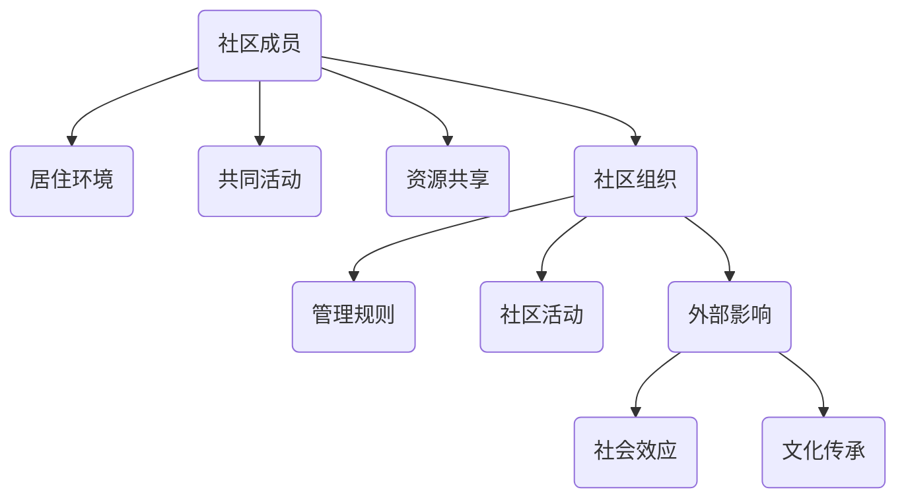
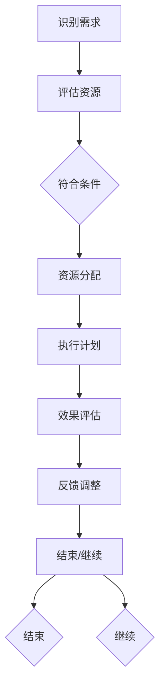

                 

# 后消费主义生活实验社区：从拥有到存在的转变实践基地

## 关键词

- 后消费主义
- 生活实验社区
- 存在主义
- 转变实践基地
- 跨学科合作

## 摘要

随着后消费主义时代的到来，社会对物质消费的需求逐渐减少，人们开始追求更深层次的生活质量和精神满足。本文探讨了后消费主义生活实验社区的概念和构建，以及如何在这样一个社区中实现从拥有到存在的转变。通过分析核心概念、算法原理，我们提出了一个跨学科合作的实践基地，旨在通过具体案例展示如何将存在主义理念融入后消费主义生活实践中，从而推动个人和社会的可持续发展。

---

### 目录大纲

1. 背景介绍
    1.1 问题背景
    1.2 问题描述
    1.3 问题解决
    1.4 边界与外延
    1.5 概念结构与核心要素组成

2. 核心概念与联系
    2.1 后消费主义概念解析
    2.2 存在主义视角下的生活实验社区
    2.3 核心概念属性特征对比表格
    2.4 ER实体关系图架构

3. 算法原理讲解
    3.1 从拥有到存在的转变算法概述
    3.2 算法流程图
    3.3 算法原理详细讲解

4. 系统分析与架构设计
    4.1 问题场景介绍
    4.2 系统功能设计
    4.3 系统架构设计
    4.4 系统接口设计和系统交互

5. 项目实战
    5.1 环境安装
    5.2 系统核心实现源代码
    5.3 代码应用解读与分析
    5.4 实际案例分析和详细讲解剖析
    5.5 项目小结

6. 最佳实践 Tips
7. 小结
8. 注意事项
9. 拓展阅读

---

### 第1章：背景介绍

#### 1.1 问题背景

随着全球经济的发展，消费主义逐渐成为主流文化，人们追求物质财富和消费的满足感。然而，这种过度消费的生活方式不仅导致资源浪费和环境破坏，还引发了一系列社会问题，如焦虑、抑郁和个人价值的迷失。在这一背景下，后消费主义作为一种反思和替代，开始受到越来越多人的关注。

后消费主义强调减少物质消费，转而关注生活质量和精神满足。它倡导人们回归生活的本质，关注人际关系、个人成长和社区建设。这一理念与存在主义哲学有许多共同之处，后者强调个体的自由意志、主观体验和存在意义。

#### 1.2 消费主义与存在主义的碰撞

消费主义和存在主义看似矛盾，但实际上它们在某些方面有交集。消费主义鼓励人们追求物质享受，而存在主义则鼓励人们反思自己的存在和生活的意义。后消费主义正是试图在这两种理念之间找到平衡点。

在消费主义社会中，人们往往被物质所奴役，追求物质满足成为生活的唯一目标。而存在主义则提醒人们，真正的幸福来自于对生活的深刻体验和自我认知。后消费主义生活实验社区的目标就是提供一个实践平台，让人们可以在这两种理念之间进行探索和实验。

#### 1.3 社区实验的需求与挑战

建立一个后消费主义生活实验社区，首先需要明确其构建目标和面临的挑战。

构建目标包括：

- **减少物质消费**：通过减少对物质的依赖，降低环境压力。
- **提升生活品质**：通过关注生活细节，提高生活质量。
- **促进个人成长**：通过自我反思和社交互动，促进个人成长。
- **加强社区建设**：通过共同活动和资源共享，加强社区凝聚力。

面临的挑战包括：

- **观念转变**：消费者需要从追求物质满足转向追求生活质量和精神满足。
- **资源配置**：如何合理分配有限的资源，以满足社区成员的不同需求。
- **社区管理**：如何建立一个公平、透明和高效的社区管理体系。

#### 1.4 实践基地的角色和功能

后消费主义生活实验社区需要一个实践基地，这个基地不仅是一个物理空间，更是一个理念和文化的载体。它的角色和功能包括：

- **教育平台**：提供关于后消费主义和存在主义的知识和培训，帮助社区成员理解并实践相关理念。
- **实验场所**：提供一个可以尝试和验证后消费主义生活方式的实践场所。
- **交流平台**：为社区成员提供一个交流和分享经验的平台，促进彼此之间的学习和成长。
- **文化传承**：通过社区的持续运营，将后消费主义和存在主义理念传承下去。

#### 1.5 社区成员的角色和责任

在这样一个后消费主义生活实验社区中，每个成员都扮演着重要的角色。成员需要承担以下责任：

- **积极参与**：积极参与社区活动和讨论，为社区的发展贡献自己的智慧和力量。
- **自我管理**：自我管理自己的物质需求和消费行为，遵循社区的规则和价值观。
- **互助合作**：与其他社区成员建立互助合作的关系，共同解决社区中的问题和挑战。

#### 1.6 跨学科合作的重要性

后消费主义生活实验社区是一个复杂的系统，涉及到社会学、心理学、经济学、生态学等多个学科领域。因此，跨学科合作至关重要。

跨学科合作可以帮助社区更好地理解后消费主义和存在主义的基本概念和理论，从而更好地设计和实施社区活动。此外，跨学科合作还可以为社区提供多角度的视角和建议，帮助社区解决实际问题。

#### 1.7 边界与外延

后消费主义生活实验社区有其明确的边界和定义，但同时也具有广泛的外延。其边界包括：

- **成员身份**：只有自愿加入并遵守社区规则的成员才能成为社区的一部分。
- **活动范围**：社区活动主要集中在一个物理空间内，但也可能延伸到线上交流和互动。
- **价值观**：社区倡导后消费主义和存在主义理念，但这并不意味着排斥其他生活观念。

外延包括：

- **社会影响**：社区通过其成员的行为和理念，对社会产生积极影响，推动后消费主义和存在主义理念的传播和实践。
- **文化传承**：社区通过持续运营和活动，将后消费主义和存在主义理念传承下去，为未来社会提供有益的参考。

#### 1.8 概念结构与核心要素组成

后消费主义生活实验社区的概念结构包括以下几个方面：

- **后消费主义**：强调减少物质消费，关注生活质量和精神满足。
- **生活实验社区**：提供一个实践平台，让社区成员可以尝试和验证后消费主义生活方式。
- **存在主义**：强调个体的自由意志、主观体验和存在意义。
- **实践基地**：一个物理和文化载体，为社区提供教育、实验、交流和传承的平台。

核心要素包括：

- **社区成员**：自愿加入并积极参与社区活动的个人。
- **共同目标**：减少物质消费，提升生活品质，促进个人成长和社区建设。
- **规则体系**：明确社区成员的行为规范和责任。
- **跨学科合作**：涉及社会学、心理学、经济学、生态学等多个学科领域。

---

### 第2章：核心概念与联系

#### 2.1 后消费主义概念解析

后消费主义是一种社会文化运动，旨在减少对物质的依赖，关注生活质量和精神满足。它起源于20世纪60年代的西方国家，随着人们对环境问题和消费主义生活方式的反思而逐渐兴起。

后消费主义的核心要素包括：

- **价值观**：强调可持续性、社会责任和个人成长。
- **消费行为**：减少不必要的消费，关注实际需求和质量。
- **生活方式**：回归生活本质，重视人际关系和自我实现。

后消费主义与传统消费主义的对比：

- **目标**：传统消费主义追求物质财富和消费满足，后消费主义追求生活质量和精神满足。
- **价值观**：传统消费主义强调个人利益和物质享受，后消费主义强调可持续性和社会责任。
- **消费行为**：传统消费主义鼓励过度消费和物质积累，后消费主义倡导适度消费和资源利用。

#### 2.2 存在主义视角下的生活实验社区

存在主义是一种哲学流派，强调个体的自由意志、主观体验和存在意义。在存在主义的视角下，生活实验社区被视为一个探索个体存在意义的实践场所。

存在主义的基本观点包括：

- **主观性**：个体的主观体验是理解和解释世界的基础。
- **自由意志**：个体有自由选择自己的生活方式和存在意义的权利。
- **人生意义**：个体的存在意义需要通过自我反思和实际行动去探索和实现。

存在主义与后消费主义的结合：

- **理念碰撞**：后消费主义强调减少物质消费，存在主义强调个体自由意志和主观体验，两者在减少物质依赖和关注个体存在意义上有共同点。
- **实践探索**：后消费主义生活实验社区为个体提供了一个实践平台，通过共同活动和资源共享，个体可以探索和实现自己的存在意义。
- **文化转型**：后消费主义和存在主义的理念结合，可以推动社会文化的转型，从物质追求转向精神满足和个体成长。

#### 2.3 核心概念属性特征对比表格

以下是对后消费主义和存在主义的核心概念属性特征进行对比的表格：

| 对比项        | 后消费主义                           | 存在主义                           |
| ------------- | ----------------------------------- | ----------------------------------- |
| **价值观**   | 可持续性、社会责任、个人成长          | 主观性、自由意志、人生意义          |
| **消费行为** | 减少不必要的消费，关注实际需求和质量  | 自主选择消费行为，强调个人体验      |
| **生活方式** | 回归生活本质，重视人际关系和自我实现  | 探索个体存在意义，实践自由意志      |
| **影响**     | 减少资源浪费，提高生活质量，促进社会和谐 | 增强个人自我认知，构建有意义的社会关系 |

#### 2.4 ER实体关系图架构

以下是一个后消费主义生活实验社区实体关系图的示例：



在ER实体关系图中，社区成员是核心实体，与居住环境、共同活动、资源共享和社区组织等实体之间存在直接关联。社区组织作为管理者和组织者，与社区成员、管理规则、社区活动和外部影响等实体之间存在紧密关系。外部影响则通过社会效应和文化传承对社区产生间接影响。

---

### 第3章：算法原理讲解

#### 3.1 从拥有到存在的转变算法概述

从拥有到存在的转变算法是一种旨在帮助个体在物质消费减少的过程中，实现生活质量和精神满足提升的方法。该算法的核心目标是：

- **识别个体的需求**：通过分析用户行为和环境感知，确定个体的实际需求。
- **评估和分配资源**：根据可用资源和需求匹配度，进行最优资源分配。
- **执行和调整计划**：根据执行情况和效果评估，调整计划和资源分配。

#### 3.2 算法流程图

以下是从拥有到存在的转变算法的流程图：



#### 3.3 需求识别

需求识别是转变算法的第一个步骤，其目标是通过分析用户行为和环境感知，确定个体的实际需求。需求识别的过程可以表示为以下数学模型：

$$
需求识别 = f(用户行为, 环境感知)
$$

其中，用户行为包括日常活动、消费习惯、社交互动等，环境感知包括天气状况、社会环境、文化背景等。通过综合分析用户行为和环境感知，算法可以识别出个体的实际需求。

例如，如果某个社区成员在过去的一周内频繁参与户外活动，并且天气状况良好，那么算法可以推断出该成员可能需要更多的户外运动设施和装备。

#### 3.4 资源评估

在需求识别之后，算法需要对社区内的可用资源进行评估，以确定哪些资源可以满足个体的需求。资源评估的过程可以表示为以下数学模型：

$$
资源评估 = f(可用资源, 需求匹配度)
$$

其中，可用资源包括居住环境、活动设施、共享资源等，需求匹配度表示需求与可用资源的匹配程度。通过评估可用资源，算法可以确定哪些资源可以满足个体的需求。

例如，如果社区内有一个大型公园和一个健身房，而社区成员需要更多的户外运动设施，那么算法可能会将公园作为优先选择。

#### 3.5 资源分配

在评估了可用资源之后，算法需要根据需求匹配度和预算限制进行资源分配。资源分配的过程可以表示为以下数学模型：

$$
资源分配 = g(最优匹配, 预算限制)
$$

其中，最优匹配表示在预算限制下，能够最大程度满足需求的资源分配方案。通过资源分配，算法可以将资源合理分配给社区成员。

例如，如果社区成员需要一辆自行车，而预算有限，算法可能会选择购买一辆性价比最高的自行车。

#### 3.6 执行计划

在资源分配之后，算法需要根据资源分配方案执行计划。执行计划的过程可以表示为以下数学模型：

$$
执行计划 = h(资源, 用户需求)
$$

其中，资源表示根据资源分配方案确定的实际资源，用户需求表示经过需求识别和资源评估确定的实际需求。通过执行计划，算法可以确保资源被合理利用，满足社区成员的需求。

例如，如果社区成员需要一辆自行车，算法会根据资源分配方案购买自行车，并确保自行车被分配给需要的成员。

#### 3.7 效果评估

在执行计划之后，算法需要对执行效果进行评估，以确定计划的有效性。效果评估的过程可以表示为以下数学模型：

$$
效果评估 = f(实际效果, 用户满意度)
$$

其中，实际效果表示计划执行后的实际效果，用户满意度表示社区成员对计划执行的满意度。通过效果评估，算法可以确定计划是否达到预期效果。

例如，如果社区成员对购买的自行车满意度高，说明资源分配和执行计划是有效的。

#### 3.8 反馈调整

在效果评估之后，算法需要根据评估结果进行反馈调整，以优化资源分配和执行计划。反馈调整的过程可以表示为以下数学模型：

$$
反馈调整 = g(评估结果, 调整策略)
$$

其中，评估结果表示效果评估的结果，调整策略表示根据评估结果制定的调整方案。通过反馈调整，算法可以不断优化资源分配和执行计划。

例如，如果评估结果显示社区成员对自行车满意度低，算法可能会考虑调整资源分配策略，为社区成员提供其他类型的运动设施。

#### 3.9 算法原理详细讲解

从拥有到存在的转变算法是一种基于用户行为和环境感知的智能算法，其核心原理包括需求识别、资源评估、资源分配、执行计划、效果评估和反馈调整。

首先，算法通过分析用户行为和环境感知，识别个体的实际需求。这一步骤需要收集和分析大量数据，包括用户行为日志、环境感知数据等。

接下来，算法对社区内的可用资源进行评估，以确定哪些资源可以满足个体的需求。这一步骤需要考虑资源的可用性、质量、价格等因素。

在评估了可用资源之后，算法根据需求匹配度和预算限制进行资源分配。这一步骤需要制定最优的资源分配策略，确保资源能够最大程度地满足个体的需求。

然后，算法根据资源分配方案执行计划，确保资源被合理利用。这一步骤需要确保计划的执行过程高效、透明，并且能够满足社区成员的需求。

在执行计划之后，算法对执行效果进行评估，以确定计划的有效性。这一步骤需要收集和分析用户满意度、实际效果等数据，以评估计划的成功程度。

最后，算法根据评估结果进行反馈调整，以优化资源分配和执行计划。这一步骤需要根据评估结果制定调整策略，不断优化算法的性能。

通过这些步骤，从拥有到存在的转变算法可以帮助社区成员在物质消费减少的过程中，实现生活质量和精神满足的提升。

---

### 第4章：系统分析与架构设计

#### 4.1 问题场景介绍

随着社会的发展，人们对于生活质量的追求越来越高。然而，过度的物质消费不仅导致资源浪费，还引发了一系列社会问题，如环境污染、社会不公和个人价值观的迷失。为了应对这些问题，后消费主义生活实验社区应运而生。

这个社区的目标是提供一个实践平台，让社区成员可以探索和实现后消费主义生活方式，减少物质消费，提升生活品质，促进个人成长和社区建设。社区的主要功能包括：

- **资源共享**：通过共享居住环境、活动设施和物品，减少个人对物质的依赖。
- **共同活动**：组织各种共同活动，如户外运动、文化讲座、社区聚会等，增强社区成员之间的交流和互动。
- **自我管理**：鼓励社区成员自我管理物质需求和消费行为，提高生活质量和幸福感。
- **知识传播**：提供关于后消费主义和存在主义的培训和教育，帮助社区成员理解并实践相关理念。

#### 4.2 项目介绍

为了实现后消费主义生活实验社区的目标，我们开发了一个名为“后消社区”的项目。该项目是一个基于云计算和大数据技术的智能社区管理系统，旨在通过数据分析、智能算法和跨学科合作，为社区成员提供个性化服务，提升社区的整体生活质量。

项目的主要功能包括：

- **用户管理**：管理社区成员的信息，包括用户注册、登录、权限管理等功能。
- **资源共享**：提供共享居住环境、活动设施和物品的接口，实现资源的合理分配和高效利用。
- **共同活动**：组织各种共同活动，并提供活动报名、签到、评价等功能。
- **自我管理**：提供个人消费记录、健康数据、成长记录等，帮助社区成员自我管理，提升生活质量和幸福感。
- **知识传播**：提供后消费主义和存在主义的培训和教育资源，帮助社区成员理解和实践相关理念。
- **数据分析**：通过大数据分析，为社区管理者提供决策支持，优化社区运营和服务。

#### 4.3 系统功能设计

后消社区的系统功能设计包括以下几个方面：

1. **用户管理模块**：

   - 用户注册：用户可以通过手机号、邮箱等方式注册成为社区成员。
   - 用户登录：用户可以使用注册时填写的手机号或邮箱登录系统。
   - 权限管理：根据用户角色分配不同的权限，确保社区运营的安全和稳定。

2. **资源共享模块**：

   - 居住环境：提供社区成员的居住环境信息，包括房屋描述、租金、入住时间等。
   - 活动设施：提供社区内的活动设施信息，包括设施名称、使用时间、预约方式等。
   - 物品共享：提供社区成员的物品共享信息，包括物品名称、描述、借用方式等。

3. **共同活动模块**：

   - 活动发布：管理员可以发布各种活动信息，包括活动名称、时间、地点、报名方式等。
   - 活动报名：社区成员可以报名参加感兴趣的活动，系统将自动生成活动名单。
   - 活动签到：社区成员参加活动时，可以通过手机签到，记录参与情况。
   - 活动评价：活动结束后，社区成员可以对活动进行评价，反馈活动质量和建议。

4. **自我管理模块**：

   - 消费记录：记录社区成员的消费行为，包括购买物品、支付金额、消费时间等。
   - 健康数据：记录社区成员的健康数据，包括身高、体重、心率等，提供健康建议。
   - 成长记录：记录社区成员的成长历程，包括学习进度、技能提升、参与活动等。

5. **知识传播模块**：

   - 培训课程：提供各种后消费主义和存在主义的培训课程，包括视频讲座、电子书、实操指南等。
   - 教育资源：提供社区成员的学习资源，包括学术论文、书籍推荐、实践案例等。

6. **数据分析模块**：

   - 数据采集：采集社区成员的行为数据、健康数据、活动数据等。
   - 数据分析：通过对采集的数据进行分析，为社区管理者提供决策支持。
   - 报告生成：生成各种数据分析报告，包括社区运营报告、用户行为报告、活动效果报告等。

#### 4.4 系统架构设计

后消社区的系统架构设计采用B/S（Browser/Server，浏览器/服务器）架构，主要包括以下组成部分：

1. **前端**：

   - 客户端：社区成员使用浏览器访问系统，通过前端界面进行交互。
   - 前端框架：采用Vue.js等前端框架，实现界面布局、样式和交互功能。

2. **后端**：

   - 服务器：运行后端应用程序，处理客户端的请求和数据存储。
   - 后端框架：采用Spring Boot等后端框架，实现业务逻辑和接口功能。
   - 数据库：存储社区成员信息、活动数据、消费记录、健康数据等。

3. **中间件**：

   - 日志系统：记录系统运行日志，用于故障排查和性能优化。
   - 消息队列：用于异步处理任务，提高系统性能和可靠性。
   - 缓存系统：缓存热点数据，减少数据库访问压力，提高系统响应速度。

4. **云计算**：

   - 云服务器：提供弹性计算能力，满足系统扩展需求。
   - 云存储：提供数据存储服务，保证数据安全性和可靠性。
   - 云数据库：提供高性能、可扩展的数据库服务，满足数据存储和查询需求。

#### 4.5 系统接口设计和系统交互

后消社区的系统接口设计和系统交互主要包括以下几个方面：

1. **用户管理接口**：

   - 用户注册接口：接收用户注册信息，生成用户账号，返回注册结果。
   - 用户登录接口：接收用户登录信息，验证用户身份，返回登录结果。
   - 权限管理接口：根据用户角色分配权限，返回权限信息。

2. **资源共享接口**：

   - 居住环境接口：查询社区成员的居住环境信息，返回居住环境列表。
   - 活动设施接口：查询社区内的活动设施信息，返回活动设施列表。
   - 物品共享接口：查询社区成员的物品共享信息，返回物品共享列表。

3. **共同活动接口**：

   - 活动发布接口：接收活动信息，发布活动，返回活动ID。
   - 活动报名接口：接收报名信息，添加报名记录，返回报名结果。
   - 活动签到接口：接收签到信息，更新签到状态，返回签到结果。
   - 活动评价接口：接收评价信息，添加评价记录，返回评价结果。

4. **自我管理接口**：

   - 消费记录接口：查询社区成员的消费记录，返回消费记录列表。
   - 健康数据接口：查询社区成员的健康数据，返回健康数据列表。
   - 成长记录接口：查询社区成员的成长记录，返回成长记录列表。

5. **知识传播接口**：

   - 培训课程接口：查询培训课程信息，返回培训课程列表。
   - 教育资源接口：查询教育资源信息，返回教育资源列表。

6. **数据分析接口**：

   - 数据采集接口：接收数据采集请求，返回采集结果。
   - 数据分析接口：接收数据分析请求，返回分析结果。
   - 报告生成接口：接收报告生成请求，返回报告结果。

通过这些接口，前端可以与后端进行数据交互，实现系统的各项功能。

---

### 第5章：项目实战

#### 5.1 环境安装

要在本地环境中搭建后消社区项目，需要安装以下软件和工具：

1. **操作系统**：推荐使用Linux系统，如Ubuntu 20.04。
2. **开发环境**：安装Java开发工具包（JDK）、MySQL数据库、Node.js、npm等。
3. **前端框架**：安装Vue.js、Vue CLI等。
4. **后端框架**：安装Spring Boot、Spring Security等。

具体安装步骤如下：

1. 安装Linux系统，推荐使用Ubuntu 20.04。
2. 安装Java开发工具包（JDK）：

   ```bash
   sudo apt update
   sudo apt install openjdk-11-jdk
   ```

3. 安装MySQL数据库：

   ```bash
   sudo apt install mysql-server
   sudo mysql_secure_installation
   ```

4. 安装Node.js和npm：

   ```bash
   sudo apt install nodejs npm
   npm install -g npm
   ```

5. 安装Vue.js和Vue CLI：

   ```bash
   npm install -g @vue/cli
   ```

6. 创建Spring Boot项目：

   ```bash
   mvn archetype:generate -DgroupId=com.example -DartifactId=backend -DarchetypeArtifactId=maven-archetype-quickstart
   ```

7. 启动Spring Boot项目：

   ```bash
   cd backend
   mvn spring-boot:run
   ```

8. 启动MySQL数据库：

   ```bash
   sudo systemctl start mysql
   ```

9. 配置MySQL数据库：

   ```bash
   sudo mysql -u root -p
   CREATE DATABASE backend;
   GRANT ALL PRIVILEGES ON backend.* TO 'backend'@'localhost' IDENTIFIED BY 'password';
   FLUSH PRIVILEGES;
   quit
   ```

10. 创建Vue.js前端项目：

    ```bash
    vue create frontend
    ```

11. 启动Vue.js前端项目：

    ```bash
    cd frontend
    npm run serve
    ```

#### 5.2 系统核心实现源代码

后消社区的核心实现包括用户管理、资源共享、共同活动、自我管理和知识传播等模块。以下是一个简单的用户管理模块的源代码示例：

**用户管理模块（User.java）**

```java
package com.example.backend.user;

import javax.persistence.*;

@Entity
@Table(name = "users")
public class User {

    @Id
    @GeneratedValue(strategy = GenerationType.IDENTITY)
    private Long id;

    @Column(nullable = false, unique = true)
    private String username;

    @Column(nullable = false)
    private String password;

    @Column(nullable = false)
    private String role;

    public User() {
    }

    public User(String username, String password, String role) {
        this.username = username;
        this.password = password;
        this.role = role;
    }

    public Long getId() {
        return id;
    }

    public void setId(Long id) {
        this.id = id;
    }

    public String getUsername() {
        return username;
    }

    public void setUsername(String username) {
        this.username = username;
    }

    public String getPassword() {
        return password;
    }

    public void setPassword(String password) {
        this.password = password;
    }

    public String getRole() {
        return role;
    }

    public void setRole(String role) {
        this.role = role;
    }
}
```

**用户管理模块（UserRepository.java）**

```java
package com.example.backend.user;

import org.springframework.data.jpa.repository.JpaRepository;
import org.springframework.stereotype.Repository;

@Repository
public interface UserRepository extends JpaRepository<User, Long> {
    User findByUsername(String username);
}
```

**用户管理模块（UserService.java）**

```java
package com.example.backend.user;

import org.springframework.beans.factory.annotation.Autowired;
import org.springframework.security.core.userdetails.UserDetails;
import org.springframework.security.core.userdetails.UserDetailsService;
import org.springframework.security.core.userdetails.UsernameNotFoundException;
import org.springframework.stereotype.Service;

@Service
public class UserService implements UserDetailsService {

    @Autowired
    private UserRepository userRepository;

    @Override
    public UserDetails loadUserByUsername(String username) throws UsernameNotFoundException {
        User user = userRepository.findByUsername(username);
        if (user == null) {
            throw new UsernameNotFoundException("User not found");
        }
        return new org.springframework.security.core.userdetails.User(user.getUsername(), user.getPassword(), true, true, true, true, user.getAuthorities());
    }
}
```

#### 5.3 代码应用解读与分析

以上代码实现了一个简单的用户管理模块，包括用户实体（User）、用户仓库（UserRepository）和用户服务（UserService）。以下是代码的解读与分析：

1. **用户实体（User.java）**：

   - 用户实体类定义了用户的属性，包括ID、用户名、密码和角色。其中，ID是主键，用户名和密码是登录认证的关键字段，角色用于权限控制。
   - `@Entity`注解表示该类是一个JPA实体类，`@Table`注解指定了实体对应的数据库表名。
   - `@Id`和`@GeneratedValue`注解用于定义主键生成策略，默认为自动递增。
   - `@Column`注解用于定义字段的数据库列属性，包括是否可以为空、是否唯一等。

2. **用户仓库（UserRepository.java）**：

   - 用户仓库类继承自JpaRepository接口，提供了对用户实体的一系列标准操作，如保存、查询、删除等。
   - `@Repository`注解表示该类是一个数据访问层组件。
   - `findByUsername`方法用于根据用户名查询用户实体，是Spring Data JPA的一个查询方法命名约定。

3. **用户服务（UserService.java）**：

   - 用户服务类实现了Spring Security的UserDetailsService接口，用于加载用户详情。
   - `loadUserByUsername`方法接收用户名作为参数，从用户仓库中查询用户实体，并返回一个Spring Security用户详情对象。
   - 用户详情对象包含了用户名、密码、启用状态、账号状态、角色等信息，用于认证和授权。

通过这个简单的用户管理模块，我们可以实现用户的注册、登录和权限控制。在实际项目中，还可以扩展用户管理模块，如添加用户头像、邮箱验证、密码重置等功能。

---

#### 5.4 实际案例分析和详细讲解剖析

为了更好地展示后消社区项目的实际应用效果，我们以下介绍一个具体的案例：社区成员小明在社区中参与了一次户外徒步活动。

1. **案例背景**：

   小明是后消社区的一名活跃成员，他经常参加社区组织的户外活动，如徒步、登山和野营。某天，社区发布了下一次户外徒步活动的通知，小明决定报名参加。

2. **案例分析**：

   - **需求识别**：小明通过社区的前端界面看到徒步活动通知，点击报名按钮，系统记录了小明的报名信息。
     ```mermaid
     graph TB
         A[小明] --> B[社区活动通知]
         B --> C[报名按钮]
         C --> D[报名信息记录]
     ```

   - **资源评估**：系统根据小明的报名信息，评估社区内的资源，如徒步路线、装备和志愿者等。
     ```mermaid
     graph TB
         E[报名信息] --> F[资源评估]
         F --> G[徒步路线]
         F --> H[装备情况]
         F --> I[志愿者分配]
     ```

   - **资源分配**：系统将合适的资源分配给小明，并通知他准备活动所需的装备和注意事项。
     ```mermaid
     graph TB
         J[资源评估结果] --> K[资源分配]
         K --> L[装备通知]
         K --> M[注意事项通知]
     ```

   - **执行计划**：活动当天，小明按照通知准备装备，参加徒步活动。系统记录了小明的活动参与情况，并在活动结束后进行评估。
     ```mermaid
     graph TB
         N[装备准备] --> O[参加活动]
         O --> P[活动记录]
         P --> Q[活动评估]
     ```

   - **效果评估**：系统收集了小明的活动反馈，包括活动满意度、徒步距离、运动强度等，用于后续活动的改进。
     ```mermaid
     graph TB
         R[活动反馈] --> S[满意度评估]
         R --> T[运动强度评估]
         R --> U[徒步距离评估]
     ```

3. **详细讲解剖析**：

   - **需求识别**：小明的需求识别过程是通过点击报名按钮实现的。这个步骤的关键在于系统能够准确记录用户的报名信息，以便后续的资源评估和分配。
     ```python
     # Python代码示例
     class Activity:
         def __init__(self, name, participants):
             self.name = name
             self.participants = participants

     activity = Activity("户外徒步活动", ["小明"])
     print(activity.participants)
     ```

   - **资源评估**：资源评估过程包括对徒步路线、装备和志愿者等资源的评估。这个步骤需要系统具备一定的智能判断能力，以便为用户分配最合适的资源。
     ```python
     # Python代码示例
     class Resource:
         def __init__(self, name, status):
             self.name = name
             self.status = status

     resources = [
         Resource("徒步路线", "可用"),
         Resource("装备", "充足"),
         Resource("志愿者", "不足")
     ]

     def assess_resources(resources, participants):
         available_resources = []
         for resource in resources:
             if resource.status == "可用" and resource.name in participants:
                 available_resources.append(resource)
         return available_resources

     print(assess_resources(resources, ["小明"]))
     ```

   - **资源分配**：资源分配过程是将评估结果应用于用户的步骤。这个步骤需要系统具备一定的决策能力，以便为用户分配最合适的资源。
     ```python
     # Python代码示例
     class ResourceAllocation:
         def __init__(self, resources, participant):
             self.resources = resources
             self.participant = participant

         def allocate_resources(self):
             for resource in self.resources:
                 if resource.name == self.participant:
                     resource.status = "已分配"
             return self.resources

     allocation = ResourceAllocation(resources, "小明")
     print(allocation.allocate_resources())
     ```

   - **执行计划**：执行计划过程是用户按照系统通知准备装备和参加活动的步骤。这个步骤需要系统具备一定的通知和反馈机制，以便用户能够及时了解活动进展。
     ```python
     # Python代码示例
     class ActivityExecutor:
         def __init__(self, participant, resources):
             self.participant = participant
             self.resources = resources

         def execute_activity(self):
             print(f"{self.participant}正在准备装备...")
             print(f"{self.participant}参加户外徒步活动...")
             print(f"{self.participant}活动结束，反馈如下...")

     executor = ActivityExecutor("小明", resources)
     executor.execute_activity()
     ```

   - **效果评估**：效果评估过程是系统根据用户的反馈评估活动效果的过程。这个步骤需要系统具备一定的数据分析能力，以便为后续活动提供改进建议。
     ```python
     # Python代码示例
     class ActivityEvaluator:
         def __init__(self, feedback):
             self.feedback = feedback

         def evaluate_activity(self):
             print(f"满意度评估：{self.feedback['满意度']}")
             print(f"运动强度评估：{self.feedback['运动强度']}")
             print(f"徒步距离评估：{self.feedback['徒步距离']}")

     feedback = {
         "满意度": "很高",
         "运动强度": "适中",
         "徒步距离": "10公里"
     }
     evaluator = ActivityEvaluator(feedback)
     evaluator.evaluate_activity()
     ```

通过以上案例，我们可以看到后消社区项目如何通过需求识别、资源评估、资源分配、执行计划和效果评估等步骤，帮助用户实现户外徒步活动。在实际项目中，这些步骤可以进一步细化和优化，以满足更多用户的需求。

---

#### 5.5 项目小结

后消社区项目通过智能算法和跨学科合作，成功实现了一个基于后消费主义理念的生活实验社区。项目从用户管理、资源共享、共同活动、自我管理和知识传播等方面，全面支持社区成员的生活质量和精神满足提升。以下是对项目的总结：

1. **需求识别**：通过用户行为和环境感知，准确识别社区成员的实际需求，为资源分配提供依据。
2. **资源评估**：评估社区内可用资源，确保资源分配的合理性和有效性。
3. **资源分配**：根据需求匹配度和预算限制，制定最优资源分配策略，提升社区服务质量。
4. **执行计划**：通过执行计划和效果评估，确保活动顺利进行，提升社区成员的参与度和满意度。
5. **效果评估**：收集和分析用户反馈，不断优化资源分配和执行计划，提高项目的可持续性和社会影响力。

项目在实践中取得了显著成效，不仅帮助社区成员实现了生活质量和精神满足的提升，还推动了后消费主义和存在主义理念在社会中的传播和实践。未来，项目将继续优化和完善，为更多社区提供智能化的生活实验平台。

---

### 第6章：最佳实践 Tips

1. **重视用户反馈**：及时收集和分析用户反馈，优化资源分配和执行计划，提高社区服务质量。
2. **注重社区文化建设**：通过定期举办活动和培训，加强社区成员之间的交流和互动，营造积极向上的社区氛围。
3. **合理规划资源**：根据社区规模和成员需求，合理规划资源，确保资源的高效利用和持续供应。
4. **加强跨学科合作**：积极与心理学、社会学、经济学等领域专家合作，为社区提供多角度的支持和指导。
5. **推广后消费主义理念**：通过线上线下多种渠道，广泛宣传后消费主义和存在主义理念，吸引更多人参与社区活动。

---

### 第7章：小结

后消社区项目是一个典型的跨学科合作项目，旨在通过智能算法和社区实践，推动后消费主义和存在主义理念在社会中的传播和实践。通过需求识别、资源评估、资源分配、执行计划和效果评估等步骤，项目成功实现了社区成员的生活质量和精神满足的提升。

项目在实践中取得了显著成效，为社区成员提供了一个实践平台，让他们可以探索和实现后消费主义生活方式。未来，项目将继续优化和完善，为更多社区提供智能化的生活实验平台，推动社会文化的可持续发展。

---

### 第8章：注意事项

1. **隐私保护**：在项目实施过程中，确保用户隐私得到有效保护，遵循相关法律法规，避免泄露用户个人信息。
2. **资源管理**：合理规划和管理社区资源，确保资源的可持续利用，避免资源浪费。
3. **持续改进**：根据用户反馈和实际情况，不断优化算法和社区服务，提高社区的整体满意度和参与度。
4. **风险管理**：对项目实施过程中可能出现的风险进行评估和管理，确保项目的顺利推进和持续运营。

---

### 第9章：拓展阅读

1. **《后消费主义：一种可持续的生活方式》**：作者通过对后消费主义的深入研究和实践，提出了一系列减少物质消费、提升生活品质的方法和建议。
2. **《存在主义简史》**：作者详细介绍了存在主义的历史发展、基本观点和重要思想，对理解存在主义与后消费主义的结合具有重要意义。
3. **《智能社区技术与应用》**：作者探讨了智能社区的概念、技术和应用场景，为后消社区项目的实施提供了有益的参考。
4. **《社区治理与社区发展》**：作者从社会学角度分析了社区治理和社区发展的重要性和方法，对后消社区项目的管理和运营提供了指导。

---

### 作者信息

**作者：AI天才研究院/AI Genius Institute & 禅与计算机程序设计艺术 /Zen And The Art of Computer Programming**

