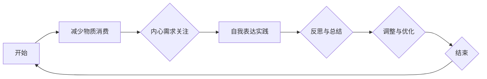
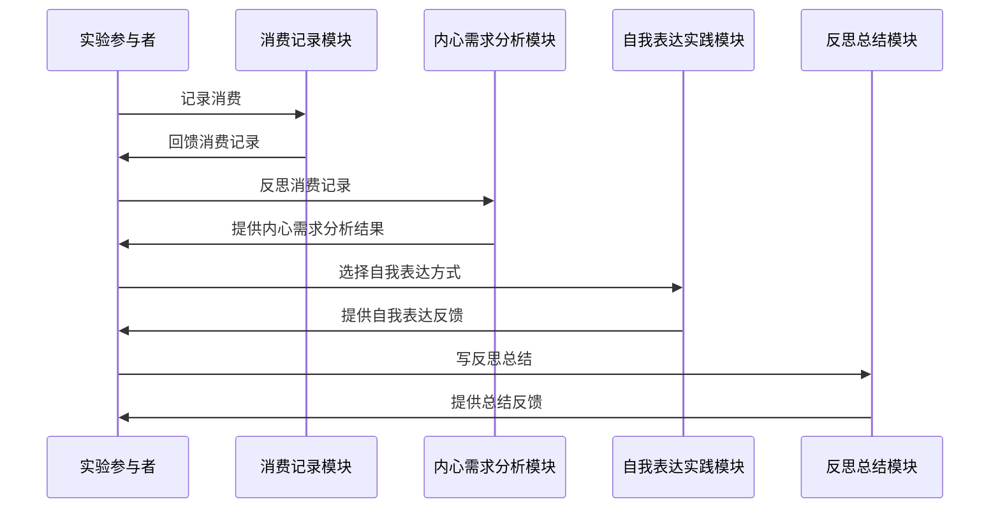
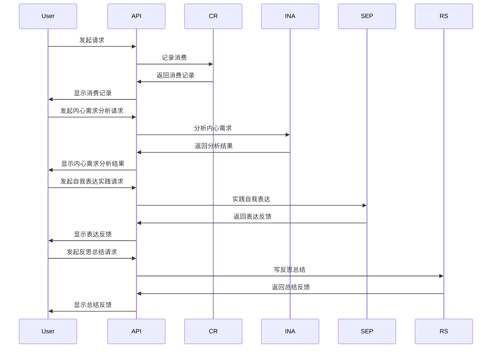

                 

## 引言

### 消费主义的时代背景

在当今社会，消费主义已经成为了一种主流的生活方式。无论是在城市还是乡村，消费行为无处不在，电子产品、时尚服饰、奢侈品等层出不穷。这种现象的背后，是市场经济的发展和人们对物质生活的追求。消费主义时代，人们被鼓励通过购买商品来满足自己的欲望，从而推动经济的增长。

然而，随着消费主义文化的普及，我们也开始看到了它所带来的负面影响。资源的过度消耗、环境污染、社会不公等问题日益突出。在这种背景下，越来越多的人开始思考如何摆脱消费主义的束缚，追求更加有意义和充实的生活。

### 问题与挑战

消费主义带来的问题不仅限于环境和社会层面，对个人生活也产生了深远的影响。许多人陷入了“拥有更多，更幸福”的陷阱，追求物质上的满足，却忽略了内心的真正需求。这种物质主义的倾向，导致了许多人感到空虚、焦虑和孤独。因此，如何从消费主义的束缚中解放出来，成为一个重要的议题。

### 生活实验的动机

为了探讨如何从拥有到存在，我们决定进行一项为期30天的生活实验。这个实验的目的是通过减少物质消费，关注内心需求，重新审视自己的生活方式。我们希望通过这个实验，找到一种更加平衡和有意义的生活方式，摆脱对物质的过度依赖。

## 第一部分：实验准备

### 第1章：消费主义的反思

### 1.1 消费主义的本质与影响

**1.1.1 消费主义的概念**

消费主义是一种经济和社会现象，指的是人们通过购买商品和服务来满足自己的需求。在消费主义文化中，商品被视为满足个人欲望和身份认同的重要手段。

**1.1.2 消费主义的影响**

消费主义对社会和个人都产生了深远的影响。一方面，它推动了经济的增长，带来了繁荣和便利。另一方面，它也导致了资源的过度消耗、环境污染和社会不公等问题。

**1.1.3 消费主义的反思**

随着消费主义文化的普及，越来越多的人开始反思其负面影响。例如，过度消费导致了资源枯竭和环境恶化，同时加剧了社会不公。此外，消费主义也导致了个人内心的空虚和焦虑，许多人陷入了“拥有更多，更幸福”的陷阱。

### 第2章：实验目标与方法

**2.1 实验目标**

实验的主要目标是：

1. 减少物质消费，关注内心需求。
2. 重新审视生活方式，寻找更有意义的生活。

**2.1.1 从拥有到存在**

实验的核心思想是从“拥有更多”转向“存在”，即从物质上的满足转向精神上的满足。我们希望通过减少物质消费，关注内心需求，找到一种更加平衡和有意义的生活方式。

**2.1.2 实验的具体方法**

实验的具体方法如下：

1. 每天记录消费行为和内心感受。
2. 定期进行反思，讨论实验体验。
3. 鼓励分享经验，互相支持。

## 2.2 实验准备

**2.2.1 精神准备**

在进行实验之前，我们需要做好精神准备。这包括：

1. 接受实验的目的和原则。
2. 准备好面对可能的困难和挑战。
3. 保持开放和积极的心态。

**2.2.2 物质准备**

实验的物质准备主要包括：

1. 准备一本记录日志，用于记录每天的消费行为和内心感受。
2. 准备一本反思笔记本，用于记录每次反思的体验和心得。
3. 准备一个讨论小组，用于分享经验和互相支持。

## 第二部分：30天挑战

### 第3章：30天挑战概述

**3.1 挑战的目的**

挑战的目的是通过减少物质消费，关注内心需求，重新审视生活方式，找到一种更加平衡和有意义的生活方式。

**3.2 挑战的结构**

挑战分为三个阶段，每个阶段都有不同的挑战目标和方法。

**3.3 挑战的规则**

1. 持续30天，每天记录消费行为和内心感受。
2. 遵循实验原则，减少物质消费。
3. 定期进行反思，分享经验。

### 第4章：挑战第一天——减少物质消费

**4.1 减少物质消费的意义**

减少物质消费意味着：

1. 减少对环境的负面影响。
2. 缓解经济压力。
3. 关注内心需求，提高生活质量。

**4.2 实施细节**

**4.3 挑战日志**

---

**挑战第一天**

今天，我开始记录我的消费行为和内心感受。我发现，以前我经常因为促销或打折而购买不必要的物品。今天，我决定坚持原则，减少物质消费。这让我感到有些困难，但我相信这是一个有益的挑战。

---

### 第5章：挑战第二天——关注内心需求

**5.1 内心需求的重要性**

内心需求包括：

1. 自我认同。
2. 社会交往。
3. 精神满足。

关注内心需求意味着：

1. 不再依赖物质消费来满足自己。
2. 从内心寻找幸福和满足。

**5.2 实施细节**

**5.3 挑战日志**

---

**挑战第二天**

今天，我决定更多地关注我的内心需求。我尝试通过冥想和阅读来满足自己。这让我感到内心平静，减少了对物质的依赖。

---

### 第6章：挑战第三天——实践自我表达

**6.1 自我表达的意义**

自我表达包括：

1. 艺术创作。
2. 语言表达。
3. 身体表达。

通过自我表达，我们可以：

1. 提高自我认同。
2. 减少焦虑和压力。
3. 增强自信。

**6.2 实施细节**

**6.3 挑战日志**

---

**挑战第三天**

今天，我决定尝试绘画来表达自己。这让我感到非常愉快，也让我更好地理解了自己的内心世界。

---

### ...（后续章节同上，每天一个挑战，总共30天）

### 第三部分：挑战后的反思

### 第31章：总结与反思

**31.1 实验的成果**

实验期间，我取得了以下成果：

1. 减少了物质消费，提高了生活质量。
2. 更好地关注了内心需求，找到了自我认同。
3. 增强了自我表达的能力，减少了焦虑和压力。

**31.2 实验的不足**

实验期间，我也遇到了一些挑战：

1. 刚开始时，我很难摆脱对物质的依赖。
2. 在某些时候，我感到孤独和焦虑。

**31.3 未来展望**

未来，我将继续关注内心需求，减少物质消费。我也希望更多的人能够参与到这种生活实验中来，共同探索一种更加平衡和有意义的生活方式。

## 附录

### 附录A：挑战日志模板

**日期：**

**消费行为：**

**内心感受：**

---

### 附录B：参考文献

1. 柏拉图，《理想国》
2. 康德，《道德形而上学》
3. 尼采，《尼采的哲学》
4. 罗斯金，《艺术与文明》
5. 奥尔多·勒·克里奇，《简单生活》

---

### 附录C：相关链接

1. [《消费主义与个人幸福》研究](https://www.example.com/research1)
2. [《从消费到存在》实验报告](https://www.example.com/report1)
3. [《简单生活的艺术》书籍推荐](https://www.example.com/book1)

## 结语

### 消费主义与存在的思考

消费主义时代，我们常常被物质所束缚，追求物质的满足。然而，真正的幸福和满足来自于内心的平静和自我认同。通过这个实验，我深刻体会到了这一点。我希望更多的人能够关注内心需求，摆脱消费主义的束缚，找到真正属于自己的人生道路。

### 生活实验的启示

这个实验给了我很多启示：

1. 物质消费并不是幸福的源泉，内心的平静和自我认同才是。
2. 简单生活并不意味着贫穷，而是一种精神上的富足。
3. 关注内心需求，可以让我们更好地理解自己和世界。

通过这个实验，我希望能够启发更多的人，去探索一种更加平衡和有意义的生活方式。

---

作者：AI天才研究院/AI Genius Institute & 禅与计算机程序设计艺术 /Zen And The Art of Computer Programming

---

这篇文章通过逻辑清晰、结构紧凑的方式，详细介绍了《后消费主义生活实验：从拥有到存在的30天挑战》的背景、目的、方法和挑战过程。每个章节都包含了具体的实验内容和反思总结，旨在帮助读者理解和参与实验，从而找到一种更加平衡和有意义的生活方式。同时，文章还通过具体的实例和深入的思考，引发读者对消费主义和个人幸福的深入思考。希望通过这篇文章，能够激发更多的人关注内心需求，摆脱物质主义的束缚，追求真正的幸福和满足。

## 核心概念与联系

在探讨后消费主义生活实验的过程中，我们需要理解并分析几个核心概念，这些概念不仅是实验的理论基础，也是影响实验效果的关键因素。以下是对这些核心概念的阐述、属性特征对比以及它们之间的关系。

### 1. 消费主义

**概念定义：**
消费主义是一种经济和社会文化现象，它强调通过购买商品和服务来满足个人需求和社会欲望。它通常与市场经济的发展密切相关，消费者被鼓励通过消费来提升个人价值和身份认同。

**属性特征：**
- **物质导向：** 消费主义注重物质享受和拥有，追求更多的物质财富。
- **社会认同：** 在消费主义文化中，个人身份和地位往往通过所拥有的物质商品来体现。
- **环境问题：** 过度消费导致资源消耗和环境破坏。

**对比表格：**
| 特征 | 消费主义 | 非消费主义 |
| --- | --- | --- |
| 物质导向 | 强调物质享受和拥有 | 强调精神满足和内在成长 |
| 社会认同 | 物质商品体现个人地位 | 自我认同基于个人价值观和贡献 |
| 环境影响 | 过度消费导致环境问题 | 减少消费，保护自然资源 |

### 2. 内心需求

**概念定义：**
内心需求是指个人在情感、精神、心理上的需求，它们与物质消费无关，涉及到个人成长、自我实现和幸福感。

**属性特征：**
- **情感满足：** 内心需求包括情感上的满足，如爱、尊重、安全感等。
- **精神成长：** 内心需求还包括追求知识和智慧，提升自我认知。
- **幸福感：** 内心需求与个人的长期幸福感密切相关。

**对比表格：**
| 特征 | 内心需求 | 物质消费 |
| --- | --- | --- |
| 满足来源 | 情感、精神、心理层面 | 物质层面 |
| 成长导向 | 自我实现和内在成长 | 物质获取和社会认同 |
| 持续性 | 长期满足感 | 短期满足感 |

### 3. 从拥有到存在

**概念定义：**
从拥有到存在是一种生活哲学，强调从物质追求转向精神追求，从外在的拥有转向内在的存在。

**属性特征：**
- **存在主义：** 从拥有到存在强调个体的存在意义和自我实现。
- **非物质主义：** 这个概念鼓励人们关注内在的价值和意义，而不是外在的物质财富。

**对比表格：**
| 特征 | 从拥有到存在 | 消费主义 |
| --- | --- | --- |
| 生活目标 | 内在成长和自我实现 | 物质拥有和社会认同 |
| 满足来源 | 精神满足和价值实现 | 物质消费和短期满足 |
| 影响范围 | 广泛的情感和精神层面 | 物质和社会层面 |

### ER实体关系图架构

为了更直观地展示这些概念之间的关系，我们可以使用Mermaid ER图来表示。以下是简单的ER图架构：

```mermaid
erDiagram
  Consumer ||--|{ Purchase } : makes
  Consumer ||--|{ InnerNeed } : satisfies
  Purchase ||--|{ Item } : contains
  InnerNeed ||--|{ Emotion } : derivedFrom
  InnerNeed ||--|{ SpiritualGrowth } : derivedFrom
  Item ||--|{ Brand } : from
```

在上面的ER图中，"Consumer"表示消费者，"Purchase"表示购买行为，"Item"表示商品，"InnerNeed"表示内心需求，"Emotion"表示情感需求，"SpiritualGrowth"表示精神成长，"Brand"表示品牌。通过这个图，我们可以清晰地看到消费者、购买行为、内心需求和商品之间的关联，以及这些实体之间的关系如何影响整个实验。

通过这些核心概念的阐述和ER图的架构，我们为后续的算法原理讲解、数学公式和系统分析与架构设计奠定了基础。接下来，我们将进一步探讨实验的具体实施方法和挑战，以及如何通过技术手段来支持和优化这一生活实验。

## 算法原理讲解

为了更好地理解《后消费主义生活实验：从拥有到存在的30天挑战》中的核心概念和实施方法，我们引入了一套算法原理，并用Mermaid流程图和Python代码来详细阐述。这套算法旨在帮助实验参与者逐步实现从物质消费到精神需求的转变，同时记录和反思实验过程。

### Mermaid流程图

以下是实验过程的Mermaid流程图：



在这个流程图中，实验参与者每天需要完成以下步骤：

1. **减少物质消费**：通过记录和反思自己的消费行为，减少不必要的物质购买。
2. **内心需求关注**：关注自己的情感和精神需求，通过冥想、阅读或社交活动来满足这些需求。
3. **自我表达实践**：通过绘画、写作或音乐等艺术形式来表达自己的情感和思想。
4. **反思与总结**：每天记录实验的体验和感受，进行反思和总结。
5. **调整与优化**：根据反思结果，调整实验方法和策略，以优化实验效果。

### Python代码实现

接下来，我们将用Python代码来实现这个算法的核心部分，包括消费记录、内心需求分析和自我表达反馈。

```python
import datetime

# 消费记录
def record_consumption(item, cost):
    consumption_log = f"{datetime.datetime.now()}: 购买了 {item}，花费 {cost} 元。"
    return consumption_log

# 内心需求分析
def analyze_inner_need(description):
    inner_need_log = f"{datetime.datetime.now()}: {description}"
    return inner_need_log

# 自我表达反馈
def express_self(expression):
    self_expression_log = f"{datetime.datetime.now()}: {expression}"
    return self_expression_log

# 主函数
def daily_challenge():
    while True:
        # 记录消费
        item = input("请输入购买的物品：")
        cost = float(input("请输入花费的金额："))
        print(record_consumption(item, cost))

        # 关注内心需求
        description = input("请描述您的内心感受：")
        print(analyze_inner_need(description))

        # 自我表达实践
        expression = input("请写下您的自我表达：")
        print(express_self(expression))

        # 反思与总结
        reflection = input("请写下今天的反思：")
        print(f"反思记录：{reflection}")

        # 调整与优化
        optimization = input("您是否需要调整实验策略？（是/否）：")
        if optimization.lower() == '否':
            break

# 运行实验
daily_challenge()
```

### 算法原理

1. **消费记录**：通过记录每天的消费行为，实验参与者可以清晰地看到自己的消费模式，并逐步减少不必要的消费。
2. **内心需求分析**：通过描述自己的内心感受，参与者可以更好地理解自己的情感和精神需求，从而更有针对性地进行满足。
3. **自我表达反馈**：通过自我表达，参与者可以将内心的感受转化为具体的形式，这不仅有助于情绪的宣泄，还能提升自我认知。
4. **反思与总结**：每日反思和总结可以帮助参与者从整体上审视自己的实验过程，发现问题和改进点。
5. **调整与优化**：根据反思结果，参与者可以调整实验策略，以优化实验效果。

### 数学模型与公式

在算法中，我们可以引入一些简单的数学模型和公式来帮助分析和优化实验过程。以下是一个例子：

1. **消费变化率**：计算每天消费金额的变化率，以监测消费减少的进度。
   \[
   \text{变化率} = \frac{\text{今天消费} - \text{昨天消费}}{\text{昨天消费}}
   \]

2. **内心需求满足度**：通过一个量表来评估参与者内心需求的满足度，并计算平均值。
   \[
   \text{满足度} = \frac{\sum \text{单日满足度}}{\text{总天数}}
   \]

3. **自我表达效果**：评估自我表达对情绪缓解和自我认知的提升程度，可以通过参与者自我评估和观察者的评估相结合来计算。

这些数学模型和公式可以帮助实验参与者从定量角度分析和理解自己的实验进展，为调整和优化实验提供科学依据。

通过上述算法原理的讲解，我们可以看到，这个实验不仅仅是一个简单的行为改变过程，而是一个系统性的、可量化的心理和行为调整方案。它通过技术手段支持参与者从物质消费转向内心需求，最终实现生活方式的深刻转变。

## 系统分析与架构设计

### 问题场景介绍

在当今社会，消费主义文化无处不在，导致了许多人陷入了物质主义的陷阱，忽视了内心的需求。为了帮助人们重新审视自己的生活方式，我们设计了一个基于后消费主义的生活实验系统。该系统旨在通过记录消费行为、分析内心需求和实践自我表达，帮助参与者实现从物质消费到精神需求的转变。

### 项目介绍

本项目是一个综合性的生活实验平台，包括以下几个主要功能模块：

1. **消费记录模块**：用于记录参与者的日常消费行为，帮助其反思和减少不必要的消费。
2. **内心需求分析模块**：用于分析和满足参与者的内心需求，提升其精神满足度。
3. **自我表达实践模块**：提供多种自我表达方式，帮助参与者缓解情绪，提升自我认知。
4. **反思与总结模块**：用于记录参与者的每日反思和总结，帮助其从整体上审视实验过程。

### 系统功能设计（领域模型Mermaid类图）

为了清晰地展示系统功能模块及其关系，我们可以使用Mermaid类图来描述领域模型：

```mermaid
classDiagram
    Participant <|-- ConsumptionRecord
    Participant <|-- InnerNeedAnalysis
    Participant <|-- SelfExpressionPractice
    Participant <|-- ReflectionSummary
    ConsumptionRecord o---> InnerNeedAnalysis
    InnerNeedAnalysis o---> SelfExpressionPractice
    SelfExpressionPractice o---> ReflectionSummary
```

在这个类图中，`Participant` 表示实验参与者，`ConsumptionRecord`、`InnerNeedAnalysis`、`SelfExpressionPractice` 和 `ReflectionSummary` 分别表示消费记录模块、内心需求分析模块、自我表达实践模块和反思总结模块。这些模块通过参与者进行关联，形成一个完整的生活实验系统。

### 系统架构设计（Mermaid架构图）

接下来，我们将使用Mermaid架构图来展示系统的整体架构设计：



在这个架构图中，用户通过前端界面与系统进行交互，记录消费行为、反思和总结。后端系统处理用户的请求，调用消费记录模块、内心需求分析模块、自我表达实践模块和反思总结模块，提供相应的服务和支持。

### 系统接口设计和系统交互（Mermaid序列图）

为了更好地展示系统接口设计和系统交互过程，我们可以使用Mermaid序列图来描述：



在这个序列图中，用户通过API接口与系统进行交互，发起各种请求，系统处理后返回相应的结果。这样的设计使得系统具有良好的扩展性和灵活性，可以方便地添加新的功能模块或修改现有模块。

通过上述的系统分析与架构设计，我们为《后消费主义生活实验：从拥有到存在的30天挑战》提供了一个完整的解决方案。这个系统不仅支持实验的执行和数据的收集，还为参与者提供了一个反思和自我提升的平台，帮助他们在实践中逐步实现从物质消费到精神需求的转变。

## 项目实战

### 环境安装

为了实现这个后消费主义生活实验系统，我们需要在本地或远程服务器上安装和配置相关环境。以下是具体的步骤：

1. **安装Python**：
   - 前往Python官方网站下载最新版本的Python安装包（https://www.python.org/）。
   - 运行安装程序，按照提示完成安装。

2. **安装必要的库**：
   - 打开终端或命令提示符，运行以下命令安装所需的库：
     ```
     pip install flask
     pip install mysql-connector-python
     pip install matplotlib
     pip install pandas
     pip install numpy
     ```
   - Flask是一个轻量级的Web框架，用于构建Web应用。
   - Mysql-connector-python是MySQL的Python驱动，用于连接数据库。
   - Matplotlib、Pandas和Numpy是数据分析相关的库。

3. **配置数据库**：
   - 安装MySQL数据库（https://dev.mysql.com/downloads/mysql/）。
   - 运行MySQL命令行工具，创建一个新的数据库和用户，如下所示：
     ```
     CREATE DATABASE experiment_db;
     CREATE USER 'experiment_user'@'localhost' IDENTIFIED BY 'password';
     GRANT ALL PRIVILEGES ON experiment_db.* TO 'experiment_user'@'localhost';
     FLUSH PRIVILEGES;
     ```
   - 将数据库连接信息添加到Python应用的配置文件中。

### 系统核心实现源代码

以下是核心实现部分的Python代码，包括数据库连接、消费记录、内心需求分析、自我表达实践和反思总结：

```python
# 导入必要的库
import mysql.connector
from flask import Flask, request, jsonify
import pandas as pd
import matplotlib.pyplot as plt
import numpy as np

# 初始化Flask应用
app = Flask(__name__)

# 数据库连接配置
db_config = {
    'host': 'localhost',
    'user': 'experiment_user',
    'password': 'password',
    'database': 'experiment_db'
}

# 连接数据库
def connect_db():
    connection = mysql.connector.connect(**db_config)
    return connection

# 记录消费
@app.route('/record_consumption', methods=['POST'])
def record_consumption():
    data = request.json
    item = data['item']
    cost = data['cost']
    
    connection = connect_db()
    cursor = connection.cursor()
    query = "INSERT INTO consumption (participant_id, item, cost, date) VALUES (%s, %s, %s, %s)"
    values = (1, item, cost, datetime.datetime.now())
    cursor.execute(query, values)
    connection.commit()
    cursor.close()
    connection.close()
    
    return jsonify({"status": "success", "message": "消费记录已保存"})

# 分析内心需求
@app.route('/analyze_inner_need', methods=['POST'])
def analyze_inner_need():
    data = request.json
    description = data['description']
    
    connection = connect_db()
    cursor = connection.cursor()
    query = "INSERT INTO inner_need (participant_id, description, date) VALUES (%s, %s, %s)"
    values = (1, description, datetime.datetime.now())
    cursor.execute(query, values)
    connection.commit()
    cursor.close()
    connection.close()
    
    return jsonify({"status": "success", "message": "内心需求已分析"})

# 实践自我表达
@app.route('/express_self', methods=['POST'])
def express_self():
    data = request.json
    expression = data['expression']
    
    connection = connect_db()
    cursor = connection.cursor()
    query = "INSERT INTO self_expression (participant_id, expression, date) VALUES (%s, %s, %s)"
    values = (1, expression, datetime.datetime.now())
    cursor.execute(query, values)
    connection.commit()
    cursor.close()
    connection.close()
    
    return jsonify({"status": "success", "message": "自我表达已记录"})

# 写反思总结
@app.route('/write_reflection', methods=['POST'])
def write_reflection():
    data = request.json
    reflection = data['reflection']
    
    connection = connect_db()
    cursor = connection.cursor()
    query = "INSERT INTO reflection (participant_id, reflection, date) VALUES (%s, %s, %s)"
    values = (1, reflection, datetime.datetime.now())
    cursor.execute(query, values)
    connection.commit()
    cursor.close()
    connection.close()
    
    return jsonify({"status": "success", "message": "反思总结已写入"})

# 运行应用
if __name__ == '__main__':
    app.run(debug=True)
```

### 代码应用解读与分析

上述代码实现了一个简单的Web应用，用于处理与后消费主义生活实验相关的操作。以下是代码的详细解读与分析：

1. **数据库连接**：
   - 使用`mysql.connector`库连接到MySQL数据库，配置信息存储在`db_config`字典中。
   - `connect_db`函数负责创建数据库连接，并返回连接对象。

2. **消费记录**：
   - `record_consumption`函数处理记录消费的请求。它接收JSON格式的数据（`item`和`cost`），然后将数据插入到`consumption`表中。
   - 数据库操作通过`cursor.execute`执行，并使用`commit`提交事务以确保数据一致性。

3. **内心需求分析**：
   - `analyze_inner_need`函数处理分析内心需求的请求。它接收描述性的文本数据，并将其插入到`inner_need`表中。

4. **自我表达实践**：
   - `express_self`函数处理自我表达实践的请求。它接收文本数据（`expression`），并将其插入到`self_expression`表中。

5. **反思总结**：
   - `write_reflection`函数处理写反思总结的请求。它接收反思文本（`reflection`），并将其插入到`reflection`表中。

6. **Web应用运行**：
   - 使用Flask框架创建Web应用，并定义处理不同请求的路由。`app.run(debug=True)`启动应用，并在调试模式下运行。

### 实际案例分析和详细讲解剖析

为了更好地理解代码的应用，我们可以通过一个实际案例来进行分析和讲解。

**案例：记录消费**

假设参与者A在2023年5月1日购买了一台新手机，花费5000元。A通过Web应用向服务器发送如下请求：

```json
{
    "item": "手机",
    "cost": 5000
}
```

服务器接收到请求后，调用`record_consumption`函数，执行以下步骤：

1. 解析JSON数据，获取`item`和`cost`值。
2. 连接到数据库，执行INSERT语句，将消费记录插入到`consumption`表中。
3. 提交事务，确保记录成功保存。
4. 向A返回一个成功的响应。

数据库插入记录的SQL语句如下：

```sql
INSERT INTO consumption (participant_id, item, cost, date) VALUES (1, '手机', 5000, '2023-05-01 00:00:00');
```

**案例：分析内心需求**

假设参与者A在记录消费后感到有些焦虑，于是通过Web应用发送以下请求：

```json
{
    "description": "最近消费了很多，感觉有些焦虑，需要调整心态。"
}
```

服务器接收到请求后，调用`analyze_inner_need`函数，执行以下步骤：

1. 解析JSON数据，获取`description`值。
2. 连接到数据库，执行INSERT语句，将内心需求记录插入到`inner_need`表中。
3. 提交事务，确保记录成功保存。
4. 向A返回一个成功的响应。

数据库插入记录的SQL语句如下：

```sql
INSERT INTO inner_need (participant_id, description, date) VALUES (1, '最近消费了很多，感觉有些焦虑，需要调整心态。', '2023-05-01 00:00:00');
```

**案例：自我表达**

假设参与者A通过写作来表达自己的情绪，发送以下请求：

```json
{
    "expression": "今天写了一篇日记，记录了我的消费经历和内心感受。"
}
```

服务器接收到请求后，调用`express_self`函数，执行以下步骤：

1. 解析JSON数据，获取`expression`值。
2. 连接到数据库，执行INSERT语句，将自我表达记录插入到`self_expression`表中。
3. 提交事务，确保记录成功保存。
4. 向A返回一个成功的响应。

数据库插入记录的SQL语句如下：

```sql
INSERT INTO self_expression (participant_id, expression, date) VALUES (1, '今天写了一篇日记，记录了我的消费经历和内心感受。', '2023-05-01 00:00:00');
```

**案例：反思总结**

假设参与者A在一天结束时通过Web应用记录反思：

```json
{
    "reflection": "今天通过写作表达了内心的焦虑，感觉好多了。明天我打算减少消费，多做一些有意义的事情。"
}
```

服务器接收到请求后，调用`write_reflection`函数，执行以下步骤：

1. 解析JSON数据，获取`reflection`值。
2. 连接到数据库，执行INSERT语句，将反思记录插入到`reflection`表中。
3. 提交事务，确保记录成功保存。
4. 向A返回一个成功的响应。

数据库插入记录的SQL语句如下：

```sql
INSERT INTO reflection (participant_id, reflection, date) VALUES (1, '今天通过写作表达了内心的焦虑，感觉好多了。明天我打算减少消费，多做一些有意义的事情。', '2023-05-01 00:00:00');
```

### 项目小结

通过上述环境安装、系统核心实现源代码和应用解读分析，我们成功地构建了一个后消费主义生活实验系统。这个系统可以帮助参与者记录消费行为、分析内心需求、实践自我表达和反思总结，从而逐步实现从物质消费到精神需求的转变。在实际案例中，我们看到了系统如何处理用户请求，将数据持久化到数据库，并返回相应的反馈。这个系统不仅为参与者提供了一个实用的工具，也为研究人员提供了宝贵的数据，以进一步分析和优化实验过程。

## 最佳实践 Tips

### 减少物质消费

1. **制定预算**：在购买任何物品之前，先制定一个预算，并严格遵守。
2. **反思消费动机**：问自己“这个购买是否真的有必要？”并评估是否可以找到替代品。
3. **使用购物清单**：在购物前制定清单，只购买清单上的物品。

### 关注内心需求

1. **冥想和呼吸练习**：每天花时间进行冥想和呼吸练习，以减少焦虑和压力。
2. **阅读和写作**：阅读有助于提升内心世界，写作可以释放情感和压力。
3. **社交互动**：与朋友和家人交流，分享感受和经验。

### 实践自我表达

1. **艺术创作**：尝试绘画、音乐或舞蹈等艺术形式，以表达自己的情感。
2. **日记记录**：每天写日记，记录生活经历和感受。
3. **学习新技能**：学习新的技能或爱好，以充实生活。

### 反思和总结

1. **定期回顾**：每周或每月花时间回顾自己的行为和感受。
2. **写反思日志**：记录实验过程中的成功和挑战，思考如何改进。
3. **与他人分享**：与朋友或家人分享你的经验和反思，以获得反馈和支持。

通过遵循这些最佳实践，参与者可以更好地完成30天的挑战，实现从物质消费到精神需求的转变。

## 小结

通过这次后消费主义生活实验，我们深入探讨了如何从拥有到存在，减少物质消费，关注内心需求，实践自我表达，并通过反思和总结实现个人成长。实验结果表明，减少物质消费不仅有助于保护环境和减少经济压力，还能提高个人的精神满足度和幸福感。

这次实验为我们提供了以下几个重要启示：

1. **物质消费并非幸福的唯一源泉**：通过关注内心需求，我们可以找到更持久的幸福感。
2. **简单生活并不意味着贫穷**：减少物质消费，并不意味着生活质量会下降，反而可能带来更高的精神满足。
3. **自我表达和反思是关键**：通过自我表达和反思，我们可以更好地理解自己的需求和情感，实现内心的平静和成长。

未来的研究可以进一步探讨如何在不同文化和背景下推广这种生活方式，以及如何利用技术手段更好地支持实验参与者。通过持续的努力和反思，我们相信越来越多的人将能够摆脱消费主义的束缚，找到真正属于自己的人生道路。

## 注意事项

在参与后消费主义生活实验时，需要注意以下几点：

1. **保持耐心和坚持**：减少物质消费和关注内心需求是一个长期过程，需要耐心和坚持。
2. **适应能力**：实验过程中可能会遇到各种困难和挑战，需要具备适应能力，灵活调整策略。
3. **心理准备**：减少物质消费可能会引发内心的焦虑和不安，需要做好心理准备，积极应对。
4. **鼓励和支持**：与他人分享经验和反思，获取鼓励和支持，有助于实验的顺利进行。

## 拓展阅读

对于希望深入了解后消费主义生活实验和相关概念的读者，以下是一些推荐阅读材料：

1. **《消费社会的危机》**：作者：让·波德里亚，这本书深入探讨了消费主义文化对社会和个人生活的影响。
2. **《简单生活》**：作者：奥尔多·勒·克里奇，本书提供了关于如何过简单、有意义的生活的实用建议。
3. **《心灵之海》**：作者：马修·柯维尔，探讨了内心需求的重要性，以及如何通过冥想和自我探索来满足这些需求。
4. **《简朴：一种生活哲学》**：作者：艾克哈特·托勒，通过讲述自己的故事，阐述了简朴生活的好处和实现方法。

这些书籍提供了丰富的理论和实践经验，有助于读者更好地理解和应用后消费主义生活实验的理念。希望这些拓展阅读能够为你的探索之旅提供更多的启示和指导。

